COVID 19
================
Juan Camilo Azuero
2/9/2022

The purpose of this project is to explore how COVID has developed
through time how it has affected different regions.

## Import libraries

``` r
library("tidyverse")
library("zoo")
library("tidyr")
library("dplyr")
library("lemon")
library("lme4")
```

## Import data

Data is imported from a public repository of the Jhon Hopkins university

``` r
base_url <- "https://github.com/CSSEGISandData/COVID-19/raw/master/csse_covid_19_data/"
access_type <- "?accessType=DOWNLOAD"
confirmed_filename <- "csse_covid_19_time_series/time_series_covid19_confirmed_global.csv"
deaths_filename <- "csse_covid_19_time_series/time_series_covid19_deaths_global.csv"
recovered_filename <- "csse_covid_19_time_series/time_series_covid19_recovered_global.csv"
regions_filename <- "UID_ISO_FIPS_LookUp_Table.csv"
iso_codes_url <- "https://github.com/lukes/ISO-3166-Countries-with-Regional-Codes/raw/master/all/all.csv"

cases <- read_csv(paste(base_url,confirmed_filename,access_type,sep=""))
deaths <- read_csv(paste(base_url,deaths_filename,access_type,sep=""))
regions <- read_csv(paste(base_url,regions_filename,access_type,sep=""))
iso_codes <- read_csv(iso_codes_url)
```

It is important to note that the database is a compilation from multiple
sources around the world, and that every country might have diferente
measuring methodologies and effectiveness. This is an important source
of bias that has to be accounted for.

## Initial transformations

``` r
colnames(cases)[colnames(cases) == "Country/Region"] <- "Country"
colnames(deaths)[colnames(deaths) == "Country/Region"] <- "Country"
colnames(regions)[colnames(regions) == "Country_Region"] <- "Country"
# Delete info from places that are not countries, delete unnecesary columns
# and transform data into long format
cases <- cases %>% 
    filter(is.na(cases["Province/State"])) %>% 
    select(-c("Province/State","Lat","Long")) %>%
    gather("day","cases",-c("Country"))
deaths <- deaths %>% 
    filter(is.na(deaths["Province/State"])) %>% 
    select(-c("Province/State","Lat","Long")) %>%
    gather("day","deaths",-c("Country"))
regions <- regions %>% filter(is.na(regions["Province_State"])) %>% select("Country","iso3","Population")
iso_codes <- iso_codes %>% select("alpha-3","region")
colnames(iso_codes)[colnames(iso_codes) == "alpha-3"] <- "iso3"
regions <- merge(regions, iso_codes, by="iso3")
# Merge datasets into summary
summary <- merge(cases,deaths,by=c("Country","day"))
summary <- merge(summary,regions,by="Country", all.y = FALSE)
summary <- summary %>% filter(!is.na(summary['Population']))

summary$day <- as.Date(summary$day, format = "%m/%d/%y")
summary <- summary[order(summary["Country"], summary["day"]),]
# Obtains daily info from cumulative columns
summary_aux <- summary %>% select("Country","day","cases","deaths") %>% mutate(day = day+1)
colnames(summary_aux)[colnames(summary_aux) == "cases"] <- "cases_lag"
colnames(summary_aux)[colnames(summary_aux) == "deaths"] <- "deaths_lag"
summary <- merge(summary,summary_aux,by=c("Country","day"), all.y=FALSE)
summary['cases_day'] = summary['cases']-summary['cases_lag']
summary['deaths_day'] = summary['deaths']-summary['deaths_lag']
summary <- summary %>% select(-c("cases_lag","deaths_lag"))
# Normalize per million
summary['cases_per_million'] = 1000000*summary['cases']/summary['Population']
summary['deaths_per_million'] = 1000000*summary['deaths']/summary['Population']
summary['cases_day_per_million'] = 1000000*summary['cases_day']/summary['Population']
summary['deaths_day_per_million'] = 1000000*summary['deaths_day']/summary['Population']
# Global summary
global_summary <- summary %>% group_by(day) %>% summarize(cases=sum(cases), deaths=sum(deaths),
                                                         cases_day=sum(cases_day), deaths_day=sum(deaths_day))
global_summary["cases_day_wa"] = rollmean(global_summary["cases_day"],7,c(NA,NULL,NA))
global_summary["deaths_day_wa"] = rollmean(global_summary["deaths_day"],7,c(NA,NULL,NA))
global_summary["mortality_rate"] <- global_summary["deaths"]/global_summary["cases"]
global_summary_region <- summary %>% group_by(day, region) %>% summarize(cases=sum(cases), deaths=sum(deaths),
                                                         cases_day=sum(cases_day), deaths_day=sum(deaths_day),
                                                         population=sum(Population))
global_summary_region['cases_day_per_million'] = 1000000*global_summary_region['cases_day']/global_summary_region['population']
global_summary_region['deaths_day_per_million'] = 1000000*global_summary_region['deaths_day']/global_summary_region['population']
```

## Global analysis

First let’s plot the evolution over time of the total number cases and
deaths

``` r
coeff <- 100
deaths_color <- rgb(0.9, 0.2, 0.1, 1)
cases_color <- rgb(0.2, 0.6, 0.9, 1)
global_summary %>% select("day","cases","deaths") %>% 
  ggplot(aes(x=day)) + 
  geom_line(aes(y=cases),color=cases_color) + 
  geom_line(aes(y=deaths*coeff),color=deaths_color) + 
  xlab("Date") + 
  scale_y_continuous(
    name = "Cases",
    sec.axis = sec_axis(~./coeff, name="Deaths")
  ) +
  theme(
    axis.title.y = element_text(color = cases_color),
    axis.title.y.right = element_text(color = deaths_color),
    plot.title = element_text(size=14, face="bold.italic")
  ) + 
  ggtitle("Cases and deaths")
```

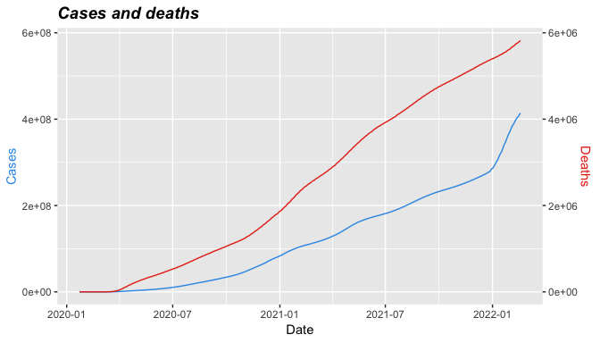<!-- -->

Now let’s repeat the previous plot, but using a logarithmic axis for the
amount of cases and deaths.

``` r
global_summary %>% select("day","cases","deaths") %>% 
  ggplot(aes(x=day)) + 
  geom_line(aes(y=cases,colour="Cases")) + 
  geom_line(aes(y=deaths,colour="Deaths")) +
  xlab("Date") + 
  ylab("Number of people") + 
  scale_y_continuous(trans='log10') +
  scale_colour_manual("", breaks = c("Cases", "Deaths"), values = c(cases_color,deaths_color)) + 
  ggtitle("Cases and deaths")+
  theme(plot.title = element_text(size=14, face="bold.italic"))
```

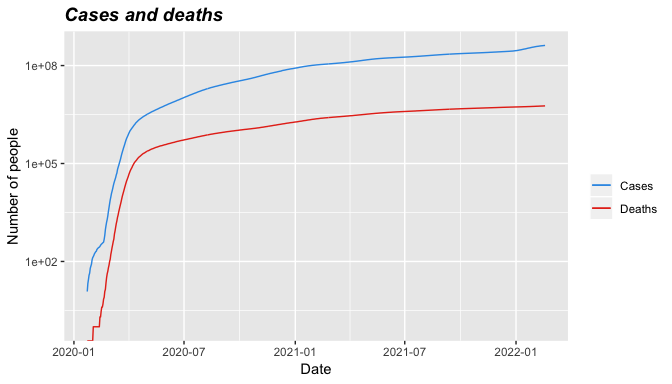<!-- -->

The first plot shows how cases and deaths has risen consistently since
the start of 2020. The plot also shows how since 2022 the number of
cases per day increased considerably due to the omicron variant.

As the nature of contagion is exponential, the second graph is very
useful to understand the evolution of the pandemic. The logarithmic
transformation serves to see how high exponential growth in the first 3
months decayed until today. The wave because of omicron at the beginning
of 2022 produces an upward turn of the cases, but deaths stayed flat.

In order to further explore the evolution of cases and deaths through
time, lets plot also the rate of change for these 2 variables.

``` r
global_summary %>% select("day","cases","deaths","cases_day_wa","deaths_day_wa") %>% 
  ggplot(aes(x=day),yaxp = c(0, 1, 10)) + 
  geom_line(aes(y=100*cases_day_wa/cases,colour="Cases")) + 
  geom_line(aes(y=100*deaths_day_wa/deaths,colour="Deaths")) +
  xlab("Date") + 
  ylab("Percentage increase") + 
  scale_y_continuous(trans='log10',breaks=c(0,0.1,0.2,0.5,1,2,5,10,20,50,100)) +
  scale_colour_manual("", breaks = c("Cases", "Deaths"), values = c(cases_color,deaths_color)) + 
  ggtitle("Rate of change for deaths and confirmed cases") +
  theme(plot.title = element_text(size=14, face="bold.italic"))
```

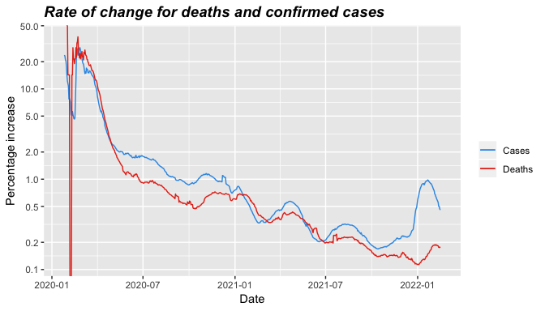<!-- -->

This plot displays how cases and deaths increased daily by approximate
30% at the beginning of the pandemic, and has decayed until reaching
levels of daily change of 0.2% and 0.1% for cases and deaths
respectively.

Now let’s plot the number of daily cases and deaths.

``` r
global_summary %>% select("day","cases_day_wa") %>% 
  ggplot(aes(x=day, y=cases_day_wa)) + 
  geom_line() + 
  xlab("day")+ 
  ylab("Daily infections") +
  ggtitle("Weekly average of cases per day") +
  theme(plot.title = element_text(size=14, face="bold.italic"))
```

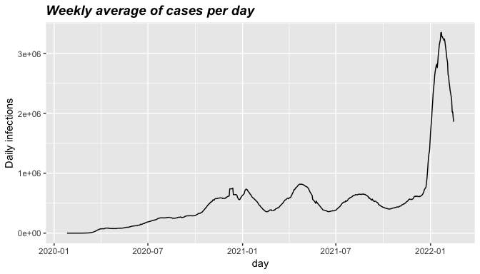<!-- -->

``` r
global_summary %>% select("day","deaths_day_wa") %>% 
  ggplot(aes(x=day, y=deaths_day_wa)) + 
  geom_line() + 
  xlab("day") +
  ylab("Daily deaths") +
  ggtitle("Weekly average of deaths per day") +
  theme(plot.title = element_text(size=14, face="bold.italic"))
```

<!-- -->

In the plot of daily cases a steady increase in all 2020 is shown ending
in a peak of cases at the end of the year. During 2021 there were
another 2 similar peaks, and then in December the number of cases
skyrocketed because of the omicron variant. The plot of daily deaths has
some considerable differences including an early peak in April and the
absence of immense growth in the end of 2021. The early peak is probably
not seen in the cases plot because detection was not as good at the
beginning of the pandemic, and there is no mortality increase in the end
of 2021 thanks to the rollout of the vaccine and the lower severity of
omicron infections. The following plot displays how the measured
mortality peaks in April (probably because of lack of diagnostic tools)
stabilizes at 2% in 2021 and turn downward in 2022 for the reasons
mentioned.

``` r
global_summary %>% select("day","mortality_rate") %>% 
  ggplot(aes(x=day, y=mortality_rate)) + 
  geom_line() + 
  xlab("day") +
  ylab("Mortality rate (deaths/cases)") +
  ggtitle("Acumulated mortality") +
  theme(plot.title = element_text(size=14, face="bold.italic"))
```

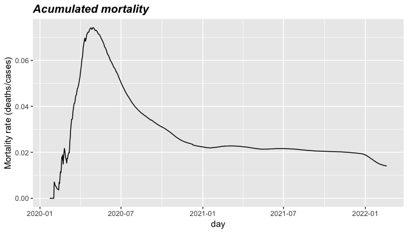<!-- -->

## Analysis by region

The next two plots show how the pandemic evolved in each continent. The
Americas and Europe were the continents that took the most damage as
they display more infections and deaths than the other continents. The
number of deaths in Europe clearly display 2 valleys while the graph for
the Americas is considerably flatter.

``` r
global_summary_region %>% select("day","cases_day_per_million","region") %>% 
  ggplot(aes(x=day, y=cases_day_per_million,colour=region)) + 
  geom_line() + 
  xlab("day")+ 
  ylab("Daily infections") +
  ggtitle("Infections per million people") +
  theme(plot.title = element_text(size=14, face="bold.italic"))
```

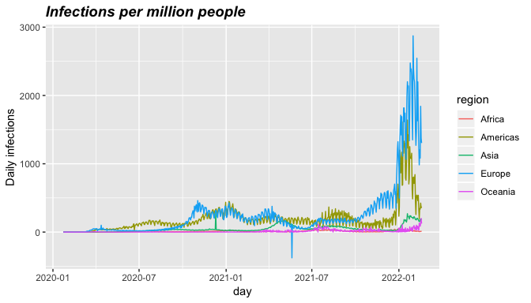<!-- -->

``` r
global_summary_region %>% select("day","deaths_day_per_million","region") %>% 
  ggplot(aes(x=day, y=deaths_day_per_million,colour=region)) + 
  geom_line() + 
  xlab("day") +
  ylab("Daily deaths") +
  ggtitle("Deaths per million people") +
  theme(plot.title = element_text(size=14, face="bold.italic"))
```

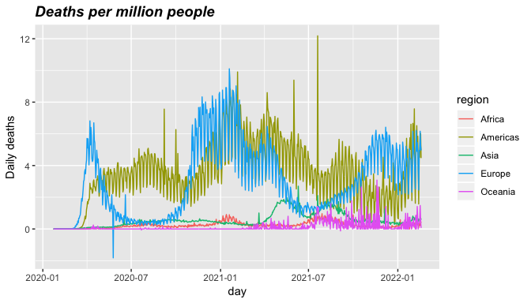<!-- -->

## Analysis by country

Now let’s analyze how the outbreak of COVID affected the different
countries. Seeking to avoid outliers produced by small countries it was
decided to filter all countries with less than 1 million habitants.

``` r
summary_total <- summary %>% group_by(Country) %>% summarize(
  cases=sum(cases_day),
  deaths=sum(deaths_day),
  population=mean(Population),
  region=first(region)
)
summary_total["mortality_rate"] <- summary_total["deaths"]/summary_total["cases"]
summary_total["deaths_per_million"] <- 1000000*summary_total["deaths"]/summary_total["population"]
summary_total["cases_per_million"] <- 1000000*summary_total["cases"]/summary_total["population"]
summary_total_big <- summary_total %>% filter(population > 1000000)
```

Let’s organize countries by the normalized amount of deaths, cases and
by the mortality rate to see what we can find.

### Least deaths per million people

``` r
head(summary_total_big[order(summary_total_big$deaths_per_million),],15)
```

| Country                  |  cases | deaths | population | region  | mortality\_rate | deaths\_per\_million | cases\_per\_million |
|:-------------------------|-------:|-------:|-----------:|:--------|----------------:|---------------------:|--------------------:|
| Burundi                  |  37947 |     38 |   11890781 | Africa  |       0.0010014 |             3.195753 |           3191.2958 |
| New Zealand              |  28751 |     53 |    4822233 | Oceania |       0.0018434 |            10.990759 |           5962.1756 |
| Chad                     |   7216 |    190 |   16425859 | Africa  |       0.0263304 |            11.567127 |            439.3073 |
| South Sudan              |  16903 |    137 |   11193729 | Africa  |       0.0081051 |            12.238996 |           1510.0419 |
| Niger                    |   8728 |    303 |   24206636 | Africa  |       0.0347159 |            12.517229 |            360.5623 |
| Tajikistan               |  17783 |    125 |    9537642 | Asia    |       0.0070292 |            13.105965 |           1864.5070 |
| Tanzania                 |  33549 |    796 |   59734213 | Africa  |       0.0237265 |            13.325697 |            561.6379 |
| Benin                    |  26567 |    163 |   12123198 | Africa  |       0.0061354 |            13.445297 |           2191.4185 |
| Congo (Kinshasa)         |  85834 |   1316 |   89561404 | Africa  |       0.0153319 |            14.693829 |            958.3816 |
| Nigeria                  | 254221 |   3142 |  206139587 | Africa  |       0.0123593 |            15.242099 |           1233.2469 |
| Sierra Leone             |   7661 |    125 |    7976985 | Africa  |       0.0163164 |            15.670081 |            960.3879 |
| Burkina Faso             |  20744 |    375 |   20903278 | Africa  |       0.0180775 |            17.939770 |            992.3802 |
| Central African Republic |  14187 |    113 |    4829764 | Africa  |       0.0079650 |            23.396588 |           2937.4106 |
| Eritrea                  |   9683 |    103 |    3546427 | Africa  |       0.0106372 |            29.043316 |           2730.3537 |
| Cote d’Ivoire            |  81322 |    791 |   26378275 | Africa  |       0.0097268 |            29.986798 |           3082.9158 |

### Most deaths per million people

``` r
tail(summary_total_big[order(summary_total_big$deaths_per_million),],15)
```

| Country                |    cases | deaths | population | region   | mortality\_rate | deaths\_per\_million | cases\_per\_million |
|:-----------------------|---------:|-------:|-----------:|:---------|----------------:|---------------------:|--------------------:|
| US                     | 78423524 | 934321 |  329466283 | Americas |       0.0119138 |             2835.862 |            238032.0 |
| Poland                 |  5481938 | 109509 |   37846605 | Europe   |       0.0199763 |             2893.496 |            144846.2 |
| Slovenia               |   871951 |   6174 |    2078932 | Europe   |       0.0070807 |             2969.794 |            419422.6 |
| Lithuania              |   847993 |   8219 |    2722291 | Europe   |       0.0096923 |             3019.148 |            311499.8 |
| Brazil                 | 28072238 | 643340 |  212559409 | Americas |       0.0229173 |             3026.636 |            132067.7 |
| Romania                |  2643614 |  62323 |   19237682 | Europe   |       0.0235749 |             3239.631 |            137418.5 |
| Slovakia               |  1964411 |  18201 |    5459643 | Europe   |       0.0092654 |             3333.734 |            359805.8 |
| Czechia                |  3483932 |  38106 |   10708982 | Europe   |       0.0109376 |             3558.321 |            325328.0 |
| Croatia                |  1035632 |  14729 |    4105268 | Europe   |       0.0142222 |             3587.829 |            252269.0 |
| Georgia                |  1526205 |  15771 |    3989175 | Asia     |       0.0103335 |             3953.449 |            382586.6 |
| North Macedonia        |   291820 |   8869 |    2083380 | Europe   |       0.0303920 |             4257.025 |            140070.5 |
| Hungary                |  1746424 |  43066 |    9660350 | Europe   |       0.0246595 |             4458.017 |            180782.7 |
| Bosnia and Herzegovina |   367641 |  15263 |    3280815 | Europe   |       0.0415160 |             4652.198 |            112057.8 |
| Bulgaria               |  1063808 |  34973 |    6948445 | Europe   |       0.0328753 |             5033.212 |            153100.2 |
| Peru                   |  3481752 | 209110 |   32971846 | Americas |       0.0600588 |             6342.077 |            105597.7 |

The countries with higher mortality rates are principally countries from
eastern Europe where omicron has been particularly severe, Peru where
the health system collapsed catastrophically in the first wave, and
countries like Brazil and the USA where distancing and other measures
were famously dismissed by their presidents.

On the other hand, very surprisingly the countries with the least number
of deaths per million people are African countries with limited
exceptions like New Zeland and Tanzania. In
[this](https://www.bbc.com/news/world-africa-54418613) BBC report Anne
Soy points to the early adoption of distancing and other measures, the
support from the public, the relatively young population, the warmer
climate and the good health systems which had previous experience
dealing with viruses like Ebola.

Now let’s explore the number of reported infections

### Least reported infections per million people

``` r
head(summary_total_big[order(summary_total_big$cases_per_million),],15)
```

| Country          |  cases | deaths | population | region | mortality\_rate | deaths\_per\_million | cases\_per\_million |
|:-----------------|-------:|-------:|-----------:|:-------|----------------:|---------------------:|--------------------:|
| Niger            |   8728 |    303 |   24206636 | Africa |       0.0347159 |             12.51723 |            360.5623 |
| Yemen            |  11731 |   2115 |   29825968 | Asia   |       0.1802915 |             70.91136 |            393.3150 |
| Chad             |   7216 |    190 |   16425859 | Africa |       0.0263304 |             11.56713 |            439.3073 |
| Tanzania         |  33549 |    796 |   59734213 | Africa |       0.0237265 |             13.32570 |            561.6379 |
| Taiwan\*         |  19863 |    852 |   23816775 | Asia   |       0.0428938 |             35.77311 |            833.9920 |
| Congo (Kinshasa) |  85834 |   1316 |   89561404 | Africa |       0.0153319 |             14.69383 |            958.3816 |
| Sierra Leone     |   7661 |    125 |    7976985 | Africa |       0.0163164 |             15.67008 |            960.3879 |
| Burkina Faso     |  20744 |    375 |   20903278 | Africa |       0.0180775 |             17.93977 |            992.3802 |
| Nigeria          | 254221 |   3142 |  206139587 | Africa |       0.0123593 |             15.24210 |           1233.2469 |
| Sudan            |  59939 |   3831 |   43849269 | Africa |       0.0639150 |             87.36748 |           1366.9327 |
| Liberia          |   7360 |    290 |    5057677 | Africa |       0.0394022 |             57.33858 |           1455.2135 |
| Mali             |  30333 |    717 |   20250834 | Africa |       0.0236376 |             35.40595 |           1497.8642 |
| South Sudan      |  16903 |    137 |   11193729 | Africa |       0.0081051 |             12.23900 |           1510.0419 |
| Somalia          |  26260 |   1345 |   15893219 | Africa |       0.0512186 |             84.62729 |           1652.2770 |
| Tajikistan       |  17783 |    125 |    9537642 | Asia   |       0.0070292 |             13.10596 |           1864.5070 |

### Most reported infections per million people

``` r
tail(summary_total_big[order(summary_total_big$cases_per_million),],15)
```

| Country     |    cases | deaths | population | region | mortality\_rate | deaths\_per\_million | cases\_per\_million |
|:------------|---------:|-------:|-----------:|:-------|----------------:|---------------------:|--------------------:|
| Bahrain     |   485163 |   1435 |    1701583 | Asia   |       0.0029578 |             843.3324 |            285124.5 |
| Latvia      |   567176 |   5093 |    1886202 | Europe |       0.0089796 |            2700.1350 |            300697.4 |
| Belgium     |  3494223 |  29920 |   11492641 | Europe |       0.0085627 |            2603.4051 |            304040.0 |
| Switzerland |  2664194 |  13012 |    8654618 | Europe |       0.0048840 |            1503.4748 |            307835.0 |
| Portugal    |  3163869 |  20759 |   10196707 | Europe |       0.0065613 |            2035.8533 |            310283.4 |
| Lithuania   |   847993 |   8219 |    2722291 | Europe |       0.0096923 |            3019.1482 |            311499.8 |
| Czechia     |  3483932 |  38106 |   10708982 | Europe |       0.0109376 |            3558.3214 |            325328.0 |
| France      | 21572490 | 133523 |   65249843 | Europe |       0.0061895 |            2046.3344 |            330613.7 |
| Estonia     |   448666 |   2152 |    1326539 | Europe |       0.0047964 |            1622.2667 |            338223.0 |
| Netherlands |  6012521 |  21465 |   17134873 | Europe |       0.0035700 |            1252.7084 |            350893.8 |
| Slovakia    |  1964411 |  18201 |    5459643 | Europe |       0.0092654 |            3333.7345 |            359805.8 |
| Georgia     |  1526205 |  15771 |    3989175 | Asia   |       0.0103335 |            3953.4490 |            382586.6 |
| Israel      |  3523457 |   9828 |    8655541 | Asia   |       0.0027893 |            1135.4576 |            407075.3 |
| Slovenia    |   871951 |   6174 |    2078932 | Europe |       0.0070807 |            2969.7941 |            419422.6 |
| Denmark     |  2519057 |   4250 |    5837213 | Europe |       0.0016871 |             728.0872 |            431551.3 |

The countries with the least number of reported infections per million
are African countries for the reasons commented before and also probably
influenced by under reporting. The countries with most number of cases
per million are countries from eastern Europe that also have relatively
large amounts of deaths, and countries with low deaths per million that
did a very good job in testing and isolating infected people.

The two tables below display the countries with higher and lower
mortality rates.

### Lower mortality rates

``` r
head(summary_total_big[order(summary_total_big$mortality_rate),],15)
```

| Country              |   cases | deaths | population | region  | mortality\_rate | deaths\_per\_million | cases\_per\_million |
|:---------------------|--------:|-------:|-----------:|:--------|----------------:|---------------------:|--------------------:|
| Burundi              |   37947 |     38 |   11890781 | Africa  |       0.0010014 |             3.195753 |            3191.296 |
| Norway               | 1119204 |   1548 |    5421242 | Europe  |       0.0013831 |           285.543423 |          206447.895 |
| Denmark              | 2519057 |   4250 |    5837213 | Europe  |       0.0016871 |           728.087188 |          431551.324 |
| Singapore            |  551519 |    937 |    5850343 | Asia    |       0.0016989 |           160.161550 |           94271.225 |
| New Zealand          |   28751 |     53 |    4822233 | Oceania |       0.0018434 |            10.990759 |            5962.176 |
| Qatar                |  353346 |    661 |    2881060 | Asia    |       0.0018707 |           229.429446 |          122644.443 |
| Mongolia             |  893721 |   2157 |    3278292 | Asia    |       0.0024135 |           657.964574 |          272617.875 |
| United Arab Emirates |  873092 |   2292 |    9890400 | Asia    |       0.0026252 |           231.739869 |           88276.713 |
| Cyprus               |  302739 |    807 |    1207361 | Asia    |       0.0026657 |           668.399923 |          250744.392 |
| Israel               | 3523457 |   9828 |    8655541 | Asia    |       0.0027893 |          1135.457622 |          407075.306 |
| Bahrain              |  485163 |   1435 |    1701583 | Asia    |       0.0029578 |           843.332356 |          285124.499 |
| Netherlands          | 6012521 |  21465 |   17134873 | Europe  |       0.0035700 |          1252.708439 |          350893.818 |
| Finland              |  605046 |   2277 |    5540718 | Europe  |       0.0037634 |           410.957569 |          109199.927 |
| Korea, South         | 1858008 |   7354 |   51269183 | Asia    |       0.0039580 |           143.438993 |           36240.250 |
| Kuwait               |  610801 |   2527 |    4270563 | Asia    |       0.0041372 |           591.725260 |          143025.873 |

### Higher mortality rates

``` r
tail(summary_total_big[order(summary_total_big$mortality_rate),],15)
```

| Country                |   cases | deaths | population | region   | mortality\_rate | deaths\_per\_million | cases\_per\_million |
|:-----------------------|--------:|-------:|-----------:|:---------|----------------:|---------------------:|--------------------:|
| Bulgaria               | 1063808 |  34973 |    6948445 | Europe   |       0.0328753 |           5033.21247 |         153100.1541 |
| Burma                  |  559314 |  19322 |   54409794 | Asia     |       0.0345459 |            355.11989 |          10279.6566 |
| Niger                  |    8728 |    303 |   24206636 | Africa   |       0.0347159 |             12.51723 |            360.5623 |
| Liberia                |    7360 |    290 |    5057677 | Africa   |       0.0394022 |             57.33858 |           1455.2135 |
| Bosnia and Herzegovina |  367641 |  15263 |    3280815 | Europe   |       0.0415160 |           4652.19770 |         112057.8271 |
| Taiwan\*               |   19863 |    852 |   23816775 | Asia     |       0.0428938 |             35.77311 |            833.9920 |
| Ecuador                |  808925 |  35105 |   17643060 | Americas |       0.0433971 |           1989.73421 |          45849.4728 |
| Afghanistan            |  171857 |   7526 |   38928341 | Asia     |       0.0437922 |            193.32958 |           4414.7014 |
| Egypt                  |  465423 |  23632 |  102334403 | Africa   |       0.0507753 |            230.92918 |           4548.0600 |
| Somalia                |   26260 |   1345 |   15893219 | Africa   |       0.0512186 |             84.62729 |           1652.2770 |
| Syria                  |   53403 |   3044 |   17500657 | Asia     |       0.0570005 |            173.93633 |           3051.4854 |
| Mexico                 | 5366405 | 314598 |  127792286 | Americas |       0.0586236 |           2461.79179 |          41993.1842 |
| Peru                   | 3481752 | 209110 |   32971846 | Americas |       0.0600588 |           6342.07742 |         105597.7272 |
| Sudan                  |   59939 |   3831 |   43849269 | Africa   |       0.0639150 |             87.36748 |           1366.9327 |
| Yemen                  |   11731 |   2115 |   29825968 | Asia     |       0.1802915 |             70.91136 |            393.3150 |

Assuming (probably incorrectly but not to far from reality) that the
mortality rate of the virus is homogeneous trough the world, it can be
concluded that the reported mortality rates correlate negatively with
the effectiveness of the countries testing campaigns, and that the lower
mortality rates are close to the virus real mean. The tables above then
show how developed countries principaly from Europe and Asia excelled
regarding their testing campaigns while countries from Africa, Latin
America and the Middle East were not able to diagnosticate their
citizens effectively. It can also be concluded that the real mortality
of the virus is close to 0.15%.

Finally let’s visualize a scatter plot of the deaths vs number of
infections per million.

``` r
summary_total_big %>% select("deaths_per_million","mortality_rate","Country","population","region") %>% 
  ggplot(aes(x=mortality_rate, y=deaths_per_million,label=Country,color=region)) + 
  geom_text(
    aes(label=ifelse(deaths_per_million>3000|mortality_rate>0.035,as.character(Country),'')),
    size=3,
    hjust=-0.1, 
    vjust=-0.1
  ) +
  geom_point(aes(size=population)) + 
  xlab("Mortality rate (deaths/cases)") +
  ylab("Deaths per million") +
  xlim(0, 0.1) +
  ggtitle("Cases vs Deaths per million") +
  theme(plot.title = element_text(size=14, face="bold.italic"))
```

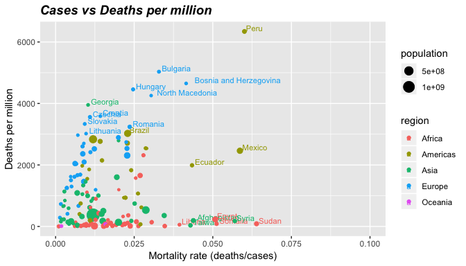<!-- -->

The countries that appear lower on the y axis have the lowest number of
deaths and represent places where the pandemic had small impact. while
the x axis correlates with the inversely with the effectivity of the
diagnostic effort of the country. This plot shows a cluster of African
countries with high mortality rates and low number of deaths per million
and a cluster of eastern European countries with high death toll as
discussed before.

### Correlation between mortality rates and deaths

Now let’s use a lineal model to model the relation between the mortality
rate and the number of deaths per million.

``` r
lin_reg <- lm(deaths_per_million ~ mortality_rate,data = summary_total_big)
summary(lin_reg)
```

    ## 
    ## Call:
    ## lm(formula = deaths_per_million ~ mortality_rate, data = summary_total_big)
    ## 
    ## Residuals:
    ##     Min      1Q  Median      3Q     Max 
    ## -1780.5 -1000.7  -477.4   658.5  5053.5 
    ## 
    ## Coefficients:
    ##                Estimate Std. Error t value Pr(>|t|)    
    ## (Intercept)      1007.4      142.1   7.089 4.94e-11 ***
    ## mortality_rate   4681.5     5585.6   0.838    0.403    
    ## ---
    ## Signif. codes:  0 '***' 0.001 '**' 0.01 '*' 0.05 '.' 0.1 ' ' 1
    ## 
    ## Residual standard error: 1253 on 150 degrees of freedom
    ## Multiple R-squared:  0.004661,   Adjusted R-squared:  -0.001974 
    ## F-statistic: 0.7025 on 1 and 150 DF,  p-value: 0.4033

This summary shows that the coefficient for mortality rate estimated is
not significative, and as seen in the plot below the linear fit is not
very good.

``` r
summary_total_big <- summary_total_big %>% mutate(pred=predict(lin_reg))
summary_total_big %>% select("deaths_per_million","mortality_rate","Country","pred", "region") %>% 
  ggplot(aes(x=mortality_rate)) + 
  geom_point(aes(y=deaths_per_million,colour=region)) +
  geom_point(aes(y=pred),shape=3) + 
  xlab("Mortality rate (deaths/cases)") +
  ylab("Deaths per million") +
  xlim(0, 0.1) +
  ggtitle("Cases vs Deaths per million") +
  theme(plot.title = element_text(size=14, face="bold.italic"))
```

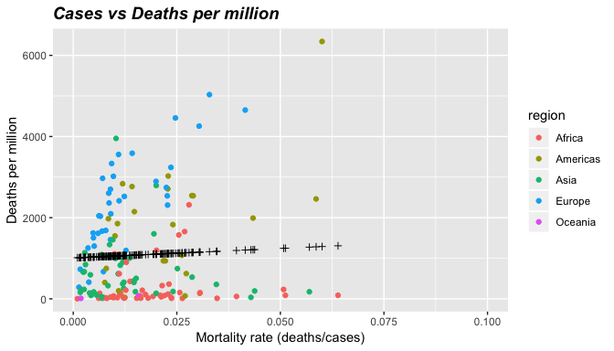<!-- -->

As seen in the previous differents regions of the world seem to have
different relations between the mortality rate and the number of deaths
per million people. In order to consider this effect in the analysis
let’s estimate a mixed linear model. By using the lme4 library we can
estimate an intercept and coefficient for every region. For more
infomation regarding mixed linear models you can refer to the
[documentation](https://rdrr.io/cran/lme4/man/lmer.html) of lme4.

``` r
mixed_model <- lmer(deaths_per_million ~  1 + mortality_rate + (1 + mortality_rate|region),summary_total_big)
summary_total_big["prediction"] = mixed_model %>% predict(summary_total_big)
summary(mixed_model)
```

    ## Linear mixed model fit by REML ['lmerMod']
    ## Formula: deaths_per_million ~ 1 + mortality_rate + (1 + mortality_rate |  
    ##     region)
    ##    Data: summary_total_big
    ## 
    ## REML criterion at convergence: 2431.7
    ## 
    ## Scaled residuals: 
    ##     Min      1Q  Median      3Q     Max 
    ## -2.6061 -0.4544 -0.2648  0.4003  4.4359 
    ## 
    ## Random effects:
    ##  Groups   Name           Variance  Std.Dev. Corr
    ##  region   (Intercept)    1.174e+05   342.7      
    ##           mortality_rate 2.239e+09 47316.2  0.82
    ##  Residual                5.667e+05   752.8      
    ## Number of obs: 152, groups:  region, 5
    ## 
    ## Fixed effects:
    ##                Estimate Std. Error t value
    ## (Intercept)       653.9      186.4   3.507
    ## mortality_rate  26923.4    22427.8   1.200
    ## 
    ## Correlation of Fixed Effects:
    ##             (Intr)
    ## mortalty_rt 0.578

The mixed linear model estimated is based on the asumption that the
intercept and coeficient of the mortality rate is composed by a gobal
fixed effect and a random effect that has a normal distribution centered
at 0. The model also asumes that the residuals are normally distributed
and independent of the predicted values. Based on this, lme4 finds a
standard error and a t statistic asociated with the fixed effects. The
summary of the model show that the intercept is positive and significant
at a 95% level, while the coefficient of the mortality rate in only
significant at the 80% level. The positive coefficient of the mortality
rate indicates that higher mortality rates (posible product of bad
diagnostic campaigns) relates to a higher deaths in the country.

The next two plots show that the residuals has relatively low
heteroscedasticity and distribute aproximately normal.

``` r
plot(fitted(mixed_model), resid(mixed_model))
```

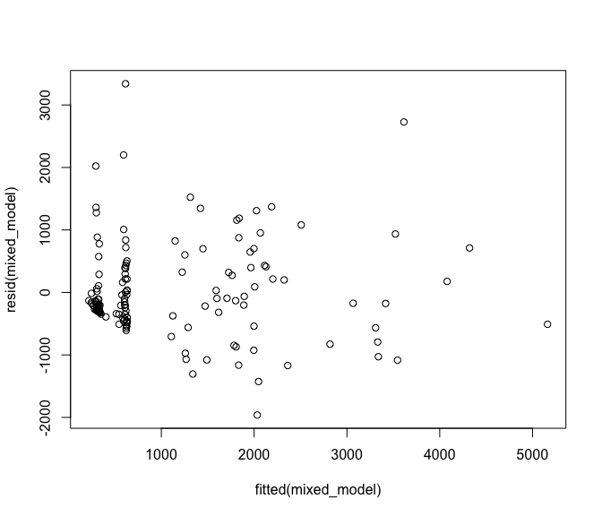<!-- -->

``` r
qqnorm(resid(mixed_model))
qqline(resid(mixed_model), col="red")
```

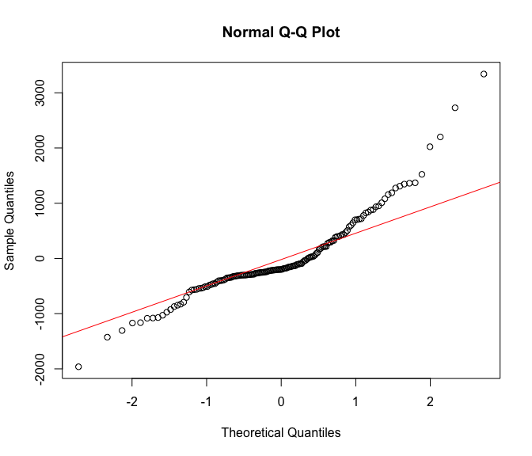<!-- -->

Now let’s visualize the resulting regresions for every region.

``` r
summary_total_big %>% select("deaths_per_million","mortality_rate","Country","prediction","region") %>%
  ggplot(aes(x=mortality_rate)) +
  geom_point(aes(y=deaths_per_million,colour=region)) +
  geom_line(aes(y=prediction,colour=region)) +
  xlab("Mortality rate (deaths/cases)") +
  ylab("Deaths per million") +
  xlim(0, 0.1) +
  ggtitle("Cases vs Deaths per million") +
  theme(plot.title = element_text(size=14, face="bold.italic"))
```

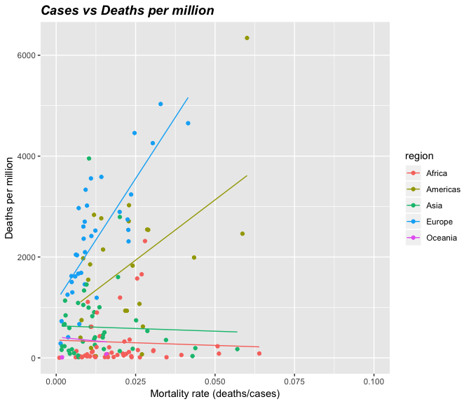<!-- -->

The plot before shows a much beter fit than the model that did not
consider the region of the country, but it still can be improved. This
analysis hints of a positive correlation between mortality rate and
deaths per million in Europe and the Americas, while in Africa, Asia and
Oceania no correlation was captured. This does not imply that there is
no relation between the two variables, including some predictive unused
attribute might reduce the error and reveal a stronger relation between
the pandemic statistics analyzed. So in order to deepen this analysis
one might add other variables like economic output, mobility trends and
a more specific region. Another possible next steps are consider the
time dimension, handle outliers like Syria and Afghanistan where war
raged during the pandemic, or include that information in the model.

#### Session info

``` r
sessionInfo()
```

    ## R version 3.6.1 (2019-07-05)
    ## Platform: x86_64-apple-darwin13.4.0 (64-bit)
    ## Running under: macOS  10.16
    ## 
    ## Matrix products: default
    ## BLAS/LAPACK: /opt/anaconda3/envs/R_maestria/lib/R/lib/libRblas.dylib
    ## 
    ## locale:
    ## [1] C
    ## 
    ## attached base packages:
    ## [1] stats     graphics  grDevices utils     datasets  methods   base     
    ## 
    ## other attached packages:
    ##  [1] lme4_1.1-21     Matrix_1.2-17   lemon_0.4.3     zoo_1.8-6      
    ##  [5] forcats_0.4.0   stringr_1.4.0   dplyr_0.8.0.1   purrr_0.3.2    
    ##  [9] readr_1.3.1     tidyr_0.8.3     tibble_2.1.1    ggplot2_3.1.1  
    ## [13] tidyverse_1.2.1
    ## 
    ## loaded via a namespace (and not attached):
    ##  [1] tidyselect_0.2.5 xfun_0.6         splines_3.6.1    haven_2.1.0     
    ##  [5] lattice_0.20-38  colorspace_1.4-1 generics_0.0.2   htmltools_0.3.6 
    ##  [9] yaml_2.2.0       rlang_0.3.4      nloptr_1.2.1     pillar_1.3.1    
    ## [13] glue_1.3.1       withr_2.1.2      modelr_0.1.4     readxl_1.3.1    
    ## [17] plyr_1.8.4       munsell_0.5.0    gtable_0.3.0     cellranger_1.1.0
    ## [21] rvest_0.3.3      evaluate_0.13    labeling_0.3     knitr_1.22      
    ## [25] curl_3.3         highr_0.8        broom_0.5.2      Rcpp_1.0.1      
    ## [29] scales_1.0.0     backports_1.1.4  jsonlite_1.6     gridExtra_2.3   
    ## [33] hms_0.4.2        digest_0.6.18    stringi_1.4.3    grid_3.6.1      
    ## [37] cli_1.1.0        tools_3.6.1      magrittr_1.5     lazyeval_0.2.2  
    ## [41] crayon_1.3.4     pkgconfig_2.0.2  MASS_7.3-51.3    xml2_1.2.0      
    ## [45] lubridate_1.7.4  minqa_1.2.4      assertthat_0.2.1 rmarkdown_1.12  
    ## [49] httr_1.4.0       rstudioapi_0.10  boot_1.3-20      R6_2.4.0        
    ## [53] nlme_3.1-139     compiler_3.6.1
