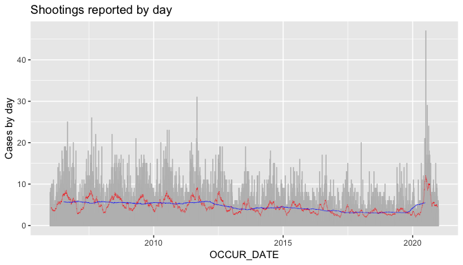
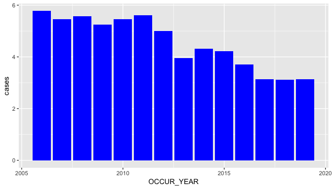
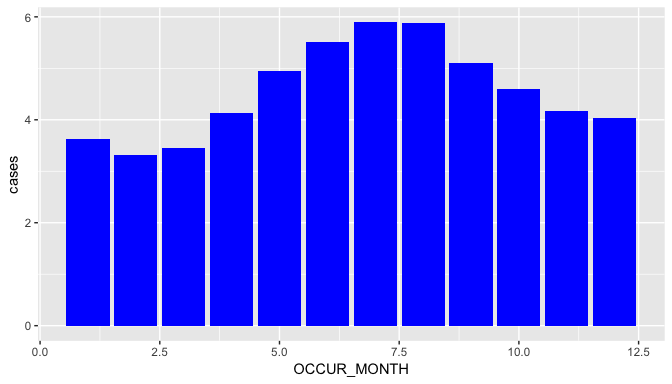
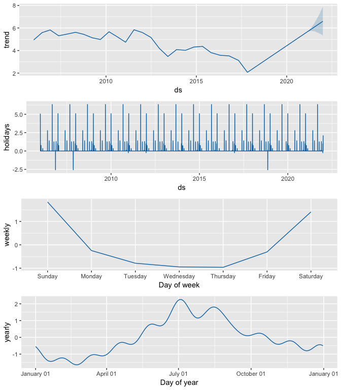
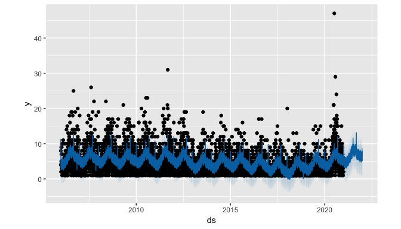
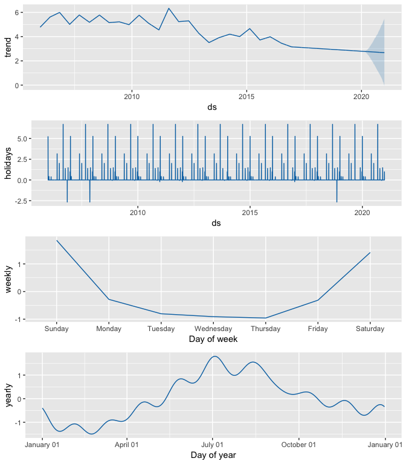
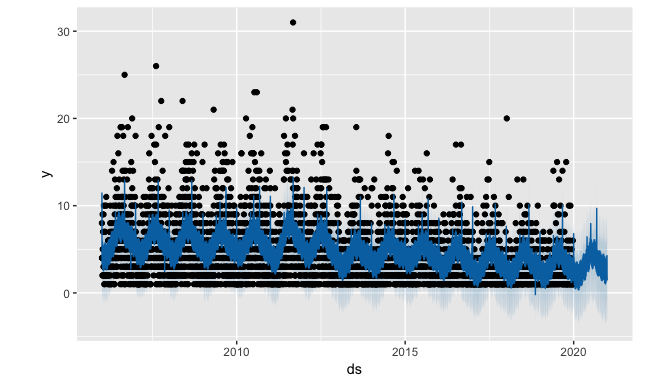

NYC shooting incidents
================
Juan Camilo Azuero
1/25/2022

In this project we are going to analyze ths distribution of shooting
incidents over time in New York City.

## Import libraries

``` r
library("tidyverse")
```

    ## Registered S3 methods overwritten by 'ggplot2':
    ##   method         from 
    ##   [.quosures     rlang
    ##   c.quosures     rlang
    ##   print.quosures rlang

    ## Registered S3 method overwritten by 'rvest':
    ##   method            from
    ##   read_xml.response xml2

    ## -- Attaching packages ------------------------------------------------------------------------------------- tidyverse 1.2.1 --

    ## v ggplot2 3.1.1       v purrr   0.3.2  
    ## v tibble  2.1.1       v dplyr   0.8.0.1
    ## v tidyr   0.8.3       v stringr 1.4.0  
    ## v readr   1.3.1       v forcats 0.4.0

    ## -- Conflicts ---------------------------------------------------------------------------------------- tidyverse_conflicts() --
    ## x dplyr::filter() masks stats::filter()
    ## x dplyr::lag()    masks stats::lag()

``` r
library("lubridate")
```

    ## 
    ## Attaching package: 'lubridate'

    ## The following object is masked from 'package:base':
    ## 
    ##     date

``` r
library("leaflet")
library("forecast")
```

    ## Registered S3 method overwritten by 'xts':
    ##   method     from
    ##   as.zoo.xts zoo

    ## Registered S3 method overwritten by 'quantmod':
    ##   method            from
    ##   as.zoo.data.frame zoo

    ## Registered S3 methods overwritten by 'forecast':
    ##   method             from    
    ##   fitted.fracdiff    fracdiff
    ##   residuals.fracdiff fracdiff

``` r
library("prophet")
```

    ## Warning: package 'prophet' was built under R version 3.6.3

    ## Loading required package: Rcpp

    ## Loading required package: rlang

    ## 
    ## Attaching package: 'rlang'

    ## The following objects are masked from 'package:purrr':
    ## 
    ##     %@%, as_function, flatten, flatten_chr, flatten_dbl,
    ##     flatten_int, flatten_lgl, flatten_raw, invoke, list_along,
    ##     modify, prepend, splice

``` r
library("zoo")
```

    ## 
    ## Attaching package: 'zoo'

    ## The following objects are masked from 'package:base':
    ## 
    ##     as.Date, as.Date.numeric

## Import data

Data is imported from a public api of NYC

``` r
nypd_shooting_data <- read_csv("https://data.cityofnewyork.us/api/views/833y-fsy8/rows.csv?accessType=DOWNLOAD")
```

    ## Parsed with column specification:
    ## cols(
    ##   INCIDENT_KEY = col_double(),
    ##   OCCUR_DATE = col_character(),
    ##   OCCUR_TIME = col_time(format = ""),
    ##   BORO = col_character(),
    ##   PRECINCT = col_double(),
    ##   JURISDICTION_CODE = col_double(),
    ##   LOCATION_DESC = col_character(),
    ##   STATISTICAL_MURDER_FLAG = col_logical(),
    ##   PERP_AGE_GROUP = col_character(),
    ##   PERP_SEX = col_character(),
    ##   PERP_RACE = col_character(),
    ##   VIC_AGE_GROUP = col_character(),
    ##   VIC_SEX = col_character(),
    ##   VIC_RACE = col_character(),
    ##   X_COORD_CD = col_double(),
    ##   Y_COORD_CD = col_double(),
    ##   Latitude = col_double(),
    ##   Longitude = col_double(),
    ##   Lon_Lat = col_character()
    ## )

## Format variables

``` r
nypd_shooting_data <-nypd_shooting_data %>% mutate(OCCUR_DATE=mdy(OCCUR_DATE))
```

## Select columns

``` r
cols_to_keep <- c("OCCUR_DATE",
                  "OCCUR_TIME",
                  "BORO",
                  "PRECINCT",
                  "LOCATION_DESC",
                  "STATISTICAL_MURDER_FLAG",
                  "PERP_AGE_GROUP",
                  "PERP_SEX",
                  "PERP_RACE",
                  "VIC_AGE_GROUP",
                  "VIC_SEX",
                  "VIC_RACE",
                  "Latitude",
                  "Longitude"
                 )
nypd_shooting_data <- nypd_shooting_data %>% select(cols_to_keep)
```

## Clean column values

``` r
# Location
clasify_location <- function(location) {
    if((location =="NONE") | is.na(location)){
        return("NA")
    } 
    if(location %in% c("BANK","CHECK CASH","LOAN COMPANY","ATM","")){
        return("Financial_institution")
    }
    if(location %in% c("MULTI DWELL - PUBLIC HOUS","MULTI DWELL - APT BUILD","PVT HOUSE")){
        return("Housing")
    }
    if(location %in% c("DOCTOR/DENTIST","GYM/FITNESS FACILITY","HOSPITAL",
                       "SCHOOL","HOTEL/MOTEL","SOCIAL CLUB/POLICY LOCATI",
                       "BAR/NIGHT CLUB","FACTORY/WAREHOUSE","STORAGE FACILITY")){
        return("Other")
    }
    if(location %in% c("GROCERY/BODEGA","FAST FOOD","COMMERCIAL BLDG","RESTAURANT/DINER",
                       "CLOTHING BOUTIQUE","SMALL MERCHANT","LIQUOR STORE","SUPERMARKET",
                       "BEAUTY/NAIL SALON","SHOE STORE","DRY CLEANER/LAUNDRY","DEPT STORE",
                       "GAS STATION","PHOTO/COPY STORE","VIDEO STORE","STORE UNCLASSIFIED",
                       "CHAIN STORE","DRUG STORE","TELECOMM. STORE","JEWELRY STORE",
                       "CANDY STORE","VARIETY STORE")){
        return("Commercial")
    }
    return("Otro no encontrado")
    
}
nypd_shooting_data["LOCATION_DESC"] <-nypd_shooting_data["LOCATION_DESC"] %>% apply(1,clasify_location)
distinct(nypd_shooting_data['LOCATION_DESC'])
```

    ## # A tibble: 5 x 1
    ##   LOCATION_DESC        
    ##   <chr>                
    ## 1 NA                   
    ## 2 Housing              
    ## 3 Commercial           
    ## 4 Other                
    ## 5 Financial_institution

``` r
# Age
clasify_age_group <- function(age_group) {
    if((age_group =="UNKNOWN") | is.na(age_group)){
        return("UNKNOWN")
    } 
    if(age_group %in% c("<18","18-24","25-44","45-64","65+")){
        return(age_group)
    }
    return("UNKNOWN")
    
}
nypd_shooting_data["PERP_AGE_GROUP"] <-nypd_shooting_data["PERP_AGE_GROUP"] %>% apply(1,clasify_age_group)
distinct(nypd_shooting_data['PERP_AGE_GROUP'])
```

    ## # A tibble: 6 x 1
    ##   PERP_AGE_GROUP
    ##   <chr>         
    ## 1 UNKNOWN       
    ## 2 18-24         
    ## 3 25-44         
    ## 4 <18           
    ## 5 45-64         
    ## 6 65+

``` r
nypd_shooting_data["VIC_AGE_GROUP"] <-nypd_shooting_data["VIC_AGE_GROUP"] %>% apply(1,clasify_age_group)
distinct(nypd_shooting_data['VIC_AGE_GROUP'])
```

    ## # A tibble: 6 x 1
    ##   VIC_AGE_GROUP
    ##   <chr>        
    ## 1 25-44        
    ## 2 65+          
    ## 3 18-24        
    ## 4 <18          
    ## 5 45-64        
    ## 6 UNKNOWN

``` r
# Sex
clean_sex <- function(sex) {
    if(sex %in% c("M","F")){
        return(sex)
    }
    return("U")
    
}
nypd_shooting_data["VIC_SEX"] <-nypd_shooting_data["VIC_SEX"] %>% apply(1,clean_sex)
distinct(nypd_shooting_data['VIC_SEX'])
```

    ## # A tibble: 3 x 1
    ##   VIC_SEX
    ##   <chr>  
    ## 1 F      
    ## 2 M      
    ## 3 U

``` r
nypd_shooting_data["PERP_SEX"] <-nypd_shooting_data["PERP_SEX"] %>% apply(1,clean_sex)
distinct(nypd_shooting_data['PERP_SEX'])
```

    ## # A tibble: 3 x 1
    ##   PERP_SEX
    ##   <chr>   
    ## 1 U       
    ## 2 M       
    ## 3 F

``` r
# Race
clean_race <- function(race) {
    if(is.na(race)){
        return("UNKNOWN")
    }
    return(race)
    
}
nypd_shooting_data["PERP_RACE"] <-nypd_shooting_data["PERP_RACE"] %>% apply(1,clean_race)
distinct(nypd_shooting_data['PERP_RACE'])
```

    ## # A tibble: 7 x 1
    ##   PERP_RACE                     
    ##   <chr>                         
    ## 1 UNKNOWN                       
    ## 2 BLACK                         
    ## 3 WHITE HISPANIC                
    ## 4 WHITE                         
    ## 5 ASIAN / PACIFIC ISLANDER      
    ## 6 BLACK HISPANIC                
    ## 7 AMERICAN INDIAN/ALASKAN NATIVE

``` r
distinct(nypd_shooting_data['VIC_RACE'])
```

    ## # A tibble: 7 x 1
    ##   VIC_RACE                      
    ##   <chr>                         
    ## 1 BLACK HISPANIC                
    ## 2 WHITE                         
    ## 3 BLACK                         
    ## 4 WHITE HISPANIC                
    ## 5 AMERICAN INDIAN/ALASKAN NATIVE
    ## 6 UNKNOWN                       
    ## 7 ASIAN / PACIFIC ISLANDER

``` r
# Extract hour of the day when the incident took place
get_hour <- function(time) {
    return(hour(hms(time))) 
}
nypd_shooting_data['OCCUR_HOUR'] <- nypd_shooting_data["OCCUR_TIME"] %>% apply(1,get_hour)
```

## Maps

Lets visualize the spatial distribution of cases.

``` r
nypd_shooting_data %>%
  select("Latitude","Longitude") %>%
  rename("lat" = "Latitude") %>%
  rename("long"="Longitude") %>%
  leaflet( width = 900) %>%
  addTiles() %>%
  #addHeatmap(group="heat", max=.6, blur = 60)
  addMarkers(clusterOptions = markerClusterOptions())
```

<!--html_preserve-->

<div id="htmlwidget-7c541e13695abe474f66" class="leaflet html-widget"
style="width:900px;height:480px;">

</div>

<script type="application/json" data-for="htmlwidget-7c541e13695abe474f66">{"x":{"options":{"crs":{"crsClass":"L.CRS.EPSG3857","code":null,"proj4def":null,"projectedBounds":null,"options":{}}},"calls":[{"method":"addTiles","args":["//{s}.tile.openstreetmap.org/{z}/{x}/{y}.png",null,null,{"minZoom":0,"maxZoom":18,"tileSize":256,"subdomains":"abc","errorTileUrl":"","tms":false,"noWrap":false,"zoomOffset":0,"zoomReverse":false,"opacity":1,"zIndex":1,"detectRetina":false,"attribution":"&copy; <a href=\"http://openstreetmap.org\">OpenStreetMap<\/a> contributors, <a href=\"http://creativecommons.org/licenses/by-sa/2.0/\">CC-BY-SA<\/a>"}]},{"method":"addMarkers","args":[[40.86905819,40.677366895,40.674885741,40.808797805,40.5977962490001,40.6335881810001,40.671858398,40.6877322940001,40.5940378070001,40.673483123,40.6706662720001,40.8311379900001,40.7008888280001,40.63906365,40.8574218790001,40.633546659,40.667574668,40.878492674,40.68317225,40.6957813340001,40.6967802230001,40.845712695,40.6874138540001,40.8555796730001,40.6694055070001,40.641939543,40.671106911,40.6964929050001,40.661516835,40.6937329880001,40.8551817580001,40.705741376,40.7860602220001,40.688134206,40.671106911,40.6712535570001,40.710974955,40.6631193520001,40.6481932020001,40.821678052,40.591615742,40.8248778190001,40.6893651870001,40.8066172090001,40.80027269,40.6630544750001,40.8422807490001,40.663161857,40.6371657290001,40.6615823830001,40.7264221900001,40.6836455120001,40.6448057360001,40.655344386,40.5967700630001,40.6942523880001,40.6667447020001,40.739529299,40.65422368,40.63495663,40.6918525730001,40.660162762,40.841451497,40.8723624190001,40.689648511,40.8482344400001,40.658293895,40.8743110180001,40.830722328,40.6768284980001,40.667134892,40.8711165560001,40.6502171870001,40.7381267640001,40.813511487,40.850367336,40.5926835390001,40.820953925,40.7554424910001,40.6907736850001,40.633740921,40.670655072,40.6533647730001,40.803230236,40.5846593900001,40.8449113080001,40.8546126460001,40.842995869,40.727708856,40.8209879280001,40.8434914790001,40.6893298100001,40.8772075890001,40.8660052650001,40.809783005,40.8248778190001,40.709295599,40.658293895,40.815603939,40.8852732400001,40.753492099,40.722182581,40.7044294300001,40.678957713,40.840781109,40.572838635,40.687875112,40.7867308670001,40.6890489420001,40.595160262,40.644723947,40.8517760840001,40.699694423,40.840782915,40.634150639,40.6650226040001,40.6814119740001,40.57604959,40.829868961,40.6902017150001,40.7882502890001,40.575085474,40.6680590350001,40.8103127850001,40.6659367440001,40.6967793360001,40.771102001,40.8443152890001,40.7977262650001,40.6420437580001,40.6303665450001,40.6390049520001,40.8552522630001,40.671106911,40.634902401,40.8229357770001,40.813949764,40.8160415730001,40.7566663910001,40.798279898,40.842319639,40.856352214,40.8376397430001,40.8154109270001,40.8697045000001,40.806449576,40.817708757,40.801147218,40.862279501,40.8449113080001,40.6482051020001,40.692259119,40.877701589,40.596569528,40.813622691,40.8238758030001,40.829883383,40.6596602480001,40.672354204,40.800880121,40.676602587,40.789803411,40.7624893890001,40.8223218520001,40.6835205090001,40.8392860270001,40.669328906,40.6513908580001,40.6829541220001,40.8135746020001,40.7356170640001,40.665081882,40.8073234460001,40.8111706110001,40.8294591170001,40.6494686450001,40.6423433800001,40.6565248680001,40.5937695590001,40.6967240600001,40.661098758,40.6515921760001,40.834228008,40.6749356060001,40.6615820540001,40.694537892,40.6942640560001,40.887451313,40.639315335,40.663133397,40.7033025580001,40.8006712420001,40.6976186790001,40.8284800440001,40.662519344,40.72618713,40.717282077,40.674091784,40.6641792030001,40.6979117500001,40.7057310970001,40.657747499,40.815732053,40.677407836,40.853281381,40.826891437,40.6941977160001,40.701016377,40.6233027260001,40.72618713,40.7977262650001,40.707030902,40.701966627,40.684863744,40.629335488,40.798629658,40.6455429170001,40.6718373320001,40.6693633150001,40.798442272,40.865665472,40.666422482,40.6597217090001,40.670817975,40.585943345,40.6472579680001,40.656002152,40.742840755,40.8835883410001,40.7477270430001,40.811733566,40.633128454,40.653198462,40.619961109,40.6688060930001,40.834209667,40.670514763,40.7981605190001,40.8780684160001,40.847367811,40.6722342630001,40.8222710410001,40.696592298,40.7027884030001,40.6389853750001,40.6811342840001,40.575816445,40.7233931280001,40.855443832,40.6727290700001,40.6595036790001,40.6903306770001,40.639518233,40.6396725710001,40.6965422750001,40.8013871050001,40.667532399,40.856401664,40.6488668750001,40.8451530240001,40.648650085,40.674745253,40.6712535570001,40.7381723170001,40.6904127270001,40.6570055220001,40.7017427110001,40.8399082010001,40.589729128,40.669328906,40.66313454,40.6508485730001,40.6809004450001,40.823101299,40.6673961650001,40.664975622,40.8339525210001,40.6664653060001,40.7989864470001,40.73983249,40.6374647800001,40.8493474430001,40.707027773,40.735782552,40.64713913,40.65422368,40.8432028300001,40.656284541,40.824940343,40.6392166320001,40.654858733,40.8634835780001,40.8098585650001,40.7001922900001,40.884143798,40.694198532,40.8161218990001,40.8583207340001,40.6906548420001,40.6782416030001,40.6870275160001,40.6339443480001,40.710207596,40.6749115200001,40.8445864130001,40.6801198200001,40.8710603590001,40.8593844600001,40.8719307260001,40.677639685,40.819096265,40.674528847,40.8959723190001,40.6261069760001,40.6583801720001,40.8104379690001,40.694013489,40.789260224,40.692661453,40.6360772300001,40.687669655,40.6793181100001,40.6630551750001,40.8188153630001,40.813511487,40.659087974,40.5864655290001,40.5743016820001,40.632423756,40.6956405350001,40.7981936670001,40.823272294,40.6786102020001,40.691981705,40.8411833690001,40.664527498,40.8296405840001,40.6757707020001,40.8379051800001,40.7039681460001,40.7725904930001,40.681685579,40.662497165,40.5797807960001,40.6859239670001,40.869172576,40.829486869,40.843486451,40.7019548650001,40.7744564280001,40.8538371880001,40.88745837,40.742962569,40.6905805600001,40.586856798,40.7109881160001,40.649323543,40.843163557,40.837549214,40.6828023620001,40.8297064240001,40.797011899,40.8135931780001,40.8302119460001,40.8539387860001,40.677906277,40.7574663520001,40.6682151420001,40.8350719860001,40.689641958,40.648596249,40.77201181,40.8201593220001,40.6247003990001,40.679532351,40.8195085890001,40.707253021,40.792553427,40.6375028480001,40.789285985,40.655344386,40.8326306810001,40.65725616,40.7522643630001,40.676529164,40.6957578860001,40.6115688630001,40.6512286080001,40.7091864970001,40.6929664850001,40.8165643680001,40.6676609080001,40.711390636,40.8205950720001,40.6591147610001,40.851507714,40.876100723,40.8739008800001,40.6425732600001,40.8873136340001,40.816087833,40.8533754700001,40.8522710710001,40.6654284190001,40.818428639,40.694628433,40.6367050870001,40.6725160830001,40.686207059,40.754199597,40.5953684410001,40.791240004,40.837549214,40.8538371880001,40.6698365990001,40.64633159,40.8071977540001,40.83113819,40.690535921,40.65844258,40.682963946,40.9034893460001,40.688134206,40.6681963190001,40.639354188,40.7898019790001,40.577555122,40.694987853,40.8843398920001,40.5785596750001,40.687450948,40.847769994,40.6611483790001,40.8321526870001,40.79792604,40.8426660530001,40.8709282550001,40.813045109,40.666002991,40.818768409,40.639136186,40.8148936330001,40.6420437580001,40.707047475,40.711390636,40.6527271320001,40.6844709710001,40.66846586,40.8312193370001,40.6362283820001,40.632925953,40.66003879,40.8373235110001,40.7007703560001,40.8410649780001,40.595214298,40.810398966,40.844816834,40.5974590970001,40.887333502,40.6278151540001,40.682729625,40.6893692840001,40.886497606,40.685612049,40.6750064300001,40.795856744,40.6883477480001,40.670139464,40.6688537640001,40.637283719,40.6691681630001,40.6931646420001,40.689273444,40.847489206,40.84194339,40.8180351840001,40.8371187430001,40.636364396,40.8587295150001,40.8085584080001,40.67020819,40.638987967,40.637213273,40.878784308,40.86012363,40.666949205,40.677958221,40.681124514,40.690534245,40.8627933450001,40.6962357020001,40.686505149,40.8527051120001,40.6614234250001,40.7554424910001,40.8452231210001,40.849877803,40.8206535350001,40.645930875,40.86905819,40.8373235110001,40.6741604090001,40.705407366,40.689273444,40.8055029760001,40.6890962040001,40.8328952090001,40.800694331,40.847679897,40.6586524090001,40.905389267,40.678337438,40.693113984,40.6380750610001,40.697022083,40.8340695540001,40.6797427130001,40.7039774520001,40.838861427,40.828674086,40.670268831,40.8350605910001,40.852536414,40.807700364,40.6422392580001,40.8904432160001,40.6456227150001,40.5988749040001,40.687478938,40.6911075940001,40.6991659500001,40.735782552,40.670365686,40.8330883610001,40.666794619,40.6740534940001,40.8287962690001,40.6537775910001,40.840102648,40.658818167,40.6681540370001,40.8535863720001,40.6389853750001,40.6960278070001,40.821237738,40.680346195,40.8711942420001,40.674881451,40.8690607770001,40.6847745160001,40.6792413920001,40.8639969180001,40.602149716,40.6938382340001,40.58762655,40.8267491830001,40.754271863,40.6894531730001,40.718477519,40.66475956,40.702177143,40.82308999,40.6751450030001,40.6900607540001,40.682148146,40.6500708290001,40.6890489420001,40.835648593,40.8135266950001,40.8148528090001,40.6713598200001,40.813709605,40.6615044050001,40.7003182920001,40.7025435520001,40.6103426930001,40.693509599,40.617558004,40.8459835890001,40.6728808730001,40.651782488,40.6754348520001,40.8207897670001,40.8011156850001,40.687669655,40.8251882810001,40.625238111,40.8577678840001,40.7016468420001,40.6510438400001,40.6858111540001,40.84438046,40.8612063190001,40.8878798480001,40.697813098,40.7867308670001,40.8404701910001,40.896992804,40.837549214,40.805437463,40.5640507700001,40.799752604,40.837229091,40.6734924090001,40.6217943520001,40.643630446,40.6823343090001,40.8893178440001,40.876892533,40.709600386,40.869923198,40.5997740020001,40.8379526430001,40.6745974070001,40.7496338940001,40.6569189420001,40.673740653,40.703501144,40.8115752350001,40.695068862,40.8450526460001,40.819096265,40.6877322940001,40.666928983,40.8351266780001,40.7225825800001,40.6690508340001,40.857952353,40.8505391150001,40.7627578780001,40.6604681370001,40.630512353,40.843762575,40.6893298100001,40.6676808650001,40.665219107,40.6639182690001,40.637531869,40.696078721,40.5791618100001,40.661912333,40.673052322,40.670655072,40.7020533730001,40.695259014,40.8341378860001,40.677659417,40.6365736160001,40.900646341,40.8096294540001,40.8568885440001,40.648777393,40.8385717840001,40.8640572780001,40.838550823,40.6814778730001,40.8452231210001,40.6390778370001,40.6957804480001,40.6736928980001,40.690129121,40.631227203,40.6374958530001,40.7827825790001,40.6800477400001,40.6971688250001,40.6752037740001,40.699637566,40.685730705,40.8269474030001,40.6861054980001,40.8466374820001,40.854152605,40.82799221,40.7517303020001,40.8431123570001,40.668481323,40.6627737600001,40.83427204,40.701556634,40.6743672110001,40.869399796,40.8111774480001,40.6714126050001,40.708727362,40.6027461670001,40.639354188,40.854446507,40.6154918230001,40.575520628,40.666360153,40.8420628630001,40.686587133,40.7105482590001,40.5950426630001,40.814477606,40.80520883,40.6723232350001,40.8514080240001,40.6630544750001,40.6816475210001,40.675792969,40.614624398,40.6655196460001,40.6945930260001,40.8225699160001,40.667443699,40.748408387,40.8366536350001,40.7177778940001,40.664873383,40.689273444,40.7575424870001,40.8046518790001,40.71723196,40.675504845,40.8002517850001,40.8297459200001,40.827314249,40.7222723840001,40.8083729470001,40.837229091,40.836236102,40.821181429,40.829596962,40.64075466,40.6714126050001,40.662749214,40.827565163,40.5776747830001,40.6727905540001,40.820954301,40.8399082010001,40.671106911,40.707519657,40.869406375,40.6108798540001,40.837261863,40.661912333,40.6906278370001,40.6963022140001,40.6683494800001,40.667532399,40.686525917,40.685730705,40.6379359430001,40.7007337650001,40.6947274730001,40.811589445,40.6245433120001,40.67650732,40.59125225,40.5933896560001,40.6397868490001,40.844139215,40.6798067020001,40.8229123080001,40.852141316,40.6920553850001,40.7031373680001,40.6512286080001,40.840387902,40.802138622,40.8328952090001,40.8083729470001,40.6367948640001,40.6560268790001,40.6890489420001,40.692661453,40.8103960190001,40.6716051600001,40.8611157140001,40.8643440650001,40.796789371,40.679675988,40.83594098,40.6466946290001,40.821177307,40.887333502,40.645079439,40.835768665,40.6691446730001,40.8354052870001,40.838559623,40.6991659500001,40.6965570020001,40.605717815,40.6841942610001,40.862589502,40.5886805660001,40.648650085,40.802292703,40.827114964,40.811337032,40.798279898,40.7867536040001,40.6330213310001,40.590973041,40.591917444,40.7866196510001,40.843901255,40.690015423,40.8417644460001,40.6309203600001,40.629739386,40.6927633130001,40.677344154,40.6897355410001,40.8345169180001,40.692661453,40.670655072,40.8856552410001,40.627005545,40.708245456,40.551995821,40.838289462,40.6610793520001,40.679643809,40.6785105290001,40.6753994210001,40.826225413,40.66194182,40.6622057220001,40.813965501,40.682729625,40.71134255,40.6524273430001,40.77737059,40.704669203,40.641939543,40.7964237900001,40.8514877740001,40.853960274,40.83450371,40.592856795,40.877790755,40.6677153910001,40.8854500780001,40.8065385740001,40.67729374,40.6557193290001,40.863089159,40.854264857,40.7594506950001,40.852141316,40.6977166400001,40.8156799880001,40.7551166590001,40.6971688250001,40.8351029560001,40.6850623980001,40.8350936040001,40.6569224670001,40.720255223,40.877559682,40.670365686,40.8638386850001,40.6923951850001,40.603189378,40.87215072,40.621416928,40.851316432,40.6621832660001,40.744039883,40.6054742850001,40.8809930680001,40.810269442,40.7298376540001,40.8236419310001,40.854724898,40.679700408,40.5974919670001,40.823505498,40.8433289390001,40.783703168,40.6047733440001,40.659007021,40.7101471,40.831008598,40.8248778190001,40.8201521180001,40.8105243800001,40.672707003,40.609777213,40.684419022,40.6859617750001,40.70322945,40.8459835890001,40.642476193,40.6050513100001,40.8085584080001,40.7523952400001,40.663114551,40.667316337,40.6925919980001,40.6701046520001,40.6710962390001,40.6931274550001,40.7887200850001,40.6400724420001,40.676314308,40.670655072,40.680346195,40.680493911,40.7044897000001,40.6488668750001,40.798964728,40.671054853,40.6981584960001,40.8457524070001,40.695225668,40.8359408480001,40.857952353,40.672354204,40.6622869870001,40.662324858,40.693897905,40.6951579290001,40.646914177,40.647122833,40.6346908450001,40.794604184,40.824873579,40.7730313970001,40.8562637140001,40.68965532,40.6871297260001,40.7239957670001,40.81172043,40.837501268,40.649720861,40.6583801720001,40.673415957,40.6525090100001,40.661363738,40.674393986,40.636029061,40.6478209100001,40.8661985190001,40.7992313280001,40.6601197590001,40.877209695,40.8148936330001,40.6915124070001,40.672143884,40.6838790570001,40.6687071440001,40.719667014,40.840542,40.660694076,40.665685802,40.5973179960001,40.7627069650001,40.6635002150001,40.821471908,40.8996906720001,40.7070132690001,40.6918221170001,40.7479862490001,40.859974375,40.6884660850001,40.8328952090001,40.596462241,40.748766114,40.834807966,40.6997823570001,40.70240784,40.592335711,40.8358542550001,40.704669203,40.6583801720001,40.8450632890001,40.70998316,40.6630544750001,40.6400310450001,40.813948425,40.852647,40.6914705040001,40.7082808170001,40.6638601120001,40.609777213,40.843388116,40.6876689750001,40.668882738,40.5767032800001,40.6389853750001,40.6378410830001,40.671558405,40.831974874,40.686334883,40.636848935,40.8548180970001,40.8350936040001,40.854724898,40.652178152,40.675925733,40.682149232,40.640619869,40.692661453,40.828674086,40.605938721,40.8409213370001,40.7216082240001,40.699244804,40.8066172090001,40.8003855160001,40.883126528,40.6764208330001,40.7020508480001,40.8377315440001,40.6820678920001,40.6609701520001,40.8284800440001,40.758902376,40.825063218,40.6154918230001,40.8505214570001,40.689615497,40.6740534940001,40.8685892980001,40.843901255,40.857934185,40.6836455120001,40.6392166320001,40.6963022140001,40.854446507,40.67557062,40.667715394,40.5754432410001,40.8819670450001,40.814040445,40.8744878970001,40.6701671660001,40.820954301,40.7276441750001,40.6794478790001,40.7888442490001,40.6741385920001,40.6637967440001,40.6537751180001,40.6825439090001,40.7066002030001,40.6889986260001,40.595160262,40.6800477400001,40.7517303020001,40.79734911,40.8373235110001,40.7154011330001,40.6635268210001,40.7960115170001,40.6569063370001,40.6154918230001,40.6671782930001,40.664192762,40.6371418780001,40.66513739,40.8230024170001,40.6630551750001,40.842761366,40.7558609210001,40.636818411,40.853960274,40.8003796670001,40.817708757,40.685254108,40.6864658220001,40.6842431160001,40.812198908,40.684619029,40.8325609950001,40.81572336,40.6800477400001,40.8655636840001,40.8284800440001,40.805386094,40.6154918230001,40.6714126050001,40.699427191,40.8530180220001,40.666384953,40.645272983,40.6427013860001,40.6722018580001,40.6977742990001,40.7724906080001,40.823101299,40.6991659500001,40.8103960190001,40.6339443480001,40.6435066440001,40.8518929520001,40.643550406,40.814848012,40.6810792680001,40.66275655,40.694338305,40.657647991,40.65725616,40.672251084,40.688647777,40.6203960930001,40.596462241,40.6334103460001,40.686396207,40.689416027,40.5975599400001,40.7425452620001,40.825734568,40.697259113,40.773793717,40.6933554600001,40.631939496,40.64563715,40.7642974600001,40.861064072,40.7972999580001,40.7994219510001,40.678516728,40.60882997,40.817245304,40.8297459200001,40.689615497,40.6514093370001,40.6679084400001,40.8373235110001,40.597637182,40.838500896,40.667134892,40.7409502020001,40.6877322940001,40.6962990690001,40.6043597720001,40.667532399,40.691651537,40.587346504,40.6971321180001,40.7871338960001,40.8291605590001,40.651465665,40.680442568,40.6777562240001,40.8529080870001,40.6756322780001,40.7300666630001,40.8368442070001,40.5960616740001,40.6890489420001,40.6800477400001,40.692068497,40.693897905,40.669645147,40.7396251770001,40.6957813340001,40.751155408,40.671191279,40.6551570390001,40.661516835,40.6755128630001,40.6957782540001,40.7103361760001,40.695791458,40.823505498,40.726964466,40.885739146,40.6321938510001,40.8571208320001,40.675478065,40.671188349,40.666296501,40.6672978620001,40.6963022140001,40.6612127710001,40.688977564,40.6800477400001,40.619814918,40.6703209180001,40.6978068280001,40.679700408,40.8172903380001,40.820953925,40.774860941,40.7116304420001,40.655756384,40.8517666120001,40.6301841370001,40.841628859,40.66451547,40.6065324140001,40.819691988,40.6249593700001,40.7925657660001,40.8281432570001,40.829883383,40.8285197000001,40.8277950020001,40.760781023,40.655683083,40.6487245170001,40.6900081700001,40.869859256,40.649782896,40.8102760100001,40.6536842150001,40.6152929740001,40.682261935,40.8833825790001,40.827744479,40.8736697040001,40.7498773740001,40.7959829770001,40.6835494530001,40.8066172090001,40.8272857320001,40.7022968840001,40.667358805,40.6368047660001,40.881256621,40.700109782,40.849225545,40.682807811,40.8376365600001,40.6569290530001,40.8535863720001,40.681496463,40.6651260030001,40.812420118,40.8619064120001,40.8366536350001,40.575934395,40.6437950550001,40.8429094420001,40.6894906100001,40.827889586,40.8083731510001,40.816465871,40.662977004,40.7290641060001,40.8161512090001,40.6798461590001,40.6957699210001,40.8630038220001,40.594872653,40.7443508580001,40.6418566850001,40.8823429230001,40.720812869,40.8611157140001,40.6964929050001,40.8214567750001,40.796484993,40.6550282170001,40.663931398,40.6785105290001,40.7107734310001,40.8277950020001,40.8587295150001,40.8281254980001,40.84812835,40.7023705560001,40.7754440620001,40.685489509,40.878170981,40.818880644,40.9040190640001,40.818625813,40.8450526460001,40.65088538,40.6321257010001,40.8342191250001,40.7341811950001,40.603189378,40.670006234,40.8299645370001,40.6647567310001,40.854724898,40.8756502310001,40.8202770870001,40.8375775900001,40.725885496,40.8166263850001,40.7106173620001,40.815732053,40.7887200850001,40.845721865,40.6878631160001,40.680323388,40.6938020310001,40.8170101110001,40.687000391,40.689648511,40.7431245990001,40.784507751,40.808183963,40.8236841,40.689826409,40.6794342860001,40.8118520950001,40.83427204,40.574751905,40.8700943950001,40.6971688250001,40.824143613,40.831195316,40.7096000610001,40.6363697420001,40.7177439450001,40.671558405,40.6933295640001,40.63548411,40.6502147840001,40.6763168900001,40.858045926,40.8197418660001,40.8251003560001,40.826617679,40.639636636,40.8202619030001,40.6997993300001,40.8226827,40.652517651,40.674212191,40.6863281980001,40.887333502,40.6554960940001,40.8493898780001,40.707420762,40.753248125,40.7449995260001,40.670655072,40.813709605,40.745681604,40.8533036370001,40.79756654,40.6450230030001,40.8159460680001,40.7062220130001,40.6388133,40.8317268760001,40.8230024170001,40.576645978,40.762612323,40.6867301230001,40.7974866690001,40.683276597,40.7541637360001,40.799664277,40.8508406780001,40.838559623,40.6881686790001,40.6710962390001,40.8220838550001,40.7115673970001,40.6818426790001,40.680416306,40.8513565900001,40.8328445930001,40.870809508,40.655611983,40.643471194,40.8342191250001,40.838550823,40.695833464,40.66820068,40.670514763,40.8814435310001,40.66989963,40.905487325,40.8208142710001,40.670365686,40.6978535380001,40.686542644,40.7128125350001,40.6893298100001,40.5854914000001,40.658611809,40.67165636,40.7972999580001,40.744461078,40.833886519,40.7227882450001,40.6354848130001,40.6404746480001,40.691297117,40.854831167,40.8481607260001,40.66451547,40.8197331330001,40.671130002,40.6893063380001,40.791529456,40.7353298890001,40.887451313,40.627305838,40.6800477400001,40.6714061220001,40.672898117,40.816367217,40.891323362,40.644554677,40.669566855,40.8284800440001,40.651285654,40.713069282,40.716104978,40.5937208120001,40.6863281980001,40.8306415100001,40.857653656,40.6839891130001,40.8084452630001,40.82308999,40.7044897000001,40.667574668,40.8111706110001,40.855877444,40.7282496820001,40.718103684,40.631227203,40.720333386,40.8583131460001,40.688872324,40.846559476,40.7321128230001,40.825292883,40.692930173,40.677831521,40.5754432410001,40.6679921740001,40.6974002580001,40.825292883,40.6836996600001,40.812117211,40.828296686,40.83732244,40.7686842210001,40.6443674070001,40.845934566,40.63403673,40.6488668750001,40.6532271610001,40.8134728570001,40.8652631210001,40.8188238540001,40.813511487,40.9037928340001,40.6716562980001,40.846260805,40.673441675,40.674290394,40.592335711,40.632282581,40.6902367110001,40.8566543200001,40.843852284,40.6783476890001,40.667494827,40.664870631,40.8192770950001,40.813089559,40.679342046,40.656409819,40.823101299,40.8166263850001,40.6519995790001,40.753017781,40.7730313970001,40.6750127600001,40.6760107850001,40.8214567750001,40.629596888,40.6863426420001,40.8369745030001,40.6933679410001,40.68719988,40.6556198320001,40.648338881,40.660813836,40.6573759870001,40.648850747,40.6272939990001,40.820208596,40.8759343400001,40.809672914,40.878170981,40.799675054,40.7188828450001,40.8256786600001,40.6677359940001,40.6714126050001,40.637283719,40.5985362640001,40.679980738,40.8524868490001,40.6569760290001,40.657589928,40.8272002960001,40.7512218100001,40.652336946,40.822664488,40.7370372290001,40.8706507700001,40.6741604090001,40.8011156850001,40.8083731510001,40.820614182,40.802138622,40.7483524620001,40.769560255,40.600987306,40.600461066,40.8218200970001,40.637625874,40.826035747,40.856996468,40.6493923020001,40.72618713,40.6945535240001,40.7992313280001,40.670365686,40.6763298290001,40.833427548,40.66194182,40.879987462,40.80532306,40.8065385740001,40.851324635,40.743481264,40.63812526,40.852647,40.6794998760001,40.8340699980001,40.8037530600001,40.6571039780001,40.8425316710001,40.8055029760001,40.844246323,40.798532929,40.658293895,40.6960810960001,40.689917291,40.689066762,40.6878080230001,40.7919977870001,40.8114008490001,40.6532415790001,40.677453024,40.6959783340001,40.8878056770001,40.688664488,40.874482551,40.636388357,40.662250321,40.8459835890001,40.6956048500001,40.6978068280001,40.813482553,40.5940331090001,40.658690316,40.691188121,40.812699437,40.869470477,40.6797427130001,40.5761573,40.670600989,40.8451485520001,40.7061447820001,40.6777293420001,40.8159460680001,40.688052973,40.706448681,40.8968375690001,40.6714126050001,40.754849215,40.670365686,40.6368047660001,40.6375028480001,40.8842888190001,40.8831127440001,40.8403255640001,40.754973556,40.5988749040001,40.90227314,40.8296907500001,40.699798249,40.679700408,40.827658506,40.728957839,40.709323952,40.6956459350001,40.68499833,40.726964466,40.8159460680001,40.885961384,40.675950336,40.8834994850001,40.858701647,40.6714061220001,40.6892990600001,40.6888855720001,40.5977883560001,40.679766123,40.810540974,40.672707003,40.8641235590001,40.694075829,40.679643807,40.7038596740001,40.698444529,40.827859194,40.584917127,40.8085584080001,40.6626351840001,40.8166731850001,40.658157913,40.820083174,40.668059876,40.870167689,40.8399082010001,40.66276879,40.635513206,40.789260224,40.8646076260001,40.815121645,40.8496768630001,40.8201344450001,40.8543516820001,40.889231459,40.844139215,40.6754370130001,40.6762163560001,40.6995575490001,40.6271452390001,40.711010792,40.702676469,40.820071506,40.685664317,40.827383567,40.676648249,40.6689071000001,40.686718467,40.6896655960001,40.7082808170001,40.6878631160001,40.859672996,40.748616858,40.683134538,40.6726152850001,40.8162433150001,40.5415375800001,40.726554019,40.852921252,40.6453845680001,40.7050435300001,40.835768665,40.8102760100001,40.8174742400001,40.8255207810001,40.6529010140001,40.695380162,40.682396919,40.8577698220001,40.6626299710001,40.664873383,40.833451559,40.838830923,40.755258659,40.8254629030001,40.6810792680001,40.7016468420001,40.5803035760001,40.746551621,40.6684655060001,40.6924450700001,40.7266093170001,40.833834983,40.6668307750001,40.8004410560001,40.636762311,40.887451313,40.68123609,40.831210485,40.8345278030001,40.795856744,40.674089076,40.8179414480001,40.6777523490001,40.689273444,40.6883135580001,40.8281159160001,40.630467551,40.5930232150001,40.7059723350001,40.6828428330001,40.8338000680001,40.8286293890001,40.85028892,40.6752335030001,40.7159569450001,40.889319748,40.823101299,40.6911107340001,40.6878247180001,40.6392166320001,40.5986582040001,40.8495108230001,40.7434704560001,40.692922566,40.8454687190001,40.8411833690001,40.685021641,40.830013132,40.665251879,40.830446119,40.8462729280001,40.8215833130001,40.639729431,40.889854654,40.7015215060001,40.6894642950001,40.827314249,40.8641366430001,40.639722234,40.643410842,40.8604526290001,40.688868637,40.674143063,40.5743016820001,40.6904507670001,40.691967085,40.5761573,40.5930232150001,40.6930581670001,40.8637003630001,40.819325604,40.640133405,40.8130515030001,40.846392231,40.8623589250001,40.8319576160001,40.6671782930001,40.621065011,40.8375076250001,40.6792249260001,40.8228607990001,40.703778507,40.841907254,40.8418065720001,40.8800713960001,40.8164104620001,40.852777615,40.8613722010001,40.741871755,40.8251003560001,40.69536809,40.836106268,40.7061788680001,40.7556679360001,40.659328633,40.6971321180001,40.6651260030001,40.664026651,40.664527498,40.8490494440001,40.8371319070001,40.6860199600001,40.63930557,40.667357602,40.6927932200001,40.8297868220001,40.857952353,40.812525819,40.81172043,40.6549519880001,40.821003923,40.6154918230001,40.773793717,40.831731823,40.685649197,40.8102626290001,40.8102760100001,40.673894379,40.887089701,40.870238832,40.887451313,40.701198262,40.673340017,40.652527304,40.6987367730001,40.6735042650001,40.699592243,40.735782552,40.8397392310001,40.859818703,40.659007021,40.6423433800001,40.6509265190001,40.8254629030001,40.7074520350001,40.692074619,40.8426660530001,40.6305998500001,40.813102787,40.8599854730001,40.801282847,40.670655072,40.8624135360001,40.6605649900001,40.822861689,40.664527498,40.8426660530001,40.637283719,40.8776038070001,40.8233491460001,40.8948816770001,40.66276879,40.6947274730001,40.6891374250001,40.8236354270001,40.6664113950001,40.8540631980001,40.808020519,40.689471666,40.6824023230001,40.641939543,40.8793255,40.705792053,40.670098324,40.608845096,40.6502528610001,40.812782005,40.675589615,40.671188349,40.670206169,40.694189239,40.657612542,40.8004410560001,40.677005797,40.8616359810001,40.6782419250001,40.670365686,40.680346195,40.6904594110001,40.6494512730001,40.788861275,40.677283023,40.8094134130001,40.648650085,40.8103518630001,40.8313929990001,40.7035198720001,40.8197788140001,40.798501344,40.865384389,40.8640266800001,40.634361283,40.6732243370001,40.8002206990001,40.705741376,40.830268775,40.809858955,40.690754885,40.8225699160001,40.8111706110001,40.6394838470001,40.6714126050001,40.884495746,40.6920648060001,40.9037928340001,40.841286215,40.8305760330001,40.8179414480001,40.8540674820001,40.7225825800001,40.6728147150001,40.6391690610001,40.799622217,40.6859357170001,40.8355565640001,40.6814778730001,40.645870734,40.815732053,40.668578095,40.67930793,40.705761012,40.6974431140001,40.8641366430001,40.684280802,40.669566855,40.8742147300001,40.8647254480001,40.826216382,40.6944130090001,40.6794342860001,40.719154841,40.6525740880001,40.6843077290001,40.6990872390001,40.8589314910001,40.667316337,40.6420437580001,40.6926205070001,40.6534239540001,40.633351658,40.8074720710001,40.68168518,40.6957699210001,40.8517760840001,40.796789371,40.867241956,40.8762213320001,40.5791618100001,40.6701046520001,40.669328906,40.732173038,40.8225699160001,40.833958481,40.856401664,40.814349959,40.862777968,40.657588122,40.664279648,40.660482969,40.6623529550001,40.760526413,40.6596952350001,40.672389976,40.669328906,40.6544438540001,40.668839045,40.821026343,40.6409841550001,40.67828883,40.6764015100001,40.6651836550001,40.888245812,40.6608741750001,40.8145071710001,40.7256225140001,40.5596580860001,40.695259014,40.811985694,40.638880597,40.8111685640001,40.8181578460001,40.8105243800001,40.6537815410001,40.8658592830001,40.844816834,40.6623980970001,40.8836796730001,40.711980764,40.6965910420001,40.6488668750001,40.8160039960001,40.6336597550001,40.843901255,40.689615497,40.6492728060001,40.6671143230001,40.8567280820001,40.848724458,40.6775365770001,40.6625428680001,40.8772075890001,40.829155083,40.6594064380001,40.8654090840001,40.639743616,40.6386527880001,40.8418065720001,40.664717351,40.6524100820001,40.842328793,40.7095089100001,40.683944201,40.857430143,40.8222710410001,40.8351029560001,40.6805081590001,40.823962468,40.6391047290001,40.8718779920001,40.7013221290001,40.685487193,40.856313131,40.6832962560001,40.6798479120001,40.817729312,40.8126300120001,40.7554424910001,40.86905819,40.8366536350001,40.789260224,40.658611809,40.8375533780001,40.7514498240001,40.842623034,40.8393308490001,40.637625874,40.683614074,40.825497253,40.6847000130001,40.817907658,40.655440406,40.5797807960001,40.657957622,40.6454496640001,40.7478455520001,40.6906278370001,40.67428885,40.6714126050001,40.898553878,40.6558823840001,40.688176867,40.8370000360001,40.6805627320001,40.6753585930001,40.7195990810001,40.8102760100001,40.6353800530001,40.820487105,40.656167167,40.887451313,40.635003183,40.6784973110001,40.6549508860001,40.682757532,40.831357645,40.8248778190001,40.771967589,40.57758806,40.6317485980001,40.8354002250001,40.8555669310001,40.865751592,40.595869936,40.688317887,40.675286855,40.8378421210001,40.857311307,40.6231406690001,40.828724209,40.6724314200001,40.882451125,40.6835818050001,40.8202770870001,40.6802218510001,40.8138077250001,40.6918221170001,40.850367336,40.667494827,40.6867978220001,40.667134892,40.6891374250001,40.6029515910001,40.8629198410001,40.657898738,40.620224965,40.6578255260001,40.8854500780001,40.666794619,40.5960276260001,40.7025092330001,40.8859470800001,40.8558348280001,40.6645218530001,40.5954867890001,40.883906935,40.8262757690001,40.635068244,40.674681853,40.8328445930001,40.8170323300001,40.675513591,40.8529080870001,40.8185046580001,40.6674935980001,40.81869973,40.643327314,40.6819682450001,40.676648249,40.8281071650001,40.8231176360001,40.6551570390001,40.8159304100001,40.6666999490001,40.6928199500001,40.809783005,40.6566556330001,40.8365585000001,40.827874088,40.7076732250001,40.674303351,40.650446351,40.6575328480001,40.603886378,40.6265171680001,40.8102760100001,40.838778996,40.8457065040001,40.679980738,40.6497685860001,40.720415948,40.659411392,40.6890962040001,40.6659774350001,40.713002601,40.846782241,40.8533036370001,40.7897097520001,40.6714126050001,40.84267692,40.817658201,40.6791644560001,40.6902489880001,40.866670384,40.648650085,40.6951417660001,40.8231793040001,40.887451313,40.68291112,40.683941626,40.6327281640001,40.8499292270001,40.634422252,40.8866518230001,40.8793791900001,40.816465871,40.633486082,40.6252576800001,40.667246742,40.6942640560001,40.6901288490001,40.6358162700001,40.684091692,40.8534266120001,40.827314249,40.6536842150001,40.825126848,40.6710795050001,40.8141131610001,40.8712176180001,40.813709605,40.6773067,40.8087499040001,40.5768095700001,40.587399604,40.6977534600001,40.8218613350001,40.6960866090001,40.672137955,40.6932732660001,40.808981375,40.672184112,40.66194182,40.66276879,40.750898756,40.764635237,40.679980738,40.8233867320001,40.6511471270001,40.617319196,40.6823444500001,40.670098324,40.8197418660001,40.7918812300001,40.81659705,40.869697366,40.6818948540001,40.6800477400001,40.6595089,40.690504753,40.8017176380001,40.7449995260001,40.6404746480001,40.6972237700001,40.843901255,40.675044583,40.827002991,40.575167418,40.674676848,40.6701046520001,40.7255013750001,40.6604800870001,40.8350936040001,40.670655072,40.822660055,40.660162762,40.6900727400001,40.8540631980001,40.6704682450001,40.597334066,40.705188981,40.8540631980001,40.6760524970001,40.703501144,40.6735051480001,40.658878493,40.7562744050001,40.690699497,40.6740660610001,40.697119222,40.674325647,40.752862899,40.677717924,40.650775826,40.575796526,40.692679239,40.6631704750001,40.6846502230001,40.828437432,40.79634158,40.7067648550001,40.764818269,40.844816834,40.6347014290001,40.8656579060001,40.826170813,40.6900132480001,40.8743038120001,40.6147826260001,40.629527453,40.7867308670001,40.8202770870001,40.687074624,40.7363672970001,40.6847598620001,40.7067648550001,40.67557062,40.8416957920001,40.7192608820001,40.8397844150001,40.8523825090001,40.6944925000001,40.8233867320001,40.794094197,40.8207897670001,40.664873383,40.669704632,40.6688079530001,40.6859357170001,40.798455668,40.678179422,40.9003141310001,40.8147235810001,40.8027073150001,40.837299627,40.695256527,40.689209933,40.8893982760001,40.6975315280001,40.878703316,40.690223604,40.6716680100001,40.8247227160001,40.8336276040001,40.8472903140001,40.631939496,40.8090927110001,40.670655072,40.670655072,40.6660418710001,40.8417644460001,40.68376548,40.843216323,40.6765846710001,40.574751905,40.7970890990001,40.6524100820001,40.587880038,40.7452527410001,40.5932881160001,40.6700553580001,40.8158829650001,40.838778996,40.6619134690001,40.805568769,40.738420084,40.8086296180001,40.7007844,40.8507746490001,40.8412231470001,40.8253754420001,40.6864658220001,40.7136865300001,40.825063218,40.789260224,40.849877803,40.668598968,40.7027254320001,40.636818411,40.821026343,40.6231883780001,40.692999689,40.6845507630001,40.708553882,40.762330433,40.817658201,40.7264221900001,40.707047475,40.685612049,40.8786190370001,40.8296586770001,40.816067193,40.708982931,40.866286481,40.6865192660001,40.647775014,40.8122680860001,40.6974002580001,40.693686692,40.8972008000001,40.861064072,40.6353800530001,40.7974682440001,40.8072248930001,40.8886284340001,40.806084508,40.5743016820001,40.7606267840001,40.746914202,40.8191266810001,40.8710603590001,40.7656765830001,40.8780532590001,40.798501344,40.8337784460001,40.634401487,40.6869523920001,40.6686199640001,40.5971208670001,40.7867308670001,40.6798067020001,40.675792969,40.8326306810001,40.6574160710001,40.8035203480001,40.8693006,40.6633343620001,40.6072818170001,40.816718274,40.8103518630001,40.7031850330001,40.856996468,40.680002749,40.6754667070001,40.639656658,40.876698365,40.6690533340001,40.693735164,40.756009465,40.664527498,40.808170827,40.6492728060001,40.758902376,40.7693060870001,40.7075618170001,40.6916384580001,40.592856795,40.6980167660001,40.7039681460001,40.662420764,40.6420437580001,40.789397079,40.761172005,40.660532523,40.829596962,40.659252323,40.816367217,40.699149253,40.656825256,40.8278847880001,40.6856392020001,40.6583928320001,40.642159341,40.789260224,40.638361887,40.8225699160001,40.673376277,40.663271422,40.6460170220001,40.6850801620001,40.6686379180001,40.649720861,40.6623595570001,40.6878788980001,40.856163408,40.8328152670001,40.8638125850001,40.7094387490001,40.678627975,40.822016944,40.662420764,40.5769549140001,40.760234359,40.860803574,40.656083182,40.7198589750001,40.8002517850001,40.8346230600001,40.7919977870001,40.8514080240001,40.7015525950001,40.663697966,40.6406213430001,40.667099632,40.642859624,40.606925158,40.817402627,40.6700553580001,40.6752761050001,40.6597523880001,40.657612542,40.695690906,40.710150566,40.835405076,40.7016468420001,40.826212495,40.6867492330001,40.680377897,40.702011429,40.7173564560001,40.6800822230001,40.6931012250001,40.672103882,40.6549239010001,40.684660244,40.8132619260001,40.807865785,40.825292883,40.811985694,40.8650377070001,40.674290394,40.672133951,40.679859757,40.825063218,40.8627933450001,40.6709470530001,40.575520628,40.81839647,40.764818269,40.6647567310001,40.66852914,40.655864804,40.5940485730001,40.845581005,40.687336283,40.671130002,40.7056801090001,40.826350238,40.651583325,40.6909387210001,40.8979718640001,40.6715388850001,40.795694944,40.6897179100001,40.677490086,40.804265736,40.6800477400001,40.706130903,40.7880760410001,40.6029515910001,40.838778996,40.599591532,40.8229123080001,40.8303778810001,40.822607062,40.742962569,40.8184141130001,40.6691446730001,40.667532399,40.641254603,40.8212434810001,40.8359408480001,40.8800704490001,40.6600293230001,40.793025658,40.8083729470001,40.807892517,40.587767387,40.6617753130001,40.789789022,40.677401881,40.875138414,40.668295103,40.670732044,40.81418101,40.6315235380001,40.889078043,40.6126146990001,40.840437136,40.6936013060001,40.82716143,40.6983127170001,40.670365686,40.629192216,40.694713441,40.6488668750001,40.681749896,40.638590693,40.6916639390001,40.6804049670001,40.678708095,40.667358597,40.852046106,40.828371427,40.6746340120001,40.605938721,40.694189239,40.761869733,40.8711278220001,40.8690607770001,40.6800477400001,40.81659705,40.8629198410001,40.852842208,40.7126932640001,40.7919977870001,40.8650285410001,40.6789709290001,40.72618713,40.6455429170001,40.698933255,40.680346195,40.667494827,40.663339955,40.632021594,40.8179414480001,40.864468849,40.848752914,40.837549214,40.879204654,40.8629198410001,40.851705361,40.6978535380001,40.8577698220001,40.643843992,40.674589622,40.668331961,40.8315741320001,40.6580215640001,40.802138622,40.6835494530001,40.833290333,40.852816917,40.8217368050001,40.6777815080001,40.795231577,40.6345946280001,40.8822017700001,40.810252963,40.7016739090001,40.8372641990001,40.673363502,40.6441243510001,40.833958481,40.674058222,40.820695437,40.8202619030001,40.6646846130001,40.806438676,40.6693858890001,40.6922638090001,40.6997823570001,40.7887200850001,40.845044993,40.774739504,40.6714126050001,40.677005797,40.735320341,40.742606633,40.8325505490001,40.843241289,40.8630038220001,40.6838240870001,40.6592333630001,40.8346230600001,40.6410128530001,40.817729312,40.7274421870001,40.760781023,40.8407038710001,40.8328266510001,40.6100363190001,40.687074624,40.605193554,40.6703203600001,40.841904056,40.771649471,40.6891374250001,40.829883383,40.6396725710001,40.8588859160001,40.8297868220001,40.813511487,40.642461634,40.831785913,40.8760288930001,40.6594208490001,40.6670473890001,40.6967793360001,40.8066172090001,40.821426155,40.8743038120001,40.6814119740001,40.8296364940001,40.803932651,40.6810792680001,40.589322936,40.6983127170001,40.6828428330001,40.8996906720001,40.758384821,40.67502898,40.688775175,40.710781936,40.7899899450001,40.689917291,40.8441566000001,40.697119222,40.81409297,40.6488668750001,40.640497199,40.8350936040001,40.6738632020001,40.6587587400001,40.82925235,40.8437113310001,40.8305438690001,40.6726575170001,40.8461736620001,40.8532383940001,40.8149016830001,40.840781109,40.8368576500001,40.711245138,40.6597269750001,40.6523330030001,40.6498377500001,40.8574537380001,40.8197390290001,40.667134892,40.6251801830001,40.821249181,40.799308254,40.809193108,40.657588122,40.8660114360001,40.6787567970001,40.8233491460001,40.6712535570001,40.6818053820001,40.8122971400001,40.659809028,40.8473681040001,40.8225699160001,40.835648593,40.8668143720001,40.662694134,40.6615066200001,40.8620058010001,40.83987167,40.695791458,40.681156731,40.887451313,40.682396919,40.675901772,40.7899578620001,40.681318801,40.8201579980001,40.595869936,40.688595691,40.84194339,40.5746275430001,40.674589622,40.791240004,40.8251003560001,40.8843957510001,40.648649376,40.823128619,40.80873309,40.677406918,40.720201752,40.692930173,40.874751573,40.6691933220001,40.807918343,40.6126146990001,40.6742456010001,40.834667817,40.821804915,40.7054073730001,40.6872372460001,40.66276879,40.6420864350001,40.651676826,40.6645442000001,40.6714061220001,40.8572378110001,40.861989054,40.672531131,40.5791618100001,40.707345108,40.6800477400001,40.671130002,40.69430321,40.9040190640001,40.6714126050001,40.587880038,40.8583737320001,40.8786281170001,40.5914403130001,40.8233867320001,40.758384821,40.668066428,40.662133559,40.702705044,40.830263868,40.5952386660001,40.7227882450001,40.645079439,40.7867308670001,40.791240004,40.837549214,40.6960852550001,40.70433647,40.6896220260001,40.8770417960001,40.7404887100001,40.697963515,40.866009207,40.818077255,40.6549519880001,40.674840928,40.7020176080001,40.8114103940001,40.689416027,40.6651260030001,40.8200281160001,40.6453336860001,40.69424668,40.8836796730001,40.659556987,40.6232258310001,40.6968663870001,40.8235901,40.7639713770001,40.836106268,40.5775541510001,40.695134008,40.8209849900001,40.811589445,40.7016468420001,40.6708016320001,40.6610962390001,40.7554424910001,40.670666268,40.7992313280001,40.877535315,40.6841942610001,40.6895188130001,40.8860543060001,40.8583737320001,40.641659777,40.743481264,40.667574668,40.6077236200001,40.8228035550001,40.8871057530001,40.8425728460001,40.703687668,40.881704708,40.8712141020001,40.6888855720001,40.629761391,40.669053595,40.699798249,40.8437014410001,40.821237738,40.6029515910001,40.7903262040001,40.691981705,40.648126839,40.836236102,40.671191279,40.6305998500001,40.644726131,40.6847118580001,40.8178605960001,40.8625001030001,40.6388667000001,40.6537775910001,40.665043245,40.823393034,40.663090223,40.680487654,40.8570813330001,40.8169804990001,40.6212113880001,40.8202619030001,40.880467341,40.66451547,40.7014073020001,40.675831058,40.840182321,40.634798721,40.807918343,40.8228035550001,40.886497606,40.6840806650001,40.606799557,40.6798479120001,40.677984145,40.8083729470001,40.6564929790001,40.6957804480001,40.716195914,40.8521482800001,40.655619888,40.669044467,40.8867435830001,40.826216382,40.852842208,40.8102760100001,40.6714126050001,40.639803494,40.754934468,40.8336499870001,40.707047475,40.6389853750001,40.8030888210001,40.6601197590001,40.819435728,40.7565933070001,40.5886674070001,40.8075062930001,40.6953248880001,40.856996468,40.6710296540001,40.6549508860001,40.867241956,40.6849318280001,40.665222837,40.673376277,40.805182437,40.6792249260001,40.826265881,40.665523147,40.69783592,40.8497208580001,40.8477335050001,40.651063579,40.816067193,40.7009818380001,40.819096265,40.861568563,40.6709470530001,40.748424502,40.8708620100001,40.695901973,40.6839098680001,40.64075466,40.821844694,40.6716236130001,40.8147291270001,40.642079687,40.586230421,40.837933617,40.695791458,40.8757689030001,40.597637182,40.66276879,40.6888855720001,40.6646846130001,40.66307039,40.6473093220001,40.8171069890001,40.8019537010001,40.8217021230001,40.8547403920001,40.6843598520001,40.6512606360001,40.824146269,40.703687668,40.7607765670001,40.8679087030001,40.5972443690001,40.858851412,40.678646798,40.704417033,40.7086138350001,40.6713598200001,40.8065385740001,40.8521482800001,40.63722346,40.8800380870001,40.6822944190001,40.6539476200001,40.6258128310001,40.632528189,40.8724089940001,40.750538385,40.575226549,40.7501788860001,40.6460170220001,40.6066642580001,40.6887445250001,40.8249273550001,40.8407235940001,40.6654837040001,40.680851751,40.8053652020001,40.6871988390001,40.6499678380001,40.6762163560001,40.6800477400001,40.8288398230001,40.838054088,40.8103289220001,40.5899191940001,40.853011065,40.600204798,40.6764936650001,40.823101299,40.691500831,40.6926865520001,40.774860941,40.662744527,40.687400633,40.6810792680001,40.6707336440001,40.834177835,40.672397974,40.643053756,40.575520628,40.844259773,40.7052370860001,40.8211716100001,40.856163408,40.6426968230001,40.865456775,40.841270362,40.8138077250001,40.7554424910001,40.842387956,40.6811781370001,40.8636821760001,40.6867492330001,40.656696681,40.69470927,40.670365686,40.657647991,40.57790627,40.6673901350001,40.897789602,40.6438740150001,40.856163408,40.872595937,40.837225973,40.8533754700001,40.6953953410001,40.662942351,40.672010093,40.836266106,40.5791618100001,40.656696681,40.6757708550001,40.854692523,40.678708095,40.6509939250001,40.680346195,40.808020519,40.636215614,40.8130087860001,40.6732243370001,40.8272422200001,40.671191279,40.6633343620001,40.739529299,40.6467892320001,40.7009221870001,40.6648658440001,40.596346725,40.7820158490001,40.68168518,40.665985349,40.81728896,40.690823268,40.85960992,40.8218200970001,40.602171582,40.6954260150001,40.87048903,40.8109812160001,40.7093365640001,40.66880258,40.6742456010001,40.8887713410001,40.655762946,40.6472579680001,40.7022172420001,40.6734745320001,40.887451313,40.8258092670001,40.7452527410001,40.6780545280001,40.6880813940001,40.6488668750001,40.7077320510001,40.8122971400001,40.641939543,40.6887445250001,40.6690508340001,40.8629198410001,40.6549508860001,40.6876191370001,40.6616693930001,40.592885671,40.828402183,40.762546431,40.6389853750001,40.705761012,40.8190268430001,40.8176469140001,40.8641366430001,40.8466409920001,40.6847721140001,40.7259107350001,40.875947012,40.7330178130001,40.8346052580001,40.6460170220001,40.8465917130001,40.678257628,40.819117856,40.830850264,40.670365686,40.7601562850001,40.771701035,40.66451547,40.686542129,40.6833564770001,40.836847198,40.8465113250001,40.6386549920001,40.575934395,40.653777603,40.878703316,40.839104322,40.6567005150001,40.6549519880001,40.6360900990001,40.7583746,40.6962840840001,40.596462241,40.6154918230001,40.7554424910001,40.7050435300001,40.672862593,40.6801949600001,40.658679707,40.6983127170001,40.6727170820001,40.6647966250001,40.8692622950001,40.831115407,40.6572366130001,40.827382449,40.703146223,40.6391910340001,40.680534998,40.8260989980001,40.6874639380001,40.6821343820001,40.598637642,40.825576976,40.803203749,40.835900226,40.821817776,40.690338818,40.827367741,40.6842431160001,40.7934959930001,40.669033454,40.848724458,40.6420071700001,40.8135931780001,40.648650085,40.8800380870001,40.669642696,40.6389853750001,40.846006614,40.666928983,40.8499083400001,40.66382459,40.8457960970001,40.866869685,40.6978068280001,40.6392637660001,40.8271318160001,40.639354188,40.8980985910001,40.6479626880001,40.8641366430001,40.6981249660001,40.6704374390001,40.6032750790001,40.822916245,40.6519995790001,40.656083182,40.6420859470001,40.687450948,40.7014073020001,40.6690508340001,40.794777788,40.836477829,40.672408611,40.842978519,40.86905819,40.8231176360001,40.8287003840001,40.810877798,40.820487105,40.790605542,40.8294159610001,40.648705825,40.8314381760001,40.8214567750001,40.816703154,40.6452054490001,40.812420118,40.8373235110001,40.6855099100001,40.873750724,40.8909454280001,40.6303665450001,40.688872153,40.757427825,40.813056461,40.789118806,40.638056471,40.7671890140001,40.631876812,40.6637787400001,40.7014073020001,40.6599760230001,40.6870573320001,40.6511496970001,40.8212226680001,40.6957129910001,40.703047918,40.679700408,40.8240747400001,40.6951417660001,40.688154378,40.8231564110001,40.5739089840001,40.793324667,40.860715688,40.6931024950001,40.8241953400001,40.7081139420001,40.8946348630001,40.8160039960001,40.8487105780001,40.86905819,40.6527271320001,40.6538850370001,40.8688414440001,40.672724164,40.669864569,40.7730313970001,40.6818426790001,40.668060806,40.8232034000001,40.6029515910001,40.6794195480001,40.674662362,40.7294348130001,40.6814119740001,40.808777214,40.79756654,40.8076062230001,40.6517818900001,40.6825650550001,40.6714126050001,40.64633159,40.7263076500001,40.837229091,40.716834787,40.822844414,40.7403056100001,40.6342461830001,40.6832423280001,40.6619134690001,40.657603711,40.852842208,40.702177143,40.799308254,40.6516300120001,40.6576752600001,40.692930173,40.8616386090001,40.8330177890001,40.6974431140001,40.7038596740001,40.8187405900001,40.657474542,40.887451313,40.5693628930001,40.667532399,40.870139834,40.6782419250001,40.8378421210001,40.6560268790001,40.665155312,40.763848958,40.6403293600001,40.682011899,40.8528018530001,40.5880094620001,40.8490183960001,40.7958473410001,40.853400472,40.57758806,40.818768409,40.689648511,40.8445028620001,40.652197157,40.802065387,40.6901087050001,40.677833621,40.8424922770001,40.6650226040001,40.671130002,40.8231808030001,40.6475216210001,40.6010458210001,40.7549849170001,40.6569189420001,40.648705825,40.7887200850001,40.711795286,40.845454595,40.6957813340001,40.6394838470001,40.7970890990001,40.6978068280001,40.6449806040001,40.6871988390001,40.70334445,40.698543897,40.6711117780001,40.6641622340001,40.677407836,40.5738496490001,40.8328445930001,40.6393500570001,40.6813778260001,40.8800366850001,40.7594506950001,40.8215833130001,40.675418322,40.670365686,40.8546230330001,40.6941242130001,40.7894633000001,40.6735051480001,40.656002152,40.838778996,40.674232956,40.6460170220001,40.6957813340001,40.67729087,40.847932063,40.6268888390001,40.8002517850001,40.8781017470001,40.663321045,40.6764918640001,40.8793314800001,40.813045109,40.7938738030001,40.6826663750001,40.82386862,40.69641169,40.684768386,40.644526866,40.6963022140001,40.8160575700001,40.6619134690001,40.747590809,40.670881724,40.853960274,40.820445512,40.6726575170001,40.6548958500001,40.686542644,40.6771819190001,40.664198986,40.6492728060001,40.7228996060001,40.658433529,40.8211390750001,40.6562212200001,40.6334881400001,40.664527498,40.672137955,40.6366413000001,40.6513778570001,40.863915219,40.6511496970001,40.826111559,40.853960274,40.6892990600001,40.679792607,40.641279835,40.826617679,40.80134766,40.712248835,40.709264283,40.8500505490001,40.8631193050001,40.668066428,40.8050407000001,40.6934975940001,40.85792302,40.8564776640001,40.766816514,40.669788059,40.6605649900001,40.6875891660001,40.808062422,40.8234998340001,40.8345326950001,40.823544079,40.6021699,40.8574537380001,40.701030427,40.8697045000001,40.6920553850001,40.6549519880001,40.86905819,40.813131164,40.641279835,40.8312712920001,40.8473873140001,40.8162433150001,40.6316657450001,40.664873383,40.6797948350001,40.6664113950001,40.8473681040001,40.66123242,40.821418453,40.6247931950001,40.678551429,40.887333502,40.7652906440001,40.5937695590001,40.637950462,40.7597876130001,40.671106911,40.6486513620001,40.657647991,40.8342808240001,40.834471539,40.642103413,40.890170084,40.8315004500001,40.812699437,40.81839647,40.6927932200001,40.632257081,40.8323350520001,40.8162433150001,40.674578083,40.609777213,40.749481486,40.683884409,40.8574218790001,40.639530526,40.855742121,40.8996906720001,40.69000814,40.8002513390001,40.669182891,40.8689479830001,40.6694055070001,40.6852361800001,40.6756984630001,40.671144365,40.671688401,40.6765846710001,40.6053427460001,40.812290961,40.8306415100001,40.8673001600001,40.8518929520001,40.671042184,40.8338089050001,40.5878761050001,40.8596019140001,40.5959646100001,40.63744533,40.8288478170001,40.6546975040001,40.853951662,40.859671152,40.6389853750001,40.673931791,40.847689835,40.674601233,40.79792604,40.672137955,40.676046592,40.664192762,40.648650085,40.6967793360001,40.64316869,40.6402635690001,40.749191984,40.8985731170001,40.747074931,40.674725655,40.8312703760001,40.657993452,40.828329898,40.693840015,40.844139215,40.8223151280001,40.671369036,40.705467835,40.668882738,40.86905819,40.657487406,40.6536752970001,40.6441281940001,40.859438669,40.872305989,40.648650085,40.818768409,40.6401231080001,40.8443483020001,40.7463087670001,40.696107501,40.688154378,40.6587587400001,40.5937078530001,40.821465561,40.7233931280001,40.807918343,40.6642395490001,40.6890045800001,40.690737922,40.834897272,40.801932546,40.671047575,40.7562744050001,40.6075952300001,40.870042181,40.887451313,40.6630544750001,40.818442845,40.767365784,40.836236102,40.732327426,40.6676296160001,40.903170726,40.6880696920001,40.887333502,40.807295305,40.6686296570001,40.7297155700001,40.6565764220001,40.8560328090001,40.829469455,40.8147965580001,40.8682856250001,40.6814593870001,40.6858433890001,40.838778996,40.633677382,40.816916,40.6841976870001,40.711609379,40.839945039,40.5797807960001,40.82308999,40.61649743,40.5950426630001,40.8353190600001,40.903261221,40.8433752120001,40.6701671660001,40.6800477400001,40.637855856,40.8210283240001,40.635192815,40.8711833460001,40.589965482,40.6569189420001,40.831974874,40.8064939130001,40.8523825090001,40.826510021,40.675727447,40.596135625,40.687400633,40.849036444,40.5961458960001,40.6904127270001,40.7966603680001,40.659574359,40.6663348810001,40.6701671660001,40.6676983080001,40.575031251,40.6366950230001,40.655344386,40.6580232250001,40.8302553290001,40.671106911,40.6863538380001,40.816391847,40.63755888,40.876968344,40.6809004450001,40.812699437,40.816367217,40.6895740530001,40.735782552,40.806344085,40.856617816,40.6800477400001,40.7971880590001,40.7415981570001,40.8474014930001,40.839987396,40.695380427,40.6733233680001,40.8293633380001,40.8271008140001,40.651285654,40.6563686630001,40.595214298,40.6983127170001,40.6630544750001,40.6752761050001,40.6974002580001,40.818428639,40.6464471250001,40.6680128470001,40.65422368,40.8252422960001,40.572838635,40.675221247,40.7949447570001,40.8572349300001,40.827572827,40.636818411,40.678807755,40.8060301150001,40.6730033850001,40.671106911,40.596601558,40.86905819,40.670655072,40.720450891,40.8529080870001,40.7289892160001,40.689671995,40.645793285,40.666494426,40.8679020490001,40.6511951860001,40.673441675,40.6154918230001,40.861064072,40.8084501020001,40.6607934680001,40.7549148690001,40.6772722900001,40.8562637140001,40.8836796730001,40.800694331,40.8223914430001,40.870235382,40.771967589,40.652723877,40.8209742940001,40.875121956,40.6488018680001,40.6380924860001,40.839801542,40.659343656,40.667532399,40.6238479880001,40.6864658220001,40.8296089020001,40.8411833690001,40.7091243400001,40.832700931,40.823101299,40.7887200850001,40.6699681420001,40.8372641990001,40.6767283180001,40.882695278,40.6944815680001,40.889078043,40.6664653060001,40.6430646360001,40.6391454980001,40.572838635,40.885961384,40.8273617620001,40.688872153,40.6723210280001,40.825987882,40.6394473450001,40.8627539280001,40.825292883,40.6308758120001,40.8781378800001,40.694033247,40.803527344,40.798501344,40.688741303,40.808020519,40.8310051490001,40.680442568,40.8373235110001,40.6676081580001,40.804716736,40.6140817520001,40.809193108,40.6921565540001,40.674618648,40.8570813330001,40.643053756,40.67698612,40.688104342,40.8620058010001,40.6966967930001,40.666262718,40.853658463,40.817708757,40.640084083,40.6714126050001,40.8373235110001,40.815750544,40.84112,40.812699437,40.829155083,40.8288683170001,40.66276879,40.674953363,40.620922072,40.6897179100001,40.6787727190001,40.5769549140001,40.6858111540001,40.6541855790001,40.887451313,40.6863449530001,40.631227203,40.660646355,40.8072800460001,40.8732451490001,40.8473681040001,40.8280392560001,40.670139464,40.63235931,40.8435664130001,40.6981249660001,40.636593222,40.6679300280001,40.8215833130001,40.6623980970001,40.8254629030001,40.816391847,40.6655326580001,40.8225699160001,40.674881451,40.6309358830001,40.8149016830001,40.676807185,40.8433289390001,40.642147832,40.820014013,40.837782003,40.8214708740001,40.8326306810001,40.7867308670001,40.883936186,40.6515921760001,40.795814959,40.7449995260001,40.6770973380001,40.678627975,40.687336283,40.7300666630001,40.6685161300001,40.8364578950001,40.6763389280001,40.659930993,40.8472812210001,40.6779677120001,40.813292931,40.8220838550001,40.6566556330001,40.6834539640001,40.667715394,40.6836996600001,40.5941298480001,40.5791618100001,40.5833878020001,40.689515688,40.847483289,40.764818269,40.6953632840001,40.725698816,40.6301841370001,40.665253029,40.834492584,40.815732053,40.7479862490001,40.644726131,40.8274141380001,40.614624398,40.789260224,40.6907736850001,40.718540777,40.6701671660001,40.816367217,40.8350936040001,40.8450097080001,40.73669807,40.8711602230001,40.6800477400001,40.5765112920001,40.67281912,40.6974002580001,40.65725616,40.6570131600001,40.6821864010001,40.8191266810001,40.8415008440001,40.6585788800001,40.676580949,40.7565544070001,40.7867536040001,40.680581735,40.7541637360001,40.8064193960001,40.6743336120001,40.6715708990001,40.8657227680001,40.671519151,40.641806402,40.6690337480001,40.5899191940001,40.5791618100001,40.6710961540001,40.887451313,40.666779406,40.6774645190001,40.5791618100001,40.869470477,40.674600528,40.8611878450001,40.697731506,40.7254270670001,40.691926876,40.659145971,40.6983321340001,40.7982487690001,40.6953481240001,40.8197418660001,40.845381192,40.841641397,40.677108896,40.812117211,40.8325505490001,40.6686359990001,40.807779211,40.6644168170001,40.8871835830001,40.8534091120001,40.6985485330001,40.6603233480001,40.8227833810001,40.5942380750001,40.6581580770001,40.694189239,40.80743434,40.6728808730001,40.6606743310001,40.8373235110001,40.847932063,40.575875335,40.6987367730001,40.7571106350001,40.691509028,40.8761925110001,40.7375602600001,40.6986973620001,40.701222397,40.7931533440001,40.8135746020001,40.887333502,40.718103684,40.6896220260001,40.5791618100001,40.8397392310001,40.687307764,40.6871297260001,40.6147826260001,40.6838108110001,40.6662092170001,40.626486888,40.6903180780001,40.8793806300001,40.7606267840001,40.8619332600001,40.839987396,40.8187194860001,40.642476193,40.657957622,40.8267773250001,40.6749322790001,40.807815928,40.6555398100001,40.6676296160001,40.822660055,40.8086296180001,40.802138622,40.811019699,40.5739089840001,40.625054462,40.8417644460001,40.6488668750001,40.6836996600001,40.676103192,40.8894745330001,40.683262164,40.8534514420001,40.86552949,40.6677052260001,40.593962817,40.803124692,40.6923272440001,40.833912065,40.67963165,40.816465871,40.6404746480001,40.65913032,40.8426660530001,40.637345193,40.679700408,40.8340463120001,40.829883383,40.7044328220001,40.761627902,40.6679084400001,40.6714126050001,40.6649471760001,40.841449363,40.8322260940001,40.847525407,40.697484181,40.887925522,40.794140772,40.878541469,40.8002434250001,40.761703132,40.883126528,40.65321493,40.832515142,40.6334881400001,40.6040535810001,40.6353800530001,40.7516677400001,40.6890962040001,40.687336283,40.8328266510001,40.756860977,40.6663990100001,40.735782552,40.7862168790001,40.8232034000001,40.8228035550001,40.6685844720001,40.590975987,40.8348906470001,40.595869936,40.8206535350001,40.672657562,40.6441243510001,40.667316337,40.653630202,40.808002865,40.835902076,40.6813308750001,40.683774021,40.817865462,40.645351105,40.7131382000001,40.8449113080001,40.6032750790001,40.677929598,40.671106911,40.687685055,40.6680590350001,40.8411833690001,40.8454484330001,40.838956947,40.647950027,40.6933295640001,40.679675988,40.842616198,40.6694055070001,40.6708037290001,40.6935463070001,40.656693467,40.6287137150001,40.8108000770001,40.6768284980001,40.666539723,40.877553871,40.827314249,40.8546126460001,40.7984829910001,40.7118436040001,40.670365686,40.6696710090001,40.752862899,40.67414247,40.703687668,40.636818411,40.587662714,40.7110368030001,40.8454687190001,40.8493207320001,40.812699437,40.6704715110001,40.859626495,40.6194055720001,40.5457652440001,40.8155591130001,40.8513211550001,40.6930584790001,40.707253021,40.8420203640001,40.8251907440001,40.6012909510001,40.6536842150001,40.674601233,40.7822672200001,40.7894871130001,40.618737407,40.7133238210001,40.63722346,40.657461369,40.668295103,40.6522234940001,40.8481938800001,40.8130551020001,40.7977262650001,40.6357849300001,40.608884324,40.6513767210001,40.834667817,40.7002926690001,40.7974866690001,40.6573759870001,40.6705572710001,40.5984537800001,40.791240004,40.651816996,40.6693424470001,40.798501344,40.738420084,40.827314249,40.6952182900001,40.6816215690001,40.6942640560001,40.807382407,40.699592243,40.8135746020001,40.8209879570001,40.6867492330001,40.8399082010001,40.8212446860001,40.670817975,40.8453155720001,40.666794619,40.6731250400001,40.6630436790001,40.7383762370001,40.8373235110001,40.7057765170001,40.684863744,40.6154918230001,40.698578291,40.6707093030001,40.8331845000001,40.6565764220001,40.8657227680001,40.8618037680001,40.6354913270001,40.848134428,40.828674086,40.7693060870001,40.867605343,40.7210030480001,40.666494426,40.85779072,40.825063218,40.6701671660001,40.6939628320001,40.6658159130001,40.8305841540001,40.813511487,40.84058738,40.707047475,40.6365736160001,40.698480241,40.681124514,40.823154856,40.675396585,40.8156685980001,40.8512883230001,40.7946051640001,40.6718556960001,40.8409683850001,40.8159460680001,40.8540386430001,40.684437674,40.6201620470001,40.7225825800001,40.7562744050001,40.5971208670001,40.6762163560001,40.6636308720001,40.6575992030001,40.82699044,40.6600604400001,40.6566237270001,40.616003456,40.668290303,40.855179165,40.6455049080001,40.8219322320001,40.6714061220001,40.8233491460001,40.6665230290001,40.648777393,40.853281381,40.666190026,40.590973041,40.8293633380001,40.668771436,40.6135965920001,40.6946319530001,40.84690304,40.7133238210001,40.688016706,40.694808406,40.8512883230001,40.7606267840001,40.8083729470001,40.6866379690001,40.8513211550001,40.6066642580001,40.835766085,40.6978122250001,40.702482133,40.8435664130001,40.857467361,40.694537892,40.7057765170001,40.8256217040001,40.900359344,40.73504397,40.6656880740001,40.870480308,40.664976256,40.8438839350001,40.667532399,40.6493717430001,40.6712535570001,40.656840065,40.8567593650001,40.8013871050001,40.66592604,40.6347114230001,40.8279723840001,40.6897179100001,40.6867492330001,40.592451366,40.8505214570001,40.8637003630001,40.6693067420001,40.6612127710001,40.7003182920001,40.6826286260001,40.6750577340001,40.603886378,40.712448033,40.845934566,40.6830352380001,40.800694331,40.672707003,40.6712535570001,40.7915781070001,40.67195808,40.636029061,40.8251242490001,40.8376365600001,40.671455768,40.66276879,40.77201181,40.795694944,40.8816301360001,40.6456059130001,40.622735441,40.8168377430001,40.7938738030001,40.8766007630001,40.6441516630001,40.649198008,40.8779278420001,40.838550823,40.8142877600001,40.641342573,40.837188075,40.6746340120001,40.72618713,40.826617679,40.703249644,40.8538371880001,40.695476683,40.6693067420001,40.80276615,40.650466786,40.7536020960001,40.674988,40.793776569,40.6644275200001,40.70534668,40.8454006800001,40.680346195,40.642874405,40.667532399,40.8473681040001,40.5985238590001,40.693139661,40.7452527410001,40.7509951800001,40.6890962040001,40.6731159620001,40.625793253,40.846289003,40.6371047100001,40.826510021,40.66150308,40.8711743600001,40.7596437670001,40.6777556640001,40.6525740880001,40.837134824,40.807700364,40.8248778190001,40.837110436,40.823101299,40.5992926550001,40.867600952,40.8331541690001,40.702916642,40.642506305,40.8470317680001,40.6519995790001,40.6512609650001,40.8566543200001,40.688408553,40.670817975,40.6682087300001,40.8004410560001,40.8231793040001,40.6859886450001,40.6895188130001,40.803759493,40.6578376630001,40.6875891660001,40.6748337020001,40.8126416370001,40.8892650430001,40.7919977870001,40.667494827,40.6751883090001,40.8376397430001,40.6840851420001,40.8231808030001,40.66441164,40.815401149,40.831237963,40.6978535380001,40.8103268310001,40.683454108,40.826701923,40.817402627,40.8909454280001,40.8484468030001,40.817708757,40.689637799,40.6660418710001,40.667031132,40.8648928310001,40.799939303,40.625476124,40.7952572120001,40.6736320410001,40.6950579270001,40.6851026570001,40.836266106,40.671106911,40.7062632990001,40.692102429,40.7026145470001,40.676648249,40.5965342540001,40.753532701,40.8386898750001,40.885961384,40.67414247,40.836266106,40.6796697670001,40.7239957670001,40.6062274870001,40.808181968,40.703687668,40.6880502290001,40.8155840960001,40.6916283420001,40.8083731510001,40.6903306770001,40.680408034,40.807815928,40.6837521410001,40.654767458,40.8248778190001,40.6379359430001,40.8232309970001,40.648850747,40.677792616,40.8637719970001,40.8175373760001,40.810877798,40.713137718,40.6651851080001,40.8679020490001,40.6858131290001,40.83427204,40.6728147150001,40.687336283,40.6408544220001,40.6569189420001,40.673152519,40.847334887,40.692930173,40.858395628,40.6971688250001,40.8330883610001,40.8288510450001,40.670655072,40.850367336,40.6944639370001,40.6711117780001,40.703215803,40.842978519,40.6680590350001,40.8228607990001,40.820981508,40.8350936040001,40.630681687,40.8174187810001,40.688872153,40.7867536040001,40.839560428,40.8753154130001,40.655180778,40.6363994280001,40.8312703760001,40.840795117,40.8996906720001,40.8085584080001,40.671106911,40.5433994860001,40.810949662,40.675727447,40.639994931,40.5739089840001,40.6843970350001,40.792591574,40.820953925,40.6256937210001,40.8328969990001,40.8530152820001,40.6375028480001,40.6757483330001,40.811391789,40.6558646920001,40.689273444,40.6450230030001,40.6606765060001,40.6943285080001,40.875245282,40.7730313970001,40.650302176,40.840795117,40.7264221900001,40.880800465,40.592885671,40.8143622110001,40.8679020490001,40.6945535240001,40.667728373,40.6951817980001,40.731989088,40.6697220240001,40.793978988,40.672133951,40.6848881450001,40.667367821,40.7270362990001,40.6688262430001,40.6890489420001,40.684307534,40.64317219,40.682041924,40.664069312,40.670817975,40.683337308,40.6983184050001,40.827382449,40.8567655200001,40.668331961,40.6693773630001,40.667322745,40.656276855,40.6630544750001,40.6523629770001,40.5653955670001,40.858045926,40.5769288070001,40.8229910160001,40.8013871050001,40.8050407000001,40.699327839,40.686718467,40.689156204,40.826267607,40.662048446,40.85960992,40.8706507700001,40.684198693,40.846532478,40.651583325,40.798532929,40.8095334010001,40.8232167360001,40.857653656,40.6357849300001,40.640791302,40.820991731,40.6645056520001,40.6027461670001,40.7124700470001,40.832267093,40.6834626720001,40.740845775,40.869693291,40.7120039230001,40.711758059,40.815732053,40.6580956820001,40.653900424,40.665881896,40.7040393620001,40.6701327650001,40.574069836,40.817658201,40.731294081,40.837225973,40.834492584,40.896504099,40.6029515910001,40.6347081870001,40.6893298100001,40.8294609060001,40.6785500340001,40.670098324,40.6411638540001,40.6944188210001,40.6963516260001,40.876866815,40.7014073020001,40.8632922670001,40.8105409930001,40.6376835660001,40.8270589680001,40.8817819160001,40.6648658440001,40.6497685860001,40.744792284,40.66063897,40.827859194,40.667134892,40.855640996,40.6473288400001,40.6552452440001,40.666494426,40.870167689,40.8011156850001,40.6861054980001,40.816391847,40.672573696,40.6894642950001,40.8039639950001,40.7118526580001,40.8462729280001,40.8638386850001,40.837549214,40.6510139980001,40.8482945650001,40.641917139,40.650148314,40.8528018530001,40.8688414440001,40.6660820370001,40.5899191940001,40.609777213,40.710698693,40.689648511,40.7116304420001,40.7996449010001,40.7915781070001,40.8865425390001,40.8509995410001,40.8345326950001,40.8388110170001,40.636338251,40.824747335,40.6802305360001,40.8822284390001,40.8521290410001,40.885961384,40.8216641010001,40.843762575,40.828016516,40.8831196630001,40.688889551,40.834776452,40.8687445310001,40.8399082010001,40.664390903,40.661562492,40.666654302,40.830394116,40.6212113880001,40.6442159430001,40.825063218,40.8366536350001,40.795814959,40.679827016,40.6745833080001,40.703847141,40.8399082010001,40.860803574,40.836909716,40.6357326140001,40.6858131290001,40.8781017470001,40.836565997,40.6681368550001,40.5754432410001,40.8251882810001,40.685738981,40.8353190600001,40.8805544620001,40.671634113,40.661789115,40.6052620660001,40.820953925,40.665881896,40.6851903200001,40.6690221910001,40.6583801720001,40.6626120660001,40.6398452710001,40.843762575,40.8732222080001,40.668334793,40.5995201690001,40.6199766820001,40.605832928,40.662048446,40.6644275200001,40.835343988,40.8346230600001,40.6824196090001,40.8373235110001,40.684376355,40.673031919,40.8759343400001,40.6572366130001,40.6750064300001,40.8519461600001,40.7479862490001,40.865875251,40.6659367440001,40.718515364,40.637433652,40.8185046580001,40.8751337320001,40.869406375,40.864779329,40.72618713,40.8134146570001,40.657254322,40.6009372450001,40.8826346060001,40.648593754,40.6953481240001,40.769560255,40.681156731,40.659930993,40.822524867,40.8197518530001,40.885739146,40.663271422,40.84952044,40.8873562900001,40.699852906,40.63403673,40.6894906100001,40.6453845680001,40.67919247,40.7416857760001,40.689648511,40.6951879060001,40.7034611450001,40.671723023,40.653986993,40.672137955,40.8357778270001,40.825303773,40.667494827,40.6836455120001,40.667532399,40.644053946,40.807513876,40.8780747160001,40.6656093610001,40.8527051120001,40.6884484770001,40.6984337230001,40.7671890140001,40.7533323640001,40.823101299,40.6779223780001,40.8201521180001,40.8711743600001,40.6775673810001,40.6694055070001,40.6887202630001,40.6452170640001,40.826111559,40.6647567310001,40.675418322,40.8412231470001,40.8103960190001,40.587662714,40.6814988400001,40.8346230600001,40.590350335,40.707253021,40.689273444,40.873441518,40.679190013,40.603953797,40.6900081700001,40.6944586830001,40.827314249,40.6389853750001,40.614603952,40.7165208110001,40.5746275430001,40.8377795750001,40.6569523790001,40.854410316,40.7551231050001,40.6492728060001,40.6890962040001,40.8584546920001,40.6840169800001,40.8725695200001,40.847932063,40.662250321,40.8544305770001,40.862279501,40.679980738,40.817953861,40.643053756,40.689273444,40.846764152,40.679700408,40.6342530160001,40.6876191370001,40.7565933070001,40.8521482800001,40.629527453,40.7606775510001,40.7174473760001,40.6799086660001,40.6623980970001,40.598149306,40.74749554,40.8464090370001,40.670493422,40.7081353730001,40.8225699160001,40.575226549,40.792166804,40.824759514,40.86441388,40.6536842150001,40.669033454,40.6613521940001,40.679700408,40.807976119,40.638658945,40.698543897,40.7452527410001,40.636818411,40.805182437,40.674601233,40.673997844,40.664964669,40.8168942280001,40.837225973,40.6294069100001,40.8477412440001,40.680346195,40.809193108,40.7458498410001,40.9023857980001,40.6923427470001,40.596462241,40.6843530420001,40.676325445,40.5770881290001,40.8518993210001,40.666794619,40.8511125800001,40.737300846,40.693392794,40.8222710410001,40.8457524070001,40.592335711,40.6880696920001,40.813709605,40.6949315000001,40.6981584960001,40.670139464,40.657612542,40.822660055,40.617851369,40.652723877,40.676118789,40.673376277,40.7118436040001,40.7096613100001,40.743880667,40.7452527410001,40.8075062930001,40.5926744700001,40.585712029,40.8630038220001,40.6396325480001,40.6709470530001,40.6831892660001,40.833834983,40.7014073020001,40.657691303,40.8299881730001,40.6884660850001,40.677580945,40.6364967260001,40.8570813330001,40.8800233690001,40.666339253,40.771062789,40.8303999680001,40.6140369610001,40.711390636,40.712624041,40.648421119,40.669673887,40.816309925,40.887451313,40.6714126050001,40.6646460010001,40.878170981,40.587880038,40.635864708,40.6742629290001,40.676232466,40.690504753,40.686093955,40.82037396,40.852524594,40.8389989230001,40.596569528,40.822016944,40.7946051640001,40.659452878,40.8546126460001,40.6972931,40.6777987720001,40.754973556,40.691905322,40.6711767130001,40.7061447820001,40.67244801,40.6581972870001,40.7233931280001,40.8462916190001,40.671191279,40.689637799,40.8316436850001,40.6660418710001,40.7894633000001,40.825144983,40.6971688250001,40.6514351600001,40.7267355010001,40.684198693,40.8158932970001,40.6938050480001,40.657322848,40.625837545,40.8132013760001,40.640791302,40.6642010190001,40.656692639,40.586292009,40.6655326580001,40.697751188,40.8090453830001,40.8308604970001,40.755281159,40.637645444,40.7022172420001,40.825063218,40.6942640560001,40.659452878,40.6709470530001,40.801865208,40.811337032,40.575934395,40.592479439,40.6792843970001,40.7074445210001,40.74744008,40.6343942830001,40.6711117780001,40.6676081580001,40.855377693,40.679980738,40.6859357170001,40.682396919,40.673894379,40.6647567310001,40.855742121,40.694189239,40.845438146,40.796789371,40.8042297010001,40.820208596,40.8110758350001,40.661698475,40.648650085,40.7028469790001,40.8591728850001,40.6924794720001,40.81837704,40.8135640190001,40.67930793,40.8051619340001,40.8225699160001,40.669182891,40.7867308670001,40.6529010140001,40.8451915100001,40.6033966090001,40.6651491480001,40.8274335460001,40.6925219080001,40.846399692,40.7919977870001,40.659906522,40.679700408,40.609777213,40.8178547200001,40.774860941,40.8421517410001,40.7067619380001,40.6655196460001,40.8357778270001,40.696149205,40.5739064960001,40.856163408,40.813965501,40.827383567,40.707047475,40.8733922860001,40.794604184,40.754934468,40.827114964,40.63248213,40.6677273180001,40.8188876340001,40.710390702,40.681897507,40.850792862,40.6719830320001,40.8523825090001,40.8277950020001,40.6791893660001,40.6586053190001,40.8232167360001,40.6694055070001,40.8105603500001,40.8492084260001,40.824179391,40.8197788140001,40.8003341310001,40.6347193560001,40.624175253,40.822058896,40.8627539280001,40.8824730360001,40.844139215,40.837129873,40.703887319,40.641939543,40.86905819,40.843388116,40.6803340050001,40.63719537,40.823422968,40.6769682250001,40.7576760910001,40.733165393,40.668334793,40.662519344,40.670655072,40.710413239,40.8306415100001,40.6798067020001,40.6744788340001,40.73669807,40.684927697,40.587399604,40.650233121,40.6677153910001,40.837229091,40.8426547,40.6870884190001,40.7964448180001,40.7554424910001,40.658611809,40.82308999,40.6727559390001,40.6569063370001,40.696668269,40.7111521350001,40.694105263,40.6493717430001,40.674290394,40.8296089020001,40.798293276,40.7217133130001,40.8181661240001,40.669101836,40.8002517850001,40.655056087,40.639907561,40.715561447,40.822607062,40.831647149,40.6482051020001,40.8505214570001,40.8673001600001,40.8293451820001,40.8583131460001,40.8821572320001,40.7554424910001,40.8240692730001,40.7316743280001,40.6621832660001,40.754849215,40.657186052,40.6029515910001,40.637345193,40.6356178340001,40.6800477400001,40.680346195,40.866034604,40.8640266800001,40.671191279,40.7541637360001,40.6946036840001,40.8573344970001,40.675921896,40.63135228,40.877559682,40.709378271,40.6714126050001,40.6752028380001,40.6612127710001,40.648613551,40.8836796730001,40.793951964,40.861417944,40.6896220260001,40.685702775,40.7069401040001,40.7007337650001,40.838401172,40.5949819090001,40.6502156270001,40.6614883340001,40.846020697,40.6235352800001,40.796789371,40.822524867,40.8609277140001,40.6890045800001,40.6780702720001,40.629345067,40.816391847,40.596135625,40.8430715530001,40.6803340050001,40.7500221550001,40.594872653,40.68457283,40.67650947,40.63463109,40.8284932030001,40.8386669170001,40.6394838470001,40.6641665020001,40.688872153,40.6483079240001,40.8342191250001,40.6957241740001,40.6976178720001,40.8201344450001,40.6920553850001,40.79634158,40.6821866720001,40.869683937,40.8611157140001,40.650289908,40.843901255,40.880800465,40.826510021,40.690504753,40.7439618390001,40.679371142,40.605842124,40.586292009,40.844572118,40.685332169,40.678217037,40.6814119740001,40.690534245,40.8737874710001,40.689648511,40.8372641990001,40.8508288560001,40.8859526540001,40.686396207,40.683014638,40.6642395490001,40.7903782450001,40.8072393240001,40.6449806040001,40.6320359700001,40.6742267110001,40.675727447,40.8641807920001,40.7574663520001,40.673340481,40.6651260030001,40.651063579,40.8379701700001,40.838778996,40.865384389,40.6719830320001,40.697549662,40.8213927190001,40.690080972,40.6713624450001,40.870480308,40.6968461960001,40.626859267,40.8371319070001,40.6534863200001,40.8259091370001,40.672573696,40.667532399,40.7274421870001,40.84774449,40.6686561830001,40.6231406690001,40.8317888010001,40.6973780640001,40.6684683780001,40.641279835,40.692773071,40.858045926,40.8109201190001,40.8719307260001,40.6518747530001,40.83987167,40.682883288,40.675559193,40.673441675,40.819096265,40.6492247370001,40.6478209100001,40.8712491090001,40.815732053,40.6434329790001,40.837509181,40.6386549920001,40.6965910420001,40.8817545690001,40.7060025650001,40.846392231,40.617215582,40.648650085,40.7038596740001,40.8737874710001,40.8109812160001,40.8835838950001,40.6762187360001,40.671201523,40.6811384590001,40.683986974,40.6575457280001,40.690504753,40.651676826,40.8643183620001,40.666231092,40.846020697,40.670817975,40.7474889280001,40.704353268,40.639304081,40.692216306,40.8459835890001,40.6709470530001,40.824146269,40.6461254550001,40.8540631980001,40.6702493450001,40.716492703,40.7576688390001,40.6991768760001,40.684405692,40.8900755980001,40.6818053820001,40.84774449,40.6867089560001,40.906394919,40.659328633,40.869987081,40.8494974280001,40.82308999,40.854577438,40.805187318,40.652935481,40.6826375270001,40.6836996600001,40.695791458,40.689505867,40.693772161,40.802175155,40.698543897,40.8285900820001,40.8375076250001,40.6705711130001,40.687276873,40.881239238,40.831357645,40.670817975,40.848724458,40.704283413,40.8011156850001,40.887147005,40.8366763490001,40.6805806580001,40.7483524620001,40.8510739750001,40.674232956,40.814414357,40.81172043,40.892350413,40.639075824,40.6419748540001,40.68129385,40.8322260940001,40.673928915,40.634101559,40.811859543,40.8125469980001,40.837129873,40.887451313,40.728518955,40.6762187360001,40.7887200850001,40.6867978220001,40.661607901,40.6754640450001,40.7627069650001,40.8137384770001,40.843901255,40.685254108,40.609777213,40.605193554,40.67468225,40.68623366,40.650775826,40.673327396,40.8084501020001,40.6843086900001,40.754934468,40.833425376,40.7956669370001,40.679675988,40.6712535570001,40.8322260940001,40.7970551280001,40.70305183,40.823101299,40.634143517,40.6937675360001,40.72618713,40.636850107,40.8851539680001,40.8350605910001,40.7556679360001,40.8775817330001,40.6936685910001,40.635192815,40.802742181,40.8175796740001,40.8331541690001,40.7299393640001,40.798146946,40.670895214,40.670655072,40.7888442490001,40.8218200970001,40.6350816620001,40.7594101240001,40.668528773,40.6981584960001,40.822586233,40.7332865560001,40.7063270260001,40.664691566,40.6827336260001,40.844602578,40.642163833,40.6606315540001,40.8288510450001,40.7044066890001,40.814462592,40.674290394,40.6380643260001,40.8162058440001,40.8538371880001,40.836926932,40.708689926,40.6833564770001,40.6795695160001,40.808062422,40.7044350300001,40.6671964610001,40.850367336,40.6896220260001,40.8302119460001,40.8209940900001,40.789260224,40.640490641,40.758384821,40.8688414440001,40.6686296570001,40.679700408,40.8652631210001,40.7446410000001,40.8711602230001,40.668532742,40.77351149,40.617209335,40.8618941290001,40.7971880590001,40.676818267,40.6198648770001,40.751155408,40.661107181,40.682148146,40.837549214,40.745543581,40.8284800440001,40.815379627,40.687478938,40.65961229,40.6425732600001,40.5803035760001,40.674988,40.6864462360001,40.816985947,40.8379792900001,40.591702954,40.587346504,40.6867978220001,40.6058393800001,40.8013028840001,40.64134611,40.7606267840001,40.819429988,40.826510021,40.8533202730001,40.6924039630001,40.6375028480001,40.800880121,40.6519466020001,40.771102001,40.617558004,40.676178883,40.7918505850001,40.65844258,40.657647991,40.8231808030001,40.7909138310001,40.683109695,40.670139464,40.8458380920001,40.659052709,40.853960274,40.813709605,40.79792604,40.8426660530001,40.8115227420001,40.6492728060001,40.7585667760001,40.85028892,40.5954867890001,40.8404699600001,40.670655072,40.684915276,40.7606267840001,40.8239190640001,40.684419022,40.6550926260001,40.8197331330001,40.7094387490001,40.6335881810001,40.675418322,40.8684059650001,40.8122680860001,40.670098324,40.657647991,40.8159304100001,40.8399082010001,40.664527498,40.807382407,40.8737874710001,40.631939496,40.8742147300001,40.6851937550001,40.6529010140001,40.651465665,40.801536754,40.6731281770001,40.6257874390001,40.655180778,40.69723536,40.688872153,40.8059279060001,40.828674086,40.6406531860001,40.6186015750001,40.7013221290001,40.6904127270001,40.846741539,40.829486869,40.671708649,40.6745833080001,40.6690810790001,40.8545110310001,40.6813731610001,40.669788059,40.827382449,40.651465665,40.698558361,40.7715972730001,40.6032750790001,40.8641235590001,40.6657685220001,40.8397392310001,40.695134008,40.576123013,40.684307534,40.668503474,40.6090351490001,40.6703209180001,40.7122924000001,40.631209358,40.6536842150001,40.656260021,40.808417746,40.687013139,40.648650085,40.8701468850001,40.6423343270001,40.6938248640001,40.7577686280001,40.6642395490001,40.648464888,40.6488668750001,40.6675616580001,40.8904432160001,40.827744479,40.818428639,40.665881896,40.6397005430001,40.666069007,40.5769954900001,40.8538371880001,40.8238913960001,40.692032241,40.8662112870001,40.599591532,40.6676081580001,40.8535863720001,40.6350200370001,40.713014722,40.6740767090001,40.698520182,40.8355704370001,40.691840976,40.7384093270001,40.6103426930001,40.6658428700001,40.81659705,40.815732053,40.6835494530001,40.680096845,40.6154918230001,40.829883383,40.817907658,40.8899720800001,40.67428885,40.660809699,40.855922568,40.8140162350001,40.655985785,40.869856423,40.6623595570001,40.6706662720001,40.860715688,40.827314249,40.8535863720001,40.6643421520001,40.6717457020001,40.6645056520001,40.662850382,40.801147218,40.6374921070001,40.858045926,40.6327610870001,40.6915467320001,40.646107016,40.6060974220001,40.846703093,40.674578083,40.81409297,40.6785105290001,40.8147631080001,40.698912502,40.821644221,40.6772340740001,40.671610012,40.887333502,40.6679084400001,40.637531869,40.8611157140001,40.8284743900001,40.603189378,40.664607016,40.6693773630001,40.676178883,40.6411638540001,40.6544438540001,40.6904413080001,40.672357773,40.697963515,40.821237738,40.6522234940001,40.8688414440001,40.8066172090001,40.812519018,40.6572366130001,40.81756619,40.656409819,40.6891374250001,40.876892533,40.8800366850001,40.6355021530001,40.6684105200001,40.8366763490001,40.648264381,40.8718779920001,40.648650085,40.901125386,40.811943763,40.6920431660001,40.6839754220001,40.8157203800001,40.667532399,40.6207608390001,40.6466818220001,40.703863841,40.721529876,40.8122994610001,40.818442845,40.8514080240001,40.684927697,40.8647254480001,40.70534668,40.66063897,40.8328445930001,40.6818390330001,40.816465871,40.857952353,40.5749932680001,40.7776841360001,40.696149205,40.858676775,40.6360900990001,40.863853895,40.6699681420001,40.6667949320001,40.6399704560001,40.652892975,40.676981348,40.8193008800001,40.8829292360001,40.814349959,40.736933392,40.669053595,40.8096294540001,40.6951417660001,40.7888442490001,40.6890962040001,40.797143615,40.67401955,40.677575292,40.671544484,40.6981749550001,40.811391789,40.830446119,40.7193967430001,40.6094106740001,40.6389853750001,40.614624398,40.812699437,40.8096294540001,40.670655072,40.7565544070001,40.595438851,40.8577698220001,40.7992313280001,40.6683494800001,40.8700654140001,40.8354769540001,40.656226856,40.812782005,40.5653955670001,40.6601155390001,40.6510438400001,40.680532328,40.697963515,40.8540674820001,40.638078697,40.6800477400001,40.6971688250001,40.817708757,40.7038596740001,40.8342191250001,40.8223795060001,40.8612063190001,40.676178883,40.7565933070001,40.8539967610001,40.8206535350001,40.6995465690001,40.6933626090001,40.5739924110001,40.857934185,40.630681687,40.85028892,40.6700553580001,40.673340481,40.652372605,40.688741303,40.680346195,40.8431123570001,40.901527926,40.6588466430001,40.853960274,40.8684059650001,40.6942523880001,40.6546975040001,40.684863744,40.6746466330001,40.8087499040001,40.6768284980001,40.6728808730001,40.689648511,40.5926835390001,40.820014013,40.8331845000001,40.6849929850001,40.872019476,40.6492728060001,40.824143613,40.6821343820001,40.592335711,40.690080972,40.8230560210001,40.856996468,40.8856552410001,40.8350701040001,40.6557193290001,40.66931343,40.671338215,40.817209544,40.6895789280001,40.8566543200001,40.7157411590001,40.575167418,40.8996906720001,40.689846867,40.8087499040001,40.8350936040001,40.6302973460001,40.8692622950001,40.6393500570001,40.699386212,40.6782912850001,40.807975776,40.6406531860001,40.6344127950001,40.6874608370001,40.688317887,40.737300846,40.7973222730001,40.6642086700001,40.712227979,40.6389853750001,40.6271972120001,40.8156351750001,40.6546382070001,40.6685087710001,40.6760524970001,40.8915976590001,40.8666209560001,40.6694055070001,40.6863705810001,40.8013871050001,40.689273444,40.8800233690001,40.7554424910001,40.830424114,40.6878631160001,40.6820006200001,40.6664122130001,40.7672885040001,40.6714126050001,40.7556664160001,40.6867492330001,40.839524026,40.811337032,40.8457524070001,40.6689837390001,40.8291605590001,40.8204106750001,40.665081882,40.6708037290001,40.6411544580001,40.6631886810001,40.6354445870001,40.690941966,40.8638125850001,40.829883383,40.8288510450001,40.7784114520001,40.8087499040001,40.7106341250001,40.694189239,40.8055029760001,40.672211222,40.6823343090001,40.877701589,40.6369815530001,40.7381267640001,40.7568308210001,40.6418906000001,40.7616734220001,40.8222136410001,40.7554424910001,40.6668749300001,40.603886378,40.67517092,40.684198693,40.8541201410001,40.81011124,40.668295103,40.6224058880001,40.837976574,40.654874761,40.6808799730001,40.8866518230001,40.5954932710001,40.595176172,40.6275331300001,40.6803340050001,40.679980738,40.618882612,40.8122680860001,40.811728171,40.6680590350001,40.6910249060001,40.905389267,40.832036074,40.8430870890001,40.6763298290001,40.6809272450001,40.6346908450001,40.8053652020001,40.7970890990001,40.829883383,40.801336668,40.7991400590001,40.825292883,40.8503152440001,40.8687094140001,40.7109881160001,40.86905819,40.635341818,40.5912264180001,40.6967240600001,40.8293633380001,40.708754447,40.8305895840001,40.8447259800001,40.6647567310001,40.8308000690001,40.6795912690001,40.596808643,40.6358372610001,40.6763966130001,40.8327148980001,40.871514808,40.605832928,40.670365686,40.8298604030001,40.794604184,40.8415412520001,40.66592604,40.7025912660001,40.6836512410001,40.5938362030001,40.8218390960001,40.676027628,40.592856795,40.6786102020001,40.634002498,40.6584071390001,40.8313929990001,40.7512218100001,40.6761979830001,40.667134892,40.6914971260001,40.6896220260001,40.8780684160001,40.694713441,40.7517303020001,40.6974002580001,40.8385459670001,40.6938312560001,40.6750064300001,40.679700408,40.8350936040001,40.801295775,40.7903782450001,40.8425342400001,40.8004410560001,40.834335525,40.695791458,40.680346195,40.8008795320001,40.7631336810001,40.623928241,40.8352113820001,40.668384517,40.679700408,40.6896303570001,40.6782419250001,40.6928199500001,40.8600850670001,40.8574067960001,40.823117514,40.6595089,40.6726152850001,40.648061736,40.8472763410001,40.855877444,40.6849318280001,40.6396725710001,40.678198955,40.661698475,40.873441518,40.8700943950001,40.689648511,40.6846068340001,40.688406457,40.8226556500001,40.8517760840001,40.5935288700001,40.859974375,40.656284541,40.6971688250001,40.5885742140001,40.645930875,40.824940343,40.6946619610001,40.8143725260001,40.8312531820001,40.8596261010001,40.667574668,40.6453845680001,40.8571208320001,40.674601233,40.8354209940001,40.8132619260001,40.742195672,40.857934185,40.652696457,40.816391847,40.701563677,40.8373235110001,40.6915124070001,40.8064773250001,40.8743110180001,40.6627479380001,40.8233491460001,40.874332467,40.679700408,40.8996906720001,40.8583784910001,40.7728750590001,40.7057085800001,40.7067619380001,40.6614986160001,40.6698648330001,40.8156799880001,40.8115557960001,40.8317599470001,40.7977262650001,40.6662092170001,40.575085474,40.8178605960001,40.674062453,40.8846736580001,40.802138622,40.6884660850001,40.8190268430001,40.596462241,40.6605193980001,40.678691412,40.6638601120001,40.6435066440001,40.6803340050001,40.66276879,40.8173560270001,40.8242491730001,40.6077236200001,40.5973179960001,40.6268878380001,40.652911282,40.7034923530001,40.670206169,40.8353066130001,40.6255878420001,40.671106911,40.6814119740001,40.685664317,40.795013012,40.5950426630001,40.677344154,40.8147878510001,40.823153055,40.6647567310001,40.7707812850001,40.815124299,40.648850747,40.6743672110001,40.6682804650001,40.6876039090001,40.827744479,40.827314249,40.686334883,40.802539833,40.877516391,40.698940265,40.8225699160001,40.670655072,40.652696457,40.849327626,40.672251084,40.863458548,40.79634158,40.7082808170001,40.6878247180001,40.636762311,40.7201351950001,40.8378421210001,40.8159304100001,40.7976105220001,40.7724906080001,40.677659417,40.6793373950001,40.6677895780001,40.8505214570001,40.6883135580001,40.8872128030001,40.6646846130001,40.6681540370001,40.829306484,40.813511487,40.6711117780001,40.808797805,40.8753154130001,40.6800477400001,40.7044457490001,40.6758477770001,40.694090982,40.711390636,40.844513679,40.8184355160001,40.6765044220001,40.834849567,40.679371142,40.618895663,40.843901255,40.628162543,40.680002749,40.7606267840001,40.7001922900001,40.6392166320001,40.8168714930001,40.7556679360001,40.887333502,40.797798175,40.8210135160001,40.5954867890001,40.695123573,40.6420437580001,40.6616859800001,40.7573166400001,40.8274335460001,40.65844258,40.67378088,40.6605193980001,40.741871755,40.8147631080001,40.8284800440001,40.887333502,40.632423756,40.6836130080001,40.644060661,40.676981348,40.6730256220001,40.6710365710001,40.693993989,40.667358805,40.8273564520001,40.6136913940001,40.8535983670001,40.6734632930001,40.597637182,40.6714126050001,40.701222397,40.7264221900001,40.667532399,40.636309473,40.811337032,40.8571208320001,40.6711117780001,40.821177307,40.683728247,40.6455429170001,40.636889554,40.7086737600001,40.859818703,40.753048031,40.8207897670001,40.669946085,40.6727968010001,40.808020519,40.6412285320001,40.6533221930001,40.699663055,40.589894069,40.85382357,40.9037928340001,40.674589622,40.8852649130001,40.7115637370001,40.7888442490001,40.8540674820001,40.791529456,40.815732053,40.659930993,40.8312470110001,40.7981936670001,40.666949205,40.7736533790001,40.694646499,40.6800477400001,40.826350238,40.655985785,40.808062422,40.861421723,40.8181661240001,40.830145224,40.666002991,40.6930581670001,40.6964070820001,40.587750262,40.6397005430001,40.6808366010001,40.669991542,40.6270614530001,40.676089523,40.6344127950001,40.699149253,40.657296015,40.844139215,40.666928983,40.814178257,40.6217943520001,40.823101299,40.696078721,40.879118066,40.673894379,40.8418065720001,40.73504397,40.6726575170001,40.686396207,40.6494512730001,40.679980738,40.591329251,40.682807811,40.7033811800001,40.6974002580001,40.757606142,40.6452588160001,40.82716143,40.854831167,40.6766032830001,40.798532929,40.8095334010001,40.6893298100001,40.865100838,40.6852477480001,40.6585788800001,40.6100363190001,40.64075466,40.813292931,40.5954867890001,40.8466374820001,40.755241787,40.799939303,40.65844258,40.6453336860001,40.8766196940001,40.871514808,40.8665145050001,40.826617679,40.5791618100001,40.8281254980001,40.8090553800001,40.833336553,40.672573696,40.832267093,40.6524273430001,40.6126146990001,40.6511951860001,40.823422968,40.80743434,40.853658463,40.7864993970001,40.8943660620001,40.821427767,40.846493095,40.8514080240001,40.8308000690001,40.8161512090001,40.8204106750001,40.6594536260001,40.6925372950001,40.8090927110001,40.808170827,40.820014013,40.66276879,40.7003430030001,40.634549807,40.680158986,40.8055029760001,40.818176034,40.6803340050001,40.65526248,40.680346195,40.831370404,40.8509995410001,40.6790561490001,40.7545528260001,40.873750724,40.748408387,40.72618713,40.8219416690001,40.7519466860001,40.652048044,40.678627975,40.685254108,40.668331961,40.8193008800001,40.659930993,40.8629198410001,40.815732053,40.694338305,40.8118520950001,40.738420084,40.621416928,40.624237371,40.6748819270001,40.7912062600001,40.852141316,40.849039809,40.5950426630001,40.875387001,40.764818269,40.6821343820001,40.643630446,40.8545479060001,40.6029515910001,40.7225825800001,40.657588122,40.820672991,40.8130087860001,40.850938555,40.6861054980001,40.671106911,40.6821031470001,40.671130002,40.694714407,40.6896077970001,40.6579413040001,40.6493717430001,40.69594504,40.735782552,40.8011446510001,40.8654268610001,40.835648593,40.696279609,40.8359408480001,40.811337032,40.655223113,40.812117211,40.6696710090001,40.657186052,40.618923507,40.6635638560001,40.704283601,40.8508406780001,40.6617753130001,40.6751367580001,40.6647567310001,40.851316432,40.840437136,40.6662223070001,40.655344386,40.830477747,40.8066172090001,40.684332339,40.698022855,40.6922638090001,40.8347199200001,40.6806972090001,40.6554960940001,40.6735920880001,40.810865198,40.8227713750001,40.598396334,40.725885496,40.8148936330001,40.789397079,40.8105243800001,40.7948249300001,40.860715688,40.833924833,40.8318668160001,40.6249593700001,40.7946051640001,40.8110529260001,40.825063218,40.846879195,40.892350413,40.8670463980001,40.642461634,40.6642086700001,40.6772522750001,40.6847000130001,40.6891970460001,40.661516835,40.719196691,40.742273842,40.6846969530001,40.8337814060001,40.868047926,40.6779284300001,40.7867308670001,40.7039126560001,40.649622402,40.7353298890001,40.714091947,40.7897097520001,40.6159132860001,40.826510021,40.659681242,40.8588643780001,40.699756101,40.8970052810001,40.812699437,40.707858238,40.739022049,40.800694331,40.6937329880001,40.6745833080001,40.7345576480001,40.6957578860001,40.5937078530001,40.827404266,40.627305838,40.643843992,40.63719537,40.8002517850001,40.7899899450001,40.8111123690001,40.668647515,40.8505214570001,40.596165575,40.618912806,40.6568386230001,40.83785807,40.7449995260001,40.695566537,40.6967793360001,40.8159304100001,40.8411833690001,40.669053595,40.8457524070001,40.66989963,40.771102001,40.676027273,40.8772075890001,40.670666268,40.64713913,40.819435728,40.8378262260001,40.712197765,40.6677927800001,40.6641622340001,40.693872765,40.670666532,40.671106911,40.6915124070001,40.656986621,40.8322260940001,40.679980738,40.840782915,40.6965422750001,40.6814119740001,40.589894069,40.684419022,40.880660564,40.680851751,40.6556108140001,40.6792413920001,40.819435728,40.669328906,40.6760524970001,40.815603939,40.687368076,40.634902401,40.8652631210001,40.641939543,40.8373235110001,40.8210135160001,40.6768284980001,40.6499358460001,40.5949633120001,40.6707720700001,40.8072393240001,40.887333502,40.634069175,40.857934185,40.830060023,40.6918792550001,40.6141160070001,40.6519995790001,40.6842677120001,40.7120030560001,40.674601233,40.675539545,40.697848895,40.829663962,40.677344154,40.860077511,40.677677267,40.6396325480001,40.680346195,40.84658605,40.6488668750001,40.8862379180001,40.6779284300001,40.8535288320001,40.6904413080001,40.662851324,40.674601233,40.6635002150001,40.644905732,40.672448192,40.657461369,40.809672914,40.802292703,40.6752317310001,40.6679141990001,40.680194531,40.8111685640001,40.684419022,40.636818411,40.648613551,40.872335621,40.5979077550001,40.774716718,40.6836130080001,40.7001301220001,40.819449976,40.7008931460001,40.6971688250001,40.6603233480001,40.6932732660001,40.6757548780001,40.632423756,40.837053241,40.695901973,40.6540818760001,40.8197418660001,40.6942640560001,40.8433289390001,40.655344386,40.8127197330001,40.8482647120001,40.8551735400001,40.639354188,40.8109201190001,40.857952353,40.5864655290001,40.8616386090001,40.6824989090001,40.637007587,40.6720646380001,40.6536752970001,40.5739089840001,40.6744499370001,40.870042181,40.603189378,40.8296405840001,40.63272741,40.6665230290001,40.657254322,40.6836512410001,40.8648168980001,40.709202911,40.84867424,40.614624398,40.6974002580001,40.6796697670001,40.843893091,40.6821343820001,40.8493207320001,40.6957782540001,40.690504753,40.661562492,40.857467361,40.6592808790001,40.679371142,40.8157203800001,40.8002434250001,40.6978068280001,40.6779073120001,40.667532399,40.6714061220001,40.8214567750001,40.639136186,40.8634835780001,40.8732222080001,40.789260224,40.6245221460001,40.7016468420001,40.6595036790001,40.6719830320001,40.855523256,40.8277950020001,40.794094197,40.8172807600001,40.8544305770001,40.6835494530001,40.6496880120001,40.8161218990001,40.8451530240001,40.834955667,40.810200837,40.823037905,40.813045109,40.6784567180001,40.747893923,40.812525819,40.843163557,40.674676848,40.673245579,40.8441877490001,40.680532328,40.8521482800001,40.859818703,40.653198462,40.7541637360001,40.6126146990001,40.655344386,40.6760524970001,40.73504397,40.853011065,40.8689479830001,40.844883925,40.856401664,40.8741441660001,40.747874579,40.838500896,40.6768284980001,40.7594506950001,40.702287443,40.875888811,40.687400633,40.809637674,40.837874507,40.671106911,40.7039366710001,40.694198532,40.7947233100001,40.691592676,40.6708554040001,40.6701671660001,40.6630544750001,40.867605343,40.9003141310001,40.5930232150001,40.6557193290001,40.6859886450001,40.8199146270001,40.636029061,40.8248778190001,40.6839098680001,40.686396207,40.655956819,40.5791618100001,40.7057765170001,40.8437684880001,40.89754728,40.879168722,40.7887200850001,40.847164418,40.875245282,40.8135931780001,40.6494481240001,40.6971688250001,40.6803340050001,40.8836613390001,40.845699117,40.6817765760001,40.8090453830001,40.6672638370001,40.6749356060001,40.672133951,40.668771436,40.667574668,40.6769213690001,40.663133397,40.796126551,40.6834658600001,40.8540674820001,40.6876689750001,40.7101471,40.7003182920001,40.8109201190001,40.673415957,40.843762575,40.7036570880001,40.6974002580001,40.592335711,40.689615497,40.688872153,40.8543516820001,40.657191303,40.6154918230001,40.753655629,40.642079687,40.6556108140001,40.8447970560001,40.7154011330001,40.830446119,40.703249644,40.8317362930001,40.6523330030001,40.648728498,40.690941966,40.5988704590001,40.815732053,40.664448701,40.816087833,40.6751048240001,40.679700408,40.767170708,40.789005785,40.7022172420001,40.823652564,40.8197390290001,40.7995089080001,40.657757416,40.66276879,40.639670848,40.6748486490001,40.709734301,40.6960810960001,40.6583801720001,40.6911107340001,40.8032676660001,40.606289766,40.806070236,40.7887200850001,40.8426660530001,40.854801342,40.6511146390001,40.652481708,40.6978068280001,40.8598771600001,40.8054569020001,40.648650085,40.6820678920001,40.827669567,40.8957263070001,40.8331541690001,40.7050435300001,40.6971688250001,40.8450526460001,40.8108000770001,40.6541010560001,40.65549865,40.7177439450001,40.674601233,40.6938721970001,40.825561366,40.6894642950001,40.823213169,40.7074800840001,40.674062453,40.6001755610001,40.887089701,40.8522484580001,40.8496284340001,40.851316432,40.668610061,40.6837521410001,40.672010093,40.6678794910001,40.6804985200001,40.826140579,40.679700408,40.6825236880001,40.6859999540001,40.690737922,40.821026343,40.633605651,40.867888738,40.851507714,40.836266106,40.6701046520001,40.698399769,40.8274335460001,40.6631416880001,40.6983184050001,40.6810792680001,40.858204868,40.636029061,40.817216833,40.8302119460001,40.675792969,40.6303665450001,40.6868475730001,40.8881657700001,40.660608391,40.8059521530001,40.8160039960001,40.8281159160001,40.844210161,40.66513739,40.803203749,40.672010093,40.697963515,40.6660418710001,40.7661001270001,40.859438669,40.7330178130001,40.8137384770001,40.7015187260001,40.6492934180001,40.6689071000001,40.7556679360001,40.8373235110001,40.703310458,40.8306415100001,40.8886799260001,40.8577698220001,40.8251882810001,40.735782552,40.689648511,40.8555669310001,40.6792249260001,40.690699497,40.6880813940001,40.8484465820001,40.648077453,40.6960824380001,40.8445548490001,40.676232466,40.9045653090001,40.847763345,40.577555122,40.6619695850001,40.7599477750001,40.850367336,40.674143063,40.8170101110001,40.6651260030001,40.8251101660001,40.8358653440001,40.7949447570001,40.8451485520001,40.6867492330001,40.7087732800001,40.829567771,40.7053882870001,40.6342461830001,40.6867492330001,40.8271318160001,40.593685415,40.6960226150001,40.637625874,40.7887200850001,40.6958596160001,40.694900864,40.8373235110001,40.823505498,40.8120794870001,40.609777213,40.8171069890001,40.7912609520001,40.624237371,40.6918382310001,40.8218613350001,40.8827804590001,40.5959836230001,40.663271422,40.671923103,40.85028892,40.86012363,40.6272480060001,40.6902676880001,40.6823735610001,40.6811449590001,40.7074520350001,40.871384354,40.669991542,40.7111467660001,40.8539967610001,40.6727121760001,40.7678989870001,40.7005936470001,40.8462729280001,40.6691933220001,40.811337032,40.839205765,40.637348477,40.6705408970001,40.6733594080001,40.816391847,40.8662112870001,40.833912065,40.6686952690001,40.6728147150001,40.6601155390001,40.803886162,40.674601233,40.6157947130001,40.6957804480001,40.609777213,40.664192762,40.812866866,40.68543262,40.699327839,40.8139054740001,40.6681565160001,40.87966039,40.818768409,40.805568769,40.6889986260001,40.744203751,40.6371153540001,40.6536752970001,40.827367741,40.6391047290001,40.6909387210001,40.8154893350001,40.795694944,40.5797807960001,40.6691446730001,40.641254603,40.798501344,40.662753476,40.8256786600001,40.671708649,40.675910845,40.6782419250001,40.6881559830001,40.8425728460001,40.7050256210001,40.710880758,40.680577913,40.6458032640001,40.6683494800001,40.7096000610001,40.643135955,40.6670633140001,40.69783592,40.673928915,40.5772077870001,40.8679020490001,40.704324596,40.688509219,40.8110048130001,40.6682804650001,40.8063994610001,40.826216382,40.6918393010001,40.7071570050001,40.670666532,40.8376365600001,40.66475956,40.6281160340001,40.675511095,40.667494827,40.66989963,40.6710365710001,40.593737112,40.6379329420001,40.8454687190001,40.798455668,40.7118961400001,40.682577904,40.6714126050001,40.6714541330001,40.827518733,40.6478209100001,40.8535863720001,40.847353293,40.686016738,40.598772572,40.859326605,40.8329422750001,40.8233867320001,40.681336308,40.709644471,40.657588122,40.7899899450001,40.6971688250001,40.6751935950001,40.825063218,40.789260224,40.8115752350001,40.838071373,40.632624014,40.8545110310001,40.72618713,40.6633343620001,40.6712367310001,40.6944021140001,40.817245304,40.6728120560001,40.86552949,40.8639969180001,40.670365686,40.8461933240001,40.858683114,40.6978535380001,40.739958002,40.761471542,40.659574359,40.695635759,40.8793255,40.6626100240001,40.63548411,40.6639182690001,40.815121645,40.8533754700001,40.8351029560001,40.8426469710001,40.841886645,40.834177835,40.812796415,40.829883383,40.8171069890001,40.657757416,40.8328445930001,40.6374958530001,40.6247668770001,40.6472897400001,40.8540056200001,40.833958481,40.6670859330001,40.6980793020001,40.670365686,40.8475777150001,40.587662714,40.8293633380001,40.6892848190001,40.8514080240001,40.6930581670001,40.690769479,40.630884978,40.8523825090001,40.8326308360001,40.651583325,40.6891061050001,40.8340695540001,40.653630202,40.8552522630001,40.6388133,40.695259014,40.8464415500001,40.6065324140001,40.6957782540001,40.7013221290001,40.816367217,40.735994674,40.5967700630001,40.664192762,40.811741818,40.824143613,40.8172903380001,40.681611891,40.791240004,40.651583325,40.7958473410001,40.6714126050001,40.6478209100001,40.6250594810001,40.68376548,40.6522234940001,40.675060113,40.6705453060001,40.8238758030001,40.764068003,40.597697198,40.697883377,40.655756384,40.7225065710001,40.708727362,40.6848074420001,40.687991588,40.684915276,40.7546238950001,40.835766085,40.843762575,40.842523445,40.6753149670001,40.7970890990001,40.7044897000001,40.5895336580001,40.816465871,40.6711117780001,40.687400633,40.8147965580001,40.688134206,40.752862899,40.8375533780001,40.8307257290001,40.67650732,40.70426739,40.8836613390001,40.6735051480001,40.8342191250001,40.671130002,40.845994245,40.680079355,40.8583131460001,40.5950426630001,40.6912907130001,40.6784973110001,40.683614074,40.8162058440001,40.6694055070001,40.825561366,40.889147526,40.7477270430001,40.6859357170001,40.6396925020001,40.666263966,40.8251907440001,40.6716346920001,40.6871297260001,40.8711165560001,40.663044192,40.6647567310001,40.8220644620001,40.8084452630001,40.6375162780001,40.674601233,40.6797116010001,40.885961384,40.6920648060001,40.6897978060001,40.6642518940001,40.642489932,40.630467551,40.867927498,40.8350936040001,40.8831503640001,40.8399082010001,40.6443674070001,40.7518015910001,40.7075817030001,40.575085474,40.6677895780001,40.807283447,40.7013221290001,40.671048797,40.586308855,40.8878106440001,40.8154893350001,40.6893298100001,40.811337032,40.874999389,40.651521835,40.6742456010001,40.683574261,40.8081438680001,40.637052748,40.6812929590001,40.8248101300001,40.8638125850001,40.670817975,40.8302119460001,40.6642395490001,40.6573759870001,40.658627322,40.5937078530001,40.8223218520001,40.6556198320001,40.6850846340001,40.6651260030001,40.6472579680001,40.684863744,40.6701046520001,40.7616760450001,40.816087833,40.6656121290001,40.687729389,40.7092475920001,40.6897262310001,40.681685579,40.8780684160001,40.6958220240001,40.696169549,40.665324019,40.7038596740001,40.8148936330001,40.820487105,40.800694331,40.683262164,40.683574261,40.789348793,40.6330213310001,40.5960276260001,40.824067342,40.6326444160001,40.680579719,40.674290394,40.873097074,40.689671995,40.85028892,40.8614128780001,40.689648511,40.8291633040001,40.6665230290001,40.6978535380001,40.6330672180001,40.8734793180001,40.631939496,40.673931791,40.7730313970001,40.6793947560001,40.8459835890001,40.7020786030001,40.572838635,40.6377678210001,40.802138622,40.723588331,40.722863546,40.664121283,40.689273444,40.834197933,40.8319124930001,40.808777214,40.6973668270001,40.6488668750001,40.704283413,40.658510393,40.858891439,40.7617442100001,40.8084839590001,40.651698035,40.7056073320001,40.688052973,40.670939371,40.6723840940001,40.6931646420001,40.6674014050001,40.8992289540001,40.800694331,40.6711117780001,40.667685363,40.8379792900001,40.69465884,40.8361027940001,40.68499833,40.7000418870001,40.662977004,40.795694944,40.6373393420001,40.8366016430001,40.674459943,40.646914177,40.595214298,40.668503474,40.8068986420001,40.6438297070001,40.5967870280001,40.8310051490001,40.7284857070001,40.842978519,40.7375602600001,40.63720505,40.8562637140001,40.867856251,40.6994225,40.8111313090001,40.6878080230001,40.8679020490001,40.640983654,40.676046592,40.6835494530001,40.663125241,40.629407906,40.6484348170001,40.821889599,40.6890489420001,40.666928983,40.6816215690001,40.658569313,40.6926301080001,40.6704715110001,40.680008071,40.650775826,40.811446679,40.6565248680001,40.677965511,40.8496273040001,40.6648658440001,40.8533753300001,40.6835494530001,40.6115233890001,40.675418322,40.7120140500001,40.6824560750001,40.676265802,40.6909387210001,40.8721617800001,40.686396207,40.676172711,40.812782005,40.653571781,40.667756593,40.657129641,40.6738135680001,40.628634785,40.6623529550001,40.66276879,40.7725904930001,40.681124514,40.8090927110001,40.6900607540001,40.680673131,40.636309473,40.6513767210001,40.80795024,40.7044350300001,40.6960866090001,40.636818411,40.6508773350001,40.8530764380001,40.6400310450001,40.8593844600001,40.6500346600001,40.6670055550001,40.6397729230001,40.675792969,40.6924039630001,40.7029681610001,40.6062739990001,40.837110436,40.6068017690001,40.692463235,40.821003923,40.8887713410001,40.695334948,40.7981936670001,40.5977883560001,40.685040701,40.8296907500001,40.8500505490001,40.655736388,40.693504321,40.857952353,40.70240784,40.6815682800001,40.8086296180001,40.6516300120001,40.806304584,40.690554127,40.838830923,40.6968461960001,40.6052620660001,40.834667817,40.72618713,40.697963515,40.6664653060001,40.6351946870001,40.6371153540001,40.788335557,40.754007012,40.674609375,40.8084501020001,40.63780404,40.6529010140001,40.8228607990001,40.743481264,40.6887445250001,40.64510198,40.854446507,40.7730313970001,40.6769618880001,40.6507036130001,40.86905819,40.6967793360001,40.641010002,40.689505867,40.8217368050001,40.6445895030001,40.6836996600001,40.8546126460001,40.7159569450001,40.6502147840001,40.8728531360001,40.703301584,40.668066428,40.7609560970001,40.8195085890001,40.820348736,40.7972999580001,40.5769549140001,40.867050051,40.670655072,40.8835163090001,40.699694423,40.6727559390001,40.7651276780001,40.82616339,40.835275262,40.670655072,40.673419401,40.7030616100001,40.688872153,40.641939543,40.824143613,40.753533233,40.6957782540001,40.6941266760001,40.657129641,40.6808799730001,40.6610962390001,40.861101816,40.869172576,40.672573696,40.8340618610001,40.746551621,40.828674086,40.5809815120001,40.8478354530001,40.714887966,40.823393034,40.648316048,40.677292956,40.8312703760001,40.821405342,40.8996906720001,40.822844414,40.679646979,40.8604526290001,40.887599896,40.679700408,40.838778996,40.6477139580001,40.7091864970001,40.699149253,40.8481421550001,40.8467740190001,40.6258582090001,40.8435664130001,40.697549662,40.8326306810001,40.8308604970001,40.6389853750001,40.6813731610001,40.800694331,40.8017176380001,40.5743016820001,40.593873489,40.812525819,40.8641366430001,40.8084839590001,40.869424757,40.689962709,40.6906366320001,40.6810792680001,40.655764655,40.6880696920001,40.6703209180001,40.5986714800001,40.6811449590001,40.794604184,40.6650739040001,40.8299881730001,40.591329251,40.662324858,40.6944130090001,40.590973041,40.6470189660001,40.6888855720001,40.671191279,40.8540386430001,40.699149253,40.6458432310001,40.675616,40.8861417910001,40.741288464,40.6566556330001,40.8809930680001,40.6812686480001,40.7938416600001,40.8912569930001,40.6592333660001,40.5769549140001,40.6411926550001,40.7947690880001,40.686396207,40.721343935,40.8733922860001,40.870600359,40.8288741530001,40.7467456430001,40.633605651,40.57758806,40.8160415730001,40.6672978620001,40.690600482,40.8291605590001,40.774860941,40.6636796270001,40.8356298360001,40.848742976,40.6800477400001,40.8184141130001,40.726964466,40.8187405900001,40.8137749950001,40.666296501,40.6043235170001,40.7753372510001,40.869683937,40.748616858,40.597282912,40.630392973,40.6883383370001,40.6404691160001,40.8148224610001,40.83192361,40.825292883,40.8110008400001,40.836588336,40.632925953,40.870238832,40.6154918230001,40.6483079240001,40.6800458440001,40.8312703760001,40.8102760100001,40.65088538,40.8315823180001,40.8322260940001,40.834516921,40.858394817,40.8002206990001,40.8214708740001,40.8699746620001,40.650223704,40.651116416,40.6725939880001,40.679371142,40.7014073020001,40.76810484,40.863089159,40.6888855720001,40.764068003,40.862688006,40.801282847,40.84194339,40.773793717,40.6797427130001,40.5941298480001,40.693063189,40.8228607990001,40.8777893930001,40.8177249180001,40.65990007,40.662072064,40.668526801,40.8690607770001,40.6896220260001,40.8415310670001,40.6400724420001,40.83257938,40.6629315110001,40.8294159610001,40.655683083,40.5926111900001,40.8228607990001,40.7010164370001,40.8303778810001,40.6725939880001,40.761471542,40.690754885,40.885961384,40.83532803,40.683262164,40.8373235110001,40.686487647,40.7562744050001,40.6437950550001,40.8230024170001,40.658182976,40.8709404210001,40.6934297010001,40.8573904350001,40.8142877600001,40.7364357000001,40.8323350520001,40.840013518,40.7730313970001,40.711889623,40.6609777800001,40.7640028320001,40.8719307260001,40.6697123810001,40.672573696,40.726554019,40.8162433150001,40.6595089,40.7188828450001,40.8793255,40.664730913,40.812823624,40.692545205,40.6719842950001,40.7543749540001,40.6727905540001,40.6926205070001,40.8470866910001,40.6723109430001,40.821714877,40.6874639380001,40.853960274,40.7173753530001,40.6806148210001,40.6409239170001,40.7970890990001,40.6704940860001,40.6894906100001,40.639136186,40.8486018,40.656693467,40.6420437580001,40.7548174950001,40.707047475,40.8229123080001,40.666898114,40.7033868780001,40.5942380750001,40.703922655,40.860803574,40.8329422750001,40.8375076250001,40.680346195,40.5884099580001,40.86905819,40.829883383,40.845044993,40.8847457480001,40.6714126050001,40.648650085,40.609777213,40.8887713410001,40.674938232,40.6690221910001,40.5873701620001,40.8613545750001,40.8171069890001,40.754343174,40.6621832660001,40.7225825800001,40.8648168980001,40.6374003080001,40.6836996600001,40.8388899390001,40.663044192,40.8027073150001,40.8098585650001,40.6367050870001,40.887451313,40.791534519,40.8596261010001,40.829155083,40.685264723,40.8315741320001,40.8836796730001,40.5952386660001,40.631765842,40.6988269400001,40.6499439310001,40.667428165,40.6032750790001,40.6942640560001,40.6932373820001,40.636971105,40.652454746,40.682337096,40.648650085,40.6930581670001,40.8359408480001,40.646606628,40.814349959,40.6734850620001,40.6494686450001,40.836847198,40.7574663520001,40.7660615930001,40.8534091120001,40.602854042,40.8251003560001,40.726882624,40.667715394,40.8087499040001,40.7370418940001,40.6631704750001,40.703249644,40.6835448680001,40.697963515,40.667340634,40.667134892,40.843901255,40.798945029,40.66538517,40.6532415790001,40.6763389280001,40.802138622,40.5951351190001,40.7795551140001,40.796493464,40.8555416790001,40.6814778730001,40.856163408,40.795759457,40.803977042,40.695476683,40.596462241,40.5899191940001,40.687400633,40.6699819030001,40.8426469710001,40.8466079720001,40.7045629900001,40.676981348,40.6746552020001,40.8118520950001,40.6977374520001,40.702177143,40.816916,40.6536752970001,40.7082808170001,40.5767032800001,40.7951302770001,40.673164489,40.698767295,40.7982605980001,40.807892517,40.8063994610001,40.6728808730001,40.810032474,40.8327410270001,40.57376286,40.83427204,40.8484468030001,40.7039436430001,40.84267692,40.88085627,40.846884076,40.6809496180001,40.6587587400001,40.867050051,40.5797807960001,40.8400175510001,40.620105289,40.7616734220001,40.631227203,40.8490494440001,40.8339360530001,40.6941242130001,40.8325609950001,40.670365686,40.8220838550001,40.8360014890001,40.8312703760001,40.7148072410001,40.6701671660001,40.7686842210001,40.6513908580001,40.6745833080001,40.699694423,40.675792969,40.835181838,40.6409841550001,40.670365686,40.6049315430001,40.8409849820001,40.815379627,40.8893982760001,40.6943285080001,40.6734924090001,40.6631178850001,40.886052835,40.6510438400001,40.6716367810001,40.757378385,40.643493402,40.574825778,40.685875025,40.8378421210001,40.819096265,40.8201344450001,40.6400724420001,40.824727216,40.867050051,40.6756984630001,40.6893298100001,40.8359408480001,40.635693379,40.595869936,40.7568844510001,40.852921252,40.673322344,40.67557062,40.5980141690001,40.6704312410001,40.687336283,40.6555398100001,40.597684325,40.7887200850001,40.671544484,40.6796697670001,40.5971208670001,40.7581650490001,40.645079439,40.5746275430001,40.596430576,40.619776722,40.6195404360001,40.8160404450001,40.5992594480001,40.856735643,40.574755646,40.8714167530001,40.5751085410001,40.826265881,40.650241829,40.6569189420001,40.711889623,40.6274271400001,40.652517651,40.669978058,40.746253218,40.6339443480001,40.6217943520001,40.6614161800001,40.6607373460001,40.697434619,40.8230573230001,40.69386931,40.6667447020001,40.5937208120001,40.6303665450001,40.8345326950001,40.7065556520001,40.7428336150001,40.6714126050001,40.6701671660001,40.66879292,40.6303665450001,40.792410562,40.6257689610001,40.658117175,40.6829541220001,40.659145971,40.6551570390001,40.6679735710001,40.6688537640001,40.844073699,40.676314308,40.809783005,40.8802496220001,40.7101471,40.707047475,40.664870631,40.6724102520001,40.8130087860001,40.6512609650001,40.674459943,40.6568386230001,40.6861054980001,40.679643809,40.7115673970001,40.6756817310001,40.679659912,40.814511607,40.794241324,40.6670365350001,40.832267093,40.655985785,40.815732053,40.883693953,40.8307027610001,40.690646567,40.82175131,40.6763725860001,40.6526517340001,40.8524868490001,40.789397079,40.667250466,40.6201620470001,40.8823429230001,40.805182437,40.813903716,40.8854500780001,40.854446507,40.643801716,40.6866119700001,40.687000391,40.751975477,40.6745833080001,40.698543897,40.6523269580001,40.8066346040001,40.789260224,40.666430876,40.815412167,40.575520628,40.6714126050001,40.853960274,40.871449204,40.670365686,40.859524451,40.81869973,40.666079489,40.7845615730001,40.802539833,40.7293514990001,40.879141976,40.6841942610001,40.675727447,40.7838805270001,40.717015422,40.631227203,40.6971688250001,40.6905099050001,40.8856552410001,40.6655933060001,40.7867308670001,40.6818390330001,40.6649384470001,40.613026269,40.8712176180001,40.68368395,40.6417467480001,40.6738094570001,40.707047475,40.676027628,40.8438839350001,40.633486082,40.671106911,40.5739089840001,40.686396207,40.8328969990001,40.689615497,40.6609252860001,40.847353293,40.811589445,40.6685178820001,40.8064773250001,40.6638216210001,40.8288083400001,40.6997960730001,40.5954867890001,40.674528847,40.7061447820001,40.6455830990001,40.551995821,40.6882049640001,40.842253779,40.845044993,40.636388357,40.865875251,40.885961384,40.7057765170001,40.855523256,40.5768095700001,40.6779073120001,40.6391690610001,40.6709470530001,40.684419022,40.6775846960001,40.668331961,40.66307039,40.664975622,40.6536842150001,40.8733737100001,40.827658506,40.83427204,40.602194308,40.726908171,40.669971269,40.8559290760001,40.815314029,40.8233970090001,40.5878761050001,40.6389853750001,40.6939368370001,40.6914705040001,40.810540974,40.8454188430001,40.845712695,40.8172903380001,40.8103960190001,40.6075188070001,40.6478209100001,40.8470317680001,40.598878751,40.587662714,40.670634765,40.638980976,40.6601197590001,40.8786573410001,40.6569063370001,40.7235071580001,40.6848769150001,40.834955667,40.8156685980001,40.6839092280001,40.642245114,40.6651260030001,40.8420786290001,40.635972295,40.6711117780001,40.8159599780001,40.8185435450001,40.859381162,40.830744775,40.840740247,40.8231793040001,40.870238832,40.666263966,40.6453845680001,40.9034893460001,40.6301841370001,40.697060687,40.666385184,40.6693067420001,40.8159460680001,40.685520296,40.6583801720001,40.70234157,40.681439443,40.7009818380001,40.7076270430001,40.664192762,40.6983127170001,40.6616518550001,40.8800366850001,40.6450230030001,40.6757707020001,40.648850747,40.8111313090001,40.718103684,40.6635268210001,40.807815928,40.837549214,40.748766114,40.8003855160001,40.6711767130001,40.688664488,40.6850474230001,40.6238479880001,40.6789605280001,40.8655397480001,40.68376548,40.8072393240001,40.8566543200001,40.644753323,40.6672978620001,40.8652631210001,40.682391131,40.8159460680001,40.6354445870001,40.6957782540001,40.8209742940001,40.652723877,40.817124823,40.773851413,40.8781103740001,40.8454687190001,40.6686296570001,40.659275183,40.8054569020001,40.7949447570001,40.7074800840001,40.674393986,40.6490913860001,40.8438633420001,40.8217021230001,40.691500831,40.5739089840001,40.852842208,40.861064072,40.6595592300001,40.809250895,40.6762045720001,40.70625082,40.859985771,40.6632940900001,40.6621832660001,40.7127436210001,40.807815928,40.6988730910001,40.6851625670001,40.594909597,40.6638483240001,40.6887026360001,40.8026066080001,40.6659543060001,40.8387518700001,40.680534998,40.5940190590001,40.798455668,40.814803479,40.8171826270001,40.8247742880001,40.70534668,40.7867308670001,40.866009207,40.852095193,40.857934185,40.86552949,40.821427767,40.6946036840001,40.7014073020001,40.6100363190001,40.6745833080001,40.6066642580001,40.791490228,40.8707174960001,40.6887445250001,40.820953925,40.67650732,40.688154378,40.822524867,40.8310051490001,40.656083182,40.7032392770001,40.6740120090001,40.6895740530001,40.6810793820001,40.629516084,40.867050051,40.8576126940001,40.825292883,40.811919613,40.668297818,40.655673135,40.819685296,40.800880121,40.6822723510001,40.695256527,40.718477519,40.838778996,40.640497199,40.680346195,40.8340222790001,40.675068314,40.5771916400001,40.7137413360001,40.8286906000001,40.8576292320001,40.686207466,40.87048903,40.8375533780001,40.648650085,40.8489715170001,40.7431245990001,40.670365686,40.6800477400001,40.883693953,40.8293496000001,40.6505265810001,40.6896220260001,40.837361108,40.818442845,40.856212903,40.7007703560001,40.6760524970001,40.8666731280001,40.6336522890001,40.6420437580001,40.676807185,40.86333862,40.692962331,40.84809118,40.7554424910001,40.838500896,40.5769549140001,40.8609277140001,40.8484468030001,40.707047475,40.8618441040001,40.8992289540001,40.82518973,40.642506305,40.821889599,40.8377293890001,40.6890489420001,40.6581934320001,40.8186028010001,40.848019338,40.6560029290001,40.637950462,40.6916384580001,40.8346052580001,40.683884409,40.6644275200001,40.857467361,40.884843254,40.887451313,40.7556679360001,40.6400724420001,40.6316317050001,40.676537921,40.692675437,40.8159304100001,40.6746327130001,40.676877462,40.8370000360001,40.698543897,40.728616876,40.8060301150001,40.6810350010001,40.8350936040001,40.6758905470001,40.6868993790001,40.8471131310001,40.6573402540001,40.6569760290001,40.6678524920001,40.8182991890001,40.66451547,40.688872153,40.840740247,40.8334183260001,40.6352203690001,40.6766017210001,40.892513535,40.6791575610001,40.825576976,40.7056073320001,40.6928010510001,40.694536371,40.858045926,40.641806402,40.66003879,40.755978548,40.705761012,40.692259119,40.576576253,40.676325445,40.703594997,40.8475651890001,40.6541010560001,40.6973668270001,40.8254190600001,40.760234359,40.674768957,40.6400086020001,40.6595089,40.8229910160001,40.8142877600001,40.8699746620001,40.69100423,40.66382459,40.618895663,40.8278975700001,40.823355996,40.662059641,40.6835494530001,40.6386891070001,40.8330641840001,40.675616,40.7984829910001,40.657757416,40.8159304100001,40.638004892,40.870167689,40.848724458,40.8473681040001,40.8006941020001,40.671544484,40.648705825,40.8039848920001,40.657757416,40.7185074220001,40.8474484380001,40.6610962390001,40.6745833080001,40.6782419250001,40.8210096120001,40.6930298500001,40.8459835890001,40.722863546,40.5958207690001,40.816505826,40.6923901330001,40.6847721140001,40.795231577,40.868774473,40.689615497,40.5791618100001,40.6282903430001,40.6662092170001,40.8934005500001,40.645647196,40.688872153,40.6886048470001,40.822607062,40.696149205,40.830060023,40.657757416,40.833388482,40.8222710410001,40.680534998,40.7375771870001,40.72618713,40.606739261,40.6800477400001,40.8013028840001,40.8637003630001,40.8309448810001,40.657322848,40.6439909170001,40.6714126050001,40.6677895780001,40.6857711760001,40.702457187,40.8800713900001,40.664390903,40.69536809,40.698133958,40.8286954170001,40.8631193050001,40.832346382,40.8119900020001,40.656082,40.680132046,40.5997258780001,40.8799683440001,40.869859256,40.6279777550001,40.6874639380001,40.8322260940001,40.6358732510001,40.8218061210001,40.6814119740001,40.810039121,40.837549214,40.849664714,40.753632759,40.650807662,40.8358653440001,40.6894642950001,40.6923272440001,40.811446679,40.6978053080001,40.800694331,40.8531089360001,40.8322260940001,40.7888442490001,40.6647567310001,40.8624406230001,40.685277167,40.683944201,40.790605542,40.68376548,40.7541637360001,40.808777214,40.6813066440001,40.6492728060001,40.648650085,40.794094197,40.59331495,40.6539476200001,40.8253754420001,40.636706916,40.7682746190001,40.5906243060001,40.635341818,40.608884324,40.670124473,40.6851525490001,40.8214567750001,40.843421409,40.657647991,40.7254759890001,40.664873383,40.711795286,40.811391789,40.6754574450001,40.608845096,40.837549214,40.672090869,40.866597918,40.648650085,40.8598771600001,40.636029061,40.8420005740001,40.658854654,40.6734745320001,40.844572118,40.66509811,40.710781936,40.846260805,40.677344154,40.677108896,40.883657349,40.827314249,40.8277950020001,40.6677563910001,40.7970890990001,40.6792843970001,40.6360678620001,40.8454687190001,40.6475216210001,40.686542644,40.6154918230001,40.718179956,40.8500505490001,40.8278718810001,40.6666678670001,40.715831166,40.856352214,40.672523535,40.887451313,40.8159599780001,40.6978535380001,40.887451313,40.633677832,40.79800141,40.837501268,40.6010458210001,40.7053882870001,40.6592844530001,40.6896734900001,40.647950027,40.863089159,40.8312418400001,40.6560494610001,40.6900081700001,40.8168068940001,40.818625813,40.7860602220001,40.686542644,40.6449791960001,40.732805576,40.640283981,40.8748016050001,40.6382357370001,40.6570112470001,40.8017803600001,40.649588185,40.8234998340001,40.6771495630001,40.7015921770001,40.827485252,40.8299881730001,40.6964120270001,40.688491673,40.674618648,40.8711743600001,40.6616518550001,40.6835494530001,40.8009217270001,40.837782003,40.6965910420001,40.63463109,40.661327424,40.6349040810001,40.8441566000001,40.639354188,40.826216382,40.8075062930001,40.8492084260001,40.680532328,40.883906935,40.6967793360001,40.6915467320001,40.80134766,40.866286481,40.695015961,40.8641838250001,40.59462754,40.813511487,40.811446679,40.690929166,40.8426469710001,40.86333862,40.8336758990001,40.678622665,40.703146223,40.694917468,40.706020666,40.697813098,40.700222984,40.742962569,40.8566543200001,40.6631886810001,40.5952386660001,40.606289766,40.6687972710001,40.6400579730001,40.8496525130001,40.809352232,40.6774248450001,40.8660114360001,40.667574668,40.86333862,40.676987222,40.5791618100001,40.6708016320001,40.6950608830001,40.887451313,40.8583737320001,40.7015187260001,40.6671782930001,40.6330977800001,40.608110513,40.7177439450001,40.645850458,40.677831521,40.7001922900001,40.5864655290001,40.892974065,40.6749115200001,40.8420786290001,40.6918221170001,40.827367741,40.8118520950001,40.6791202150001,40.637950462,40.8302553290001,40.7678989870001,40.69438617,40.8370000360001,40.8247227160001,40.6959783340001,40.802265235,40.8308604970001,40.813709605,40.6627896310001,40.877535315,40.62461087,40.6537536810001,40.758384821,40.658433529,40.6255878420001,40.6943752400001,40.9034893460001,40.6522234940001,40.600639035,40.807382407,40.8029196190001,40.7050435300001,40.671130002,40.8299881730001,40.8354570930001,40.587662714,40.7989864470001,40.801536754,40.8297479770001,40.6890489420001,40.827314249,40.6592811460001,40.809148108,40.681075686,40.659421696,40.760474435,40.6536752970001,40.7477270430001,40.6947853790001,40.6791988190001,40.616954423,40.73669807,40.6558646920001,40.7105479530001,40.8860543060001,40.743481264,40.6745833080001,40.856996468,40.86905819,40.675831058,40.8444962660001,40.825705348,40.5878761050001,40.656693467,40.8302119460001,40.844259773,40.666657243,40.811589445,40.66150308,40.8017176380001,40.6565764220001,40.8399082010001,40.7164092140001,40.666794619,40.8359408480001,40.659007021,40.646335822,40.8483948690001,40.8085584080001,40.6525740880001,40.6782419250001,40.860715688,40.6864758840001,40.686466481,40.693139661,40.7795551140001,40.6945535240001,40.5225803070001,40.8473681040001,40.666794619,40.6657685220001,40.6691084560001,40.636029061,40.6325493160001,40.67508142,40.855742121,40.825292883,40.6751497980001,40.7045931270001,40.8462729280001,40.7978777440001,40.65734561,40.6075952300001,40.5874148880001,40.6725849700001,40.6777815080001,40.659007021,40.846764152,40.824131096,40.86770812,40.812699437,40.8564287740001,40.848354488,40.6867409560001,40.6877322940001,40.8425728460001,40.8206535350001,40.707047475,40.6993694020001,40.6168597060001,40.632423756,40.680844295,40.8635071100001,40.642103413,40.6715388850001,40.81409297,40.6728147150001,40.8178629990001,40.86905819,40.8288510450001,40.6578376630001,40.8454006800001,40.6803340050001,40.6603969490001,40.5976445380001,40.658611809,40.6279783780001,40.732327426,40.826617679,40.6941977160001,40.885356593,40.887333502,40.674643969,40.801147218,40.845494429,40.6752686040001,40.609777213,40.839987396,40.8834994850001,40.8355822460001,40.819646946,40.862788274,40.747074931,40.876968344,40.8873136340001,40.8299660070001,40.606289766,40.64633911,40.663689963,40.802138622,40.666132836,40.8459835890001,40.658159079,40.824217876,40.826510021,40.6187921590001,40.6638455830001,40.666494426,40.6732661030001,40.8493474430001,40.638666997,40.6539476200001,40.6971688250001,40.8062979370001,40.8101836430001,40.8378421210001,40.6703317010001,40.855877444,40.68309399,40.672137955,40.7770646120001,40.7888442490001,40.7644187380001,40.7233931280001,40.6513568610001,40.825561366,40.80707512,40.8591728850001,40.887451313,40.6438274870001,40.794410838,40.876698365,40.873441518,40.6727890710001,40.665324019,40.671106911,40.6343759230001,40.659452878,40.673740653,40.8574537380001,40.857312183,40.6871988390001,40.6954821670001,40.8072248930001,40.745263854,40.8115423030001,40.8083729470001,40.693825868,40.8972008000001,40.8484468030001,40.836925701,40.64633159,40.6761397390001,40.642326715,40.6448379760001,40.846884076,40.695791458,40.7887200850001,40.8071977540001,40.6780044060001,40.7037063220001,40.8076089670001,40.8312470110001,40.592885671,40.8135931780001,40.829663962,40.674601233,40.837225973,40.8197418660001,40.7019047470001,40.5750506050001,40.8315823180001,40.68168518,40.841628859,40.632528189,40.6509939250001,40.684419022,40.8233867320001,40.739529299,40.625707618,40.6867492330001,40.8030808130001,40.818605274,40.6861248610001,40.816367217,40.847886755,40.6678794910001,40.7115637370001,40.859985771,40.8093496110001,40.7013052990001,40.6489291560001,40.5739064960001,40.5971208670001,40.856996468,40.812949309,40.8240692730001,40.7119386840001,40.860715688,40.754849215,40.8218200970001,40.771701035,40.6336597550001,40.827314249,40.674345268,40.8652631210001,40.666030117,40.8288510450001,40.7037199170001,40.6401083420001,40.676232466,40.705314672,40.815379627,40.8894745330001,40.6719420320001,40.661516835,40.6585788800001,40.6667447020001,40.673935025,40.8024047430001,40.695791458,40.6389853750001,40.842978519,40.6570055220001,40.8766007630001,40.6779073120001,40.674578083,40.675727447,40.6603556090001,40.6878247180001,40.8540674820001,40.694746695,40.820487105,40.7019230590001,40.666231092,40.8504169400001,40.822918148,40.7173753530001,40.8221269970001,40.8003217620001,40.852388497,40.8272532660001,40.63463109,40.705312819,40.721351611,40.741636746,40.6793947560001,40.6891130110001,40.6760524970001,40.8169804990001,40.8323761070001,40.693006827,40.688872153,40.6007010330001,40.796484993,40.656276855,40.8100044,40.680918466,40.7105036620001,40.8644707730001,40.834516921,40.6509575740001,40.8694080290001,40.749191984,40.8364459490001,40.6746340120001,40.6366037600001,40.6630551750001,40.690504753,40.6633221930001,40.6743672110001,40.8760288930001,40.6840851420001,40.758384821,40.812699437,40.6799086660001,40.8641366430001,40.6237199890001,40.8459835890001,40.6640329040001,40.832267093,40.8638125850001,40.8561222540001,40.574069836,40.6869523920001,40.6517047410001,40.640619869,40.822524867,40.6971688250001,40.7043472170001,40.5897995550001,40.8302119460001,40.6888855720001,40.596462241,40.678971367,40.8225699160001,40.634673671,40.6681963190001,40.8160039960001,40.6633343620001,40.7981936670001,40.751975477,40.667574668,40.8142877600001,40.6704414100001,40.8497770750001,40.8359408480001,40.673429889,40.6706974000001,40.674676848,40.803393633,40.6365736160001,40.747043956,40.6400724420001,40.6962990690001,40.8567280820001,40.6819682450001,40.6652238180001,40.6800477400001,40.6706662720001,40.596346725,40.8207511800001,40.85307163,40.865384389,40.6673901350001,40.890180554,40.6971688250001,40.6532262170001,40.8151213730001,40.8809930680001,40.809637674,40.674298365,40.8348242390001,40.8510976480001,40.9040190640001,40.6891374250001,40.651686286,40.6650739040001,40.612465877,40.8239190640001,40.6941266760001,40.8500505490001,40.8055029760001,40.6572366130001,40.8527199070001,40.74223907,40.8588643780001,40.665029492,40.696506367,40.754973556,40.7188828450001,40.6535151160001,40.8504169400001,40.7174473760001,40.82308999,40.6403190410001,40.6532415790001,40.660619233,40.843901255,40.8630038220001,40.638658945,40.8586738170001,40.803889005,40.681776852,40.6852422700001,40.6368201770001,40.81659705,40.8278145020001,40.6595036790001,40.754494709,40.8817545690001,40.6968461960001,40.6394838470001,40.683738341,40.902771622,40.7188828450001,40.692226604,40.576228595,40.869470477,40.8788176260001,40.8274141380001,40.8366536350001,40.8462729280001,40.6823508530001,40.707047475,40.696078721,40.840013518,40.827485252,40.672295552,40.603189378,40.8418065720001,40.643291746,40.761703132,40.68543262,40.6282334750001,40.5925199970001,40.826617679,40.667134892,40.5791154830001,40.8571267450001,40.8340463120001,40.813511487,40.70625082,40.813903716,40.8470317680001,40.688211247,40.8373235110001,40.7108373070001,40.8087499040001,40.642163833,40.6359020260001,40.716834787,40.650539682,40.6748978640001,40.6810063290001,40.6688537640001,40.685986416,40.6529010140001,40.8274981860001,40.8496845130001,40.860715688,40.892506327,40.830967646,40.6600333320001,40.8682856250001,40.8472903140001,40.680851751,40.670655072,40.66276879,40.6334881400001,40.657757416,40.870139834,40.893902262,40.808793972,40.6914705040001,40.8002517850001,40.666619107,40.8514080240001,40.653579875,40.7230095670001,40.8782374850001,40.8066172090001,40.820487105,40.8637447070001,40.6805627320001,40.8023371090001,40.889078043,40.6756714200001,40.878603829,40.6924039630001,40.9034893460001,40.7294348130001,40.663133397,40.6815262320001,40.694189239,40.65549865,40.6827336260001,40.823422968,40.655056087,40.887451313,40.8841241330001,40.68499833,40.6488668750001,40.641819652,40.637345193,40.595569998,40.8440975080001,40.6936214300001,40.831862637,40.6492934180001,40.8504169400001,40.828674086,40.868123773,40.6623529550001,40.8964327310001,40.758384821,40.672250956,40.617679954,40.8277386240001,40.6859357170001,40.6814119740001,40.82925235,40.666794619,40.7594506950001,40.846559476,40.596462241,40.843901255,40.641010002,40.6438860810001,40.8415855060001,40.879858874,40.662694134,40.8230560210001,40.887333502,40.82736972,40.823393034,40.6620025350001,40.713913704,40.615211834,40.641939543,40.671723023,40.8645394540001,40.6460170220001,40.886475965,40.84112,40.83405185,40.7299393640001,40.676027273,40.889933635,40.8869014040001,40.609944742,40.673867859,40.6930216320001,40.850261577,40.838956947,40.655134321,40.595869936,40.8499083400001,40.684814961,40.8494092890001,40.6775673810001,40.66276879,40.6896220260001,40.682301329,40.821234125,40.6857840690001,40.813384453,40.6586053190001,40.6029515910001,40.8197390290001,40.667532399,40.6897151540001,40.648324433,40.820120698,40.7971880590001,40.8047666510001,40.71723196,40.6660721980001,40.6766056050001,40.8216464930001,40.6751497980001,40.648822651,40.7306678090001,40.6875144200001,40.6932617460001,40.685492223,40.8281071650001,40.654404809,40.7822672200001,40.6636308720001,40.651676826,40.6222125090001,40.815732053,40.687307764,40.6814119740001,40.835902076,40.6670473890001,40.887451313,40.7011003330001,40.6765160080001,40.6803340050001,40.7565933070001,40.8259821,40.6643582950001,40.8359408480001,40.824065525,40.666682587,40.8160575700001,40.8461772690001,40.689529027,40.687260871,40.6896220260001,40.6626351840001,40.6875655630001,40.646136605,40.7062220130001,40.6408544220001,40.675805585,40.764420892,40.887333502,40.8332175570001,40.8103960190001,40.8197418660001,40.8478354530001,40.6893739600001,40.6384320110001,40.587662714,40.825843955,40.6819682450001,40.6403190410001,40.7639713770001,40.857467361,40.67919247,40.6573759870001,40.8197855270001,40.76717676,40.697484181,40.739216909,40.6834650330001,40.8111685640001,40.762044835,40.8222985720001,40.6714126050001,40.812759591,40.69430321,40.641279835,40.6906278370001,40.805182437,40.700315647,40.6743672110001,40.6890962040001,40.7867308670001,40.811589445,40.6712472200001,40.675418322,40.886497606,40.590973041,40.593962817,40.6847000130001,40.812525819,40.647320028,40.6863705810001,40.802138622,40.8457524070001,40.662133559,40.689416027,40.668578095,40.702705044,40.6585828170001,40.803393633,40.667134892,40.684831398,40.595304422,40.8105243800001,40.8694080290001,40.658611809,40.6951879060001,40.686396207,40.872787809,40.8050407000001,40.8237707920001,40.673191081,40.654078143,40.6488668750001,40.6667458000001,40.6408544220001,40.639670848,40.680674067,40.7016468420001,40.6762163560001,40.6967793360001,40.6953953410001,40.629761391,40.846741539,40.6818053820001,40.6906617540001,40.8288510450001,40.6924039630001,40.7069391160001,40.8288510450001,40.8464145460001,40.632257081,40.823393034,40.6960866090001,40.5750318410001,40.864410933,40.815732053,40.8157203800001,40.6232258310001,40.655756384,40.825908842,40.6630544750001,40.8435664130001,40.823101299,40.660543546,40.863089159,40.817116189,40.840182321,40.7960580550001,40.667574668,40.831203998,40.8577698220001,40.594487863,40.837549214,40.695915825,40.8593811590001,40.852141316,40.8257664810001,40.65422368,40.814395115,40.796789371,40.8627467800001,40.867050051,40.8861417910001,40.7268253490001,40.607706186,40.8075062930001,40.811446679,40.814848012,40.689962709,40.6192561140001,40.6646460010001,40.7996843510001,40.8013871050001,40.759485123,40.8213353350001,40.8484468030001,40.8350936040001,40.6728147150001,40.7103669580001,40.887333502,40.689427644,40.636818411,40.668066428,40.826284436,40.814366034,40.6389853750001,40.6931274550001,40.6986646870001,40.6514093370001,40.8195968950001,40.8228909860001,40.6870239560001,40.577538272,40.685273409,40.634549807,40.672573696,40.82325531,40.826510021,40.67729087,40.6389853750001,40.6727855090001,40.8611878450001,40.80520883,40.695259014,40.6891374250001,40.602266725,40.794604184,40.688872153,40.879858874,40.6846068340001,40.5940190590001,40.8474014930001,40.6742456010001,40.748424502,40.82211655,40.7693060870001,40.829155083,40.8835163090001,40.6084978220001,40.693529176,40.816391847,40.7566663910001,40.6646846130001,40.8407235940001,40.8330883610001,40.6819069900001,40.6690221910001,40.859070043,40.575031251,40.670600989,40.7693060870001,40.831210485,40.652954053,40.6268888390001,40.7556679360001,40.655257883,40.6814758130001,40.885961384,40.650474538,40.8219416690001,40.70998316,40.707047475,40.6054849660001,40.673772356,40.7111467660001,40.814276625,40.636309473,40.853960274,40.5942380750001,40.8433752120001,40.6532415790001,40.65725616,40.8126416370001,40.698119064,40.8450810850001,40.720450891,40.8231793040001,40.823393034,40.6836996600001,40.8103960190001,40.8065385740001,40.8351266780001,40.657647991,40.830033099,40.757154761,40.6288110680001,40.664284331,40.6758268350001,40.809858955,40.670655072,40.874999389,40.6851625670001,40.7390959780001,40.7294348130001,40.8351266780001,40.821471908,40.8288478170001,40.828016516,40.8562355340001,40.8694229760001,40.670139464,40.8229439780001,40.8328952090001,40.667574668,40.8474775720001,40.6630551750001,40.674601233,40.6583801720001,40.828607613,40.598772572,40.6877322940001,40.644726131,40.682149232,40.6957782540001,40.70534668,40.8394121470001,40.703687668,40.8711629790001,40.6957782540001,40.6716236130001,40.7554424910001,40.6569523790001,40.8201486500001,40.758902376,40.842237008,40.798146946,40.7081249280001,40.671688401,40.6549519880001,40.64317219,40.702733993,40.6957578860001,40.753532701,40.8620058010001,40.6953632840001,40.8276931130001,40.7887200850001,40.8013028840001,40.663963333,40.8331541690001,40.6835494530001,40.7010005880001,40.798146946,40.641939543,40.643410842,40.841849349,40.631939496,40.856996468,40.8215833130001,40.8115752350001,40.688872324,40.6642395490001,40.7554424910001,40.606853506,40.673245579,40.887451313,40.7967489420001,40.816465871,40.8260994070001,40.846020697,40.6701671660001,40.8694824450001,40.6714061220001,40.6812929590001,40.663114551,40.6764211300001,40.6769682250001,40.668013864,40.6804301270001,40.670655072,40.807382407,40.8752211,40.7554424910001,40.6300947820001,40.7561061960001,40.83427204,40.636205515,40.6875444780001,40.821678052,40.8844300040001,40.6825650550001,40.658433529,40.6565225260001,40.7452527410001,40.6636308720001,40.693626098,40.83113819,40.6576603300001,40.705761012,40.8248857020001,40.829883383,40.640649124,40.7981936670001,40.6712300230001,40.6859250420001,40.866572003,40.8611157140001,40.8228035550001,40.6606645960001,40.6408929520001,40.8102760100001,40.827404266,40.6587587400001,40.6970152010001,40.837072205,40.6660138070001,40.6480243620001,40.848308349,40.8202619030001,40.6972340310001,40.689648511,40.65549865,40.81700447,40.6513788940001,40.86667205,40.858395628,40.657191303,40.877730011,40.8564064290001,40.8346230600001,40.8630855120001,40.6667949320001,40.7103352170001,40.666326655,40.826510021,40.6790019950001,40.8331541690001,40.6301841370001,40.664873383,40.8147847830001,40.688872153,40.6763298290001,40.646067579,40.833730947,40.8682464030001,40.7115637370001,40.7133506160001,40.6903306770001,40.853011065,40.594872653,40.8677704180001,40.6393782160001,40.7439618390001,40.6760889330001,40.645173362,40.8366536350001,40.7338841050001,40.589965482,40.6612811260001,40.8718835870001,40.6988842870001,40.587346504,40.6878631160001,40.880401234,40.8484468030001,40.705792053,40.6795695160001,40.645923388,40.6449806040001,40.7443508580001,40.6399048120001,40.683014638,40.6814119740001,40.8530152820001,40.6526739940001,40.6670633140001,40.6690337480001,40.8397669710001,40.8397392310001,40.8370000360001,40.8413963200001,40.810039121,40.6748379910001,40.8712491090001,40.8450097080001,40.8462729280001,40.8350936040001,40.8094134130001,40.680346195,40.627483963,40.6932324630001,40.8596261010001,40.812117211,40.6533877460001,40.6514138840001,40.735828643,40.689615497,40.8148528090001,40.589965482,40.816367217,40.8126416370001,40.670098324,40.6631833380001,40.6951417660001,40.6212662620001,40.8205139410001,40.834335525,40.5930232150001,40.8404701910001,40.8231793040001,40.6967978530001,40.877209426,40.742962569,40.6870239560001,40.871314855,40.6363769640001,40.8451191500001,40.663291004,40.8097551320001,40.679700408,40.6947959870001,40.6425968710001,40.6543467830001,40.6351407970001,40.820428086,40.890180554,40.6505654470001,40.808896825,40.6835205090001,40.698543897,40.772412522,40.629127795,40.730259909,40.7027585760001,40.6922397020001,40.8521290410001,40.6175206280001,40.6444362070001,40.7912396410001,40.6963398610001,40.821804915,40.650775826,40.8202770870001,40.8388052970001,40.6816215690001,40.835163268,40.664192762,40.656167167,40.669328906,40.8619332600001,40.7964448180001,40.641316363,40.7119528650001,40.901125386,40.6814119740001,40.6682627490001,40.6764015100001,40.79634158,40.8611878450001,40.5746275430001,40.6792156270001,40.8226556500001,40.6951620020001,40.6596952350001,40.8251882810001,40.6728664090001,40.6605193980001,40.6997993300001,40.670928723,40.589373418,40.6974002580001,40.8225699160001,40.635587829,40.674266414,40.826170813,40.889082425,40.6784279080001,40.78757259,40.6736928980001,40.6963929890001,40.857952353,40.662977004,40.612207685,40.67990768,40.6392461730001,40.8185589440001,40.668532745,40.7067648550001,40.898962188,40.831195316,40.6854465810001,40.6762187360001,40.857934185,40.814414357,40.6894642950001,40.9040190640001,40.8875649770001,40.6027461670001,40.8107727670001,40.7576688390001,40.67165636,40.6756584720001,40.774772678,40.667134892,40.6904127270001,40.6682804650001,40.8706507700001,40.8693494400001,40.744038634,40.855640996,40.801011245,40.7474421000001,40.802742181,40.8261082430001,40.6516300120001,40.575085474,40.664691566,40.742943747,40.697963515,40.589373418,40.795856744,40.578995122,40.848539981,40.813304042,40.636762311,40.692068497,40.6767079100001,40.6428657020001,40.683014638,40.859807372,40.6796488470001,40.851705361,40.636273413,40.819269697,40.6728147150001,40.6450230030001,40.822844414,40.8233491460001,40.575284864,40.6993736970001,40.8878537940001,40.769560255,40.662519344,40.643492904,40.633015594,40.6943138300001,40.6066642580001,40.635516265,40.694313277,40.68277103,40.672357773,40.698962527,40.683076091,40.699637566,40.806273021,40.663271422,40.6271972120001,40.669788059,40.6935463070001,40.824495325,40.8637003630001,40.640497199,40.875656285,40.5791618100001,40.8291114800001,40.637687859,40.86905819,40.8378421210001,40.8707174960001,40.8013028840001,40.8892650430001,40.652481708,40.6804301270001,40.6847000130001,40.670098324,40.744759093,40.648850747,40.671106911,40.8291633040001,40.8288510450001,40.648613551,40.7255013750001,40.840542,40.826211491,40.8829150440001,40.857991122,40.6156509200001,40.838550823,40.848209352,40.7118436040001,40.8185589440001,40.6126146990001,40.6676983080001,40.813576921,40.7227882450001,40.66989963,40.8489715170001,40.697848895,40.7355220040001,40.681685579,40.8225699160001,40.84584878,40.650770063,40.7101699890001,40.6798704230001,40.6452170640001,40.817216833,40.7671890140001,40.8340463120001,40.6483079240001,40.6776594180001,40.6187921590001,40.8103960190001,40.664527498,40.6492728060001,40.8655900580001,40.595792272,40.633677382,40.824131096,40.6792249260001,40.6711117780001,40.6816215690001,40.867050051,40.8459835890001,40.843471589,40.7067648550001,40.7227882450001,40.6686296570001,40.745901272,40.8577698220001,40.650466786,40.6790176600001,40.692930173,40.685038874,40.7092560150001,40.5871646840001,40.6804049670001,40.8904432160001,40.722182581,40.673539271,40.6565923270001,40.854753718,40.683944201,40.6953953410001,40.6969983050001,40.875127149,40.8234911590001,40.698778911,40.66276879,40.680346195,40.8386669170001,40.7023182780001,40.8197331330001,40.6713910830001,40.679675988,40.664607016,40.6803732430001,40.849367548,40.657612542,40.8618037680001,40.8084839590001,40.6858111540001,40.6742456010001,40.6680128470001,40.821427767,40.722932943,40.6834520830001,40.5807732420001,40.8336276040001,40.8071375860001,40.6701671660001,40.7053718330001,40.675396585,40.824790256,40.8453155720001,40.8162433150001,40.6726575170001,40.7742896570001,40.690646567,40.8182448750001,40.679675988,40.5771916400001,40.8226317690001,40.6990001450001,40.862279501,40.674601233,40.6247017960001,40.758384821,40.6672978620001,40.78686079,40.678016918,40.8081438680001,40.674938232,40.6939628320001,40.697963515,40.835020521,40.672393583,40.8532383940001,40.6032750790001,40.8087499040001,40.596462241,40.691249543,40.824940343,40.822438683,40.6601261220001,40.874999389,40.8287534660001,40.7264221900001,40.6806563860001,40.747074931,40.6787907030001,40.632423756,40.691197387,40.8278975700001,40.831237963,40.662694134,40.6519810880001,40.707214924,40.6201620470001,40.694395646,40.6560268790001,40.654071951,40.8458820370001,40.8512883230001,40.57758806,40.844139215,40.8324352700001,40.59621351,40.6957782540001,40.6922940970001,40.8359408480001,40.6400724420001,40.68168518,40.7566663910001,40.8721617800001,40.884445729,40.813167967,40.687872085,40.677005797,40.6393500570001,40.855018596,40.6863190660001,40.689273444,40.8630038220001,40.847342365,40.63495663,40.693207483,40.6877322940001,40.8228035550001,40.648650085,40.8178547200001,40.74240439,40.689648511,40.673167538,40.837361108,40.67244801,40.6735920880001,40.668066428,40.6821139140001,40.6693773630001,40.8166263850001,40.6686925560001,40.8274667410001,40.690504753,40.8168377430001,40.7906374190001,40.6800477400001,40.818768409,40.665685802,40.6536842150001,40.6656880740001,40.8156685980001,40.813163075,40.728773995,40.621416928,40.6780545280001,40.844816834,40.670030345,40.8290610120001,40.610843946,40.772412522,40.6899317800001,40.843762575,40.65422368,40.6782419250001,40.8326306810001,40.6693067420001,40.663958144,40.6976165240001,40.6826788650001,40.8231793040001,40.6791893660001,40.8197788140001,40.8263227910001,40.68251579,40.789348793,40.8418354610001,40.836236102,40.6762163560001,40.799086876,40.651583325,40.6522234940001,40.661107181,40.8153803770001,40.6664122130001,40.6763298290001,40.655683083,40.66593756,40.5974590970001,40.8636821760001,40.652571031,40.809672914,40.674495687,40.684927697,40.596462241,40.6849318280001,40.86905819,40.7626148350001,40.821564831,40.818546171,40.6703628020001,40.6701327660001,40.6667447020001,40.636309473,40.8481838280001,40.853960274,40.658424134,40.7546238950001,40.820445512,40.8285792200001,40.5433994860001,40.8365585000001,40.86905819,40.698962527,40.8551817580001,40.6374775950001,40.8013873310001,40.852141316,40.707131196,40.863899469,40.6389853750001,40.8546126460001,40.833614873,40.6694055070001,40.7512218100001,40.8570813330001,40.8817545690001,40.6154918230001,40.8202619030001,40.6836455120001,40.8290390830001,40.674988,40.781980757,40.648613551,40.6895740530001,40.6982669670001,40.8373235110001,40.8130551020001,40.680346195,40.6733233680001,40.834228008,40.6984337230001,40.6427384560001,40.8461933240001,40.8047605900001,40.8284800440001,40.649622402,40.8228607990001,40.690080972,40.8909454280001,40.802539833,40.6963022140001,40.669101836,40.8505214570001,40.63076341,40.679700408,40.644950313,40.575520628,40.892350413,40.698473818,40.8072642590001,40.63812526,40.7039681460001,40.6331615670001,40.8249505040001,40.82835177,40.6803340050001,40.81903264,40.687834781,40.652583115,40.5937208120001,40.8978588860001,40.6672978620001,40.686207466,40.889078043,40.656825256,40.8599601760001,40.7919977870001,40.84194339,40.8141146290001,40.6622289060001,40.6450672450001,40.666231092,40.6228372320001,40.642461634,40.7225825800001,40.6660418710001,40.6409841550001,40.687396778,40.79634158,40.682247497,40.597819036,40.642964641,40.72618713,40.6967978530001,40.8153345790001,40.6641665020001,40.675921896,40.684911427,40.825147513,40.80900337,40.6386142370001,40.6958220240001,40.624715399,40.633486082,40.6876191370001,40.666654302,40.765649255,40.8272164580001,40.8547601130001,40.898290801,40.8522513400001,40.821804915,40.576228595,40.692785966,40.5757039750001,40.8987693290001,40.6671782930001,40.6730931640001,40.8207711210001,40.8208142710001,40.827485252,40.8161218990001,40.6814778730001,40.8996906720001,40.8934917440001,40.6991768760001,40.852146342,40.815592817,40.57376286,40.8218200970001,40.9037928340001,40.816465871,40.749191984,40.883936186,40.65976907,40.629571098,40.8538371880001,40.6753094110001,40.6583785810001,40.6803340050001,40.894971055,40.678217037,40.685489509,40.8591728850001,40.8124869170001,40.843163557,40.6399108700001,40.65734561,40.674601233,40.838963397,40.6957782540001,40.71011875,40.667322745,40.670365686,40.8288478170001,40.7964448180001,40.6946047540001,40.8111123690001,40.809042526,40.829883383,40.63722346,40.7899817850001,40.680482957,40.6583801720001,40.7583746,40.688509219,40.699358911,40.7784639610001,40.8471131310001,40.6061680650001,40.8419888920001,40.8296405840001,40.7113694330001,40.8326306810001,40.8214567750001,40.8135746,40.8103960190001,40.665043245,40.642568279,40.701016377,40.8435664130001,40.702746974,40.667532399,40.6813731610001,40.6908731440001,40.8559079180001,40.641939543,40.64567407,40.818428639,40.652696457,40.650289908,40.856996468,40.6660820370001,40.6645056520001,40.837549214,40.822660055,40.6971981500001,40.705339193,40.8207511800001,40.8692227700001,40.6814119740001,40.605193554,40.6756465280001,40.6516546710001,40.758957337,40.6757548780001,40.702847381,40.6784352440001,40.6327610870001,40.5995201690001,40.672408611,40.6630544750001,40.632528189,40.811019699,40.805535116,40.6787727190001,40.849858162,40.765147083,40.8842795560001,40.7919977870001,40.7370372290001,40.589894069,40.7646945340001,40.6455750420001,40.8065385740001,40.695391999,40.689273444,40.669299461,40.683986974,40.6578255260001,40.608991587,40.659275183,40.672133951,40.6529010140001,40.674137381,40.8312846690001,40.8373235110001,40.8130087860001,40.652197157,40.827717024,40.616529272,40.8696910800001,40.6557085310001,40.802621249,40.822812357,40.8475777150001,40.6902169320001,40.6987367730001,40.727605913,40.8250002070001,40.6973780640001,40.6552452440001,40.7325882640001,40.8269921200001,40.8535863720001,40.6110913100001,40.6684432810001,40.6719830320001,40.6742456010001,40.898886028,40.8299709120001,40.6394174180001,40.8399082010001,40.6681565160001,40.5755736300001,40.6688537640001,40.8227713750001,40.6397868490001,40.641424735,40.6394795510001,40.8197390290001,40.5791618100001,40.8669454930001,40.6984318880001,40.8831196630001,40.8747335360001,40.887451313,40.6803340050001,40.6610962390001,40.662694134,40.6804827880001,40.6630544750001,40.6867978220001,40.6730233260001,40.668647515,40.8650285410001,40.8547418370001,40.659516431,40.7379648530001,40.794094197,40.6884660850001,40.836477829,40.676082896,40.7065275160001,40.843762575,40.665881896,40.6851903200001,40.832515142,40.674232956,40.8225526310001,40.6728904920001,40.829883383,40.7029504990001,40.6126694020001,40.870238832,40.8373235110001,40.6821031470001,40.8238758030001,40.8861417910001,40.840545822,40.8308911980001,40.8733436310001,40.699091943,40.670365686,40.824143613,40.8791180710001,40.6782419250001,40.695566537,40.7646945340001,40.639136186,40.775189004,40.6052620660001,40.6980167660001,40.5791618100001,40.644726131,40.869979259,40.8682911710001,40.634064263,40.8433752120001,40.871210649,40.6853513080001,40.815732053,40.852796008,40.8635071100001,40.81667027,40.7956669370001,40.6714126050001,40.7730313970001,40.834330052,40.641216952,40.671985556,40.8832360640001,40.79756654,40.8598771600001,40.797482835,40.5990526150001,40.848752914,40.699798249,40.813056461,40.826649767,40.66276879,40.844139215,40.8053652020001,40.7605305390001,40.853960274,40.695225668,40.5859431640001,40.7742896570001,40.822058896,40.726964466,40.8180629300001,40.878990871,40.7155424750001,40.887451313,40.866259219,40.6780702720001,40.6963583190001,40.799675054,40.8247227160001,40.668384517,40.8225699160001,40.679416872,40.6646460010001,40.8419433330001,40.8366536350001,40.72618713,40.636850398,40.699149253,40.5954867890001,40.6963022140001,40.6957782540001,40.862725971,40.670139464,40.802292703,40.887333502,40.641254603,40.8340463120001,40.878387101,40.8428842880001,40.845454595,40.8505214570001,40.6757708550001,40.836236102,40.8366536350001,40.6735677390001,40.8094134130001,40.849877803,40.844139215,40.835405076,40.8711833460001,40.832023399,40.827565163,40.838289462,40.628162543,40.674232956,40.813482553,40.670365686,40.8466079720001,40.6704715110001,40.6608157590001,40.8646463420001,40.8209645590001,40.6760524970001,40.872038434,40.7909138310001,40.877553871,40.613127885,40.6616859800001,40.7201723140001,40.8611878450001,40.6892545100001,40.658878493,40.580968759,40.6569063370001,40.681824722,40.671191279,40.822660055,40.680708355,40.662324858,40.6353236190001,40.671579292,40.682391131,40.696871603,40.8053652020001,40.6012909510001,40.679126098,40.656068572,40.7002926690001,40.825850738,40.8050722,40.836106268,40.798146946,40.6664113950001,40.829872848,40.594872653,40.852141316,40.9009506090001,40.6568189770001,40.654794909,40.640203222,40.6604374410001,40.8315004500001,40.860715688,40.6773506490001,40.7996843510001,40.82699044,40.715714007,40.680918466,40.6246312650001,40.8062979370001,40.661434291,40.678902346,40.6953248880001,40.6694668170001,40.822607062,40.6712535570001,40.6489399700001,40.636889554,40.662694134,40.838166443,40.6700375560001,40.904095295,40.6154918230001,40.636818411,40.670139464,40.74749554,40.6337012490001,40.8106544080001,40.671106911,40.8305841540001,40.704725479,40.8105409930001,40.592418432,40.8170050790001,40.8126416370001,40.8399082010001,40.6801198200001,40.653630202,40.8075062930001,40.7192608820001,40.837225973,40.6866596680001,40.697963515,40.653374914,40.7057765170001,40.6320386790001,40.8647601700001,40.8792276660001,40.8181334340001,40.648650085,40.666494426,40.8162433150001,40.831115407,40.6684683780001,40.6906980300001,40.6975364140001,40.6042670850001,40.672261889,40.788586857,40.6455049080001,40.8206535350001,40.844643901,40.8222985720001,40.6706662720001,40.795779538,40.6611343020001,40.6634010760001,40.7512218100001,40.6612702410001,40.5775541510001,40.689273444,40.616418417,40.6459268020001,40.8450810850001,40.675396585,40.705126239,40.8111313090001,40.6878743250001,40.887603551,40.8299881730001,40.833701665,40.884143798,40.6833606380001,40.682577904,40.8985731170001,40.835766085,40.8248101300001,40.67823902,40.7899817850001,40.668331961,40.6303665450001,40.8517760840001,40.754965322,40.742188302,40.6598372070001,40.587662714,40.67930793,40.8420743340001,40.8197855270001,40.8946348630001,40.858851412,40.8111313090001,40.64563715,40.8201344450001,40.854159741,40.6751497980001,40.6546214090001,40.667494827,40.6780702720001,40.8263506320001,40.5992324200001,40.6238479880001,40.640165306,40.671645858,40.689637799,40.660482969,40.879118066,40.6946036840001,40.8733725000001,40.669701543,40.6664653060001,40.7545528260001,40.838369926,40.7091864970001,40.6845375880001,40.7200828570001,40.7028469790001,40.8126416370001,40.7061447820001,40.821289848,40.760781023,40.6569189420001,40.6868155080001,40.643212313,40.6693067420001,40.6655450810001,40.689637799,40.675616,40.651207291,40.650724493,40.666269706,40.8535983670001,40.676817036,40.7874952400001,40.680851751,40.8111153840001,40.7023268040001,40.7828001460001,40.86433057,40.823101299,40.7014151920001,40.86905819,40.648650085,40.811288038,40.6862909160001,40.8331598290001,40.7888442490001,40.679371142,40.7038826530001,40.820208596,40.829883383,40.6965422750001,40.5899191940001,40.645351105,40.6868155080001,40.8217993380001,40.8318668160001,40.6909387210001,40.8829174360001,40.839987396,40.7033654360001,40.815379627,40.8248778190001,40.6568386230001,40.7027076680001,40.690737922,40.6694055070001,40.836236102,40.6866931530001,40.866597918,40.670365686,40.631939496,40.6449806040001,40.7973222730001,40.860715688,40.808600986,40.6714126050001,40.8711743600001,40.7994219510001,40.774860941,40.7010164370001,40.647187391,40.695380427,40.816054438,40.674993493,40.65526248,40.5754432410001,40.803393633,40.6803340050001,40.827383567,40.672133951,40.6525740880001,40.5791618100001,40.8636821760001,40.670514763,40.7017255600001,40.6894044910001,40.6957699210001,40.8583737320001,40.6825966650001,40.8218660860001,40.6212113880001,40.8694080290001,40.6557085310001,40.663612948,40.6958220240001,40.6753330110001,40.7094379820001,40.88085627,40.681585539,40.7958473410001,40.578208685,40.5727598730001,40.6405549670001,40.902845369,40.6556108140001,40.6760524970001,40.674601233,40.826124108,40.575167418,40.739022049,40.6066642580001,40.674993493,40.601087518,40.6587917000001,40.8096294540001,40.809222683,40.603117968,40.677407836,40.596165575,40.800694331,40.688486805,40.68376548,40.687478938,40.757378385,40.677005797,40.8365175490001,40.773206202,40.694714407,40.671106911,40.6789605280001,40.872630955,40.637625874,40.661516835,40.669372186,40.6970781000001,40.648464888,40.6988269400001,40.8505214570001,40.685875025,40.827314249,40.8465299690001,40.6392731540001,40.643723058,40.6037367770001,40.8147878510001,40.6569063370001,40.8209805330001,40.7568749110001,40.693006827,40.708630864,40.650289908,40.6836996600001,40.65422368,40.644726131,40.8457524070001,40.6528640760001,40.853011065,40.677584913,40.597637182,40.592335711,40.6945535240001,40.710698693,40.8268707650001,40.6514351600001,40.895038083,40.7339844680001,40.7893308180001,40.6867409560001,40.8831503640001,40.8479647460001,40.6419863510001,40.6603969490001,40.822954113,40.689273444,40.82037051,40.7381723170001,40.8504169400001,40.7994219510001,40.6793373950001,40.687669655,40.6900132480001,40.6531581840001,40.66276879,40.575031251,40.856735643,40.684419022,40.8481838280001,40.657296015,40.6884660850001,40.6868715800001,40.6256103000001,40.8711602230001,40.6809496180001,40.7065556520001,40.598617861,40.666704086,40.5904345340001,40.8168437160001,40.905389267,40.6393500570001,40.7527882320001,40.7061447820001,40.783685216,40.789260224,40.679980738,40.644200508,40.680346195,40.6689878230001,40.6756984630001,40.6433607660001,40.79800141,40.7616734220001,40.602194308,40.6762163560001,40.688183984,40.81869973,40.8454006800001,40.5886674070001,40.817708757,40.8237170100001,40.829486869,40.8017042170001,40.657993452,40.852141316,40.6868332450001,40.6566556330001,40.681685579,40.8508677720001,40.6999149280001,40.8530152820001,40.802292703,40.6752317310001,40.660538482,40.655344386,40.587880038,40.6394838470001,40.722592832,40.8656579060001,40.8687094140001,40.7982920090001,40.687632411,40.723588331,40.672354204,40.684768386,40.8080446880001,40.63493127,40.644452458,40.752862899,40.7994219510001,40.8822017700001,40.644726131,40.6944516980001,40.7097899120001,40.657254322,40.648061736,40.6318013050001,40.6594536260001,40.8635420190001,40.8462923020001,40.6487245170001,40.687400633,40.6404746480001,40.67560948,40.663665489,40.656696681,40.8109201190001,40.843901255,40.8278975700001,40.8305895840001,40.870238832,40.8754973270001,40.7032392770001,40.696449628,40.844816834,40.639670848,40.8743038120001,40.6751497980001,40.6631886810001,40.6126146990001,40.6716236130001,40.633486082,40.6505012260001,40.8214567750001,40.551995821,40.810398966,40.6765160080001,40.878003431,40.664873383,40.687400633,40.687041487,40.825817521,40.6938020310001,40.6825439090001,40.6551410050001,40.692483291,40.8274667410001,40.7867308670001,40.642103413,40.7197379580001,40.6682151420001,40.650241829,40.589894069,40.6695274190001,40.8484465820001,40.837361108,40.8636821760001,40.6730190690001,40.6633818540001,40.8590911750001,40.6488668750001,40.8111685640001,40.856313131,40.6776909060001,40.669848017,40.63722346,40.642245114,40.8558363810001,40.661434291,40.676082896,40.74810118,40.675792969,40.6876689750001,40.5971208670001,40.7051355780001,40.6850474230001,40.8561217980001,40.8475493010001,40.8115227420001,40.8518167770001,40.9009389660001,40.685082375,40.6922940970001,40.7051917260001,40.8155995390001,40.803932651,40.86905819,40.6800477400001,40.6358732510001,40.8687234430001,40.6294189990001,40.6485859910001,40.839987396,40.6711103230001,40.826409939,40.7032392770001,40.8213353350001,40.6859357170001,40.8996906720001,40.8223914430001,40.707047475,40.670876553,40.744461078,40.802138622,40.810851563,40.6440766050001,40.6961883450001,40.7931533440001,40.827744479,40.670139464,40.6928199500001,40.694220736,40.7014850560001,40.7227961020001,40.8223040120001,40.5746028410001,40.6766795300001,40.6608157590001,40.64317219,40.84774449,40.6032750790001,40.8288478170001,40.674323089,40.6607134430001,40.7067648550001,40.683014638,40.8457665490001,40.8760547690001,40.6844088940001,40.85028892,40.823467291,40.8308137980001,40.8824019520001,40.859381162,40.8817545690001,40.6594218970001,40.8083729470001,40.8535863720001,40.768777062,40.6878631160001,40.5973179960001,40.6397577810001,40.683172187,40.644753323,40.860252744,40.640172009,40.674290394,40.661729898,40.695791458,40.6646846130001,40.6943243530001,40.654159608,40.672251084,40.66852914,40.6697976620001,40.739216909,40.6524119800001,40.5992926550001,40.6911172590001,40.603953797,40.811919613,40.8284800440001,40.6787896290001,40.822524867,40.8290610120001,40.6951579290001,40.5949347850001,40.82045214,40.88499374,40.834279468,40.8404699600001,40.602194308,40.6784567180001,40.789260224,40.661360851,40.824906201,40.8505214570001,40.8684839760001,40.6947274730001,40.672137955,40.709689262,40.680002749,40.6665230290001,40.6656994300001,40.674601233,40.82616949,40.587346504,40.686396207,40.689529027,40.6177891400001,40.668300135,40.8835163090001,40.7554424910001,40.882456602,40.7124654840001,40.6332547550001,40.6339443480001,40.679700408,40.8571208320001,40.6953632840001,40.8095334010001,40.659930993,40.84731895,40.705978723,40.703249644,40.832023399,40.6701046520001,40.6389809350001,40.657588122,40.6714126050001,40.6359201550001,40.676874336,40.675396585,40.565055364,40.798501344,40.601867514,40.6725905260001,40.593873489,40.6830103840001,40.817124823,40.5761573,40.66150308,40.578208685,40.678627975,40.8711942420001,40.667715394,40.773299804,40.6730256220001,40.848320598,40.663271422,40.657603711,40.6007199850001,40.8346230600001,40.6690221910001,40.667532399,40.8462862580001,40.8643359220001,40.6454496640001,40.8322715470001,40.6541010560001,40.695791458,40.6455429170001,40.684768386,40.8641366430001,40.666385184,40.8737874710001,40.6950579270001,40.6466895570001,40.697115508,40.7054073730001,40.847353293,40.8414772690001,40.8055029760001,40.6868155080001,40.8230560210001,40.697990428,40.8255834070001,40.8230560210001,40.6529010140001,40.8753154130001,40.684011839,40.704931184,40.831785913,40.823652564,40.7505896540001,40.758384821,40.823221172,40.823505498,40.6930581670001,40.690504753,40.6945596080001,40.641686217,40.813482553,40.677654648,40.811810558,40.6640318,40.802621249,40.853011065,40.8340695540001,40.696278534,40.6914592950001,40.8158932970001,40.688560556,40.790094249,40.854446507,40.695134008,40.8312418400001,40.833834983,40.8285900820001,40.594459408,40.6987367730001,40.6355856260001,40.682125066,40.816391847,40.839396976,40.8425222860001,40.812949309,40.634002498,40.6605193980001,40.8817545690001,40.8070847700001,40.658304544,40.855377693,40.6510438400001,40.683077864,40.6745833080001,40.657757416,40.8142877600001,40.634825871,40.595869936,40.6713624450001,40.6676081580001,40.6594536260001,40.70059059,40.8242668180001,40.855897799,40.6917408050001,40.757105391,40.81659705,40.813241616,40.858676775,40.6867089560001,40.671106911,40.681216739,40.8230560210001,40.63780404,40.6585788800001,40.8435664130001,40.6983184050001,40.8263227910001,40.7270362990001,40.6322410180001,40.8493407390001,40.838778996,40.8629198410001,40.695391999,40.679700408,40.5947200090001,40.8722573810001,40.8611157140001,40.694098282,40.8209805330001,40.692483291,40.6458032640001,40.682149232,40.658603091,40.833425376,40.812796415,40.8217368050001,40.7103669580001,40.67253573,40.8286906000001,40.6805627320001,40.662850382,40.669551686,40.66846586,40.720812869,40.8186074990001,40.8459835890001,40.7233931280001,40.8799463500001,40.6596209370001,40.7437663870001,40.642159341,40.6308863310001,40.692907012,40.887664665,40.6285517700001,40.698723366,40.686396207,40.8470505810001,40.8188238540001,40.6667098200001,40.82308999,40.7061788680001,40.649393101,40.833912065,40.5791618100001,40.7097893590001,40.8547418370001,40.6796697670001,40.6700553580001,40.682839599,40.8426469710001,40.6603949880001,40.652675404,40.5997258780001,40.8434950830001,40.721450395,40.599733057,40.74749554,40.8118520950001,40.855742121,40.67930793,40.7076426690001,40.6670186970001,40.666091706,40.6635262950001,40.617319196,40.736214008,40.858045926,40.8175796740001,40.6672978620001,40.5875741360001,40.7034118280001,40.7556679360001,40.5899191940001,40.63548411,40.7067648550001,40.674601233,40.7037063220001,40.8213449610001,40.8647254480001,40.657679789,40.756860977,40.858676775,40.6909387210001,40.6709470530001,40.7693060870001,40.8669454930001,40.8231988220001,40.6301584130001,40.6231406690001,40.8521068850001,40.7970890990001,40.8106657700001,40.7530072910001,40.6590573670001,40.848591737,40.8306415100001,40.7594506950001,40.6366749850001,40.665723547,40.741505788,40.853960274,40.6474942730001,40.846020697,40.66513739,40.887451313,40.822586233,40.7860602220001,40.8148224610001,40.687400633,40.6796697670001,40.791534519,40.8278167240001,40.6985815370001,40.667574668,40.8298323710001,40.799086876,40.8452198000001,40.846314556,40.687991588,40.6950579270001,40.8210096120001,40.790745513,40.678646798,40.6718373320001,40.6934451930001,40.671130002,40.6706808860001,40.8159599780001,40.7264221900001,40.6522234940001,40.641939543,40.712197765,40.821234125,40.845044993,40.6492728060001,40.805510192,40.8392882860001,40.6793947560001,40.82308999,40.8476734550001,40.8261292010001,40.8408682790001,40.838550823,40.86433057,40.853400472,40.7899899450001,40.6418022760001,40.6662431130001,40.8316208690001,40.6768284980001,40.665043245,40.6751497980001,40.670235731,40.8413816730001,40.6957782540001,40.8294515470001,40.700913789,40.7972575650001,40.603189378,40.698331367,40.6408544220001,40.6641622340001,40.666430876,40.8996906720001,40.7007703560001,40.6231883780001,40.7887200850001,40.6932732660001,40.8466079720001,40.6981584960001,40.665991612,40.851316432,40.6841942610001,40.794604184,40.6393500570001,40.6594208490001,40.6714126050001,40.7627069650001,40.6629319040001,40.667944135,40.6754240660001,40.8147965580001,40.8031631370001,40.7037199170001,40.689111202,40.8308000690001,40.688871282,40.5980141690001,40.7953622540001,40.8274141380001,40.6757483330001,40.6400724420001,40.5954867890001,40.8474484380001,40.6809496180001,40.7052684130001,40.758384821,40.7554424910001,40.689615497,40.6390049520001,40.8286906000001,40.6814119740001,40.871293429,40.8288510450001,40.6519995790001,40.821889599,40.6451105570001,40.8465113250001,40.8962131650001,40.764659302,40.832036074,40.712765124,40.848549264,40.650466786,40.8894745330001,40.667145894,40.786944378,40.7646945340001,40.6414894580001,40.823117514,40.7984829910001,40.865447611,40.820328562,40.683345364,40.805187318,40.676296387,40.6841444200001,40.8727631310001,40.8288510450001,40.7784114520001,40.814899987,40.846392231,40.7095330770001,40.8428100300001,40.696078721,40.669033454,40.6985365150001,40.850837389,40.8155995390001,40.6701166170001,40.6642395490001,40.656986621,40.8535288320001,40.693355454,40.671558405,40.809672914,40.8062114690001,40.6664059410001,40.5763421660001,40.89547629,40.8104379690001,40.6742456010001,40.672133951,40.732327426,40.881239238,40.66513739,40.7958835320001,40.7616734220001,40.8111116690001,40.6991659500001,40.8539967610001,40.8596516900001,40.8467916760001,40.6703912890001,40.6870659960001,40.6772964850001,40.6333290810001,40.670655072,40.6573759870001,40.575085474,40.663044192,40.6837991100001,40.748616858,40.679569266,40.670365686,40.6029515910001,40.8287534660001,40.8229123080001,40.686718467,40.6566556330001,40.8315823180001,40.701016377,40.8350719860001,40.7014073020001,40.673327396,40.639670848,40.696487883,40.5688287150001,40.8072800460001,40.6786102020001,40.64134611,40.821833387,40.8308000690001,40.703130183,40.7062220130001,40.873940308,40.660359027,40.7195990810001,40.694537892,40.6857718030001,40.6882518370001,40.6796697670001,40.8065385740001,40.5739089840001,40.670365686,40.6878080230001,40.8858440060001,40.6258987950001,40.659421696,40.589894069,40.5945109840001,40.5986530690001,40.827859194,40.7173753530001,40.6687311470001,40.717441206,40.802138622,40.686081786,40.680532328,40.688064093,40.767334012,40.8301198890001,40.8314289620001,40.6995793660001,40.814349959,40.857467361,40.8385459670001,40.8541470150001,40.687683792,40.8430482960001,40.8481548250001,40.640751247,40.851437047,40.8151822240001,40.832267093,40.6903306770001,40.653198462,40.6714126050001,40.6997960730001,40.6908616920001,40.692930173,40.6565981970001,40.7474889280001,40.7061447820001,40.6878080230001,40.7574968160001,40.5939817980001,40.837524907,40.693186725,40.717131151,40.698543897,40.633677832,40.5950426630001,40.7600507080001,40.8188238540001,40.6274271400001,40.659516431,40.8168068940001,40.8418536880001,40.6427384560001,40.794604184,40.870167689,40.784507751,40.667944135,40.6583801720001,40.8773023100001,40.8233491460001,40.694713441,40.7887200850001,40.885243367,40.57376286,40.65844258,40.812015676,40.592479439,40.6742938300001,40.7728750590001,40.6453845680001,40.8971780420001,40.6871297260001,40.635784045,40.653452078,40.6439870250001,40.83960748,40.817708757,40.6974002580001,40.6592333630001,40.648650085,40.8103960190001,40.8641366430001,40.688317887,40.8486018,40.661775447,40.6578852660001,40.6627479380001,40.6642395490001,40.7974682440001,40.695372149,40.664976256,40.829486869,40.5942380750001,40.671106911,40.6680288850001,40.8178605960001,40.6787312380001,40.6084004800001,40.7298376540001,40.685664317,40.7651276780001,40.8382662550001,40.693680886,40.675616,40.650770063,40.6555687000001,40.6154918230001,40.8071985,40.6683494800001,40.8331598290001,40.7009818380001,40.8768660850001,40.6077236200001,40.688300305,40.8076062230001,40.8084501020001,40.7693060870001,40.6529010140001,40.6461672680001,40.700553831,40.6729005380001,40.864683676,40.6839098680001,40.6279777550001,40.6966513620001,40.608884324,40.573434037,40.7011509430001,40.7512218100001,40.805411877,40.8288478170001,40.8543516820001,40.67752877,40.8836613390001,40.8820506440001,40.843421409,40.877209426,40.8139361360001,40.6762163560001,40.651583325,40.812519018,40.6886789220001,40.875515932,40.677877563,40.834678362,40.8171069890001,40.679700408,40.8209940900001,40.6026220200001,40.7456716190001,40.8240747400001,40.674345268,40.7165208110001,40.6396225230001,40.640923963,40.8111706110001,40.813487965,40.694813073,40.8146947440001,40.8123470730001,40.801282847,40.7564823430001,40.795856744,40.5992324200001,40.572880841,40.821405342,40.669946085,40.8462729280001,40.7656023380001,40.6751450030001,40.658293895,40.663133397,40.8641366430001,40.8805517070001,40.693993989,40.758384821,40.7013221290001,40.8458820370001,40.8485289550001,40.5803035760001,40.876891356,40.6708016320001,40.680191802,40.6928199500001,40.651465665,40.6837993660001,40.7409502020001,40.884432948,40.8270606990001,40.8176411250001,40.6392166320001,40.6763298290001,40.6744773030001,40.6729914220001,40.6895101590001,40.8337814060001,40.6910636060001,40.829224095,40.863414,40.6678794910001,40.8204427680001,40.6094106740001,40.6878631160001,40.6763966130001,40.667428165,40.632423756,40.702915455,40.8110008400001,40.5965342540001,40.814267133,40.6828838540001,40.698503885,40.683884409,40.711390636,40.656284541,40.818768409,40.6566237270001,40.8539387860001,40.659052709,40.6641622340001,40.8535863720001,40.6718863950001,40.6836122330001,40.6575848790001,40.646914177,40.836690097,40.642874405,40.773793717,40.6675373420001,40.840002386,40.7976868330001,40.79792604,40.689416027,40.8316208690001,40.869424757,40.690504753,40.6869523920001,40.8573955140001,40.671191279,40.710978848,40.672137955,40.7122924000001,40.735782552,40.634132697,40.823267844,40.651063579,40.8637003630001,40.8502222070001,40.691732744,40.6549519880001,40.6425732600001,40.8583737320001,40.8003796670001,40.6821031470001,40.721343935,40.690080972,40.8105243800001,40.812600176,40.647320028,40.83113819,40.8695198710001,40.84194339,40.8535863720001,40.854410316,40.672143884,40.8159304100001,40.5922152700001,40.8288741530001,40.6742629290001,40.6750536810001,40.6700052260001,40.6715018470001,40.8179414480001,40.8397392310001,40.669642696,40.632783858,40.6703203600001,40.6945535240001,40.669131088,40.633035265,40.6884660850001,40.8103960190001,40.6732243370001,40.795779538,40.789260224,40.815732053,40.7072261980001,40.691675941,40.684714802,40.6090351490001,40.760315919,40.847717194,40.689273444,40.8357764720001,40.703442201,40.6701671660001,40.66513739,40.80707512,40.8214567750001,40.616954423,40.816465871,40.6888855720001,40.6928649540001,40.850133514,40.6966563880001,40.593685415,40.669033454,40.748616858,40.8171069890001,40.8662112870001,40.817708757,40.8709404210001,40.711222885,40.608845096,40.78390871,40.6782419250001,40.6231406690001,40.65734561,40.6154918230001,40.863915219,40.6878631160001,40.719583981,40.675411501,40.6494481240001,40.6718556960001,40.5940518460001,40.797143615,40.651063579,40.813045109,40.635516265,40.8904432160001,40.657612542,40.697963515,40.5115855660001,40.6794115100001,40.6489399700001,40.586230421,40.664292726,40.795694944,40.66150308,40.6897306170001,40.85633016,40.8294609060001,40.6896220260001,40.7225825800001,40.6997993300001,40.6659660990001,40.687074624,40.6945669240001,40.698520182,40.827314249,40.8132989490001,40.869406375,40.6894642950001,40.6714126050001,40.6623229850001,40.8662112870001,40.8413818070001,40.670817975,40.6874639380001,40.6987367730001,40.852322471,40.834177835,40.711889623,40.6923879060001,40.8425728460001,40.8510976480001,40.656409819,40.6846969530001,40.6323094910001,40.8326306810001,40.6760524970001,40.667188518,40.698568596,40.674075245,40.8267516990001,40.855443832,40.8847457480001,40.659328633,40.7000638430001,40.833336553,40.816703154,40.6928649540001,40.830828039,40.6728972290001,40.670206169,40.684280802,40.5653955670001,40.8567280820001,40.670817975,40.861101816,40.7282496820001,40.574825778,40.8872259510001,40.736499387,40.8577698220001,40.6572366130001,40.8512883230001,40.636273413,40.6493717430001,40.677433142,40.662694134,40.8836796730001,40.836477829,40.6691933220001,40.8878211100001,40.6736211510001,40.858394817,40.6420437580001,40.6701046520001,40.6672223680001,40.6896220260001,40.652517651,40.5968076390001,40.6650226040001,40.6861054980001,40.812519018,40.6473093220001,40.7931533440001,40.8604526290001,40.6654284190001,40.7572653500001,40.8096294540001,40.8179917420001,40.814308168,40.6399704560001,40.6789605280001,40.6646846130001,40.7494292470001,40.6770449530001,40.681336308,40.668383535,40.760028768,40.6522612470001,40.6927932200001,40.887451313,40.6641665020001,40.6800477400001,40.6866078990001,40.6571731070001,40.826170813,40.670365686,40.709378271,40.6744788340001,40.66276879,40.734226128,40.687251695,40.6575992030001,40.8872128030001,40.812519018,40.8097059070001,40.7950888600001,40.7062425390001,40.7960580550001,40.6734072090001,40.597637182,40.843762575,40.6361119790001,40.681581437,40.823037905,40.6866354310001,40.6748337020001,40.8239190640001,40.6704581220001,40.8475777150001,40.7539441330001,40.6819069900001,40.6765160080001,40.727605913,40.807218375,40.7169186300001,40.695259014,40.683944201,40.637520388,40.8166090720001,40.6630544750001,40.8804559490001,40.6563109640001,40.8102967340001,40.8650285410001,40.8179414480001,40.8040689640001,40.6276152140001,40.829596962,40.845247789,40.575344548,40.6750536810001,40.688243383,40.820487105,40.65224977,40.592885671,40.8700654140001,40.6609020830001,40.597697198,40.827889586,40.6836130080001,40.636561838,40.8312418400001,40.8294515470001,40.6918792550001,40.8647254480001,40.667532399,40.675792969,40.605832928,40.6690337480001,40.696502126,40.838054088,40.6672679110001,40.846884076,40.6052620660001,40.861101816,40.83427204,40.6400724420001,40.6230608560001,40.6351407970001,40.835181838,40.70698743,40.6711117780001,40.616417144,40.8197218180001,40.6488668750001,40.7582765670001,40.843901255,40.8748016050001,40.667532399,40.8333375460001,40.6978535380001,40.69783592,40.853960274,40.6676081580001,40.6393500570001,40.6253063950001,40.808777214,40.6971688250001,40.7174473760001,40.655762946,40.69641169,40.6818660660001,40.8059665170001,40.669125679,40.678435246,40.74749554,40.693509599,40.8399082010001,40.636962828,40.6844088940001,40.7108059270001,40.7919977870001,40.679980738,40.797816905,40.7284857070001,40.8326306810001,40.638880597,40.623928241,40.769560255,40.7976105220001,40.6944130090001,40.6546382070001,40.662487657,40.798455668,40.8155591130001,40.6714126050001,40.8397669710001,40.651686286,40.8533036370001,40.7574663520001,40.674143063,40.7423568900001,40.826265881,40.6890489420001,40.6867492330001,40.846782241,40.6400548770001,40.8103960190001,40.8081438680001,40.8233867320001,40.5964469210001,40.838581683,40.800930373,40.648705825,40.8692622950001,40.822607062,40.69535276,40.6576603300001,40.664873383,40.7001922900001,40.673429889,40.811589445,40.6655326580001,40.8319274090001,40.885356593,40.636762311,40.6712535570001,40.8155591130001,40.6978068280001,40.8335630450001,40.6960824380001,40.816381892,40.742188302,40.6368769800001,40.6712300230001,40.6733552580001,40.798964728,40.6988269400001,40.657419868,40.6978068280001,40.656153596,40.724768414,40.822524867,40.674459943,40.818176034,40.682001224,40.659145971,40.802539833,40.8428041390001,40.6402955660001,40.7622422270001,40.838289462,40.7479862490001,40.878653506,40.832267093,40.69880578,40.837229091,40.674885741,40.813903716,40.8854500780001,40.8350936040001,40.6796978730001,40.5941451690001,40.6709470530001,40.7061447820001,40.699149253,40.602194308,40.674601233,40.6741154520001,40.799582167,40.745434129,40.833507367,40.8225526310001,40.8153769300001,40.8527051120001,40.663558509,40.688872153,40.693714916,40.8551735400001,40.6787844020001,40.721351611,40.816391847,40.67797419,40.669166477,40.8066172090001,40.666654302,40.84867424,40.6780075770001,40.8344336690001,40.8763450050001,40.6685087710001,40.636309473,40.815390415,40.69656709,40.713772369,40.827383567,40.858891439,40.8350936040001,40.80873309,40.6027461670001,40.73669807,40.639136186,40.8878481340001,40.655640228,40.6971688250001,40.6880696920001,40.66570726,40.6572366130001,40.694494768,40.692610588,40.650289908,40.747074931,40.827669567,40.692483065,40.884494922,40.603189378,40.589871294,40.829242171,40.654272302,40.681262932,40.6957500300001,40.683574261,40.8277950020001,40.8562637140001,40.652128899,40.812699437,40.677435368,40.8319699420001,40.6909635580001,40.825817521,40.648786956,40.8310051490001,40.8102760100001,40.8350936040001,40.8996906720001,40.843163557,40.704164168,40.6714126050001,40.8111313090001,40.690504753,40.8941767840001,40.8593811590001,40.8593572560001,40.659930993,40.860715688,40.8202770870001,40.64316869,40.7944767550001,40.6053427460001,40.7045340390001,40.6647567310001,40.6349899740001,40.6013845210001,40.657957622,40.575886514,40.6551399900001,40.6865763490001,40.686396207,40.6389853750001,40.822991718,40.6343759230001,40.6508459820001,40.6837912490001,40.8168714930001,40.8204106750001,40.856163408,40.8011805130001,40.670655072,40.649687199,40.66373687,40.6309358830001,40.646212559,40.687683792,40.7867308670001,40.682473024,40.693822986,40.689156773,40.816367217,40.8517564950001,40.6768284980001,40.8272857320001,40.66276879,40.8209645590001,40.609167008,40.650466786,40.678250049,40.6714126050001,40.786944378,40.7918812300001,40.6810244060001,40.638980976,40.7894871130001,40.692102429,40.6302513410001,40.6827545350001,40.8133961450001,40.8322260940001,40.679700408,40.6693067420001,40.689111202,40.9037928340001,40.8416957920001,40.7958473410001,40.857952353,40.6621832660001,40.852842208,40.6456128470001,40.6578257560001,40.689637799,40.820695437,40.6254604650001,40.6527967980001,40.824143613,40.879858874,40.676959111,40.720201752,40.8546126460001,40.8897897480001,40.8307093540001,40.6711767130001,40.6713294400001,40.819435728,40.694313277,40.6858656700001,40.8521188170001,40.679700408,40.8248778190001,40.6884660850001,40.82360407,40.621416928,40.7599033400001,40.686334883,40.8257664810001,40.6861223430001,40.6743836850001,40.840740247,40.664870631,40.864048386,40.671558405,40.8593844600001,40.5977883560001,40.6008527910001,40.8770417960001,40.830886573,40.813709605,40.8081438680001,40.8197518530001,40.8847601860001,40.827367436,40.836847198,40.7173753530001,40.58406476,40.828674086,40.665314036,40.72618713,40.6698754670001,40.6714126050001,40.672090869,40.6877322940001,40.6680590350001,40.667134892,40.846782241,40.8783372280001,40.647536632,40.859974375,40.6636121390001,40.8682464030001,40.614508007,40.845581005,40.661516835,40.688872153,40.6818948540001,40.6654446630001,40.867050051,40.7122275740001,40.5791618100001,40.6994830670001,40.8728531360001,40.683986974,40.660806296,40.679700408,40.6468400630001,40.8223231950001,40.6395137690001,40.666657243,40.699149253,40.6694055070001,40.6800477400001,40.7040281440001,40.6488668750001,40.597637182,40.6676983080001,40.655056087,40.669202322,40.6617928150001,40.803203749,40.8184141130001,40.668066428,40.674089076,40.8665919810001,40.852141316,40.8233154530001,40.8267491830001,40.824279861,40.63235931,40.6898176990001,40.659007021,40.840740247,40.7267856010001,40.7534696180001,40.707131196,40.572797354,40.6514093370001,40.8375533780001,40.773793717,40.619608156,40.826140579,40.6515467030001,40.635513206,40.699149253,40.72618713,40.6684105200001,40.5771916400001,40.6344917710001,40.6705832700001,40.7403001480001,40.821549621,40.7165077220001,40.707943083,40.7562962110001,40.602194308,40.8862379180001,40.705619266,40.693626098,40.6566556330001,40.6783476890001,40.595160262,40.6627737600001,40.8379526430001,40.7715972730001,40.6687071440001,40.649996716,40.848724458,40.850367336,40.688154378,40.831370404,40.6585788800001,40.675418322,40.812525819,40.8660114360001,40.6728664090001,40.657296015,40.7517469430001,40.651465665,40.63463109,40.63235931,40.8473681040001,40.641010002,40.6312069700001,40.6569063370001,40.66150308,40.7550532670001,40.7057765170001,40.6344127950001,40.648158467,40.8631064210001,40.85625759,40.67528058,40.8424272010001,40.7016451960001,40.636215614,40.644589146,40.5917627480001,40.656002152,40.800845291,40.6751497980001,40.8218613350001,40.672010093,40.838289462,40.68543262,40.8188238540001,40.8478354530001,40.666296501,40.6893298100001,40.6100363190001,40.6928199500001,40.8087499040001,40.819795657,40.8537250300001,40.8611157140001,40.802292703,40.8596019140001,40.6750064300001,40.76810484,40.82716143,40.671106911,40.7047127100001,40.883936186,40.807382407,40.674148809,40.676021274,40.6971341670001,40.607302471,40.6644168170001,40.6797427130001,40.859438669,40.693063189,40.6389853750001,40.659556987,40.597697198,40.831370404,40.8151660030001,40.8266521470001,40.6769682250001,40.8873136340001,40.682236441,40.7047319540001,40.6765846710001,40.8252244660001,40.7005936470001,40.82981986,40.8174742400001,40.828724209,40.624503589,40.8378421210001,40.693509599,40.6157947130001,40.6977763790001,40.829224095,40.820071506,40.6872372460001,40.844210161,40.7538738100001,40.5959646100001,40.84813287,40.826170813,40.826617679,40.8618441040001,40.680346195,40.641254603,40.8560958040001,40.6691446730001,40.6870573320001,40.673031919,40.843385971,40.670655072,40.828674086,40.773299804,40.677883002,40.6725939880001,40.7666314630001,40.8388899390001,40.8142877600001,40.6126146990001,40.6726496150001,40.8233867320001,40.709644471,40.6247668770001,40.8871057530001,40.672573696,40.688406457,40.636309473,40.656083182,40.8162433150001,40.8437151160001,40.844602578,40.8536598520001,40.6339634390001,40.8376365600001,40.807975776,40.8872520480001,40.641806402,40.6894906100001,40.69086915,40.6714126050001,40.799939303,40.6821343820001,40.8228035550001,40.636999818,40.6814119740001,40.7267856010001,40.8451915100001,40.6725849700001,40.8816548410001,40.6873082450001,40.694338305,40.603189378,40.696502126,40.6217943520001,40.643434105,40.6916283420001,40.8329422750001,40.8229123080001,40.8558239660001,40.6633343620001,40.676807185,40.887451313,40.899195865,40.8679020490001,40.86905819,40.6944925000001,40.8187320150001,40.8017803600001,40.6660418710001,40.6286920160001,40.69594504,40.8583737320001,40.7541637360001,40.624375505,40.848308264,40.632962788,40.882695278,40.6667458000001,40.693993989,40.5952386660001,40.84859749,40.667695343,40.8211716100001,40.8285416100001,40.7899899450001,40.789260224,40.6747839130001,40.5791618100001,40.7346922180001,40.7106962030001,40.651662249,40.8307257290001,40.694641674,40.8098585650001,40.8111313090001,40.8231793040001,40.8643292530001,40.69194207,40.6488668750001,40.6957745070001,40.8472763410001,40.825561366,40.717002431,40.6345946280001,40.6616693930001,40.6839636720001,40.690346026,40.7274273520001,40.67149641,40.64317219,40.870592577,40.7573166400001,40.675831058,40.6794195480001,40.843901255,40.6896220260001,40.696149205,40.661544135,40.6389853750001,40.8803984200001,40.7121129650001,40.6814119740001,40.831393403,40.6672611210001,40.800880121,40.6762187360001,40.8567280820001,40.744038634,40.840147578,40.815124299,40.834759166,40.6978535380001,40.703863841,40.7678989870001,40.6665230290001,40.6864734690001,40.661393086,40.8202296220001,40.671130002,40.672133951,40.827383567,40.587514189,40.8462729280001,40.798279898,40.803134055,40.8198849770001,40.603189378,40.6708037290001,40.805568769,40.6957813340001,40.648850747,40.5755529510001,40.5942380750001,40.813511487,40.8435664130001,40.70534668,40.6920418510001,40.8003796670001,40.6523629770001,40.698827243,40.8118520950001,40.8284800440001,40.7860602220001,40.81463604,40.7919157470001,40.63719537,40.8346052580001,40.678348134,40.8231187590001,40.8319820410001,40.813511487,40.703847141,40.6782852490001,40.675921896,40.7115637370001,40.6717224430001,40.6893063380001,40.7903224250001,40.662694134,40.816465871,40.8550650350001,40.6154918230001,40.6760524970001,40.7970890990001,40.8426469710001,40.86905819,40.7824634940001,40.6909387210001,40.843762575,40.8836613390001,40.873142392,40.8222985720001,40.6691933220001,40.824279861,40.675727447,40.631227203,40.8441290210001,40.8072800460001,40.6672611210001,40.7477270430001,40.837185665,40.7970890990001,40.6712367310001,40.780388251,40.825292883,40.7063409180001,40.8488038720001,40.66931343,40.8860543060001,40.634902401,40.651532612,40.84681985,40.63719537,40.673749399,40.812699437,40.8830990180001,40.674676848,40.7452527410001,40.6672978620001,40.6735051480001,40.6825148790001,40.85633016,40.8233867320001,40.752862899,40.8249116150001,40.8137384770001,40.842965017,40.670514763,40.7037063220001,40.679523283,40.7122237770001,40.7005122470001,40.6283955150001,40.698543897,40.6977534600001,40.6556108140001,40.63812526,40.5971208670001,40.674757125,40.689917291,40.6986646870001,40.6667447020001,40.692938537,40.8200088940001,40.660116508,40.698473818,40.837188876,40.789348793,40.8147631080001,40.8287096710001,40.8132989490001,40.673178465,40.6772722900001,40.7639713770001,40.645115016,40.865875251,40.852141316,40.5959646100001,40.7103669580001,40.6508773350001,40.876891356,40.6248294690001,40.826617679,40.658117175,40.635711326,40.648650085,40.702847616,40.816087833,40.8679020490001,40.857467361,40.8244528060001,40.8467740190001,40.7004171610001,40.6712300230001,40.6400724420001,40.6829541220001,40.8287534660001,40.840782915,40.802539833,40.8373931200001,40.6938721970001,40.8620058010001,40.680532328,40.8238758030001,40.85779072,40.84267692,40.7067648550001,40.8212139010001,40.8373235110001,40.662519344,40.838355339,40.8202770870001,40.8482344400001,40.8391453770001,40.684863744,40.63999518,40.7994668010001,40.676232466,40.8299645370001,40.670655072,40.8652631210001,40.887451313,40.8010628860001,40.6609252860001,40.6707720700001,40.87682025,40.8685892980001,40.6650400390001,40.689648511,40.813045109,40.6438995510001,40.6704312410001,40.819150527,40.6449136000001,40.823101299,40.710893464,40.853960274,40.8437684880001,40.8061229780001,40.705761012,40.6845440550001,40.8747190510001,40.6745833080001,40.8445319790001,40.5755529510001,40.693560458,40.6878631160001,40.865665472,40.636388357,40.6793947560001,40.8459835890001,40.809901885,40.6904594110001,40.679700408,40.6363037670001,40.667756593,40.8161218990001,40.6534863200001,40.8861417910001,40.8298604030001,40.794604184,40.749362956,40.6754292640001,40.670655072,40.675727447,40.842978519,40.641819652,40.6490913860001,40.807009511,40.6947274730001,40.6950913320001,40.6790986010001,40.660526605,40.891039338,40.681803776,40.845974319,40.8017764510001,40.6258128310001,40.704980672,40.684307534,40.844139215,40.654767458,40.8064773250001,40.6503494720001,40.6873082450001,40.829575973,40.660482969,40.8006761840001,40.6583801720001,40.702426245,40.794094197,40.6816215690001,40.6878612530001,40.587662714,40.8288510450001,40.837782003,40.8185046580001,40.7087841540001,40.626859267,40.8220838550001,40.6976186790001,40.6593473140001,40.6976186790001,40.8436114080001,40.804815434,40.652911282,40.6154918230001,40.8202619030001,40.8245392100001,40.6717352360001,40.819818959,40.6410484790001,40.817186588,40.893817654,40.8730563390001,40.84867424,40.821889599,40.686396207,40.8992616620001,40.6878631160001,40.6037143030001,40.6926301080001,40.8493474430001,40.670098324,40.676178883,40.6978068280001,40.648650085,40.8062979370001,40.856163408,40.813511487,40.589894069,40.86012959,40.6508153880001,40.8024525160001,40.5960276260001,40.838963397,40.817708757,40.6984337230001,40.6818948540001,40.678334368,40.8566543200001,40.6239613970001,40.867243413,40.695901973,40.672143884,40.6525740880001,40.8066172090001,40.7928234190001,40.8656579060001,40.824727216,40.762334218,40.678878851,40.628255349,40.800930373,40.672707003,40.686081786,40.8296907500001,40.8634835780001,40.798501344,40.7125263900001,40.8539527450001,40.695015466,40.644233732,40.883936186,40.6473288400001,40.638219346,40.6725822920001,40.693139661,40.6255878420001,40.671106911,40.855742121,40.664787964,40.8445864130001,40.6428359980001,40.6967793360001,40.5739089840001,40.8233491460001,40.7003182920001,40.8371620030001,40.7061447820001,40.7989864470001,40.8635071100001,40.815412167,40.711380084,40.664870631,40.588954087,40.631209358,40.7958473410001,40.826216382,40.6704374390001,40.7541288530001,40.855443832,40.6700105830001,40.8240454090001,40.685277167,40.632946782,40.867050051,40.7036341840001,40.6877322940001,40.6763966130001,40.771967589,40.6644168170001,40.8399613510001,40.6826788650001,40.790903138,40.833845877,40.843486451,40.590973041,40.8457065040001,40.593685415,40.6630551750001,40.6716680100001,40.6945930260001,40.6929664850001,40.6488668750001,40.8373235110001,40.64633159,40.81728896,40.831008598,40.694494768,40.6857711760001,40.8223942650001,40.745543581,40.813045109,40.632837238,40.5881311270001,40.710672318,40.6581972870001,40.674881451,40.7554424910001,40.664527498,40.675418322,40.6594166360001,40.68291112,40.6650739040001,40.8350217130001,40.638777954,40.8053652020001,40.679700408,40.817629744,40.732327426,40.810296421,40.8174742400001,40.7964448180001,40.8148936330001,40.6887445250001,40.869172576,40.809858955,40.652481708,40.6837521410001,40.6878080230001,40.844139215,40.7562744050001,40.546293661,40.6864658220001,40.6942640560001,40.645870734,40.825561366,40.844351814,40.7050435300001,40.6302513410001,40.6713598200001,40.685520296,40.669798713,40.6896220260001,40.843901255,40.821471908,40.8170101110001,40.685277167,40.657957622,40.6857076420001,40.8494974280001,40.8216641010001,40.8315236660001,40.6768284980001,40.6616518550001,40.6705711130001,40.867241956,40.6824560750001,40.813709605,40.636029061,40.668647515,40.821197893,40.635079139,40.8159304100001,40.6556108140001,40.6892178890001,40.670177644,40.816087833,40.7970890990001,40.843163557,40.6375028480001,40.670399355,40.7039681460001,40.633486082,40.8013028840001,40.841451497,40.739529299,40.707345108,40.821271209,40.6858433890001,40.8328266510001,40.809222683,40.6401231080001,40.6714307010001,40.647645755,40.8732749530001,40.8512131680001,40.667134892,40.751975477,40.674310704,40.652178152,40.8336276040001,40.79896992,40.8103960190001,40.750916843,40.73504397,40.82626471,40.684051104,40.8313890260001,40.6533221930001,40.6714126050001,40.6359530550001,40.8992616620001,40.753225581,40.6690508340001,40.6641622340001,40.742928512,40.688872153,40.6451416800001,40.843122006,40.599195159,40.848475315,40.6651260030001,40.690737922,40.633605651,40.6830456180001,40.683172187,40.6790123540001,40.8501281790001,40.8325609950001,40.680194531,40.637625874,40.8557657760001,40.856742932,40.8233491460001,40.84270071,40.682729625,40.6906617540001,40.671106911,40.5952386660001,40.9002591,40.670817975,40.9034893460001,40.6728808730001,40.7887200850001,40.6785372530001,40.632925953,40.8522710710001,40.7992313280001,40.880073413,40.637283719,40.674725655,40.8181578460001,40.8192735440001,40.8221088440001,40.7074520350001,40.634380166,40.6719830320001,40.695256527,40.835405076,40.697963515,40.8511125800001,40.6914705040001,40.6630278330001,40.64332971,40.6953481240001,40.66475956,40.6269331680001,40.686396207,40.800694331,40.6818948540001,40.702177143,40.6800477400001,40.6970781000001,40.800880121,40.7886427010001,40.757105391,40.6389853750001,40.680532328,40.5896671240001,40.66382459,40.66451547,40.68357458,40.7014073020001,40.835578259,40.663468462,40.6576253170001,40.670402779,40.827367741,40.66451547,40.8493898780001,40.595304093,40.65990007,40.6727121760001,40.8840247850001,40.6410296110001,40.8287975170001,40.8715519360001,40.6865763490001,40.639136186,40.8238593520001,40.699327839,40.596135625,40.641939543,40.890934928,40.8895817760001,40.6867301230001,40.798501344,40.6504021700001,40.6790533700001,40.821714877,40.7627578780001,40.637435499,40.6349899740001,40.8103960190001,40.66592604,40.6679162250001,40.7515538120001,40.829596962,40.670655072,40.86905819,40.859651693,40.659930993,40.662519344,40.875947012,40.6875655630001,40.5933896560001,40.671708649,40.870235382,40.637348477,40.668331961,40.835405076,40.683154685,40.8653589420001,40.672898117,40.6238479880001,40.6537775910001,40.663458274,40.703249644,40.6301841370001,40.657670652,40.7101471,40.890180554,40.669300569,40.8397392310001,40.884556451,40.680346195,40.624387735,40.671106911,40.820083174,40.857952353,40.6623595570001,40.832382613,40.5959646100001,40.813903716,40.637855856,40.6477139580001,40.6389853750001,40.6698001950001,40.749926026,40.632624014,40.6533221930001,40.661177224,40.7030329950001,40.631939496,40.5988749040001,40.8231808030001,40.8565767280001,40.6032750790001,40.59508362,40.883463437,40.6891374250001,40.835658724,40.829155083,40.7025810100001,40.8111313090001,40.855742121,40.882228436,40.837225973,40.84112,40.652454746,40.752110486,40.8549517220001,40.68499833,40.8462729280001,40.673760132,40.6407842030001,40.8656579060001,40.838529937,40.652465013,40.660526605,40.6690508340001,40.8340695540001,40.8218200970001,40.664478563,40.8426469710001,40.590973041,40.6933295640001,40.6745441050001,40.6951417660001,40.67650947,40.6650226040001,40.720118111,40.652079687,40.817832761,40.8188238540001,40.670666268,40.6704312410001,40.7210718540001,40.6782045040001,40.678971367,40.812782005,40.666231092,40.6696710090001,40.8002517850001,40.6712367310001,40.8647350540001,40.8225699160001,40.838778996,40.6814778730001,40.841449363,40.71723196,40.8111313090001,40.7566663910001,40.6874852440001,40.5926744700001,40.6841658450001,40.8620452160001,40.8233491460001,40.823393034,40.6700375560001,40.8719307260001,40.679700408,40.8251882810001,40.8322379360001,40.6978053080001,40.874999389,40.794852457,40.8165826330001,40.8223914430001,40.689446521,40.8518929520001,40.6632372110001,40.662850382,40.6799673620001,40.6583801720001,40.6816215690001,40.8494974280001,40.66451547,40.8118520950001,40.8437014410001,40.71054252,40.696549094,40.8230560210001,40.840795117,40.673061262,40.6813026470001,40.899517261,40.7086769960001,40.8222985720001,40.6538850370001,40.6859357170001,40.574825778,40.6419863510001,40.6581913590001,40.628516673,40.637016165,40.6809272450001,40.6863190660001,40.8273056350001,40.677076318,40.6700375560001,40.6958709130001,40.6941242130001,40.68953501,40.716309992,40.8798248310001,40.8281071650001,40.8233491460001,40.714791898,40.574825778,40.816391847,40.6422929840001,40.673791705,40.8166263850001,40.6636308720001,40.7009221870001,40.651676826,40.639354188,40.846884076,40.674988,40.8308000690001,40.687632411,40.6507247280001,40.6890489420001,40.6947274730001,40.902771622,40.560340706,40.8816301360001,40.8461736620001,40.6728808730001,40.8484431590001,40.8873562900001,40.707047475,40.7045194460001,40.821237738,40.644053946,40.5751085410001,40.6492728060001,40.8558309260001,40.818790214,40.664553267,40.6903550280001,40.709264283,40.6082163390001,40.8878106440001,40.803338399,40.652336946,40.666928983,40.6662842330001,40.815750544,40.8588643780001,40.8332175570001,40.7894633000001,40.671544484,40.653339024,40.747543879,40.8521482800001,40.8270488480001,40.8426469710001,40.7020786030001,40.8359408480001,40.7977262650001,40.7230095670001,40.8283930210001,40.6967793360001,40.809783005,40.647321076,40.680346195,40.8831196630001,40.69194207,40.5763421660001,40.6638216210001,40.672573696,40.802621249,40.8682856250001,40.6755746430001,40.683574261,40.6826788650001,40.821239167,40.8007289970001,40.82037051,40.696127866,40.837503837,40.695391999,40.76881338,40.810101332,40.680346195,40.838550823,40.8226317690001,40.8002517850001,40.6581580770001,40.6890962040001,40.6510438400001,40.8162433150001,40.6425824940001,40.6232258310001,40.6818948540001,40.6704374390001,40.8399082010001,40.8132989490001,40.6867492330001,40.6953481240001,40.602424238,40.8538566020001,40.7938738030001,40.6911172590001,40.6983127170001,40.8786190370001,40.827663746,40.6740534940001,40.6642172800001,40.802138622,40.758957337,40.8847457480001,40.681124514,40.8339525210001,40.670655072,40.6537536810001,40.697963515,40.6716680100001,40.7067648550001,40.809222683,40.674979401,40.6595089,40.8424922770001,40.885031971,40.6642395490001,40.7186726740001,40.7972999580001,40.576123013,40.826617679,40.86905819,40.8285792200001,40.8454687190001,40.70717719,40.6667447020001,40.6687311470001,40.8216641010001,40.655756384,40.886304426,40.8201521180001,40.677023026,40.6950891280001,40.689273444,40.6514295900001,40.643598368,40.7899817850001,40.8055029760001,40.7390127310001,40.849917304,40.671191279,40.6836455120001,40.8472812210001,40.603189378,40.6793373950001,40.6833461730001,40.800694331,40.587662714,40.8462916190001,40.728817459,40.7113513360001,40.673061262,40.826358987,40.68245533,40.6029515910001,40.884927793,40.751920152,40.8724528220001,40.7037199170001,40.669058669,40.8326306810001,40.6746340120001,40.853960274,40.5750506050001,40.8679020490001,40.674238001,40.6265370890001,40.6701046520001,40.595438851,40.69518014,40.8053652020001,40.6598372070001,40.8540674820001,40.7795551140001,40.7190237610001,40.6971688250001,40.6800477400001,40.668066428,40.6896220260001,40.8641366430001,40.790745513,40.7609560970001,40.6972563580001,40.810865198,40.6443331950001,40.668977431,40.822660055,40.8375533780001,40.6800477400001,40.684911427,40.677453024,40.747074931,40.6389853750001,40.7449852010001,40.60408003,40.635306857,40.6286920160001,40.6642354960001,40.8457524070001,40.648650085,40.7103669580001,40.7032277770001,40.7887200850001,40.69641169,40.8101836430001,40.675616,40.853960274,40.6870115940001,40.857952353,40.640165306,40.758361848,40.6898231490001,40.8505214570001,40.655764655,40.683386387,40.8560550510001,40.849877803,40.815732053,40.6928199500001,40.6427384560001,40.7171873820001,40.839987396,40.6513908580001,40.5768095700001,40.690080972,40.6562961070001,40.82308999,40.7556679360001,40.8306415100001,40.661440353,40.754934468,40.6983184050001,40.865875251,40.821471908,40.8287120150001,40.800930373,40.7693060870001,40.638529813,40.8534091120001,40.6847000130001,40.594530768,40.596462241,40.681415187,40.6982654560001,40.8123470730001,40.651686286,40.8532644630001,40.8637719970001,40.6445898050001,40.816067193,40.6642395490001,40.840542,40.7290641060001,40.825063218,40.679700408,40.643493402,40.712227979,40.6343488260001,40.830532025,40.66451547,40.6936707730001,40.697259192,40.673441675,40.827383567,40.6580925480001,40.8878211100001,40.6643118580001,40.8290390830001,40.7970890990001,40.6701671660001,40.6884474330001,40.8142921400001,40.6957782540001,40.7025643430001,40.667099632,40.673415957,40.790295729,40.821714877,40.8225699160001,40.858100827,40.886158218,40.8388626940001,40.605938721,40.5771514830001,40.7038826530001,40.6857840690001,40.823289006,40.870139834,40.6709677200001,40.634069175,40.875245282,40.8628479240001,40.6283578320001,40.678440492,40.8219958870001,40.816391847,40.852796008,40.685040701,40.670514763,40.68987524,40.668331961,40.705441804,40.8170101110001,40.8294313050001,40.697549662,40.8425728460001,40.6672978620001,40.6448379760001,40.6992536450001,40.8535863720001,40.851507714,40.8532383940001,40.6533949700001,40.857653656,40.616954423,40.82616339,40.674915309,40.8652631210001,40.72182159,40.852842208,40.8162058440001,40.752341222,40.648850747,40.8328445930001,40.817257565,40.881358133,40.6878631160001,40.8873562900001,40.8685892980001,40.7782382280001,40.81418101,40.600327319,40.6652224540001,40.6417467480001,40.64332971,40.68488174,40.630454752,40.680685322,40.8822017700001,40.8417049510001,40.8466941620001,40.8201486500001,40.6551410050001,40.664527498,40.651997862,40.853967959,40.8788598740001,40.6803340050001,40.6524119800001,40.6764211300001,40.708689926,40.6349554940001,40.6987367730001,40.596346725,40.662096863,40.822844414,40.5904842140001,40.881714405,40.6616518550001,40.8111313090001,40.673429889,40.668297818,40.6715241840001,40.884432948,40.6718463190001,40.676232466,40.678034375,40.8310051490001,40.6842802630001,40.860715688,40.828507594,40.6549519880001,40.6886801950001,40.576123013,40.6523232980001,40.66276879,40.670655072,40.7014073020001,40.7054421120001,40.7408806220001,40.595813132,40.656083182,40.6821864010001,40.8125835880001,40.8206535350001,40.828674086,40.8239689320001,40.832267093,40.6978535380001,40.8209879570001,40.708203644,40.813247909,40.685264723,40.672523535,40.826510021,40.6698365990001,40.6483079240001,40.707047475,40.879719677,40.8148528090001,40.857467361,40.6683494800001,40.6719830320001,40.88312768,40.6727855090001,40.859191599,40.667574668,40.6351946870001,40.6154243890001,40.5757039750001,40.705393503,40.7035198720001,40.676232466,40.797003542,40.6691681630001,40.6455049080001,40.8366536350001,40.7609560970001,40.8272164580001,40.64134611,40.684532195,40.7044350300001,40.6583801720001,40.8431869610001,40.857467361,40.684419022,40.602194308,40.6988269400001,40.749191984,40.6420437580001,40.6801042210001,40.8220838550001,40.822660055,40.85568799,40.658433529,40.663612948,40.816367217,40.686396207,40.8154601480001,40.5988568930001,40.874332467,40.676155893,40.6704414100001,40.836519573,40.810865198,40.7431276840001,40.864307587,40.8462729280001,40.6779073120001,40.673031919,40.85446016,40.686396207,40.8806513750001,40.704467831,40.6569063370001,40.720201752,40.693701166,40.6880696920001,40.865384389,40.6480243620001,40.694536371,40.6630544750001,40.6100363190001,40.8055029760001,40.86012363,40.7282496820001,40.818428639,40.85272955,40.644651706,40.666371197,40.6594536260001,40.674676848,40.7014073020001,40.672573696,40.83442533,40.8799263560001,40.5879497540001,40.8477342530001,40.672707003,40.8376365600001,40.8156685980001,40.7607830910001,40.857430143,40.5739924110001,40.8356298360001,40.815732053,40.6718809400001,40.587662714,40.6928199500001,40.6154918230001,40.8015529510001,40.6054356490001,40.6386891070001,40.688773767,40.8103960190001,40.8134146570001,40.8109812160001,40.8350217130001,40.8551735400001,40.7994668010001,40.575886514,40.8329422750001,40.710974955,40.668331961,40.6605193980001,40.641254603,40.7737565800001,40.856642907,40.881256621,40.8451915100001,40.644526866,40.572838635,40.6900081700001,40.6595036790001,40.8465113250001,40.6667098200001,40.869424757,40.69313928,40.707047475,40.687675638,40.609777213,40.8425728460001,40.684911427,40.7567430230001,40.683276597,40.794628914,40.813622691,40.8169804990001,40.6339443480001,40.5854762610001,40.8013873310001,40.698611139,40.810398966,40.6621832660001,40.7483524620001,40.6744042170001,40.8631193050001,40.8527051120001,40.757086069,40.690504753,40.6377621980001,40.574889985,40.6201620470001,40.820869155,40.800880121,40.815732053,40.6642395490001,40.87084688,40.807976119,40.6492934180001,40.6271972120001,40.6859357170001,40.670365686,40.7180905280001,40.8711165560001,40.670817975,40.821911578,40.8366536350001,40.823355996,40.7032392770001,40.638276622,40.811985694,40.8542567170001,40.8577698220001,40.683226286,40.85625759,40.8288510450001,40.7918812300001,40.660189782,40.8611157140001,40.6935637830001,40.79634158,40.6890045800001,40.652336946,40.6389853750001,40.8734313050001,40.646778871,40.8308000690001,40.824823628,40.644835539,40.68507821,40.886442801,40.8214567750001,40.8023371090001,40.7645094860001,40.684522014,40.85960992,40.881704708,40.8288510450001,40.8848489470001,40.82211655,40.6984318880001,40.6703203600001,40.6972340310001,40.887333502,40.822586233,40.5927954490001,40.8352113820001,40.8878537940001,40.664873383,40.8358653440001,40.6858433890001,40.819096265,40.7541637360001,40.6957782540001,40.702733993,40.688872153,40.834330052,40.680346195,40.8830065120001,40.681200464,40.8315862750001,40.84867424,40.6835494530001,40.6617221180001,40.625774574,40.6700553580001,40.663133397,40.6839807320001,40.8436114080001,40.6708330750001,40.6906278370001,40.8251003560001,40.6492247370001,40.819096265,40.7217133130001,40.7404787900001,40.651323173,40.8418065720001,40.679700408,40.683431743,40.684376355,40.6271972120001,40.6647567310001,40.621872087,40.8454687190001,40.822524867,40.7509370870001,40.8209849900001,40.6893651870001,40.902771622,40.676043602,40.833029094,40.6935306190001,40.8201579980001,40.682807811,40.8272164580001,40.8808426790001,40.6847721140001,40.6812689220001,40.8316318560001,40.690504753,40.8892650430001,40.6698365990001,40.7053882870001,40.590973041,40.813045109,40.827002759,40.644678307,40.674290394,40.6870239560001,40.758384821,40.6685161300001,40.6724226950001,40.593948675,40.8685892980001,40.6577424440001,40.689870236,40.6867301230001,40.860459871,40.5938675690001,40.8814435310001,40.841324813,40.590893341,40.865751592,40.6006857130001,40.6384425420001,40.848019338,40.8869014040001,40.6691681630001,40.8737874710001,40.8011446510001,40.671369036,40.7966603680001,40.6645442000001,40.815732053,40.857311307,40.860529795,40.6711117780001,40.681456682,40.680708355,40.6573759870001,40.651465665,40.8376365600001,40.854019899,40.7252131760001,40.6386527880001,40.848209352,40.816367217,40.798146946,40.680534998,40.669311113,40.657588122,40.813511487,40.86333862,40.821889599,40.7247828640001,40.6684683780001,40.66082019,40.852842208,40.8160575700001,40.651686286,40.667134892,40.621427994,40.6665106820001,40.6757708550001,40.67552119,40.822586233,40.8103518630001,40.8386669170001,40.8322260940001,40.6136999620001,40.6681565160001,40.773305253,40.8233867320001,40.690504753,40.625195525,40.688889551,40.6514093370001,40.6766795300001,40.885541167,40.6918221170001,40.677121148,40.6651260030001,40.813511487,40.822438683,40.656693467,40.815390415,40.6332508400001,40.669328906,40.6762163560001,40.834134653,40.6460170220001,40.648650085,40.848134428,40.8277950020001,40.6330531150001,40.6640318,40.8069834180001,40.6959783340001,40.843471589,40.8190268430001,40.6804971650001,40.7353394560001,40.8050407000001,40.667099632,40.6680590350001,40.6896220260001,40.7871338960001,40.6954388080001,40.659195894,40.677900897,40.8185046580001,40.5949347850001,40.694313277,40.697484181,40.7050435300001,40.6945974590001,40.7989864470001,40.8817921310001,40.6917508330001,40.802138622,40.795856744,40.645170426,40.8512883230001,40.674459943,40.8577698220001,40.6747839130001,40.67414247,40.675475019,40.659007021,40.757154761,40.6640318,40.8623589250001,40.721744765,40.8512883230001,40.667434192,40.844139215,40.700213229,40.879141976,40.813622691,40.6201620470001,40.8254629030001,40.744949799,40.670006234,40.823101299,40.6875655630001,40.704467831,40.6745833080001,40.6464659920001,40.821804915,40.707239816,40.695334948,40.6728120560001,40.766388706,40.8399082010001,40.7164092140001,40.689529027,40.6950579270001,40.815390415,40.910818088,40.659007021,40.659930993,40.7012307790001,40.812699437,40.69536809,40.70178488,40.6566556330001,40.6215707060001,40.721343935,40.6710961540001,40.8452541350001,40.755241787,40.6693773630001,40.7177944000001,40.675396585,40.86905819,40.707047475,40.808600986,40.5988749040001,40.6803340050001,40.864468849,40.6782419250001,40.6866169100001,40.6276401750001,40.7005936470001,40.690504753,40.8564287740001,40.8087499040001,40.629596888,40.8473681040001,40.685875025,40.7200828570001,40.8157203800001,40.6607846650001,40.7088187890001,40.6798479120001,40.905389267,40.66276879,40.6951417660001,40.6656880740001,40.687000391,40.6489180350001,40.84112,40.6725849700001,40.648650085,40.66307039,40.5976445380001,40.8689308520001,40.6920674340001,40.589373418,40.814899987,40.677869677,40.679523283,40.66170679,40.6899317800001,40.8248778190001,40.597637182,40.6916283420001,40.879141976,40.6515921760001,40.6648658440001,40.677848205,40.609777213,40.6800477400001,40.587662714,40.6279783780001,40.6890962040001,40.64633911,40.8379660630001,40.833614873,40.7574663520001,40.658611809,40.9039567470001,40.827383567,40.684927697,40.7887200850001,40.6590573670001,40.641067284,40.675711183,40.6664653060001,40.721351611,40.680579719,40.6878080230001,40.866597918,40.691959723,40.8419389060001,40.7562744050001,40.6825148790001,40.677541547,40.8308604970001,40.6731724860001,40.8407235940001,40.855130565,40.677997744,40.8202770870001,40.8459835890001,40.827383567,40.6509939250001,40.7521746950001,40.8350274540001,40.819320271,40.867482393,40.813482553,40.69465884,40.6719830320001,40.6786594600001,40.649720861,40.6896220260001,40.7564325000001,40.8350936040001,40.574751905,40.889078043,40.575875335,40.6671782930001,40.6310125540001,40.679700408,40.819898111,40.6617928150001,40.61532513,40.688872153,40.822916245,40.6655450810001,40.6654722580001,40.8072393240001,40.677604849,40.6902169320001,40.8468114660001,40.6566237270001,40.8003796670001,40.6394174180001,40.6334147700001,40.5949302120001,40.5958965890001,40.834516921,40.8083729470001,40.6997993300001,40.704129139,40.6664653060001,40.8184957,40.814803479,40.834572183,40.689648511,40.6728972290001,40.670365686,40.836266106,40.6488668750001,40.6751367580001,40.8249116150001,40.684344493,40.667099632,40.67359666,40.7177439450001,40.6738135680001,40.816367217,40.693822986,40.806007392,40.671188349,40.7067619380001,40.670365686,40.6891061050001,40.683262164,40.6657712160001,40.8187530490001,40.6684105200001,40.636762311,40.6614161800001,40.657588122,40.635844911,40.681685579,40.6672978620001,40.6498496660001,40.7784114520001,40.5739089840001,40.7919977870001,40.6751497980001,40.813264621,40.786944378,40.6626100240001,40.776759031,40.8054569020001,40.6322282030001,40.6872372460001,40.8065385740001,40.6738135680001,40.6622956150001,40.862235834,40.856996468,40.682149232,40.667434192,40.8003796670001,40.836266106,40.652048044,40.693559663,40.8228607990001,40.6892990600001,40.6790986010001,40.86333862,40.8178781930001,40.8496273040001,40.637169848,40.762976076,40.6818390330001,40.690742501,40.705314672,40.8088183850001,40.661964196,40.630940046,40.7290641060001,40.8285476990001,40.871390696,40.8724219970001,40.666654302,40.6946036840001,40.7554424910001,40.659145971,40.707239816,40.8337814060001,40.687400633,40.693714916,40.655439389,40.634923815,40.5960276260001,40.6631833380001,40.6343759230001,40.825561366,40.65725616,40.6525853250001,40.840740247,40.6024583760001,40.6978068280001,40.686207466,40.689648511,40.7000299740001,40.6672978620001,40.681379044,40.66451547,40.789348793,40.703687668,40.592335711,40.8798689220001,40.6874608370001,40.6642395490001,40.6938721970001,40.65976907,40.6943138300001,40.817629744,40.6843970350001,40.636386965,40.637950462,40.8498084290001,40.673164489,40.7037199170001,40.673509499,40.7188828450001,40.61187704,40.848308349,40.630940046,40.7979545330001,40.827889586,40.8996906720001,40.595214298,40.8677704180001,40.660883375,40.818176034,40.669566855,40.606739261,40.8359408480001,40.674589622,40.692930173,40.8474014930001,40.592885671,40.666326655,40.688154378,40.733073684,40.8379792900001,40.796493464,40.8376397430001,40.700109782,40.676232466,40.8059521530001,40.640619869,40.6536842150001,40.6603263310001,40.6262608170001,40.705761012,40.670655072,40.6960824380001,40.748954714,40.851630033,40.6878421000001,40.66451547,40.69536809,40.691981705,40.682548194,40.6427525500001,40.753969748,40.8475853910001,40.826068707,40.6703209180001,40.671130002,40.6981584960001,40.6312046130001,40.707904399,40.589965482,40.6966747600001,40.827859194,40.6053427460001,40.824438722,40.6860996990001,40.816391847,40.6541010560001,40.607785047,40.6681879120001,40.869004992,40.8851375940001,40.853658463,40.871192879,40.886052835,40.686487647,40.683337308,40.8961164720001,40.812519018,40.6756465280001,40.8627539280001,40.700909175,40.6578255260001,40.6287815850001,40.6861054980001,40.63780404,40.8225092370001,40.8345709710001,40.8131466040001,40.816505826,40.8840247850001,40.6605319620001,40.8719364780001,40.8366119340001,40.6713598200001,40.885031971,40.696506367,40.8207897670001,40.8894745330001,40.644726131,40.8177544260001,40.8229910160001,40.674601233,40.905238636,40.684768386,40.8197390290001,40.7627069650001,40.8780747160001,40.6924450700001,40.697211716,40.835902076,40.7321749120001,40.6008933630001,40.6688537640001,40.7919157470001,40.858851412,40.7892957010001,40.8842504520001,40.8459835890001,40.6764691010001,40.7033811800001,40.666949205,40.7212853300001,40.6791575610001,40.672250956,40.823101299,40.726291804,40.716195914,40.698438665,40.8344308640001,40.6897978060001,40.639670848,40.66276879,40.8462729280001,40.7263350280001,40.672523535,40.6524100820001,40.6760524970001,40.6126694020001,40.840595594,40.6726575170001,40.8302553290001,40.6859357170001,40.7010164370001,40.8440975080001,40.693626098,40.664390903,40.6126688310001,40.871477703,40.830722328,40.8538851930001,40.840545822,40.6803340050001,40.6332508400001,40.687000391,40.6833832180001,40.835768665,40.651406857,40.7989864470001,40.6986436940001,40.859438669,40.8087499040001,40.799622217,40.6671782930001,40.6999318970001,40.8322260940001,40.8793255,40.850660486,40.6714126050001,40.7958473410001,40.8159130770001,40.6644168170001,40.667188518,40.833946267,40.8142877600001,40.6630528100001,40.7039126560001,40.6679084400001,40.79634158,40.8386669170001,40.657322848,40.6867978220001,40.63780404,40.7423883290001,40.819498536,40.8685755770001,40.684817557,40.631438614,40.887451313,40.8188238540001,40.6814119740001,40.8032676660001,40.689648511,40.6647567310001,40.6965910420001,40.834968282,40.686016738,40.645555829,40.661912333,40.67557062,40.8055029760001,40.6569189420001,40.6801198200001,40.683276597,40.8208345410001,40.5769549140001,40.6551708220001,40.674382963,40.650807662,40.7989864470001,40.6993736970001,40.6906278370001,40.6808193890001,40.7232703390001,40.831128898,40.6971688250001,40.8517760840001,40.6782045040001,40.6728972290001,40.8322715470001,40.637687859,40.8301323860001,40.6817035350001,40.8779775260001,40.8211390750001,40.8692227700001,40.802292703,40.6535119230001,40.7970890990001,40.707047475,40.849877803,40.7101699890001,40.679980738,40.683740211,40.887333502,40.7239219900001,40.64633159,40.697963515,40.7001301220001,40.8251882810001,40.8641366430001,40.8856552410001,40.67752877,40.803889005,40.827314249,40.679416872,40.5950426630001,40.70059059,40.838289462,40.68376548,40.614445184,40.699149253,40.6639016180001,40.86905819,40.847353293,40.760234359,40.668383535,40.8646076260001,40.7192727820001,40.845454595,40.5899191940001,40.8714069380001,40.7933012870001,40.6963022140001,40.6825236880001,40.668677239,40.8711833460001,40.66404099,40.8209702280001,40.657957622,40.8366536350001,40.8291633040001,40.6443775930001,40.587880038,40.693509599,40.811919613,40.8541201410001,40.821239167,40.6654284190001,40.855377693,40.8711743600001,40.8520462010001,40.5864655290001,40.87434362,40.653173114,40.6858685730001,40.819435728,40.63812526,40.6724102520001,40.844259773,40.8437297240001,40.657461369,40.8492084260001,40.6708016320001,40.6459185030001,40.6987367730001,40.6711117780001,40.700315647,40.8459835890001,40.6819682450001,40.6825650550001,40.760781023,40.8322903930001,40.7041267110001,40.5978565230001,40.57376286,40.6764691010001,40.8066172090001,40.8040631000001,40.6835494530001,40.8066172090001,40.8548180970001,40.595214298,40.821131253,40.617653191,40.594872653,40.6686296570001,40.6032750790001,40.6731724860001,40.666794619,40.6685006920001,40.8225699160001,40.716262688,40.8068491970001,40.674775163,40.57376286,40.7992313280001,40.677344154,40.781980757,40.6818053820001,40.682391131,40.674852179,40.8373235110001,40.6714126050001,40.6704312410001,40.6296659980001,40.6147826260001,40.7022032560001,40.67823902,40.677401881,40.65734561,40.815683586,40.6635692460001,40.649687199,40.6303665450001,40.809193108,40.6735051480001,40.7177439450001,40.6524100820001,40.669131088,40.8334506320001,40.6690221910001,40.5758702790001,40.795694944,40.662753476,40.6679084400001,40.811589445,40.8103960190001,40.7742896570001,40.6444363190001,40.653374914,40.887451313,40.69016937,40.8419888920001,40.693993989,40.822660055,40.862279501,40.865100838,40.796842971,40.834492584,40.684405692,40.6904789770001,40.685244459,40.6602430680001,40.8235901,40.7028469790001,40.680346195,40.829883383,40.6890962040001,40.8985731170001,40.811810558,40.8426469710001,40.7068529740001,40.693780803,40.810477372,40.7353298890001,40.656284541,40.885120778,40.6935463070001,40.656780586,40.7685454310001,40.8331541690001,40.682315413,40.800886893,40.807172667,40.657195895,40.730413458,40.6303665450001,40.6672679110001,40.6392166320001,40.697963515,40.6960226150001,40.670242654,40.8103605750001,40.800694331,40.7329139490001,40.630940046,40.668331961,40.8614128780001,40.705741376,40.7263675400001,40.6716346920001,40.7960580550001,40.675513591,40.6373864490001,40.7028469790001,40.675511095,40.8359904010001,40.7480516150001,40.5899191940001,40.769560255,40.8437014410001,40.636029061,40.689427644,40.6763391650001,40.840100685,40.6938312560001,40.656153596,40.8326306810001,40.5992324200001,40.839575387,40.6784628400001,40.691795805,40.825521639,40.8419888920001,40.639536121,40.654720292,40.882695278,40.6569063370001,40.6701046520001,40.7033811800001,40.6598372070001,40.616954423,40.8228373370001,40.65422368,40.8314295440001,40.843762575,40.8523825090001,40.861568563,40.807740885,40.676046592,40.838963397,40.7119528650001,40.5777180800001,40.871514808,40.6721498260001,40.6711117780001,40.6945930260001,40.632874143,40.652079687,40.6664945700001,40.795013012,40.5954932710001,40.6858111540001,40.6609252860001,40.824131096,40.8615467750001,40.70926946,40.6292700130001,40.80707512,40.74749554,40.8165967150001,40.749855547,40.7085949570001,40.632423756,40.8274335460001,40.6721498260001,40.5967700630001,40.702544828,40.830250431,40.6863538380001,40.674495687,40.8494614950001,40.8090293880001,40.676753422,40.587399604,40.652128899,40.811985694,40.839987396,40.6859357170001,40.6915124070001,40.669033454,40.817209544,40.684714802,40.671130002,40.8003855160001,40.672573696,40.684280802,40.6723343290001,40.6750064300001,40.6776936850001,40.652892975,40.671106911,40.6968461960001,40.7067648550001,40.8328445930001,40.6318172320001,40.66276879,40.6716437580001,40.8434914790001,40.720450891,40.6398112530001,40.6876689750001,40.876698365,40.625564443,40.64633159,40.8103960190001,40.593724578,40.6630544750001,40.617432814,40.7549871030001,40.6518497930001,40.8326306810001,40.8591728850001,40.657565515,40.70998316,40.7949447570001,40.57376286,40.6231406690001,40.6795912690001,40.66276879,40.8132796080001,40.6872372460001,40.6758573330001,40.851968958,40.675570275,40.6845488910001,40.666494426,40.667053131,40.8339414230001,40.587662714,40.6154918230001,40.6407842030001,40.885356593,40.691197387,40.695166016,40.8072393240001,40.8277950020001,40.672133951,40.6667098200001,40.6745833080001,40.682801877,40.7154011330001,40.6843086900001,40.6691933220001,40.840229569,40.670381487,40.831210485,40.7010005880001,40.758902376,40.656780586,40.6672978620001,40.6286918420001,40.670817975,40.7568308210001,40.8428933930001,40.667250466,40.8087499040001,40.6623595570001,40.834228008,40.6262451090001,40.7044457490001,40.808797805,40.7119528650001,40.8209742940001,40.85858324,40.852141316,40.892350413,40.667574668,40.6621832660001,40.6250520150001,40.6947274730001,40.6839754220001,40.8359408480001,40.6856096720001,40.6803340050001,40.8201521180001,40.664292726,40.641939543,40.669946085,40.7081249280001,40.596885624,40.8101836430001,40.8387518700001,40.757081004,40.6916384580001,40.6789643930001,40.829952373,40.8159460680001,40.669757976,40.651406857,40.8400515170001,40.6595781500001,40.638935643,40.8211716100001,40.6654944540001,40.6546831380001,40.8166245,40.6795695160001,40.78541957,40.788586857,40.675338036,40.830263868,40.6389853750001,40.7576688390001,40.65433775,40.7776841360001,40.851316432,40.6623529550001,40.6363697420001,40.7442594830001,40.847763345,40.6935950370001,40.7713950240001,40.657757416,40.6930581670001,40.665253029,40.749191984,40.6688537640001,40.69600633,40.846020697,40.6555398100001,40.6980793020001,40.8102176950001,40.666004419,40.8233867320001,40.704784513,40.7562744050001,40.8161218990001,40.830967646,40.7437663870001,40.684617281,40.8102760100001,40.6796697670001,40.878170981,40.6967793360001,40.592709546,40.721114836,40.7184386060001,40.8055029760001,40.592335711,40.6621478530001,40.5899191940001,40.680534998,40.8221269970001,40.6334774750001,40.628634785,40.6616518550001,40.6094380370001,40.7999935300001,40.720635241,40.8147847830001,40.7899817850001,40.657757416,40.6266803660001,40.802621249,40.6360678620001,40.8564064290001,40.8103960190001,40.641939543,40.685489509,40.7660000500001,40.6488668750001,40.7270362990001,40.8391181980001,40.587346504,40.6714126050001,40.8618941290001,40.820614182,40.8805544620001,40.6578529820001,40.806578411,40.8109812160001,40.748954714,40.8510900630001,40.662212035,40.856182634,40.8263531690001,40.674993493,40.679700408,40.637625874,40.7867189250001,40.696078721,40.6483079240001,40.848401198,40.670655072,40.6872790210001,40.792410562,40.7443852430001,40.671106911,40.8658794360001,40.7919977870001,40.692102429,40.866063889,40.8339525210001,40.6668498590001,40.811019699,40.65549865,40.6927633130001,40.836909716,40.6671782930001,40.662497165,40.71693057,40.641026783,40.8450097080001,40.761172005,40.589894069,40.837549214,40.657145746,40.790295729,40.7275830730001,40.858045926,40.6770137930001,40.6848979480001,40.847645571,40.6340079070001,40.6918271320001,40.8679020490001,40.8504169400001,40.7724906080001,40.6818948540001,40.5797807960001,40.5743016820001,40.8590243140001,40.629127795,40.6592122170001,40.8250002070001,40.6951879060001,40.6532262170001,40.8197418660001,40.696978464,40.6063515270001,40.647861246,40.655673135,40.7037199170001,40.7239957670001,40.698676935,40.810039121,40.665898251,40.5954867890001,40.697188302,40.6561036620001,40.800880121,40.6989187900001,40.648850747,40.774860941,40.6733552580001,40.676027273,40.861819713,40.8146112040001,40.671106911,40.5971208670001,40.632925953,40.668839045,40.7963513380001,40.697963515,40.667685363,40.884445729,40.6730233260001,40.7117995790001,40.817245304,40.7239957670001,40.69100423,40.7222723840001,40.6846502230001,40.6787727190001,40.8130551020001,40.6627737600001,40.6763725860001,40.8336758990001,40.6732243370001,40.6981584960001,40.6714126050001,40.699022439,40.6845488910001,40.7449995260001,40.641939543,40.6829541220001,40.6414168100001,40.8184141130001,40.6726575170001,40.699694423,40.8232473260001,40.65422368,40.887333502,40.8817545690001,40.616954423,40.832515142,40.685965503,40.82272254,40.8561217980001,40.688298494,40.691926876,40.7195990810001,40.7034144900001,40.6642395490001,40.6677895780001,40.587346504,40.6025258240001,40.6382712490001,40.8125469980001,40.8438698200001,40.8110008400001,40.689273444,40.820953925,40.8518167770001,40.6760524970001,40.7948249300001,40.8779278420001,40.7918812300001,40.8111706110001,40.6303665450001,40.829883383,40.829883383,40.774860941,40.6714126050001,40.689615497,40.81461123,40.8330883610001,40.687792088,40.676232466,40.875387001,40.6639246820001,40.82253444,40.797482835,40.833451559,40.6956250490001,40.799664277,40.6783476890001,40.699798249,40.645870734,40.800694331,40.848312064,40.6809272450001,40.680754833,40.8539387860001,40.8361590390001,40.810860038,40.7554424910001,40.831237963,40.6804301270001,40.905487325,40.8103518630001,40.802265235,40.6896220260001,40.835902076,40.5753044050001,40.8220838550001,40.654879667,40.8336276040001,40.6516300120001,40.664553267,40.8419888920001,40.6753575280001,40.6493327090001,40.8225699160001,40.689648511,40.6712535570001,40.648822651,40.856163408,40.6935306190001,40.8707174960001,40.8219416690001,40.666385184,40.6389853750001,40.674618648,40.68499833,40.670876553,40.671130002,40.8705103820001,40.8555416790001,40.7087187600001,40.7882502890001,40.6450230030001,40.5922152700001,40.840147578,40.6623529550001,40.853011065,40.6810792680001,40.6335874110001,40.699756101,40.8521188170001,40.679700408,40.641279835,40.703121202,40.828531373,40.6727855090001,40.8251003560001,40.647950027,40.6926367130001,40.6470423920001,40.6901540420001,40.7074800840001,40.607346555,40.813709605,40.6794887200001,40.824146269,40.707047475,40.594872653,40.650683051,40.8466079720001,40.6953953410001,40.6678794910001,40.6679282440001,40.655640228,40.595869936,40.648316048,40.8197390290001,40.756860977,40.824143613,40.654404809,40.5960112550001,40.8197331330001,40.863097619,40.8535077330001,40.651521835,40.8170101110001,40.601944313,40.656820963,40.860715688,40.666794619,40.651184732,40.8084623710001,40.7576699200001,40.677831521,40.575085474,40.661516835,40.8583737320001,40.836106268,40.85857537,40.823037905,40.708147205,40.750363544,40.8233491460001,40.8414772690001,40.722932943,40.666682587,40.86012363,40.6792249260001,40.8577698220001,40.650466786,40.683944201,40.642476193,40.6608157590001,40.669762774,40.595896596,40.6712535570001,40.812699437,40.595214298,40.8854500780001,40.798532929,40.8103268310001,40.811985694,40.639566847,40.8521482800001,40.79634158,40.8499329320001,40.8106544080001,40.7047319540001,40.726908171,40.703442201,40.670732044,40.841904056,40.858993916,40.659556987,40.815401149,40.653630202,40.7609560970001,40.8646273370001,40.6933295640001,40.6670365350001,40.6524273430001,40.660004535,40.837501268,40.672357773,40.8334183260001,40.6957813340001,40.672090869,40.692068497,40.67017134,40.8378421210001,40.6939628320001,40.6629315110001,40.650466786,40.754741902,40.669762774,40.637531869,40.654794909,40.6818390330001,40.6597968500001,40.8635071100001,40.811985694,40.6814119740001,40.822954113,40.652400453,40.8657227680001,40.8507121280001,40.6936685910001,40.6604374410001,40.6951417660001,40.689273444,40.691436584,40.8132013760001,40.7626675590001,40.6576603300001,40.843901255,40.675828197,40.873310222,40.765497591,40.8501407910001,40.823101299,40.636889554,40.8288510450001,40.6177891400001,40.743481264,40.5860857590001,40.703146223,40.645647196,40.6814119740001,40.8801638960001,40.6485859910001,40.856996468,40.607706186,40.8184141130001,40.6375028480001,40.884143798,40.6844006760001,40.840740247,40.6900081700001,40.738420084,40.664553267,40.687641555,40.5937208120001,40.644526866,40.8596261010001,40.824747335,40.5772077870001,40.6864758840001,40.798442272,40.687970756,40.670365686,40.7541637360001,40.6664653060001,40.8159304100001,40.72618713,40.8507041280001,40.7807383200001,40.662519344,40.8168377430001,40.6712535570001,40.693049236,40.854914933,40.871842153,40.8204106750001,40.818428639,40.844910096,40.578208685,40.6757548780001,40.6631141730001,40.664607016,40.7760465210001,40.6866188050001,40.8458820370001,40.6967793360001,40.8198559690001,40.640972978,40.6825597530001,40.8873136340001,40.8493407390001,40.6671782930001,40.639163716,40.7039366710001,40.8454006800001,40.8159304100001,40.798455668,40.6965422750001,40.695391999,40.5990365100001,40.687675638,40.645059529,40.823101299,40.826617679,40.6696161140001,40.695901973,40.689615497,40.825147513,40.763703843,40.6409841550001,40.6584071390001,40.633853802,40.771102001,40.6849318280001,40.649720861,40.856996468,40.6622869870001,40.6034142930001,40.7693060870001,40.666928983,40.66880272,40.6526739940001,40.8992289540001,40.647913988,40.65725616,40.887333502,40.8197331330001,40.864468849,40.695134008,40.819646946,40.817708757,40.83450371,40.6894642950001,40.8191058470001,40.8355822460001,40.698119064,40.670655072,40.86483552,40.705376089,40.811810558,40.65526248,40.691293091,40.823355996,40.680099539,40.8583737320001,40.815401149,40.839303326,40.6998728140001,40.8190808320001,40.6762163560001,40.8132989490001,40.8834994850001,40.8861417910001,40.8859838380001,40.8168714930001,40.7816398350001,40.6967793360001,40.825561366,40.820445512,40.82211655,40.887451313,40.664527498,40.5763421660001,40.8096294540001,40.832862563,40.8065385740001,40.7554424910001,40.8688414440001,40.692802257,40.7860602220001,40.826799404,40.6988842870001,40.796789371,40.754973556,40.8093824760001,40.802765763,40.6769618880001,40.595898526,40.7938738030001,40.82835177,40.64935977,40.826035747,40.8302119460001,40.6629319040001,40.7554424910001,40.652389311,40.753532701,40.6957578860001,40.664870631,40.6896220260001,40.8177249180001,40.8290610120001,40.689648511,40.890180554,40.6741692690001,40.812782005,40.6314539730001,40.7161200040001,40.8142877600001,40.761991675,40.7254759890001,40.8438633420001,40.6420437580001,40.8835163090001,40.8714604310001,40.6714126050001,40.667529771,40.8641366430001,40.638880597,40.64317219,40.8296582560001,40.6762187360001,40.7669064830001,40.86905819,40.6757707020001,40.854019899,40.705615607,40.680118883,40.66276879,40.875002367,40.771701035,40.6982883250001,40.694013489,40.670655072,40.6508459820001,40.7043790170001,40.650053266,40.596462241,40.7242525730001,40.690346026,40.8640266800001,40.679675988,40.6784108040001,40.6664945700001,40.6396225230001,40.8411833690001,40.7456100590001,40.8873136340001,40.86552949,40.849888428,40.7554424910001,40.711795286,40.887333502,40.613201954,40.630940046,40.7965711430001,40.6693773630001,40.6640518360001,40.704223497,40.690223604,40.820083174,40.6543208100001,40.8420786290001,40.810540974,40.6631886810001,40.638987967,40.6835494530001,40.703442201,40.851316432,40.827473492,40.605717815,40.695597439,40.6626847650001,40.6779284300001,40.865122281,40.824143613,40.7239957670001,40.886497606,40.65734561,40.6427384560001,40.8596019140001,40.712607258,40.6392677800001,40.677503534,40.7103352170001,40.874488512,40.6974002580001,40.8412231470001,40.8737481310001,40.665675687,40.7541637360001,40.630238628,40.6821864010001,40.6556198320001,40.5837641950001,40.844139215,40.8470317680001,40.6334496790001,40.8103960190001,40.6727890710001,40.8635071100001,40.8102760100001,40.65844258,40.7033678660001,40.8329869080001,40.8425728460001,40.9037928340001,40.8885113200001,40.6525740880001,40.820014013,40.648316048,40.842185676,40.666069007,40.7952572120001,40.8296405840001,40.661130072,40.614624398,40.80900337,40.6793947560001,40.6951879060001,40.6944516980001,40.7556679360001,40.593873489,40.7583746,40.8455046920001,40.6791280360001,40.6883135580001,40.680532328,40.713022611,40.8611878450001,40.8262559520001,40.7259358110001,40.6529010140001,40.8264280990001,40.8274667410001,40.6962990690001,40.7044350300001,40.6926205070001,40.657757416,40.591999489,40.681907251,40.84952044,40.8094134130001,40.8180245300001,40.812198908,40.596462241,40.9040190640001,40.652178152,40.646965713,40.6572366130001,40.669762774,40.8315823180001,40.829883383,40.6790176600001,40.6763551540001,40.5957485430001,40.6373864490001,40.682396919,40.656693467,40.8103838380001,40.809783005,40.8373235110001,40.8404701910001,40.8418065720001,40.718477519,40.834824386,40.8339360530001,40.6747019540001,40.7422491030001,40.7726473180001,40.707729769,40.6896004070001,40.6978068280001,40.7452527410001,40.644143404,40.689273444,40.669166477,40.8876714630001,40.670655072,40.6932324630001,40.87048903,40.6404746480001,40.6842431160001,40.8054519360001,40.8258605560001,40.695476683,40.7119528650001,40.7426683050001,40.6352203690001,40.8130087860001,40.6433607660001,40.662694134,40.865370661,40.8188238540001,40.6058476630001,40.6991659500001,40.8533226060001,40.658159079,40.6389853750001,40.674641782,40.6752212490001,40.853960274,40.6255878420001,40.892513535,40.6677895780001,40.854633247,40.8540674820001,40.622735441,40.672573696,40.672010093,40.80959761,40.8011446510001,40.6689837390001,40.856742932,40.79634158,40.84681985,40.6661889800001,40.5477503660001,40.798501344,40.8254176090001,40.6394838470001,40.7188828450001,40.671106911,40.695391999,40.680346195,40.642103413,40.6929362670001,40.870167689,40.738707183,40.762334218,40.847763345,40.6814119740001,40.7507818730001,40.8458380920001,40.8065385740001,40.841849349,40.6630544750001,40.816067193,40.7183678420001,40.8302783400001,40.661562492,40.6487200180001,40.815732053,40.8286954170001,40.820672991,40.8226556500001,40.6758268350001,40.6596952350001,40.587514189,40.5797807960001,40.6878631160001,40.8470317680001,40.8373235110001,40.6731724860001,40.6699681420001,40.6642395490001,40.8306120730001,40.6649471760001,40.631765842,40.6403190410001,40.695791458,40.6797203570001,40.634150639,40.8234998340001,40.752862899,40.682147453,40.869979259,40.607751083,40.6516546710001,40.815121645,40.822844414,40.697963515,40.67468741,40.6641622340001,40.811391789,40.812074136,40.704093406,40.6748819270001,40.833295621,40.796789371,40.8496100560001,40.674459943,40.8233867320001,40.8238758030001,40.6027461670001,40.8141131610001,40.8065385740001,40.682149232,40.674395577,40.8017764510001,40.648157112,40.8154893350001,40.6814119740001,40.816465871,40.592451366,40.8105243800001,40.5722046450001,40.7958473410001,40.799335898,40.643630446,40.6714061220001,40.668300135,40.7918505850001,40.6782419250001,40.8647254480001,40.8063080760001,40.689639394,40.8272597700001,40.856112588,40.6488668750001,40.857885751,40.6532262170001,40.6597523880001,40.701030427,40.6694055070001,40.8312703760001,40.8464622280001,40.8131110160001,40.8325505490001,40.866009207,40.6147826260001,40.7039681460001,40.686920451,40.642461634,40.6359530550001,40.63247161,40.6766063060001,40.603189378,40.8210166970001,40.741505788,40.682454385,40.5904345340001,40.647595612,40.688872153,40.820954301,40.887451313,40.8084839590001,40.6940747360001,40.8296586770001,40.5929803490001,40.6669336140001,40.8103518630001,40.6641665020001,40.668927673,40.7970890990001,40.689615497,40.6740116390001,40.6757707020001,40.870592577,40.7554424910001,40.8641366430001,40.6622057220001,40.871525998,40.7091864970001,40.8635420190001,40.6656994300001,40.661171166,40.80792602,40.8373235110001,40.8330883610001,40.798262263,40.843163557,40.6369391330001,40.7037199170001,40.6566729640001,40.8322715470001,40.6980793020001,40.6378277750001,40.660290801,40.6814452840001,40.6568355200001,40.670030723,40.6725160830001,40.771701035,40.639656658,40.8095334010001,40.8654268610001,40.7727071570001,40.6800477400001,40.6756465280001,40.6842431160001,40.695225668,40.69000814,40.877553871,40.839524026,40.8130087860001,40.6560494610001,40.684011839,40.673740653,40.672251084,40.64633159,40.7429640490001,40.824940343,40.8481402790001,40.689648511,40.6514093370001,40.6868155080001,40.8867206830001,40.6511951860001,40.8655636840001,40.8505214570001,40.7556679360001,40.6624748690001,40.876698365,40.6839068250001,40.6650226040001,40.841907254,40.856313131,40.8308000690001,40.7086737600001,40.6110913100001,40.6630544750001,40.87844355,40.652675404,40.847064894,40.6292700130001,40.65844258,40.8132989490001,40.667685363,40.6488668750001,40.6676296160001,40.670666532,40.6997960730001,40.694779146,40.6715018470001,40.667428165,40.858906318,40.689273444,40.6718229470001,40.5983642960001,40.8583737320001,40.8692227700001,40.6334103460001,40.6364553760001,40.8425222860001,40.6856632940001,40.6903180780001,40.8087499040001,40.697963515,40.7949447570001,40.789260224,40.84194339,40.608845096,40.6701671660001,40.7292482130001,40.667532399,40.8270250160001,40.6824023230001,40.666296501,40.658878493,40.8466311190001,40.825561366,40.691062146,40.80707512,40.8768701120001,40.629461544,40.8218613350001,40.7753372510001,40.669566855,40.799664277,40.887451313,40.6928199500001,40.8347199200001,40.699694423,40.669645147,40.6814670470001,40.745469459,40.6664945700001,40.801282847,40.7030329950001,40.7583746,40.6493717430001,40.671106911,40.8201521180001,40.8162058440001,40.638987967,40.851707242,40.8315911760001,40.754494709,40.6697084250001,40.8432094830001,40.681685579,40.8174738860001,40.8203225660001,40.765649255,40.812699783,40.667358805,40.5899191940001,40.8094134130001,40.7925657660001,40.8285197000001,40.8161705320001,40.8277950020001,40.676551708,40.763486137,40.6489399700001,40.674601233,40.6173036170001,40.8305211360001,40.699592243,40.6782419250001,40.8504083940001,40.6835205090001,40.8159304100001,40.671111153,40.8846423100001,40.6944639370001,40.689471666,40.671462766,40.8699038770001,40.6913957150001,40.8410949240001,40.6890489420001,40.8709404210001,40.575934395,40.869470477,40.6606048670001,40.69797462,40.7074445210001,40.8077595190001,40.6523713340001,40.687970588,40.685489509,40.8540674820001,40.667574668,40.819117856,40.689615497,40.812525819,40.8229123080001,40.677900897,40.6369552790001,40.6951879060001,40.5971208670001,40.8303062360001,40.887451313,40.8277950020001,40.85028892,40.665898251,40.656142172,40.671106911,40.6308863310001,40.7455969900001,40.608943013,40.5754432410001,40.6621478530001,40.8628506150001,40.85960992,40.8147631080001,40.8286906000001,40.689615497,40.664121283,40.6843077290001,40.813709605,40.664063974,40.8236553,40.6858131290001,40.683445539,40.697963515,40.6245433120001,40.6651260030001,40.65734561,40.641249842,40.667685363,40.8532383940001,40.905487325,40.598772572,40.8264387290001,40.8011156850001,40.6392166320001,40.8326306810001,40.828371427,40.692529033,40.674578083,40.7225825800001,40.642070172,40.6659660990001,40.719963095,40.887451313,40.6497218150001,40.8134146570001,40.6780368,40.6745833080001,40.837225973,40.869923198,40.684280802,40.666494426,40.7091243400001,40.662096863,40.67644676,40.6829314390001,40.8090927110001,40.677433142,40.83427204,40.883657349,40.7159569450001,40.7225825800001,40.830446119,40.6957813340001,40.693957751,40.8192735440001,40.6695123120001,40.843388116,40.790745513,40.6701671660001,40.6743672110001,40.8118520950001,40.696078721,40.6646846130001,40.8106657700001,40.8622674900001,40.87053129,40.8836796730001,40.699694423,40.6679084400001,40.7017255600001,40.6859357170001,40.6274271400001,40.67930793,40.8505214570001,40.8832211490001,40.7449995260001,40.8373235110001,40.6951417660001,40.8264280990001,40.6897262310001,40.6701046520001,40.672573696,40.8872259510001,40.671106911,40.597647502,40.6728147150001,40.6473288400001,40.6965736980001,40.6684432810001,40.8567280820001,40.8861417910001,40.597637182,40.820083174,40.6949763210001,40.6678794910001,40.887333502,40.8254629030001,40.6895740530001,40.6366749850001,40.6704312410001,40.802765763,40.6825452200001,40.802138622,40.853400472,40.8555886140001,40.690754885,40.843762575,40.636205515,40.8873136340001,40.5967996540001,40.808674755,40.6793947560001,40.8272164580001,40.810860038,40.6934023850001,40.789348793,40.795694944,40.706558257,40.7824634940001,40.6408544220001,40.8366536350001,40.84267692,40.679040017,40.6673588830001,40.886052835,40.8032676660001,40.8156351750001,40.674303351,40.589894069,40.667428165,40.830263868,40.831195316,40.690020599,40.661698475,40.6526739940001,40.695865939,40.8904298260001,40.8314701740001,40.8248778190001,40.8261292010001,40.850660486,40.842319639,40.6037367770001,40.670206169,40.6832226510001,40.7003182920001,40.6516300120001,40.70059059,40.7115673970001,40.6760524970001,40.6968663870001,40.5937208120001,40.675792969,40.8253754420001,40.789260224,40.6635692460001,40.67359666,40.664873383,40.70137563,40.829883383,40.8408682790001,40.679700408,40.8971780420001,40.8743110180001,40.8333375460001,40.8634150710001,40.6533647730001,40.575031251,40.6714126050001,40.707579636,40.8394097880001,40.8179414480001,40.6662431130001,40.825292883,40.673340481,40.82308999,40.609777213,40.651285654,40.631227203,40.685730705,40.675921896,40.670030723,40.850367336,40.807976119,40.694494768,40.6838108110001,40.652675404,40.873078263,40.669125679,40.664882811,40.677792616,40.80027269,40.709295599,40.6747667990001,40.661821397,40.716104978,40.667944135,40.855377693,40.8861417910001,40.809858955,40.6789709290001,40.644950313,40.657898738,40.808062422,40.6566556330001,40.6012909510001,40.824143613,40.689001396,40.821889599,40.811589445,40.825063218,40.8131466040001,40.679980738,40.674993493,40.8655575020001,40.809783005,40.666779406,40.6178768300001,40.8643440650001,40.684419022,40.6767486370001,40.678701001,40.863853895,40.812699437,40.6761979830001,40.7381723170001,40.643291746,40.609777213,40.6442247890001,40.8808687710001,40.6390049520001,40.591440816,40.8231793040001,40.692481054,40.696502126,40.6770231620001,40.8535288320001,40.7037199170001,40.6674245670001,40.748793789,40.8850464880001,40.8414772690001,40.6962840840001,40.8212139010001,40.6748815330001,40.802292703,40.7609560970001,40.63999518,40.702322012,40.8155995390001,40.6909635580001,40.6868332450001,40.8148528090001,40.7562744050001,40.820328562,40.711222885,40.7915957220001,40.8305841540001,40.6672679110001,40.823037905,40.8567655200001,40.8350605910001,40.6511951860001,40.71134255,40.6840851420001,40.831294271,40.8854500780001,40.595160262,40.813774031,40.663044192,40.815732053,40.7449995260001,40.7478455520001,40.814267133,40.802539833,40.7300666630001,40.8533036370001,40.662133559,40.691751255,40.743088555,40.6745833080001,40.863089159,40.8027073150001,40.651492897,40.6616518550001,40.809193108,40.6996940230001,40.6583011110001,40.8350719860001,40.835473725,40.870238832,40.596135625,40.6824196090001,40.6728147150001,40.8156799880001,40.683454108,40.8817545690001,40.697731506,40.826307931,40.8201521180001,40.6756465280001,40.6726575170001,40.798532929,40.8433289390001,40.670365686,40.6539994710001,40.81869973,40.7541637360001,40.70138783,40.842387956,40.6388743460001,40.7479862490001,40.8166005300001,40.8844300040001,40.6451858890001,40.693872765,40.822844414,40.8105243800001,40.689641958,40.7155424750001,40.827383567,40.5768095700001,40.8743038120001,40.6711767130001,40.687086638,40.8296405840001,40.6509296080001,40.8523825090001,40.642245114,40.6581580770001,40.6606743310001,40.626945005,40.650241829,40.81667027,40.6813973550001,40.57077617,40.8420048200001,40.684437674,40.653198462,40.830263868,40.574825778,40.658293895,40.864683676,40.6896220260001,40.8032376790001,40.809042526,40.7067648550001,40.6757708550001,40.7061447820001,40.665314036,40.8168094870001,40.8359408480001,40.6903306770001,40.855443832,40.8746976040001,40.6568355200001,40.702916642,40.798964728,40.6743336120001,40.698543897,40.8835883410001,40.844946624,40.6800477400001,40.8314289620001,40.674601233,40.88312768,40.7063409180001,40.8274624370001,40.8859470800001,40.8013871050001,40.6366538340001,40.6714126050001,40.8677142390001,40.674601233,40.662519344,40.6900132480001,40.6867978220001,40.6525090100001,40.669328906,40.670655072,40.820632533,40.683774021,40.870581239,40.639729431,40.8507746490001,40.6965910420001,40.604721383,40.6693067420001,40.7136453320001,40.7574968160001,40.875632754,40.8823375810001,40.8895817760001,40.6392166320001,40.827859194,40.641316363,40.6566556330001,40.7989864470001,40.6934767810001,40.6746340120001,40.6321177660001,40.809193108,40.8305923890001,40.820672991,40.6642395490001,40.676082896,40.8330883610001,40.8382072910001,40.6629315110001,40.8333375460001,40.784507751,40.765608048,40.60648367,40.8109812160001,40.631227203,40.7992313280001,40.864097035,40.6714126050001,40.7371201760001,40.8566543200001,40.7062220130001,40.8438839350001,40.689637799,40.6867328810001,40.6389853750001,40.878003431,40.678902346,40.6980167660001,40.8122971400001,40.575167418,40.823101299,40.870480308,40.6876689750001,40.8577698220001,40.690504753,40.6689071000001,40.8345709710001,40.6888186200001,40.6775789000001,40.877209426,40.6832478050001,40.8303778810001,40.812519018,40.686592062,40.6368047660001,40.877559682,40.8248778190001,40.7020508480001,40.817629744,40.8954132210001,40.812420118,40.8500275660001,40.691473602,40.6786102020001,40.72618713,40.834701953,40.840406697,40.6026220200001,40.837129873,40.643127608,40.6747667990001,40.7992313280001,40.674393986,40.741505788,40.8179414480001,40.6823168190001,40.648650085,40.7381723170001,40.674601233,40.5971208670001,40.8858447380001,40.6893298100001,40.6903306770001,40.8382662550001,40.667134892,40.7090312340001,40.853960274,40.657588122,40.812117211,40.815750544,40.665155312,40.823101299,40.72618713,40.8032343400001,40.6771819190001,40.8435102980001,40.6340837480001,40.834279468,40.7059723350001,40.850367336,40.77201181,40.810296421,40.7777637940001,40.6682151420001,40.843762575,40.6826160210001,40.835985045,40.8792276660001,40.7222723840001,40.670399355,40.8013028840001,40.655344386,40.851707242,40.667250466,40.694628433,40.8411833690001,40.7084338130001,40.6630551750001,40.816087833,40.8160415730001,40.8438839350001,40.823037905,40.6392166320001,40.6375028480001,40.669328906,40.69313928,40.8023371090001,40.8494974280001,40.6949315000001,40.661562492,40.681803776,40.8451985080001,40.846020697,40.8598826510001,40.6683494800001,40.7867308670001,40.8225699160001,40.8305713940001,40.682883288,40.6859239670001,40.825063218,40.699592243,40.7424231840001,40.6896220260001,40.6875891660001,40.8248778190001,40.8044280730001,40.657186052,40.867241956,40.690754885,40.7067144310001,40.877209695,40.6062274870001,40.8132013760001,40.7067648550001,40.6425732600001,40.648308937,40.8456091690001,40.6168597060001,40.6894642950001,40.6883383370001,40.857934185,40.639354188,40.8354002250001,40.663271422,40.7328291900001,40.656083182,40.6971321180001,40.7867308670001,40.8137384770001,40.8469729980001,40.7068091580001,40.79792604,40.795856744,40.6653030730001,40.887451313,40.684051104,40.796789371,40.6950579270001,40.824279861,40.847769994,40.844139215,40.8147847830001,40.8103960190001,40.8611157140001,40.855795583,40.689273444,40.669057819,40.5960276260001,40.757717961,40.633677832,40.87260343,40.64316869,40.703146223,40.6714509940001,40.6549519880001,40.7965711430001,40.7122924000001,40.735782552,40.816067193,40.6947274730001,40.6571162930001,40.746332663,40.6726496150001,40.6623229850001,40.8632749660001,40.875947012,40.818768409,40.8368442070001,40.8481938800001,40.795413862,40.670365686,40.6511496970001,40.6688537640001,40.829883383,40.86012363,40.633973833,40.834897272,40.7045181840001,40.8055029760001,40.8322715470001,40.565055364,40.8521482800001,40.8275200900001,40.864761393,40.7316743280001,40.673894379,40.794604184,40.6785372530001,40.6962840840001,40.6607058880001,40.8278975700001,40.836749651,40.8339869210001,40.7113214510001,40.8132619260001,40.7566663910001,40.5739089840001,40.711024319,40.574069836,40.7431511080001,40.869172576,40.6867492330001,40.813885557,40.828161365,40.731294081,40.6615044050001,40.6627737600001,40.657322848,40.846782241,40.699327839,40.789789022,40.818330352,40.6392166320001,40.8397392310001,40.625271121,40.822475873,40.719583981,40.6755665700001,40.753969748,40.7264914140001,40.673178465,40.7018814250001,40.6701671660001,40.81700447,40.6687311470001,40.85858324,40.66382459,40.6148517930001,40.6066642580001,40.8107021070001,40.8403255640001,40.830128561,40.6538850370001,40.698568596,40.657612542,40.6816215690001,40.820672991,40.686798879,40.6271972120001,40.6658159130001,40.6375986510001,40.8600850670001,40.8218613350001,40.690504753,40.8330883610001,40.710494082,40.8530764380001,40.6430890840001,40.5454215180001,40.8188238540001,40.6924075970001,40.6448057360001,40.6883339170001,40.794628914,40.701843341,40.681636563,40.6667098200001,40.668647515,40.718477519,40.6752761050001,40.6350816620001,40.636762311,40.6684655060001,40.703922655,40.673031919,40.8155995390001,40.5791618100001,40.6409117490001,40.8228035550001,40.66475956,40.8373235110001,40.8766196940001,40.873463712,40.657757416,40.80707512,40.742657024,40.8251882810001,40.696000591,40.657757416,40.7165077220001,40.8127097140001,40.8459835890001,40.8962131650001,40.8752211,40.6698365990001,40.703217131,40.6836130080001,40.674089076,40.699592243,40.8435664130001,40.690504753,40.5991722970001,40.6009372450001,40.7039366710001,40.67919247,40.812699437,40.7894633000001,40.693657467,40.697259192,40.8404701910001,40.684280802,40.682454385,40.676027273,40.6766624570001,40.63722346,40.813045109,40.801494206,40.7867536040001,40.652079687,40.6794195480001,40.8223231950001,40.744203751,40.8426469710001,40.689273444,40.6497607050001,40.6654284190001,40.797143615,40.852842208,40.6324685320001,40.86905819,40.658603091,40.7915781070001,40.676807185,40.7594506950001,40.638078697,40.6404746480001,40.6837521410001,40.690504753,40.8229910160001,40.658668671,40.7124700470001,40.7982487690001,40.675110917,40.7000399230001,40.6650226040001,40.6895101590001,40.8176087190001,40.645295961,40.8435664130001,40.76631854,40.880800465,40.676654684,40.6784628400001,40.6889298080001,40.626571939,40.671130002,40.683944201,40.758902376,40.6027461670001,40.812512014,40.7867308670001,40.816367217,40.830886573,40.8188238540001,40.799752604,40.8350936040001,40.8096294540001,40.6667447020001,40.707047475,40.8340695540001,40.6814119740001,40.7970551280001,40.6893651870001,40.666794619,40.648639336,40.8033051680001,40.6481932020001,40.6916283420001,40.672707003,40.662210923,40.5791618100001,40.688769775,40.891716526,40.6712535570001,40.8559223500001,40.8299645370001,40.739529299,40.670732044,40.642461634,40.8470317680001,40.677584913,40.6421230460001,40.8900921470001,40.8214708740001,40.8558239660001,40.8272164580001,40.8096294540001,40.6742456010001,40.8239190640001,40.6597889500001,40.6719828450001,40.647950027,40.707047475,40.6688537640001,40.7970890990001,40.827314249,40.6821031470001,40.679980738,40.838550823,40.695690906,40.836690097,40.855742121,40.6670351880001,40.8081438680001,40.827314249,40.7882502890001,40.6970334750001,40.8084452630001,40.8447259800001,40.6784973110001,40.829883383,40.59612106,40.7616734220001,40.6542527880001,40.593724578,40.8288510450001,40.683337308,40.813511487,40.864779329,40.757426783,40.688773767,40.8894745330001,40.69313928,40.695225668,40.8055029760001,40.6983127170001,40.8651551450001,40.824940376,40.7568749110001,40.686525917,40.8315425370001,40.842319639,40.7192608820001,40.823213169,40.8109548040001,40.7384350820001,40.8170101110001,40.6859357170001,40.8892650430001,40.680416306,40.660543546,40.6835818050001,40.7867536040001,40.8590911750001,40.8711743600001,40.6836996600001,40.633973833,40.665675687,40.6568094890001,40.667944135,40.6769682250001,40.7251918330001,40.822475873,40.812198908,40.6928199500001,40.6664653060001,40.8103960190001,40.6443674070001,40.841449363,40.834667817,40.862256614,40.666030117,40.688871282,40.89454017,40.8678977020001,40.8714492080001,40.6972237700001,40.6467240590001,40.594872653,40.6836732250001,40.709264283,40.6916639390001,40.887333502,40.8510544810001,40.6958709130001,40.8517760840001,40.6651836550001,40.7127436210001,40.6645906960001,40.825817521,40.859190959,40.6742456010001,40.8005648650001,40.671130002,40.6566556330001,40.677554007,40.680485333,40.815732053,40.817708757,40.684863744,40.683047491,40.8256786600001,40.575085474,40.7970890990001,40.657647991,40.827889586,40.677129972,40.8508677720001,40.672143884,40.8147631080001,40.679126098,40.8828544410001,40.6866199410001,40.714091947,40.6742134290001,40.821177307,40.6448313710001,40.8880615470001,40.648650085,40.667250466,40.686655742,40.706655519,40.8173961250001,40.69641169,40.72189458,40.8455046920001,40.819646946,40.695791458,40.6450197880001,40.7267856010001,40.8142877600001,40.609777213,40.644452458,40.8055029760001,40.796789371,40.685038874,40.8183435540001,40.661159147,40.889198956,40.689615497,40.697751188,40.833331731,40.665023773,40.8793791900001,40.6656880740001,40.829575973,40.5986530690001,40.668059876,40.7011556470001,40.852141316,40.757188474,40.5942380750001,40.5974590970001,40.671558405,40.621416928,40.8061229780001,40.7571106350001,40.6400724420001,40.672154209,40.7033678660001,40.8818239230001,40.8749953920001,40.70763456,40.6947026930001,40.6701046520001,40.752862899,40.8759343400001,40.7477270430001,40.6893667690001,40.715831166,40.5755736300001,40.687784068,40.671106911,40.6950913320001,40.7122924000001,40.7899899450001,40.65686171,40.8111313090001,40.6375028480001,40.657057685,40.8207511800001,40.585712029,40.647122833,40.833701665,40.749362956,40.598078732,40.824873579,40.7097899120001,40.6660418710001,40.652400453,40.890170084,40.6143302720001,40.884143798,40.66295647,40.702426245,40.575816445,40.698331367,40.6727290700001,40.8001769740001,40.788465005,40.707047475,40.6724254550001,40.706437985,40.670655072,40.6682151420001,40.742840755,40.684768386,40.810039121,40.6710962390001,40.824747335,40.662519344,40.6965422750001,40.676082896,40.887333502,40.587880038,40.666015144,40.669131088,40.6744584300001,40.668197451,40.6344917710001,40.584917127,40.8490555430001,40.64633911,40.8417994220001,40.837225973,40.8399082010001,40.837549214,40.585943345,40.589894069,40.8697653070001,40.7085949570001,40.6727311970001,40.707131196,40.870600359,40.688942411,40.813536277,40.6575588580001,40.685664317,40.870167689,40.636029061,40.7070132690001,40.7298376540001,40.831237963,40.693046112,40.8329422750001,40.6711103230001,40.713913704,40.691981705,40.6906278370001,40.7090873940001,40.685082375,40.6799964320001,40.656284541,40.818428639,40.66382459,40.8306120730001,40.838054088,40.6515550080001,40.6753885310001,40.6400310450001,40.641924713,40.6621832660001,40.686505149,40.8250496090001,40.683727006,40.694220736,40.8261082430001,40.8104379690001,40.7505869490001,40.831195316,40.816087833,40.700251838,40.6524100820001,40.8373235110001,40.676178883,40.6834465680001,40.6238479880001,40.6292700130001,40.8277950020001,40.6762163560001,40.6896573980001,40.6818948540001,40.7266093170001,40.6664653060001,40.5843280760001,40.6271452390001,40.7512218100001,40.857952353,40.668647515,40.6254604650001,40.6714878870001,40.864683676,40.8308000690001,40.8228035550001,40.8285286280001,40.6714126050001,40.6344127950001,40.648650085,40.8996906720001,40.758902376,40.875138414,40.8445864130001,40.8539387860001,40.8477860040001,40.6701671660001,40.863188458,40.721351611,40.823965828,40.660532523,40.6974002580001,40.666004419,40.813511487,40.636762311,40.6652224540001,40.8572378110001,40.826731377,40.638935643,40.6408544220001,40.5930232150001,40.6397586030001,40.6950913320001,40.886497606,40.6552914010001,40.808383033,40.6832962560001,40.816703154,40.843486451,40.68291112,40.669946085,40.6996513030001,40.6960866090001,40.869172576,40.8206958640001,40.6555398100001,40.696278534,40.81077831,40.6943285080001,40.6558646920001,40.669946085,40.6922964450001,40.694772534,40.8806964,40.808383033,40.7522643630001,40.850189399,40.870480308,40.803889005,40.70534668,40.8441566000001,40.7887200850001,40.7754470850001,40.708982931,40.6473288400001,40.6617928150001,40.711564233,40.8067723790001,40.6916384580001,40.837549214,40.6794471850001,40.668331961,40.812525819,40.688872153,40.8461772690001,40.6585828170001,40.838166443,40.8207802320001,40.6813731610001,40.648650085,40.675494798,40.6935950370001,40.8209742940001,40.667532399,40.7198589750001,40.8004410560001,40.8270155590001,40.6068017690001,40.853281381,40.668532745,40.8230573230001,40.8498084290001,40.8103960190001,40.699149253,40.6994469100001,40.664192762,40.596430576,40.8399050960001,40.858394817,40.6420437580001,40.8540386430001,40.855742121,40.883936186,40.8106043710001,40.6806311080001,40.818568337,40.853960274,40.9002591,40.67788597,40.680362158,40.819320271,40.670817975,40.680118883,40.826510021,40.678646798,40.8271008140001,40.844866865,40.800880121,40.8184141130001,40.6617753130001,40.6832256930001,40.7131935150001,40.8681900170001,40.617049019,40.812519018,40.8768349790001,40.820208596,40.666091706,40.821271209,40.6351964180001,40.8472812210001,40.6742456010001,40.811733566,40.6725849700001,40.7408806220001,40.645131072,40.8706507700001,40.873383479,40.8273005460001,40.7396251770001,40.5888906850001,40.675396585,40.861568563,40.8571208320001,40.675616,40.747344592,40.815732053,40.716195914,40.8392860270001,40.6957813340001,40.8197194730001,40.6638487120001,40.8278975700001,40.814267133,40.7565933070001,40.7233931280001,40.8228607990001,40.70534668,40.6680590350001,40.8732918100001,40.8130779590001,40.8579238990001,40.8181578460001,40.6660418710001,40.6642395490001,40.70998316,40.830477747,40.624700696,40.6525740880001,40.6799539890001,40.8509995410001,40.7004537870001,40.690080972,40.8532383940001,40.7154011330001,40.853960274,40.6870884190001,40.644651706,40.7108286260001,40.8295102930001,40.7521746950001,40.707047475,40.655956819,40.8747537510001,40.658710446,40.6793744780001,40.8217993380001,40.6904594110001,40.7001922900001,40.8787116190001,40.596135625,40.8345637080001,40.6765846710001,40.669271827,40.8168714930001,40.7517303020001,40.8322260940001,40.6394838470001,40.837225973,40.7880646790001,40.7081870480001,40.824143613,40.680346195,40.889078043,40.688134206,40.809193108,40.8134464450001,40.85568799,40.6291666400001,40.673191081,40.8371187430001,40.8641807920001,40.733770093,40.6880813940001,40.6409841550001,40.837549214,40.760150692,40.82716143,40.8286293890001,40.8267491830001,40.846154729,40.830473699,40.878170981,40.6344127950001,40.680851751,40.8397392310001,40.6701671660001,40.6790176600001,40.8513211550001,40.648650085,40.815732053,40.7437663870001,40.8521838570001,40.6389853750001,40.8465113250001,40.730259909,40.6630445280001,40.66276879,40.7992313280001,40.6646846130001,40.864468849,40.8549517220001,40.641684125,40.8577678840001,40.8399082010001,40.694189239,40.648650085,40.8403873190001,40.6608741750001,40.887451313,40.856569005,40.838596518,40.855742121,40.843762575,40.657757416,40.667134892,40.887333502,40.6726575170001,40.7515538120001,40.6841942610001,40.8451915100001,40.6390049520001,40.821465561,40.863414,40.6714126050001,40.633351658,40.674459943,40.8696996100001,40.87959461,40.834955667,40.7033811800001,40.806923748,40.866869685,40.7119327560001,40.845044993,40.684230531,40.815764427,40.6623529550001,40.8348242390001,40.8277950020001,40.650396334,40.8273005460001,40.8102760100001,40.86905819,40.865455814,40.677005797,40.835658724,40.80473456,40.7067648550001,40.7169186300001,40.6655450810001,40.7010164370001,40.8543391590001,40.823101299,40.7039029540001,40.773793717,40.8836796730001,40.575031251,40.671191279,40.6535151160001,40.875127149,40.6513908580001,40.658611809,40.6877322940001,40.887451313,40.615211607,40.6236668450001,40.6839043080001,40.819324082,40.6551570390001,40.6522612470001,40.7572852980001,40.6861054980001,40.8376365600001,40.8118241450001,40.820204281,40.754416787,40.6231406690001,40.6731894370001,40.6735051480001,40.696262233,40.86905819,40.8090293880001,40.672852934,40.6457774880001,40.6342266560001,40.7416514880001,40.6812173480001,40.816367217,40.8375533780001,40.713273073,40.6257689610001,40.852039786,40.8462729280001,40.6764878970001,40.667574668,40.844303305,40.832485552,40.6944130090001,40.883657349,40.806923748,40.662694134,40.7899899450001,40.7198589750001,40.6755815990001,40.625831584,40.826261706,40.673164489,40.8197331330001,40.71723196,40.6893298100001,40.6208658030001,40.632423756,40.794241324,40.5980141690001,40.859190959,40.6714126050001,40.6728147150001,40.667532399,40.7353394560001,40.887451313,40.642506305,40.7032392770001,40.7099985410001,40.8373235110001,40.77522157,40.717731127,40.650466786,40.8011156850001,40.6708377960001,40.8760321720001,40.6951417660001,40.819096265,40.887451313,40.702482133,40.608884324,40.680918466,40.6792413920001,40.8228373370001,40.6556108140001,40.6555398100001,40.8081287890001,40.8205177130001,40.8332717600001,40.8306960960001,40.6256937210001,40.800845291,40.8699746620001,40.82272254,40.7970890990001,40.8457524070001,40.718103684,40.65549865,40.707519657,40.659632259,40.6402442240001,40.8854500780001,40.8628506150001,40.716195914,40.630392973,40.642103413,40.8104379690001,40.838550823,40.607107716,40.7742896570001,40.5959646100001,40.6750127600001,40.67195808,40.677344154,40.6814119740001,40.7434704560001,40.591917444,40.6930432,40.8367328050001,40.6714061220001,40.6902367110001,40.8149724890001,40.816916,40.832397245,40.662048446,40.8417644460001,40.840782915,40.8159304100001,40.8092093500001,40.6453788170001,40.684419022,40.8154109270001,40.6837297500001,40.713918961,40.665675687,40.753017781,40.587662714,40.710672318,40.6793891950001,40.825975515,40.639536121,40.7061447820001,40.8159304100001,40.6583801720001,40.800694331,40.670365686,40.670098324,40.819150527,40.805560547,40.84649489,40.8373235110001,40.817186588,40.8237170100001,40.707253021,40.6978068280001,40.7052684130001,40.859616611,40.671106911,40.8471890390001,40.809672914,40.8742177820001,40.717441206,40.8451530240001,40.643411439,40.8223890850001,40.694494768,40.6768284980001,40.8826606280001,40.795814959,40.816465871,40.6798461590001,40.8233867320001,40.633486082,40.6334147700001,40.674600528,40.638276149,40.836299689,40.6849318280001,40.8656579060001,40.8501979970001,40.696600566,40.678435246,40.8517760840001,40.692532854,40.636388357,40.6959783340001,40.672707003,40.7135817860001,40.8151822240001,40.5754432410001,40.666231092,40.844246323,40.709264283,40.66194182,40.6404746480001,40.644651706,40.676882678,40.6303665450001,40.816381892,40.8459835890001,40.838581683,40.7992313280001,40.653900424,40.809637674,40.6762163560001,40.843901255,40.662609221,40.58791161,40.6318013050001,40.8426653180001,40.679523283,40.8437405010001,40.806924639,40.669788059,40.6835039200001,40.7134450230001,40.6029515910001,40.674601233,40.64316869,40.8130779590001,40.8747190510001,40.868123773,40.86905819,40.8878056770001,40.6942190120001,40.8238758030001,40.6868475730001,40.8545957950001,40.641010002,40.6509296080001,40.70426739,40.704164168,40.668331961,40.688872153,40.7627250720001,40.6750127760001,40.857952353,40.6403190410001,40.651093646,40.692990706,40.598078732,40.802292703,40.6877322940001,40.8505214570001,40.680346195,40.6887490440001,40.841800988,40.6529010140001,40.6605193980001,40.6688060930001,40.6976186790001,40.6943138300001,40.764818269,40.593759807,40.8407235940001,40.8355704370001,40.696739682,40.6615823830001,40.673415957,40.688872153,40.8046820910001,40.8336276040001,40.6878080230001,40.815567926,40.66469284,40.6941242130001,40.812125495,40.8311707,40.68317225,40.586308855,40.837442176,40.605881573,40.683262164,40.6698365990001,40.692930173,40.8229123080001,40.6710126180001,40.8658411920001,40.798501344,40.8042216010001,40.713781817,40.8714069380001,40.6578257560001,40.6209957510001,40.648850747,40.631939496,40.72618713,40.824146269,40.619679929,40.67650732,40.652178152,40.6974002580001,40.836522846,40.781160023,40.8217993380001,40.8433752120001,40.7546690280001,40.6971688250001,40.865665472,40.828674086,40.6737250300001,40.77351149,40.8285476990001,40.8067332460001,40.8458820370001,40.679663814,40.726286746,40.8359904010001,40.5405952730001,40.660619233,40.6623529550001,40.849877803,40.6566556330001,40.7022032560001,40.8481256050001,40.876891356,40.8253754420001,40.8103518630001,40.738378696,40.8134728570001,40.6965342880001,40.833451559,40.6696915590001,40.655180778,40.8715519360001,40.8153769300001,40.800880121,40.671194574,40.637417471,40.7130954840001,40.663558509,40.6870115940001,40.684619029,40.655985785,40.6539994710001,40.758902376,40.8072248930001,40.670655072,40.6604374410001,40.829596962,40.682396919,40.802292703,40.689648511,40.800912011,40.7394233090001,40.6815992690001,40.8341087910001,40.773793717,40.595134396,40.852141316,40.776706043,40.662694134,40.8781378800001,40.737300846,40.681685579,40.6946950240001,40.6352345920001,40.670098324,40.7341190710001,40.8037530600001,40.6650739040001,40.8710603590001,40.8053652020001,40.7484062710001,40.8220265630001,40.6670365350001,40.848724458,40.624237371,40.6957699210001,40.6631992800001,40.6904363420001,40.5957525950001,40.679859757,40.671191279,40.8620058010001,40.8503163710001,40.8149016830001,40.789260224,40.641893495,40.8491814180001,40.671558405,40.852039786,40.641308258,40.674601233,40.699427191,40.827314249,40.759485123,40.6641622340001,40.718103684,40.6620746460001,40.8538371880001,40.682396919,40.8397392310001,40.6684105200001,40.86905819,40.884445729,40.8105243800001,40.6768284980001,40.7554424910001,40.8835163090001,40.648650085,40.837549214,40.821833387,40.8003796670001,40.6988269400001,40.660883375,40.670655072,40.6401231080001,40.8829292360001,40.8637003630001,40.7964386670001,40.686396207,40.8737874710001,40.632925953,40.670666532,40.828674086,40.6212113880001,40.6583928320001,40.669238093,40.861064072,40.662133559,40.6722342630001,40.816367217,40.7574663520001,40.8666843770001,40.633605651,40.8373235110001,40.6168014470001,40.6712472200001,40.839945039,40.699637566,40.6561593340001,40.6951879060001,40.6971321180001,40.8780684160001,40.587346504,40.648850747,40.8666092060001,40.8533755620001,40.6665230290001,40.6937012440001,40.86552949,40.667434192,40.8223231950001,40.820208596,40.654492401,40.639652084,40.695134008,40.8233491460001,40.6703209180001,40.644726131,40.7116700720001,40.8172903380001,40.666231092,40.8305923890001,40.667316337,40.7037063220001,40.7075281900001,40.8801702480001,40.6671487190001,40.659556987,40.597637182,40.733073684,40.859438669,40.703249644,40.637283719,40.8373235110001,40.6763513490001,40.6728147150001,40.878784308,40.8611157140001,40.6569911380001,40.828507594,40.8496100560001,40.8926018220001,40.7992313280001,40.680118883,40.8207511800001,40.579293492,40.684831398,40.859857655,40.77321815,40.664292726,40.8436728450001,40.6688824870001,40.873750724,40.8074720710001,40.6983127170001,40.6029515910001,40.8904432160001,40.836519573,40.687307764,40.6887445250001,40.773793717,40.8229863920001,40.63495663,40.798501344,40.641254603,40.6407842030001,40.667574668,40.6530093260001,40.850905712,40.6782419250001,40.634069175,40.6692366080001,40.8175796740001,40.686320531,40.6384320110001,40.8111706110001,40.8570102570001,40.8179414480001,40.6472897400001,40.6502528610001,40.6364967260001,40.6930581670001,40.6519995790001,40.6878631160001,40.819702045,40.830889993,40.646100377,40.707050451,40.6760524970001,40.754934468,40.6622720080001,40.856253571,40.6389853750001,40.6705572710001,40.8137384770001,40.7627578780001,40.6231406690001,40.681749896,40.8317362930001,40.7013052990001,40.8376365600001,40.8551735400001,40.824143613,40.6126146990001,40.7625547280001,40.7986233770001,40.844602578,40.6389853750001,40.720812869,40.7055640190001,40.8125469980001,40.833912065,40.899195865,40.7889974390001,40.6473288400001,40.678016918,40.6945669240001,40.6537775910001,40.822016944,40.860252744,40.808896825,40.6363334750001,40.572838635,40.6594606250001,40.6345946280001,40.8197331330001,40.6971688250001,40.6411915620001,40.6032750790001,40.5791618100001,40.685809873,40.6387061710001,40.699798249,40.6474942730001,40.6607846650001,40.8217368050001,40.6596952350001,40.8002517850001,40.670655072,40.5937695590001,40.6327610870001,40.83353328,40.8306120730001,40.624387735,40.6449754820001,40.834572183,40.670365686,40.575031251,40.672133951,40.875987335,40.6389853750001,40.6646460010001,40.6729758480001,40.682011899,40.682525377,40.8315773300001,40.6863426420001,40.878017963,40.6926972740001,40.587880038,40.655864804,40.6616982260001,40.661964196,40.696078721,40.8756226770001,40.681336308,40.8271614290001,40.795476272,40.6964929050001,40.8197418660001,40.6896220260001,40.669973913,40.6916283420001,40.6867978220001,40.8841241330001,40.5997740020001,40.8328445930001,40.670881724,40.788335557,40.7075281900001,40.705301519,40.670655072,40.656409819,40.6389853750001,40.8873136340001,40.681685579,40.8261292010001,40.6954182590001,40.6029515910001,40.8570813330001,40.892350413,40.8346230600001,40.8206535350001,40.6957699210001,40.833425376,40.812782005,40.8632749660001,40.846020697,40.8122971400001,40.8718779920001,40.6676296160001,40.6960866090001,40.641125238,40.842995869,40.8370000360001,40.6488668750001,40.829242171,40.6880696920001,40.6711117780001,40.7970890990001,40.6946319530001,40.8197331330001,40.732327426,40.8694080290001,40.8192703670001,40.8468114660001,40.5771916400001,40.820487105,40.6975315280001,40.6846502230001,40.854410316,40.820953925,40.858203899,40.6750536810001,40.69923407,40.595572163,40.871514808,40.67027518,40.675612255,40.638789198,40.641939543,40.6690221910001,40.6725939880001,40.8814435310001,40.6967793360001,40.676903779,40.8216641010001,40.676930989,40.675901772,40.665081882,40.67690072,40.6389853750001,40.656409819,40.837692992,40.6529010140001,40.845891083,40.6624870270001,40.6801198200001,40.84194339,40.575085474,40.8518512470001,40.86441388,40.6660551790001,40.823652564,40.667532399,40.6894642950001,40.7860602220001,40.8373235110001,40.7477270430001,40.8399082010001,40.6937351710001,40.6411817600001,40.667574668,40.6977534600001,40.86905819,40.6638216210001,40.8711165560001,40.8337774330001,40.671130002,40.829596962,40.6716236130001,40.852141316,40.679700408,40.819646946,40.847252681,40.7556679360001,40.6754640450001,40.851705361,40.883834016,40.8629198410001,40.603189378,40.85779072,40.806084508,40.84267692,40.6928199500001,40.6714126050001,40.5739089840001,40.7888442490001,40.6867978220001,40.6479524690001,40.8216641010001,40.585943345,40.673164489,40.8546126460001,40.8774137410001,40.686396207,40.6515707120001,40.6357849300001,40.872305989,40.6699681420001,40.731210005,40.669166477,40.7686842210001,40.6863426420001,40.8805544620001,40.6712300230001,40.8591728850001,40.6830055390001,40.694825429,40.66276879,40.813511487,40.814769455,40.648650085,40.8523825090001,40.8378421210001,40.8262757690001,40.6920553850001,40.818077255,40.7551231050001,40.695015466,40.6738632020001,40.6950913320001,40.669328906,40.887451313,40.8228607990001,40.8412231470001,40.6772964850001,40.630940046,40.7119528650001,40.675323389,40.8555796730001,40.655309092,40.8469361640001,40.8155591130001,40.846782241,40.633185618,40.684344493,40.8222710410001,40.6728621440001,40.6818660660001,40.6680590350001,40.6342670560001,40.7057754570001,40.694220736,40.681611891,40.687400633,40.878170981,40.689615497,40.6704312410001,40.8096294540001,40.8324547670001,40.878170981,40.8251882810001,40.8640850360001,40.6878631160001,40.8521482800001,40.6349554940001,40.7040281440001,40.8859470800001,40.818739357,40.6740660610001,40.6836130080001,40.6420437580001,40.850189399,40.705761012,40.6974749410001,40.6800477400001,40.820204281,40.844816834,40.5961992140001,40.670365686,40.6826005070001,40.670666532,40.666949205,40.8134399750001,40.854376184,40.637625874,40.661486709,40.8413963200001,40.851437047,40.8768701120001,40.8570290810001,40.8056000980001,40.7888442490001,40.6572366130001,40.63722346,40.695791458,40.845164041,40.6433607660001,40.709554478,40.8535863720001,40.651759714,40.66382459,40.6595089,40.7918812300001,40.7899594040001,40.8518167770001,40.688052973,40.8459835890001,40.680346195,40.574069836,40.887451313,40.6503494720001,40.808020519,40.89754728,40.684802704,40.826170813,40.6991659500001,40.7071740220001,40.7627069650001,40.8493474430001,40.6716680100001,40.6631886810001,40.7382185650001,40.652128899,40.689273444,40.66956552,40.616417144,40.8861417910001,40.8780532590001,40.6868155080001,40.878003431,40.6154918230001,40.7167732620001,40.7508631690001,40.843241289,40.6714126050001,40.5828753540001,40.6720863690001,40.819096265,40.8222985720001,40.692675437,40.6660820370001,40.6658159130001,40.668488304,40.6863705810001,40.575886514,40.6368047660001,40.666794619,40.874999389,40.6583801720001,40.8193664940001,40.823729879,40.6747447070001,40.8484044780001,40.609167008,40.849963997,40.799923731,40.6610962390001,40.6736211510001,40.861417944,40.72618713,40.648338881,40.8564182330001,40.6799086660001,40.5739924110001,40.7635191970001,40.674238001,40.663202976,40.679700408,40.8996906720001,40.786944378,40.8331541690001,40.830128561,40.6389853750001,40.794501827,40.678646798,40.8550021090001,40.8458820370001,40.6798704230001,40.810039121,40.750319098,40.8361889660001,40.6859357170001,40.8084839590001,40.8308604970001,40.8124233190001,40.820953925,40.738050044,40.802138622,40.5973179960001,40.5979999580001,40.627580321,40.6355602030001,40.686334883,40.671106911,40.8162433150001,40.7880760410001,40.637625874,40.8148936330001,40.7075817030001,40.870042181,40.674600528,40.826617679,40.8708620100001,40.657757416,40.5803035760001,40.6655326580001,40.8479948090001,40.821714877,40.649687199,40.817708757,40.8412231470001,40.7013754390001,40.6890962040001,40.8546126460001,40.8048032190001,40.6595089,40.845750546,40.827744479,40.867050051,40.67650732,40.844329326,40.6580232250001,40.7627069650001,40.6884660850001,40.68507821,40.8679020490001,40.8635420190001,40.585759722,40.636115643,40.887451313,40.7609560970001,40.8322260940001,40.6333118200001,40.641939543,40.6821786310001,40.66373687,40.8493407390001,40.8789271030001,40.6630445280001,40.8303999680001,40.6409841550001,40.6947414520001,40.879172861,40.688154378,40.703887319,40.825258777,40.6679101280001,40.831210485,40.8368576500001,40.8110435340001,40.6450926210001,40.648421119,40.62506418,40.765072737,40.6962840840001,40.892350413,40.7442594830001,40.8543516820001,40.667574668,40.670655072,40.7919977870001,40.830446119,40.8948816770001,40.8228607990001,40.6715675500001,40.8276251630001,40.813511487,40.6426968230001,40.596430576,40.681585539,40.6525740880001,40.6941266760001,40.587880038,40.6882697930001,40.66276879,40.7565933070001,40.8223914430001,40.824413672,40.6516300120001,40.670655072,40.6863538380001,40.6732243370001,40.659058723,40.6351407970001,40.6406376100001,40.6492247370001,40.671634113,40.769560255,40.6924450700001,40.789260224,40.688104342,40.8846423100001,40.749481486,40.8640266800001,40.8275488560001,40.827314249,40.7977262650001,40.844139215,40.6800477400001,40.657811343,40.8298482980001,40.8108000770001,40.670817975,40.7581368350001,40.8238913960001,40.81728896,40.844513679,40.631227203,40.680251905,40.6844627020001,40.688872153,40.707047475,40.8102760100001,40.8996906720001,40.6069336140001,40.6483079240001,40.871514808,40.6770512850001,40.6800477400001,40.654023126,40.8325820310001,40.682603815,40.705339193,40.789260224,40.826170813,40.8168714930001,40.6628125610001,40.700109782,40.8201521180001,40.6606765060001,40.8640266800001,40.80027269,40.840182321,40.8538851930001,40.6839738640001,40.673509499,40.6974952100001,40.6504099950001,40.8087499040001,40.6593567840001,40.664012541,40.6773866300001,40.693714916,40.703987264,40.684332188,40.807295305,40.8096294540001,40.8009760100001,40.686396207,40.6625652450001,40.852141316,40.7300666630001,40.6793947560001,40.674290394,40.6725822920001,40.666231092,40.8754939680001,40.592335711,40.8641666250001,40.7282496820001,40.6762028950001,40.8312703760001,40.678627975,40.7605184080001,40.6251801830001,40.641966532,40.8293633380001,40.8068054400001,40.6513908580001,40.711889623,40.7264221900001,40.6339443480001,40.6733552580001,40.656840065,40.6886356040001,40.698503885,40.70426739,40.6874639380001,40.6714126050001,40.6917508330001,40.6578255260001,40.655673135,40.802539833,40.8632564640001,40.8574537380001,40.827859194,40.827831847,40.823117514,40.834209383,40.8830065120001,40.830886573,40.870600359,40.695345187,40.8306120730001,40.750363544,40.806084508,40.812699437,40.691981705,40.854577438,40.816367217,40.695690906,40.6698365990001,40.6624968670001,40.6869523920001,40.7134450230001,40.813903716,40.814050566,40.8211716100001,40.6777278930001,40.676753422,40.695566537,40.6750064300001,40.679889137,40.8207897670001,40.8434950830001,40.8781378800001,40.81077831,40.8419888920001,40.641806402,40.8353477430001,40.69121575,40.656226856,40.6768284980001,40.697731506,40.832579287,40.824040004,40.629127795,40.67599797,40.596462241,40.8462729280001,40.8894745330001,40.832267093,40.6513788940001,40.706837729,40.67508142,40.697963515,40.6347145710001,40.6066642580001,40.592915401,40.840414782,40.680346195,40.6907736850001,40.718658885,40.670365686,40.6797427130001,40.8686320150001,40.5631091060001,40.641254603,40.8496525130001,40.618266132,40.8428041390001,40.8688414440001,40.640865665,40.8833825790001,40.6527504850001,40.8345521470001,40.694338305,40.6425732600001,40.8160039960001,40.6714126050001,40.7447259780001,40.678516728,40.8306415100001,40.8238758030001,40.8212434810001,40.837129873,40.66513739,40.848019338,40.589515066,40.6875655630001,40.629127795,40.668495933,40.8288510450001,40.7284857070001,40.5743016820001,40.8160888740001,40.8938790600001,40.8103605750001,40.5759918210001,40.704283413,40.83613503,40.6942640560001,40.6938050480001,40.701222397,40.7483524620001,40.7554424910001,40.659930993,40.6986783070001,40.6745833080001,40.6815404910001,40.6890809430001,40.7562744050001,40.8793255,40.6726575170001,40.8312703760001,40.815732053,40.8627539280001,40.5791618100001,40.686718467,40.7630807780001,40.887333502,40.642163833,40.6604681370001,40.685738981,40.657322848,40.8514877740001,40.819150527,40.6867978220001,40.816703154,40.652481708,40.6711036880001,40.665253029,40.7088704000001,40.7875684580001,40.6706662720001,40.818568337,40.6650226040001,40.6878631160001,40.6585788800001,40.7270985010001,40.811019699,40.632624014,40.7627069650001,40.675634702,40.681685579,40.655481841,40.67151496,40.834219358,40.8457524070001,40.6443799670001,40.6683494800001,40.7067648550001,40.8918165000001,40.860715688,40.64317219,40.7064493500001,40.829883383,40.679126098,40.8482344400001,40.5980141690001,40.6614883340001,40.875310563,40.6951579290001,40.8190663170001,40.6840696420001,40.836039559,40.8805544620001,40.575031251,40.7013221290001,40.6779073120001,40.6792843970001,40.7887200850001,40.595869936,40.817865462,40.803932651,40.771967589,40.6867301230001,40.8228607990001,40.720333386,40.5743016820001,40.769560255,40.674089076,40.8861417910001,40.6750617220001,40.6868475730001,40.7154011330001,40.758384821,40.6918003750001,40.665314036,40.6702488940001,40.6714126050001,40.6832423280001,40.6757490370001,40.762511535,40.6010458210001,40.82616339,40.648650085,40.8493207320001,40.828904806,40.8541964350001,40.664527498,40.8457524070001,40.669131088,40.6408544220001,40.677005797,40.6658159130001,40.8223914430001,40.843216323,40.849225545,40.676438752,40.667134892,40.8065385740001,40.6393500570001,40.69313928,40.6958220240001,40.8473681040001,40.625774574,40.8438316410001,40.8340695540001,40.6847000130001,40.8521482800001,40.7744564280001,40.819402794,40.663445256,40.667299901,40.673740653,40.8103518630001,40.6945930260001,40.8161218990001,40.835578259,40.825789527,40.8421300090001,40.7951302770001,40.6676081580001,40.853960274,40.8596403080001,40.6719830320001,40.644361227,40.8102760100001,40.672573696,40.885541167,40.6365260760001,40.6967793360001,40.586230421,40.85792302,40.6964334410001,40.7970890990001,40.609777213,40.6333118200001,40.636971105,40.828980653,40.83266875,40.679657026,40.6936685910001,40.656693467,40.821000763,40.7948249300001,40.8502541550001,40.7867308670001,40.6570055220001,40.6558823840001,40.618222819,40.8197390290001,40.69430321,40.6908305760001,40.6603949880001,40.6867492330001,40.712248835,40.6997993300001,40.773882465,40.6756465280001,40.8142525280001,40.884698917,40.6577424440001,40.652255252,40.836435792,40.650241829,40.70433647,40.674601233,40.6656093610001,40.838031754,40.8702659,40.648650085,40.6942640560001,40.689648511,40.82628742,40.799623093,40.756860977,40.6760524970001,40.674578083,40.6591399380001,40.847886755,40.6521367730001,40.6373984470001,40.596808643,40.822660055,40.8996906720001,40.858789298,40.845847839,40.815732053,40.709264283,40.682391131,40.6756984630001,40.6635638560001,40.853960274,40.833301057,40.661164596,40.827314249,40.643521971,40.8334183260001,40.831128898,40.8493407390001,40.678337438,40.645647196,40.6346908450001,40.626986011,40.850792862,40.8825619190001,40.8697653070001,40.589894069,40.6448313710001,40.839801542,40.8666731280001,40.696149205,40.769560255,40.679126098,40.636539655,40.73504397,40.621416928,40.587880038,40.707239816,40.866572003,40.670365686,40.838591131,40.6971688250001,40.858676775,40.749191984,40.6455049080001,40.679126098,40.592335711,40.848582236,40.6859357170001,40.609777213,40.8116637700001,40.6779284300001,40.6463282780001,40.6701046520001,40.822844414,40.6354944560001,40.657589928,40.8209805330001,40.688872153,40.696279609,40.6960170250001,40.671106911,40.8272002960001,40.6644168170001,40.6622720080001,40.847679897,40.8345521470001,40.853011065,40.847489206,40.5857749840001,40.695225668,40.6583801720001,40.603189378,40.716195914,40.6866379690001,40.659822293,40.6876191370001,40.801932546,40.6629749790001,40.702464504,40.822660055,40.823117514,40.6671782930001,40.6232258310001,40.7012897000001,40.840184897,40.84112,40.7993175460001,40.609777213,40.6930581670001,40.6957782540001,40.659155985,40.8177249180001,40.6797427130001,40.609777213,40.657957622,40.721343935,40.8463374300001,40.8523825090001,40.6931075210001,40.6978535380001,40.697963515,40.5967996540001,40.682247497,40.675828197,40.8378421210001,40.698155006,40.667944135,40.687881115,40.818077255,40.8711833460001,40.753969548,40.640365978,40.651063579,40.6951579290001,40.8847601860001,40.6815682800001,40.66276879,40.816067193,40.6796697670001,40.668578095,40.6818053820001,40.6818734080001,40.841407116,40.8274335460001,40.6375028480001,40.8893982760001,40.6389853750001,40.696078721,40.667428165,40.856568984,40.8381748100001,40.597637182,40.821427767,40.667574668,40.6318172320001,40.672707003,40.870042181,40.815603939,40.64075466,40.8388573290001,40.6772008400001,40.6184621740001,40.671201523,40.636971105,40.7106341250001,40.6678721210001,40.664609968,40.8688414440001,40.6700774940001,40.8472903140001,40.6967978530001,40.668481323,40.806304584,40.6655450810001,40.688872153,40.687984607,40.6799472480001,40.8004410560001,40.8325505490001,40.7289892160001,40.670655072,40.6140369610001,40.6877322940001,40.830231548,40.674393986,40.8498084290001,40.72618713,40.812519018,40.8053652020001,40.6407842030001,40.668481323,40.8181661240001,40.679675988,40.685871825,40.898381801,40.818790214,40.7216082240001,40.6449754820001,40.6483079240001,40.667629414,40.6566237270001,40.823729879,40.826549899,40.7084954040001,40.6947274730001,40.762330433,40.8368576500001,40.8147291270001,40.836266106,40.688872153,40.8111313090001,40.8191058470001,40.753532701,40.8141947120001,40.6891061050001,40.6984318880001,40.680442568,40.6528653410001,40.664870631,40.815732053,40.722863546,40.6800477400001,40.815401149,40.8451191500001,40.672416406,40.685021641,40.6923901330001,40.7887200850001,40.8477335050001,40.676138822,40.902771622,40.802765763,40.812420118,40.693046112,40.6630544750001,40.6903306770001,40.696169549,40.805036364,40.6800477400001,40.703687668,40.666619107,40.681685579,40.688154378,40.678516728,40.6514138840001,40.827717024,40.7693060870001,40.6301841370001,40.6728147150001,40.6519466020001,40.843901255,40.8291221750001,40.8323350520001,40.758902376,40.6488668750001,40.670139464,40.8209742940001,40.7966603680001,40.6929664850001,40.818428639,40.7001827490001,40.6890489420001,40.699149253,40.8002517850001,40.8548994500001,40.668331961,40.6601779600001,40.732327426,40.8473873140001,40.671106911,40.887451313,40.7010164370001,40.674048134,40.673772356,40.6674245670001,40.6779284300001,40.6978068280001,40.7556679360001,40.8337814060001,40.789260224,40.64563715,40.649720861,40.6950579270001,40.6326051140001,40.8395909020001,40.879719677,40.8287003840001,40.838500896,40.8373235110001,40.664026651,40.6811342840001,40.798146946,40.820083174,40.821804915,40.7304897560001,40.6439941,40.652197157,40.703687668,40.8103960190001,40.6766476930001,40.822462263,40.7434704560001,40.8072393240001,40.8399613510001,40.8147847830001,40.6821864010001,40.6800959990001,40.83861761,40.6782419250001,40.6488668750001,40.6687071440001,40.6930581670001,40.6710970080001,40.849567623,40.8434397130001,40.669900087,40.8284743900001,40.87048903,40.673031919,40.5776747830001,40.8450097080001,40.602282308,40.675686865,40.82037051,40.798146946,40.6691681630001,40.6821864010001,40.6394838470001,40.876045796,40.6389853750001,40.8875649770001,40.643743095,40.705761012,40.8954776780001,40.8147847830001,40.821804915,40.635842166,40.630681687,40.8770417960001,40.7867308670001,40.8220838550001,40.86012363,40.6639746070001,40.673415957,40.6008933630001,40.704283413,40.687074624,40.5932996760001,40.8333279330001,40.812796415,40.8530632470001,40.8493207320001,40.839987396,40.6650226040001,40.827367741,40.837509181,40.6767401380001,40.699361616,40.672862593,40.8308000690001,40.6576748320001,40.668060806,40.6894642950001,40.6994302050001,40.8087499040001,40.69238936,40.816367217,40.6570131600001,40.7597876130001,40.705312769,40.773882465,40.6630551750001,40.8190808320001,40.799086876,40.669131088,40.8160404450001,40.7007413050001,40.7165077220001,40.7067648550001,40.828875404,40.6644168170001,40.8161512090001,40.861989054,40.670283081,40.719154841,40.642103413,40.8324167530001,40.657322848,40.668717396,40.8909454280001,40.7431276840001,40.8458820370001,40.6743219050001,40.687000391,40.8103960190001,40.661233989,40.631227203,40.880632915,40.683665562,40.636762311,40.623257246,40.860103978,40.7237753430001,40.807815928,40.670655072,40.63722346,40.875882673,40.6279777550001,40.83113819,40.7982487690001,40.667532399,40.8528018530001,40.6728147150001,40.897819015,40.824940376,40.649927146,40.6231406690001,40.8010628860001,40.5746275430001,40.644726131,40.605842124,40.815732053,40.6029515910001,40.688154378,40.6565248680001,40.8581475610001,40.840595594,40.6762187360001,40.8335630450001,40.762612323,40.827744479,40.8577698220001,40.786944378,40.8822017700001,40.6855119040001,40.626486888,40.6005985150001,40.6794195480001,40.659930993,40.635844911,40.6343759230001,40.6745833080001,40.7090430970001,40.708451005,40.6987367730001,40.687872085,40.6869399760001,40.7887200850001,40.6488668750001,40.853788175,40.6505129400001,40.652481708,40.6573510310001,40.6691446730001,40.6492247370001,40.685612049,40.6514351600001,40.604103077,40.6201620470001,40.8191266810001,40.696449628,40.6045466080001,40.6650226040001,40.829215215,40.6909635580001,40.880608158,40.6977742990001,40.629665694,40.702482133,40.850519085,40.8835838950001,40.7921313640001,40.6944639370001,40.823393034,40.638777954,40.881704708,40.8105243800001,40.7483524620001,40.8833825790001,40.6679084400001,40.689273444,40.8251003560001,40.6869395890001,40.6838108110001,40.7039774520001,40.6152145780001,40.8248857020001,40.8760049420001,40.668717396,40.5739089840001,40.6508773350001,40.672389976,40.8456091690001,40.8846423100001,40.6745833080001,40.6651260030001,40.708315154,40.821405342,40.601159528,40.7934959930001,40.5914403130001,40.679827016,40.6724314200001,40.8378421210001,40.8197331330001,40.6493717430001,40.6663348810001,40.8454687190001,40.8305713940001,40.8652631210001,40.7264221900001,40.7970890990001,40.878990871,40.8231176360001,40.6953481240001,40.68577486,40.671634113,40.8517547010001,40.769560255,40.674601233,40.8419888920001,40.8996906720001,40.6696240270001,40.66451547,40.5968076390001,40.8252244660001,40.826510021,40.711245138,40.7131382000001,40.6713598200001,40.662850382,40.683276597,40.6569760290001,40.6757483330001,40.688874039,40.723481291,40.821405342,40.8800366850001,40.8378421210001,40.6821864010001,40.6761522370001,40.848308349,40.813965501,40.824143613,40.741580243,40.8505214570001,40.8222985720001,40.676428613,40.6930581670001,40.8331434630001,40.7591387620001,40.8505214570001,40.905487325,40.6532100650001,40.865100838,40.674393986,40.6852261930001,40.66276879,40.835768665,40.609900855,40.8211390750001,40.6736486120001,40.7887200850001,40.6890489420001,40.650091661,40.816087833,40.8620058010001,40.844816834,40.789260224,40.851507714,40.677831521,40.695791458,40.6514138840001,40.648540241,40.869693291,40.707047475,40.858395628,40.8201521180001,40.8201579980001,40.6934161820001,40.815092384,40.6473789070001,40.6336810110001,40.689648511,40.6346908450001,40.667532399,40.696149205,40.6147826260001,40.609777213,40.652481708,40.6581580770001,40.6635376240001,40.8331541690001,40.840542,40.720201752,40.862279501,40.669033454,40.6792249260001,40.6890489420001,40.648300089,40.697289622,40.8689058310001,40.66451547,40.6154918230001,40.6731281770001,40.664527498,40.832485552,40.673363502,40.632925953,40.7075737010001,40.6798479120001,40.6607373460001,40.8835838950001,40.859818703,40.656693596,40.668066428,40.6497815700001,40.6973668270001,40.817502566,40.6701671660001,40.6637515680001,40.8442544850001,40.8490183960001,40.8206410500001,40.694746695,40.876891356,40.8406659660001,40.8190268430001,40.8354769540001,40.668915799,40.6928199500001,40.6686296570001,40.827669567,40.8130087860001,40.664964669,40.8538566020001,40.5878761050001,40.6932071320001,40.8350936040001,40.666949205,40.82386862,40.6373864490001,40.653282957,40.74027521,40.8337525430001,40.8162433150001,40.6640567700001,40.837225973,40.615529644,40.828674086,40.873129675,40.67650732,40.8734490790001,40.6981584960001,40.660930373,40.6974002580001,40.6694668170001,40.675831058,40.8623054500001,40.8551755190001,40.811589445,40.816916,40.6247931950001,40.6988269400001,40.6706662720001,40.5865694660001,40.7235071580001,40.669044467,40.6493717430001,40.834471539,40.840628173,40.671191279,40.6077236200001,40.675513591,40.837225973,40.6529010140001,40.7508631690001,40.6740798070001,40.671369036,40.6836996600001,40.852141316,40.6754370130001,40.724295603,40.82272254,40.856996468,40.8303062360001,40.6585828170001,40.674601233,40.6693773630001,40.8084452630001,40.586308855,40.8209300620001,40.7061447820001,40.747074931,40.7519466860001,40.587514189,40.649687199,40.8341619450001,40.8373235110001,40.8083729470001,40.815750544,40.650513161,40.6887445250001,40.812525819,40.8178605960001,40.743481264,40.8472812210001,40.8209742940001,40.720635241,40.676046592,40.6512606360001,40.650775826,40.6556198320001,40.7390127310001,40.651465665,40.670365686,40.74035938,40.6859357170001,40.8083729470001,40.6769445260001,40.8505214570001,40.833912065,40.8211716100001,40.843762575,40.6617928150001,40.6693067420001,40.577313442,40.844139215,40.8322260940001,40.6729563150001,40.6066642580001,40.8345709710001,40.8465848500001,40.8880615470001,40.6938050480001,40.853960274,40.6279777550001,40.8202085990001,40.8317362930001,40.652128899,40.8457524070001,40.7088187890001,40.652723877,40.682729625,40.65549865,40.724643746,40.6444659640001,40.673376277,40.6870785,40.8168377430001,40.6775099560001,40.6513788940001,40.661964196,40.693139661,40.7110041660001,40.8197331330001,40.792823421,40.852384827,40.646123635,40.7508550090001,40.8142877600001,40.669435729,40.6896220260001,40.595113358,40.9002591,40.707047475,40.7888442490001,40.6734370070001,40.579989465,40.8714407300001,40.877559682,40.6647567310001,40.6915124070001,40.666794619,40.657191303,40.6814593870001,40.7061447820001,40.8835163090001,40.671106911,40.6237199890001,40.6710296540001,40.8302119460001,40.8086296180001,40.6460170220001,40.814864099,40.596462241,40.702255318,40.6694055070001,40.6783244600001,40.6895188130001,40.8519643020001,40.6614986160001,40.7067619380001,40.7919977870001,40.609777213,40.773206202,40.839987396,40.825561366,40.838550823,40.673441675,40.729141896,40.6659023450001,40.702676469,40.6573906780001,40.8284800440001,40.849917304,40.6509939250001,40.6013845210001,40.74749554,40.616003456,40.8834994850001,40.644060661,40.6732243370001,40.800409443,40.812519018,40.6638487120001,40.87050924,40.6857840690001,40.6726575170001,40.839987396,40.5771514830001,40.659574359,40.690080972,40.8191058470001,40.6809272450001,40.6745038500001,40.8132013760001,40.8259130060001,40.6258128310001,40.595214298,40.6394174180001,40.6536842150001,40.676027273,40.682247497,40.603953797,40.652892975,40.910818088,40.6614161800001,40.685244459,40.6883135580001,40.6835494530001,40.665253029,40.691732744,40.6387061710001,40.6825774220001,40.6659367440001,40.8142988180001,40.664827727,40.6392461730001,40.5933695900001,40.8412231470001,40.617432814,40.7887200850001,40.682396919,40.6708330750001,40.815750544,40.674382963,40.6989375300001,40.675475019,40.6813731610001,40.655056087,40.8441877490001,40.8733299040001,40.6978535380001,40.8357764720001,40.6803340050001,40.6829403290001,40.6531862940001,40.8674392280001,40.6809272450001,40.8440778900001,40.670365686,40.765649255,40.816391847,40.661516835,40.661327424,40.709378271,40.896801592,40.606289766,40.8690607770001,40.670817975,40.8641366430001,40.6796697670001,40.6718852880001,40.8725259510001,40.875127149,40.636265747,40.631939496,40.8165643680001,40.662494022,40.794777788,40.691926876,40.769560255,40.595869936,40.837053241,40.6647567310001,40.8055029760001,40.6987367730001,40.85960992,40.675845033,40.8109812160001,40.843388116,40.82807488,40.8322260940001,40.596462241,40.68376548,40.824143613,40.621065011,40.8230560210001,40.6690221910001,40.6279777550001,40.634069175,40.818428639,40.6890045800001,40.681803776,40.7915781070001,40.6791575610001,40.810877798,40.6843970350001,40.67919247,40.682396919,40.6951652070001,40.6686379180001,40.673429889,40.7173753530001,40.79634158,40.802138622,40.8450810850001,40.5244365790001,40.6967793360001,40.789789022,40.8737874710001,40.6266803660001,40.8329869080001,40.7037199170001,40.671369036,40.817216833,40.6928301660001,40.5754432410001,40.635306857,40.7428348610001,40.6655674180001,40.6605193980001,40.687000391,40.8136174270001,40.66276879,40.6727855090001,40.819117856,40.684419022,40.6489291560001,40.640119107,40.8225699160001,40.852399346,40.6867328810001,40.8417049510001,40.816367217,40.671106911,40.7553385360001,40.6791280360001,40.84058738,40.823032009,40.6726575170001,40.813089559,40.771967589,40.6330213310001,40.5950921140001,40.593873489,40.5965342540001,40.5861589610001,40.6751497980001,40.720812869,40.805182437,40.7948249300001,40.605717815,40.6903306770001,40.6663348810001,40.7092974230001,40.8618072960001,40.6889368600001,40.641939543,40.8842795560001,40.8720112710001,40.6733799620001,40.6577739360001,40.703442201,40.666385184,40.683796016,40.645170426,40.8746110440001,40.672531131,40.71011875,40.7159569450001,40.6610962390001,40.8373235110001,40.8471260420001,40.672573696,40.6909635580001,40.8450097080001,40.686374572,40.8583737320001,40.672523535,40.814850289,40.816852064,40.669762774,40.676314308,40.589894069,40.699694423,40.685108928,40.6784973110001,40.6837991100001,40.8161743800001,40.8346230600001,40.657845105,40.6701327660001,40.6342484510001,40.695015466,40.6894531730001,40.8373235110001,40.82211655,40.861312727,40.630238628,40.650029642,40.8462729280001,40.675396585,40.5957218520001,40.8233491460001,40.7081249280001,40.8298323710001,40.8096294540001,40.6701671660001,40.644143404,40.8109201190001,40.8529322810001,40.8540262490001,40.6663990100001,40.8253161230001,40.677292956,40.8823429230001,40.6704374390001,40.7737565800001,40.6877322940001,40.697963515,40.676048741,40.688300305,40.6598648140001,40.673061262,40.863458548,40.799632579,40.8159304100001,40.686204257,40.6836130080001,40.6957129910001,40.6645056520001,40.669328906,40.845454595,40.598078732,40.697731506,40.6926205070001,40.7606775510001,40.6796697670001,40.607058296,40.6672223680001,40.6389853750001,40.679700408,40.6741856150001,40.8137384770001,40.8065385740001,40.8371319070001,40.796214435,40.831853924,40.6944021140001,40.6842431160001,40.8223914430001,40.6743336120001,40.8544305770001,40.710639787,40.6997993300001,40.6810244060001,40.8209645590001,40.877553871,40.8509995410001,40.670817975,40.574825778,40.587346504,40.8925233420001,40.827717024,40.6651836550001,40.6680816640001,40.6569189420001,40.811391789,40.8618941290001,40.6981584960001,40.8306120730001,40.8350719860001,40.7596914440001,40.813323036,40.7225825800001,40.8147847830001,40.5590359,40.875121956,40.8170101110001,40.8137384770001,40.622735441,40.698912502,40.6231406690001,40.8505214570001,40.8399082010001,40.6601155390001,40.661206328,40.8171069890001,40.8251003560001,40.6642789810001,40.8254629030001,40.707047475,40.6470189660001,40.5974919670001,40.752862899,40.847064894,40.5750318410001,40.63247161,40.6842802630001,40.892350413,40.6758905470001,40.658603091,40.829883383,40.8153769300001,40.6572366130001,40.7888442490001,40.809637674,40.87084688,40.646582472,40.6867978220001,40.672333673,40.85960992,40.6604800870001,40.596462241,40.8187194860001,40.641402649,40.8453161530001,40.8288510450001,40.63930557,40.878492674,40.692102429,40.5778255760001,40.7554424910001,40.6742267110001,40.8183941020001,40.8023371090001,40.6642095650001,40.814501324,40.8561217980001,40.8792460340001,40.873619444,40.6814804530001,40.830113075,40.8272597700001,40.6523330030001,40.6760524970001,40.8811937840001,40.668999962,40.851810454,40.645870734,40.8795002350001,40.7558609210001,40.6890489420001,40.6836512410001,40.5944731770001,40.6978068280001,40.6402955660001,40.873441518,40.669033454,40.679026171,40.6935314630001,40.8401019730001,40.809672914,40.78682472,40.820998349,40.8499083400001,40.7899594040001,40.829636174,40.6727855090001,40.8806636730001,40.6957813340001,40.8540386430001,40.6818948540001,40.6369391330001,40.7431245990001,40.8217368050001,40.8869667920001,40.6010458210001,40.67919247,40.8160415730001,40.789348793,40.755917169,40.834177835,40.8093496110001,40.6663990100001,40.848134428,40.6961276600001,40.8628506150001,40.670655072,40.5201858560001,40.667574668,40.8248778190001,40.9037928340001,40.661562492,40.821271209,40.590975987,40.8640266800001,40.6703209180001,40.8567593650001,40.8564626310001,40.6510438400001,40.8514877740001,40.6517696280001,40.8197390290001,40.688872153,40.8294515470001,40.6724102520001,40.647127061,40.8206535350001,40.674601233,40.689273444,40.8102760100001,40.837229091,40.6677895780001,40.673791705,40.6467516500001,40.8376365600001,40.694714407,40.680340712,40.637433652,40.8170101110001,40.7177439450001,40.5936347860001,40.674601233,40.860252744,40.8001190050001,40.649689949,40.8412231470001,40.800880121,40.823729879,40.6389853750001,40.6832423280001,40.680346195,40.72618713,40.5911755380001,40.7188712230001,40.8090453830001,40.6596952350001,40.594872653,40.83594098,40.650683051,40.667532399,40.6890962040001,40.609777213,40.6860780970001,40.8329422750001,40.841705604,40.668771436,40.8382072910001,40.7558609210001,40.653630202,40.636818411,40.7555391750001,40.873284459,40.689870236,40.827889586,40.8438839350001,40.5899191940001,40.8315862750001,40.6032750790001,40.8365175490001,40.689273444,40.648316048,40.6963022140001,40.6803493990001,40.8066172090001,40.8535863720001,40.7013619730001,40.6777562240001,40.6522234940001,40.7063880310001,40.64633159,40.691914125,40.673061262,40.6952182900001,40.649687199,40.676354094,40.8615467750001,40.815764427,40.6545077320001,40.8711629790001,40.7133238210001,40.73406177,40.8303778810001,40.703887319,40.853281381,40.8160039960001,40.819441517,40.6573759870001,40.875177588,40.7887200850001,40.726908171,40.6480243620001,40.832267093,40.659556987,40.807918343,40.686396207,40.63804436,40.695225668,40.68291112,40.659145971,40.6714126050001,40.663815561,40.690562851,40.8170101110001,40.85792302,40.8737874710001,40.5985362640001,40.82354037,40.811589445,40.887451313,40.637512401,40.837549214,40.8288510450001,40.872611469,40.680532328,40.6935463070001,40.65202593,40.649687199,40.646529119,40.8373235110001,40.825147513,40.847353293,40.676364972,40.6829541220001,40.6658524650001,40.842387956,40.680534998,40.7128898170001,40.668598968,40.6621478530001,40.8134728570001,40.8278718810001,40.65164022,40.689691834,40.679980738,40.5769549140001,40.676118789,40.73504397,40.650807662,40.853960274,40.7562744050001,40.6664945700001,40.6941266760001,40.681124514,40.5991977240001,40.861064072,40.6177972410001,40.712624041,40.86441388,40.673894379,40.8083729470001,40.6598372070001,40.8419389060001,40.8679087030001,40.8159304100001,40.65844258,40.657186052,40.603189378,40.8289211210001,40.6525740880001,40.8339525210001,40.670001541,40.8871057530001,40.669101836,40.825734568,40.656284541,40.6709470530001,40.6336205750001,40.815612097,40.6880813940001,40.6446576650001,40.5759918210001,40.772412522,40.8308000690001,40.592335711,40.667513091,40.880660564,40.807918343,40.6716236130001,40.679840217,40.677490086,40.758098208,40.671579292,40.667574668,40.894949135,40.5570084560001,40.5937208120001,40.8682856250001,40.660004535,40.8397669710001,40.8450810850001,40.877559682,40.760157615,40.6217652130001,40.86905819,40.8017176380001,40.810865198,40.6957782540001,40.6647966250001,40.8466409920001,40.8002517850001,40.6960824380001,40.6366749850001,40.675727447,40.637645444,40.810540974,40.815732053,40.6670569790001,40.8141023150001,40.8481607260001,40.8635071100001,40.85568799,40.7574663520001,40.837134824,40.809193108,40.6989987910001,40.8488870950001,40.8329422750001,40.6946036840001,40.652079687,40.6701166170001,40.745901272,40.8252422960001,40.69641169,40.838963397,40.6867328810001,40.7892957010001,40.748793789,40.8474014930001,40.6658428700001,40.844246323,40.6655755040001,40.6630551750001,40.8923142940001,40.800694331,40.826510021,40.7574663520001,40.625195525,40.87528073,40.683247507,40.689273444,40.858851412,40.8251882810001,40.677469855,40.606750806,40.6379359430001,40.8250218270001,40.8225699160001,40.668331961,40.692661453,40.845598683,40.843241289,40.668771436,40.887451313,40.820083174,40.6674935980001,40.692068497,40.8519233700001,40.7038596740001,40.7463190060001,40.703611992,40.696224876,40.8003855160001,40.815214262,40.87764149,40.7452527410001,40.8394676450001,40.6859357170001,40.798501344,40.682396919,40.7949447570001,40.6936685910001,40.70998316,40.5763421660001,40.756860977,40.823289006,40.6694055070001,40.649319403,40.8772075890001,40.8223151280001,40.796789371,40.7958473410001,40.8583737320001,40.6830055390001,40.6839098680001,40.6301841370001,40.795059516,40.6398112530001,40.8288478170001,40.810296421,40.65549865,40.644060661,40.6390778370001,40.6386342220001,40.8255834070001,40.695259014,40.813089559,40.86905819,40.843762575,40.728028357,40.7727071570001,40.8211716100001,40.694494768,40.680442568,40.6036972850001,40.829391157,40.676648249,40.8315741320001,40.5992324200001,40.595160262,40.5754432410001,40.6654722580001,40.665355791,40.7010005880001,40.6738135680001,40.8627539280001,40.7020786030001,40.6751883090001,40.624441566,40.875503516,40.8206958640001,40.6606645960001,40.7154011330001,40.822524867,40.6691454800001,40.684198693,40.834228008,40.6957578860001,40.678440492,40.884445729,40.8628479240001,40.6229140450001,40.8310051490001,40.6864658220001,40.707047475,40.852141316,40.823505498,40.6408544220001,40.611734149,40.652960401,40.8686320150001,40.667574668,40.6757483330001,40.6795695160001,40.6777364820001,40.6920418510001,40.6978068280001,40.765662429,40.8481256050001,40.842319639,40.8238913960001,40.670365686,40.8657227680001,40.6551672790001,40.86552949,40.8062114690001,40.694238915,40.86333862,40.6489399700001,40.850367336,40.7071740220001,40.727605913,40.7724906080001,40.8137470390001,40.663339955,40.7474889280001,40.8729607600001,40.638789198,40.8220838550001,40.80532306,40.8157442470001,40.651465665,40.827382449,40.84112,40.679569299,40.6651836550001,40.826510021,40.748954714,40.816391847,40.6714878870001,40.5739089840001,40.6187921590001,40.630744534,40.66989963,40.6714126050001,40.6710365710001,40.6425732600001,40.8629198410001,40.6420437580001,40.6409841550001,40.685520296,40.7125652230001,40.6770973380001,40.739529299,40.641686217,40.64317219,40.6878631160001,40.6459682130001,40.7437663870001,40.7989864470001,40.8180546560001,40.576123013,40.8527051120001,40.8375951150001,40.585943345,40.690504753,40.666296501,40.786944378,40.8329422750001,40.8185046580001,40.6624748690001,40.8180629300001,40.6698365990001,40.82835177,40.6813761920001,40.684307534,40.6883523060001,40.6697220240001,40.6953632840001,40.6991659500001,40.6796488470001,40.8376397430001,40.6769376330001,40.8264280990001,40.856715406,40.675418322,40.6443674070001,40.646529119,40.8217993380001,40.6858111540001,40.6402099090001,40.671191279,40.7479030960001,40.7129449770001,40.6445898050001,40.640119107,40.847088849,40.8239689320001,40.628575444,40.6459682130001,40.789260224,40.653721089,40.84112,40.641279835,40.8868036200001,40.826799404,40.689156204,40.6231406690001,40.6365736160001,40.698962527,40.834492584,40.6826788650001,40.64305196,40.81659705,40.6380750610001,40.8638386850001,40.6353208630001,40.85858324,40.668503474,40.827404266,40.695256527,40.7541637360001,40.681685579,40.6622289060001,40.8712171940001,40.8118520950001,40.597786904,40.67378088,40.8312962750001,40.6622869870001,40.817658201,40.6794982340001,40.6971688250001,40.674232956,40.6776594180001,40.621065011,40.6603954600001,40.73504397,40.6714126050001,40.829215215,40.6798461590001,40.6861054980001,40.624700696,40.672573696,40.858045926,40.846154729,40.838760732,40.693772161,40.651676826,40.6716562980001,40.6951417660001,40.6656880740001,40.6488668750001,40.8436065770001,40.671106911,40.66060636,40.83613503,40.630415742,40.831357645,40.801653376,40.69313928,40.7479030960001,40.6777841140001,40.812198908,40.711245138,40.875947012,40.6780150210001,40.653637507,40.8441566000001,40.742928512,40.823505498,40.66513739,40.817245304,40.846020697,40.660338229,40.8294899900001,40.8248778190001,40.636593222,40.7003183750001,40.6894642950001,40.6903306770001,40.646678158,40.8243055550001,40.6701671660001,40.6768284980001,40.6705711130001,40.7576688390001,40.6393500570001,40.824940343,40.853960274,40.6939628320001,40.596732839,40.820953925,40.595134396,40.65422368,40.666779406,40.844139215,40.6725822920001,40.645310006,40.8322260940001,40.6927262570001,40.687533827,40.8462729280001,40.6723210280001,40.6650739040001,40.695901973,40.668915799,40.773793717,40.8800233690001,40.7032392770001,40.664390903,40.857430143,40.8510739750001,40.681336308,40.846469654,40.859070043,40.685965503,40.8653589420001,40.836488108,40.593685415,40.8037079630001,40.6294069100001,40.663134502,40.691926876,40.829883383,40.671106911,40.818407758,40.652336946,40.81903264,40.66382459,40.7227961020001,40.679700408,40.5926835390001,40.7970890990001,40.6782394190001,40.7135817860001,40.672707003,40.698962527,40.8407046040001,40.6269331680001,40.648650085,40.7040281440001,40.6833832180001,40.6674935980001,40.761627902,40.6840711190001,40.857952353,40.852853623,40.6783476890001,40.6990884580001,40.624283307,40.6651260030001,40.63548411,40.814414357,40.8188153630001,40.843000789,40.817216833,40.838559623,40.8126300120001,40.6473789070001,40.6572366130001,40.8446058660001,40.824143613,40.72618713,40.8154893350001,40.8822284390001,40.832635646,40.812699437,40.697022083,40.711795286,40.865600998,40.8403255640001,40.6642395490001,40.8770417960001,40.667532399,40.6420437580001,40.6615066200001,40.6630551750001,40.6875891660001,40.853960274,40.677407836,40.8420587270001,40.6650226040001,40.651686286,40.8568857930001,40.668882738,40.6858111540001,40.6810792680001,40.66003879,40.669414413,40.678708697,40.7951302770001,40.65549865,40.6676296160001,40.647127061,40.7006224850001,40.6859475840001,40.667163928,40.835693056,40.790745513,40.6639016180001,40.587750256,40.821237738,40.879503276,40.8861417910001,40.6648658440001,40.6734924090001,40.837549214,40.812782005,40.6704312410001,40.7601562850001,40.707047475,40.8491814180001,40.5797807960001,40.592885671,40.8780747160001,40.6960810960001,40.669057819,40.876829496,40.6567702230001,40.6926367130001,40.6799224050001,40.6651491480001,40.8233867320001,40.813131164,40.8328445930001,40.8201579980001,40.6583011110001,40.6929362670001,40.626556841,40.861417944,40.668647515,40.826510021,40.832900012,40.652908795,40.810535628,40.643014662,40.644053946,40.753533233,40.8493207320001,40.6251801830001,40.6858433890001,40.8850464880001,40.8140189800001,40.6428359980001,40.673740653,40.8631193050001,40.8615467750001,40.8759343400001,40.5743016820001,40.821911578,40.6956459350001,40.825058674,40.8291633040001,40.793978988,40.824143613,40.6492728060001,40.8571208320001,40.63722346,40.7931892080001,40.6616982260001,40.677121148,40.856711122,40.8130551020001,40.651116416,40.80134766,40.8564287740001,40.6745833080001,40.8567655200001,40.676877462,40.8431468300001,40.846703093,40.6867978220001,40.8220838550001,40.7565933070001,40.8358025740001,40.6926865520001,40.8135746020001,40.606330805,40.852524594,40.890180554,40.659556987,40.688872153,40.8522710710001,40.694522912,40.8286906000001,40.7014073020001,40.737913232,40.8222710410001,40.580683419,40.6084978220001,40.6939066790001,40.81700447,40.8996906720001,40.6343759230001,40.665939689,40.651308686,40.8209879280001,40.8340463120001,40.669538292,40.680346195,40.6904789770001,40.8462729280001,40.8318828930001,40.707047475,40.654741266,40.8523825090001,40.811985694,40.8868036200001,40.6154918230001,40.577313442,40.6682087300001,40.7223964560001,40.8875649770001,40.816391847,40.6603233480001,40.8066172090001,40.834572183,40.666794619,40.864468849,40.690754885,40.840184408,40.6293064980001,40.7034923530001,40.8845591950001,40.6722451950001,40.637634706,40.86333862,40.847334887,40.758384821,40.8055029760001,40.821690909,40.8832934330001,40.8574218790001,40.818442845,40.67557062,40.685875025,40.572777386,40.8009760100001,40.7119327560001,40.634227943,40.8103960190001,40.698438665,40.6777562240001,40.699798249,40.688443459,40.7225825800001,40.819681137,40.857467361,40.6464659920001,40.6596909450001,40.694537892,40.6173511270001,40.8400947320001,40.679126098,40.689273444,40.6858433890001,40.689202639,40.8483948690001,40.84690304,40.644726131,40.6803144510001,40.674988,40.681124514,40.667250466,40.6387061710001,40.656002152,40.636561838,40.8097551320001,40.6286920160001,40.8252577600001,40.861417944,40.685965503,40.8426469710001,40.6539476200001,40.587662714,40.7032392770001,40.6858500550001,40.6797548150001,40.7233931280001,40.6533160000001,40.8841241330001,40.6771590120001,40.6714126050001,40.6390049520001,40.686207466,40.637625874,40.641424735,40.8540631980001,40.8473681040001,40.6978068280001,40.6890962040001,40.672898117,40.8217021230001,40.8132013760001,40.826402203,40.694013489,40.852141316,40.6777562240001,40.82308999,40.8233491460001,40.8462916190001,40.682396919,40.8314289620001,40.6534890190001,40.6516613700001,40.6800477400001,40.8090453830001,40.694746695,40.8494974280001,40.6888855720001,40.7919977870001,40.674600528,40.8350936040001,40.6709470530001,40.884812723,40.8168377430001,40.5967700630001,40.8638386850001,40.8904432160001,40.6423433800001,40.6815262320001,40.707239816,40.69641169,40.675727447,40.8651551450001,40.8000390560001,40.704784513,40.8638386850001,40.698155006,40.6683494800001,40.6752139220001,40.7010164370001,40.6909387210001,40.66150308,40.8308137980001,40.82308999,40.7726473180001,40.691957657,40.846764152,40.5914140090001,40.8231793040001,40.8197261830001,40.8231793040001,40.7028662600001,40.7098155350001,40.668165027,40.7607765670001,40.7192608820001,40.6751450030001,40.672573696,40.655423996,40.679700408,40.8251242490001,40.8468378630001,40.6824560750001,40.8252244660001,40.6951417660001,40.702392579,40.827314249,40.6871988390001,40.6762163560001,40.8533754700001,40.6441243510001,40.837188075,40.837549214,40.6454467780001,40.6898718150001,40.814384266,40.8391701480001,40.679371142,40.7549871030001,40.671188349,40.6627479380001,40.8339311550001,40.704654367,40.702190839,40.812117211,40.6809272450001,40.602194308,40.7014850560001,40.708433187,40.7034611450001,40.859326605,40.794501827,40.8866518230001,40.8328445930001,40.7017985740001,40.842978519,40.819269697,40.710257594,40.617851369,40.5952386660001,40.807009511,40.8708620100001,40.636818411,40.666494426,40.823772547,40.814414357,40.6667098200001,40.8494974280001,40.6821864010001,40.6988269400001,40.6583801720001,40.688406457,40.5741701530001,40.676375792,40.6725287570001,40.681611891,40.6748819270001,40.8179414480001,40.6776395370001,40.6967426100001,40.6946319530001,40.7981936670001,40.7069646670001,40.7554424910001,40.8005171180001,40.6932258350001,40.6439353370001,40.650331115,40.815934998,40.6789556900001,40.6863281980001,40.689648511,40.596462241,40.8539500000001,40.8286954170001,40.8285197000001,40.6909635580001,40.6532262170001,40.8278847880001,40.8206958640001,40.631209358,40.8215833130001,40.6900319010001,40.8590911750001,40.7011509430001,40.820672991,40.6657685220001,40.826905922,40.6595592300001,40.684013619,40.6532271610001,40.6890489420001,40.812699437,40.6256103000001,40.644720944,40.6813731610001,40.6357478130001,40.6726152850001,40.7066612140001,40.59621351,40.8385459670001,40.8459835890001,40.7090312340001,40.672090869,40.858676775,40.861568563,40.87260343,40.637233431,40.657647991,40.825734568,40.7568907310001,40.6558822980001,40.858765604,40.6973668270001,40.650724493,40.692205776,40.740309037,40.8803984200001,40.6866726320001,40.597282912,40.6066642580001,40.8190268430001,40.665043245,40.634697993,40.861101816,40.6944639370001,40.669047891,40.6494686450001,40.831148784,40.6700774940001,40.636388357,40.685875025,40.6807960200001,40.869470477,40.847901375,40.6900691430001,40.5950426630001,40.806421372,40.8591533540001,40.6513834350001,40.636850398,40.7039681460001,40.6541586910001,40.834572183,40.6709470530001,40.6027762300001,40.6575415880001,40.7112542520001,40.774860941,40.7977262650001,40.8598113050001,40.8549826920001,40.875121956,40.681216739,40.86309864,40.7644187380001,40.6980793020001,40.695256527,40.8318910400001,40.6973780640001,40.8083437560001,40.670426838,40.671408753,40.818678531,40.6894539080001,40.800694331,40.8137384770001,40.88745837,40.596259994,40.820014013,40.820953925,40.6651260030001,40.821833387,40.6868155080001,40.6895003290001,40.7058998370001,40.815750544,40.6647027400001,40.6821864010001,40.762924454,40.638500902,40.638258782,40.8777893930001,40.6692008430001,40.6930365520001,40.675727447,40.835111264,40.7134542920001,40.7692713610001,40.617558004,40.8350936040001,40.7569053140001,40.670365686,40.659401969,40.877209426,40.667862819,40.699324157,40.687462634,40.8239449320001,40.6089482090001,40.844602578,40.86905819,40.8643679900001,40.706106731,40.6863705810001,40.841849349,40.8224847120001,40.6681540370001,40.6797427130001,40.7370372290001,40.8451191500001,40.7899817850001,40.766661373,40.6898482080001,40.8780747160001,40.8187524090001,40.8209645590001,40.6743219050001,40.6799885780001,40.8000979060001,40.657588122,40.6687311470001,40.6914705040001,40.8087499040001,40.6691933220001,40.6968033750001,40.672467431,40.83861761,40.852095193,40.6513908580001,40.594872653,40.674601233,40.749286655,40.8376365600001,40.812519018,40.8275881480001,40.648421119,40.644449724,40.675727447,40.6532415790001,40.8182464810001,40.6672978620001,40.8373235110001,40.5977883560001,40.6516300120001,40.676877462,40.697549662,40.8714069380001,40.8464145460001,40.698116742,40.5791618100001,40.8643679900001,40.670876553,40.808014197,40.877553871,40.8861417910001,40.7175473710001,40.67599797,40.6624870270001,40.6775846960001,40.794289156,40.749825419,40.6433607660001,40.712656822,40.6891061050001,40.635516265,40.670488687,40.7576650020001,40.8487013660001,40.8403688990001,40.700315647,40.6871297260001,40.8488720830001,40.6946036840001,40.6704312410001,40.818898489,40.671188349,40.767170708,40.6900691430001,40.670030723,40.870139834,40.8161218990001,40.810039121,40.670426838,40.679523283,40.8233491460001,40.8635071100001,40.645647196,40.638335382,40.695256527,40.827889586,40.797798175,40.6740851750001,40.664717351,40.696502126,40.5350087790001,40.8543722470001,40.6957813340001,40.6389853750001,40.6814000410001,40.5950426630001,40.69594504,40.7938738030001,40.8338090990001,40.8766196940001,40.862097717,40.800930373,40.7967713370001,40.670206169,40.8441566000001,40.8619441750001,40.6443982070001,40.8261292010001,40.8513211550001,40.6389853750001,40.6384425420001,40.8147128300001,40.645870734,40.8006761840001,40.819868129,40.8561018940001,40.797143615,40.748511138,40.82981986,40.8845996150001,40.6436466060001,40.573439412,40.597684325,40.6668650820001,40.655985785,40.6568386230001,40.66846586,40.8065385740001,40.66295647,40.844910096,40.707047475,40.8390048200001,40.5926835390001,40.6751367580001,40.6267898040001,40.85960992,40.6569760290001,40.711578575,40.838861427,40.6983184050001,40.6980793020001,40.844602578,40.65532102,40.600172797,40.688643416,40.670426838,40.6950913320001,40.887333502,40.701615035,40.8684059650001,40.5937695590001,40.8348164180001,40.8435664130001,40.6867492330001,40.8443225500001,40.694009286,40.8788176260001,40.821239167,40.8412231470001,40.671130002,40.6340094970001,40.595605591,40.859438669,40.8195968950001,40.6708698040001,40.6399704560001,40.6043910170001,40.844139215,40.8161218990001,40.651521835,40.6715225670001,40.594389753,40.7264221900001,40.7528923510001,40.828674086,40.6945816470001,40.661434291,40.6351407970001,40.6747019540001,40.6867978220001,40.8856188560001,40.6606173810001,40.8354052870001,40.6819682450001,40.790745513,40.8143764380001,40.8277950020001,40.6850632750001,40.6891081580001,40.819681137,40.6776493890001,40.809510313,40.7442300770001,40.6914705040001,40.8336276040001,40.631227203,40.6585954870001,40.8305923890001,40.8659115780001,40.8923142940001,40.7730313970001,40.847901375,40.6813610630001,40.837229091,40.838778996,40.8403003290001,40.6747077750001,40.835353754,40.6710183120001,40.859672996,40.8488720830001,40.6782863170001,40.6583801720001,40.867882809,40.859672996,40.7594101240001,40.8550207110001,40.652892975,40.8161218990001,40.6353316060001,40.8786213240001,40.8183435540001,40.788861275,40.866063889,40.695791458,40.8222985720001,40.788285924,40.8296405840001,40.8011156850001,40.8261594080001,40.6859357170001,40.814850289,40.8643679900001,40.8338090990001,40.688443459,40.677654648,40.636971105,40.8833825790001,40.8696527910001,40.8582650500001,40.6941266760001,40.828402183,40.8233867320001,40.6063256940001,40.6755746430001,40.84987783,40.649177733,40.6714126050001,40.660883375,40.788682275,40.8591728850001,40.6663641110001,40.819580477,40.744792284,40.754973556,40.6294189990001,40.716436495,40.6905743030001,40.8455762520001,40.665134928,40.6481932020001,40.670426838,40.8334497750001,40.639670848,40.8147631080001,40.8185589440001,40.691436584,40.626945005,40.5732061740001,40.674993493,40.8477063510001,40.7609560970001,40.886829859,40.6973381380001,40.8092586220001,40.8831618470001,40.6840374450001,40.809584138,40.8507148730001,40.8442544850001,40.682503007,40.6668650820001,40.6937766140001,40.8760288930001,40.592097703,40.6502359020001,40.8477063510001,40.6868332450001,40.6583801720001,40.644726131,40.8661985190001,40.6516300120001,40.7887200850001,40.6928199500001,40.807975776,40.838550823,40.6890008760001,40.603189378,40.8052252200001,40.8097012580001,40.630432458,40.6602363760001,40.6998958510001,40.6459268020001,40.703249644,40.9048145,40.6904413080001,40.8529936040001,40.6892178890001,40.8961602260001,40.7875684580001,40.6678479890001,40.6778784190001,40.8397392310001,40.666682587,40.6961793520001,40.775189004,40.6983184050001,40.7108058370001,40.8111313090001,40.708907927,40.6909708310001,40.8368576500001,40.8502354400001,40.8635071100001,40.6126694020001,40.61531518,40.6667447020001,40.6787297070001,40.587662714,40.86012363,40.6569063370001,40.877851128,40.6682151420001,40.6394838470001,40.815121645,40.680416306,40.619498799,40.875034864,40.861417944,40.670817975,40.6879431580001,40.657993452,40.651676826,40.838422983,40.592829964,40.6880696920001,40.8267054450001,40.852399346,40.8166245,40.5959789720001,40.6652864590001,40.833388482,40.6382777370001,40.830268775,40.905238636,40.593616044,40.859438669,40.805386094,40.619736044,40.757750597,40.677453024,40.8367376690001,40.8536563550001,40.825734568,40.8286954170001,40.8111313090001,40.82981986,40.647558141,40.8034256130001,40.7039681460001,40.643339853,40.6815682800001,40.632503581,40.577652942,40.8715519360001,40.586856798,40.621416928,40.69086915,40.651676826,40.823117514,40.648794433,40.795013012,40.688406457,40.6818660660001,40.6677359940001,40.8326306810001,40.7594506950001,40.661544135,40.799632579,40.6848100770001,40.7446410000001,40.643743095,40.6413680270001,40.6954293910001,40.8159130770001,40.8139508900001,40.6705780680001,40.6716236130001,40.7562744050001,40.873078331,40.6217943520001,40.642925661,40.80742645,40.824131096,40.800880121,40.673236461,40.824165162,40.8861417910001,40.6354119850001,40.642163833,40.6900392800001,40.5929976680001,40.688872153,40.709295599,40.675921896,40.6534890190001,40.800930373,40.581070261,40.6569063370001,40.8572486400001,40.8630038220001,40.813225758,40.6594852270001,40.699368888,40.693466406,40.884445729,40.6860996990001,40.8228035550001,40.8071056520001,40.6782230110001,40.8329869080001,40.692259119,40.886052835,40.687872085,40.656226856,40.829883383,40.6714126050001,40.599035875,40.6892178890001,40.6836130080001,40.638454482,40.712227979,40.6513834350001,40.67650732,40.703847141,40.691293091,40.7562744050001,40.8209645590001,40.631110753,40.8462729280001,40.8222985720001,40.6715868730001,40.797482835,40.6866726320001,40.813056461,40.8483987930001,40.628089722,40.6623529550001,40.6803340050001,40.826039613,40.6089482090001,40.8890160920001,40.6731724860001,40.669566855,40.6936685910001,40.670655072,40.6676296160001,40.661656013,40.6677359940001,40.7521746950001,40.8098397580001,40.8371620030001,40.685664317,40.7624893890001,40.806421372,40.6946036840001,40.680487654,40.6902118300001,40.6686925560001,40.705376089,40.8647350540001,40.8353190600001,40.665498262,40.628162543,40.836588336,40.799664277,40.8087499040001,40.8622674900001,40.709355197,40.66081576,40.8195968950001,40.8399082010001,40.7010164370001,40.650148314,40.774860941,40.758694764,40.887333502,40.6339443480001,40.6655565950001,40.684850817,40.8829174360001,40.8424144300001,40.6453336860001,40.592885671,40.672573696,40.6760402460001,40.688362571,40.8635071100001,40.828911109,40.786792403,40.847625136,40.6676081580001,40.687729389,40.8255634000001,40.8330671580001,40.621065011,40.683141194,40.673194568,40.8824288070001,40.7039681460001,40.6837618540001,40.6745833080001,40.844602578,40.682626869,40.7502361300001,40.7938738030001,40.790007879,40.6863705810001,40.572838635,40.650683051,40.870480308,40.81179595,40.710183654,40.8105243800001,40.6679084400001,40.8340653880001,40.6720611420001,40.6389853750001,40.812699437,40.6895003290001,40.795013012,40.668647515,40.8630038220001,40.6605346000001,40.6450100920001,40.812198908,40.5392975250001,40.8986712290001,40.6880696920001,40.6368842260001,40.6405676630001,40.6513908580001,40.8577698220001,40.668244465,40.6231883780001,40.824065525,40.696149205,40.754973556,40.660694076,40.6401231080001,40.8265082350001,40.7087732800001,40.671106911,40.670426838,40.661190424,40.675559193,40.644053946,40.631227203,40.8328445930001,40.8472854780001,40.808014197,40.6397005430001,40.715251186,40.829486869,40.636818411,40.6990218340001,40.679523283,40.6166194350001,40.66989963,40.7119528650001,40.699798249,40.8770756590001,40.85633016,40.8618941290001,40.6890489420001,40.7576650020001,40.8328445930001,40.6664945700001,40.6692008430001,40.745274384,40.821804915,40.6869395890001,40.831128898,40.869683937,40.8615467750001,40.8389995210001,40.6565248680001,40.687632411,40.6708037290001,40.5797807960001,40.672090869,40.6880813940001,40.6094781050001,40.595160262,40.6745833080001,40.8221544900001,40.663291004,40.7090312340001,40.746874442,40.674264545,40.6655196460001,40.638335382,40.8451191500001,40.686165826,40.6630980260001,40.82211655,40.7349839170001,40.645647196,40.654778245,40.8466409920001,40.8115752350001,40.6730378550001,40.7612212110001,40.6707923160001,40.7174473760001,40.6665230290001,40.6988269400001,40.6389853750001,40.688872153,40.6882098520001,40.6818053820001,40.6818650920001,40.6682151420001,40.829155083,40.634455867,40.819402794,40.661444843,40.870480308,40.6838790570001,40.673236461,40.6751497980001,40.62967945,40.7101471,40.852906363,40.5950426630001,40.8481772860001,40.6946319530001,40.6740956680001,40.6154243890001,40.8432094830001,40.592915401,40.696600566,40.736499387,40.701067611,40.671558405,40.7996449010001,40.666267756,40.8236419310001,40.6997993300001,40.815934998,40.5791618100001,40.635842166,40.669033454,40.6895003290001,40.86122161,40.786944378,40.86552949,40.8530764380001,40.8286954170001,40.8206475810001,40.708945945,40.6511159940001,40.8322715470001,40.6909387210001,40.6619134690001,40.83405185,40.8890160920001,40.6792843970001,40.5769549140001,40.8385459670001,40.590973041,40.6327576350001,40.859807372,40.644446352,40.8225699160001,40.8321419370001,40.8529080870001,40.682141567,40.673960837,40.699324157,40.8397392310001,40.681803776,40.696265533,40.576645978,40.8326306810001,40.7973222730001,40.610915935,40.8502728330001,40.6279777550001,40.6513908580001,40.7675692810001,40.6926301080001,40.8685892980001,40.6787727190001,40.844602578,40.670426838,40.589894069,40.7501325710001,40.6525452060001,40.595605591,40.608845096,40.6777562240001,40.8424144300001,40.5954867890001,40.636850398,40.6751048240001,40.6458032640001,40.676462024,40.814915236,40.839524026,40.695791458,40.6756465280001,40.847901375,40.6456059130001,40.690646567,40.862097717,40.6578857470001,40.869470477,40.866063889,40.6973780640001,40.6725287570001,40.5791618100001,40.6695005300001,40.7089090090001,40.8209879280001,40.8609264740001,40.7617442100001,40.6791348340001,40.8147128300001,40.6672978620001,40.67574905,40.662022285,40.676669852,40.6804717750001,40.7440994460001,40.692930173,40.6823343090001,40.823117514,40.6726575170001,40.6895740530001,40.657757416,40.637386055,40.6763551540001,40.693261486,40.6668650820001,40.590975987,40.8700943950001,40.7175473710001,40.7744564280001,40.6657706460001,40.838550823,40.6708016320001,40.667347954,40.8065385740001,40.6700375560001,40.709295599,40.6859475840001,40.6943249550001,40.67468225,40.6602363760001,40.8059665170001,40.8228931740001,40.8529936040001,40.843901255,40.817216833,40.684817557,40.666263966,40.8878420300001,40.8107281920001,40.6636308720001,40.8817921310001,40.607669495,40.6667574000001,40.821471908,40.5977883560001,40.642324042,40.7644187380001,40.7899817850001,40.8169520060001,40.8565767280001,40.821549621,40.618989576,40.6458432310001,40.8071977540001,40.818898489,40.628516673,40.8055029760001,40.8398195660001,40.6536842150001,40.856742932,40.847557802,40.648794433,40.810949662,40.7888442490001,40.659007021,40.692205776,40.7108058370001,40.8161218990001,40.8119463520001,40.8135746,40.64221866,40.8690607770001,40.8087499040001,40.6914705040001,40.71723196,40.8197418660001,40.8643679900001,40.861778671,40.8560328090001,40.6668616750001,40.767170708,40.8766196940001,40.8286954170001,40.6694055070001,40.817480845,40.7976616870001,40.8366536350001,40.786792403,40.7264221900001,40.8011446510001,40.633217286,40.6654648640001,40.7000121620001,40.873378716,40.6869523920001,40.687074624,40.815732053,40.6635451290001,40.8373235110001,40.8206535350001,40.6840374450001,40.6154918230001,40.5977883560001,40.684768386,40.6904413080001,40.6574618970001,40.7554424910001,40.6126146990001,40.846764152,40.699592243,40.903380596,40.8090293880001,40.6389853750001,40.6378187170001,40.846200362,40.873078331,40.816985947,40.7037063220001,40.737300846,40.7888223850001,40.8264733840001,40.670876553,40.844910096,40.67508142,40.680534998,40.662694134,40.816087833,40.798634963,40.6306555790001,40.6682087300001,40.800694331,40.680024475,40.814915236,40.6954689410001,40.6704312410001,40.802742181,40.852399346,40.8085584080001,40.668086401,40.695901973,40.7594101240001,40.812053828,40.6732243370001,40.663044192,40.691429359,40.582420633,40.6667574000001,40.8261594080001,40.61531518,40.7010164370001,40.6973523360001,40.7730313970001,40.905238636,40.6793373950001,40.7407713600001,40.8233867320001,40.859601259,40.589373418,40.7990087970001,40.6846969530001,40.677639685,40.7119528650001,40.8835163090001,40.8876714630001,40.665725094,40.800930373,40.8231793040001,40.651583325,40.6481932020001,40.6889144900001,40.850164089,40.845454595,40.6909387210001,40.67834557,40.6787844020001,40.58923237,40.8275488560001,40.8233491460001,40.675727447,40.6516300120001,40.6712535570001,40.692259119,40.8638125850001,40.708689926,40.6806134020001,40.848742976,40.634043911,40.5951761040001,40.757750597,40.6914705040001,40.8443225500001,40.67690072,40.836266106,40.8339525210001,40.7491349590001,40.7264221900001,40.6668650820001,40.6887173480001,40.8686821810001,40.6497558230001,40.827669567,40.6813610630001,40.8137384770001,40.6712535570001,40.5739064960001,40.7222723840001,40.686017717,40.859214712,40.8002513390001,40.8243314170001,40.79634158,40.6511496970001,40.7062913510001,40.694779146,40.6943756310001,40.657565515,40.6821304050001,40.8898868970001,40.621416928,40.816465871,40.8679020490001,40.8338090990001,40.8666359370001,40.73504397,40.859672996,40.6933679410001,40.6655450810001,40.688406457,40.8732918100001,40.8161218990001,40.697843409,40.6551570390001,40.8228607990001,40.6825650550001,40.8206535350001,40.8228035550001,40.813897878,40.668451071,40.8507148730001,40.688872153,40.6663641110001,40.6757077170001,40.700085716,40.847901375,40.8643679900001,40.6066642580001,40.6355021160001,40.812198908,40.6340094970001,40.6696161140001,40.798293276,40.698909907,40.821405342,40.623428588,40.8161218990001,40.592885671,40.6565248680001,40.8270250160001,40.742699299,40.6663641110001,40.6799885780001,40.6872172590001,40.708708679,40.648650085,40.813807276,40.6294189990001,40.7931892080001,40.8096294540001,40.6395998300001,40.649177733,40.6256050100001,40.8630038220001,40.6523269580001,40.8228035550001,40.8441566000001,40.7090312340001,40.6860996990001,40.659516431,40.63797299,40.6890962040001,40.6834626720001,40.6641282510001,40.6891081580001,40.6925965930001,40.798629658,40.648850747,40.8450526460001,40.675522841,40.592335711,40.6975277350001,40.861417944,40.69313928,40.6800477400001,40.6866726320001,40.6893298100001,40.858397988,40.6710961540001,40.805679039,40.5940698530001,40.6342484510001,40.849375271,40.832485552,40.661434291,40.576123013,40.576228595,40.835353754,40.661164596,40.6594134870001,40.5899191940001,40.7631336810001,40.8435586890001,40.6714126050001,40.6624870270001,40.883906935,40.648794433,40.7222937170001,40.6662295240001,40.6862199,40.5791618100001,40.8011446510001,40.6942523880001,40.5350087790001,40.815121645,40.8841932610001,40.8033920030001,40.835317656,40.8806964,40.669538292,40.6472579680001,40.699324157,40.659357845,40.8700654140001,40.8151948410001,40.8092586220001,40.6614883340001,40.8827178070001,40.8829174360001,40.64332971,40.6668650820001,40.675418322,40.6676808650001,40.818176034,40.7675692810001,40.6871297260001,40.651492897,40.6906617540001,40.8543722470001,40.846884076,40.8635071100001,40.6676081580001,40.8308712420001,40.858790549,40.6566237270001,40.6644168170001,40.886052835,40.592479439,40.6271972120001,40.848157874,40.7037199170001,40.7977262650001,40.880124585,40.8055029760001,40.6850632750001,40.656226856,40.8715049,40.6714126050001,40.671106911,40.5746275430001,40.7742896570001,40.8111313090001,40.63744533,40.6616518550001,40.817257565,40.595160262,40.830268775,40.836404101,40.648822651,40.82037051,40.652762942,40.7562744050001,40.698867922,40.8986712290001,40.6724102520001,40.8532781920001,40.667574668,40.797814298,40.676024188,40.664607016,40.8290610120001,40.830128561,40.6677895780001,40.824065525,40.6941266760001,40.8387518700001,40.6676296160001,40.8890160920001,40.8484468030001,40.810860038,40.689648511,40.679066274,40.7524789120001,40.589894069,40.834875455,40.6587188030001,40.669848017,40.8318285920001,40.677654648,40.711016548,40.589825413,40.711245138,40.63722346,40.8305713940001,40.6322410180001,40.8655636840001,40.635901968,40.849664714,40.812198908,40.6344127950001,40.680487654,40.788861275,40.6295820060001,40.59621351,40.8289853360001,40.8643679900001,40.742962569,40.709821633,40.6682151420001,40.681803776,40.6523629770001,40.6760889330001,40.826537941,40.596135625,40.634697993,40.704055618,40.596222519,40.814803479,40.6744583280001,40.8168709890001,40.623303229,40.819498536,40.6896220260001,40.7349839170001,40.799664277,40.828674086,40.5769549140001,40.8577312370001,40.693049236,40.6871988390001,40.824143613,40.752341222,40.8681298490001,40.695006854,40.8227713750001,40.831785913,40.842445029,40.687400633,40.5971529230001,40.8523825090001,40.8728531360001,40.686165826,40.8306415100001,40.6549538790001,40.7693060870001,40.82211655,40.666004419,40.6937767360001,40.675513591,40.6751169570001,40.8577698220001,40.8111313090001,40.8286954170001,40.6803340050001,40.6476047690001,40.824747335,40.8354052870001,40.577652942,40.8222985720001,40.689870236,40.6933321320001,40.6973780640001,40.681075193,40.6943647160001,40.708889098,40.6864658220001,40.6321414760001,40.6997648610001,40.6858111540001,40.638241695,40.6339634390001,40.6788817080001,40.6997993300001,40.6840374450001,40.670426838,40.6569189420001,40.7087732800001,40.8171069890001,40.850367336,40.8127097140001,40.8657227680001,40.6636859130001,40.6600349990001,40.826731447,40.5904345340001,40.6371572200001,40.788753812,40.8394676450001,40.8445319790001,40.6803340050001,40.668839045,40.8097789130001,40.830128561,40.6821864010001,40.861417944,40.813102787,40.8066172090001,40.5977883560001,40.6639182690001,40.6892178890001,40.86433057,40.7101906770001,40.833614873,40.8197418660001,40.826731447,40.6716437580001,40.6639902480001,40.7349839170001,40.6957699210001,40.875121956,40.693049236,40.6773095190001,40.8087499040001,40.8241953400001,40.607669495,40.682777064,40.697433765,40.6914705040001,40.656988825,40.651372334,40.819498536,40.6154918230001,40.6583407420001,40.658433529,40.799622217,40.6680302990001,40.6635451290001,40.8481772860001,40.6944021140001,40.7616734220001,40.736499387,40.8204106750001,40.668331961,40.6872372460001,40.6731724860001,40.7973141030001,40.648421119,40.857952353,40.6890962040001,40.8440975080001,40.6830667520001,40.850865383,40.7546196980001,40.675727447,40.6697084250001,40.645752304,40.8111313090001,40.6622134950001,40.8013028840001,40.7071570050001,40.675727447,40.7982040850001,40.6823343090001,40.6532415790001,40.8635071100001,40.6569063370001,40.749328054,40.695256527,40.8286954170001,40.688443459,40.675921896,40.8867914480001,40.683676878,40.631227203,40.7576650020001,40.6637163250001,40.8057341890001,40.6363697420001,40.7524789120001,40.6782933370001,40.6066642580001,40.682669311,40.6840009970001,40.875121956,40.6647027400001,40.6911042850001,40.609777213,40.835353754,40.7960743130001,40.888311205,40.7941503430001,40.63701703,40.6583801720001,40.7072261980001,40.679675988,40.6458432310001,40.6255878420001,40.7222723840001,40.624387735,40.529108009,40.634697993,40.651492897,40.6684432810001,40.632423756,40.8705493320001,40.680346195,40.6756465280001,40.5950426630001,40.821271209,40.827889586,40.7638399190001,40.82807488,40.5950426630001,40.799454821,40.661872483,40.609777213,40.819402794,40.673236461,40.821940726,40.806421372,40.763734636,40.8590901480001,40.802539833,40.838422983,40.875121956,40.6465159320001,40.846392231,40.683109695,40.6676296160001,40.5797807960001,40.680346195,40.6524605180001,40.8003217620001,40.851507714,40.66081576,40.8366536350001,40.8353782140001,40.8228035550001,40.8643679900001,40.6569063370001,40.869172576,40.841432766,40.652804143,40.6707426890001,40.8321529720001,40.8143764380001,40.6442247890001,40.79826666,40.6916421400001,40.648794433,40.6812173480001,40.893817654,40.827669567,40.6895003290001,40.823117514,40.843986108,40.8347245640001,40.6781414550001,40.7562744050001,40.6767283180001,40.6796697670001,40.643743095,40.687086638,40.8416957920001,40.66295647,40.8547418370001,40.8555886140001,40.636514436,40.745274384,40.8203239210001,40.6858433890001,40.8630038220001,40.839602561,40.8137384770001,40.8156725420001,40.577652942,40.8172807600001,40.697963515,40.7016187940001,40.697843409,40.824040004,40.8096294540001,40.665634777,40.8085584080001,40.6745833080001,40.8159304100001,40.8397392310001,40.628516673,40.671325304,40.6475216210001,40.6660252200001,40.6341454120001,40.6338839640001,40.8553726260001,40.7033654360001,40.66469284,40.669538292,40.684802704,40.8106657700001,40.839602561,40.8119463520001,40.6996986670001,40.7323614480001,40.7454083530001,40.841628859,40.828197092,40.666263966,40.657747499,40.6980535820001,40.8671092550001,40.6818650920001,40.8057930250001,40.8698846720001,40.6895003290001,40.6690508340001,40.7213575220001,40.6450230030001,40.636971105,40.8920510990001,40.6605346000001,40.8630886170001,40.8297479770001,40.8612402040001,40.634155492,40.692930173,40.8788416040001,40.6569063370001,40.6719276760001,40.6780393390001,40.5873242270001,40.8366016430001,40.660212346,40.6859475840001,40.8293708800001,40.8435664130001,40.596462241,40.6961793520001,40.658182976,40.8545479060001,40.8562346730001,40.8863748300001,40.819306629,40.6401231080001,40.7594101240001,40.821427767,40.6603233480001,40.6825148790001,40.6896794400001,40.6337721850001,40.7175473710001,40.8412231470001,40.674212191,40.66989963,40.834875455,40.6642172800001,40.8322715470001,40.789397079,40.6911172590001,40.66276879,40.8529936040001,40.8354052870001,40.808777214,40.826170813,40.74027521,40.829709316,40.6716149000001,40.774059273,40.683491711,40.667574668,40.6656360580001,40.8312470110001,40.8543722470001,40.676027273,40.633217286,40.8243978960001,40.71946453,40.773793717,40.669131088,40.592335711,40.8326306810001,40.8269474030001,40.8283930210001,40.821422828,40.670655072,40.6777562240001,40.8271318160001,40.59621351,40.790343611,40.7155424750001,40.698260486,40.8411833690001,40.8339509740001,40.6980793020001,40.8507148730001,40.6389853750001,40.8397392310001,40.7675096830001,40.645647196,40.597697198,40.575031251,40.6022867520001,40.862097717,40.67916296,40.6463940940001,40.838559623,40.8264280990001,40.6906548420001,40.6696923750001,40.662841342,40.820998349,40.5955341420001,40.800930373,40.6510438400001,40.6513908580001,40.8247227160001,40.690273512,40.698909907,40.817629744,40.846006614,40.814915236,40.6083449810001,40.747719401,40.8233867320001,40.7434704560001,40.852141316,40.8090927110001,40.869470477,40.825648808,40.6692355170001,40.8216641010001,40.687074624,40.842978519,40.6695005300001,40.5991266120001,40.8033051680001,40.8228035550001,40.7977262650001,40.6493717430001,40.837509181,40.8013028840001,40.7568907310001,40.671106911,40.695963229,40.670426838,40.656226856,40.668244465,40.8435664130001,40.6154918230001,40.637520388,40.6856096720001,40.7899817850001,40.8386898750001,40.636962828,40.8241953400001,40.6408544220001,40.6143615550001,40.672573696,40.7349839170001,40.6800477400001,40.884843254,40.6873082450001,40.7128898170001,40.6668650820001,40.7606775510001,40.688509219,40.6866726320001,40.6870884190001,40.673203974,40.8339280910001,40.6340094970001,40.6830931320001,40.60207117,40.827669567,40.844910096,40.6872372460001,40.6197360410001,40.847829308,40.688773767,40.7915957220001,40.6714126050001,40.8647350540001,40.636850107,40.6828209380001,40.6967793360001,40.6813769730001,40.8228035550001,40.8239689320001,40.6723573570001,40.7040281440001,40.825648808,40.878990871,40.705339193,40.8411833690001,40.6437950550001,40.8153769300001,40.835353754,40.5860422210001,40.8545479060001,40.803527344,40.674904457,40.6818053820001,40.6377402850001,40.7888442490001,40.8397392310001,40.8174939950001,40.875034864,40.754614007,40.670779338,40.6828187830001,40.5917627480001,40.8357868310001,40.594665987,40.8424144300001,40.5960303140001,40.802569927,40.6536842150001,40.6744592690001,40.6914705040001,40.667134892,40.6777562240001,40.67905068,40.8103518630001,40.6877064920001,40.8308712420001,40.816985947,40.6635451290001,40.638880597,40.6709470530001,40.861778671,40.6664653060001,40.8763061340001,40.6860996990001,40.6732243370001,40.8323761070001,40.8275488560001,40.6889368600001,40.6387061710001,40.8248778190001,40.882695278,40.598255168,40.8090293880001,40.6749115200001,40.6516300120001,40.696078721,40.879269465,40.675805585,40.708454599,40.7730313970001,40.8195085890001,40.6946036840001,40.6066642580001,40.6709470530001,40.844168918,40.707751939,40.8871057530001,40.6049315430001,40.6472579680001,40.7997684690001,40.674641782,40.646863416,40.6639959460001,40.6740851750001,40.8340463120001,40.697963515,40.677271476,40.7584507920001,40.878492674,40.6516347990001,40.6734745320001,40.64189128,40.8308000690001,40.632503581,40.6513908580001,40.6867328810001,40.6866587710001,40.7928234190001,40.8425728460001,40.577652942,40.58380565,40.859672996,40.6701166170001,40.8306120730001,40.679154915,40.8066172090001,40.6692008430001,40.669538292,40.8823203630001,40.841092186,40.582420633,40.69238936,40.796789371,40.830033099,40.8489536480001,40.684070793,40.8375779340001,40.8685892980001,40.703249644,40.7052370860001,40.8192217000001,40.8643679900001,40.6943285080001,40.6365260760001,40.8797306750001,40.5350087790001,40.859191599,40.8435664130001,40.6974002580001,40.6756584720001,40.880401234,40.8618941290001,40.793510719,40.623428588,40.590445039,40.798294234,40.6669017740001,40.700363081,40.851386452,40.6524273430001,40.679980738,40.6748087650001,40.6710961540001,40.8591533540001,40.598149306,40.667250466,40.8805212130001,40.8630038220001,40.8318910400001,40.683859098,40.840340331,40.8540056200001,40.587880038,40.8683077860001,40.6690337480001,40.8159304100001,40.6777692960001,40.6794342860001,40.667532399,40.5746275430001,40.8450526460001,40.8106657700001,40.694659173,40.6799648430001,40.6333118200001,40.676103192,40.670666532,40.823101299,40.6893298100001,40.5899191940001,40.6354119850001,40.6838080200001,40.643843992,40.6605193980001,40.621822249,40.8237780920001,40.6712535570001,40.8218613350001,40.680346195,40.6642267510001,40.6516300120001,40.6726575170001,40.6563522600001,40.7071200400001,40.677356939,40.6692008430001,40.6750536810001,40.8159304100001,40.8370000360001,40.8462729280001,40.679066274,40.8072393240001,40.6893298100001,40.8306415100001,40.6954689410001,40.592335711,40.844602578,40.671084154,40.673483123,40.6524992540001,40.8024525160001,40.8133981720001,40.626593846,40.6645218530001,40.8488720830001,40.849039809,40.8643679900001,40.8875047000001,40.8286954170001,40.7470159810001,40.894734342,40.5977883560001,40.595160262,40.639354188,40.6756289310001,40.688868637,40.893140202,40.8549826920001,40.837549214,40.800694331,40.6225298900001,40.8681298490001,40.8206535350001,40.697848895,40.8647254480001,40.8166704400001,40.6417467480001,40.8157203800001,40.651888194,40.6819682450001,40.860656625,40.670399355,40.8197418660001,40.822916245,40.6513908580001,40.8392450310001,40.7541637360001,40.6914705040001,40.727605913,40.8420786290001,40.8137384770001,40.817257565,40.8087499040001,40.7072261980001,40.6828187830001,40.6607846650001,40.6066642580001,40.65202593,40.670030723,40.6682767550001,40.6836455120001,40.691436584,40.808777214,40.6727559390001,40.592116725,40.6748758630001,40.6725939880001,40.7385602210001,40.6957578860001,40.824065525,40.6585788800001,40.801932546,40.6896220260001,40.6816475210001,40.7008717250001,40.882695278,40.6791717070001,40.8161218990001,40.818898489,40.6914861830001,40.6941266760001,40.6699710080001,40.834759166,40.651285654,40.6342484510001,40.696078721,40.672250956,40.699798249,40.6892895300001,40.6651836550001,40.6043910170001,40.6997993300001,40.6351964180001,40.8768056150001,40.8612063190001,40.905238636,40.6696161140001,40.66141178,40.609326004,40.6870275160001,40.6668650820001,40.623428588,40.8215833130001,40.8399613510001,40.6808366010001,40.83450371,40.8576126940001,40.688872153,40.6850632750001,40.7119528650001,40.6390049520001,40.6601864030001,40.8126300120001,40.6926914910001,40.8149016830001,40.876795799,40.7616734220001,40.858851412,40.8102760100001,40.8643679900001,40.886052835,40.6005624470001,40.8535863720001,40.8696921530001,40.821804915,40.59621351,40.852524594,40.70649202,40.6897179100001,40.7145347150001,40.63701703,40.814769455,40.653339024,40.8481772860001,40.634697993,40.7587926630001,40.6943285080001,40.6032750790001,40.846467363,40.8535863720001,40.6342484510001,40.861336866,40.669131088,40.6373984470001,40.7210706220001,40.6263832000001,40.6691933220001,40.666091706,40.7938738030001,40.6510438400001,40.6850632750001,40.845454595,40.8546126460001,40.799454821,40.6394838470001,40.668060806,40.5950426630001,40.690862307,40.6687311470001,40.905238636,40.813292931,40.6557193290001,40.6488668750001,40.688595691,40.8026404060001,40.7088706750001,40.6957578860001,40.6800477400001,40.8786217850001,40.633217286,40.8326306810001,40.6962990690001,40.605193554,40.8339525210001,40.875121956,40.652389311,40.6951579290001,40.6794183490001,40.813913013,40.7229836980001,40.6529010140001,40.8441877490001,40.6783491620001,40.8420786290001,40.7982040850001,40.8635071100001,40.8111313090001,40.8466079720001,40.8286954170001,40.6367446400001,40.7554424910001,40.8277386240001,40.821197893,40.8233867320001,40.8057341890001,40.8366016430001,40.6740767090001,40.6468370100001,40.684927697,40.842978519,40.682669311,40.7060248000001,40.6932324630001,40.626593846,40.69306499,40.8459835890001,40.675418322,40.6714126050001,40.706106731,40.674595262,40.7960743130001,40.8397392310001,40.8212434810001,40.7222723840001,40.858676775,40.818601174,40.670426838,40.686406038,40.8305713940001,40.8331541690001,40.688595691,40.6997993300001,40.725086219,40.6693128490001,40.862097717,40.7603065100001,40.672573696,40.6924075970001,40.676314308,40.820672991,40.682301329,40.8233867320001,40.848615168,40.821940726,40.6635451290001,40.8547418370001,40.806421372,40.5950426630001,40.8326306810001,40.823037905,40.650233121,40.869470477,40.817629744,40.7977262650001,40.8233867320001,40.8596403080001,40.82981986,40.85078766,40.875121956,40.6382162680001,40.6963516260001,40.6864658220001,40.663524077,40.675727447,40.6973780640001,40.6930581670001,40.8316208690001,40.6751367580001,40.645870734,40.673772356,40.753784017,40.905238636,40.699798249,40.6585788800001,40.8315773300001,40.667428165,40.818678531,40.6529010140001,40.72327971,40.6835494530001,40.7264221900001,40.6755746430001,40.8214618330001,40.7282496820001,40.6727559390001,40.6459185030001,40.8555886140001,40.8065385740001,40.8072393240001,40.802621249,40.66295647,40.6651260030001,40.6950605150001,40.592885671,40.6314539730001,40.682396919,40.7417486090001,40.757426783,40.6532271610001,40.6726152850001,40.654140318,40.8222710410001,40.7108286260001,40.672811935,40.6904917960001,40.6066642580001,40.682525377,40.8306120730001,40.8411833690001,40.7899817850001,40.8024525160001,40.6205559360001,40.795320125,40.6128745930001,40.661434291,40.6560895870001,40.6583801720001,40.7982920090001,40.830033099,40.688872153,40.798279898,40.8504169400001,40.5750318410001,40.693701166,40.6066642580001,40.8222985720001,40.848308349,40.687792088,40.6629315110001,40.6772598060001,40.8435664130001,40.645647196,40.648061736,40.8451191500001,40.810398966,40.6460170220001,40.827889586,40.837683751,40.7454083530001,40.660224892,40.6043910170001,40.8426660530001,40.595160262,40.5955341420001,40.695791458,40.8460438170001,40.735771803,40.6872372460001,40.6574581180001,40.6714126050001,40.8566122030001,40.6740851750001,40.8551755190001,40.730259909,40.763734636,40.8304743780001,40.6728808730001,40.6606173810001,40.8354052870001,40.8003217620001,40.8323761070001,40.8254031870001,40.8837726250001,40.8510900630001,40.698438665,40.6676808650001,40.7112542520001,40.8109812160001,40.5791618100001,40.8482044140001,40.6639959460001,40.7000399230001,40.688509219,40.823037905,40.6716149000001,40.8829292360001,40.6527271320001,40.820953925,40.640119107,40.8184802860001,40.844910096,40.6342056290001,40.662519344,40.8185589440001,40.686396207,40.6337721850001,40.702097382,40.8593490700001,40.6991867470001,40.8583737320001,40.6583011110001,40.6639900260001,40.832570273,40.664529912,40.7991844840001,40.5926835390001,40.8390341370001,40.8350936040001,40.57371656,40.82037051,40.704226072,40.6006857130001,40.655611983,40.7067648550001,40.8529080870001,40.6789605280001,40.8507716400001,40.7069391160001,40.843917909,40.8190808320001,40.68376548,40.836266106,40.8836796730001,40.7213575220001,40.8102760100001,40.8329422750001,40.817629744,40.6605346000001,40.846559476,40.8296089020001,40.8192140940001,40.8630886170001,40.7967713370001,40.7624599270001,40.6532415790001,40.6787844020001,40.6448792510001,40.6938020310001,40.6903306770001,40.8121707010001,40.8643679900001,40.630467551,40.796165939,40.820953925,40.675727447,40.6895003290001,40.8013028840001,40.8831618470001,40.6480380080001,40.7730313970001,40.7033499720001,40.648850747,40.8168068940001,40.842978519,40.5728824010001,40.668770067,40.845463653,40.655985785,40.637531869,40.7239292570001,40.7105482590001,40.8510976480001,40.821338181,40.631625307,40.6930365520001,40.8851539680001,40.8347245640001,40.8586072430001,40.7103352170001,40.6887445250001,40.8076182570001,40.8745012520001,40.8032676660001,40.7576650020001,40.6724582090001,40.6630544750001,40.6650226040001,40.687086638,40.576123013,40.840102648,40.6624870270001,40.679026171,40.9031691070001,40.592335711,40.679154915,40.6353316060001,40.6402472880001,40.70534668,40.823794277,40.6726575170001,40.8005131900001,40.8137384770001,40.8508288560001,40.6390049520001,40.8543516820001,40.677271476,40.821239167,40.8530764380001,40.659155985,40.705339193,40.6887445250001,40.8340463120001,40.8643679900001,40.8111313090001,40.8635071100001,40.874751573,40.838550823,40.8824839150001,40.590445039,40.6321584290001,40.8612402040001,40.6536842150001,40.8711629790001,40.575520628,40.667134892,40.6800959990001,40.8353190600001,40.6709470530001,40.689283652,40.6703209180001,40.690273512,40.8206535350001,40.816985947,40.694320444,40.67458119,40.8255634000001,40.6660418710001,40.8434950830001,40.8068817610001,40.834049737,40.667494827,40.745420838,40.6819682450001,40.6449806040001,40.699837745,40.6803340050001,40.7899817850001,40.6436466060001,40.67419692,40.8762213320001,40.6800844960001,40.631227203,40.6799648430001,40.6840374450001,40.8635625320001,40.6066642580001,40.7127249010001,40.6658159130001,40.6648353150001,40.67557062,40.8507148730001,40.8277386240001,40.6161206300001,40.8227374850001,40.666601137,40.6734561960001,40.809042526,40.670876553,40.6895003290001,40.6868332450001,40.842978519,40.5761573,40.829883383,40.606289766,40.7422373380001,40.765649255,40.8426256220001,40.8336381620001,40.8373235110001,40.761561058,40.841092186,40.835353754,40.6920262570001,40.8343224290001,40.6413680270001,40.8195968950001,40.8219958870001,40.6605193980001,40.698017873,40.834759166,40.6967802230001,40.851316432,40.679523283,40.8206535350001,40.7899601030001,40.688443459,40.5350087790001,40.8304458310001,40.8368576500001,40.8986730600001,40.6974002580001,40.636971105,40.802569927,40.63804436,40.6063256940001,40.6882049640001,40.5937695590001,40.7177778940001,40.662519344,40.7032392770001,40.6983127170001,40.689648511,40.6664653060001,40.6514351600001,40.842978519,40.8362885490001,40.8115160730001,40.637222009,40.640732772,40.6714126050001,40.6782230110001,40.68507821,40.8389995210001,40.6650226040001,40.6456059130001,40.628634785,40.862680692,40.8152564690001,40.6700003020001,40.656226856,40.634101559,40.697434619,40.6784567180001,40.592856795,40.8477063510001,40.8115423030001,40.648105709,40.8590257010001,40.5937695590001,40.8435664130001,40.685965503,40.7051336280001,40.667574668,40.666747726,40.6319276890001,40.837229091,40.68376548,40.8020909410001,40.8565767280001,40.601944313,40.681597379,40.8081438680001,40.6608924610001,40.6516300120001,40.6321257010001,40.8308000690001,40.634186148,40.674212191,40.6642267510001,40.6827336260001,40.6602363760001,40.6668650820001,40.7438837820001,40.7899594040001,40.8339525210001,40.6892178890001,40.8371620030001,40.8683770330001,40.836301274,40.866063889,40.633217286,40.6880654620001,40.797940258,40.859672996,40.82628742,40.6642395490001,40.8783057970001,40.852141316,40.845454595,40.6527271320001,40.8327701480001,40.6954293910001,40.7977262650001,40.8325505490001,40.709459936,40.6751367580001,40.8161218990001,40.6791717070001,40.639354188,40.8339414230001,40.700206376,40.6911172590001,40.6034142930001,40.6747667990001,40.681803776,40.625564443,40.609326004,40.6826160210001,40.827717024,40.609777213,40.688872153,40.6740767090001,40.8540056200001,40.7022172420001,40.8432167180001,40.865638023,40.688406457,40.8591533540001,40.6808193890001,40.6524273430001,40.672100877,40.7090312340001,40.825781002,40.629136653,40.670426838,40.649275179,40.6679101280001,40.6860996990001,40.6720032650001,40.663044192,40.745149951,40.670426838,40.8620058010001,40.6513908580001,40.662519344,40.8424144300001,40.6396325480001,40.8322260940001,40.843901255,40.8451915100001,40.8228035550001,40.6557193290001,40.7554424910001,40.8087499040001,40.6513908580001,40.6863705810001,40.83009896,40.6895003290001,40.6043910170001,40.827114964,40.5750506050001,40.869856543,40.637531869,40.6725939880001,40.884494922,40.6497810280001,40.812699437,40.6516347990001,40.860715688,40.6713294400001,40.749825419,40.8690607770001,40.6730033850001,40.8098585650001,40.8538851930001,40.820672991,40.7040281440001,40.7408873430001,40.637625874,40.8397392310001,40.843054529,40.835353754,40.8529936040001,40.701067611,40.837225973,40.799664277,40.8011156850001,40.815683586,40.672707003,40.8502199160001,40.905238636,40.6639182690001,40.672478444,40.680685322,40.6814119740001,40.669047891,40.6893298100001,40.8172042400001,40.8006712420001,40.6962990690001,40.677603644,40.835087657,40.599891353,40.8308712420001,40.675296917,40.7119528650001,40.794289156,40.728532262,40.66276879,40.8301779810001,40.6534890190001,40.788682275,40.6508485730001,40.674623781,40.8711602230001,40.8076182570001,40.661872483,40.8285900820001,40.886052835,40.6724582090001,40.599035875,40.826899794,40.6712535570001,40.8661985190001,40.8710603590001,40.701227687,40.6445574210001,40.6866587710001,40.679675988,40.7933012870001,40.881980877,40.670426838,40.6669017740001,40.83861761,40.817257565,40.8073234460001,40.6710183120001,40.8166245,40.8493407390001,40.8462729280001,40.795694944,40.8373235110001,40.687074624,40.8742177820001,40.6688537640001,40.827669567,40.8136621200001,40.6310370580001,40.632503581,40.8514529330001,40.8365384160001,40.8831196630001,40.8345278030001,40.6351407970001,40.6419850820001,40.82981986,40.7370372290001,40.662022285,40.7370372290001,40.8685755770001,40.6968749150001,40.689615497,40.681611891,40.83289318,40.670596059],[-73.879631731,-73.843920192,-73.960075019,-73.916184132,-73.794685538,-73.937153307,-73.937792046,-73.937490125,-73.757778692,-73.805397635,-73.957975908,-73.917446032,-73.762904834,-73.8990395439999,-73.902347256,-73.9097607799999,-73.9072948629999,-73.864011918,-73.808469459,-73.7906687029999,-73.7785033549999,-73.919245287,-73.776625881,-73.8638380309999,-73.863640875,-73.95840838,-73.881432957,-73.9494294639999,-73.910578532,-73.783247419,-73.897100624,-73.9395164709999,-73.976209173,-73.940515701,-73.881432957,-73.926714754,-73.916004141,-73.737236008,-74.007115728,-73.915181546,-74.109120775,-73.903179084,-73.8280992369999,-73.9367659819999,-73.9524841639999,-73.9109720599999,-73.868347499,-73.879833181,-73.933669159,-73.915478821,-73.735848117,-73.9897758279999,-74.015855807,-73.951514281,-73.7596232389999,-73.796734543,-73.906167309,-73.989675236,-73.9115636339999,-73.896721186,-73.8535039829999,-73.938423342,-73.868042617,-73.8464579659999,-73.924052543,-73.922692935,-73.905420061,-73.910077899,-73.827126059,-73.9345398,-73.866978721,-73.898518871,-73.842016499,-73.9891064349999,-73.9176799099999,-73.9172543129999,-73.799081019,-73.8580174109999,-73.9434221189999,-73.91027471,-74.155665858,-73.91339092,-73.937824156,-73.952524721,-73.820614974,-73.878602198,-73.884232227,-73.921682075,-73.855520707,-73.8922271549999,-73.8897951389999,-73.949680547,-73.855258686,-73.870439529,-73.880916347,-73.903179084,-73.775480836,-73.905420061,-73.857283024,-73.8485937579999,-73.928404594,-73.981786857,-73.802710249,-73.9062127669999,-73.936245382,-73.995434012,-73.78100269,-73.941130664,-73.958614955,-73.937979847,-73.90184799,-73.9080050699999,-73.981692697,-73.9362539639999,-73.891449818,-73.957112791,-73.927257702,-73.9900769,-73.87947091,-73.757483899,-73.954476891,-73.961034597,-73.898747606,-73.9197689169999,-73.864327437,-73.94655662,-73.8344991879999,-73.909419986,-73.946506508,-73.949608556,-73.973712613,-73.9578573489999,-73.893138614,-73.881432957,-74.143841466,-73.9400519599999,-73.890170322,-73.9485178579999,-73.9439500999999,-73.932770019,-73.886589051,-73.900486684,-73.865930164,-73.9399112949999,-73.866880839,-73.912563126,-73.9239732409999,-73.951631801,-73.9205262099999,-73.878602198,-73.943490529,-73.9502636399999,-73.865171365,-73.9770094579999,-73.915719254,-73.8918620649999,-73.936759681,-73.946470344,-73.922258491,-73.940954259,-73.8903712709999,-73.972077165,-73.867768583,-73.936666604,-73.977063313,-73.917284584,-73.904338971,-73.960201248,-73.908578011,-73.951325181,-73.798382558,-73.9273946869999,-73.949419088,-73.892868237,-73.937955465,-73.9584831939999,-73.944778507,-73.916361701,-73.784419197,-73.9333331249999,-73.946445086,-73.933783203,-73.905261893,-74.007566966,-73.9154788929999,-73.788688764,-73.9328086369999,-73.847607787,-73.9025455029999,-73.962432161,-73.747850678,-73.94435641,-73.820045756,-73.880580035,-73.927012027,-73.735233904,-74.0049032109999,-73.945929495,-73.872713548,-73.946797112,-73.9070948259999,-73.889885282,-73.945420411,-73.901766541,-73.885870903,-73.917737431,-73.789510692,-73.786111208,-74.177702541,-73.735233904,-73.946506508,-73.742386177,-73.923888612,-73.7586805569999,-73.94586488,-73.9365927539999,-73.744596058,-73.9210057029999,-73.9240190899999,-73.935177563,-73.886386543,-73.85528105,-73.739812042,-73.935108735,-73.816101923,-73.9556956059999,-73.9043574039999,-73.9947107639999,-73.8271881749999,-74.0063192919999,-73.9518047339999,-73.893042586,-73.966214667,-74.0790337189999,-73.9311215669999,-73.925706593,-73.9295672339999,-73.938402472,-73.874706091,-73.9351728089999,-73.880333921,-73.9116977799999,-73.7834880839999,-73.77919277,-74.1712534329999,-73.964455485,-73.9921971859999,-73.976257021,-73.90705109,-73.9209212819999,-73.9490484199999,-73.940952989,-73.944443946,-74.115442349,-73.786810078,-73.9327009629999,-73.864249619,-73.930106033,-73.9508216739999,-73.866500542,-73.950335563,-73.8899004789999,-73.926714754,-73.860752931,-73.946768839,-73.9601911409999,-73.814593686,-73.936083587,-73.811527181,-73.904338971,-73.950894284,-73.961919682,-73.87136723,-73.8696904609999,-73.887084503,-73.735839582,-73.8761334719999,-73.90410472,-73.944617417,-73.854527535,-73.9288587579999,-73.9168692759999,-73.786387681,-73.810627384,-73.931841681,-73.9115636339999,-73.8900388979999,-73.926022543,-73.8783224749999,-73.919356009,-73.8877458859999,-73.89016444,-73.937645232,-73.918599504,-73.854154357,-73.9431729739999,-73.897757798,-73.9164470759999,-73.9080425619999,-73.8903253129999,-73.7552607699999,-73.9197010519999,-73.9584198919999,-73.870838017,-73.933475447,-73.791981777,-73.892485654,-73.897104515,-73.8302588939999,-73.874506254,-73.942851133,-73.878038101,-73.857368865,-73.9419232549999,-73.886184971,-73.952836345,-73.9787417379999,-73.947710001,-73.9369777269999,-73.899328924,-73.7758653289999,-73.791710272,-73.923640373,-73.954086113,-73.9176799099999,-73.737439308,-73.8165217229999,-73.9940730129999,-73.884045488,-73.851399994,-73.9673498989999,-73.952763341,-73.916753345,-73.764756652,-73.879892236,-73.9477392909999,-73.915210241,-73.7587621279999,-73.8632397339999,-73.940206503,-73.986031296,-73.918349881,-73.883858948,-73.998425105,-73.920596898,-73.890220577,-73.8990588889999,-73.883712841,-73.905005578,-73.932562999,-73.908982055,-73.8606585969999,-73.955275601,-73.9139760209999,-74.100826129,-73.942948326,-73.8998328279999,-73.906803055,-73.920193006,-73.9380060559999,-73.8870130019999,-73.937775323,-73.949348845,-73.911820942,-73.892437646,-73.917741163,-73.946190966,-73.931177825,-73.93003945,-73.843945323,-73.957012987,-73.8725275309999,-73.872470982,-73.9363329019999,-73.933625219,-73.953582309,-73.755121591,-73.941037033,-74.084236171,-73.8512268709999,-73.951514281,-73.888443556,-73.906583418,-73.991557985,-73.9289998259999,-73.9492826169999,-73.747364276,-73.8811524989999,-73.819156071,-73.799339125,-73.898497963,-73.778810253,-74.0001071789999,-73.9444695939999,-73.923216654,-73.883822395,-73.83588222,-73.844673813,-74.0865250689999,-73.847271758,-73.895824805,-73.916336034,-73.920585837,-73.921844375,-73.9222904009999,-73.7353285739999,-73.922953971,-73.925204913,-73.9507366719999,-73.8329629739999,-73.800934559,-73.945971589,-73.920193006,-73.908982055,-73.914691972,-73.958655639,-73.9242992869999,-73.915354908,-73.905821014,-73.909792204,-73.889293575,-73.850342019,-73.940515701,-73.897827964,-73.9553707119999,-73.952289854,-73.987118282,-73.7900890189999,-73.898476762,-73.8375508949999,-73.812490237,-73.867035879,-73.939850657,-73.909186753,-73.963847754,-73.888948075,-73.847123407,-73.946261184,-73.953649253,-73.850528028,-73.9512355529999,-73.921880876,-73.949608556,-73.792611904,-74.0001071789999,-73.948322455,-73.9397874799999,-73.896002873,-73.850873158,-73.907786083,-74.155142446,-73.921788291,-73.9198307569999,-73.91744517,-73.917096473,-73.7827257559999,-73.9248966659999,-73.9089198519999,-73.9384195,-73.8472482029999,-74.079542424,-73.915794768,-73.957025691,-73.8459180949999,-73.926603874,-74.006577149,-73.947871858,-73.912068716,-73.908925193,-73.86749528,-73.9523817799999,-73.896650414,-73.754842926,-73.943640752,-73.922750729,-73.9142478799999,-73.9160275309999,-73.913727148,-73.9180015699999,-73.901538725,-73.952356559,-73.867761376,-74.0077250309999,-74.0884630959999,-73.906249125,-73.902828847,-73.9299089369999,-73.918657512,-73.959911069,-73.942444091,-73.901690426,-73.9734738769999,-73.92206937,-73.914627786,-73.921820232,-73.9434221189999,-73.9339607109999,-73.8582141159999,-73.956361482,-73.8795085899999,-73.879631731,-73.9198307569999,-73.8760372899999,-73.7729205099999,-73.943640752,-73.916478608,-73.92561654,-73.926716496,-73.941109286,-73.897702968,-73.913738091,-73.84948489,-73.925577615,-73.782263165,-74.137976586,-73.948070843,-73.9429482639999,-73.9513967199999,-73.780225526,-73.910304932,-73.943990621,-73.878412007,-73.926139521,-73.921472936,-73.94738576,-74.01688575,-73.848079022,-73.909891968,-73.763822534,-73.820990792,-73.924871916,-73.7920681849999,-73.810627384,-73.912845386,-73.91630621,-73.8965114819999,-73.7302554299999,-73.8868142269999,-73.919724257,-73.880354752,-74.001280493,-73.912279629,-73.900592036,-74.1712534329999,-73.788744446,-73.943094301,-73.9300363679999,-73.853174193,-73.888995826,-73.90224339,-73.91755872,-73.9421870429999,-73.924890594,-74.14034979,-73.758149526,-73.936555466,-73.908514145,-73.873764082,-73.955122632,-73.8144819729999,-73.894042144,-73.765936545,-73.90298906,-73.918002109,-73.9498262609999,-73.914320631,-73.882284564,-73.958614955,-73.8856102399999,-73.9196607279999,-73.956313805,-73.881811023,-73.923184614,-73.9398877309999,-73.80995949,-73.813777043,-73.928266833,-73.9366891129999,-74.0814230519999,-73.9074609859999,-73.9236895069999,-73.88545586,-73.889604847,-73.913759382,-73.952533226,-73.7758653289999,-73.9044744299999,-73.9188800439999,-73.900939379,-73.938011524,-73.9452398,-73.928134719,-73.88669261,-73.859265486,-73.8298212449999,-73.940882576,-73.941130664,-73.8798684499999,-73.8437673349999,-73.920193006,-73.9399193959999,-74.1872706509999,-73.951243185,-73.906784264,-73.9348670749999,-74.08242311,-73.894156322,-73.779815969,-73.842286012,-73.8504030139999,-73.7283698589999,-73.845174836,-73.760219652,-73.90633196,-73.9223723659999,-73.905569418,-73.9040880329999,-73.956862945,-73.767497185,-73.942721669,-73.980741482,-73.937653809,-73.942851133,-73.937490125,-73.895608529,-73.922861976,-73.851971717,-73.870358889,-73.8632319499999,-73.905135871,-73.9969150269999,-73.890424818,-73.9014230559999,-73.911746056,-73.949680547,-73.860442067,-73.92314835,-73.95725205,-73.90796331,-73.952701541,-74.000371106,-73.8971737049999,-73.943245291,-73.91339092,-73.9197001649999,-73.841563126,-73.8523514079999,-73.949769569,-73.9094481769999,-73.851448998,-73.94197603,-73.8956312129999,-73.95282201,-73.91542699,-73.926316556,-73.909397794,-73.765142985,-73.9339607109999,-73.953142343,-73.979529135,-73.91396378,-73.756414102,-74.1652853959999,-74.1349533059999,-73.9805427909999,-73.775909197,-73.9437454229999,-73.941653155,-73.910370297,-73.938590609,-73.938921437,-73.973908788,-73.9160515149999,-73.886038852,-73.924660005,-73.703080243,-73.865820196,-73.961087958,-73.91822705,-73.917109002,-73.927214309,-73.918073589,-73.849963169,-73.946618295,-73.8815101449999,-73.9641846809999,-73.7500783139999,-73.9553707119999,-73.894567993,-74.081656681,-73.994849098,-73.8748690149999,-73.917952462,-73.9474587839999,-73.9407247459999,-73.785143573,-73.9406827619999,-73.913642984,-73.893027949,-73.885084765,-73.9109720599999,-73.9087909469999,-73.90268057,-74.084717185,-73.9529987349999,-73.793474203,-73.9113071689999,-73.753578938,-73.9999400949999,-73.907144875,-73.936804947,-73.904163556,-73.943640752,-73.8665700989999,-73.9538003659999,-73.9382583399999,-73.863829166,-73.940437189,-73.9386408559999,-73.8788757199999,-73.976343102,-73.914109159,-73.906784264,-73.887320834,-73.9123703449999,-73.8965473539999,-74.076748213,-73.8815101449999,-73.896910868,-73.9147621179999,-73.986055404,-73.8898685569999,-73.866222787,-73.936083587,-73.881432957,-74.007101323,-73.879996507,-74.1167665839999,-73.924438321,-73.8971737049999,-73.957926818,-73.74411897,-73.906515838,-73.864249619,-73.9674958429999,-73.938590609,-73.956703907,-73.9419333069999,-73.94182855,-73.9189412439999,-73.95616841,-73.942920364,-73.9832011359999,-73.799482848,-73.951793123,-73.900387941,-73.885114115,-73.870041304,-73.922375949,-73.912529229,-73.7313437189999,-73.8811524989999,-73.8771494659999,-73.939059334,-73.926716496,-73.914109159,-73.952628261,-73.887113883,-73.958614955,-73.9369777269999,-73.9253107449999,-73.8801775589999,-73.926087087,-73.903938925,-73.939403053,-73.9097549209999,-73.8903232929999,-73.9541279759999,-73.9135563249999,-73.8472482029999,-73.9580244539999,-73.904396224,-73.915469238,-73.920306476,-73.89660773,-73.7920681849999,-73.9057660779999,-73.757124082,-73.916085648,-73.925375048,-73.789303436,-73.950335563,-73.945281306,-73.9480318769999,-73.917033481,-73.932770019,-73.942160499,-74.1168987739999,-73.978276759,-73.9479898709999,-73.8401484039999,-73.900504632,-73.866185974,-73.8522061799999,-74.0143222519999,-73.922216487,-73.750813259,-73.907463798,-73.8047507209999,-73.917705642,-73.9369777269999,-73.91339092,-73.828724801,-73.9248152819999,-73.7687809289999,-74.1835659719999,-73.924313828,-73.8948213479999,-73.9495878069999,-73.91493167,-73.881118891,-73.946890319,-73.921030262,-73.905941884,-73.9250665,-73.915794768,-73.8044608609999,-73.926079527,-73.9005510059999,-73.807825889,-73.95840838,-73.962164625,-73.9354579669999,-73.900120875,-73.9133730039999,-73.796153148,-73.85356237,-73.906354741,-73.863462894,-73.9189114979999,-73.962546763,-73.945258263,-73.860161486,-73.887193595,-73.9335751369999,-73.922375949,-73.785879042,-73.918037823,-73.9243307259999,-73.9437454229999,-73.8869625039999,-73.870501508,-73.908048013,-73.939646554,-74.0070902799999,-73.8487699789999,-73.912845386,-73.833691756,-73.970705739,-73.750082957,-73.8777811739999,-74.080077607,-73.902116974,-73.9537028189999,-73.8586829509999,-74.0087821979999,-73.8625096659999,-73.885853444,-73.9930525349999,-73.91795372,-73.899047474,-73.776047368,-73.763268381,-73.8640777699999,-73.923754667,-73.8467596839999,-74.130763433,-73.925555253,-73.944520572,-73.899992718,-73.903179084,-73.892272767,-73.938213795,-73.8724244209999,-73.7506151919999,-73.782572118,-73.972399861,-73.9382370449999,-73.9074609859999,-73.8915948229999,-73.97117667,-73.952356559,-73.867737187,-73.938648148,-73.917938963,-73.927747424,-73.907969958,-73.8880319579999,-73.96881245,-73.9399954209999,-73.95520426,-74.0059364589999,-73.91339092,-73.9300363679999,-73.867097191,-73.964592711,-73.9508216739999,-73.9503148489999,-73.892712753,-73.795085345,-73.9219239289999,-73.976212507,-73.886464631,-73.8632319499999,-73.922258491,-73.91077777,-73.8890867809999,-73.936003581,-73.97337784,-73.948665919,-73.9616736099999,-73.912358743,-73.9487858909999,-73.9517274689999,-73.933751139,-73.90687688,-73.91840007,-73.949244107,-73.975814407,-73.925971477,-73.925514316,-73.9631282509999,-73.886184971,-73.9334708819999,-73.924640584,-73.9008586639999,-74.0068596359999,-73.933549139,-73.961804967,-73.8229625879999,-73.933057779,-73.914609786,-73.8295703429999,-73.921880876,-73.909552291,-73.926630862,-74.000325948,-73.776215628,-73.9847768229999,-73.8629221469999,-73.9298549109999,-73.898618739,-73.9853745569999,-73.826417051,-73.9268739839999,-73.90527915,-73.854747618,-73.819338703,-73.75420689,-74.0008940119999,-73.905133032,-73.937635249,-73.926716496,-73.772464836,-73.985321239,-73.895965115,-73.784760945,-73.904542389,-73.981488084,-73.868154907,-73.807825889,-73.886184971,-73.844602448,-73.996442922,-73.9109720599999,-73.9082879809999,-73.9143406219999,-73.92169963,-73.944080178,-73.966588469,-73.867612659,-73.7506151919999,-73.924790075,-73.750149899,-73.932505044,-73.9945286239999,-74.1712534329999,-73.955265208,-73.932252696,-73.8966920409999,-73.834755097,-74.0840747839999,-73.887204632,-73.908048013,-73.899047474,-73.949720053,-73.850193157,-73.943674265,-73.9350144649999,-73.9369777269999,-73.943990621,-73.758279774,-73.904748421,-73.7586764819999,-73.9375715209999,-73.9367659819999,-73.954702012,-73.879774648,-73.891731173,-73.8502640629999,-73.864995554,-73.954144206,-73.931367769,-73.880580035,-73.861193965,-73.877397037,-74.081656681,-73.9051494509999,-73.924393112,-73.7302554299999,-73.8672563819999,-73.900504632,-73.901427611,-73.9897758279999,-73.919356009,-73.74411897,-73.894567993,-73.9257798849999,-73.9063583449999,-73.9877956619999,-73.860328137,-73.9427628989999,-73.910708186,-73.915729292,-73.866222787,-73.73211895,-73.790902043,-73.946176442,-73.913919944,-73.868076864,-73.7380945159999,-73.930475287,-73.795607408,-73.936247397,-73.937979847,-73.775909197,-73.703080243,-73.937529185,-73.9198307569999,-73.7707173489999,-73.9572090469999,-73.935410624,-73.8850913799999,-74.081656681,-73.9188596779999,-73.9264098199999,-74.082025014,-73.90772359,-73.953090069,-73.923640373,-73.924772035,-73.882581514,-74.118651775,-73.900120875,-73.9507898849999,-73.9239732409999,-73.9231793449999,-73.9387332589999,-73.7976779479999,-73.930227186,-73.799864074,-73.942266806,-73.8546597009999,-73.775909197,-73.889636314,-73.880580035,-73.9535894479999,-74.081656681,-73.8815101449999,-73.950018466,-73.892620549,-73.883200414,-73.8959849679999,-73.969786853,-73.752193274,-73.940994181,-73.907868636,-73.8696904609999,-73.7920681849999,-73.9253107449999,-73.9197010519999,-73.90261708,-73.8953295429999,-73.9545967779999,-73.899080867,-73.788719692,-73.745545706,-73.826964,-73.928084865,-73.906583418,-73.961031909,-73.9802594779999,-74.084435438,-73.772464836,-73.9205485909999,-73.949097282,-73.9139470979999,-73.753655899,-73.8522453859999,-73.923189929,-73.952523544,-73.936281982,-73.7997513029999,-74.163471584,-73.8976219739999,-73.8683786829999,-73.893448543,-73.948927609,-73.937473965,-73.9291444,-73.753925395,-73.8882803509999,-73.9386408559999,-73.924393112,-73.9467267539999,-73.932598851,-73.9198307569999,-73.786588427,-73.899500572,-73.866978721,-73.9921271059999,-73.937490125,-73.761670684,-73.760698361,-73.864249619,-73.820043831,-73.813048539,-73.767929163,-73.945001259,-73.937271897,-73.954236189,-73.982563726,-73.951292038,-73.909338927,-73.822220848,-73.98061546,-73.850810183,-74.077038696,-73.958614955,-73.775909197,-73.932371366,-73.936003581,-73.826497703,-73.8922078749999,-73.7906687029999,-73.857300411,-73.909530956,-73.9546312269999,-73.910578532,-73.798187522,-73.9457938049999,-73.745337928,-73.939094779,-73.8640777699999,-73.953116178,-73.8565465849999,-73.894479796,-73.890513399,-73.871456101,-73.933681287,-73.950837887,-73.9091624759999,-73.74411897,-73.76380187,-73.7958595219999,-73.775909197,-74.0845612269999,-73.906516229,-73.918597457,-73.776047368,-73.9385403429999,-73.8580174109999,-73.9338325849999,-73.985799914,-73.9608048009999,-73.8847147709999,-73.973678235,-73.914473039,-73.9065912739999,-74.119128706,-73.86741195,-74.135997421,-73.947018742,-73.941770408,-73.936759681,-73.8801118009999,-73.899002513,-73.934144601,-74.00291262,-73.9213835259999,-73.9437854939999,-73.886705239,-73.915935227,-73.925622451,-73.957809335,-73.97993066,-73.919869342,-73.902333309,-73.904382233,-73.9080118429999,-73.862727261,-73.974961865,-73.9884945159999,-73.9367659819999,-73.904908861,-73.8279531869999,-73.755903383,-74.1366955559999,-73.860702106,-73.82421284,-73.9208083789999,-73.782151469,-73.889326218,-73.926091658,-73.900592036,-73.796834266,-73.958988452,-73.945692712,-73.8974424799999,-73.907144875,-73.991135245,-73.949795287,-73.938422706,-73.9080180239999,-73.875192404,-73.9468876299999,-73.907806179,-73.934511491,-73.8110196819999,-73.9051555349999,-73.939383573,-73.9782536609999,-73.924254521,-73.940816625,-73.930324404,-74.015496352,-73.827581074,-73.978136588,-73.926087087,-73.9494294639999,-73.866201454,-73.947412006,-73.9147070779999,-73.735353502,-73.91493167,-73.787260982,-73.899002513,-73.901538725,-73.8712863279999,-73.930885288,-73.912906108,-73.933003613,-73.914996684,-73.84444913,-73.919270395,-73.84888884,-73.889169061,-73.937653809,-73.9481252209999,-73.920551921,-73.912530472,-73.814712258,-73.750082957,-73.895383819,-73.902857308,-73.946805307,-73.899047474,-73.9083544279999,-73.8960097359999,-73.938592977,-73.9775353429999,-73.940860583,-73.906860323,-73.945420411,-73.9399954209999,-73.8894022219999,-73.949389584,-73.783646136,-73.9744045469999,-73.894232602,-73.937343653,-73.924052543,-73.956068073,-73.975481654,-73.934665513,-73.9168923029999,-73.925766497,-73.932113326,-73.902256521,-73.917109002,-73.987122647,-73.8546002969999,-73.9437454229999,-73.9171712999999,-73.9132795199999,-73.8149755869999,-74.1175063429999,-73.982791833,-73.932252696,-73.791543443,-73.8915593409999,-73.8842111989999,-73.7408622029999,-73.904101208,-73.9385812089999,-73.8948545439999,-73.903139516,-73.9544737799999,-73.897876988,-73.9837321099999,-73.867408024,-73.9353114589999,-73.7356191389999,-73.7594513889999,-73.8472482029999,-73.960281016,-73.9145486789999,-73.9538129709999,-73.9324673899999,-73.8701287759999,-73.91339092,-73.923184614,-73.826013903,-73.89966527,-73.967810027,-74.0772172979999,-73.907618586,-73.950974356,-74.087471649,-73.90186348,-73.953090069,-73.9764803959999,-73.902452642,-73.952712003,-73.948794283,-73.930625505,-73.9446526519999,-73.9471981999999,-73.889332262,-73.89660773,-73.8488456969999,-73.8880319579999,-73.8903289689999,-73.963161675,-73.916978258,-73.9729504009999,-73.920179602,-73.9133421889999,-73.9057684049999,-73.926421762,-74.003063429,-73.912530472,-73.909397794,-73.8210927769999,-73.731878708,-73.9295672339999,-73.827358066,-73.958830059,-73.848452067,-73.907901094,-73.912845386,-73.943878054,-73.928286274,-73.988077349,-73.949680547,-73.956016726,-73.951863768,-73.9581990149999,-73.948927609,-73.931252893,-73.9247129569999,-73.981346103,-74.116697495,-73.948465487,-73.9091750819999,-73.911195468,-73.904805826,-73.9065912739999,-73.848194156,-73.913502055,-73.9303251279999,-73.940592157,-73.875453052,-73.847607787,-73.9011758409999,-73.775909197,-73.929484057,-73.875724425,-73.867625857,-73.853217217,-73.8876997099999,-73.8885781769999,-73.880580035,-73.9400266759999,-73.8066791639999,-73.979392128,-73.9832045649999,-73.7594513889999,-73.874877382,-73.8956128409999,-73.806796595,-73.959878412,-73.90298906,-73.964592711,-73.9072948629999,-73.892868237,-73.928943488,-74.005371928,-73.940383212,-74.1652853959999,-73.955052012,-73.884742058,-73.792267281,-73.9237134649999,-73.7411544289999,-73.917538871,-73.9379078389999,-73.926546415,-73.9877956619999,-73.861001275,-73.95130203,-73.917538871,-74.000505098,-73.955169752,-73.8254209579999,-73.910116374,-73.9302276459999,-73.877992784,-73.9065524919999,-73.9472907379999,-73.9508216739999,-73.912697714,-73.947286366,-73.896416625,-73.9412364029999,-73.9176799099999,-73.8500994139999,-73.888645657,-73.901756424,-73.803595243,-73.957243374,-73.981488084,-74.0834421449999,-73.7998765099999,-73.8438702239999,-73.9368227529999,-73.9119140299999,-73.8971698299999,-73.909503708,-73.854391132,-73.9579783309999,-73.975322922,-73.882070198,-73.8696904609999,-73.940860583,-73.96323173,-73.865402521,-73.933751139,-73.888098386,-73.8677640659999,-73.866201454,-73.942943145,-73.943058653,-73.8533570009999,-73.9758478269999,-73.794575902,-73.9199371569999,-73.899375289,-73.878294078,-73.923737203,-73.951016511,-73.902833921,-73.92147721,-73.901925924,-73.920192113,-73.84444913,-73.952033335,-73.982205549,-73.9064856379999,-73.915108975,-73.8815101449999,-73.9523817799999,-73.748560501,-73.7762339069999,-73.906212765,-73.908461111,-73.919059207,-73.8614634149999,-73.980448693,-73.8871151709999,-73.938441214,-73.864490062,-73.89949605,-73.8760372899999,-73.952533226,-73.9468876299999,-73.9435502979999,-73.939059334,-73.877171663,-73.915362546,-73.755543744,-73.7470182879999,-73.8958722849999,-73.945249459,-73.898980342,-73.9282509289999,-73.918712383,-73.735233904,-73.80211335,-73.933057779,-73.912845386,-74.008681574,-73.902646949,-73.921030262,-73.834884946,-73.9575030409999,-73.9189114979999,-73.9407303309999,-73.874003537,-74.0874684949999,-73.92169963,-73.862824355,-73.8795461889999,-73.955861904,-73.9502463749999,-73.830119316,-73.916478608,-73.877674768,-73.9652548939999,-73.905420061,-73.9431605509999,-73.908769719,-73.979399356,-73.943352174,-73.9497189689999,-73.9052397469999,-73.952744749,-73.909433007,-73.913361632,-73.841711388,-73.939170701,-73.9003033879999,-74.134527487,-73.749262449,-73.9074609859999,-73.8008654069999,-73.918597457,-73.910227144,-74.068983096,-73.919529799,-73.758790187,-73.92161996,-73.879860804,-73.9513967199999,-73.9759837999999,-73.9046561769999,-73.9358770539999,-73.951499425,-73.924721146,-73.907618586,-73.9477497,-73.7287817059999,-73.853929823,-73.8815101449999,-73.9841199909999,-73.912845386,-74.1366955559999,-74.084236171,-73.862417185,-73.8465518,-73.889147367,-73.946355179,-73.763822534,-73.8520291249999,-73.9406549729999,-73.9816714789999,-73.776047368,-73.905490534,-73.873206113,-73.958175846,-73.803711273,-73.938445254,-73.953116178,-73.907618586,-73.848135375,-73.890211688,-73.8285135959999,-73.904871175,-73.929484057,-73.911721073,-73.804202189,-73.78344522,-73.9379182919999,-73.939257098,-73.8724244209999,-73.889530017,-73.947497734,-73.949584202,-73.9443763519999,-73.928222757,-73.874179359,-73.92721812,-73.952356559,-73.939998675,-73.8879981599999,-73.730446752,-73.921003158,-73.935366904,-73.890977775,-73.936083587,-73.9075304249999,-73.9234685439999,-73.947710001,-73.919195454,-73.9209776609999,-73.9080142989999,-73.876246355,-73.90337973,-73.859683563,-73.900387941,-73.930494637,-73.9304214969999,-73.7698684229999,-74.1566339629999,-73.9666134779999,-73.798798886,-73.940327093,-73.948951811,-73.888898829,-73.776928949,-73.958611456,-73.9234706249999,-73.744006062,-73.966588469,-73.949389584,-73.904279392,-74.000421456,-73.987432531,-73.93494972,-73.8933595349999,-74.195122963,-73.987828427,-73.9184740489999,-73.9297036689999,-73.9393739619999,-73.904396224,-73.925622451,-73.898154486,-73.925147657,-73.894027641,-73.92039045,-73.840080724,-73.89460746,-73.9589949419999,-73.904163556,-73.928266381,-73.943605765,-73.8796273409999,-73.870402616,-73.788719692,-73.938011524,-73.9843990849999,-73.877348666,-73.8906268379999,-73.967688811,-74.007433707,-73.8769869779999,-73.881656839,-73.95093409,-73.920577252,-73.847607787,-73.905581992,-73.8793083529999,-73.903836746,-73.947871858,-73.96304696,-73.847785926,-73.907992528,-73.943640752,-73.958497096,-73.94459882,-73.945160986,-73.9790900689999,-73.942126892,-73.9409140989999,-73.895788716,-73.878704172,-73.899417925,-73.890961155,-73.997353,-73.900303062,-73.8696904609999,-73.986464627,-73.913169174,-73.919356009,-73.758728347,-73.90717595,-74.005391651,-73.761547976,-73.88807889,-73.879892236,-73.914169784,-73.9181123119999,-73.890758042,-73.875789261,-73.88503558,-73.8214172469999,-73.952743057,-73.831223334,-73.763387665,-73.92402909,-73.8788757199999,-73.9191804339999,-73.903033593,-73.901069111,-73.927875969,-73.940661083,-73.8716001719999,-73.9940730129999,-73.952969893,-73.801490198,-73.9759837999999,-73.9790900689999,-73.940045674,-73.905725602,-73.946295854,-73.895223017,-73.9081588449999,-73.884129065,-73.896412789,-73.919858904,-73.9188596779999,-74.084954324,-73.9029235419999,-73.927975521,-73.919164625,-73.805212947,-73.842137741,-73.87938242,-73.868121467,-73.9589455829999,-73.930300744,-73.8684983759999,-73.917067204,-73.8948545439999,-73.9832418459999,-73.938380442,-73.7580614729999,-73.948045655,-73.8912036309999,-73.767929163,-73.958988452,-73.768591777,-73.9477392909999,-73.900923899,-73.900268333,-73.853665306,-73.94834073,-73.892723206,-73.91180795,-73.880407178,-73.8632319499999,-73.9244259879999,-73.925971477,-73.957999996,-73.896388869,-74.081656681,-73.936281982,-73.915009732,-73.980487974,-73.9235252249999,-73.925622451,-73.877880638,-73.867784536,-73.836980491,-73.847607787,-73.9181968249999,-73.736172363,-73.924154264,-73.831568765,-73.871452018,-73.951780535,-73.810627384,-73.913179161,-73.900305711,-73.925555253,-73.944778507,-73.7349419989999,-73.870402616,-74.002927733,-73.765396846,-73.888948075,-73.973705316,-73.9414972709999,-73.900787856,-73.955855641,-73.91339092,-73.83120779,-73.7503532379999,-73.8604510649999,-73.9477392909999,-73.888948075,-73.9523817799999,-73.8421994399999,-73.865256651,-73.8565609899999,-73.9075304249999,-73.94182855,-73.931788159,-73.948780937,-73.919484214,-73.9047842749999,-73.949124833,-73.749800133,-73.861655609,-73.95840838,-73.874876848,-73.739636284,-73.8740387459999,-73.7531591119999,-73.962416665,-73.909240503,-73.7418001139999,-73.933681287,-73.923941753,-73.802537252,-73.7487793499999,-73.95093409,-73.790808753,-73.8961558779999,-73.895509252,-73.912845386,-73.9300363679999,-73.8291081099999,-73.92529023,-73.952005013,-73.9164075479999,-73.94436739,-73.950335563,-73.924942326,-73.9357146,-73.772209666,-73.936720733,-73.945940188,-73.89320255,-73.8934067389999,-73.9789064299999,-73.891381268,-73.930846989,-73.9395164709999,-73.914852606,-73.935624316,-73.956815653,-73.9113071689999,-73.892868237,-73.945448587,-73.8815101449999,-73.865660727,-73.9043194239999,-73.8500994139999,-73.863583126,-73.917778948,-73.847785926,-73.9150491949999,-73.851971717,-73.871673928,-74.0873998279999,-73.941872334,-73.9400784439999,-73.888283708,-73.765142985,-73.951952687,-73.945420411,-73.9182636419999,-73.9496171279999,-73.9141967319999,-73.758761697,-73.9191804339999,-73.9893439589999,-73.8885781769999,-73.875294384,-73.890684361,-73.940099817,-73.980848279,-73.932113326,-73.9831008099999,-73.9512173959999,-73.78519782,-73.774807004,-73.8977715199999,-73.917938963,-73.949608556,-73.8166339379999,-73.9368728869999,-74.136542342,-73.945793829,-73.771140413,-73.9782536609999,-73.9080050699999,-73.939403053,-73.867297939,-73.9028898459999,-74.000371106,-73.907969958,-73.904338971,-73.9943005009999,-73.9113071689999,-73.940740605,-73.930106033,-73.88787653,-73.928183684,-73.9290549,-73.930472696,-73.8812982059999,-73.915677664,-73.938343647,-73.9067322829999,-73.8925769959999,-73.904338971,-73.735523136,-73.9076400659999,-73.937606542,-74.086924772,-73.9588471869999,-73.958287296,-73.930382541,-73.843313656,-73.9385015299999,-73.9593134409999,-73.8137296899999,-74.1657815469999,-73.841563126,-73.9475767709999,-73.94393891,-73.950449108,-73.903539082,-73.938213795,-73.9311077959999,-73.924695516,-73.9089198519999,-73.961910836,-73.833450679,-73.786576737,-73.7833902679999,-73.9508216739999,-73.9413188249999,-74.136329727,-73.900504632,-73.924393112,-73.928164615,-73.949369055,-73.930910017,-73.907648065,-73.886430108,-73.898291683,-73.855258686,-73.915989559,-73.9626356479999,-73.868748897,-73.906743504,-74.132141368,-73.87938242,-73.928231339,-73.954338252,-73.8857390269999,-73.767503733,-73.871188291,-73.893696343,-73.9116977799999,-73.8869625039999,-73.7528816879999,-73.8993382579999,-73.952209781,-73.879150248,-73.98179729,-73.947239028,-73.8903477649999,-73.7798538059999,-73.802643712,-73.9042947849999,-73.929329014,-73.9434221189999,-73.879631731,-73.907144875,-73.947710001,-73.951863768,-73.866825911,-73.976050545,-73.93681014,-73.90952435,-73.945249459,-73.914614405,-73.951271746,-73.924745501,-73.938088167,-73.913786393,-73.998425105,-73.8826599,-74.0808120619999,-73.994779164,-73.957926818,-73.9166920449999,-73.8815101449999,-73.84296991,-73.889714914,-73.8099352739999,-73.903705107,-73.90857205,-73.9444204009999,-73.982368599,-73.925622451,-73.944035528,-73.954941463,-73.927926756,-73.847607787,-73.898818026,-73.93856392,-73.961724074,-73.766254391,-73.8922745,-73.903179084,-73.933740012,-73.976336521,-73.9272334729999,-73.8878220829999,-73.866661288,-73.9018632089999,-73.781895654,-73.945438611,-73.759913464,-73.9196277519999,-73.892401916,-74.082847143,-73.923192123,-73.915473409,-73.8993186399999,-73.872459278,-73.8960097359999,-73.918059862,-73.904941214,-73.75420689,-73.9172543129999,-73.8971698299999,-73.9153456729999,-73.866978721,-73.931788159,-73.749976261,-73.922815053,-73.755207699,-73.926004873,-73.9038191189999,-73.863462894,-73.8965114819999,-73.939604145,-73.9268650079999,-73.859812102,-73.891760625,-73.953787705,-73.784584692,-73.849507533,-73.943127707,-74.140197217,-73.736536577,-73.9133421889999,-73.897416571,-73.901158486,-73.909338927,-73.939505214,-73.891807168,-73.9185706179999,-73.9002936049999,-73.982368181,-73.776928949,-73.9170651909999,-73.954334031,-73.9546312269999,-73.945166453,-73.754121034,-73.938861972,-73.880916347,-73.930402252,-73.914273341,-73.893850608,-73.9583876579999,-73.7891913409999,-73.9249075659999,-73.910549858,-73.942544894,-74.116552575,-73.925622451,-73.8647031799999,-73.910396904,-73.7762339069999,-73.8971617889999,-73.9872473779999,-73.7400466289999,-73.92561654,-73.928601258,-73.819167361,-73.892459609,-73.89966527,-73.967972948,-73.8815101449999,-73.906845752,-73.905797374,-73.9630159819999,-73.948187901,-73.8663045919999,-73.950335563,-73.9751266229999,-73.866536496,-73.847607787,-73.9500831249999,-73.9411323909999,-73.8913728699999,-73.931472594,-73.955088705,-73.8594254499999,-73.860048572,-73.907806179,-74.163425382,-74.158695971,-73.8825813779999,-73.9328086369999,-73.939462571,-73.958300279,-73.860486145,-73.889011216,-73.8788757199999,-73.957809335,-73.890103547,-73.7565359449999,-73.9408553649999,-73.889173155,-73.923184614,-73.927067724,-73.9525858059999,-73.983182718,-73.812604194,-73.900661876,-73.942638975,-73.9464296049999,-73.911218365,-73.973594282,-73.94832667,-73.89395825,-73.921030262,-73.9075304249999,-73.996263888,-73.9955467679999,-73.7762339069999,-73.870169773,-73.889995055,-74.081741311,-73.9812744879999,-73.8740387459999,-73.9385812089999,-73.938422502,-73.953924392,-73.86772624,-73.9197945189999,-73.775909197,-73.921196686,-73.959004621,-73.934351523,-73.8701287759999,-73.948465487,-73.976611417,-73.900504632,-73.89667443,-73.905231078,-73.9980281209999,-73.940207076,-73.907969958,-73.974718206,-73.9506078919999,-73.908048013,-73.91339092,-73.911520899,-73.938423342,-73.9236495489999,-73.9047842749999,-73.877028955,-74.06864037,-73.94285275,-73.9047842749999,-73.934612439,-73.767497185,-73.9515526759999,-73.953348293,-73.9450143299999,-73.9161991619999,-73.759560957,-73.926302252,-73.8883892969999,-73.9929813319999,-73.754187668,-73.933206055,-73.970782296,-73.8261533359999,-73.8994087849999,-73.957769012,-73.893374996,-73.9411986869999,-73.792757959,-73.9851897729999,-73.9089198519999,-74.166234817,-73.8913092029999,-73.91683116,-73.9069193029999,-73.869257228,-74.083047703,-73.925082188,-73.941130664,-73.8960097359999,-73.943204736,-73.901867709,-73.860759902,-73.792757959,-73.9257798849999,-73.911109999,-73.938311475,-73.922485235,-73.9135153189999,-73.9373444999999,-73.870169773,-73.936810381,-73.913759382,-73.904163556,-73.922507157,-73.86741449,-73.9400784439999,-73.948080435,-73.908858556,-73.841252721,-73.92450794,-73.949187588,-73.9274138709999,-73.940485681,-73.805368189,-73.8983894689999,-73.7938838859999,-73.845273498,-73.960278586,-73.914519747,-73.9051607059999,-73.895200179,-73.901188565,-74.163471584,-73.925854062,-73.91339092,-73.91339092,-73.906965369,-73.8522061799999,-73.9709873849999,-73.937287332,-74.011104292,-73.987122647,-73.9427503859999,-73.954338252,-73.8085755659999,-73.87006287,-73.9453753779999,-73.921173637,-73.92569115,-73.8647031799999,-73.880218847,-73.9144977,-73.8616157559999,-73.9157894689999,-73.91333014,-73.9194707029999,-73.920764145,-73.938098383,-73.9387332589999,-73.735753398,-73.877397037,-73.947710001,-73.8582141159999,-73.8897254299999,-73.7500560509999,-74.118651775,-73.937606542,-74.149237695,-73.955827036,-73.945601692,-73.945941219,-73.870891402,-73.905797374,-73.735848117,-73.792611904,-73.926603874,-73.866899604,-73.904246009,-73.9085507309999,-73.794144697,-73.920305172,-73.768145934,-74.000373968,-73.957084972,-73.95130203,-73.8003520789999,-73.8491193359999,-73.893448543,-73.944035528,-73.932868581,-73.9194750779999,-73.840615832,-73.9414558029999,-73.9940730129999,-73.936090403,-73.863704188,-73.917390932,-73.892485654,-73.9141012699999,-73.863244618,-73.945940188,-73.8773775889999,-73.893236454,-73.947530837,-73.763194821,-73.941251017,-73.941130664,-73.885114115,-73.90268057,-73.888443556,-73.898807685,-73.942336015,-73.889511249,-73.909114256,-73.958003649,-73.9116629229999,-73.924942326,-73.7482947399999,-73.9282509289999,-73.9422366319999,-73.880660244,-74.030322298,-73.908522034,-73.875773494,-73.754839476,-73.8323755019999,-73.9477392909999,-73.926523367,-73.928164615,-73.861193965,-73.91550818,-73.7502944569999,-73.811865439,-73.796153148,-73.937076573,-73.940206503,-73.909858464,-73.949608556,-73.971104769,-73.90168023,-73.906469799,-73.8965473539999,-73.8841621729999,-73.867625857,-73.820910996,-73.896828792,-73.938237874,-73.9166021459999,-73.749584206,-73.957937333,-73.947710001,-74.107985893,-73.9113071689999,-73.894739768,-73.763392681,-73.949059393,-73.944257256,-73.9572593889999,-73.9631282509999,-73.95708364,-73.9783486329999,-73.8443975329999,-73.9154322749999,-73.890738284,-73.9963052109999,-73.893707349,-73.938915575,-73.909858464,-74.002692746,-73.8489941729999,-73.857516141,-73.85375485,-73.983224191,-73.940437189,-73.920765003,-73.9497189689999,-73.885084765,-73.9383657289999,-73.919915072,-74.087019786,-73.932675592,-73.958582119,-73.749871344,-73.887240273,-73.921173637,-74.003664242,-73.874277016,-73.7487793499999,-73.931138195,-73.7291075059999,-73.924782611,-73.938011524,-73.897827432,-73.946040475,-73.867986828,-73.7657477819999,-73.980094505,-73.9543682039999,-73.8149433899999,-73.7602182749999,-73.937518613,-73.911581411,-73.951547584,-73.934886175,-73.917538871,-73.9475767709999,-73.926945679,-73.957243374,-73.907497614,-73.8817729749999,-73.877397037,-73.901690426,-73.921090572,-73.994849098,-73.920521939,-73.9851897729999,-73.946805307,-73.7626174809999,-73.9428796829999,-73.753203457,-73.891455407,-73.934420636,-73.913502055,-73.9454773749999,-73.900367146,-73.961300979,-73.929156668,-73.853026195,-73.906323011,-73.938738153,-73.7879531089999,-73.9303230519999,-73.919292635,-73.775909197,-73.748626262,-73.94723312,-73.749976261,-73.8647031799999,-73.7561916399999,-73.870041304,-73.897175118,-73.9443452949999,-73.955275601,-73.907277807,-73.915469238,-73.864249619,-74.08782617,-73.853280564,-73.886464631,-73.8763700759999,-73.739577013,-73.9421552749999,-73.914109159,-73.9179112739999,-73.972536076,-73.898094837,-73.9445162769999,-73.986086155,-73.906146012,-73.911341761,-73.925372512,-73.9212133739999,-73.9101490099999,-73.864445066,-74.0831228929999,-73.9163972549999,-73.829706559,-73.946205972,-73.953148722,-73.912845386,-74.0765842819999,-73.8004195509999,-73.9508216739999,-73.958585458,-73.9085273159999,-73.78604272,-73.909899277,-73.9757521879999,-73.759121482,-73.8884290669999,-73.869433751,-73.881866733,-73.758279774,-73.802537252,-73.931914922,-73.8768278219999,-73.90224339,-73.775909197,-73.953924392,-73.922815053,-73.884173179,-73.736108132,-73.9497189689999,-73.892761364,-73.887731889,-73.735233904,-73.744596058,-73.912800378,-73.9300363679999,-73.8971698299999,-73.9601785739999,-73.905605007,-73.847785926,-73.92030735,-73.905925028,-73.920193006,-73.861585137,-73.922815053,-73.931994893,-73.943878054,-73.89460746,-73.948826154,-73.803938176,-73.8969033659999,-73.9015312559999,-73.907267367,-73.939059334,-73.9884945159999,-73.872490081,-73.904767533,-73.892868162,-73.935860415,-73.948321767,-73.901623069,-73.883187433,-73.94152145,-73.7868903679999,-73.858122868,-73.961832923,-73.956103974,-73.940740605,-73.890192271,-73.939875135,-73.897876988,-73.894530453,-73.948300198,-73.7638833249999,-73.987743859,-73.784760945,-73.9399954209999,-73.880417472,-73.930652982,-73.8815101449999,-73.790808753,-73.848226799,-73.915491742,-73.864116885,-73.936358905,-73.924254521,-73.753708603,-73.9158854729999,-73.920765003,-73.9475451129999,-73.9042947849999,-73.907118678,-73.934144601,-73.922196618,-73.943869682,-73.7535882509999,-73.943204736,-73.7577931389999,-73.9337630329999,-73.923441869,-73.9279049,-73.931788159,-73.936759681,-74.115442349,-73.8997915099999,-73.880407178,-73.9176799099999,-73.9428749419999,-73.93052261,-73.875021815,-73.7410071309999,-73.757316659,-73.94655662,-73.9367659819999,-73.821846265,-73.869257228,-73.927257702,-73.9211733929999,-73.950141147,-73.788719692,-73.981401158,-73.953148722,-73.9409140989999,-73.854747618,-73.833610557,-73.879118943,-73.912819972,-73.9966322499999,-73.946883562,-73.908769719,-73.900605449,-73.926302252,-73.959296986,-73.9508216739999,-73.936917995,-73.908048013,-73.933427175,-73.9424336609999,-73.871070727,-73.886497452,-73.915701434,-73.890767543,-73.9201489989999,-73.9078765309999,-73.947719208,-73.936245382,-73.937933206,-73.9577706489999,-73.93969763,-73.94682625,-73.886696184,-73.847542991,-73.9266795,-73.866978721,-73.919815165,-73.8808000829999,-73.941128571,-73.925189726,-73.9290549,-73.8673403889999,-73.793994189,-73.865256651,-73.926714754,-73.983087064,-73.923500761,-73.922145609,-73.9041821129999,-73.9113071689999,-73.8856102399999,-73.901638384,-73.888306933,-73.9052638969999,-73.9038955299999,-73.888139806,-73.939094779,-73.794166597,-73.847607787,-73.840080724,-73.9318429309999,-73.942928057,-73.956510118,-73.95311601,-73.781895654,-73.94953529,-73.9142478799999,-73.99197122,-73.803938176,-73.945971589,-73.8948545439999,-73.865857574,-73.9677291629999,-73.950498013,-73.944687877,-74.006396223,-73.742390283,-73.9379078389999,-73.8492735569999,-73.905250726,-73.919015928,-74.0831228929999,-73.948698733,-73.9050148539999,-73.94345851,-73.7729241169999,-73.922215899,-73.9075304249999,-73.919661751,-73.931859569,-73.895469658,-73.929484057,-73.9051730859999,-73.91031283,-73.941903786,-74.000371106,-73.954780786,-73.775909197,-73.913502055,-73.977486031,-73.84888884,-73.8815101449999,-73.8085755659999,-73.8994005019999,-73.900559342,-73.9818006839999,-73.870169773,-73.833610557,-73.904020186,-73.9010532839999,-73.809285239,-73.906206826,-73.7637341229999,-73.981346103,-73.9580244539999,-73.941130664,-73.945971589,-73.920193006,-73.846355667,-73.7977057809999,-73.960149357,-73.84636964,-74.0001354189999,-73.9180833619999,-73.869144056,-73.896937838,-73.957999996,-73.912464383,-73.8212024109999,-73.9277110099999,-73.9139470979999,-73.958988452,-73.899866056,-73.960104638,-73.975165272,-73.833450679,-73.9076619269999,-74.1492278709999,-73.9675719429999,-73.906749624,-73.886898217,-73.938380442,-73.9978847309999,-73.944807134,-73.893356678,-73.9189412439999,-73.938011524,-73.874707475,-73.9197048629999,-73.9434221189999,-73.875644995,-73.933057779,-73.840420035,-73.916085648,-73.948040627,-73.8787576249999,-73.8994005019999,-73.903775309,-73.874003537,-73.9072948629999,-74.078584129,-73.900326389,-73.860863447,-73.894741317,-73.939881479,-73.862107462,-73.8503724,-73.804202189,-74.0812463239999,-73.9061922229999,-73.9816714789999,-73.924396445,-73.943094301,-73.749976261,-73.941709137,-73.764756652,-73.9310059759999,-73.887320834,-73.909530956,-73.973705316,-74.0774831589999,-73.752631293,-73.854046494,-73.9222834179999,-73.956406269,-73.919724257,-73.892134878,-73.918337246,-73.866925285,-73.925553583,-73.9013522829999,-73.921153159,-74.0832499959999,-73.897876988,-73.8771988139999,-73.9065912739999,-73.983807004,-73.7529675169999,-73.9366900329999,-73.918381801,-73.919015928,-73.900326389,-73.8459180949999,-73.8804032529999,-73.7545739349999,-73.802643712,-73.8963787499999,-73.914109159,-73.960075214,-73.979529135,-73.997490746,-73.9206984909999,-73.9230985889999,-73.881349884,-73.849284342,-73.940099817,-73.884173179,-73.925622451,-73.8815101449999,-73.9291084879999,-73.910389966,-73.9057311409999,-73.792611904,-74.1712534329999,-73.918582264,-73.914609786,-73.911172248,-73.875604825,-73.8131845839999,-73.9240598489999,-73.959540784,-73.9282509289999,-73.9596515009999,-73.961724074,-73.867297939,-73.9488065689999,-73.919324794,-73.894739768,-73.91862937,-73.927975521,-73.890438605,-73.9263813159999,-73.7958454719999,-73.919846991,-73.9330794529999,-73.929296761,-73.9085507309999,-73.936596137,-73.942851133,-73.9085186679999,-73.921090572,-73.876480843,-73.8765824449999,-73.919289025,-73.960937886,-74.076748213,-73.909684743,-73.925288602,-73.949200989,-73.9303600269999,-73.8160124739999,-73.8239053729999,-73.939094779,-73.841894853,-73.786588427,-73.9075304249999,-73.804202189,-73.894530453,-73.9455768569999,-73.959954132,-73.9050719809999,-73.952573715,-73.8606576339999,-73.8417232039999,-73.800773466,-73.940492267,-73.8929464829999,-73.939881479,-73.872086533,-73.8677835789999,-73.961107414,-73.905296861,-73.941324315,-73.943410421,-73.763555912,-73.881811023,-73.9189114979999,-73.9206984909999,-73.912628124,-73.8623656349999,-73.808048333,-73.887773323,-74.0751387509999,-73.933661834,-73.8898061949999,-73.876877544,-73.997499636,-73.9409583679999,-73.949059393,-73.756150955,-73.944985502,-73.896851124,-73.909712197,-73.747507019,-73.922353593,-73.937662987,-73.9388790689999,-73.93263094,-73.9304214969999,-73.775909197,-73.937526496,-73.940789359,-73.914766807,-73.7886912659999,-73.9110578259999,-74.121500646,-73.949881306,-73.8696904609999,-73.8165662499999,-73.9224579089999,-73.9338325849999,-73.957123041,-73.940369421,-73.788719692,-73.903736295,-73.927784747,-73.874624491,-73.8928762359999,-73.994849098,-73.8810629019999,-73.9657070219999,-73.921041383,-73.8443975329999,-73.9576367889999,-73.920940899,-73.922847173,-73.904941214,-73.9434221189999,-73.922565779,-73.977240334,-73.821731034,-73.946040475,-73.910336984,-73.7834292869999,-73.912845386,-73.928084865,-73.983931663,-73.870951259,-73.8566428829999,-73.9387421869999,-73.8443975329999,-73.879552785,-73.8872934079999,-73.916336034,-73.791585442,-73.9414307169999,-73.959885228,-73.911327534,-74.000371106,-73.910336984,-73.915162064,-73.885805448,-73.9757521879999,-74.00420055,-73.9300363679999,-73.949124833,-73.948986484,-73.9565444139999,-73.891381268,-73.8696507349999,-73.909530956,-73.909114256,-73.989675236,-74.012339863,-73.754091742,-73.920247767,-73.936763006,-73.951658787,-73.771140413,-73.912714584,-73.883851422,-73.7974682189999,-73.86510953,-73.8958722849999,-73.757212157,-73.97873385,-73.891519831,-73.9490214209999,-73.955888349,-73.8829796699999,-73.948698733,-73.8582471239999,-73.958126304,-73.9556956059999,-73.811181667,-73.918158053,-73.847607787,-73.8897135409999,-73.87006287,-73.9301881659999,-73.917597675,-73.9508216739999,-73.796317648,-73.923500761,-73.95840838,-73.944985502,-73.870358889,-73.922815053,-73.961724074,-73.9547578789999,-73.733312476,-73.79565279,-73.881514469,-73.926589264,-74.1712534329999,-73.9141967319999,-73.889437781,-73.863047207,-73.9191804339999,-73.919042657,-73.774418614,-73.853179271,-73.833036353,-73.901839491,-73.8610129909999,-73.949059393,-73.8529149459999,-73.795747901,-73.939038366,-73.905174331,-73.912845386,-73.767423507,-73.893039814,-73.9065912739999,-73.910914785,-73.8865058279999,-73.94569107,-73.920988716,-74.086122066,-73.991135245,-73.8881563039999,-73.845273498,-73.9244154479999,-73.75390515,-73.957999996,-74.1367249419999,-73.867633494,-73.8043594219999,-73.772464836,-74.081656681,-73.9434221189999,-73.9393739619999,-73.880488935,-73.90849887,-73.917391158,-73.953148722,-73.739315678,-73.9314987779999,-73.843909997,-73.9304117419999,-73.900757798,-73.910491587,-73.9416383929999,-73.901023347,-73.9570863659999,-73.878117786,-73.9528575159999,-73.766783429,-73.9582589029999,-73.947362367,-73.942569943,-73.877325118,-73.9512428259999,-73.7335291049999,-73.9024060409999,-73.7976779479999,-73.94327534,-73.8975615049999,-73.907648065,-73.9017031239999,-73.949348845,-73.950335563,-73.8623656349999,-73.9463469789999,-74.1712534329999,-73.889162975,-73.895608529,-73.909177874,-73.952412846,-73.9424846049999,-73.886100894,-73.918597457,-74.0817898129999,-73.898521815,-73.9553707119999,-73.869021426,-73.9482905579999,-73.9191804339999,-73.977533877,-73.928181926,-73.753104529,-73.86717248,-73.96323173,-73.85375485,-73.974159313,-73.812490237,-73.983807004,-73.870358889,-73.939410526,-73.937022871,-73.738472869,-73.914578375,-73.879631731,-73.954334031,-73.850286652,-73.9410639239999,-73.954941463,-73.946432102,-73.9194791639999,-73.905129366,-73.9201630699999,-73.866201454,-73.8652274309999,-73.924854457,-73.945692712,-73.9198307569999,-73.752673855,-73.8550142299999,-73.845764921,-73.973712613,-73.9445290319999,-73.942606026,-73.949068376,-73.9506785839999,-73.926970099,-73.92689439,-73.944145872,-73.740616243,-73.983807004,-73.7679079439999,-73.959642254,-73.895038815,-73.945004023,-73.9463661189999,-73.801244862,-73.776047368,-73.9087109009999,-73.9751266229999,-73.946856956,-73.916393899,-74.000494364,-73.9389227149999,-73.899248738,-73.910330175,-73.93722238,-73.9651345249999,-73.858396254,-73.9413188249999,-73.914454671,-73.879631731,-73.948322455,-73.954497168,-73.880043399,-73.89031636,-73.950503613,-73.933751139,-73.916978258,-73.878798359,-73.863418086,-73.749976261,-73.9220539889999,-73.8771185589999,-73.999902,-73.927257702,-73.923131381,-73.967810027,-73.937180229,-73.948209665,-73.9850442119999,-73.8815101449999,-73.958655639,-73.8127092239999,-73.906784264,-73.991719616,-73.9036440689999,-74.007940444,-73.9226965,-73.7941867499999,-73.880218847,-73.910073337,-73.884173179,-73.765936545,-73.941128571,-73.951116955,-73.8970448539999,-73.9379078389999,-73.927965516,-73.874481733,-73.758761697,-73.9443763519999,-73.9278267889999,-73.950287997,-73.847607787,-73.864106049,-73.864249619,-73.8888409529999,-73.895509252,-73.9196277519999,-73.887113883,-73.924607148,-73.869666728,-73.969084171,-73.954622872,-73.9284224099999,-73.807286023,-73.899487393,-73.9469084579999,-73.9298439519999,-73.976336521,-73.850528028,-73.924052543,-73.936349341,-73.941061744,-73.964531557,-73.905069107,-73.868702776,-73.881741689,-73.957112791,-73.913502055,-73.9416731319999,-73.949220408,-73.7511155,-73.940745889,-73.9040880329999,-73.905129366,-73.9399954209999,-73.74565068,-73.8888618719999,-73.7906687029999,-73.945448587,-73.9427503859999,-73.918597457,-74.0773206219999,-73.9388790689999,-73.9130982409999,-73.9498372319999,-73.9135635869999,-73.946815919,-73.901766541,-74.105496156,-73.9133421889999,-74.086134223,-73.7486244739999,-73.8993534859999,-73.9335751369999,-73.8214172469999,-73.937539971,-73.912845386,-73.928950702,-73.792132817,-73.947634004,-73.9515526759999,-73.9043574039999,-73.8647031799999,-73.932000554,-73.949059393,-73.7906687029999,-73.80034438,-73.9162001079999,-73.929679693,-73.940437189,-73.865861909,-73.9210527339999,-73.9150906199999,-73.868491333,-73.946261184,-73.9450963629999,-73.910025795,-73.9194025469999,-73.9424291,-73.783302248,-73.919930649,-73.74411897,-73.954320135,-73.880218847,-73.884396997,-73.907169053,-73.900120875,-73.936232347,-73.890767543,-73.937987612,-73.928286274,-73.92476773,-73.761583972,-73.928164615,-73.979729826,-73.904477137,-73.925645538,-73.9146602769999,-73.889227031,-73.9477392909999,-73.911218365,-74.08715151,-73.733046386,-73.9234515539999,-73.895038815,-73.904608377,-73.900120875,-73.911721073,-73.788765456,-73.9563945579999,-73.903139516,-73.938157749,-73.769037351,-73.9460797359999,-73.900742807,-73.895239116,-73.904020186,-73.9568218809999,-73.979169,-73.8928952799999,-73.909452903,-73.8685478899999,-73.9582936849999,-73.7503532379999,-73.9087152119999,-73.9224817639999,-73.8586178589999,-73.871825481,-73.894878004,-73.7559724559999,-73.847542991,-73.9422136809999,-73.866880839,-73.912529229,-73.957999996,-73.879631731,-73.95416748,-73.9563945579999,-73.921454218,-73.922312596,-73.8933595349999,-73.903984043,-73.904163556,-73.938436312,-73.919484214,-73.9041821129999,-73.9124907999999,-73.927353061,-73.9760194369999,-73.949678765,-73.8472482029999,-73.993211061,-73.784419197,-73.896430556,-73.9000725769999,-73.881432957,-73.9607393799999,-73.928084865,-73.9453654439999,-73.8722890619999,-73.9486394419999,-73.842610405,-73.867705286,-73.92161996,-73.920521939,-73.91180795,-73.955627879,-73.887589202,-73.8933595349999,-73.791022985,-73.7506151919999,-73.8766789649999,-73.918785943,-73.902347256,-74.084867262,-73.889824319,-73.854747618,-73.927476624,-73.941408109,-73.938043497,-73.8953912819999,-73.863640875,-73.9145402139999,-73.8878149079999,-73.7563806969999,-73.892870801,-74.011104292,-73.7552757019999,-73.90446788,-73.874877382,-73.870474969,-73.8953295429999,-73.939262699,-73.941349196,-74.1567333519999,-73.8951287479999,-73.7710795309999,-73.948141299,-73.916659336,-73.928746002,-73.931157803,-73.900976311,-74.1712534329999,-74.0052201949999,-73.934931681,-73.930573469,-73.963847754,-73.911218365,-73.790343315,-73.9264098199999,-73.950335563,-73.94655662,-73.894870074,-73.94408458,-73.89859971,-73.858654636,-74.006680807,-73.941123401,-73.914267507,-74.0006950229999,-73.920884739,-73.909606831,-73.900387941,-73.9089395839999,-73.876298202,-73.7948962899999,-73.932505044,-73.879631731,-73.731250938,-73.9627877459999,-73.943053462,-73.893514184,-73.837019492,-73.950335563,-73.850528028,-74.087150203,-73.879134977,-73.915696591,-73.815944795,-73.946856956,-73.9424336609999,-73.7861454929999,-73.918102506,-73.976257021,-73.919015928,-73.9084238849999,-73.785806054,-73.9439343,-73.937754347,-73.935652751,-73.883975863,-73.9450143299999,-73.7500669139999,-73.9031121949999,-73.847607787,-73.9109720599999,-73.8685407529999,-73.820041416,-73.887320834,-73.811734325,-73.89625583,-73.845987287,-73.934565724,-73.8472482029999,-73.954225682,-73.904628805,-73.8639659959999,-73.8985618519999,-73.888448814,-73.8611474799999,-73.901170877,-73.891779904,-73.768827157,-73.950664376,-73.8647031799999,-73.894355629,-73.8866318899999,-73.955180479,-73.9404988109999,-73.909166178,-73.998425105,-73.90298906,-74.084353065,-73.785143573,-73.9420394539999,-73.847998401,-73.915446635,-73.915729292,-73.775909197,-73.918438189,-73.8872465489999,-74.144710405,-73.8911026609999,-73.809576609,-73.9040880329999,-73.8966920409999,-73.886780132,-73.9135153189999,-73.89946516,-73.921497479,-73.9396202519999,-73.940369421,-73.933035445,-73.7477660609999,-73.946768839,-73.9380314049999,-73.929266566,-73.951532652,-73.915729292,-73.8796416179999,-73.9898819919999,-73.941286438,-73.951514281,-73.9126216069999,-73.916939202,-73.881432957,-73.968991848,-73.895296414,-73.8992068869999,-73.865112057,-73.87136723,-73.92161996,-73.867625857,-73.796375594,-73.810627384,-73.9558710219999,-73.8895621409999,-73.775909197,-73.936097967,-73.861856577,-73.9046234799999,-73.935669251,-73.763250335,-73.915390039,-73.914356912,-73.9012935229999,-73.9400266759999,-73.729575029,-73.7827257559999,-73.953148722,-73.9109720599999,-74.003664242,-73.95130203,-73.9222904009999,-73.9981757899999,-73.9132339399999,-73.9115636339999,-73.942690936,-73.995434012,-73.9193839009999,-73.940754339,-73.8895457519999,-73.938465128,-74.118651775,-73.9203505199999,-73.956099025,-73.7938720399999,-73.881432957,-73.9460032709999,-73.879631731,-73.91339092,-73.974916283,-73.909338927,-74.000814154,-73.930398892,-73.931698463,-73.887792089,-73.895639237,-73.896919936,-73.803595243,-74.081656681,-73.893448543,-73.926321446,-73.939812681,-73.9724777709999,-73.891478776,-73.90687688,-73.833450679,-73.941109286,-73.9198884899999,-73.887159498,-73.933740012,-73.931501263,-73.939566649,-73.908996537,-73.9522706289999,-73.904897417,-73.866962357,-73.75957978,-73.864249619,-74.0819812089999,-73.9387332589999,-73.94620851,-73.879892236,-73.960312185,-73.8684647009999,-73.8696904609999,-73.9399954209999,-73.9088857739999,-73.858122868,-73.9060635829999,-73.833157733,-73.970099664,-73.864445066,-73.90410472,-73.898488029,-73.968757958,-73.995434012,-73.848135375,-73.824627116,-73.9445290319999,-73.954478057,-73.887092936,-73.93488837,-73.904491874,-73.917538871,-73.922337656,-73.869434337,-73.8284809479999,-73.952192198,-73.945940188,-73.928718639,-73.949124833,-73.9281097969999,-73.982563726,-73.9198307569999,-73.876844981,-73.9361284409999,-74.097527694,-73.925189726,-73.919460788,-73.956545354,-73.9013522829999,-73.8928762359999,-73.8932838759999,-73.957060536,-73.9038955299999,-73.937793213,-73.862045041,-73.8827342019999,-73.9239732409999,-73.9469774359999,-73.8815101449999,-73.9198307569999,-73.939749996,-73.890509013,-73.92161996,-73.915989559,-73.8768518479999,-73.9075304249999,-73.7539851559999,-73.9752976899999,-73.7879531089999,-73.9496644009999,-74.002692746,-73.928134719,-73.885186392,-73.847607787,-73.9267490989999,-74.1652853959999,-73.739108743,-73.928519676,-73.841360283,-73.9041821129999,-73.9125675029999,-73.908925193,-73.887951486,-73.879843207,-73.977533877,-73.961133123,-73.904926744,-73.8214172469999,-73.961910836,-73.870402616,-73.895296414,-73.894242097,-73.9113071689999,-73.888995826,-74.161746346,-73.947719208,-73.948460396,-73.923754667,-73.9735904139999,-73.886974586,-73.9194566149999,-73.944606383,-73.888443556,-73.941130664,-73.8626111689999,-73.933783203,-73.937100162,-73.8701287759999,-73.825040733,-73.893707349,-73.934420636,-73.98061546,-73.936714638,-73.876701151,-73.939857462,-73.9241264729999,-73.907335611,-73.9553367619999,-73.9147185309999,-73.8903289689999,-73.930402252,-73.774303413,-73.9063583449999,-74.000505098,-73.7924269919999,-74.000371106,-73.986523356,-73.970133893,-73.88335706,-73.9851897729999,-73.845483502,-73.850997666,-73.973678235,-73.896120074,-73.926573576,-73.945420411,-74.0008940119999,-74.0774831589999,-73.8779464529999,-74.084717185,-73.947710001,-73.91027471,-73.9775308279999,-73.915729292,-73.867625857,-73.908048013,-73.879478943,-73.983316026,-73.878752917,-73.775909197,-74.006715937,-73.9307470109999,-73.95130203,-73.906583418,-73.9516944009999,-73.839690483,-73.917390932,-73.910461298,-73.908871819,-73.9443049179999,-73.867301652,-73.942160499,-73.8000240119999,-73.9446526519999,-73.926463667,-73.776459018,-73.8458545029999,-73.923442243,-73.777573361,-73.9534331949999,-73.935273813,-73.7886912659999,-74.000371106,-73.9062100789999,-73.847607787,-73.923500034,-73.882576458,-74.000371106,-73.879860804,-73.9386130239999,-73.9063557229999,-73.936575111,-73.9920748219999,-73.92085682,-73.960541727,-73.7919950519999,-73.963604236,-73.9525569099999,-73.9385812089999,-73.882097987,-73.925168823,-74.01048293,-73.955169752,-73.864116885,-73.9090171399999,-73.9122640419999,-73.8910234419999,-73.850664438,-73.864848512,-73.941152626,-73.9213495829999,-73.858447081,-73.9368406199999,-73.918180897,-73.802537252,-73.9129704709999,-73.9236895069999,-73.916238682,-73.9198307569999,-73.9162001079999,-73.99166689,-73.831568765,-73.944709987,-73.758944986,-73.907748678,-73.862737752,-73.91949188,-73.8015742159999,-73.9374979099999,-73.951325181,-73.8472482029999,-73.940383212,-73.960149357,-74.000371106,-73.913179161,-73.9509569369999,-73.949244107,-74.083047703,-73.929236577,-73.932761199,-73.960693201,-73.8017657779999,-73.8461533669999,-73.936090403,-73.8935617069999,-73.935669251,-73.942202491,-73.8915948229999,-73.8826599,-73.888851964,-73.736933503,-73.913864468,-73.884097439,-73.89625583,-73.911520899,-73.9157894689999,-73.939059334,-73.855876763,-74.000494364,-73.9304592939999,-73.8522061799999,-73.9508216739999,-74.000505098,-73.949914947,-73.857858633,-73.983634287,-73.89153587,-73.860083367,-73.9437463899999,-73.795257014,-73.95632105,-73.758379485,-73.9003754729999,-73.820929609,-73.907806179,-73.948465487,-73.9550563029999,-73.888948075,-73.930797336,-73.776047368,-73.878145914,-73.936759681,-73.917928215,-73.803814183,-73.932598851,-73.8815101449999,-73.8781308649999,-73.904451533,-73.906378643,-73.827281638,-73.9409351589999,-73.8332594349999,-73.942805289,-73.852919077,-73.953389639,-73.949821028,-73.879774648,-73.920431303,-73.8965839219999,-73.889227031,-73.756991037,-73.944035528,-73.8339449489999,-73.92561654,-73.934420636,-73.943869682,-73.875656664,-73.909896117,-73.810627384,-73.943805832,-73.863418086,-73.900326389,-73.926979707,-73.785611229,-73.88923728,-73.781895654,-73.956361482,-73.77074082,-73.956103974,-73.917938963,-73.961679332,-73.9400557019999,-73.9286863309999,-73.982760441,-73.986996135,-73.887993895,-73.957374526,-73.993119655,-73.878602198,-73.753104529,-73.805888947,-73.881432957,-73.94767652,-73.898747606,-73.879892236,-73.9386805889999,-73.916431641,-73.9984093099999,-73.791543443,-73.9097549209999,-73.937725213,-73.863640875,-73.918452649,-73.9488421,-73.960670899,-74.007655617,-73.9350562499999,-73.9345398,-73.8793264999999,-73.872939698,-73.8788757199999,-73.884232227,-73.9491488259999,-73.999129431,-73.912845386,-73.9296485579999,-73.9929813319999,-73.936204592,-73.939881479,-74.118651775,-73.810560231,-73.745814089,-73.88807889,-73.912358803,-73.92161996,-73.936530738,-73.8952319649999,-73.969567312,-74.203837853,-73.921583853,-73.921413147,-73.799438466,-73.755121591,-73.935355113,-73.8887136979999,-73.749666479,-73.957809335,-73.930573469,-73.945442876,-73.950574938,-74.032996781,-73.982890367,-73.912628124,-73.930994746,-73.911341761,-73.957858911,-73.9361698289999,-73.888019377,-73.946506508,-73.893264415,-74.083156515,-74.0055896219999,-73.9050148539999,-73.7536612869999,-73.948794283,-73.923737203,-73.996122839,-74.06524018,-73.945971589,-73.909004712,-73.913079908,-73.945940188,-73.8616157559999,-73.8788757199999,-73.7969035689999,-73.957969906,-73.9328086369999,-73.940510729,-73.951780535,-73.951325181,-73.893876495,-73.946040475,-73.936083587,-73.8897305899999,-73.935108735,-73.9022832539999,-73.8965114819999,-73.887615555,-73.891594739,-73.8861559059999,-73.9198307569999,-73.931006274,-73.7586805569999,-74.081656681,-73.959529343,-73.7736550779999,-73.941805747,-73.8985618519999,-73.923442243,-73.923963505,-73.9498517489999,-73.915300976,-73.943990621,-73.91550818,-73.869225881,-73.7317212999999,-73.887792089,-73.89878864,-73.877397037,-73.915729292,-73.934245757,-73.892330304,-73.947554892,-73.9176799099999,-73.8551025419999,-73.792611904,-73.9094481769999,-73.784040265,-73.959911069,-73.9215667729999,-73.885511516,-73.936567262,-73.883072737,-73.94781302,-73.8829155079999,-73.9235967709999,-73.907618586,-73.884045707,-73.914032847,-73.927008363,-73.851971717,-73.9450143299999,-73.941251017,-73.9304214969999,-73.9555304149999,-73.883493317,-73.937129183,-73.9174198589999,-73.904991737,-74.082874304,-73.924121246,-73.891280689,-73.927761926,-73.8997789599999,-73.929484057,-73.865256651,-73.898356131,-73.95282201,-73.885870903,-73.883153895,-73.978276759,-73.914356912,-73.9080986399999,-74.082666014,-73.908827502,-73.920542096,-73.982890367,-73.79354325,-73.9476434319999,-73.883072737,-73.936090403,-73.914109159,-73.956771669,-73.921413147,-73.756150955,-73.928272469,-73.9050944269999,-73.799922252,-73.879843207,-73.896757505,-73.788688764,-73.931006274,-73.946425142,-73.856323764,-73.862026902,-73.931419913,-73.846250115,-73.892593441,-73.9358904709999,-73.864249619,-73.96087432,-73.926714754,-73.927511329,-73.906052428,-73.9327009629999,-73.925465301,-74.107138477,-73.850117106,-73.7879531089999,-73.946040475,-73.786025745,-73.9051494509999,-73.905725602,-73.895710924,-73.76380187,-73.80995949,-73.919940111,-73.7625090719999,-73.942544894,-73.959813776,-73.9065524919999,-73.913140481,-73.941109286,-73.8724244209999,-73.926714754,-73.944678204,-73.891048747,-73.933549139,-73.925402611,-73.889326218,-73.889994004,-73.9075304249999,-73.8725275309999,-73.938738153,-73.845202045,-73.89252958,-73.936979584,-73.8642873809999,-73.9450963629999,-73.847733453,-73.9579205379999,-73.945044012,-73.8823720509999,-73.909397794,-73.923645237,-73.942267621,-73.82297496,-73.881866733,-73.735233904,-73.903139516,-73.9442754249999,-73.908982055,-73.980537614,-73.895710924,-73.938601612,-73.957267875,-73.8719329259999,-73.945847203,-73.934109029,-73.932924073,-73.94115677,-73.881071705,-73.9300363679999,-73.936229531,-73.864249619,-73.9041821129999,-73.7527660489999,-73.9458608589999,-73.87006287,-73.8185569089999,-73.92561654,-73.883237069,-74.081406081,-73.882812252,-73.88690201,-73.89946516,-73.9076619369999,-73.852146462,-73.864516489,-73.976399452,-73.9512173959999,-73.909636206,-73.94738576,-73.903179084,-73.847134936,-73.8696904609999,-73.991743416,-73.887299776,-73.9091375049999,-73.9944400529999,-73.9235672739999,-73.891606652,-73.96323173,-73.949621189,-73.8438702239999,-73.9511749549999,-73.935108735,-73.903101224,-73.95093409,-73.866536496,-73.804791214,-73.948040627,-73.912288755,-73.923021246,-73.9087152119999,-73.919421096,-73.9150948449999,-73.854592952,-73.9497189689999,-73.8971698299999,-73.753288501,-73.865930164,-73.9867806409999,-73.9416731319999,-73.739235945,-73.887660029,-73.94322713,-73.943878054,-73.943625852,-73.987213883,-73.915776761,-73.887240273,-73.845764921,-73.9239053539999,-73.9239732409999,-73.786909454,-73.906965369,-73.884215801,-73.924077021,-73.940665693,-73.9371501379999,-73.94935828,-73.793163735,-73.938949173,-73.859593885,-73.911327534,-73.881432957,-73.80405151,-73.9385804579999,-73.885059257,-73.776928949,-73.778348422,-73.994536892,-73.9188056789999,-73.848135375,-73.936204592,-73.911327534,-73.936136211,-73.975814407,-73.7507117339999,-73.9311649539999,-73.939881479,-73.947749702,-73.865462265,-73.9117779379999,-73.9468876299999,-73.940952989,-73.811189336,-73.913864468,-73.913427768,-73.915922413,-73.903179084,-73.956703907,-73.905256774,-73.951016511,-73.7451710719999,-73.922194711,-73.927695323,-73.9410639239999,-73.735106732,-73.891215482,-73.895639237,-73.944403124,-73.917109002,-73.871673928,-73.934420636,-73.958207274,-73.9040880329999,-73.869446286,-73.903741652,-73.9379078389999,-73.900567225,-73.9437454229999,-73.91630621,-73.943834191,-73.91339092,-73.9172543129999,-73.934344207,-73.9135635869999,-73.762782499,-73.914578375,-73.898747606,-73.919164625,-73.892839571,-73.908048013,-73.973554196,-73.9527302389999,-73.9445290319999,-73.942160499,-73.91594299,-73.910253949,-73.961132881,-73.98531983,-73.914267507,-73.923198516,-73.854747618,-73.952356559,-73.881432957,-74.173609605,-73.943173766,-73.921497479,-73.9484142869999,-74.000494364,-73.98656334,-73.944984787,-73.8580174109999,-73.937756043,-73.905478801,-73.91030166,-74.084236171,-73.92193931,-73.9223153249999,-73.90528227,-73.943640752,-74.0772172979999,-73.910858544,-73.935114929,-73.8510623399999,-73.933751139,-73.949519432,-73.923198516,-73.735848117,-73.859268987,-73.79565279,-73.944497825,-73.895639237,-73.80211335,-73.8810036949999,-73.786133982,-73.813869301,-73.876843782,-73.938444939,-73.907497614,-73.923104049,-73.903383386,-73.787626232,-73.898941775,-73.958614955,-73.921632729,-73.93141738,-73.77161917,-73.8986822479999,-73.935108735,-73.9366171949999,-73.9817595659999,-73.910491587,-73.9003532149999,-73.8969033659999,-73.895224392,-73.874504262,-73.9238391489999,-73.9109720599999,-73.927032148,-74.111918604,-73.904101208,-73.98210882,-73.8968708359999,-73.9327009629999,-73.9568218809999,-73.7864880879999,-73.9234706249999,-73.9815590169999,-73.9154746959999,-73.896253922,-73.86510953,-73.89949605,-73.948659753,-73.865596432,-73.961300979,-73.9652548939999,-73.937882826,-73.937806372,-73.8956128409999,-73.893264415,-73.9321400269999,-73.8943906659999,-73.811129366,-73.7500783139999,-73.9816172709999,-73.9000926849999,-73.915940318,-73.87592946,-73.8445080549999,-73.95646823,-73.77818666,-73.945420411,-73.9532652679999,-73.929129549,-73.763709639,-74.012383373,-73.9552690099999,-73.996200879,-73.905797374,-73.8109057899999,-73.8872934079999,-73.926573576,-73.859042449,-73.749976261,-74.1045511199999,-73.949680547,-73.906571562,-73.7599621049999,-73.8740387459999,-73.9451418369999,-73.752372147,-73.976434566,-73.860692319,-73.983807004,-73.8898086469999,-73.9479784389999,-73.892496173,-73.915039639,-73.837408974,-73.920247767,-73.8971617889999,-73.993291192,-73.927374743,-73.874179359,-73.866978721,-73.912446722,-73.896998657,-73.959780204,-73.887792089,-73.890977775,-73.952533226,-73.973908788,-73.895296414,-73.910177977,-73.92402909,-73.9482763839999,-73.769514411,-73.88503558,-73.833691756,-73.920193006,-73.945706517,-73.914198126,-74.0866791609999,-73.9297038289999,-73.9284224099999,-73.880043399,-73.93042238,-73.7886912659999,-73.7506151919999,-73.783108612,-73.924052543,-73.985799914,-73.9451049209999,-73.944678204,-73.826051445,-73.909899991,-73.871825481,-73.8510147059999,-73.947044365,-73.898854931,-73.8712026749999,-73.8804597609999,-73.885965282,-73.848135375,-73.918857389,-73.911746056,-73.9143245449999,-73.903321874,-73.9600053349999,-73.9241933759999,-73.8821327169999,-73.936083587,-73.884721639,-73.925945053,-73.882082501,-73.8940277149999,-74.0832499959999,-73.895421327,-73.877397037,-73.907144875,-73.937100162,-73.9084252389999,-73.930221541,-73.941755222,-73.936083587,-73.857516141,-73.890573312,-74.088652317,-73.944403124,-73.865861909,-73.871348148,-73.936749243,-73.9877956619999,-73.9044744299999,-73.874759861,-73.9420394539999,-73.861101365,-73.8744294589999,-73.953658939,-73.980869798,-73.8580174109999,-73.763709639,-73.8736557569999,-73.9591611129999,-73.886184971,-73.897830886,-73.9651145679999,-73.911746056,-73.8670973009999,-73.902260686,-73.749787451,-74.077325203,-73.7549025119999,-73.896253922,-73.932924073,-73.9046335369999,-73.920765003,-73.918495231,-73.9198307569999,-73.950374083,-73.9556699239999,-73.901925924,-73.900757798,-74.006577149,-73.9107764,-74.0008940119999,-73.927664912,-73.864327437,-73.985367131,-73.929359167,-73.939505214,-73.8438250249999,-73.879996507,-73.851338404,-73.735233904,-73.9432132059999,-73.9124243859999,-73.947810443,-73.8839427189999,-73.909648085,-73.9525569099999,-73.915362546,-73.794166597,-73.9241264729999,-73.916747421,-73.86544571,-73.8565465849999,-73.763392681,-73.8984817859999,-73.859024098,-73.983800846,-73.9472907379999,-73.9080180239999,-73.9297036689999,-73.9412778669999,-73.8244739419999,-73.924052543,-73.982842956,-73.92651705,-73.888194705,-73.9528255339999,-73.911218365,-73.918935038,-73.953719409,-73.8971698299999,-73.9897758279999,-73.864249619,-73.935866935,-73.917016572,-73.8259578829999,-73.866617022,-73.914627786,-73.963823947,-73.9421640899999,-73.92689439,-73.867630203,-73.8696904609999,-73.793584414,-73.892272767,-73.852146462,-73.941425309,-73.863640875,-73.954978892,-74.011999718,-73.904608377,-73.946805307,-73.937539971,-73.920764145,-73.9253107449999,-73.810560231,-73.765329493,-73.920765003,-74.06662567,-73.755121591,-73.943640752,-73.904124654,-73.9273576959999,-73.997157567,-73.9437854939999,-73.950701951,-73.8788757199999,-74.1712534329999,-74.022790277,-73.984931531,-73.99197122,-73.8645190949999,-73.887238686,-73.8823311789999,-73.908562434,-73.928164615,-73.92561654,-73.898509045,-73.9600042009999,-73.849095001,-73.9162001079999,-73.749262449,-73.905588726,-73.9205262099999,-73.7762339069999,-73.864070141,-73.8928762359999,-73.943640752,-73.910111297,-73.776047368,-73.919222169,-73.9547578789999,-73.875604825,-73.9206984909999,-73.925082188,-73.87248154,-73.9402821159999,-73.9207829759999,-73.961910836,-73.7668980729999,-73.885322877,-73.893373298,-73.908074638,-73.746578095,-73.9113071689999,-73.997499636,-73.9698953129999,-73.926557442,-73.8219145859999,-73.957809335,-73.8975615049999,-73.960726273,-73.776047368,-73.938054509,-73.9568394569999,-73.9498372319999,-73.87006287,-74.118651775,-73.91862937,-73.930573469,-73.919499614,-73.865501797,-73.8388073689999,-73.8872934079999,-73.963136998,-73.835100756,-73.9300363679999,-73.925189726,-73.8766827549999,-73.8480980739999,-73.906974423,-73.772464836,-73.871839215,-73.925267112,-73.9913508559999,-73.894318776,-73.8965114819999,-73.935255911,-73.863611538,-73.757938833,-73.9116977799999,-73.9219239289999,-73.981488084,-73.934565724,-73.923184614,-73.943316597,-73.795085345,-73.908925193,-73.7487793499999,-73.911520899,-73.92575131,-73.931501263,-73.9007806239999,-73.894739768,-73.999129431,-73.913776684,-73.851641102,-73.87006287,-73.9240598489999,-73.799216971,-73.8182976109999,-73.924254521,-73.954766992,-73.921090572,-73.9118134399999,-73.8769869779999,-73.983807004,-73.8877857209999,-73.913989339,-73.937635249,-73.791723583,-73.951531353,-73.9013522829999,-73.900816041,-73.915703489,-73.987145168,-73.896935689,-74.084784423,-74.0001071789999,-73.787860625,-73.904897109,-73.916861603,-73.900715906,-73.847607787,-73.8815101449999,-73.7347820479999,-73.84444913,-73.8085755659999,-74.0869090959999,-73.8843767399999,-74.006945222,-73.959004621,-73.8356016819999,-73.870501496,-73.917084222,-73.937557839,-73.9770094579999,-73.938915575,-73.94781302,-73.931205787,-73.884232227,-73.794449011,-73.8982855419999,-73.946355179,-73.97754679,-73.925329657,-73.951499425,-73.932174962,-73.958539033,-73.976257021,-73.9178568849999,-73.909530956,-73.786909454,-73.941127288,-73.906965369,-73.947634004,-73.8896496039999,-73.9437454229999,-73.925501761,-73.9427909789999,-73.948659753,-73.921415918,-73.799039095,-73.911964767,-73.9909448939999,-73.9003922489999,-73.9321400269999,-73.764423434,-73.929897863,-73.966241536,-73.894242097,-73.948223093,-73.946401909,-73.902886264,-73.936289764,-74.161257502,-73.811181667,-73.877397037,-73.9328086369999,-73.931205787,-73.921090572,-73.9572393179999,-73.917033481,-73.991135245,-73.7996962189999,-73.92905931,-73.750729975,-73.925467941,-73.9415258029999,-73.9135635869999,-73.876844981,-73.9047277179999,-73.7762339069999,-73.9400784439999,-73.840080724,-73.877880638,-73.946805307,-73.889824319,-73.802537252,-73.9139765909999,-73.939403053,-73.91133883,-73.92147721,-73.953302579,-73.887569926,-73.950335563,-73.812430477,-73.909409919,-73.75941297,-73.8447275359999,-73.921676067,-73.9496171279999,-73.951114603,-73.9113071689999,-73.938043497,-73.941130664,-73.894027641,-73.934934803,-74.0102669839999,-73.918339934,-73.868225792,-73.800147317,-73.917197352,-73.9497189689999,-73.917247269,-73.776047368,-73.7506151919999,-73.941845571,-73.9338325849999,-73.8853752049999,-73.732561747,-73.9529987349999,-73.918935038,-73.942566364,-73.999385224,-73.8443975329999,-73.9250665,-73.888898829,-73.792611904,-73.900628641,-73.9487858909999,-73.910389966,-73.9480318769999,-73.904891,-73.8848555549999,-73.9165001969999,-73.941330189,-73.759343433,-73.9416825819999,-73.957499226,-73.9135153189999,-73.899002513,-73.920538893,-73.945217149,-73.937806372,-73.863640875,-73.947068539,-73.888698818,-73.898024536,-73.936720733,-73.9456560689999,-73.9870685189999,-73.9650606169999,-73.9239969499999,-73.904491874,-73.880851922,-73.900387941,-73.867194019,-73.927269246,-73.95840838,-73.879631731,-73.924790075,-73.938424772,-74.143878612,-73.901583514,-73.9609908479999,-73.822696274,-73.8705555129999,-73.902260686,-73.927012027,-73.91339092,-73.942390406,-73.874877382,-73.885114115,-73.8917032319999,-73.983316026,-73.916237514,-73.812604194,-73.942729769,-73.906354741,-73.906784264,-73.912989677,-73.91389241,-73.9649194209999,-73.9434221189999,-73.951863768,-73.90298906,-73.9377103209999,-73.8850913799999,-73.931085571,-73.958769863,-73.8033617299999,-73.96087432,-73.957243374,-73.94620851,-73.940822015,-73.950649098,-73.906244198,-73.897102917,-73.940437189,-73.9563026609999,-73.949851133,-73.98975673,-73.9443452949999,-73.8760697829999,-73.943490529,-73.9051494509999,-73.870474969,-73.8876154829999,-73.884742058,-73.8319157399999,-73.9434221189999,-73.928142583,-73.993110526,-73.9537028189999,-73.9841199909999,-73.9128846789999,-73.749976261,-73.930797336,-73.9402294619999,-73.775909197,-73.9300363679999,-73.891935869,-73.8934067389999,-73.909530956,-73.9446526519999,-73.973123151,-73.904522476,-73.9179297269999,-73.893511538,-73.8487699789999,-73.9485984299999,-73.8815101449999,-73.882466202,-73.76380187,-73.905257203,-73.833450679,-73.9492622129999,-73.907385282,-73.960149357,-73.935589581,-73.947360687,-73.9419333069999,-73.836708403,-73.7860036829999,-73.959978065,-73.872330086,-73.8883802139999,-73.9385429119999,-73.939403053,-73.916747421,-73.9203072999999,-73.785806054,-73.9068731039999,-73.9279908469999,-73.895296414,-73.9396202519999,-73.909534172,-73.938424772,-73.875836127,-73.940816625,-73.932378066,-73.89704755,-73.9532013099999,-73.9055471629999,-73.9177563,-73.945448587,-73.751682446,-73.9445290319999,-73.895537212,-73.912530472,-73.901509206,-73.802250537,-73.876246355,-73.912529229,-73.9411986869999,-73.988065697,-73.8699087689999,-73.926087087,-73.941797471,-73.900504632,-73.859268987,-73.89946516,-73.959004621,-73.874226377,-73.9124122429999,-73.757784033,-73.966241536,-73.917517232,-73.980703955,-73.9436638399999,-73.927257702,-73.942444091,-73.8858323159999,-73.924052543,-73.858122868,-73.9152207339999,-73.822591953,-73.949097282,-73.990209264,-73.9084238849999,-73.949767591,-73.936307988,-74.0773206219999,-74.122241102,-73.8572746149999,-73.921497479,-73.897164883,-73.946190966,-73.932084155,-73.958988452,-73.929296761,-73.915946129,-73.8647031799999,-73.89320255,-73.957499226,-73.946718738,-73.9541412409999,-73.960559932,-73.8862443789999,-73.846250115,-73.936508336,-74.163442254,-73.900268333,-73.9115069489999,-73.8919213149999,-73.910177977,-73.864249619,-73.907118678,-73.8918788349999,-73.928349662,-74.082847143,-73.910950686,-73.9178429099999,-73.958769436,-73.9563945579999,-73.9457879079999,-73.904101208,-73.9450439189999,-73.8302588939999,-73.912694528,-73.888139806,-73.910398449,-73.939930268,-73.803595243,-73.942851133,-73.920422773,-73.961804967,-73.836990218,-73.945420411,-73.945871235,-73.943359559,-74.086122066,-73.7833902679999,-73.882355336,-73.7444690149999,-73.884129065,-74.029894949,-73.950335563,-73.9443763519999,-73.8858323159999,-73.9490214209999,-73.8628056009999,-73.9233677569999,-73.950377577,-73.936179872,-73.86738769,-73.902746834,-73.959004621,-73.931859569,-73.860591389,-73.922537776,-73.8883802139999,-73.935108735,-73.864358726,-73.9102864129999,-73.9984318099999,-73.7663817,-73.9074609859999,-73.921090572,-73.8929464829999,-74.089092245,-73.9047842749999,-73.907000055,-73.758268433,-73.9162065039999,-73.760798913,-73.9338403099999,-73.855835121,-73.983087064,-73.8918788349999,-73.767232119,-73.851659539,-73.8912036309999,-73.8570273289999,-73.909314659,-73.90298906,-73.930700331,-73.949219334,-73.959331334,-73.835764565,-74.000505098,-73.939094779,-73.9513932099999,-73.920213867,-73.914417629,-73.9498372319999,-73.879172183,-73.9029235419999,-73.922426843,-73.928428813,-73.852845077,-73.8922745,-73.935108735,-73.907648065,-73.9409629479999,-73.952533226,-73.855759194,-73.92380114,-73.9678175929999,-73.877171663,-73.902851556,-73.932000554,-73.9405328939999,-73.925971477,-73.8564416689999,-73.955970825,-73.992287867,-73.8816386079999,-73.906378643,-73.818341849,-73.9579728109999,-73.942407362,-73.90126837,-73.867194019,-73.847607787,-73.950284611,-73.9233677569999,-73.9399954209999,-73.9153456729999,-73.890733373,-73.746955952,-73.826417051,-73.944952632,-73.900504632,-73.9231793449999,-73.7506151919999,-73.7577931389999,-73.7391390079999,-73.912389933,-73.933206055,-73.877262966,-73.926321446,-73.941204855,-73.910389966,-73.900008508,-73.935663096,-73.9097549209999,-73.926714754,-73.906378643,-73.964477116,-73.937475987,-73.8696904609999,-73.904188545,-73.915534034,-73.735233904,-73.8959609409999,-73.845738801,-73.926139521,-73.948045655,-73.8564319719999,-73.9445173779999,-74.144710405,-73.9375719829999,-73.942155385,-73.9091375049999,-73.810433142,-73.9503574459999,-73.936490681,-73.91339092,-73.946176442,-73.8958722849999,-73.8875917999999,-73.8031741309999,-73.848496159,-73.795085345,-73.9025650299999,-73.9987728369999,-74.012882213,-73.8806231999999,-73.948369059,-73.881662262,-73.947668973,-73.8722326069999,-73.943834191,-73.9238353329999,-73.865881343,-73.957243374,-74.166107402,-73.896001193,-73.908982055,-73.86064743,-73.8999474129999,-73.8865058279999,-73.941243959,-73.9224817639999,-73.8937807139999,-73.9617127669999,-73.9172543129999,-73.960149357,-73.911820942,-73.891618352,-73.947710001,-73.992094591,-73.833610557,-73.880043399,-73.904628805,-73.776047368,-73.896416625,-74.004539602,-73.878752917,-73.8901646429999,-73.987206299,-73.9328472509999,-73.8576611249999,-73.936097967,-73.9415003249999,-73.931823153,-73.857300411,-73.76691326,-73.914320631,-73.920193006,-73.9039203,-73.880580035,-73.904877778,-73.820990792,-73.883327159,-74.0865250689999,-73.9843990849999,-73.945847203,-73.912765325,-73.847012489,-73.907147543,-73.95410814,-73.813048539,-73.9153456729999,-73.757784043,-73.936107561,-74.086829757,-73.936090403,-73.9144132769999,-73.89946516,-73.9060265589999,-73.929447426,-74.084236171,-73.940954259,-73.929394707,-73.8344991879999,-74.0814230519999,-73.951302654,-73.935555506,-73.909792204,-73.928084865,-73.9416731319999,-73.939131678,-73.9320875,-73.908925193,-73.934460915,-73.8823703099999,-73.900120875,-73.923184614,-73.963847754,-73.888948075,-73.9406007279999,-73.928164615,-73.945000255,-73.899417925,-73.784584692,-73.891172812,-73.91339092,-73.988921322,-73.936090403,-73.937531341,-73.782572118,-73.922513768,-73.848194156,-73.9963052109999,-73.937153307,-73.937539971,-73.892607679,-73.957084972,-73.8740387459999,-73.928084865,-73.945166453,-73.936083587,-73.9477392909999,-73.940510729,-73.8858323159999,-74.163471584,-73.875294384,-73.920449935,-73.894027641,-73.954236189,-73.9525584359999,-73.944628645,-73.940860587,-73.961132881,-73.7309387999999,-73.9445290319999,-73.923221137,-73.943990621,-73.9455762219999,-74.160868173,-73.98179729,-73.946768839,-73.906482233,-73.8990588889999,-73.9350215759999,-73.930221541,-73.925533871,-73.892918171,-73.92107463,-73.9582936849999,-73.910491587,-73.954236189,-73.73531117,-73.836494246,-73.753104529,-73.889530017,-73.9088034219999,-73.913179161,-73.944807134,-73.9998259499999,-73.921632729,-73.9255994009999,-73.755898741,-73.906516229,-73.936258258,-73.935924762,-73.957809335,-73.738775848,-73.95247406,-73.805681541,-73.950335563,-73.8316633969999,-74.0239564189999,-73.802959347,-73.862808458,-73.9084238849999,-73.962406861,-73.9508216739999,-73.896705171,-73.848079022,-73.904382233,-73.9222904009999,-73.763709639,-73.953206763,-73.95863124,-73.981523609,-73.908982055,-73.914004897,-73.818702037,-73.9176576089999,-73.7561916399999,-73.876844981,-73.900592036,-73.914049668,-73.941214254,-73.798145002,-73.819453003,-73.915831259,-73.9278415429999,-73.875327988,-73.928266833,-73.913670668,-73.953924392,-73.945420411,-73.9884945159999,-73.943973892,-74.081656681,-73.936759681,-73.938088167,-73.854203055,-73.9166920449999,-73.904585244,-73.891162892,-73.944648715,-73.954722342,-73.915883,-73.95708364,-73.957975908,-73.899248738,-73.8788757199999,-73.900592036,-73.8968399189999,-73.8681404499999,-73.811129366,-73.9554545669999,-73.951631801,-74.0869141439999,-73.904101208,-73.88840229,-73.9200596699999,-73.89249161,-73.759104818,-73.8824573109999,-73.791022985,-73.959296986,-73.91493167,-73.958806607,-73.9499147179999,-73.906059548,-73.792745849,-73.771978432,-73.8472482029999,-73.932598851,-73.90796331,-73.926087087,-73.918982328,-73.750082957,-73.9523965179999,-73.895224392,-73.951302654,-73.9451418369999,-73.735523136,-73.907668514,-73.764201757,-73.9180833619999,-73.943094301,-73.957858911,-73.880043399,-73.9367659819999,-73.9028120999999,-73.900757798,-73.938233902,-73.882070198,-73.931788159,-73.8504030139999,-73.8993534859999,-73.905702544,-73.86929065,-73.92380114,-73.955750795,-73.879150248,-73.950335563,-73.8454462559999,-73.8877279549999,-73.7742006399999,-73.782835196,-73.864503036,-73.864249619,-74.010549499,-73.954493522,-73.754405492,-73.982266623,-73.951218189,-73.8685407529999,-73.885084765,-73.916237514,-73.890684361,-73.94115677,-73.927374743,-73.9133421889999,-73.765882639,-73.907806179,-73.8632319499999,-73.9996162699999,-73.7733442699999,-73.942566364,-73.905920255,-74.1367249419999,-73.892116791,-73.9088857739999,-73.8757294879999,-73.9199608879999,-73.9454385239999,-73.937310478,-73.870252713,-73.881666598,-73.88787653,-73.878552875,-73.9061922229999,-73.94197603,-73.9751266229999,-73.946176442,-73.92561654,-73.945964992,-73.9649461829999,-73.921765022,-73.9576581219999,-73.944452771,-73.9223153249999,-73.875789261,-73.735534149,-74.090108857,-74.1712534329999,-74.084717185,-73.92161996,-73.94197603,-73.91339092,-73.867301652,-73.799694093,-73.89460746,-73.933057779,-73.906515838,-73.9061068469999,-73.903214931,-73.9269580929999,-73.909240503,-74.111918604,-73.909264841,-73.9452398,-73.9153590349999,-73.9180833619999,-73.9150491949999,-74.131842975,-73.775909197,-73.9437454229999,-73.9239732409999,-73.9443763519999,-73.912530472,-73.953542821,-73.859265486,-73.951302654,-73.875604825,-73.898977187,-73.956361482,-73.756466249,-73.934136138,-73.997272004,-73.901427611,-73.973554196,-73.899417925,-73.921173637,-73.932084155,-73.8913661129999,-73.928718639,-73.9300363679999,-73.865820196,-73.8469388509999,-73.920459727,-73.900120875,-73.892607679,-73.796734543,-73.928746002,-73.7586805569999,-73.752984521,-73.9525858059999,-73.9345398,-73.9236895069999,-73.924052543,-73.799081019,-73.886974586,-73.941805747,-73.871438661,-73.8412090849999,-73.928164615,-73.9171712999999,-73.766783429,-73.981488084,-73.960559932,-73.90452672,-73.9282509289999,-73.828724801,-73.860979495,-73.945258263,-73.841239268,-73.936448802,-73.888376603,-73.778913334,-73.8438702239999,-73.734762258,-73.9980281209999,-73.854747618,-73.9451989189999,-73.9525858059999,-73.908048013,-74.1653252,-73.843909997,-74.086134223,-73.728316806,-73.746713585,-73.939021479,-73.9455762219999,-74.118963428,-73.799505558,-73.945438611,-73.863611538,-73.9315066569999,-73.887751554,-73.986835704,-74.1712534329999,-73.927764179,-73.896930781,-73.9296795019999,-73.9187224309999,-73.934612439,-73.856698057,-73.8903617249999,-73.863640875,-73.914592396,-73.9327009629999,-73.943640752,-73.900816041,-73.9434221189999,-73.896698062,-73.949389584,-73.9482222519999,-73.7453659449999,-73.874097262,-73.8815101449999,-73.945678973,-73.946040475,-73.9204901479999,-73.917033481,-73.9219239289999,-73.906673784,-73.937271897,-73.893329823,-73.9273946869999,-73.918452649,-73.926332983,-73.91005139,-74.12043843,-73.945424068,-73.890738284,-73.936759681,-73.943834191,-73.982088319,-73.9525858059999,-73.7677734919999,-73.802537252,-73.916478608,-73.8087262459999,-73.779815969,-73.865171365,-73.976191157,-73.9891064349999,-73.974103751,-73.8946766079999,-73.9385963989999,-73.8805427299999,-73.9434221189999,-73.928524599,-73.942544894,-73.9569253339999,-73.948659753,-73.888809662,-73.907115978,-73.911341761,-73.928261073,-73.885256813,-73.8972789319999,-73.928648848,-73.8594254499999,-73.935160105,-73.756742031,-73.926784825,-73.938424772,-73.7762339069999,-74.1005647279999,-73.957084972,-73.891578802,-73.898747606,-73.795711044,-73.84948489,-73.886736444,-73.897982451,-74.008681574,-73.9086461379999,-73.912358743,-73.937662987,-73.9427503859999,-73.936759681,-73.9480343929999,-73.966664318,-73.917538871,-73.892054483,-73.900738458,-73.942948326,-73.879631731,-73.896120697,-73.983705898,-73.9333331249999,-73.914356912,-73.940018932,-73.943699248,-73.912267948,-73.946805307,-73.826946987,-73.9046805039999,-73.747123949,-73.9754995659999,-74.0049238619999,-73.905052875,-73.8482628309999,-73.7549025119999,-73.912845386,-73.942939,-73.9487858909999,-73.880717193,-73.925465301,-73.767440849,-74.000304312,-73.935805117,-73.955168396,-73.768718902,-73.796153148,-73.916753345,-74.124149732,-73.91997008,-73.9357146,-73.980448693,-73.884447967,-73.866978721,-73.959637087,-73.960149357,-73.874706091,-73.8004195509999,-73.703080243,-73.95130203,-73.867337559,-73.943100489,-74.006577149,-73.776047368,-73.908048013,-73.953934757,-73.949767591,-73.8452320279999,-73.95093409,-73.939644179,-73.939094779,-73.9300363679999,-73.939977913,-73.9842044279999,-73.921596451,-73.87102914,-73.920116717,-73.776047368,-73.914324315,-73.895509252,-73.938861972,-73.89363019,-73.905661094,-73.8241155269999,-73.921196686,-73.93494972,-73.946370639,-73.910442229,-73.928943488,-73.9488065689999,-74.115442349,-73.801430006,-73.887569926,-73.904124654,-73.8546002969999,-73.924052543,-73.811146799,-73.9316421949999,-73.9454187969999,-73.9080050699999,-73.789085598,-73.905133032,-73.926022543,-73.9437454229999,-73.814961889,-73.8795085899999,-73.8783224749999,-73.751502156,-73.887402331,-73.856146414,-73.864169341,-73.9072948629999,-73.9297036689999,-73.890513399,-73.930573469,-73.915384468,-73.951547584,-73.8806719889999,-73.901427611,-73.962840548,-73.895296414,-73.77036078,-73.9198307569999,-73.909552291,-73.946439422,-73.910077899,-73.9508531179999,-73.865256651,-73.8793435329999,-73.776047368,-73.854747618,-73.905067526,-73.9300240059999,-73.923726094,-73.732561747,-73.893885126,-73.92545369,-73.918037823,-73.954424149,-73.898842464,-73.946506508,-73.932761199,-73.961034597,-73.854046494,-73.91253683,-73.850605206,-73.939059334,-73.937635249,-73.889437781,-73.772464836,-73.8834537509999,-73.99767242,-73.867612659,-73.90261708,-73.938424772,-73.9075304249999,-73.909331134,-73.9521788929999,-74.078584129,-73.9853745569999,-73.915632408,-73.979194059,-73.893525468,-73.923941753,-73.91290194,-73.946649873,-73.881432957,-73.927257702,-73.948951811,-73.9361379759999,-73.785143573,-73.907463798,-73.9575001589999,-73.890422503,-73.946805307,-73.9172609079999,-73.940205536,-73.951016511,-73.918073589,-73.902626646,-73.94186023,-73.904382233,-73.8788757199999,-73.834755097,-73.9549373569999,-73.8639504079999,-73.761707674,-73.9113071689999,-73.91339092,-73.962840548,-73.902612383,-73.961031909,-73.9017391529999,-73.9411986869999,-73.966588469,-73.913169174,-73.920577252,-73.755430055,-73.9196277519999,-73.945166453,-73.941320591,-73.907868636,-73.949769569,-73.930376329,-73.905872055,-73.9051494509999,-73.958497096,-73.8302289169999,-73.894530453,-73.912279629,-73.900982203,-73.9176799099999,-73.9135635869999,-73.916184132,-73.910253949,-73.775909197,-73.911974222,-73.916545892,-73.733586233,-74.0001071789999,-73.893643342,-73.852618599,-73.9136969749999,-73.918584731,-73.9124122429999,-73.927884376,-73.900504632,-74.076377753,-73.9422366319999,-73.936090403,-73.918599504,-73.919356009,-73.850684252,-73.948045655,-73.8472482029999,-73.947507131,-73.897865222,-73.784584692,-73.911862567,-73.949608556,-73.9279259739999,-73.9878792059999,-73.868225792,-73.909792204,-73.896351033,-73.8834537509999,-73.917067204,-73.958806607,-73.880580035,-73.8472482029999,-73.884045488,-73.967426503,-73.957232565,-73.937310478,-73.936314937,-73.930910857,-73.9416842689999,-73.755903383,-73.8601896069999,-73.9119268589999,-73.9005768809999,-73.804503196,-73.786588427,-73.8815101449999,-73.8015742159999,-73.735848117,-73.864249619,-73.921463456,-73.917033481,-73.890513399,-73.9135635869999,-73.9135563249999,-73.911893853,-73.744596058,-74.081325939,-73.9585795529999,-73.900305711,-73.862258282,-73.913759382,-73.9518875809999,-73.8809410279999,-73.949124833,-74.005396898,-73.922825987,-73.7560231319999,-73.808078548,-73.907336212,-73.8500994139999,-73.803938176,-73.8434445469999,-73.98834382,-73.946176442,-73.9150491949999,-73.940592157,-73.945420411,-73.9241264729999,-73.9092331589999,-73.9673498989999,-73.9299089369999,-73.927140701,-73.9490607819999,-73.775909197,-73.900367146,-73.954722342,-73.9224817639999,-73.904964895,-73.906244198,-73.891878074,-73.953649253,-73.940045674,-73.9141147829999,-73.809868256,-73.953206763,-73.912703259,-73.858650811,-74.077148332,-73.906126672,-74.118963428,-73.820910996,-73.95318023,-73.900387941,-73.895608529,-73.8984462829999,-74.08242311,-73.8696904609999,-73.952701541,-73.843240468,-73.877880638,-73.87938242,-73.862026902,-73.890767543,-73.949097282,-73.92529023,-73.7762339069999,-73.9827424919999,-73.782151469,-73.7796810839999,-73.95130203,-73.876263035,-73.94706251,-73.946205972,-73.911195468,-73.91416462,-73.9652548939999,-73.937882826,-73.949680547,-73.902923936,-73.838570101,-73.908871819,-73.7535882509999,-74.076748213,-73.9147185309999,-73.784584692,-73.9160515149999,-73.9448489219999,-73.940665693,-73.909792204,-73.960104638,-73.874040758,-73.8482628309999,-73.89263333,-73.903139516,-74.000371106,-73.8712863279999,-73.959434401,-73.906759678,-73.910177977,-73.9000926849999,-73.926079527,-74.0831228929999,-73.896919936,-73.901583514,-73.9129704709999,-73.8827342019999,-73.945464008,-73.843267355,-73.91436848,-73.830812427,-73.885084765,-73.826946987,-73.9051555349999,-73.893329823,-73.938348532,-73.9598444809999,-73.925854062,-73.926523367,-73.886974586,-73.9075304249999,-73.916693299,-74.165143879,-73.9451255339999,-73.916478608,-73.8889591349999,-73.938424772,-73.942332386,-73.9300363679999,-73.9009588059999,-73.909899991,-73.88444279,-73.866027457,-73.8550142299999,-73.9999400949999,-73.735233904,-73.93873454,-73.873345303,-73.943902394,-73.893707349,-73.9231793449999,-73.8969033659999,-73.870252713,-73.9241264729999,-73.922815053,-73.945420411,-73.826964,-73.902256521,-73.8616157559999,-74.080077607,-74.080756884,-73.927510647,-73.974440912,-73.922375949,-73.904811345,-73.785143573,-73.8519142609999,-73.9851897729999,-73.766783429,-73.894156322,-73.913339443,-73.749976261,-73.851971717,-73.9290549,-73.824056502,-73.9565444139999,-73.892289778,-73.973908788,-73.881432957,-73.921206943,-73.913502055,-73.974391801,-73.815549185,-73.914553554,-73.96087432,-73.7468493699999,-73.810627384,-73.9347606869999,-73.867866245,-73.8856102399999,-73.93398247,-73.886464631,-73.917033481,-73.932706949,-73.955169752,-73.9296485579999,-73.9128846789999,-74.08367759,-73.93160998,-73.797833979,-73.889332262,-73.898094837,-73.948616708,-73.946805307,-73.902116974,-73.9163972549999,-73.949452863,-73.951514281,-73.8961527879999,-73.9367659819999,-73.763394122,-73.902644515,-73.987743859,-73.919682568,-73.8445830049999,-73.960281016,-73.875420084,-73.9390195079999,-73.907088371,-74.004722755,-73.9775353429999,-73.921880876,-73.971104769,-73.938213795,-73.938619094,-73.899248738,-73.927008074,-73.897768836,-74.135997421,-73.94781302,-73.880721259,-73.877397037,-73.8884280199999,-73.8564416689999,-73.896315777,-73.9428749419999,-73.887751554,-73.779892009,-73.924745501,-73.937782856,-73.910578532,-73.958417891,-74.002550572,-73.7817000009999,-73.9265777479999,-73.879096873,-73.9283579519999,-73.941130664,-73.788189955,-73.962631667,-73.875453052,-73.9824622639999,-73.967972948,-73.92073938,-73.89946516,-73.890379706,-73.903606119,-73.9260570289999,-73.850005981,-73.92161996,-73.759307871,-73.977672099,-73.941109286,-73.783247419,-73.930221541,-73.884058775,-73.9492826169999,-73.7861454929999,-73.889463381,-73.9011758409999,-73.948826154,-74.143878612,-73.940437189,-73.946883562,-73.952347731,-73.873277953,-73.9051494509999,-73.991406449,-74.158337788,-73.909387559,-73.9363855129999,-73.8701287759999,-73.974234829,-73.94655662,-73.945166453,-73.879892236,-73.9061922229999,-73.9219239289999,-73.958830059,-73.8344991879999,-73.948532201,-73.855258686,-73.875644995,-73.931841681,-73.911172248,-73.864037218,-73.999295805,-73.910254706,-73.946815919,-73.828396391,-73.932339444,-73.881432957,-73.909552291,-73.878658319,-73.906378643,-73.7762339069999,-73.9362539639999,-73.786810078,-73.927257702,-73.808078548,-73.782572118,-73.864934376,-73.922353593,-73.7509673489999,-73.9421870429999,-73.911172248,-73.904338971,-73.934612439,-73.857283024,-73.977046665,-74.143841466,-73.896416625,-73.95840838,-73.9198307569999,-73.897865222,-73.9345398,-73.920045559,-73.78626615,-73.9420693389999,-73.936307988,-73.8472482029999,-73.889180354,-73.901427611,-73.922415937,-73.947061558,-73.9444427989999,-73.96323173,-73.9382971969999,-73.766975609,-73.930573469,-73.901617426,-73.7735942699999,-73.917285253,-73.907463798,-73.857409242,-73.92372886,-73.954766992,-73.9300363679999,-73.891876652,-73.9508216739999,-73.852909509,-73.9283579519999,-73.902720549,-73.907668514,-73.998930923,-73.930573469,-73.9268739839999,-74.006952546,-73.81013511,-73.930994746,-73.920192113,-73.945281306,-74.0140598089999,-73.8835978609999,-73.7936977109999,-73.950449108,-73.782572118,-74.118651775,-73.905257203,-73.867128904,-73.798684274,-73.97468463,-73.967426503,-73.754241178,-73.94078288,-73.80781288,-73.9437454229999,-73.9213495829999,-73.973594282,-74.0052467,-73.884045488,-73.9094000589999,-73.919289025,-73.9262569909999,-73.9385812089999,-73.9328086369999,-73.923754667,-73.951514281,-73.923552657,-73.909751208,-73.9043466429999,-73.9553707119999,-73.9450439189999,-73.8632319499999,-73.8165217229999,-73.927965516,-73.7872705089999,-73.9570010859999,-73.7675098889999,-73.9627877459999,-74.000494364,-73.927802677,-73.9031121949999,-73.750082957,-73.915210241,-74.1464236049999,-73.898356131,-73.9124243859999,-74.000304312,-73.9193637669999,-73.742727207,-73.917797241,-74.084717185,-73.95130203,-73.936136211,-73.934933814,-73.766783429,-73.912358803,-73.9457938049999,-73.959004621,-73.925945053,-73.896757505,-73.914890414,-73.9124122429999,-73.864503036,-73.953389639,-73.918597457,-73.910784813,-73.864249619,-73.929484057,-73.866201454,-73.9512355529999,-73.89016444,-73.8670973009999,-73.947710001,-73.938116023,-73.938011524,-73.9490484199999,-73.957499226,-73.893785017,-73.899002513,-73.936810381,-73.9064841169999,-73.905588726,-73.9884945159999,-73.921492981,-73.897757798,-73.866500542,-73.878671859,-73.928411328,-73.9172099359999,-73.946261184,-73.927952241,-73.9462070439999,-73.9244259879999,-73.906803055,-73.940207076,-73.9649898499999,-73.912648608,-73.9153590349999,-73.9206984909999,-73.900305711,-73.966214667,-73.9446526519999,-74.0831228929999,-73.951514281,-73.934612439,-73.862026902,-73.9110578259999,-73.8953912819999,-73.891581916,-73.930106033,-73.8408620819999,-73.863390266,-73.899500572,-73.9345398,-73.9335751369999,-73.7804508739999,-73.8588285129999,-73.940369421,-73.890036553,-73.863557597,-73.881432957,-73.7332497849999,-73.9431729739999,-73.9334036069999,-73.7931828449999,-73.7960048859999,-73.915729292,-73.9109720599999,-73.869225881,-73.841252721,-73.9790900689999,-73.945258263,-73.804791214,-73.9180484139999,-73.933549139,-73.903179084,-73.960937886,-73.949097282,-73.917241356,-74.000371106,-73.931006274,-73.903904032,-73.853891865,-73.854139053,-73.9399954209999,-73.906403703,-73.8510623399999,-73.949348845,-73.9630777259999,-73.9437454229999,-73.938424772,-73.9020840439999,-73.937191696,-73.885138889,-73.946401909,-73.8660766149999,-74.007566966,-73.907497614,-73.9080986399999,-73.9072948629999,-73.909945218,-73.962432161,-73.945570115,-73.9485154179999,-73.9150491949999,-73.750149899,-73.944520572,-73.80995949,-73.9450439189999,-73.9334708819999,-73.911746056,-73.743571832,-73.95130203,-73.981488084,-73.924393112,-73.9445290319999,-73.90337973,-73.914222034,-74.081656681,-73.8130654569999,-73.9303600269999,-73.7509673489999,-73.937043909,-73.7707173489999,-73.875789261,-73.9442754249999,-73.852478471,-73.94682625,-73.9540869369999,-73.945424068,-73.9561339479999,-73.945420411,-73.912320322,-73.895824805,-74.00557201,-73.776047368,-73.831685184,-73.943629234,-73.811181667,-73.9272112899999,-73.9266795,-73.953595803,-73.95177383,-73.9075304249999,-73.953692539,-73.806820821,-73.948656092,-73.9431605509999,-73.886184971,-73.986464627,-73.946619671,-73.75421927,-73.950339797,-73.9399954209999,-73.888948075,-73.8921518079999,-73.94380002,-73.9251260139999,-73.918597457,-73.896320627,-73.9450123079999,-73.950335563,-73.954144206,-73.9254370199999,-73.849516718,-73.9091375049999,-73.9393739619999,-73.9437454229999,-73.937653809,-73.9350562499999,-73.9383733,-73.917953274,-73.982791833,-73.930573469,-73.9460065379999,-73.890188418,-73.92402909,-73.915362053,-73.803644866,-73.91253683,-73.752194565,-73.867784536,-73.905283218,-73.8853094579999,-73.902116974,-73.8950275609999,-73.913427768,-73.959885228,-73.879218188,-73.935069571,-73.901078602,-73.776047368,-73.790891722,-73.952565814,-73.9439343,-73.937606542,-73.9136997589999,-73.892998995,-73.883822395,-73.911327534,-73.907969958,-73.786885506,-73.868225792,-73.7729476969999,-73.9817595659999,-73.788719692,-73.870977322,-73.933549139,-73.953472588,-73.911820942,-73.90268057,-73.973712613,-73.9582061689999,-73.86026787,-73.8958869429999,-73.9579532609999,-73.9413188249999,-73.94459882,-73.855083357,-73.90772359,-73.942569943,-73.959885228,-73.9180833619999,-73.906965369,-73.8300189239999,-73.893514184,-73.901839491,-73.944952632,-73.7503766,-73.897910742,-73.958611456,-73.948045655,-73.9198307569999,-73.735733664,-73.874877382,-73.860584832,-73.89460746,-73.9044744299999,-73.810627384,-73.924052543,-73.866661288,-73.927975521,-73.9161991619999,-73.917597675,-73.910676274,-73.897834448,-73.743127192,-73.9344495289999,-74.006945222,-73.849718506,-73.913464171,-73.987118282,-73.9507687619999,-73.873673687,-73.9172543129999,-73.8716001719999,-73.894232602,-73.958988452,-73.890556583,-73.9294870579999,-73.940754339,-73.9358770539999,-73.946040475,-73.998532525,-73.912690837,-73.944628901,-73.9226965,-73.946040475,-73.898521815,-73.759071279,-73.9215224929999,-73.945249459,-73.9399954209999,-73.83879211,-73.9534168499999,-73.9198307569999,-73.8640777699999,-73.9360236109999,-73.7506151919999,-73.9050719809999,-73.947970481,-74.080756884,-73.927841546,-73.942638975,-73.8850978949999,-73.8021777169999,-73.763392681,-73.886847475,-73.899417925,-73.902828847,-73.942629032,-73.935005969,-73.807774087,-73.9556690379999,-74.002927733,-73.8633333609999,-73.858650811,-73.941265498,-73.898977187,-73.936344751,-73.876187729,-73.815855547,-73.88503558,-73.905250726,-73.917033481,-73.901330451,-73.890845832,-73.914872666,-73.999295087,-73.895296414,-73.9176576089999,-73.9003754729999,-73.792319532,-73.871673928,-73.909264841,-73.946134479,-73.930573469,-73.922643803,-73.979529135,-73.7506151919999,-73.9264098199999,-73.9181049589999,-73.924891831,-73.7864880879999,-73.953093996,-73.952054689,-73.881914249,-73.850528028,-73.9144977,-73.936247397,-73.885608906,-73.928819948,-73.9627877459999,-73.9024060409999,-73.952209781,-73.929156668,-73.900314764,-73.938738153,-73.998425105,-73.915469238,-74.08782617,-73.945940188,-73.9219328899999,-73.9064856379999,-73.9350215759999,-73.910969544,-73.895509252,-73.9157721399999,-73.894741317,-73.9101937629999,-73.758104825,-73.952464888,-73.9128331009999,-73.906515838,-73.8149755869999,-73.950667575,-73.889331004,-73.7958454719999,-73.818341849,-73.990290242,-73.895639237,-73.752631101,-73.9183563999999,-73.9058388509999,-73.902626646,-73.944304663,-73.940099817,-73.7617452219999,-73.937301939,-73.932339444,-73.889326218,-73.894042144,-73.9288687229999,-74.008376158,-73.8971698299999,-73.958830059,-73.930910857,-73.751170197,-73.8942844869999,-73.88807889,-73.948080435,-73.9583007049999,-73.875990095,-73.8815101449999,-73.957224689,-73.87701356,-73.961804967,-73.900592036,-73.922102771,-73.94589436,-73.937235815,-73.90552755,-73.935431916,-73.870169773,-73.836652456,-73.94209575,-73.9290549,-73.946883562,-73.9437454229999,-73.8734295479999,-73.877397037,-73.947710001,-73.942721669,-73.9182010979999,-73.90249898,-73.892918171,-73.735233904,-73.909114256,-73.87722085,-73.944661915,-73.8882803509999,-73.938706597,-73.860083367,-73.924890594,-73.912845386,-73.8614907259999,-73.8992064019999,-73.943878054,-73.845523752,-73.9310665799999,-73.929266566,-73.9813627139999,-73.874876848,-73.926497621,-73.8915593409999,-73.95725205,-73.9209776609999,-73.916336034,-73.8869625039999,-73.8936840489999,-73.9179531309999,-73.927784747,-73.943663272,-73.936759681,-73.9050719809999,-73.95177383,-73.9133421889999,-74.1349533059999,-73.926487961,-73.954905045,-73.9303121089999,-73.940740605,-73.899932318,-73.945316572,-73.912845386,-73.90031728,-73.810560231,-73.914356912,-73.8095494409999,-73.885084765,-73.940045674,-73.9306192879999,-74.149118678,-73.9135153189999,-73.941459096,-73.961300979,-73.915424776,-73.9429482639999,-73.961679332,-73.893138614,-74.087471649,-73.841563126,-73.934928836,-74.119128706,-73.9457938049999,-73.98179729,-73.867625857,-73.745804581,-73.7596232389999,-73.9264098199999,-73.926689213,-73.9171712999999,-73.9385403429999,-73.9287981429999,-73.945971589,-73.961300979,-73.9469084579999,-73.8815101449999,-73.961804967,-74.145515862,-73.9709873849999,-73.957858911,-73.8743527079999,-73.777371806,-73.8918620649999,-73.9550574689999,-73.749064642,-73.802370337,-73.9608048009999,-73.976894317,-73.9641846809999,-73.913798003,-73.961277821,-73.988921322,-73.941835802,-73.928272469,-73.911746056,-73.892282848,-73.8618730979999,-73.9427503859999,-73.964592711,-73.979480914,-73.907806179,-73.9135635869999,-73.940369421,-73.901170877,-73.940515701,-73.9929813319999,-73.866825911,-73.8670496129999,-73.942920364,-73.89355376,-73.9020840439999,-73.9515526759999,-73.912530472,-73.913502055,-73.8844681529999,-73.8722390629999,-73.884742058,-73.785143573,-73.7977958449999,-73.93856392,-73.914614405,-73.896001193,-73.863640875,-73.890188418,-73.83038605,-74.0063192919999,-73.9400784439999,-73.8872207859999,-73.905470264,-73.8887136979999,-73.933634881,-73.949244107,-73.898518871,-73.9056566259999,-73.946805307,-73.914030291,-73.959878412,-74.11760452,-73.930573469,-73.9616801189999,-73.848135375,-73.9043194239999,-73.97752023,-73.9583198999999,-73.99691225,-73.945160986,-73.868769008,-73.908048013,-73.843366123,-73.936083587,-73.877992784,-73.869949037,-73.940678917,-73.961034597,-73.905872055,-73.913572111,-73.98179729,-73.843036909,-73.816786327,-73.860453292,-73.900314764,-73.949680547,-73.917033481,-73.8654604709999,-73.935204534,-73.948698733,-73.73089702,-73.9453015569999,-74.082636973,-73.9087188729999,-73.9386853789999,-73.890738284,-73.935108735,-73.911820942,-73.9084238849999,-73.923737203,-73.892828026,-73.7861454929999,-73.936666604,-73.9199371569999,-73.977895229,-73.958988452,-73.9556956059999,-73.7586805569999,-73.907969958,-73.9962962229999,-73.895824805,-73.92360523,-73.9150197439999,-73.756932175,-73.9124723369999,-73.918349881,-73.874706091,-73.978913583,-73.9739447429999,-73.886552506,-73.9443763519999,-73.921880876,-73.954941463,-73.941109286,-73.983634287,-73.73089702,-73.947352639,-74.1168987739999,-73.939604145,-73.899800812,-73.931759207,-73.9743165579999,-73.957243374,-73.9019481879999,-73.930398892,-73.899417925,-73.895101715,-73.924052543,-73.9372718939999,-73.898356131,-73.943878054,-73.924972607,-73.8796108459999,-74.163471584,-74.0052201949999,-73.933751139,-73.94498285,-73.9074609859999,-73.779810042,-73.995434012,-74.0764817529999,-73.939059334,-73.977669829,-73.974193385,-73.9477648399999,-73.943640752,-73.9095751469999,-73.94274075,-73.923131381,-73.791826538,-73.9508216739999,-73.9409629479999,-73.914693391,-73.893881087,-73.873087071,-73.912938394,-73.931391498,-74.015395306,-73.9477497,-73.7598727869999,-73.9391276439999,-73.754842926,-73.938210967,-73.853652595,-73.941109286,-73.9135635869999,-73.919798538,-73.907147543,-73.7790993369999,-73.929260716,-73.938445254,-73.920504799,-73.934511491,-73.938738153,-73.950049429,-73.8890700009999,-73.878499226,-73.948665919,-73.7827257559999,-73.9255994009999,-73.915558894,-73.9043462499999,-73.975040153,-73.9281097969999,-73.977892334,-73.914578375,-73.862737752,-74.12256809,-73.90687688,-73.86485621,-73.923458521,-73.936715635,-73.943352174,-73.895639237,-73.948031352,-73.790343315,-73.9884945159999,-73.915876961,-73.9269842909999,-74.0158312189999,-73.859261922,-73.958614955,-73.895608529,-73.957969906,-73.898230387,-73.9256351349999,-73.936530738,-73.9254592509999,-73.933206055,-73.9161850849999,-73.916361701,-73.8677768649999,-73.88729589,-73.920247767,-73.86296822,-73.9884945159999,-74.083175559,-73.937539971,-73.7581052209999,-73.855764773,-73.9075720979999,-73.929156668,-73.866142365,-73.949097282,-73.7799780399999,-73.909240503,-73.934485359,-73.929829236,-73.919763473,-73.7952166979999,-73.9394820969999,-73.915677664,-73.9075304249999,-73.986031296,-73.959911069,-73.925854062,-73.9498262609999,-73.902622972,-73.921463456,-74.0055896219999,-73.9489578179999,-73.8937807139999,-73.9464296049999,-74.118651775,-73.9313033729999,-73.8987458839999,-73.9082879809999,-73.897104515,-73.955809533,-73.881255284,-73.929609816,-73.90268057,-73.929447426,-73.74330759,-74.159573928,-73.847134936,-73.756825721,-73.935442415,-73.896388869,-73.8582471239999,-73.7892729229999,-73.9673498989999,-73.78344522,-73.92177722,-73.9406549729999,-73.900742807,-73.934716371,-73.7349021049999,-73.8632319499999,-73.904542389,-73.912849223,-73.9157894689999,-73.951116955,-73.936018325,-73.823915976,-73.943605765,-73.936508336,-73.980869798,-73.9050148539999,-73.735233904,-73.9180833619999,-73.90410472,-73.9286125739999,-73.928819948,-73.939080093,-73.942431888,-73.868374301,-73.926321446,-73.942377424,-73.894027641,-73.919164625,-73.874003537,-73.944985502,-74.0193593669999,-73.894567993,-73.933751139,-73.920528027,-73.912616102,-73.879631731,-73.94655662,-73.991445716,-73.9513932099999,-73.892868162,-73.9344619729999,-74.000505098,-73.884232227,-73.997353,-73.8842111989999,-73.852185216,-73.796089539,-73.904020186,-73.9322402829999,-73.953582309,-73.9400224519999,-73.948927609,-74.002692746,-73.868316767,-73.91339092,-73.856081473,-73.981692697,-73.9377103209999,-73.813527602,-73.87115327,-73.915026889,-73.91339092,-73.867603598,-73.942497519,-73.9445290319999,-73.95840838,-73.9171712999999,-73.7065981119999,-73.9457938049999,-73.9372697909999,-73.919763473,-73.928648848,-73.9197048629999,-73.900216798,-73.890220577,-73.910177977,-73.914242453,-73.877348666,-73.943990621,-73.967461929,-73.8935404389999,-73.750454588,-73.918337246,-73.897462456,-73.9065208769999,-73.914267507,-73.9192490409999,-73.854747618,-73.9036440689999,-73.789664779,-73.927875969,-73.864991705,-73.776047368,-73.8647031799999,-73.962746701,-73.819156071,-73.820910996,-73.888837952,-73.914168913,-73.966397596,-73.879843207,-73.946718738,-73.888443556,-73.902886264,-74.1712534329999,-73.92107463,-73.941109286,-73.934351523,-73.9940730129999,-73.940127748,-73.9244259879999,-73.9191804339999,-73.912938394,-73.85135604,-73.916925552,-73.7986706949999,-73.788719692,-73.8990043589999,-73.934565724,-73.906516229,-73.7579032209999,-73.9556690379999,-73.9487858909999,-73.88742884,-73.913989339,-73.9827424919999,-73.8890867809999,-73.980848279,-73.978276759,-73.958125035,-73.804202189,-73.909530956,-73.884045707,-73.820910996,-73.9122080619999,-73.9266570089999,-73.8449962449999,-73.902566861,-73.930402252,-73.8625096659999,-73.818680146,-73.944070713,-73.860850237,-73.9186929589999,-74.002692746,-73.944655145,-73.94234969,-73.949097282,-73.9484142319999,-73.900628641,-73.8902466929999,-73.906802517,-73.706865748,-73.9136997589999,-73.976336521,-73.9485178579999,-73.9091624759999,-73.971352668,-73.937271897,-73.9338325849999,-73.912123986,-73.9278590609999,-73.891983841,-73.775909197,-73.907277807,-73.953116178,-73.9278267889999,-73.95598441,-73.950837887,-73.758273017,-73.936289758,-73.8699087689999,-74.000421456,-73.761930031,-73.895000981,-73.942006076,-73.9012187279999,-73.88654243,-73.9309346429999,-73.917538871,-73.9148483549999,-73.91214745,-74.155142446,-73.836980491,-74.081656681,-73.895537212,-73.8483145129999,-73.914267507,-73.925622451,-73.9481252209999,-73.927707388,-73.906378643,-73.917709256,-73.892996194,-73.930846989,-73.944606383,-73.849948086,-73.951336913,-73.94331418,-73.775144524,-73.9124122429999,-73.983807004,-73.825216597,-73.860161486,-73.804202189,-73.9550574689999,-73.8664255749999,-73.955855641,-73.9142478799999,-73.936281982,-73.9513967199999,-73.7924269919999,-73.757299498,-73.919164625,-73.873833329,-73.9226087,-73.942552744,-73.9122081039999,-73.9506278429999,-73.90224339,-73.960149357,-73.8788450919999,-73.95520426,-73.89117149,-73.919704005,-73.9194791639999,-74.00291262,-73.783770991,-73.919164625,-73.9847957329999,-73.897175118,-73.775144524,-73.9310665799999,-73.956815653,-73.848135375,-73.875040223,-73.983634287,-73.9198307569999,-73.854376862,-73.9450143299999,-73.949795287,-73.953090069,-73.748675834,-73.8937504479999,-73.959153377,-73.8462155299999,-73.923645237,-73.9569125689999,-73.887589202,-73.8986514709999,-73.933751139,-73.941459402,-73.884906628,-73.801605807,-73.8302588939999,-73.947731623,-73.910177977,-73.987828427,-73.8933595349999,-73.921196686,-73.982205549,-73.874876848,-73.921170241,-73.941803004,-73.809924625,-73.7851958259999,-73.922746591,-73.8898685569999,-73.8166339379999,-73.908465843,-73.7943599499999,-73.95679661,-73.9528575159999,-73.900120875,-73.9393476389999,-73.886276594,-73.9490018019999,-73.9427503859999,-73.804481032,-73.9080180239999,-73.9512355529999,-73.8854110789999,-73.960670899,-73.949608556,-73.944019332,-73.792611904,-73.870041304,-73.8784947509999,-73.7873391049999,-73.9368406199999,-73.940895417,-73.857516141,-73.935431916,-73.9029235419999,-73.9300363679999,-74.10142502,-73.879631731,-73.936759681,-73.880417472,-73.863848592,-73.8815101449999,-73.950335563,-73.7506151919999,-73.8582471239999,-73.866068415,-73.9591611129999,-73.9598498829999,-73.867486153,-73.9050719809999,-73.929921431,-73.9537028189999,-73.851971717,-73.9193637669999,-73.905970542,-74.000505098,-73.904888661,-73.9056566259999,-73.949187588,-73.937645232,-73.922953971,-73.847607787,-73.970349508,-73.864169341,-73.915989559,-73.9524198569999,-73.9015312559999,-73.833450679,-73.7637341229999,-73.887301282,-73.93881792,-73.961598338,-73.93125321,-73.753104529,-73.9328086369999,-73.972368677,-73.930755838,-73.92561009,-73.743152647,-73.950335563,-73.940045674,-73.886464631,-73.911040627,-73.88787653,-73.791497766,-73.9584831939999,-73.94569107,-73.946190966,-73.875866918,-73.864848512,-74.002458138,-73.8948545439999,-73.952871348,-73.9063583449999,-73.9525858059999,-73.855179542,-73.8994087849999,-73.9442754249999,-73.972914654,-73.9180833619999,-73.9535226089999,-73.866978721,-73.900504632,-73.942361197,-73.9342250409999,-73.952744749,-73.939857462,-73.939059334,-73.759324407,-73.908377233,-73.9464370709999,-73.8928842029999,-73.765142985,-73.8443975329999,-73.944698205,-73.9206770919999,-73.980537614,-73.772464836,-73.7886912659999,-73.940369421,-73.859780723,-73.8936840489999,-73.887885862,-73.941883761,-73.937310478,-73.886167336,-73.902256521,-73.928569275,-73.765936545,-73.8866318899999,-73.9627877459999,-73.966588469,-73.9945286239999,-73.944178656,-73.907767911,-73.755125261,-73.9428656329999,-73.9179112739999,-73.944304663,-73.9236895069999,-73.916617647,-73.921871215,-73.992878431,-73.917109002,-73.9239053539999,-73.9071351869999,-73.906845752,-73.834334697,-73.894107393,-73.918203185,-73.9424336609999,-73.868316767,-73.998425105,-73.873433554,-74.026769139,-73.9385963989999,-74.1652853959999,-73.900923899,-73.916135976,-73.792132817,-73.942266806,-73.912845386,-73.8903289689999,-73.928968329,-73.914267507,-73.761393029,-73.915729292,-73.9302276459999,-73.960201248,-73.930221541,-73.981692697,-73.90268057,-73.894632852,-74.086924772,-73.912845386,-73.972288853,-73.9160098579999,-73.904877778,-73.8983894689999,-73.935114929,-73.9348670749999,-73.890204648,-73.861444978,-73.9452398,-73.9626220379999,-73.834017569,-73.955566582,-73.990927284,-73.9177766289999,-73.9196277519999,-73.942851133,-73.876246355,-73.95520426,-73.9189324669999,-73.868316767,-73.8878149079999,-73.949680547,-73.886464631,-74.134993122,-73.781895654,-73.944353282,-73.9184740489999,-73.886286098,-73.9257798849999,-74.0033656219999,-73.9198371419999,-73.934420636,-73.884097439,-73.7965977539999,-73.9399954209999,-73.9576581219999,-73.936136211,-73.941251017,-73.9441830119999,-73.9580244539999,-73.99197122,-73.7846775199999,-74.084071066,-73.993485907,-73.9080824659999,-73.941664827,-73.907103961,-73.979272172,-73.8652098709999,-73.998557955,-73.890438605,-73.913330252,-73.9040880329999,-73.941459402,-73.9209954469999,-73.9353114589999,-73.8230201969999,-73.8221510449999,-73.9197010519999,-74.08242311,-73.941288333,-73.887938737,-73.768278374,-73.942421834,-73.962212901,-73.906167309,-73.9832045649999,-73.973712613,-73.871825481,-73.754726951,-74.00570421,-73.8815101449999,-73.915729292,-73.9478188579999,-73.973712613,-73.972428189,-73.991416822,-73.9463035369999,-73.908578011,-73.960541727,-73.9546312269999,-73.883190649,-73.86749528,-73.8673098199999,-74.0059364589999,-73.880916347,-73.863250045,-73.944520572,-73.792611904,-73.909503708,-73.759798997,-73.9565444139999,-73.949621189,-73.878499226,-73.909387559,-73.973908788,-73.9495878069999,-73.963161675,-73.89784624,-73.905855752,-73.88648448,-73.935235827,-73.908169519,-73.9000926849999,-73.954722342,-73.945420411,-73.845027041,-73.922038927,-73.922110054,-73.877098965,-73.926144017,-73.9497703769999,-73.906212765,-73.971104769,-73.935442936,-73.927008363,-73.827581074,-73.91862937,-73.956717236,-73.863462894,-73.894567993,-73.922733626,-73.7818003259999,-73.937343653,-73.863773236,-73.930221541,-73.9498372319999,-73.927516683,-73.956568894,-73.947710001,-73.882854289,-73.953762188,-73.994849098,-73.8815101449999,-73.900120875,-73.867158697,-73.912845386,-73.9272671539999,-73.9185706179999,-73.761739459,-73.943772473,-73.9549373569999,-73.807246877,-73.863729206,-73.916085648,-73.921497479,-73.8439961829999,-73.9410350909999,-74.1652853959999,-73.9437454229999,-73.758586651,-73.828724801,-73.954333283,-73.941130664,-73.765882639,-73.9143931999999,-73.9877156329999,-73.889173155,-73.8684481069999,-73.954404102,-73.88299274,-73.792611904,-73.768718902,-73.9358904709999,-74.163425382,-73.881432957,-74.000494364,-73.949097282,-73.905478801,-73.924393112,-73.949200068,-73.922102771,-73.9189412439999,-73.766251122,-73.946439422,-73.911168608,-73.894665077,-73.813642037,-73.784584692,-73.878038101,-73.951499425,-73.899406471,-74.1835659719999,-73.905766613,-73.94067539,-73.880417472,-74.134527487,-73.927664912,-73.848135375,-73.931006274,-73.893785017,-73.983182718,-73.910784813,-74.0873998279999,-73.921090572,-73.782572118,-73.948386114,-73.8969033659999,-73.9455768569999,-73.735839582,-73.957809335,-73.878932385,-73.905490534,-73.917109002,-73.749102658,-73.987352119,-73.875951575,-73.8957953889999,-73.943701107,-73.894393398,-74.1567333519999,-74.1712534329999,-73.74657211,-73.944080178,-73.939257098,-73.891126766,-73.919245287,-73.9385403429999,-73.9253107449999,-73.7491425219999,-73.961804967,-73.891606652,-73.936282128,-73.810560231,-73.895546854,-74.080867959,-73.914609786,-73.824075734,-73.8850913799999,-73.939860896,-73.9731734929999,-73.878671859,-73.936567262,-73.966974084,-74.0866021149999,-73.958988452,-73.8785115919999,-74.0126551509999,-73.9135635869999,-73.957272485,-73.947350994,-73.9068006649999,-73.936100068,-73.885651178,-73.866536496,-73.836980491,-73.905470264,-73.9297036689999,-73.850342019,-73.973678235,-73.9346168549999,-73.899275523,-73.895710924,-73.907618586,-73.913094202,-73.886184971,-73.766125314,-73.954514197,-73.936596137,-73.787876753,-73.9264098199999,-73.953148722,-73.909659909,-73.8993534859999,-74.0772172979999,-73.7587621279999,-73.951016511,-73.936715635,-73.940383212,-73.9572090469999,-73.913864468,-73.920193006,-73.985321239,-73.954702012,-73.925329657,-73.939170701,-73.8600548479999,-74.0819812089999,-73.923138149,-73.86237282,-73.9709873849999,-73.936307988,-73.8438702239999,-74.087241158,-73.9091624759999,-73.896416625,-73.905641875,-73.907618586,-74.12043843,-73.9457938049999,-73.939566649,-73.931501263,-73.9480096459999,-73.9851074319999,-73.853386058,-73.88807889,-73.904628805,-73.934114602,-73.9450123079999,-73.940754339,-73.803644866,-74.0068596359999,-73.95577795,-73.915097013,-73.8606576339999,-73.8165662499999,-74.000494364,-73.884173179,-73.893448543,-73.9130151639999,-73.939144711,-73.937383312,-73.943027446,-73.9221968809999,-73.9966510899999,-73.9537028189999,-73.739880118,-73.913864468,-73.813186604,-73.9105107669999,-73.9553839879999,-73.89482329,-73.9225085159999,-73.945051911,-73.8914136079999,-73.913757556,-73.9570863659999,-73.9608543159999,-73.948080435,-73.956284484,-73.8617177469999,-73.9082095099999,-73.94115677,-73.941130664,-73.869144056,-73.8927980299999,-73.901427611,-73.860083367,-73.91436848,-73.973123151,-73.983807004,-73.7535882509999,-73.930221541,-73.756150955,-73.819414407,-73.891898882,-73.944985502,-73.8580174109999,-73.942920364,-73.946856956,-73.916747421,-73.9281097969999,-73.85375485,-73.781079577,-73.812054181,-73.796375594,-73.949716517,-73.944156855,-73.868316767,-73.893123977,-73.917538871,-73.94255136,-73.8863800519999,-73.953007698,-73.8878598639999,-73.940954259,-73.939352073,-73.940485681,-73.8144819729999,-73.8647031799999,-73.936917995,-73.9300363679999,-73.853472371,-73.916618969,-74.0005708849999,-73.737419713,-73.908355195,-73.9005385469999,-73.9312108629999,-73.891519831,-73.866825911,-73.950335563,-73.9088786949999,-73.956068073,-73.912845386,-73.775909197,-73.845027041,-73.920320729,-73.923586916,-73.960149357,-73.94107299,-73.8685407529999,-73.890931966,-73.91744517,-73.934612439,-73.863483821,-74.142141819,-73.949608556,-73.948460396,-73.896469785,-73.733166125,-73.9200825409999,-73.9434221189999,-73.899500572,-74.002692746,-73.9203072999999,-73.9239053539999,-73.792611904,-73.902951737,-73.853652595,-73.876470458,-73.9235672739999,-73.859261922,-73.927618266,-73.958614955,-74.0010322429999,-73.900025812,-73.884352361,-73.909178756,-73.896430556,-73.811865439,-73.8610129909999,-73.918785943,-73.932924073,-73.896757505,-73.853738961,-73.847607787,-73.948045655,-73.95520426,-73.9309489469999,-73.954411412,-73.909577083,-73.945166453,-73.939379749,-74.006641776,-73.903705107,-73.9498372319999,-74.000057598,-73.956099025,-73.781121147,-73.908048013,-73.938806063,-73.975864368,-73.9174779369999,-73.9172718519999,-73.908461111,-73.873256484,-73.86961022,-73.9065912739999,-73.9445290319999,-73.885651178,-73.913001981,-73.917749643,-74.0030403929999,-73.859566547,-73.911012079,-73.947362367,-74.015395306,-73.932517344,-73.751952043,-73.904101208,-73.9534331949999,-73.921788291,-73.988862809,-73.9141967319999,-73.9502636399999,-73.9853044019999,-73.925267112,-73.944332843,-73.9102364949999,-73.9383733,-73.791826538,-73.8662219409999,-73.8489941729999,-73.798833733,-73.901932845,-73.921196686,-73.8968708359999,-73.923645237,-73.849948086,-73.853982286,-73.952412846,-73.927884376,-73.8982051529999,-73.89946428,-73.931481764,-73.9884945159999,-73.916812154,-73.9059160429999,-73.9266570089999,-73.9491488259999,-73.95177383,-73.945166453,-73.955766381,-73.890977775,-73.907648065,-73.9041821129999,-73.9525084699999,-73.9576581219999,-73.905129366,-73.91566531,-73.95177383,-73.735304094,-73.90507296,-73.9197048629999,-73.930221541,-73.895509252,-73.897379954,-73.916257536,-73.9074609859999,-73.974193385,-73.7725721209999,-73.901964504,-73.8093075309999,-73.774418614,-73.948321767,-73.8229118899999,-73.924393112,-74.000371106,-74.0190160719999,-73.932761199,-73.857370766,-73.9028756609999,-73.9445290319999,-73.762000175,-73.9443452949999,-73.942566364,-73.922415937,-73.95177383,-73.910045349,-73.9116977799999,-73.9570863659999,-74.0097443619999,-73.735233904,-73.758524473,-73.775909197,-73.936107561,-73.905725602,-73.9123981389999,-73.911964767,-74.015254292,-73.8815101449999,-73.905872055,-73.9219356899999,-73.766248435,-73.8858604019999,-73.884721639,-73.9832418459999,-73.805334924,-73.898634156,-73.895239116,-73.847979728,-73.915475444,-73.919222094,-73.928548698,-73.7610003519999,-73.865227792,-73.886705239,-73.941647157,-73.9528575159999,-73.906378643,-74.166849118,-73.948313099,-73.927257702,-73.943916443,-73.920193006,-73.899812857,-73.964581029,-73.9588179639999,-73.9294870579999,-73.92402909,-73.758379485,-73.9161850849999,-73.808140717,-73.941109286,-73.9291486449999,-73.906378643,-73.946176442,-73.946805307,-73.891194704,-73.9295230229999,-73.871188291,-73.946432102,-73.9709873849999,-73.9446526519999,-73.923131381,-73.8763491729999,-73.928164615,-73.950335563,-73.936810381,-73.8007174379999,-73.887773323,-73.938098383,-73.911437773,-73.925248097,-73.940078904,-73.896120697,-74.083156515,-73.937954979,-73.842915822,-73.866201454,-73.922864104,-73.928084865,-73.888506123,-73.904163556,-73.74565068,-73.9223153249999,-73.916581981,-73.7531591119999,-73.920193006,-73.8901565309999,-73.868328961,-73.950335563,-73.896320627,-73.933549139,-73.892003597,-73.921697321,-73.918158053,-73.917517232,-73.937030577,-73.9966322499999,-73.901756424,-73.907463798,-74.01048293,-73.847846352,-73.8788757199999,-73.899002513,-73.868076467,-73.9427503859999,-73.92905931,-74.087253222,-73.88807889,-73.949220408,-73.928286274,-74.081656681,-73.736135108,-73.900742807,-73.864958873,-73.870222263,-73.74607402,-73.900486684,-73.891671258,-73.847607787,-73.957272485,-73.943878054,-73.847607787,-73.920111874,-73.937052498,-73.925514316,-73.7511155,-73.944628901,-73.888997675,-73.792857055,-73.9984093099999,-73.860161486,-73.9191736399999,-73.929831413,-73.9437854939999,-73.907260628,-73.889169061,-73.976209173,-73.928286274,-73.945060325,-74.0056659159999,-74.1309276069999,-73.883441797,-73.895990308,-73.914028544,-73.962880813,-73.9544406369999,-73.8586178589999,-73.924281062,-73.7806857849999,-73.845768161,-73.913989339,-73.9277419319999,-73.857596553,-73.956545354,-73.852146462,-73.909659909,-73.9884945159999,-73.9590655229999,-73.9194566149999,-73.7833902679999,-73.9532013099999,-73.9426884809999,-74.1549590179999,-73.900605449,-73.9553707119999,-73.940099817,-73.9240598489999,-73.888698818,-73.9153590349999,-73.849507533,-73.94655662,-73.9200596699999,-73.938157749,-73.920305172,-73.949135102,-73.9022327069999,-73.764017145,-73.9176799099999,-73.9161850849999,-73.762292526,-73.8936840489999,-73.896469785,-73.928962455,-73.877134246,-73.9416383929999,-73.792711616,-74.0035164769999,-73.940882576,-73.7567698779999,-73.955275601,-73.8438702239999,-73.91005139,-73.7637341229999,-73.75421927,-73.888383452,-74.078375164,-73.90423033,-73.9124807429999,-73.983042433,-73.8673403889999,-73.9072948629999,-73.896469785,-73.9209464269999,-74.000371106,-73.874707475,-73.981251309,-73.847607787,-73.8994005019999,-73.7503766,-73.9188596779999,-73.924489567,-73.758038262,-73.982791833,-73.8816951749999,-73.926546415,-73.918599504,-73.8165217229999,-73.861003076,-73.870838017,-73.8785115919999,-73.75420689,-73.9024060409999,-73.902256521,-73.880861463,-73.896430556,-73.916939202,-73.876187729,-73.8037618609999,-73.903705107,-73.9051607059999,-73.913361632,-73.9533284,-73.902886264,-73.923184614,-73.8808566119999,-73.840420035,-74.0795996209999,-73.9184728129999,-73.833610557,-73.904477137,-73.946649873,-73.985665202,-73.850342019,-73.957858911,-73.750582703,-73.940510729,-73.952860635,-73.9393739619999,-73.913502055,-73.913989339,-73.9133478209999,-73.810560231,-73.944617417,-73.9525584359999,-73.907463691,-73.958614955,-73.8788757199999,-73.75535851,-73.954732623,-73.963857917,-73.9139346549999,-73.874311384,-73.9627877459999,-74.0063192919999,-73.981798172,-73.792409854,-74.082243115,-73.983316026,-73.90528227,-73.75550581,-73.8787576249999,-73.874003537,-73.930221541,-73.9282509289999,-73.879631731,-73.7529675169999,-73.9134955279999,-73.8991226639999,-74.1567333519999,-73.960670899,-73.911820942,-73.8810629019999,-73.892069412,-73.9189412439999,-73.9076619369999,-73.934351523,-73.8985618519999,-73.936083587,-73.807972631,-73.8965114819999,-73.886464631,-73.925555253,-73.9127558289999,-73.932594896,-73.952356559,-73.9512173959999,-73.895509252,-73.899248738,-73.795770053,-73.8685361399999,-73.9458608589999,-73.908377233,-73.80211335,-74.190006802,-73.9041821129999,-73.8965114819999,-73.9088034219999,-73.9366582019999,-73.933549139,-73.890235123,-73.923637645,-73.889824319,-73.917538871,-73.922633769,-73.784850682,-73.88503558,-73.967575111,-73.9031958429999,-73.7500669139999,-74.097705671,-73.8732623609999,-73.935860415,-73.925555253,-73.910111297,-73.8904890909999,-73.890458457,-73.92161996,-73.889203672,-73.910211257,-73.9298203009999,-73.937490125,-73.894741317,-73.956361482,-73.792611904,-73.93155522,-74.083109495,-73.884045488,-73.895581339,-73.904464581,-73.9486394419999,-73.906323011,-73.959296986,-73.871673928,-73.947669463,-73.879631731,-73.943834191,-73.923021246,-73.881071705,-73.938424772,-73.917803077,-73.763631985,-73.951863768,-73.9471018839999,-73.811734325,-73.903139516,-73.789510692,-73.850158162,-73.8472482029999,-73.958929199,-73.951631801,-73.89344434,-73.882024008,-73.7506151919999,-73.935669251,-73.8285135959999,-73.9096724199999,-73.919347369,-73.918946402,-74.006680807,-73.865112057,-73.847271758,-73.929903215,-73.75421927,-74.0108361979999,-73.765110545,-73.939059334,-73.93138386,-73.9074609859999,-73.90633797,-73.888631093,-73.89946516,-74.0820499659999,-73.945501431,-73.887792089,-73.9306987809999,-73.9168692759999,-73.912392255,-73.887773323,-73.9437454229999,-73.9528338599999,-73.937408991,-73.9196277519999,-73.9180729139999,-73.928943488,-73.82782403,-73.911218365,-73.935400116,-73.946176442,-73.904123431,-73.976257021,-73.94770073,-73.890188418,-73.947847945,-73.909409919,-73.847607787,-74.083109529,-73.802793913,-73.908522034,-73.904124654,-73.7736513999999,-73.886552506,-73.881432957,-73.883980171,-73.931205787,-73.956862945,-73.847542991,-73.8914593069999,-73.9388790689999,-73.760519613,-73.9194750779999,-73.905034727,-73.944573554,-73.914109159,-73.8221114849999,-73.8491193359999,-73.9239053539999,-73.886392932,-73.958655639,-73.9219027999999,-73.9005464319999,-73.923336008,-73.894107393,-73.939094779,-73.9399954209999,-73.9242992869999,-73.9704445949999,-73.943257065,-73.9371802269999,-73.9092331589999,-73.79565279,-73.949348845,-73.917285253,-73.930573469,-73.8872934079999,-73.9385812089999,-73.984734219,-73.999087338,-73.927707388,-73.771140413,-73.914473039,-73.933661834,-74.00420055,-73.782572118,-73.870169773,-73.989675236,-74.164519266,-73.946040475,-73.9383728609999,-73.815712134,-73.8699112639999,-73.867625857,-73.9110748429999,-73.879218188,-73.98834382,-73.9221968809999,-73.948165859,-73.916335276,-73.9629768839999,-73.999385224,-73.941251017,-73.9282509289999,-73.9558819979999,-73.928142583,-73.9044750849999,-73.899248738,-73.9841199909999,-73.8958722849999,-73.893039814,-74.136329727,-73.8788757199999,-73.8702167879999,-73.896416625,-73.9294627049999,-73.943834191,-73.938098635,-74.0065599709999,-74.006945222,-73.750260044,-73.904877778,-73.857858633,-73.9475234929999,-73.910578532,-73.908871819,-73.906167309,-73.882148038,-73.936769757,-73.939094779,-74.1712534329999,-73.914578375,-73.9601911409999,-73.847733453,-73.910784813,-73.791022985,-73.921497479,-73.767966546,-73.913169174,-73.9150491949999,-73.979501278,-73.954941463,-73.8095029679999,-73.922537776,-73.893035233,-73.9528875679999,-73.9393476389999,-73.896880756,-73.946718878,-73.931495363,-73.9240488309999,-73.9532013099999,-73.79529396,-73.990336214,-73.995585519,-73.94498285,-73.8033011799999,-73.934612439,-73.921153159,-73.898517657,-73.912181572,-73.9445290319999,-74.121069193,-73.947412006,-73.9238391489999,-73.947693929,-73.93809614,-73.76435448,-73.918944803,-73.917709256,-73.955867483,-73.850424371,-73.89859971,-73.904016022,-73.881866733,-73.942736511,-73.923640373,-73.959004621,-73.9037490169999,-73.918073589,-73.875021815,-73.9867806409999,-73.833610557,-73.92161996,-73.9207829759999,-73.9191804339999,-73.9249513679999,-73.9074609859999,-73.9151150389999,-73.9000926849999,-73.890738284,-73.908619469,-73.996200879,-73.947530837,-73.949670182,-73.9350144649999,-73.916747421,-73.9437454229999,-73.743836073,-73.967242278,-73.911820942,-73.804202189,-73.772464836,-73.9496496049999,-73.9113071689999,-73.890657225,-73.897827964,-73.9413188249999,-73.909114256,-73.9673498989999,-73.863773236,-73.9072948629999,-73.923645237,-73.765172384,-73.937527164,-73.886464631,-73.9501657009999,-73.890719834,-73.940207076,-73.9381441089999,-73.9094481769999,-73.987128374,-73.95520426,-73.761670684,-73.930910017,-73.982368181,-73.771557801,-73.775909197,-73.957975908,-73.936763006,-73.848432098,-73.930995825,-73.89320255,-73.870951259,-73.857470355,-73.9437454229999,-73.926635673,-73.95500177,-73.8625096659999,-73.890036553,-73.925039785,-73.915978787,-73.908030633,-73.84888884,-73.931788159,-73.959039058,-73.88742884,-73.9882976389999,-73.937531341,-73.9372697909999,-73.900742807,-73.916478608,-73.900757798,-73.897847035,-73.958843776,-73.903606119,-73.7650197689999,-73.930792954,-73.946355179,-73.982205549,-73.960604298,-73.893035233,-73.9402821159999,-73.90298906,-73.939790387,-73.952744749,-73.9426133979999,-73.900504632,-73.924254521,-73.9568394569999,-73.86819982,-73.9540934739999,-73.741425525,-73.8012032839999,-74.1372952679999,-73.953924392,-73.900367664,-73.9490484199999,-73.8724074259999,-73.882355336,-73.936508336,-73.945448587,-73.939641891,-73.8509463949999,-73.982205549,-73.728509603,-73.9987676169999,-73.879860804,-73.863871353,-73.8779464529999,-73.907144875,-73.88503558,-73.965694227,-73.792611904,-73.952701541,-73.8986514709999,-73.845768161,-73.929404709,-73.750082957,-73.87938242,-73.929478635,-73.949821028,-73.924891831,-74.144680455,-73.7995901039999,-73.903139516,-73.866978721,-73.9836190779999,-73.899067777,-73.878145914,-73.9176799099999,-73.943027446,-73.956717236,-73.891606652,-73.7770861079999,-73.9198307569999,-74.000632904,-73.9525858059999,-73.947668973,-73.964365632,-73.991719616,-73.961101124,-73.884537419,-73.840903617,-73.86749528,-73.9233254329999,-73.894027641,-73.867747344,-73.835802362,-73.899248738,-73.8387560359999,-73.8931132499999,-73.889558248,-73.891779904,-73.901188565,-73.922353593,-73.91339092,-73.9075304249999,-73.889227031,-73.95177383,-73.8888409529999,-73.8587947789999,-73.9448320939999,-73.944080178,-73.940437189,-73.8761384919999,-73.885084765,-73.915817593,-73.978087613,-73.843014954,-73.9367659819999,-73.954941463,-73.8988882639999,-73.90857205,-73.949357635,-73.864445066,-73.9276895959999,-73.836143637,-73.929447426,-73.850342019,-73.999902,-73.962432161,-73.9197224019999,-73.802537252,-73.917953274,-73.948369059,-73.901583514,-73.9563026609999,-73.847607787,-73.8489679639999,-73.938445254,-73.9508216739999,-73.9346556679999,-73.930797336,-73.747101634,-73.891520398,-73.964528388,-73.857077632,-73.897910742,-73.893035233,-73.943990621,-73.8313627759999,-73.915677664,-73.8557055859999,-73.833610557,-73.8701773779999,-74.085759792,-73.947577686,-73.9400784439999,-73.927257702,-73.871070727,-73.8965114819999,-73.9335751369999,-73.9237134649999,-73.772464836,-73.900504632,-73.991445716,-74.018858138,-73.917782508,-73.863419229,-73.888306933,-73.90452672,-73.8472482029999,-73.868704688,-73.918337246,-73.9195873039999,-73.744106823,-74.0846490449999,-73.95840838,-73.888194705,-73.8955491579999,-73.949059393,-73.851060235,-73.890509013,-73.927396409,-73.810433142,-73.948532201,-73.859302322,-73.857594472,-73.74837617,-73.941776445,-73.918611864,-73.888741109,-73.916431641,-73.934162165,-73.781895654,-73.909177874,-73.987638636,-73.903030196,-73.941425309,-73.9075304249999,-73.960149357,-73.912993161,-73.872731318,-73.8677942639999,-73.956270966,-73.945217149,-73.749976261,-73.9266795,-73.864249619,-73.922440631,-73.9162951769999,-73.8178673639999,-73.936097967,-73.955123003,-73.9382583399999,-73.885353147,-73.795936825,-73.939078277,-73.922633769,-73.915527417,-73.9830794,-73.9146454689999,-73.941535932,-73.7967878379999,-73.9170651909999,-73.918372006,-73.945442876,-73.9555304149999,-73.931859569,-74.082656647,-73.945420411,-73.9509569369999,-73.927257702,-73.9286863309999,-73.757316659,-73.847607787,-73.945016557,-73.935961225,-73.938424772,-73.875604825,-73.915631334,-73.929053557,-73.886464631,-73.902584543,-73.8815613519999,-73.954320135,-73.918681783,-73.7819582289999,-73.961131537,-73.960149357,-73.939998675,-73.9389519759999,-73.959202147,-73.950974356,-73.958207274,-73.891106679,-73.983377445,-73.8472482029999,-73.9275558699999,-73.9253107449999,-73.9385812089999,-73.8935404389999,-73.9057942589999,-73.952133921,-73.810560231,-73.9259189539999,-73.982368181,-73.939790387,-73.886898217,-73.896757505,-73.9412778669999,-73.923737203,-73.926827127,-73.963806683,-73.9409351589999,-73.884566695,-73.9550344949999,-73.950449108,-73.827328903,-73.9116948079999,-73.8815101449999,-73.945570963,-73.977486031,-73.9563945579999,-73.957926818,-73.91862937,-73.7659881609999,-73.918073589,-73.92561654,-73.941130664,-73.9189412439999,-73.866093626,-73.937539971,-73.8459180949999,-73.978276759,-73.795257014,-73.924745501,-73.9244259879999,-73.954170339,-73.914592396,-73.939059334,-73.9219239289999,-73.9010532839999,-73.9139470979999,-73.9182636419999,-73.809285239,-73.914215289,-73.9381441089999,-73.866978721,-73.9079077179999,-73.7705112909999,-73.938213795,-73.850424371,-73.951863768,-73.982842956,-73.949097282,-73.848212242,-73.9568218809999,-73.8266870529999,-73.887171802,-73.9617597129999,-73.9508216739999,-73.9022323739999,-73.958207274,-73.953692539,-73.9555774139999,-73.938011524,-73.9304214969999,-73.94655662,-73.791585442,-74.0812463239999,-73.906482233,-73.983087064,-73.938074247,-73.943834191,-73.929447426,-73.805545685,-73.943834191,-73.909453723,-73.955627879,-73.918337246,-73.9464296049999,-73.9860926269999,-73.9237677799999,-73.945420411,-73.864503036,-74.1492278709999,-73.9608048009999,-73.937428075,-73.9109720599999,-73.879843207,-73.8696904609999,-73.893174341,-73.860161486,-73.892032915,-73.9366900329999,-73.967053662,-73.9072948629999,-73.900252601,-73.89460746,-73.7781000109999,-73.920193006,-73.911082573,-73.90679705,-73.922375949,-73.950940483,-73.9115636339999,-73.921426718,-73.939403053,-73.9036840959999,-73.868316767,-73.8449962449999,-73.975989941,-73.7568269289999,-73.9240598489999,-73.9161850849999,-73.899080867,-73.916925552,-74.0103203039999,-73.7347820479999,-73.94411163,-73.9327009629999,-73.8660139259999,-73.863432986,-73.9239053539999,-73.908048013,-73.871673928,-73.7714256359999,-73.8472482029999,-73.787485041,-74.118651775,-73.904020186,-73.859704289,-73.936450416,-74.1712534329999,-73.96881245,-73.791192494,-73.9467267539999,-73.9181854189999,-73.8953726779999,-73.920814412,-73.997384355,-73.86970898,-74.165143879,-73.910177977,-73.882762487,-73.89946516,-73.80034438,-74.1712534329999,-73.8664735679999,-73.9063557229999,-73.913642984,-73.841563126,-73.931788159,-73.7537537699999,-73.9487858909999,-73.9445290319999,-73.863419229,-73.811146799,-73.9608543159999,-73.9046234799999,-73.948698733,-73.876480843,-73.9006130769999,-73.91550818,-73.915989559,-73.856081473,-74.121135779,-73.923970141,-73.895296414,-73.9439500999999,-73.894530453,-73.909712197,-73.91630621,-73.894587493,-73.9591611129999,-73.896077868,-73.9898819919999,-73.9046561769999,-73.91550818,-73.8793083529999,-74.0059314499999,-73.929679693,-73.948045655,-73.952961589,-73.916904577,-73.848135375,-73.733554081,-73.93873454,-73.996442922,-73.792611904,-73.7559639409999,-73.923608051,-73.941265498,-73.91295475,-73.921463456,-73.900120875,-73.9368406199999,-73.915446635,-73.952744749,-73.906583418,-73.9150948449999,-73.9497512249999,-73.892650077,-73.974916283,-73.866536496,-73.918337246,-74.000505098,-73.9253107449999,-73.9189114979999,-73.922861976,-73.928084865,-73.908342279,-73.9309535099999,-73.936644659,-73.771883399,-73.930458179,-73.935624316,-73.91339092,-73.8654604709999,-73.9105107669999,-73.896775154,-73.999902,-73.922861976,-73.90527915,-73.916659336,-73.9143245449999,-73.900452291,-73.842637817,-73.908925193,-73.951982463,-73.926716496,-73.9072948629999,-73.89133665,-73.923640373,-73.930573469,-73.886184971,-73.92174192,-73.937235815,-73.937490125,-74.0774831589999,-73.943674265,-73.9457938049999,-73.94115677,-73.86963954,-73.939881479,-73.851299274,-73.9457938049999,-73.925288602,-73.9434221189999,-73.887238686,-73.936538379,-73.861193965,-73.8677128479999,-73.9503574459999,-73.951529095,-73.892870801,-73.957999996,-73.93141738,-73.9166889589999,-73.9492826169999,-73.994536892,-73.9038955299999,-73.845483502,-73.8997989649999,-73.9399954209999,-73.936107561,-73.950191697,-73.9091375049999,-73.9884945159999,-73.770822101,-73.9503574459999,-73.95840838,-73.901069111,-73.916539142,-74.163471584,-73.9282509289999,-73.8214172469999,-73.942721669,-73.792267281,-73.9084238849999,-73.9434221189999,-73.7570960909999,-73.9649898499999,-73.847607787,-73.929194181,-73.907806179,-73.935829468,-73.8883802139999,-73.915729292,-73.8862532479999,-73.929484057,-73.9087188729999,-73.938648148,-73.8784999329999,-73.9609908479999,-73.740691243,-73.8913573629999,-73.91339092,-73.940510729,-73.885051972,-73.9434221189999,-73.9193967529999,-73.880255666,-73.917109002,-74.1148006459999,-73.7897548019999,-73.915181546,-73.833005556,-73.9850442119999,-73.904477137,-73.735413528,-73.87006287,-73.9555304149999,-73.9092300569999,-73.915354908,-73.960335818,-73.9141967319999,-73.899461743,-73.936759681,-73.963372879,-73.9673498989999,-73.8871291569999,-73.915774507,-73.917901886,-73.926087087,-73.900326389,-73.930322604,-73.949487365,-73.925622451,-73.889463381,-73.9424336609999,-73.8146318509999,-73.850159623,-73.925895278,-73.904010278,-73.903424201,-73.897876988,-73.784317255,-73.924052543,-73.917953274,-73.89923543,-73.926437918,-73.864424304,-73.900567225,-73.914222034,-73.8417864529999,-73.9292002609999,-73.920765003,-73.925693542,-73.8757294879999,-73.9498840429999,-73.8836096429999,-73.89946516,-73.869986675,-73.9091375049999,-73.973678235,-73.904163556,-73.9105421739999,-73.9445290319999,-74.008681574,-73.9480864,-73.856193229,-73.888688195,-73.98834382,-73.764449925,-73.940952989,-73.9110578259999,-73.940816625,-73.884633922,-73.9545219239999,-73.874226377,-73.961312672,-73.986818528,-73.907144875,-74.005429213,-73.809576609,-73.932378923,-73.841626806,-73.906951998,-73.813048539,-73.949389584,-73.903750735,-73.9239053539999,-73.739636284,-73.941243959,-73.9210843549999,-74.0773206219999,-73.930324404,-74.0872062179999,-73.990209264,-73.927257702,-73.91030166,-73.932434948,-73.889331004,-73.935273813,-73.9147205089999,-73.913179161,-73.903705107,-73.885522427,-73.943916443,-73.9700516899999,-73.836990218,-73.879478943,-73.88503558,-73.908048013,-73.94436739,-73.9300363679999,-73.920062322,-73.749118441,-73.864169341,-73.955169752,-73.923758654,-73.917754681,-73.86736999,-73.924393112,-73.956313805,-73.809576609,-73.867625857,-73.9150948449999,-73.8740387459999,-73.9046935869999,-73.9751266229999,-73.9372398799999,-73.853110331,-73.939644179,-73.9790900689999,-73.8798684499999,-73.866536496,-73.783897181,-73.865865292,-73.955275601,-73.920814412,-73.846400724,-73.9615825,-73.9224941529999,-73.890726786,-73.9551995639999,-73.776047368,-73.9821650969999,-73.9155195339999,-73.9470336749999,-73.947895386,-73.8938857429999,-73.857470355,-73.9370542029999,-73.9143683459999,-73.977063313,-73.9498372319999,-73.9317299429999,-73.94374513,-73.814147443,-73.923110712,-73.760261256,-73.885965282,-74.081995724,-73.948890112,-73.9388918989999,-73.895433332,-73.94345851,-73.933206055,-73.8960097359999,-73.8691747509999,-73.957969906,-73.912479542,-73.9264098199999,-73.927926756,-73.904338971,-73.8935617069999,-73.9649194209999,-74.0215305949999,-73.989854225,-73.8454462559999,-73.927257702,-73.8920035049999,-73.958287296,-73.9411986869999,-73.9063557229999,-73.99197122,-73.876338178,-73.9454187969999,-73.7896809699999,-73.9067322829999,-73.9044744299999,-73.8713034149999,-73.8834537509999,-73.9837321099999,-73.944835274,-73.787071197,-73.95130203,-73.9113071689999,-74.16510096,-73.8002425779999,-73.91683116,-73.8631434919999,-73.878055981,-73.95391965,-73.91396378,-73.97739021,-73.8632319499999,-73.934511491,-73.904958829,-73.747560569,-73.9493093529999,-73.867683593,-73.890168248,-73.792757959,-73.847412742,-73.9132795199999,-73.944329964,-73.9233677569999,-73.901427611,-73.9405328939999,-73.92402909,-73.84888884,-73.8622962549999,-73.7500783139999,-73.9525915899999,-73.9162065039999,-73.9581990149999,-73.9499596699999,-73.986296887,-73.866978721,-73.946768839,-73.902626646,-73.89949605,-73.901735645,-73.9975521759999,-73.912446722,-73.945162263,-73.826094569,-73.9375719829999,-73.951757963,-73.951116955,-73.961034597,-73.8806231999999,-73.827721918,-73.9180833619999,-73.787071197,-73.947871858,-74.1079531299999,-73.8884975239999,-73.9016370859999,-73.920577252,-73.932371366,-73.916000431,-73.955010505,-73.990209264,-73.929621643,-73.925390025,-73.931994893,-74.1255062119999,-73.9519738239999,-73.871673928,-74.0772172979999,-73.9036440689999,-73.865256651,-73.996969125,-73.801196309,-73.8553727139999,-73.915362546,-73.927012027,-73.9449018719999,-73.94475605,-73.8017660679999,-73.756150955,-73.913277993,-73.9185133719999,-73.935008318,-73.764201757,-73.792991383,-73.883045663,-73.910370297,-73.951799657,-73.763392681,-73.927764179,-73.9582936849999,-73.9488421,-73.912528349,-73.905725602,-73.936917995,-73.887291321,-74.000371106,-73.90553138,-73.9119159059999,-73.879631731,-73.9196277519999,-73.891898882,-73.936107561,-73.854592952,-73.9251260139999,-73.8913573629999,-73.924745501,-73.8740387459999,-74.0066359149999,-73.951016511,-73.881432957,-73.9372718939999,-73.943834191,-73.905257203,-73.974718206,-73.8629221469999,-73.905659477,-73.8648011889999,-73.8617919609999,-74.0051064519999,-73.909397794,-73.8908981009999,-73.999129431,-73.867683593,-74.0831228929999,-73.8796416179999,-73.910691914,-73.981346103,-73.958830059,-73.9088786949999,-73.7735942699999,-73.95513378,-73.918349881,-73.9113071689999,-73.933502873,-73.950476335,-73.76569296,-73.851129128,-74.011999718,-73.953472588,-73.92689439,-73.878145914,-73.895537212,-73.949773174,-74.0820499659999,-73.9253107449999,-73.9477392909999,-73.928164615,-73.922191681,-73.984064191,-73.894355629,-73.8904890909999,-73.927975521,-73.9135635869999,-73.957969906,-73.868316767,-73.9074609859999,-73.866426662,-73.792757959,-73.981346103,-73.904628805,-73.999907616,-73.89460746,-73.957267875,-73.924182048,-73.9379078389999,-73.941348437,-73.953578825,-74.193461269,-73.909899277,-73.848079022,-73.981786857,-73.792113607,-73.962169591,-73.893561448,-73.871188291,-73.791585442,-73.761879603,-73.866497086,-73.900040147,-73.922330686,-73.9075304249999,-73.9300363679999,-73.9177563,-73.9305684989999,-73.848194156,-73.80448719,-73.9097549209999,-73.9523965179999,-73.892758377,-73.898138186,-73.7487793499999,-73.923963505,-73.912938394,-73.928134719,-73.948698733,-73.9132339399999,-73.91436848,-73.955526248,-73.907503548,-73.9626404859999,-73.895200179,-73.9528824819999,-73.915729292,-73.940948459,-73.885511516,-73.951532415,-73.9022832539999,-73.8933595349999,-73.890767543,-73.987118369,-73.922110054,-73.937932501,-73.9097549209999,-74.0005708849999,-73.914675626,-73.7631459679999,-73.9205262099999,-73.930573469,-73.939068912,-73.833610557,-73.9091624759999,-73.9511795,-73.8497375759999,-73.9453015569999,-73.866068415,-73.934245757,-73.9180833619999,-73.912056692,-73.780410487,-73.9078765309999,-73.753104529,-73.9525858059999,-73.772464836,-73.805993057,-73.8783224749999,-73.86715198,-73.950568507,-73.8654604709999,-73.8665935189999,-73.735848117,-73.882443296,-74.006680807,-73.896118816,-73.884045488,-73.9366863499999,-73.8982051529999,-73.94322713,-73.888306933,-73.919051146,-74.005952737,-73.927008363,-73.98062966,-73.887113883,-73.9513800569999,-73.886176136,-73.883072737,-73.976336521,-73.900387941,-73.9100694479999,-73.764699755,-73.9457938049999,-73.752508505,-73.886464631,-73.95520426,-73.771140413,-73.9439500999999,-73.866142365,-73.87878203,-73.95035008,-73.933031426,-73.790808753,-74.086134223,-73.88307499,-73.974440547,-73.943640752,-73.924254521,-73.831365988,-73.896721186,-73.799593981,-73.937490125,-73.900326389,-73.950335563,-73.941845571,-73.8782422479999,-73.924052543,-73.979667432,-73.94107299,-73.932174962,-73.875420084,-73.904020186,-73.9090566639999,-73.895224392,-73.940860583,-73.899864797,-73.949829702,-73.959004621,-73.8642873809999,-73.9484329969999,-73.775909197,-73.850528028,-73.898618739,-73.957809335,-73.931419913,-73.936567262,-73.9416451069999,-73.981558428,-74.080077607,-73.9301881659999,-73.9089198519999,-73.783112887,-73.921435372,-73.9224964699999,-73.9317299429999,-73.937929337,-73.911746056,-73.9115636339999,-73.895509252,-73.888443556,-73.895710924,-73.910245672,-73.9223007099999,-73.942330311,-73.866536496,-73.920538893,-73.936720733,-73.939376835,-73.753918498,-73.947352639,-73.881392284,-73.887320834,-73.9304214969999,-73.947619662,-73.961300979,-73.957858911,-73.76691326,-73.907325386,-73.7453659449999,-74.008681574,-74.00291262,-73.837916412,-73.9384195,-73.821731034,-73.934376648,-73.920192113,-73.9305713259999,-73.916237514,-73.772464836,-73.9488065689999,-73.879631731,-73.9335121939999,-73.907589784,-73.9078261029999,-73.926798419,-73.955272615,-73.906167309,-73.921463456,-73.921665801,-73.900120875,-73.9291427639999,-73.941835802,-73.936232347,-73.904438848,-74.173609605,-73.914273341,-73.879631731,-73.792991383,-73.897100624,-73.9191736779999,-73.912586932,-73.922375949,-73.96661204,-73.891552949,-74.1712534329999,-73.884232227,-73.878425863,-73.863640875,-73.980448693,-73.9013522829999,-73.882355336,-74.081656681,-73.897876988,-73.9897758279999,-73.893840167,-73.945847203,-73.91181756,-73.905257203,-73.796375594,-73.8203793979999,-73.9198307569999,-73.888019377,-73.9300363679999,-73.915390039,-73.905261893,-73.9421640899999,-73.957031849,-73.8614907259999,-73.940420963,-73.880580035,-73.962631667,-73.919164625,-73.960559932,-73.845764921,-73.9549373569999,-73.74411897,-73.897102917,-73.9051494509999,-74.116505951,-73.776047368,-73.92145171,-73.994849098,-73.8564416689999,-73.9177689809999,-73.956109499,-74.0874684949999,-73.940206503,-73.977616992,-73.9469150479999,-73.9404280699999,-73.938424772,-73.9184275,-73.78405739,-73.9204924209999,-73.9832045649999,-73.854775133,-73.9091624759999,-73.9312108629999,-73.864445066,-73.896828792,-73.8672961999999,-73.9497189689999,-73.9142478799999,-73.917184458,-73.894405252,-73.891930691,-73.922537776,-73.917613831,-73.9428749419999,-73.851971717,-73.906965369,-74.086924772,-73.9124168009999,-73.9411986869999,-73.877146045,-73.999378478,-73.9096665179999,-73.735233904,-73.783897181,-73.9357567549999,-73.751682446,-73.9179297269999,-73.9294535499999,-73.949470578,-73.942429024,-73.948267625,-73.978913583,-74.1628146909999,-74.163425382,-73.9547578789999,-73.882082501,-73.83106585,-73.8798081429999,-73.933510005,-73.853867624,-73.886387541,-73.94345851,-73.9987676169999,-73.8551293959999,-73.993262723,-73.848289913,-73.9188596779999,-73.810415591,-73.887671287,-73.907901094,-73.845768161,-73.897757798,-73.765142985,-73.854747618,-73.841036398,-73.760798913,-73.897597372,-73.901558966,-73.992878431,-73.8958722849999,-73.8500994139999,-73.907806179,-73.89859971,-73.8626111689999,-73.950532278,-73.90287789,-73.908982055,-73.788053898,-73.875420337,-73.938424772,-73.8492272569999,-73.9436638399999,-73.914996684,-73.909409919,-73.941959315,-73.906803055,-73.90428273,-73.9031958429999,-73.930573469,-73.863747808,-73.9457938049999,-73.757294209,-73.874504262,-73.912845386,-73.916659336,-73.9649194209999,-73.738402934,-73.952347731,-73.9136998719999,-73.936759681,-73.912628124,-73.970563267,-73.9418961819999,-73.886184971,-73.867633494,-73.9183563999999,-73.844060073,-73.92139645,-73.9174779369999,-74.000832459,-73.924493941,-73.915210241,-73.956868578,-73.888443556,-73.866201454,-73.951321569,-73.9253107449999,-73.892134878,-73.98949678,-73.786111208,-73.879843207,-73.802287394,-73.864249619,-73.92107463,-73.99792937,-73.897695509,-73.95840838,-74.0097381429999,-73.9222904009999,-73.962840548,-73.941797471,-73.9282509289999,-73.93042238,-73.811129366,-73.920193006,-73.911520899,-73.913336154,-73.9640016559999,-73.848432098,-73.893394115,-73.927257702,-73.7577931389999,-73.927185128,-73.932324937,-73.831911012,-74.0052467,-73.787050042,-73.9274270179999,-73.88840229,-73.749787451,-73.738472869,-73.9109720599999,-73.933661834,-73.855876763,-73.951996376,-73.9496644009999,-73.89232677,-73.819437323,-73.847179501,-73.9497189689999,-73.864490062,-73.808078548,-73.914347788,-74.088757059,-73.9189114979999,-73.979407545,-73.943640752,-73.879603357,-73.86738769,-73.9038191189999,-73.757728487,-73.934114602,-73.907497614,-73.894027641,-73.9220914809999,-73.917877671,-73.9198307569999,-73.9565444139999,-73.941061744,-73.8908930819999,-73.9281021479999,-73.868228829,-73.915453826,-73.951087348,-73.8978389759999,-73.90031728,-73.9213654819999,-73.831568765,-73.977820016,-73.916615377,-73.9178429099999,-73.959780204,-74.0018948589999,-73.871534678,-73.900592036,-73.7456724,-73.924121296,-73.957499226,-73.948698733,-73.852834269,-73.878541604,-73.956983543,-73.936083587,-73.952054689,-73.981203625,-73.86749528,-73.907088371,-73.951793123,-73.904991083,-73.902747942,-73.9266795,-74.000371106,-73.869182211,-73.804521268,-73.903321874,-73.9013721969999,-73.847607787,-73.938424772,-73.9197048629999,-73.888306933,-73.961398456,-73.9109720599999,-73.9153456729999,-73.74016256,-73.873277953,-73.892761364,-73.914373714,-73.93019923,-73.998263276,-73.936810381,-73.937635249,-73.937022871,-73.971655878,-73.7919960799999,-73.911746056,-73.763709639,-73.8736557569999,-73.8965839219999,-73.932000554,-73.867003165,-73.89807042,-73.936759681,-73.8190413459999,-73.912396658,-73.836980491,-73.9198307569999,-73.921206943,-73.8918620649999,-73.8449962449999,-73.87413865,-73.850793719,-73.8652963609999,-73.758245873,-73.912845386,-73.9171712999999,-73.843244085,-73.895509252,-73.974234829,-73.914347788,-73.9512355529999,-73.934852909,-73.980869798,-73.937076573,-74.000371106,-74.0774831589999,-73.856633688,-73.9010647109999,-74.1346245829999,-73.915446635,-73.854106566,-73.9190757649999,-73.945420411,-73.929376029,-73.904464581,-73.938992513,-73.935663096,-73.8815101449999,-73.933751139,-73.900693985,-74.025119876,-73.837762023,-73.8629993439999,-73.967810027,-73.896320627,-73.938899712,-73.7515699049999,-73.905925028,-73.9816714789999,-73.949068376,-73.8678965,-73.9075304249999,-73.900387941,-73.937662987,-73.918845002,-73.900120875,-73.976212507,-74.1012657859999,-73.987118369,-73.9239969499999,-73.953116178,-73.9554134529999,-73.8645519679999,-73.7477628899999,-73.847607787,-73.896928019,-73.9068731039999,-73.796662533,-73.952033335,-73.9051607059999,-73.920116717,-73.9113071689999,-73.958442243,-73.7347820479999,-73.925859915,-73.907144875,-73.735233904,-74.139128155,-73.820910996,-73.784584692,-73.74411897,-73.9457938049999,-73.902294954,-73.908925193,-73.945281306,-73.8472482029999,-74.08782617,-73.878145914,-73.878517572,-73.878634585,-73.8888618719999,-73.9051494509999,-73.915162064,-73.887320834,-73.907144875,-73.807385789,-73.94436739,-73.8582141159999,-73.900387941,-73.924782611,-73.8911026609999,-73.917959873,-73.9147621179999,-73.924313828,-74.076377753,-73.932000554,-73.910227144,-73.912845386,-73.887885862,-73.936530738,-73.91528313,-73.8941552589999,-73.941479069,-73.934612439,-73.837848389,-73.939131678,-73.872939698,-74.0873499739999,-73.9279259739999,-73.990937717,-73.9063557229999,-73.824472009,-73.953348293,-73.9646527909999,-73.8850913799999,-73.893784054,-73.909530956,-73.911520899,-73.962772887,-73.8890867809999,-73.88735855,-73.9408900559999,-73.905641875,-73.906321227,-73.937662987,-73.749666479,-73.77391629,-73.959968246,-73.7536612869999,-73.879965754,-73.941166819,-73.938380442,-73.9503574459999,-73.919484214,-73.905020118,-73.940816625,-73.922375949,-73.846236377,-73.9784062419999,-73.9499998699999,-73.941658761,-73.939774482,-73.867705286,-73.899248738,-73.972581884,-73.94411163,-73.937129183,-73.8989349409999,-73.93809614,-74.0820064869999,-73.9528338599999,-73.894032107,-73.922077577,-73.959540784,-73.8628314709999,-73.9443452949999,-73.926714754,-73.884947439,-74.081325939,-73.888306933,-73.9429892479999,-73.90842809,-73.849859523,-74.081656681,-74.118651775,-73.908925193,-73.885322877,-74.1183424659999,-73.90200315,-73.881432957,-73.947554892,-73.928740095,-73.9479784389999,-73.788996389,-73.8222844109999,-73.9150948449999,-73.936083587,-73.791981777,-73.961679332,-73.9240598489999,-73.938311475,-73.8872934079999,-73.9131393659999,-73.9180833619999,-73.9168154659999,-73.931006274,-73.901233007,-73.922826475,-73.8626116309999,-73.8193409789999,-73.950335563,-73.887792089,-73.8933595349999,-73.9304117419999,-73.958769436,-73.990783285,-73.910661852,-73.7528523719999,-73.965029796,-73.9455649939999,-73.927761926,-73.956361482,-73.889557623,-73.9116948079999,-73.957975908,-73.965401474,-73.894693081,-73.9139986819999,-73.980448693,-73.729310061,-73.9978847309999,-73.943640752,-73.989562352,-73.961444346,-73.892650077,-73.885511516,-73.78235445,-73.936715635,-73.85360715,-73.857195138,-73.913989339,-73.9138472179999,-73.854154357,-73.920085031,-73.875990095,-73.858654636,-73.928272469,-73.9386853789999,-73.909929018,-73.970563267,-73.8969033659999,-73.973712613,-73.9080050699999,-73.88241751,-73.850870345,-73.9111403479999,-73.810560231,-73.9496171279999,-73.8760865,-73.926827127,-73.858396254,-73.905296861,-73.936715635,-73.8976219739999,-73.876246355,-73.8844612,-73.922633769,-73.9528946889999,-73.8971698299999,-73.9068731039999,-73.906207147,-73.764933535,-74.0819812089999,-74.08866879,-73.950336465,-73.786909454,-73.8812982059999,-73.843240468,-73.973123151,-73.887089089,-73.887674494,-73.90410472,-73.866027457,-73.924917944,-73.819156071,-73.759479933,-73.962790804,-73.812430477,-73.9150948449999,-73.951499425,-73.807302813,-73.934144601,-73.9040880329999,-73.9193707859999,-73.909282646,-73.895710924,-73.8670675,-73.786909454,-73.9266570089999,-73.9414259279999,-73.934177328,-73.95956111,-73.9005768809999,-73.9081148179999,-73.9497521609999,-73.922353593,-73.915189814,-73.729076633,-73.949627516,-73.866378665,-73.8696904609999,-73.823912535,-73.879631731,-73.950335563,-73.9430068519999,-73.9206688,-73.8870958969999,-73.946176442,-73.9124122429999,-73.9125506789999,-73.92147721,-73.936759681,-73.786810078,-73.7886912659999,-73.957374526,-73.9193707859999,-73.919371406,-73.897768836,-73.929156668,-73.858111559,-73.935669251,-73.814838031,-73.904877778,-73.903179084,-73.909387559,-73.7834934689999,-73.9439343,-73.863640875,-73.887320834,-73.853998036,-73.868328961,-73.912845386,-74.163471584,-74.0773206219999,-73.9315066569999,-73.899248738,-73.9186193209999,-73.8815101449999,-73.852146462,-73.937473965,-73.9338325849999,-73.9847957329999,-73.9610733489999,-73.763250335,-73.9119444689999,-73.915234929,-73.942332386,-73.9877956619999,-73.9381441089999,-73.938424772,-73.888898829,-73.907497614,-73.9512173959999,-74.000371106,-73.821731034,-73.9295672339999,-73.94140724,-73.9811172289999,-73.9782536609999,-73.8994005019999,-73.9626122889999,-73.897372311,-74.0832499959999,-73.850424371,-73.915453826,-73.917946222,-73.978913583,-73.8121793409999,-73.951596222,-73.834334697,-73.877754334,-73.9469084579999,-73.958608259,-73.997567445,-73.935983349,-73.853277233,-73.7509673489999,-73.934612439,-73.930573469,-73.9389059329999,-73.9980281209999,-73.977672099,-73.756150955,-73.915234929,-74.131204553,-73.912818833,-73.94197603,-73.938110245,-73.7557277079999,-73.901766541,-73.991406449,-73.941109286,-73.804578819,-73.9709873849999,-73.820990792,-73.834017569,-73.790808753,-73.865274703,-73.985578736,-73.974391801,-73.881432957,-73.923138149,-73.876691931,-73.945249459,-73.910578532,-73.920393103,-73.906686075,-73.962406861,-73.93881792,-73.9051494509999,-73.9177766289999,-73.8788757199999,-73.909257711,-73.913679819,-73.9821641079999,-73.996803528,-73.9575001589999,-73.8850913799999,-73.84964171,-73.970544057,-73.912181572,-73.793948756,-73.941797471,-74.000505098,-73.9115636339999,-74.0774831589999,-73.9219239289999,-73.94590683,-73.9110578259999,-73.955476722,-73.786588427,-73.981488084,-73.80211335,-73.783108612,-73.9455122219999,-73.925501761,-73.8526465639999,-73.803908425,-73.9463175659999,-73.9298203009999,-73.843366123,-73.9121694739999,-73.9505436589999,-73.917803077,-73.868180466,-73.943640752,-73.938131716,-73.860752931,-73.893035233,-73.937473965,-73.930376329,-73.7758653289999,-73.9069193029999,-73.941163831,-73.9075304249999,-73.9898819919999,-73.907103961,-73.782572118,-73.921665801,-73.95318023,-73.937635249,-73.7579584489999,-74.0750329259999,-73.878752917,-73.918203185,-73.754726951,-73.93863719,-73.961619103,-73.981123382,-73.848067751,-73.84948489,-74.086134223,-73.8662692199999,-73.951499425,-73.914231505,-73.947710001,-73.7762339069999,-73.9334783899999,-73.9300363679999,-73.945014864,-73.8878149079999,-73.957766541,-73.937052498,-73.9385963989999,-73.749102658,-73.9304214969999,-73.923763267,-73.9185706179999,-73.881071705,-73.8131845839999,-73.9239732409999,-73.892934302,-73.8990588889999,-73.9529590179999,-74.0006950229999,-73.922375949,-73.774711144,-73.930402252,-73.918349881,-73.907647573,-73.770642128,-73.91030166,-73.945281306,-74.0140598089999,-73.732291113,-73.951514281,-73.8085755659999,-73.945448587,-73.9799504379999,-73.8913092029999,-73.900738458,-73.941871012,-73.92532971,-73.977669829,-73.922258491,-73.783302248,-73.911102561,-73.968314743,-73.948402057,-73.9929813319999,-73.937473965,-73.883187433,-74.0774831589999,-73.9780007589999,-73.7512563929999,-73.9124243859999,-73.946370639,-74.1409286959999,-73.938348532,-73.894237684,-73.888920561,-73.9213835259999,-73.940369421,-73.948465487,-73.919349634,-73.9014511089999,-73.910336984,-73.9450439189999,-73.900504632,-73.8982051529999,-73.943699248,-73.836980491,-73.881489759,-73.781079577,-73.943606287,-73.9089198519999,-73.953692539,-73.869257228,-73.922633769,-73.91005139,-74.0831228929999,-73.925288602,-74.163425382,-73.8979784909999,-73.866201454,-74.1835659719999,-73.9248966659999,-73.935961225,-73.846890851,-73.904163556,-73.940369421,-73.963028965,-73.9489768569999,-73.9744045469999,-73.930475287,-73.916333927,-73.9272902499999,-73.949829702,-73.941130664,-73.9486394419999,-73.9750033569999,-73.931177825,-73.913330252,-73.808078548,-73.894232834,-73.910676274,-73.94107299,-73.821731034,-73.870369427,-73.886665294,-73.898182716,-73.9508216739999,-73.950449108,-73.8903477649999,-73.9951433749999,-73.865755328,-73.912628124,-74.0866021149999,-73.900139069,-73.894032107,-73.971655878,-73.8795597449999,-73.90268057,-73.750149899,-73.941251017,-73.746592204,-73.8600548479999,-73.8923771789999,-73.890634877,-73.9406007279999,-73.906822108,-73.844014666,-73.830283585,-73.752508505,-73.942852748,-73.9032686749999,-73.950141147,-73.879631731,-73.775909197,-74.166849118,-73.8894679169999,-74.077424407,-73.961337628,-73.935669251,-73.9158819849999,-73.875801312,-73.781079577,-73.863432986,-73.9400784439999,-73.854747618,-73.9198884899999,-73.792611904,-73.919796503,-73.931252893,-73.939059334,-73.950680542,-73.94402373,-73.7921660499999,-73.9374979099999,-73.904382233,-73.908925193,-73.938861972,-73.9821181459999,-73.807905395,-73.976686999,-73.856170501,-73.98763653,-73.931769581,-73.91528313,-73.93141738,-73.8918788349999,-73.753104529,-73.916659336,-73.813886257,-73.841284741,-73.792757959,-73.990209264,-73.8798371999999,-73.841074469,-73.9174866079999,-73.899417925,-73.906240794,-73.8997328359999,-73.836220617,-73.9068006649999,-73.882355336,-73.8707923169999,-73.914109159,-73.900592036,-73.8275323459999,-73.949389584,-73.9853745569999,-73.9561000909999,-73.745735967,-74.087241158,-73.9090159789999,-73.945524368,-73.957243374,-73.914527075,-73.939094779,-73.894530453,-73.775635829,-73.937438465,-73.961031909,-73.7626174809999,-73.94911761,-73.884566695,-73.937252477,-73.991743416,-73.9169667099999,-73.997157567,-73.94255136,-73.880580035,-73.748686506,-73.916747421,-73.921435372,-73.97337784,-73.786770351,-73.861781631,-73.862028762,-73.887456501,-73.891172812,-73.749102658,-73.927952241,-73.947710001,-73.8792599509999,-73.9478531669999,-73.9051494509999,-73.84240864,-73.94182855,-73.911218365,-73.759083037,-73.9422366319999,-73.898356131,-73.880844656,-73.930573469,-73.9078681619999,-73.813048539,-73.949097282,-73.7819582289999,-73.9267545399999,-73.954674105,-73.856081473,-73.9434221189999,-73.8566673559999,-73.82835619,-73.940915218,-73.9197010519999,-73.776047368,-73.890513399,-73.845483502,-73.937882826,-73.9241264729999,-73.9148922269999,-73.7426603009999,-73.9442754249999,-73.917959873,-73.907969958,-73.892663431,-73.9290549,-73.8815101449999,-74.169440466,-73.8165397829999,-73.885511516,-74.1843855779999,-73.945940188,-73.992087683,-73.891217824,-73.940127748,-73.883506611,-73.9480096459999,-73.9759837999999,-73.9076619369999,-73.958608259,-73.893707349,-73.853174193,-73.9063583449999,-73.988026356,-73.936314937,-73.934467731,-73.763392681,-73.910073337,-73.7537549739999,-73.920765003,-73.9591611129999,-73.864249619,-73.882812257,-73.861605238,-74.0808120619999,-73.913682842,-73.9383733,-73.939094779,-73.744596058,-73.783302248,-73.9191804339999,-73.899275523,-73.8858323159999,-73.938949173,-73.893740437,-73.7776770729999,-73.7729241169999,-73.922102771,-73.915653923,-73.916478608,-73.9193707859999,-73.90452672,-73.785808515,-73.918461022,-73.90452672,-73.894027641,-73.910253949,-73.857755976,-73.7962459569999,-73.93052261,-73.9272112899999,-73.979912013,-73.833610557,-73.8988879629999,-73.8640777699999,-73.940045674,-73.959004621,-73.8049998449999,-74.022894115,-73.910227144,-73.9131172949999,-73.9383275229999,-73.909776085,-73.951087348,-73.9110578259999,-73.9429482639999,-73.854564414,-73.7979138809999,-73.921415918,-73.781916999,-73.97861288,-73.894567993,-73.944807134,-73.9191736399999,-73.8769869779999,-73.879172183,-74.0652434789999,-73.831568765,-74.150616986,-73.875203814,-73.895296414,-73.915515388,-73.880772582,-73.9558819979999,-74.124149732,-73.8834537509999,-73.882355336,-73.943832013,-73.931085555,-73.9047277179999,-73.9452398,-73.929086599,-73.930221541,-73.95177383,-73.923645237,-73.901266713,-73.781895654,-73.8862443789999,-73.876844981,-73.938348532,-73.8077431999999,-73.909296199,-73.92801918,-73.8157204299999,-73.9080491879999,-73.953924392,-73.909076182,-73.905920255,-73.767232119,-73.881432957,-73.942035253,-73.90452672,-73.942377424,-73.908871819,-73.879843207,-73.9817595659999,-73.939376835,-73.787626232,-73.9476224869999,-73.917927219,-73.8647031799999,-73.922815053,-73.979407545,-73.776047368,-73.7632052929999,-73.8503345729999,-73.926087087,-73.934268838,-73.84964171,-73.9272902499999,-73.9128331009999,-73.943674265,-73.9605033029999,-73.900008508,-73.943663272,-73.892868162,-73.7714256359999,-73.957878522,-73.908355195,-73.90857205,-73.9554545669999,-73.917137748,-73.896002873,-73.978136588,-73.913129278,-73.9074609859999,-73.976257021,-73.856586431,-73.958680742,-73.987971666,-73.957937333,-73.8942328259999,-73.914034999,-73.911965804,-74.076470065,-73.8217551339999,-73.949097282,-73.935398116,-73.9412364029999,-73.874050327,-73.90298906,-73.7580614729999,-73.9632160479999,-73.9003754729999,-74.000371106,-73.80524881,-73.914373714,-73.936136211,-73.921173637,-73.8244285009999,-73.8936840489999,-73.923412066,-73.8967372279999,-73.7610003519999,-73.9054002669999,-73.974839921,-73.7621454599999,-73.885322877,-73.902256521,-73.889824319,-73.9496171279999,-73.760203156,-73.900389987,-73.877363467,-73.902377668,-74.081741311,-73.988173296,-73.904101208,-73.942155385,-73.9091624759999,-73.811254908,-73.750365904,-73.948045655,-73.7886912659999,-73.8915593409999,-73.792757959,-73.930573469,-73.943257065,-73.939406436,-73.890684361,-73.844343114,-73.875656664,-73.905920255,-73.929156668,-73.921090572,-73.91550818,-73.869182211,-73.8894866269999,-73.9338958869999,-74.082847143,-73.828921436,-73.9427503859999,-73.94346594,-73.9238959419999,-73.9504557659999,-73.867934702,-73.874877382,-73.9335751369999,-74.085295993,-73.805888648,-73.9797381499999,-73.900120875,-74.0006645079999,-73.8883802139999,-73.90772359,-73.847607787,-73.9025650299999,-73.976209173,-73.88654243,-73.940369421,-73.936136211,-73.970349508,-73.9172225089999,-73.793910166,-73.9072948629999,-73.9077237449999,-73.947619662,-73.908443339,-73.914482828,-73.961277821,-73.938949173,-73.897379954,-73.950634268,-73.941324315,-73.9210057029999,-73.9778275469999,-73.913502055,-73.949034249,-73.957272485,-73.735848117,-73.957858911,-73.95840838,-73.999295805,-73.872731318,-73.880417472,-73.928164615,-73.950962411,-73.8865976069999,-73.94498285,-73.90298906,-73.942184563,-73.8953307749999,-73.925151622,-73.909397794,-73.866378665,-73.9298439519999,-73.946883562,-73.888293033,-73.867700073,-73.870191875,-73.9345398,-73.892134878,-73.922633769,-73.9170713349999,-73.936768854,-73.9457938049999,-73.90241631,-73.787988051,-73.9680413259999,-73.750082957,-73.9174962,-73.958207274,-73.946815919,-73.882854289,-73.854747618,-73.91744517,-74.149237695,-73.9399954209999,-73.973594282,-73.887885862,-73.795085345,-73.767460767,-73.902116974,-73.916085648,-73.9487858909999,-74.086134223,-73.7410071309999,-73.8815101449999,-73.826417051,-73.7356688039999,-73.8760445619999,-73.813184016,-73.901170877,-73.954483624,-73.938098635,-73.945058895,-73.826946987,-73.9109689159999,-74.0033656219999,-73.939839551,-73.8779464529999,-73.92193931,-73.95520426,-73.784584692,-73.90507296,-73.918203185,-73.927345058,-73.833610557,-73.9434221189999,-73.924393112,-73.9578573489999,-73.908355195,-73.927257702,-73.858488445,-73.943834191,-73.96323173,-73.859261922,-73.949449487,-73.920988716,-73.847310539,-73.823485413,-73.886736444,-73.956813117,-73.868634646,-73.957267875,-73.857858633,-73.874912599,-73.9435750059999,-73.914347788,-73.939916571,-73.8241155269999,-73.9491488259999,-73.866852754,-73.9178618349999,-73.985898103,-73.949219334,-73.8916996039999,-73.942621773,-73.878349541,-73.943834191,-73.982088319,-73.9024150669999,-73.884129065,-73.907371772,-73.869500737,-73.952701541,-73.8975615049999,-73.756011928,-73.914348016,-73.9032686749999,-73.958173619,-73.9084238849999,-73.878658319,-73.902720549,-73.799747697,-73.932252696,-73.920192113,-73.9187741809999,-73.752473891,-73.987424722,-73.8771227079999,-73.952836345,-73.948698733,-73.907497614,-73.811734325,-73.852845077,-73.90772359,-73.948888516,-73.9385963989999,-73.906346253,-73.7920681849999,-73.898977187,-73.905328934,-73.907389381,-73.9060337559999,-73.909815457,-73.9625467609999,-73.915912943,-73.91339092,-73.923737203,-73.961034597,-73.9056566259999,-73.961890725,-74.000421456,-73.898900258,-73.912845386,-73.749976261,-73.8665935189999,-73.870041304,-73.9234706249999,-73.930402252,-73.927707388,-73.786111208,-73.93003945,-73.983807004,-73.877262966,-73.953692539,-73.900187734,-74.1211823949999,-73.928519676,-73.916753345,-74.086829757,-73.900730021,-73.826946987,-73.7894299669999,-73.950974356,-73.8849167819999,-73.741262099,-73.982368599,-73.788688764,-73.941495625,-73.9139195289999,-73.936136211,-73.9189114979999,-74.000494364,-73.912845386,-73.943352174,-73.85818126,-73.934415256,-73.9139346549999,-73.808078548,-73.788053577,-74.138925678,-73.874179359,-73.9393476389999,-73.929735839,-73.9796352129999,-73.939059334,-73.9192344309999,-73.9153590349999,-73.7387540189999,-73.929857221,-73.9194717619999,-73.9039719909999,-73.7940396179999,-73.88787653,-73.896757505,-73.867337559,-73.893660245,-73.9068637349999,-73.909081073,-73.886566226,-74.086109684,-73.917801508,-73.9039493719999,-73.9000926849999,-73.940952989,-73.966214667,-73.8815101449999,-73.813642037,-73.758639917,-73.9379078389999,-73.881628137,-73.864358726,-73.951499425,-73.943352174,-73.867018002,-73.939180659,-73.8549535879999,-73.7943426689999,-73.947359403,-73.9498372319999,-73.920111874,-73.785143573,-73.937141605,-73.9412364029999,-73.9209954469999,-73.93019923,-73.907260628,-73.8708129669999,-73.957031849,-73.9487858909999,-73.890977775,-73.975481654,-73.8760445619999,-73.886184971,-73.8595161819999,-73.865256651,-73.8004195509999,-73.9399954209999,-73.860201456,-73.992878431,-73.909792204,-73.951506947,-73.7996962189999,-73.961766825,-73.9300240059999,-73.9297036689999,-73.84292478,-73.949244107,-73.886647985,-73.936388355,-73.945929791,-73.8692099909999,-73.9239732409999,-73.95130203,-73.9158854729999,-73.950335563,-73.9253107449999,-73.9191804339999,-73.945438611,-73.8854110789999,-73.9358284959999,-73.913541078,-73.9508531179999,-73.9084238849999,-73.932868581,-73.803312466,-73.892593441,-73.8990588889999,-73.9368406199999,-73.881432957,-73.9589292169999,-73.854046494,-73.9529882969999,-73.7556075369999,-73.9930525349999,-73.948951811,-73.813527602,-73.9029944869999,-73.812900267,-73.9266570089999,-73.950476335,-73.911997716,-74.081656681,-73.918353729,-73.906515838,-73.8870958969999,-73.936596137,-73.859243189,-74.078584129,-73.8148066209999,-73.937180229,-73.926321446,-73.91550818,-73.894027641,-73.9461674349999,-73.9444039049999,-73.906675514,-73.8968328449999,-73.960937886,-73.941647157,-73.788008367,-74.083156515,-74.105810016,-73.9401242759999,-73.980448693,-73.941961646,-73.916659336,-73.90337973,-73.910815063,-73.9020840439999,-73.855395057,-73.922864104,-73.865865292,-73.908828219,-73.9304214969999,-73.961300979,-73.9028120999999,-73.977720055,-73.839635016,-73.797082111,-73.929381484,-73.9050719809999,-73.776047368,-73.891618352,-73.914664414,-73.989623533,-73.9087109009999,-73.8702167879999,-73.984931531,-73.917849835,-73.9049150009999,-73.892868237,-73.950107571,-73.9133333939999,-73.89992556,-73.928949997,-73.955855641,-73.947266494,-73.947871858,-73.764933535,-73.999732819,-73.9192490409999,-73.9518875809999,-73.88503558,-73.82579648,-73.918002109,-73.905420061,-73.962432161,-73.9191804339999,-73.853294789,-73.9416842689999,-73.833610557,-73.98179729,-73.886176136,-73.913474244,-73.9843990849999,-73.841333052,-73.874707475,-73.763254231,-73.938861972,-73.954236189,-73.9521283999999,-73.9921271059999,-73.858962714,-73.871037711,-73.920848673,-73.919356009,-74.008681574,-73.869294983,-73.888517028,-73.786096507,-73.9265777479999,-73.941099734,-73.9433625459999,-73.926468208,-73.879218188,-73.936232349,-74.090108857,-73.949389584,-74.0049238619999,-73.93125321,-73.884045488,-73.940729053,-73.9148483549999,-73.778348422,-73.948184608,-73.914467513,-73.791585417,-73.918785943,-74.0001071789999,-73.926022543,-73.850528028,-73.904991737,-73.892437646,-73.8823703099999,-73.946815919,-73.900592036,-73.7625938159999,-73.9277021679999,-73.735054755,-73.948665919,-73.928666966,-73.936229531,-73.936281982,-73.763561389,-73.92432882,-73.937279883,-73.963847754,-73.9139470979999,-73.870191875,-73.85135604,-73.959004621,-73.947530837,-73.861785969,-73.909530956,-73.753719186,-73.911218365,-73.936258258,-73.810627384,-73.902337799,-73.942924781,-73.929296761,-73.905725602,-73.932167877,-73.9352966289999,-73.957999996,-74.0865250689999,-73.8994005019999,-73.9507898849999,-73.921206943,-73.9484142319999,-73.960559932,-73.938213795,-73.9520271809999,-73.954170339,-73.915354908,-73.882600474,-73.9142478799999,-73.900592036,-73.8823311789999,-73.926630862,-73.945166453,-73.935499722,-73.906802517,-73.8843767399999,-73.938869696,-73.909848664,-73.875374872,-73.847785926,-73.913179161,-73.9463469789999,-74.1468209399999,-73.9337630329999,-73.80211335,-73.865549271,-73.914293388,-73.937635249,-73.9253107449999,-73.891381268,-73.965401474,-73.947710001,-73.945420411,-73.797704,-73.762387226,-73.986342432,-73.755898741,-73.827169367,-73.8951558429999,-73.943640752,-73.94700805,-73.740499788,-73.915729292,-73.90772359,-73.947847945,-73.866201454,-74.082243115,-73.907806179,-73.804202189,-73.7968359119999,-73.912875297,-73.761745589,-73.759071279,-73.8975615049999,-74.000421456,-73.9050719809999,-73.9176576089999,-73.9239732409999,-73.8937504479999,-73.765954829,-73.7531591119999,-73.819994675,-73.895509252,-74.082847143,-73.9031958429999,-74.081656681,-73.9234515539999,-73.949389584,-73.733189414,-73.87191498,-73.9630777259999,-73.8829155079999,-73.7891352569999,-73.945964992,-73.929296761,-73.946261184,-73.913277993,-73.848079022,-73.7487793499999,-73.9180833619999,-74.249303499,-73.858592765,-73.884947439,-73.8160124739999,-73.886264545,-73.938738153,-73.9076619369999,-73.936395214,-73.895811028,-73.906571562,-73.960149357,-73.851971717,-73.9837321099999,-73.8695734459999,-73.943204736,-73.943244108,-73.819453003,-73.8788757199999,-73.915905487,-73.879996507,-73.92402909,-73.8815101449999,-73.9386540579999,-73.9176576089999,-73.897881839,-73.935108735,-73.9528575159999,-73.831568765,-73.9204316989999,-73.927784747,-73.941459402,-73.9151312289999,-73.894741317,-73.908030633,-73.882070198,-73.7817000009999,-74.111761964,-73.888443556,-73.934612439,-73.950754322,-73.8987222339999,-73.9538448489999,-73.88789809,-73.90705109,-73.863848592,-73.8912036309999,-73.9476916,-73.906759678,-73.8652274309999,-73.7968359119999,-73.870007776,-73.768967913,-73.923941753,-73.9893439589999,-74.111918604,-73.930910017,-73.935108735,-73.900216798,-74.005371928,-73.990927284,-73.90473723,-73.98338892,-73.89460746,-73.900757798,-73.883072737,-74.1255062119999,-73.96087432,-73.92928255,-73.888306933,-73.833450679,-73.937022871,-73.905250726,-73.831292241,-73.92083776,-73.892996194,-73.949608556,-73.907969958,-73.899012919,-73.960149357,-73.9353114589999,-73.799810167,-73.957112791,-73.973908788,-73.9028120999999,-73.959954132,-73.9374979099999,-73.927875969,-73.921844375,-73.831575081,-73.94197603,-73.886438577,-73.953076779,-73.9199608879999,-73.923138149,-73.894530453,-73.909807053,-73.9636199029999,-73.836652456,-73.919569699,-73.859262679,-73.760510779,-73.91180795,-73.847607787,-73.751682446,-73.775909197,-73.917924012,-73.888989024,-73.91683116,-73.912845386,-73.9485984299999,-73.8917032319999,-73.9075304249999,-74.005406689,-73.95468421,-73.883493317,-73.8302289169999,-73.9028120999999,-73.915633903,-73.942114433,-74.014327618,-73.967053662,-73.9575632089999,-73.786588427,-73.911746056,-73.910160847,-73.922487046,-73.9172099359999,-73.966529453,-73.919421096,-73.937531341,-73.7933276859999,-73.90031728,-73.8593700549999,-73.894587493,-73.935961225,-73.977820016,-73.922417275,-73.978229176,-73.841563126,-73.871188291,-73.9575720669999,-73.9427570779999,-73.9109720599999,-73.903075096,-73.9232147009999,-73.892151672,-73.892761364,-73.847785926,-73.952419372,-74.0234087279999,-73.8965473539999,-73.882955271,-73.996437714,-73.938869696,-73.7912715529999,-73.954941463,-73.94012897,-73.79565279,-73.9061068469999,-73.8952268899999,-73.749064642,-73.875192404,-73.967426503,-74.088153274,-73.9191736399999,-73.90241631,-73.947061558,-73.890684361,-73.864249619,-73.90268057,-73.7549025119999,-73.935273813,-73.7938697119999,-73.940789359,-73.870878051,-73.894107393,-73.980869798,-73.900216798,-73.917109002,-73.95520426,-73.9585687379999,-73.947895386,-73.894632852,-73.767451662,-73.9135635869999,-74.079355499,-73.955207533,-73.9508216739999,-73.880176865,-73.900504632,-73.883441797,-73.864249619,-73.917160983,-73.943878054,-73.7958454719999,-73.900120875,-73.876844981,-74.086134223,-74.0816482,-73.923131381,-73.9437454229999,-73.9402821159999,-73.958126304,-73.9424291,-73.910254921,-73.920395002,-73.905707504,-73.927430623,-73.885322877,-73.9366891129999,-73.936083587,-74.11755085,-73.9174866079999,-73.782662794,-73.9497189689999,-73.7762339069999,-73.935640024,-73.977892334,-73.888443556,-73.94393891,-73.921596451,-73.915362546,-73.941320591,-73.980848279,-73.9296795019999,-73.90401357,-73.948080435,-73.921583853,-73.8815101449999,-73.9147205089999,-73.959039058,-73.89966527,-73.946190966,-73.8716001719999,-73.91838695,-73.890438605,-73.958614955,-73.946040475,-73.892459609,-73.947444976,-73.9253107449999,-73.9453015569999,-73.870169773,-73.936782716,-73.913109973,-73.941098241,-73.905129366,-73.843909997,-73.9443452949999,-73.820856056,-73.960335818,-73.904163556,-73.918599504,-73.9501657009999,-73.9189412439999,-73.894242097,-73.9084844399999,-73.850158162,-73.920577252,-73.926714754,-73.921583853,-73.918597457,-73.899225485,-73.743127192,-73.9392955719999,-73.850870345,-73.947090327,-73.8871291569999,-73.9487823329999,-73.9503148489999,-73.93881792,-73.7283886009999,-73.918597457,-73.90339377,-73.755230406,-73.916747421,-73.878499226,-73.8889591349999,-73.908862122,-73.960541727,-73.9549373569999,-73.8970777549999,-73.95135699,-73.885635458,-73.924313828,-74.0008940119999,-73.8587706609999,-73.9000926849999,-73.936804222,-73.906784264,-73.960075019,-73.956717236,-73.863462894,-73.908048013,-73.919359786,-73.960414952,-73.921090572,-73.951499425,-73.820910996,-73.749102658,-73.930573469,-73.81681302,-73.9388183249999,-73.864351632,-73.866639095,-73.867003165,-73.941775482,-73.914627786,-73.9333867719999,-73.9445290319999,-73.801843802,-73.9043466429999,-73.8853294909999,-73.990336214,-73.895296414,-73.8921265819999,-73.891284464,-73.9367659819999,-73.882082501,-73.917797241,-73.973055705,-73.8792555269999,-73.851328592,-73.9187224309999,-73.921463456,-73.909325232,-73.902940101,-73.756251046,-73.888898829,-73.893881087,-73.908048013,-73.944687877,-73.7500783139999,-73.983316026,-73.9512355529999,-73.8318254019999,-73.911540808,-73.9437454229999,-73.934565724,-73.914589791,-73.900757798,-73.981737398,-73.947206122,-73.941797471,-74.006680807,-73.9254370199999,-73.9132798529999,-73.905599375,-73.750082957,-73.9839593889999,-73.8755069489999,-73.96127329,-73.915505255,-73.92941143,-73.73089702,-73.899002513,-73.90687688,-73.9654975889999,-73.92161996,-73.895769192,-73.9026578899999,-73.9065706769999,-73.9489768569999,-73.9203780239999,-73.9281097969999,-73.925622451,-73.908048013,-73.854747618,-73.906803055,-73.907508172,-73.8815101449999,-73.936715635,-73.959004621,-73.856956763,-73.90679705,-73.901161148,-73.9241264729999,-73.899248738,-73.8960097359999,-73.894870074,-73.939630429,-73.7552757019999,-73.74889918,-73.946805307,-74.1172929159999,-73.751777298,-73.8826599,-74.001948453,-73.889163148,-73.950810992,-73.949097282,-74.1712534329999,-73.8568796719999,-73.883980171,-73.916460042,-73.7897312549999,-73.850684252,-73.893329823,-73.8443975329999,-73.961458497,-73.91339092,-73.893408849,-73.953849525,-74.161746346,-73.8944799229999,-73.9068637349999,-73.941130664,-73.9826368829999,-73.800598916,-73.905419781,-73.867625857,-73.8569488109999,-73.9345398,-73.904908861,-73.9075304249999,-73.941479069,-73.934424039,-73.957267875,-73.9528921949999,-73.8815101449999,-73.9435750059999,-73.938422502,-73.883502869,-74.080867959,-73.950574938,-73.9385804579999,-74.1632148099999,-73.9611959069999,-73.945104417,-73.906378643,-73.776047368,-73.895710924,-73.945058895,-73.8500994139999,-73.911109999,-73.9469084579999,-73.8632319499999,-73.9537028189999,-73.884173179,-73.920038802,-73.880382068,-73.786909454,-73.939875135,-73.933187034,-73.919962394,-73.9171712999999,-73.863419229,-73.951262427,-73.742390283,-73.884232227,-73.862752557,-73.8970375179999,-73.925329657,-73.9280980519999,-73.911172248,-73.9185133719999,-73.795472197,-73.898236539,-73.776047368,-73.903179084,-73.937635249,-73.819843939,-74.080077607,-73.8239347909999,-73.834755097,-73.950940483,-73.7610589289999,-73.7382965859999,-73.885651178,-73.909503708,-73.8924411789999,-73.932252696,-73.897104515,-73.78344522,-73.754649361,-73.84636964,-73.918626844,-73.923184614,-73.9453015569999,-73.86544571,-73.843537052,-73.9068597309999,-73.94569107,-73.9393476389999,-73.9363597139999,-73.943990621,-73.932841402,-73.735233904,-73.9179529369999,-73.8815101449999,-73.8901565309999,-73.937490125,-73.898747606,-73.866978721,-73.892459609,-73.864864513,-73.89468211,-73.905133032,-73.934392595,-73.888688195,-74.037390504,-73.891455407,-73.910578532,-73.9445290319999,-73.9197945189999,-73.9516135,-73.868316767,-73.731591142,-74.000371106,-73.791291813,-73.852185216,-73.86738769,-73.899236865,-73.776047368,-73.897730488,-73.9250299889999,-73.9070991899999,-73.892069412,-73.820910996,-73.863640875,-73.775909197,-73.939303654,-73.9508216739999,-73.786588427,-73.8796416179999,-73.9563026609999,-73.914033332,-73.9087234789999,-73.942569943,-73.907277807,-73.904020186,-73.96304696,-73.8678248379999,-73.922375949,-73.918094358,-73.908514145,-73.947407428,-73.887951486,-73.955195182,-73.925555253,-73.885651178,-73.97686645,-73.831370823,-73.96661204,-73.995962704,-73.9467267539999,-73.866825911,-73.936281982,-74.079702843,-73.901078602,-73.934737589,-73.9234685439999,-73.820910996,-73.735233904,-73.86929065,-74.0005708849999,-74.118153363,-73.788654934,-73.8150752769999,-73.942864833,-73.9839198989999,-73.7855648569999,-73.803128737,-73.749102658,-73.852909509,-74.004155302,-73.9092300569999,-73.930402252,-73.9119140299999,-73.937979847,-73.91822705,-73.90633196,-73.836494246,-73.776215628,-73.932146431,-73.907648065,-73.9172543129999,-73.946856956,-73.9009588059999,-73.908871819,-73.937539971,-73.9244259879999,-73.8673403889999,-73.8713034149999,-73.95318023,-73.8851495329999,-73.954236189,-73.9532013099999,-73.887951486,-73.9041821129999,-73.991445716,-74.014025539,-73.8850913799999,-73.9076619369999,-73.832261053,-73.931006274,-74.118963428,-73.958206753,-73.861138484,-73.9013648009999,-73.920460407,-73.8347247259999,-73.9422679209999,-73.948986484,-73.892672653,-73.798986573,-73.9043574039999,-73.9490282799999,-73.922633769,-73.942638975,-73.959885228,-73.924313828,-73.924891831,-73.9412364029999,-73.8935404389999,-73.950837887,-73.949680547,-73.7535882509999,-73.938861972,-73.9525858059999,-73.912159909,-73.926801992,-73.926087087,-73.945281306,-73.8951287479999,-74.006577149,-73.825216597,-73.946205972,-73.881432957,-73.798973302,-73.8626111689999,-73.940510729,-73.79893294,-73.881274382,-73.995936472,-73.751407753,-73.8910234419999,-73.9513967199999,-73.893514184,-73.757299498,-74.1712534329999,-73.9076619269999,-73.749064642,-73.9009588059999,-73.912447809,-73.9430591839999,-73.9609908479999,-73.847271758,-73.751274439,-73.940189588,-74.011104292,-73.916269805,-73.815855547,-73.866840711,-73.898154486,-73.923192123,-73.915092364,-73.9196277519999,-73.9366891129999,-73.922643803,-73.9121820519999,-73.9433625459999,-73.940327093,-73.922215899,-73.855083357,-73.984821118,-73.7710795309999,-73.899274121,-73.91683116,-73.903139516,-73.902951737,-73.9300363679999,-74.08782617,-73.898475365,-73.915469238,-73.959642254,-73.9556699239999,-73.880939774,-73.91339092,-73.943990621,-73.988026356,-73.82007197,-73.775144524,-73.93189065,-73.904888661,-73.923645237,-74.0831228929999,-73.8674131619999,-73.870169773,-73.94209575,-73.926487961,-73.860863447,-73.910177977,-73.9316421949999,-73.921463456,-73.85375485,-73.8933595349999,-73.91750429,-73.881662262,-73.8957045079999,-74.0857500939999,-73.889326218,-73.939021479,-73.857394356,-73.9534331949999,-73.9080180239999,-73.908420892,-73.8815101449999,-73.940665693,-73.766783429,-73.900326389,-74.1149427559999,-73.927257702,-73.97686645,-73.934934803,-73.8732623609999,-73.86483449,-73.7934670179999,-73.826964,-73.750082957,-73.7938697119999,-74.08242311,-74.01206561,-73.9117779379999,-73.935431916,-73.870041304,-73.929785365,-73.909114256,-73.948460396,-73.847607787,-73.8561935709999,-73.895639237,-73.879631731,-73.9373444999999,-73.903497605,-73.962880813,-73.906965369,-73.938548746,-73.7468493699999,-73.8994005019999,-73.9446526519999,-74.0049952209999,-73.930754076,-73.91970516,-73.833157733,-73.9022323739999,-73.9416842689999,-73.7637341229999,-73.9305452629999,-73.8958073919999,-73.921041383,-73.903461697,-73.946883562,-73.947710001,-73.955037869,-74.000371106,-73.810562601,-73.774711425,-73.923157209,-73.8670496129999,-73.952416321,-73.937645232,-73.936715635,-73.866536496,-73.8673927789999,-73.798277077,-73.9508216739999,-73.9065287729999,-73.910442229,-73.890188418,-73.935523261,-73.901623069,-73.733312476,-73.989556063,-73.909521646,-73.976410726,-73.947564399,-73.93141738,-73.9026521979999,-73.9878792059999,-73.7529675169999,-73.9220539889999,-73.900504632,-73.960149357,-73.942566364,-73.878836781,-74.1712534329999,-73.86385433,-73.8458525029999,-73.927257702,-73.906839868,-73.959784675,-73.940954259,-73.9233677569999,-73.930910017,-73.9975521759999,-73.863610308,-73.940205536,-73.927389539,-73.943878054,-73.754405492,-73.876187729,-73.898356131,-73.820261078,-73.756002256,-73.906222097,-73.913502055,-73.907497614,-73.888898829,-73.811706026,-73.88503558,-73.932770019,-73.940449735,-73.901227902,-73.750082957,-73.918452649,-73.9144977,-73.7906687029999,-73.951016511,-73.980142385,-73.9368406199999,-73.9176799099999,-73.879843207,-73.94115677,-73.7945819449999,-73.9507898849999,-73.927032148,-73.7361986299999,-73.902256521,-73.880580035,-73.976209173,-73.920349409,-73.945478983,-74.143878612,-73.8610129909999,-73.908365529,-73.880753828,-73.923490551,-73.9176799099999,-73.941755222,-73.9246619319999,-73.9179297269999,-73.98834382,-73.951719797,-73.9303251279999,-73.9476874979999,-73.888306933,-73.907806179,-73.884004154,-74.081656681,-73.934612439,-73.9427503859999,-73.8936840489999,-73.879631731,-73.912499611,-73.929156668,-73.911746056,-73.9020840439999,-73.8531183659999,-73.9116948079999,-73.905250726,-73.947407428,-73.921497479,-74.1652853959999,-73.9058147819999,-73.928519676,-73.959784675,-74.0063192919999,-73.907980975,-73.9427503859999,-73.87722085,-73.945843635,-73.917538871,-73.7731959559999,-73.9149409309999,-73.841239268,-73.8787576249999,-74.143841466,-73.883096453,-73.908300173,-74.143878612,-73.8834002149999,-73.92161996,-73.841723046,-73.940207076,-73.87006287,-73.9091624759999,-73.9515526759999,-73.9437447139999,-73.895811028,-73.870169773,-73.9929813319999,-73.8669130869999,-73.944952632,-73.9346711109999,-73.9295672339999,-73.943257065,-73.885997914,-73.9627478479999,-73.929412699,-73.9182040979999,-73.9498372319999,-73.900661876,-73.7509673489999,-74.0874684949999,-73.941251017,-73.941696356,-73.908769719,-73.791192494,-73.906167309,-73.808458759,-73.907720656,-73.891241995,-73.9177689809999,-73.942602044,-73.947352639,-73.958806607,-73.877768599,-73.915905487,-73.912765104,-73.891478776,-73.886898217,-73.900131479,-73.927664912,-73.922375949,-73.7710795309999,-73.7714256359999,-73.9313033729999,-73.841333052,-73.9646739189999,-73.903139516,-73.9463035369999,-74.114713099,-73.950335563,-73.905284721,-73.895824805,-73.895639237,-73.896757505,-73.940745006,-73.914168913,-73.903676078,-73.8871291569999,-73.95520426,-73.908578011,-73.8665935189999,-73.9362539639999,-73.9549373569999,-73.91645303,-73.9460065379999,-73.9038955299999,-73.9153590349999,-73.8918620649999,-73.89878864,-73.906845752,-73.792757959,-73.876494324,-73.9198307569999,-73.927012027,-73.8464915019999,-73.8960097359999,-73.922692935,-73.905682924,-73.7586805569999,-73.90635851,-73.951530536,-74.006945222,-73.902857308,-73.91339092,-73.896416625,-73.847607787,-73.950480786,-73.949200068,-73.9420693389999,-73.858060611,-73.8672563819999,-73.953739135,-73.924052543,-73.946261184,-73.9916996119999,-73.9198371419999,-73.937183784,-73.937383848,-73.8696904609999,-73.79517853,-73.900120875,-73.903904032,-73.917964704,-73.9141967319999,-73.9293822779999,-73.835298719,-73.930221541,-73.935418181,-73.980142385,-73.929173716,-73.949389584,-73.886386543,-74.134527487,-73.94498285,-73.9074609859999,-73.9092902629999,-73.8291081099999,-73.776047368,-73.9190498949999,-73.929829236,-73.897757798,-73.9115069489999,-73.8449962449999,-73.942939,-73.9487858909999,-73.9992451109999,-73.876351958,-73.91339092,-73.921497479,-73.914578375,-73.9346556679999,-73.95577795,-73.951599997,-73.94182855,-73.9792419779999,-73.760536534,-73.917156167,-73.83866714,-73.9237901659999,-73.8922390829999,-73.937229074,-74.0751387509999,-73.9332013379999,-73.921632729,-73.900387941,-73.915922413,-73.946439422,-73.9408620149999,-73.7934670179999,-73.852066807,-73.8812982059999,-73.936569584,-73.886184971,-73.812475841,-73.936810381,-73.957969906,-73.955908866,-73.810560231,-73.943834191,-73.9194566149999,-73.939505214,-73.922601046,-74.163442254,-73.8903289689999,-73.820045756,-73.922860241,-73.820045756,-73.8788656999999,-73.9512649869999,-73.979194059,-74.081656681,-73.897876988,-73.937080011,-73.883729306,-73.9554373409999,-74.084049674,-73.9066502109999,-73.858834067,-73.86621853,-73.917797241,-73.859261922,-73.949097282,-73.850330512,-73.949389584,-73.7519351939999,-73.9256351349999,-73.9168692759999,-73.8740387459999,-73.951302654,-73.918597457,-73.950335563,-73.9528338599999,-73.8443975329999,-73.9176799099999,-73.808078548,-73.9012119669999,-73.949573551,-73.938832167,-73.939604145,-73.863747808,-73.9239732409999,-73.9421640899999,-73.9197945189999,-73.773726091,-73.8438702239999,-73.938282476,-73.889742444,-73.919289025,-73.926630862,-73.9512173959999,-73.9367659819999,-73.9377359,-73.8913092029999,-73.9189324669999,-73.826917308,-73.92164722,-73.961973101,-73.941098241,-73.8724244209999,-73.9192344309999,-73.9406549729999,-73.89016444,-73.945940188,-73.957902399,-73.914677695,-73.978093883,-73.899793398,-73.8626111689999,-73.896998657,-74.1332014019999,-73.7572947159999,-73.9458608589999,-73.946649873,-73.881432957,-73.889824319,-73.886414867,-73.933475447,-73.955496304,-73.94655662,-74.000494364,-73.865256651,-73.80995949,-73.84624467,-73.951499425,-73.944617417,-73.904464581,-73.953762188,-73.812772359,-73.909503708,-73.8073775829999,-73.935924762,-73.9469084579999,-73.940099817,-73.928181926,-73.929542671,-73.90705109,-73.8619341,-73.950724962,-73.9295230229999,-73.926892375,-73.868316767,-73.805741068,-73.937490125,-74.0049238619999,-73.933740012,-73.8910234419999,-73.876501533,-73.942330311,-73.9451699109999,-73.9158598669999,-73.883712841,-73.978276759,-73.910396904,-73.759071279,-73.923640373,-73.914519747,-73.793474203,-73.799339125,-73.9508216739999,-73.9198307569999,-73.958655639,-73.883851422,-73.899992718,-73.981737398,-73.9219356899999,-73.9526099569999,-73.9039203,-73.946261184,-73.906513117,-74.1661560169999,-73.946291187,-73.958539033,-73.888995826,-73.9434221189999,-73.9477392909999,-73.937539971,-73.908599454,-73.9500831249999,-73.88742884,-73.9191950219999,-74.004356742,-73.937662987,-73.776047368,-73.938388291,-73.811734325,-73.945490795,-73.898154486,-73.9649194209999,-73.921880876,-73.944985502,-73.890220577,-73.935624316,-73.9251260139999,-73.913427768,-73.943352174,-73.900387941,-73.9450143299999,-74.2293291129999,-73.9387332589999,-73.9328086369999,-73.951952687,-73.890188418,-73.9147478369999,-73.9393739619999,-74.1632148099999,-73.881811023,-73.913094202,-73.759757033,-73.960149357,-73.900504632,-73.90527915,-73.894232602,-73.9295230229999,-73.8826599,-73.82818416,-73.909314659,-73.918857389,-73.891233066,-73.9345398,-73.909659909,-73.922426843,-73.867297939,-73.855764773,-73.923184614,-73.933549139,-73.873277953,-73.943963944,-73.948881065,-73.945166453,-73.7509673489999,-73.791450149,-73.907485682,-73.895824805,-73.9427503859999,-73.906803055,-74.084236171,-73.956622905,-73.940206503,-74.163425382,-73.936107561,-73.868042617,-73.989675236,-73.954780786,-73.946080665,-73.950664376,-73.943869682,-73.938110245,-74.087150203,-73.7988095549999,-73.8816458209999,-73.885194546,-73.935216052,-73.866978721,-73.863773236,-73.933383468,-73.949720053,-73.895200179,-73.941374248,-73.9253107449999,-73.893049725,-73.862026902,-73.9016511249999,-73.7546190799999,-73.8948177299999,-73.922825987,-73.8815101449999,-73.9678343849999,-73.850330512,-74.005651411,-73.870358889,-73.946815919,-73.990796587,-73.9445290319999,-73.9023144779999,-73.905911757,-73.7609869469999,-73.883427836,-73.958988452,-73.9439343,-73.9136997589999,-73.926095163,-73.745735967,-73.919220459,-73.8861252679999,-73.942266806,-73.7936977109999,-73.945249459,-73.90779802,-73.902780917,-73.865256651,-73.8873616129999,-73.915794768,-73.938074247,-73.881432957,-73.7637341229999,-73.845450079,-73.935108735,-73.850342019,-73.9236895069999,-73.9399954209999,-73.9491391079999,-74.155142446,-73.920585837,-73.933057779,-73.8506955519999,-73.9523817799999,-73.941123401,-73.903539082,-73.868271079,-73.863154094,-74.002927733,-73.9640802389999,-73.957499226,-73.940485681,-73.924782611,-73.9180833619999,-73.935255911,-73.944080178,-73.940030537,-74.0103839339999,-73.9525569099999,-73.894042144,-73.956621657,-73.949097282,-73.941109286,-73.9197945189999,-73.765936545,-73.775909197,-73.906686075,-73.940954259,-73.940790869,-73.9080491879999,-74.1712534329999,-73.9153590349999,-74.163570404,-73.952412846,-73.9065912739999,-73.921486439,-73.983807004,-73.9088017239999,-73.768480171,-73.895120983,-73.888322413,-73.9024060409999,-73.9065912739999,-73.9145486789999,-73.7490772359999,-73.942552744,-73.936344751,-73.879089517,-73.919546818,-73.9126100939999,-73.902399272,-73.950810992,-73.9512355529999,-73.949303544,-73.7864880879999,-73.9396202519999,-73.95840838,-73.849572774,-73.859493624,-73.952712003,-73.945940188,-73.9399306179999,-73.747015341,-73.95679661,-73.9969150269999,-73.897226959,-74.1172929159999,-73.9253107449999,-73.925465301,-73.74604285,-74.00358791,-73.8965473539999,-73.91339092,-73.879631731,-73.90533255,-73.9241264729999,-73.927012027,-73.833036353,-73.9389519759999,-73.799482848,-73.9350215759999,-73.887159498,-73.890845832,-73.8969033659999,-73.924782611,-73.878150997,-73.9182784829999,-73.875724425,-74.0819812089999,-73.919724257,-73.9028310309999,-73.9442754249999,-73.973678235,-73.953222992,-73.944520572,-73.857470355,-73.890363446,-73.913179161,-73.832338452,-73.9300363679999,-73.9942331509999,-73.881432957,-73.921003158,-73.8632319499999,-73.95708364,-73.879108156,-73.7710795309999,-73.956717236,-73.918438189,-73.962746701,-74.1712534329999,-73.892397547,-73.8622399239999,-73.90249898,-73.922825987,-73.879684471,-73.925765992,-74.163471584,-73.763822534,-73.9416731319999,-73.843893678,-73.753104529,-73.784548184,-73.877730769,-73.931788159,-73.869994724,-73.915989559,-73.772177259,-73.936715635,-73.889824319,-73.8804561439999,-73.8872934079999,-73.890509013,-73.92561009,-73.872426654,-73.9015788849999,-73.938445254,-73.88503558,-73.8788037739999,-73.957240746,-73.8913092029999,-73.926186265,-73.936282531,-73.917156167,-73.870358889,-73.9429482639999,-73.8958722849999,-73.895920552,-73.8936840489999,-73.978276759,-73.791543443,-73.8034020549999,-73.9751266229999,-73.89704755,-73.957112791,-73.974822386,-73.942928873,-73.915265929,-73.9412364029999,-73.875644995,-73.9198371419999,-73.759443236,-73.923188367,-73.9496496049999,-73.909240503,-73.922537776,-73.9296485579999,-73.940437189,-73.87722085,-73.905232896,-73.9113071689999,-73.8647031799999,-73.765142985,-73.904451533,-73.9382583399999,-73.936715635,-73.9439500999999,-73.965674909,-73.799216971,-73.969061822,-73.911399812,-73.865256651,-73.918337246,-73.90842809,-73.8302588939999,-73.776047368,-73.9044744299999,-73.857981587,-73.808140717,-73.8654604709999,-73.9347812999999,-73.952741445,-73.9198884899999,-73.737022279,-73.8953295429999,-73.93158148,-73.9554545669999,-73.955439078,-73.886184971,-73.957969906,-73.909314659,-73.9065912739999,-73.902256521,-73.924396445,-73.787118339,-73.9390834929999,-73.90452672,-73.923198516,-73.8791078639999,-73.863120801,-73.85905392,-73.7347010949999,-73.9116948079999,-73.954497168,-73.9400784439999,-73.990927284,-73.9505436589999,-73.732870898,-73.941385048,-73.914944256,-73.9086461379999,-73.974440547,-73.869183584,-73.922806612,-73.90842809,-73.820547007,-73.792132817,-73.916176061,-73.9831660139999,-73.861482591,-73.9170651909999,-73.865256651,-73.991512679,-73.990927284,-73.895296414,-73.9269325819999,-73.9403795599999,-73.940860583,-73.9555304149999,-73.754091742,-73.931859569,-73.9553707119999,-73.894107393,-73.945847203,-73.826946987,-73.92532971,-73.8920291909999,-73.958614955,-73.94182855,-73.8509463949999,-74.1102721789999,-73.845202045,-73.9201489989999,-73.9236895069999,-73.908443872,-73.859024098,-73.792611904,-73.893471306,-73.943094301,-73.935866935,-73.998557955,-73.928164615,-73.892631598,-73.8880770169999,-73.890104287,-73.761770809,-73.9460797359999,-73.7546497599999,-73.860453292,-73.948728376,-73.8871151709999,-73.895608529,-73.856288395,-73.939749996,-73.903606119,-73.9275558699999,-73.947634004,-73.9576581219999,-73.924732222,-73.884855425,-73.9206984909999,-73.89499532,-73.8936840489999,-73.779810042,-73.886464631,-73.946506508,-73.978087613,-73.942358951,-73.94655662,-73.880916347,-73.9288962219999,-73.9300363679999,-73.903321874,-73.798277077,-73.987424722,-73.911168608,-73.910177977,-73.951087348,-73.891779904,-74.007260603,-73.73089702,-73.942330311,-73.9043461919999,-73.950637475,-73.938131716,-73.936169131,-73.887693857,-73.979407545,-73.831176509,-73.922175947,-73.9300363679999,-73.909397794,-73.914675626,-73.940437189,-73.918180897,-73.92561654,-73.9452398,-73.8933595349999,-73.897950962,-74.1492278709999,-73.9197945189999,-73.928181926,-73.936083587,-73.915905487,-73.946040475,-73.9525569099999,-73.7655808659999,-73.9176979809999,-73.9450963629999,-73.9169667099999,-73.953148722,-73.866899604,-73.920448764,-73.7302554299999,-73.7490338269999,-73.939059334,-73.831911012,-73.863848592,-73.959911069,-73.8761334719999,-73.91339092,-73.9184728129999,-73.9180833619999,-73.914519747,-73.792757959,-73.938110245,-73.9086450459999,-73.921196686,-73.881741689,-73.8569364319999,-73.9084238849999,-73.956834768,-73.948927609,-73.9998259499999,-73.903139516,-73.879631731,-73.904438848,-73.88807889,-73.9449033389999,-73.906167309,-73.929735839,-73.918857389,-73.9608048009999,-73.8479069749999,-73.892272767,-73.898572438,-73.8502686529999,-73.943640752,-73.937147088,-73.9047021929999,-73.970563267,-73.916478608,-73.8604018199999,-73.894510786,-73.909530956,-73.9897758279999,-73.907335611,-73.750082957,-73.930376329,-73.863118634,-73.941109286,-73.810560231,-73.9178568849999,-73.990072875,-73.9920814549999,-73.8791078639999,-73.85918901,-73.8804868409999,-73.749976261,-73.848821479,-73.869513664,-73.850938651,-73.938098635,-73.917395652,-73.888443556,-73.881866733,-73.900120875,-73.999087338,-73.895639237,-73.728525148,-73.939258168,-73.907969958,-73.799694093,-73.844420774,-73.937662987,-73.9111403479999,-73.9150491949999,-73.908377233,-73.8191393,-73.9437454229999,-73.775909197,-73.904020186,-73.960149357,-73.9191804339999,-73.950634268,-73.9322402829999,-73.986111764,-73.9390195079999,-73.9392795799999,-73.876656806,-73.911520899,-73.866825911,-73.775909197,-73.9294535499999,-73.909433007,-74.006680807,-74.1712534329999,-73.9899200199999,-73.7547239319999,-73.915597895,-73.938548746,-73.945465067,-73.9219239289999,-73.950335563,-73.7714256359999,-73.802560071,-73.9399954209999,-73.9424291,-73.937408991,-73.9266570089999,-73.900120875,-73.917682155,-73.8632319499999,-74.08866879,-73.8944022059999,-73.8076732809999,-73.9051494509999,-73.8990043589999,-73.783483411,-73.900779259,-73.8582141159999,-73.945420411,-73.938861972,-73.957031849,-73.988913931,-73.935669251,-73.960201248,-73.983182718,-73.960559932,-74.0076918949999,-73.90298906,-73.948045655,-73.874877382,-73.9164341589999,-73.910389966,-73.9817595659999,-73.927664912,-73.90527915,-73.948922695,-73.941098241,-73.91550818,-73.9015904679999,-73.864848512,-73.924745501,-73.761867378,-73.772464836,-73.9141809609999,-73.9614760649999,-73.928949997,-73.959039058,-73.887818162,-73.922194711,-74.001899339,-73.9085507309999,-73.9084238849999,-73.8629221469999,-73.8110196819999,-73.877397037,-73.776047368,-73.955566582,-73.986835704,-73.906330629,-73.867957449,-73.9065912739999,-73.8521652749999,-73.9774618169999,-73.803595243,-73.888898829,-73.906797146,-73.831292241,-73.957291447,-73.893840167,-73.9427503859999,-73.915729292,-73.796123471,-73.9443312499999,-73.9457938049999,-73.7623231709999,-73.932675592,-73.9334708819999,-73.942682421,-73.95679661,-73.9113071689999,-73.901914941,-73.863073565,-73.845057386,-73.758279774,-74.164057003,-73.9125506789999,-73.8677942639999,-73.9379767999999,-73.8888409529999,-73.9378762389999,-73.889180354,-73.8510623399999,-73.899581277,-73.9249560599999,-73.804079631,-73.9150133589999,-73.895296414,-73.929376029,-73.92177722,-73.9295672339999,-73.8557602179999,-73.8969033659999,-73.807102535,-73.894232602,-73.89757045,-73.946718738,-73.894741317,-73.9091624759999,-73.923336008,-73.9141449259999,-73.900592036,-73.883822395,-73.9078765309999,-73.9373578679999,-73.8956128409999,-74.082243115,-73.87115327,-73.91384684,-73.896416625,-73.9752783339999,-73.884173179,-73.896001193,-74.0044997479999,-73.951016511,-73.9133421889999,-73.94040526,-73.84359546,-73.949389584,-73.859024098,-73.8672563819999,-73.911266245,-73.9212133739999,-73.9428920829999,-73.7736448599999,-73.954404102,-74.0103839339999,-73.979546452,-73.929122021,-73.927098055,-73.883187433,-73.867142872,-73.893207934,-73.936538379,-73.916333927,-73.9477392909999,-73.9448716479999,-73.909432596,-73.855720445,-73.938424772,-73.937252477,-73.8784999329999,-73.8999474129999,-73.932500401,-73.831568765,-73.936763006,-73.8824726239999,-73.9036440689999,-73.811610338,-73.826504816,-73.909659909,-73.936715635,-73.9501657009999,-73.8863800519999,-73.911201833,-73.858962714,-73.90067027,-74.006945222,-73.7458898519999,-73.9281097969999,-73.8734282999999,-73.899248738,-73.937782005,-73.957999996,-73.914671696,-73.9998259499999,-73.7368748929999,-73.9075304249999,-73.91339092,-73.983807004,-73.780913195,-73.980195739,-73.7646476039999,-73.85375485,-73.839690483,-73.9509285249999,-73.956361482,-73.943990621,-73.8943852639999,-73.9000926849999,-73.943878054,-73.893876495,-73.9659379139999,-73.928687123,-73.9524198569999,-73.891671258,-73.89946516,-73.914691972,-73.895537212,-73.792611904,-73.87696469,-73.956313805,-73.896757505,-73.906515838,-73.957499226,-73.861373774,-73.8664735679999,-73.9062613789999,-73.9072948629999,-73.9286125739999,-74.0843505829999,-73.993262723,-73.93875396,-73.772209666,-74.006945222,-73.93468574,-73.896650414,-73.927761926,-73.907144875,-73.9322402829999,-73.8798081429999,-74.086829757,-73.952274578,-73.8937807139999,-73.886184971,-73.900923819,-73.896757505,-73.782572118,-73.749102658,-73.93881792,-73.89859971,-73.949608556,-73.840456224,-73.8903289689999,-73.911520899,-73.896244466,-73.904477137,-73.917946222,-73.867625857,-73.949097282,-73.899644198,-73.7489725089999,-73.8793435329999,-73.8121824309999,-73.765172384,-73.940027524,-73.9390195079999,-73.875165561,-73.842547334,-73.88503558,-73.910784813,-73.9556699239999,-73.8652848999999,-73.949097282,-73.8561923199999,-73.926114921,-73.8850913799999,-73.742390283,-73.780914587,-73.934565724,-73.89320255,-73.904010278,-73.751952043,-73.9109720599999,-73.7535882509999,-73.916478608,-73.902828847,-74.005371928,-73.9222904009999,-73.9312469509999,-73.92620683,-73.952229221,-73.938348532,-73.940207076,-73.983807004,-73.910177977,-73.92853975,-73.8967974409999,-73.983597335,-73.9209113599999,-73.8724244209999,-73.889326218,-73.936567262,-73.861127325,-73.893696343,-73.997272004,-73.9278590609999,-73.945420411,-73.954636974,-73.810560231,-73.938861972,-74.081656681,-73.9574679739999,-73.973409787,-73.916812154,-73.9512481579999,-73.9253107449999,-73.9432132059999,-73.9490214209999,-73.9191950219999,-73.9043466429999,-73.951530536,-74.001948453,-73.935431916,-73.916004141,-73.8969033659999,-73.8834537509999,-74.08782617,-73.932081712,-73.900201798,-73.860702106,-73.934934803,-73.919930649,-73.995434012,-73.9437854939999,-73.9490484199999,-73.920988716,-73.874050327,-73.85135604,-73.9360877,-73.792611904,-73.951031261,-73.7506151919999,-73.894741317,-73.9294535499999,-73.994501436,-73.930625505,-73.94982262,-73.915719254,-73.921153159,-73.9197010519999,-73.82212602,-73.912586932,-73.940632352,-73.9248966659999,-73.9537028189999,-73.877171663,-73.896510715,-73.895239116,-73.914627786,-73.8608640909999,-73.959004621,-73.921154584,-73.998516563,-73.927008363,-73.912570374,-73.940954259,-73.945420411,-73.9084238849999,-73.8382377249999,-73.938054509,-73.897910742,-73.927764179,-73.9400784439999,-73.912845386,-73.964913312,-73.898518871,-73.935108735,-73.9034677019999,-73.907144875,-73.89946428,-73.781079577,-73.9347640779999,-73.9475767709999,-73.893986081,-73.89460746,-73.757547576,-73.9013648009999,-73.943834191,-73.938422502,-73.914132576,-73.926087087,-73.980986456,-73.9411986869999,-73.785806054,-73.8871151709999,-74.1712534329999,-73.8434238199999,-73.952052258,-73.826946987,-73.9367592949999,-73.947954255,-73.9279921849999,-73.85615606,-73.866201454,-73.949357635,-73.824713419,-73.9230328089999,-73.86510953,-73.862107462,-73.943834191,-73.865470374,-73.9006130769999,-73.804521268,-73.9337630329999,-73.784317255,-73.8472482029999,-73.9025650299999,-73.797161524,-73.87102914,-73.8553727139999,-73.904163556,-73.9294870579999,-73.950664376,-73.942851133,-73.9446526519999,-73.9457938049999,-73.9166889589999,-73.9445290319999,-73.900693985,-73.9300363679999,-73.9092140289999,-73.9486742289999,-73.8765324359999,-73.917797241,-73.9884945159999,-73.834236435,-73.928622649,-73.921173637,-73.962432161,-73.944039135,-73.8788656999999,-73.7621541629999,-73.957926818,-73.8948545439999,-73.920422773,-73.942851133,-73.950649098,-73.998287342,-73.956961452,-73.87938242,-73.776047368,-73.97891029,-73.950374083,-73.927764179,-73.946805307,-73.9189904,-73.88807889,-73.916747421,-74.004045118,-73.893356678,-73.8280992369999,-73.8509463949999,-73.801025435,-73.862721934,-73.9110823729999,-73.95311601,-73.782151469,-73.8798081429999,-73.833294601,-73.774418614,-73.8928768179999,-73.8672598749999,-73.959004621,-73.854592952,-73.914691972,-73.944628901,-73.978276759,-73.946261184,-73.9429218029999,-73.9616889769999,-73.957243374,-73.920814412,-73.833610557,-73.936714638,-73.957340328,-73.7642905,-73.8672563819999,-73.909136291,-73.931932547,-73.952712003,-73.863680496,-73.968965703,-73.827358066,-73.866738399,-73.987349071,-73.9018632089999,-74.1770274579999,-73.95334006,-73.884352361,-73.857594472,-73.896650414,-73.8858323159999,-73.9347606869999,-73.876298202,-73.9380314049999,-73.895469658,-73.945420411,-73.892401916,-73.89256617,-73.9135635869999,-73.9464388769999,-73.962772887,-73.923737203,-73.954236189,-73.889326218,-73.897014989,-73.931312885,-74.132141368,-73.8908981009999,-73.867625857,-73.9503574459999,-73.9570863659999,-73.86944592,-73.9290549,-73.9176799099999,-73.896469785,-73.859261922,-73.807415001,-73.958769436,-73.889608758,-73.884173179,-73.954320135,-73.959039058,-73.866978721,-73.9261309669999,-73.9382931219999,-73.915162064,-73.970406263,-73.9025650299999,-73.924942326,-73.9177563,-73.906378643,-73.995677942,-73.952054689,-73.932758451,-73.870169773,-73.959004621,-74.0792051779999,-73.9600053349999,-73.9467267539999,-73.931769581,-73.85332469,-73.75420689,-73.8012265899999,-73.958988452,-73.9176799099999,-73.86715198,-73.960670899,-73.909325232,-73.9221036339999,-73.904338971,-73.9304214969999,-73.916661748,-73.949059393,-73.950335563,-73.915300976,-73.899002513,-73.888985912,-73.909776085,-73.937635961,-73.913361632,-73.866426662,-73.889437781,-73.7968436199999,-74.0016351359999,-73.9568218809999,-73.932675592,-73.898747606,-73.960149357,-73.945001259,-73.983225376,-73.879783108,-73.984283422,-73.939505214,-73.786770351,-73.9185133719999,-73.9409351589999,-73.9393739619999,-73.825903115,-73.944617417,-73.863714508,-73.811426991,-73.939059334,-73.947871858,-73.9484798779999,-73.883072737,-73.878499226,-73.89460746,-73.955037869,-73.936204592,-73.9384941499999,-73.925555253,-73.9309535099999,-73.909776085,-73.896412789,-73.921798403,-73.883072737,-73.908233181,-73.900387941,-73.787708973,-73.863729206,-73.915719254,-73.927008363,-73.870402616,-73.887339216,-73.895383819,-73.8696904609999,-73.9389519759999,-73.926114921,-73.930221541,-74.089297652,-73.94345851,-73.792726726,-73.7892729229999,-73.938706597,-73.983123349,-73.936083587,-73.807972631,-73.7819582289999,-73.938949173,-73.909325232,-73.896621259,-73.925555253,-73.9241264729999,-73.7485428539999,-73.92161996,-73.9832418459999,-73.8079309029999,-73.930402252,-74.07804344,-73.9484142319999,-73.9062100789999,-73.8846144629999,-73.9448489219999,-73.895224392,-73.940331181,-73.885511516,-73.879631731,-73.792611904,-73.9186193209999,-73.763822534,-73.938424772,-73.92030735,-73.895509252,-73.794140953,-73.936521033,-73.815855547,-73.959004621,-73.889203672,-73.9525858059999,-73.942943145,-73.9041821129999,-73.9177766289999,-73.962790804,-73.864503036,-73.9614790109999,-73.964994388,-73.802643712,-73.84948489,-73.9075304249999,-73.9751266229999,-73.931419913,-73.937343653,-73.8925537489999,-73.890509013,-73.8732623609999,-73.950335563,-73.9455768569999,-73.763631985,-73.902773721,-73.954674853,-73.787071197,-73.9024150669999,-73.9469651969999,-73.885997914,-73.753800175,-73.937929337,-73.903179084,-73.786588427,-73.9117779379999,-73.863729206,-73.933783203,-73.920247767,-73.9606773519999,-73.7506151919999,-73.775909197,-73.810560231,-73.9471018839999,-73.92561654,-74.0108361979999,-73.843493057,-73.878425863,-73.946190966,-73.951863768,-73.84606166,-73.888898829,-73.916237514,-73.9399954209999,-73.9504557659999,-73.96246823,-73.7390736959999,-73.90410472,-73.990336214,-73.9743165579999,-73.943352174,-73.868328961,-73.914379469,-73.8858160459999,-73.9450143299999,-73.9437447139999,-73.7603357249999,-73.902886264,-73.9390410789999,-73.909712197,-73.889240854,-73.939829602,-73.8960097359999,-73.9074609859999,-73.888898829,-74.00420055,-74.003144904,-73.9281994089999,-73.915382133,-73.924573461,-73.910227144,-73.7790993369999,-73.957499226,-73.91205783,-73.9631282509999,-73.960149357,-73.887421989,-73.908048013,-73.987122647,-73.864445066,-73.99166689,-73.9188596779999,-74.102055396,-73.776047368,-73.923340506,-73.9087234789999,-74.099496363,-73.9445290319999,-73.86717248,-73.8670675,-73.818571693,-73.936307988,-73.828217428,-73.9213654819999,-73.931851705,-73.904991737,-73.9507898849999,-73.956983543,-73.894762041,-73.761096735,-73.763851522,-73.917709256,-73.914109159,-73.9837321099999,-73.947870547,-73.90410472,-73.8631023629999,-73.956284484,-73.888312916,-73.924052543,-73.768967913,-73.912845386,-73.911327534,-73.9508216739999,-73.948616708,-73.8669130869999,-73.927848077,-73.932675592,-73.9629562059999,-73.982791833,-73.7952166979999,-73.867625857,-73.800598916,-73.9570253429999,-73.933681287,-73.732561747,-73.912845386,-73.915424776,-73.983634287,-73.9411463979999,-73.941068015,-73.86929065,-73.920577252,-73.941288333,-73.9290549,-74.165090337,-73.918349881,-73.9091624759999,-74.0106135619999,-73.982088319,-74.000494364,-73.9497189689999,-73.922633769,-73.9302784509999,-73.9435750059999,-73.926497621,-73.9130714899999,-73.9450123079999,-73.938462626,-73.922215899,-73.9189114979999,-73.7952166979999,-73.769223374,-73.8645648529999,-73.9282509289999,-73.943674265,-73.908233181,-73.9507898849999,-73.911327534,-73.943902394,-73.93893905,-73.919164625,-73.911721073,-73.760536534,-73.896469785,-73.939951067,-73.88729589,-73.9107253289999,-73.9818943779999,-73.765882639,-73.927621642,-73.750260044,-73.9106933319999,-73.889911888,-73.9184799659999,-73.8110196819999,-73.900683193,-73.863800458,-73.839962251,-73.882082501,-73.973123151,-73.9434221189999,-73.960541727,-73.792726726,-73.9265777479999,-73.940369421,-73.801843802,-73.9394929219999,-73.932964762,-73.939604145,-73.9046935869999,-73.883980171,-73.890188418,-73.906583418,-73.915940705,-73.885651178,-74.001707951,-73.918597457,-73.9312108629999,-73.924052543,-73.914072473,-73.9091624759999,-73.821785494,-73.9065912739999,-73.947352639,-73.939881479,-73.981488084,-73.8803934869999,-73.799505558,-73.9084238849999,-73.9460065379999,-73.950532278,-73.8017660679999,-73.938388291,-73.98656334,-73.8966730339999,-73.896430556,-73.855427874,-73.907767911,-73.938098635,-73.8850301049999,-73.982205549,-74.084468333,-73.903424201,-73.9184799659999,-73.9400245689999,-73.875192404,-73.854747618,-73.7827257559999,-73.884633922,-73.9094604589999,-73.8889591349999,-73.8885781769999,-73.758524473,-73.886464631,-73.803938176,-73.9379078389999,-73.9046234799999,-73.79565279,-73.8836096429999,-73.946856956,-73.988777333,-73.907147543,-73.9464370709999,-73.865930164,-73.82421284,-74.006945222,-73.9579532609999,-73.9350144649999,-73.957809335,-73.913213301,-73.920869615,-73.9141967319999,-73.91339092,-73.743127192,-74.0012398219999,-73.889236968,-73.7497300749999,-73.9065912739999,-73.9832418459999,-73.764756652,-73.8071570399999,-73.887521674,-73.908340236,-73.933697447,-73.897210684,-73.906516229,-73.913502055,-73.795085345,-73.904696472,-73.907848567,-73.809576609,-73.928233002,-73.874179359,-73.7552757019999,-73.9239723269999,-73.9386612549999,-73.895296414,-73.9383733,-73.752443184,-73.87513842,-73.887254688,-73.858568377,-73.8827342019999,-73.900323687,-73.861444978,-73.854376862,-73.9366171949999,-73.847743456,-73.9028120999999,-73.927185128,-73.904491874,-73.941177142,-73.9038191189999,-73.904465312,-73.973908788,-73.942377424,-73.942165326,-73.8748519229999,-73.90861819,-73.901964504,-73.879089517,-73.944013527,-73.851740026,-73.864316838,-73.881811023,-73.8569364319999,-73.930792954,-73.913759382,-73.857858633,-74.0774831589999,-73.918019914,-73.8968708359999,-73.930573469,-73.8455755159999,-73.783302248,-73.9266795,-73.826417051,-73.8259578829999,-73.967688811,-73.834321527,-73.9286863309999,-73.774512521,-73.763507499,-73.86749528,-73.945478983,-73.905296861,-73.9403140489999,-73.849278693,-73.9074609859999,-73.807513505,-73.7796810839999,-73.9299089369999,-73.977789425,-73.911012079,-73.8701773779999,-73.8696904609999,-73.734761756,-73.997490746,-73.8311295409999,-73.94089264,-73.97752023,-73.953692539,-73.9075304249999,-73.88503558,-73.97480538,-73.891671258,-73.954338252,-73.934612439,-73.912396658,-73.8416459489999,-73.890767543,-73.916939202,-73.9400784439999,-73.9847957329999,-73.891520398,-73.9092300569999,-73.884721639,-74.1609844389999,-73.891045231,-73.827126059,-73.914263435,-73.87413865,-73.938424772,-73.9221036339999,-73.937343653,-73.966378526,-73.904396224,-73.93761448,-73.944617417,-73.90653264,-73.893514184,-73.9525858059999,-73.941872334,-73.9188596779999,-73.750651222,-73.906378643,-73.874876848,-73.908919757,-73.8815101449999,-73.9469084579999,-73.945149307,-73.8910234419999,-73.950754322,-73.9465512419999,-73.923645237,-73.916353516,-73.788189955,-73.932598851,-73.9411986869999,-73.9177563,-73.911964767,-73.9153456729999,-73.942377424,-73.937836261,-73.921802761,-73.894558924,-73.970703434,-73.931142118,-73.847607787,-73.9412364029999,-73.927257702,-73.946619671,-73.924052543,-73.946805307,-73.7833902679999,-73.8307432569999,-73.94589436,-73.9590916939999,-73.8971737049999,-73.9257798849999,-73.916478608,-73.9040880329999,-73.791981777,-73.930625505,-73.880206035,-74.002692746,-73.9188015249999,-73.883561561,-73.9588179639999,-73.944617417,-73.801196309,-73.957926818,-73.792190964,-73.980583388,-73.8903714259999,-73.9437454229999,-73.9080050699999,-73.923188367,-73.768967913,-73.913682842,-73.9119159059999,-73.889912345,-73.9246803789999,-73.85767845,-73.925645538,-73.893394115,-73.945281306,-73.935418839,-73.9427503859999,-73.792611904,-73.8582141159999,-73.76569296,-73.7762339069999,-73.799436519,-73.8472482029999,-73.9503579399999,-73.958655639,-73.9180833619999,-73.754241178,-73.9044744299999,-73.9191804339999,-73.828724801,-73.910815063,-73.9540934739999,-73.8788757199999,-73.958442243,-73.785143573,-73.8077431999999,-73.924313828,-73.9709873849999,-74.0781609479999,-73.820910996,-73.880574376,-73.879631731,-73.922102771,-73.8489941729999,-73.919569699,-73.919195454,-73.9924083459999,-73.8888618719999,-73.7886912659999,-73.864738938,-73.9487656749999,-73.74411897,-73.790891722,-73.8683159399999,-73.8911026609999,-73.885541143,-73.9175661319999,-73.8826599,-73.907144875,-73.9372718939999,-73.9588676509999,-73.8085755659999,-73.9366891129999,-73.94255136,-73.888809662,-73.9043461919999,-73.921844375,-73.9047277179999,-73.852146462,-73.931746711,-73.8165217229999,-73.837075289,-73.909740991,-73.8135926209999,-73.911172248,-74.0874684949999,-73.759798997,-73.8810629019999,-73.938504622,-73.930994746,-73.888698818,-73.874707475,-73.958073024,-73.831568765,-73.9135635869999,-73.7659881609999,-73.9074609859999,-73.982368181,-73.9850442119999,-73.934144601,-73.9096211029999,-73.942676032,-73.739768638,-73.992878431,-73.807513505,-73.9367659819999,-73.914940986,-73.9884945159999,-73.9367659819999,-73.887204632,-73.7827257559999,-73.86774961,-74.079990245,-73.940816625,-73.904628805,-73.753104529,-73.9390410789999,-73.8965114819999,-73.925541728,-73.9113071689999,-73.9840798079999,-73.923488284,-73.885352381,-73.992878431,-73.933057779,-73.907463798,-73.91181756,-73.983087064,-73.905641875,-73.926993123,-73.9198307569999,-73.8815101449999,-73.9198371419999,-74.1406022,-74.083047703,-73.940611345,-73.909929018,-73.986086155,-73.9031958429999,-73.943537093,-73.9228409409999,-73.893408849,-73.973712613,-73.925189726,-73.9515526759999,-73.982791833,-73.954338252,-73.865549271,-73.9405079749999,-73.9591611129999,-74.003033554,-73.938738153,-73.9219328899999,-73.932598851,-73.9189412439999,-73.9253107449999,-73.987118369,-73.955670228,-73.9168154659999,-73.847607787,-73.942371612,-73.924493941,-73.9416842689999,-73.911520899,-73.9205262099999,-73.902923936,-73.933329704,-73.926573576,-73.9338403099999,-73.779437269,-73.926529011,-73.9371135539999,-73.906749624,-73.812430477,-73.9300363679999,-73.936759681,-73.92561654,-73.858654636,-73.9383275229999,-73.8936840489999,-73.753375999,-73.735773689,-73.951879698,-73.875453052,-73.926022543,-73.8463204559999,-73.9488421,-73.9284809019999,-73.9327357289999,-73.9091375049999,-73.925948147,-73.960762695,-73.917249085,-73.9488019469999,-73.952050038,-73.973712613,-73.870878051,-73.919356009,-73.9180833619999,-73.9215224929999,-73.863017553,-73.91760185,-73.941109286,-73.807815244,-73.9184799659999,-73.8969033659999,-73.895101715,-73.9395164709999,-73.983314327,-73.933634881,-73.967053662,-73.901158486,-73.949110119,-73.812430477,-74.008376158,-73.9162763589999,-73.88002405,-73.7886912659999,-73.915362546,-73.924396445,-73.933549139,-73.787485041,-73.909548759,-73.9155598959999,-73.943100489,-73.90339377,-73.888443556,-73.764933535,-73.939878628,-73.948648169,-73.9412440039999,-73.9399586229999,-73.924493941,-74.087303698,-73.744394689,-73.833157733,-73.8850913799999,-73.907969958,-73.7796810839999,-73.9111403479999,-74.082243115,-73.9165711159999,-73.9115636339999,-73.918309315,-73.911746056,-73.9135153189999,-73.9085186679999,-73.919636555,-73.790343315,-73.863747808,-73.989854225,-73.9796127879999,-73.8482628309999,-73.755335191,-73.9135635869999,-73.793474203,-73.897769904,-73.942928873,-73.9216203139999,-73.9361379759999,-73.935160105,-73.928134719,-73.949200068,-73.8904890909999,-73.9292578289999,-73.764816926,-74.079431351,-73.947847945,-73.885322877,-73.914021097,-74.001417589,-73.941700576,-73.884045488,-73.868225792,-73.755335191,-73.7596232389999,-73.814141756,-73.8851411809999,-73.968991848,-73.9305713259999,-73.905893529,-73.920603338,-73.933153901,-73.812604194,-73.9654975889999,-73.9475767709999,-73.935669251,-73.9400784439999,-73.909552291,-73.8975615049999,-73.888376603,-73.986342432,-73.913502055,-73.954702012,-73.910177977,-73.9893439589999,-73.875096861,-74.006577149,-73.8973519419999,-73.9454385239999,-73.881432957,-73.936508336,-73.792757959,-73.9133421889999,-74.0276506599999,-73.9075304249999,-73.863360974,-73.8897951389999,-73.974916283,-74.11434181,-73.750149899,-73.908522034,-74.075507945,-73.958655639,-73.9253107449999,-73.774960915,-73.9109720599999,-73.931168498,-73.928848753,-73.955960143,-73.888443556,-73.909409919,-73.954889539,-73.996442922,-73.940754339,-73.992878431,-74.082847143,-73.9046805039999,-73.9075304249999,-73.905131178,-73.922215899,-74.0042929209999,-73.9104772539999,-73.9633336489999,-73.7795105169999,-73.887792089,-73.8732291649999,-73.9201374799999,-73.810560231,-74.081656681,-73.957240746,-73.850158162,-73.9366863499999,-73.845396735,-73.936307988,-73.899002513,-73.907497614,-73.874050327,-73.930221541,-73.8849232699999,-73.7707173489999,-73.941204855,-73.905250726,-73.873267356,-73.799019098,-73.8793083529999,-73.770822101,-73.861193965,-73.9284809019999,-73.9091624759999,-74.0121422019999,-73.935108735,-73.974103751,-73.849693154,-73.935442936,-73.9525858059999,-73.95708364,-73.905261893,-74.175156896,-73.911974222,-73.916184132,-73.989854225,-73.939566649,-73.908694941,-73.922375949,-73.8564416689999,-73.9072948629999,-73.9537028189999,-74.080698881,-73.94182855,-73.782835196,-73.886464631,-73.942913023,-73.938424772,-73.892272767,-73.886264545,-73.95840838,-73.9518875809999,-73.951529095,-74.0700062189999,-73.937408991,-73.913757556,-73.854915793,-73.811865439,-73.9370548909999,-73.930051383,-73.907618586,-73.802651037,-73.93761448,-73.863939834,-73.922502476,-74.167397475,-73.921041383,-73.7537321249999,-73.917040888,-73.888564545,-73.941243959,-73.9477089539999,-73.9455649939999,-73.907160597,-73.906206826,-74.1712534329999,-73.9162065039999,-73.934565471,-73.7733442699999,-73.902116974,-73.915677664,-74.1175063429999,-73.873999585,-73.913464171,-73.9341773789999,-73.9266129069999,-73.95177383,-73.940045674,-73.896120074,-73.89859971,-73.86749528,-73.96741549,-73.8883802139999,-73.884097439,-73.945316572,-73.9394969419999,-73.929030854,-73.870169773,-73.963384081,-73.9450143299999,-73.897757798,-73.8931132499999,-73.987971666,-73.918931979,-73.925622451,-73.936136211,-73.84444913,-73.94655662,-73.798625006,-73.9779168759999,-73.982937755,-73.916478608,-73.981488084,-73.927211577,-73.7886912659999,-73.9570863659999,-73.896880756,-74.021013309,-73.9394820969999,-73.909659909,-74.087668386,-73.9448481919999,-73.959246735,-73.9105421739999,-73.970563267,-73.95177383,-74.1282645699999,-73.951087348,-74.087253222,-73.9292002609999,-73.9253107449999,-73.95840838,-73.914996684,-73.93894168,-73.9508216739999,-73.787626232,-73.9144995309999,-73.813048539,-73.8815101449999,-73.8576611249999,-73.9435502979999,-73.861101365,-73.738377203,-73.9199486109999,-73.9490214209999,-74.0012398219999,-73.894789966,-73.8863762249999,-73.9031475209999,-73.887865338,-73.915234929,-73.776047368,-73.945249459,-73.94499754,-73.952701541,-73.895537212,-73.937673036,-73.91339092,-73.944694419,-73.972428189,-73.853798078,-73.881432957,-73.8374083109999,-73.9497189689999,-73.9385804579999,-73.919297402,-73.8761334719999,-73.789409775,-73.855876763,-73.917953274,-73.750813259,-73.890573312,-73.9188596779999,-73.883858948,-73.9418362279999,-73.964866677,-73.879478943,-73.90168023,-73.808078548,-73.920193006,-73.9036448479999,-73.942682421,-73.817332839,-73.904101208,-73.78142862,-73.76739709,-73.914660259,-73.909046109,-73.787783904,-73.895639237,-73.893035233,-73.907868636,-73.9197945189999,-73.998425105,-73.9940730129999,-73.9001928019999,-73.94374513,-73.909988948,-73.916615377,-73.982842956,-73.926635673,-73.9385812089999,-73.792742173,-73.941990408,-73.915117595,-73.953007698,-73.938098635,-73.975814407,-73.830248077,-73.943916443,-73.957746189,-73.784584692,-73.921548845,-73.9214577239999,-73.940954259,-73.9307694889999,-73.951016511,-73.9338325849999,-73.9487823329999,-73.948532201,-73.924145605,-73.9139561499999,-73.881432957,-73.941251017,-74.155142446,-73.9076400659999,-73.935163121,-73.9180833619999,-73.919798538,-73.87878203,-73.74016256,-73.7696291199999,-73.8882803509999,-73.975814407,-73.853982286,-73.976343102,-73.957769012,-73.9496644009999,-73.888019377,-73.91822705,-73.926144017,-73.928962455,-73.891381268,-73.795085345,-73.8815101449999,-73.9143724259999,-73.7795105169999,-73.8701287759999,-73.95840838,-73.908578011,-73.9122902299999,-73.907277807,-73.890767543,-73.981692697,-73.888550744,-73.9115636339999,-73.8472482029999,-73.882355336,-74.082243115,-73.8965839219999,-73.8738496729999,-73.903141347,-73.8923771789999,-73.939099143,-73.92085682,-73.982368599,-73.90470505,-73.9084238849999,-73.905872055,-73.813048539,-74.0770101429999,-73.889419064,-73.90126837,-73.920516127,-73.9148483549999,-73.943640752,-73.8580174109999,-73.906822108,-73.934612439,-73.938619094,-73.8823720509999,-73.938422502,-73.892868237,-73.973712613,-73.936759681,-73.936759681,-73.9338325849999,-73.8815101449999,-73.924393112,-73.915149232,-73.91630621,-73.9190622099999,-74.006945222,-73.8519142609999,-73.867150253,-73.9060960039999,-73.938899712,-73.928266381,-73.940556575,-73.9471981999999,-73.9119140299999,-73.9816714789999,-73.951952687,-73.941109286,-73.9168942909999,-73.9086461379999,-73.9395132179999,-73.892437646,-73.850629671,-73.927579527,-73.9434221189999,-73.94322713,-73.8913573629999,-73.848452067,-73.924942326,-73.9533284,-73.960149357,-73.9286863309999,-73.957266913,-73.8903289689999,-73.9619034149999,-73.895200179,-73.951116955,-73.890104287,-73.924493941,-73.921975818,-73.9271940249999,-73.9113071689999,-73.924052543,-73.926714754,-73.915527417,-73.8443975329999,-73.9110823729999,-73.891898882,-73.93873454,-73.899275523,-74.1712534329999,-73.956545354,-73.938445254,-73.919796503,-73.913502055,-73.886694187,-73.8928842029999,-73.907609834,-73.954476891,-74.0772172979999,-73.935499722,-73.863610308,-73.915677664,-73.9110578259999,-73.788719692,-73.892328934,-73.9260570289999,-73.898236539,-73.776047368,-73.9563945579999,-73.8060917289999,-73.897947631,-73.8664735679999,-73.8948545439999,-73.9984093099999,-73.9178165229999,-74.0135187339999,-73.913224511,-73.803644866,-73.943708111,-73.923184614,-73.9179142959999,-73.8929464829999,-73.792611904,-73.940816625,-73.963311963,-73.887885862,-73.791585442,-73.879218188,-73.956066681,-73.911540808,-73.781895654,-73.897462456,-73.9266795,-73.875656664,-73.9171712999999,-73.918372006,-73.7421163829999,-73.848194156,-73.860631683,-73.882201739,-73.935204534,-73.894232602,-73.7487484329999,-73.9548100759999,-73.899248738,-73.8965114819999,-73.91376554,-73.915393453,-73.865148346,-73.926546415,-73.961034597,-73.910578532,-73.8994005019999,-73.938380442,-73.906738079,-73.9172099359999,-73.8030252189999,-73.935420143,-73.865256651,-73.915653923,-73.955526248,-73.8815613519999,-73.902828847,-73.927975521,-73.89460746,-73.957267875,-73.871188291,-73.8915948229999,-73.91528313,-73.91027436,-73.763855123,-73.926714754,-73.92161996,-73.7827257559999,-73.863462894,-73.9652548939999,-73.943625852,-73.9475767709999,-74.017860186,-73.9206984909999,-73.9411986869999,-73.90562109,-73.90200315,-73.940189588,-73.987352119,-73.740499788,-73.925372512,-73.923441869,-73.893812237,-73.9076619269999,-73.887660029,-73.961679332,-73.9322402829999,-73.908869672,-73.791543443,-73.908169519,-73.926079527,-73.961187514,-73.925514316,-73.764201757,-73.913001981,-73.7906687029999,-73.8901565309999,-73.932371366,-73.801713455,-73.9196277519999,-73.934245757,-73.919704005,-73.957267875,-73.923532342,-73.91027436,-73.90796331,-73.9499998699999,-73.765882639,-73.8851328069999,-73.904464581,-73.9475767709999,-73.927257702,-73.868180466,-73.92654716,-73.923442243,-73.8841997059999,-73.9445173779999,-73.939774482,-73.9751266229999,-73.943640752,-73.915477939,-73.9003922489999,-73.873710042,-73.960335818,-73.900504632,-73.8735862939999,-73.853638904,-73.866174433,-73.911617408,-73.8696904609999,-74.081325939,-73.943834191,-73.9267545399999,-73.874003537,-73.950588205,-73.9416383929999,-73.9028756609999,-73.927257702,-73.8646714,-73.961337628,-73.9282509289999,-73.7568269289999,-73.907277807,-74.084236171,-73.854154357,-73.9071513599999,-73.885651178,-73.9437854939999,-73.8616157559999,-73.890104287,-73.857831392,-73.9832045649999,-73.919930649,-73.864169341,-73.898854931,-73.990290242,-73.795770053,-73.935177563,-73.922362431,-73.912845386,-73.9446526519999,-73.90410472,-73.945166453,-73.735233904,-73.90595977,-73.944729636,-73.927012027,-73.8642873809999,-73.926714754,-73.924439703,-73.8964431329999,-73.877495417,-73.893329823,-73.9222904009999,-73.89009752,-73.958608259,-74.0052467,-73.9051753319999,-73.9523965179999,-73.926580475,-73.752515596,-73.886176136,-73.94655662,-73.92014061,-73.929231784,-73.9108457419999,-73.847271758,-73.917927219,-73.9188596779999,-73.9944273469999,-73.7332497849999,-73.881071705,-73.945166453,-73.948080435,-73.786810078,-73.979407545,-73.756164859,-73.951031261,-73.964208043,-73.8696904609999,-73.903139516,-73.906837595,-73.919289025,-73.924393112,-73.949470578,-73.93583611,-74.086924772,-73.91997008,-73.9158483309999,-73.8344991879999,-73.9488065689999,-73.9631282509999,-73.9282509289999,-73.91077777,-73.753844521,-73.91550818,-73.895608529,-73.955751138,-73.932434948,-73.853652595,-74.007406917,-73.906583418,-73.8472482029999,-73.848194156,-73.92030735,-73.944807134,-73.919347369,-73.9239732409999,-73.9133730039999,-73.92402909,-73.940930411,-73.9096724199999,-73.9497512249999,-73.91339092,-73.892447137,-73.8172940539999,-73.9383275229999,-73.942332386,-73.917378474,-73.89946428,-73.959863688,-73.8994005019999,-73.887660029,-73.939239194,-73.7438235119999,-73.900844773,-73.9304214969999,-73.915905487,-73.8285135959999,-73.8449962449999,-73.8547176659999,-73.850684252,-73.945901745,-73.94655662,-73.890188418,-73.936232347,-73.9006130769999,-73.847607787,-73.9477392909999,-73.987424722,-73.94197603,-73.8862435789999,-73.9189114979999,-73.9434221189999,-73.880043399,-73.988168373,-73.976209173,-73.891410616,-73.906951998,-73.939403053,-73.946355179,-73.923528494,-73.93957302,-73.920528027,-74.0858776489999,-73.9450963629999,-73.9404280699999,-73.949419015,-73.898980342,-73.911820942,-73.7356688039999,-73.9434221189999,-73.8837562639999,-73.994536892,-73.9492826169999,-73.909503708,-73.960149357,-73.9226087,-73.921435372,-73.924052543,-73.857470355,-74.002195797,-73.909240503,-73.899966605,-73.737673678,-73.923645237,-73.8789536749999,-73.888506123,-73.915097013,-73.949608556,-73.856081473,-73.867710077,-73.8815101449999,-73.886183101,-73.9191804339999,-73.94393891,-73.93141738,-73.944382759,-73.9233677569999,-73.8758084849999,-73.879631731,-73.7587621279999,-73.897014989,-73.788418082,-73.9222063999999,-73.9075304249999,-73.844233709,-73.893039814,-73.943436584,-73.9787417379999,-73.91339092,-73.916460042,-73.7686550299999,-73.964170904,-73.772464836,-73.98773234,-73.909521646,-73.8934067389999,-73.9097549209999,-73.926960836,-73.9216203139999,-73.917849835,-73.879892236,-73.8680880909999,-73.847271758,-73.860083367,-73.916481162,-73.9434221189999,-73.74565068,-73.8472482029999,-73.926298547,-73.9184799659999,-73.967185687,-73.895224392,-73.948787674,-73.766229618,-73.960278586,-73.921003158,-73.909728851,-73.8785115919999,-73.939257098,-73.91005139,-74.0077250309999,-73.9884945159999,-73.740499788,-73.902116974,-73.9459762719999,-73.757124082,-73.78250659,-73.9456141169999,-73.9283579519999,-73.888499097,-73.9171712999999,-73.975814407,-73.8459180949999,-73.9031958429999,-73.957031849,-73.8951287479999,-73.7708689899999,-73.937763876,-73.910348895,-73.9498840429999,-73.8772532469999,-73.95130203,-73.920764145,-73.833814092,-73.866155275,-73.9446526519999,-73.94254405,-73.839690483,-73.9199371569999,-73.947922867,-73.900387941,-73.891606652,-73.947737731,-73.9253107449999,-73.7736513999999,-73.904464581,-73.925622451,-73.909792204,-73.806715863,-73.898730609,-73.894741317,-73.8500994139999,-73.8312963659999,-73.9512173959999,-73.886974586,-73.897462456,-73.891007369,-73.95863124,-73.94935828,-73.915210241,-73.9201290089999,-74.084717185,-73.942429024,-73.94498285,-73.982842956,-73.9780007589999,-73.948045655,-73.940127748,-73.867633494,-73.883478673,-73.966784917,-73.958497096,-73.9153590349999,-73.990049976,-73.9063557229999,-73.894836458,-73.941213905,-73.894027641,-73.9149650159999,-73.949829702,-73.761670684,-73.8937807139999,-73.8166339379999,-73.95177383,-73.796065974,-73.9086898629999,-73.8984817859999,-73.94436739,-73.9604226929999,-73.930227186,-73.772464836,-73.84888884,-73.949720053,-74.0209391779999,-73.900757798,-73.91027436,-73.927707388,-73.936759681,-73.924182048,-73.919282261,-73.950718562,-73.949110119,-73.840080724,-73.960670899,-73.9547408139999,-73.880916347,-73.9198307569999,-73.8798684499999,-73.87938242,-73.8144819729999,-73.902690077,-73.916135976,-74.002926294,-73.823217517,-73.915892734,-73.955906996,-73.940806921,-73.918597457,-73.87006287,-73.9344117369999,-73.943640752,-73.891284464,-73.863923974,-73.91339092,-73.749118441,-73.891519831,-73.948465487,-73.7976779479999,-73.92416672,-73.899814823,-73.980537614,-73.989854225,-73.932084533,-73.917749643,-73.9565444139999,-73.957766541,-73.888306933,-73.870421106,-73.9412364029999,-74.1632629659999,-73.7920681849999,-73.902889164,-73.90633797,-74.1712534329999,-73.923182556,-73.919387506,-73.900120875,-73.946649873,-73.859566547,-73.905872055,-73.918394232,-73.9150491949999,-73.936979584,-73.910177977,-73.959885228,-73.949786952,-73.9347606869999,-73.906673784,-73.902780917,-73.9411986869999,-73.908300173,-73.905971188,-74.2079656989999,-73.945940188,-73.905430258,-73.945448587,-73.982205549,-73.881432957,-73.979407545,-73.9300363679999,-73.9486394419999,-73.9443705899999,-73.890977775,-73.858975729,-73.826917308,-73.913464171,-73.927257702,-73.874551638,-73.934460915,-73.9189114979999,-73.916539142,-73.9109720599999,-73.9085507309999,-73.7541112489999,-73.943923324,-73.925945053,-73.8929603839999,-73.945420411,-73.898634156,-73.824056502,-73.9454187969999,-73.930458179,-73.9067322829999,-73.811706026,-73.998425105,-73.949389584,-73.891606652,-73.9198307569999,-73.9390410789999,-73.9088857739999,-73.9084238849999,-73.9072811349999,-73.8781308649999,-73.887301282,-73.939790387,-73.939094779,-73.9440120639999,-73.891449818,-73.8586178589999,-73.9929813319999,-73.927407881,-73.856633688,-73.9727934639999,-73.932324937,-73.9209776609999,-73.9036440689999,-73.9180833619999,-73.747702901,-73.946815919,-73.9223153249999,-73.961661039,-73.753517852,-73.927510647,-73.914079019,-73.939403053,-73.932614448,-73.878499226,-73.870169773,-73.8918620649999,-73.7500783139999,-73.9408553649999,-73.9189114979999,-73.943674265,-73.9514670849999,-73.937229074,-73.944461754,-73.900314764,-73.927257702,-73.907806179,-73.786025745,-73.938213795,-73.9948167319999,-73.9469084579999,-73.960986415,-73.894156322,-73.929484057,-73.954674105,-73.935555506,-73.895509252,-73.890684361,-73.9212231449999,-73.927404006,-73.9175339499999,-73.891517748,-73.9508216739999,-73.9047790289999,-73.926635673,-73.874277016,-73.9422136809999,-73.863640875,-73.914267507,-73.914387308,-73.9454205279999,-73.864116885,-73.869144056,-74.083047703,-73.940206503,-73.7943728119999,-73.9428749419999,-73.9678343849999,-73.90922519,-73.9303852629999,-73.750082957,-73.901070638,-73.9797381499999,-73.904389323,-73.981123382,-73.8923311029999,-73.9445290319999,-73.866222787,-73.847607787,-73.912938394,-73.8014187859999,-73.904246009,-73.764097681,-73.752149314,-73.924942326,-73.751682446,-73.9158908209999,-73.9427503859999,-73.924393112,-73.8188008179999,-73.7587621279999,-73.9026521979999,-73.9434221189999,-73.9191804339999,-73.905941884,-73.904459388,-73.819156071,-73.894237684,-73.880844656,-73.888794268,-73.925969149,-73.9198307569999,-73.91630621,-73.9524849219999,-73.906803055,-73.9110818889999,-73.938098635,-73.91324486,-73.913682842,-73.945316572,-73.927412405,-73.8908341979999,-73.949789251,-73.9035660059999,-73.904043719,-73.925204913,-73.893039814,-74.030322298,-73.937882826,-73.867866245,-73.932685718,-73.775909197,-73.927185128,-73.7976779479999,-73.976212507,-73.927476624,-73.872939698,-73.9204901479999,-73.9565444139999,-73.929831413,-73.857755976,-73.956862945,-73.961031909,-73.958655639,-73.982233402,-73.8783224749999,-73.9370389379999,-73.924052543,-73.9467267539999,-73.9193707859999,-73.815284392,-73.896919936,-73.889636314,-73.9051494509999,-73.948045655,-73.8987518019999,-73.908522034,-73.829693908,-73.957112791,-73.842137741,-73.8903477649999,-73.826946987,-73.9585795529999,-73.7456724,-73.9109720599999,-73.849813936,-73.8967372279999,-73.9150678519999,-74.079431351,-73.909792204,-73.915905487,-73.919798538,-73.9508216739999,-73.89625583,-73.932339444,-73.813642037,-73.751073935,-73.875374872,-73.93125321,-73.892626633,-73.943640752,-73.891962818,-73.940985702,-73.8994005019999,-73.893394115,-73.9205485909999,-73.9451238629999,-73.880772582,-73.955473356,-73.8017657779999,-73.9525858059999,-73.9180833619999,-73.940754339,-73.947710001,-73.9142478799999,-73.7531591119999,-73.915729292,-73.815190284,-73.864249619,-73.9046876909999,-73.861655609,-73.950837887,-73.953348293,-73.904247105,-73.890188418,-73.866424347,-73.947847945,-73.906795135,-74.144313395,-73.942638975,-73.936289758,-73.8885781769999,-73.9471981999999,-73.847607787,-73.938861972,-73.919682568,-73.981692697,-73.826497703,-73.845516376,-73.718032893,-73.9216203139999,-73.955855641,-73.925765992,-73.867633494,-73.96087432,-73.881432957,-73.892272767,-73.896001193,-74.0077250309999,-73.915856929,-73.859105665,-73.8724074259999,-73.874932351,-73.9382021869999,-73.918349881,-73.896361849,-73.958643067,-73.83106585,-73.9531284889999,-73.755903383,-73.7886912659999,-73.94436739,-73.947018742,-73.8801118009999,-73.930315825,-73.899002513,-73.7505885699999,-73.877807073,-73.884947439,-73.930573469,-74.080480597,-73.9237684399999,-73.951780535,-73.895509252,-73.9028125419999,-73.977063313,-73.945166453,-73.867030496,-73.862223877,-73.934344207,-73.749800133,-73.9223431189999,-73.8411510879999,-73.938220735,-73.9379292529999,-73.958614955,-73.8937504479999,-73.991135245,-73.879860804,-73.911335086,-73.9462378539999,-73.750729975,-73.943345139,-73.9609164829999,-73.941933604,-73.914996684,-73.9150491949999,-73.9072948629999,-73.939038366,-73.924393112,-73.9244259879999,-73.870041304,-73.984283422,-73.91743494,-73.982842956,-73.941251017,-73.897870832,-73.847607787,-73.899002513,-73.899417925,-73.957746189,-73.9082451089999,-73.881432957,-73.8942328259999,-73.8707079709999,-73.9719130779999,-73.9877956619999,-73.927211577,-73.921342356,-73.86510953,-73.958806607,-73.908355195,-73.924393112,-73.9477648399999,-73.78519782,-73.923184614,-73.942696943,-73.943842189,-73.944403124,-73.9291630499999,-73.9180833619999,-73.95616841,-73.958988452,-73.9031958429999,-73.943721849,-73.919798538,-73.9078765309999,-73.848452067,-73.937235815,-73.9504558039999,-73.952533226,-73.919356009,-73.888443556,-73.869433751,-73.941390079,-73.791022985,-73.851971717,-73.9554139379999,-73.8695734459999,-73.9879491309999,-73.847607787,-73.89528161,-73.9432132059999,-73.781348204,-73.930221541,-73.8872934079999,-73.845174836,-73.9893439589999,-73.887792089,-73.960312185,-73.8824726239999,-73.804134833,-73.964222421,-73.925854062,-73.92928255,-73.917109002,-73.847846352,-73.997353,-73.851971717,-73.875789261,-73.7906687029999,-73.9118323279999,-73.868271079,-73.956943633,-73.924790075,-73.950634268,-73.915729292,-73.918073589,-73.902256521,-73.952701541,-73.894530453,-73.94346594,-73.8958857809999,-73.86429757,-73.833450679,-73.981692697,-73.932598851,-73.94140724,-73.9400784439999,-73.9209954469999,-73.9496171279999,-73.9051494509999,-73.849969498,-73.8701287759999,-73.9198307569999,-73.9751266229999,-73.9149650159999,-73.9124723369999,-73.907969958,-73.910177977,-73.90473723,-73.881432957,-74.0656044369999,-73.871673928,-73.896998657,-73.7912488539999,-73.924121296,-73.930910017,-73.8449962449999,-73.786588427,-73.921003158,-73.9331739469999,-73.879218188,-73.8472482029999,-73.870402616,-73.796375594,-74.085295993,-73.9198371419999,-73.93957302,-73.950011063,-73.939059334,-73.9298439519999,-73.9023770589999,-73.956815653,-73.911746056,-74.1148006459999,-73.847271758,-74.079098801,-73.9486535999999,-73.94498285,-73.8798081429999,-73.927579527,-73.919407446,-73.947352639,-73.938738153,-73.7723205629999,-73.912499611,-73.958207274,-73.907144875,-73.906845752,-73.924592578,-73.898093742,-73.861444978,-73.946619671,-73.896930781,-73.7891913409999,-73.808078548,-73.93125321,-73.906206826,-73.9132795199999,-73.792037431,-73.887569926,-73.932434948,-73.9450328189999,-73.84800604,-73.857241313,-73.903179084,-73.8953307749999,-73.908919757,-73.886589051,-73.996803528,-73.923941753,-73.9538831369999,-73.80995949,-73.951116955,-73.8077431999999,-73.963161675,-73.934612439,-73.9675719429999,-73.9832045649999,-73.90268057,-73.938098383,-73.947710001,-73.9228409409999,-73.9629562059999,-73.904163556,-73.9067853239999,-73.936759681,-73.925151622,-73.776047368,-73.84292478,-73.910077899,-73.917160983,-73.918486945,-73.937824156,-73.9898819919999,-73.8815101449999,-73.79673313,-73.8587123459999,-73.847785926,-73.867700073,-73.917538871,-73.932084155,-73.90298906,-73.7506151919999,-73.9400266759999,-74.1652853959999,-73.938590609,-73.9179297269999,-73.904043719,-73.9172543129999,-73.938054509,-73.981737398,-73.929236577,-73.8967372279999,-73.8504032339999,-73.905707504,-73.746337809,-73.7451710719999,-73.9524841639999,-73.775480836,-73.950043256,-73.946700192,-73.979392128,-73.8760445619999,-73.9047277179999,-73.8449962449999,-73.935624316,-73.887731889,-73.92145171,-73.755207699,-73.9224817639999,-73.930402252,-73.749666479,-73.9171712999999,-73.945026533,-73.859261922,-73.9189412439999,-73.877397037,-73.90861819,-73.7762339069999,-73.915234929,-73.823101681,-73.880916347,-73.923500034,-74.082444838,-73.903938925,-73.782572118,-73.843732366,-73.789000554,-73.892116791,-73.92161996,-73.884447967,-73.860752931,-73.929478635,-73.7506151919999,-73.88208768,-73.8840594879999,-73.9578573489999,-73.7895857,-73.866536496,-73.73442837,-73.7938697119999,-73.788530424,-73.902720549,-73.938098635,-73.923708816,-73.873039787,-73.878918362,-73.915653923,-73.8043594219999,-73.876494324,-74.0086626839999,-73.945281306,-73.9322402829999,-73.90635851,-73.824092047,-73.9032686749999,-73.9065706769999,-73.774711144,-73.956313805,-73.9450143299999,-73.9178618349999,-73.765954829,-73.966597898,-73.947554892,-73.870878051,-73.9172099359999,-73.9003532149999,-73.926139521,-73.896919936,-73.8044608609999,-73.9867806409999,-73.895740469,-73.863462894,-73.937979847,-73.940053214,-73.9056566259999,-73.945420411,-73.8701287759999,-73.994779164,-73.948184608,-73.9549373569999,-73.98061546,-73.89966527,-73.9010532839999,-73.790376196,-73.986373547,-73.930221541,-73.860161486,-73.949187588,-73.924531815,-73.909659909,-73.925189726,-73.7664866809999,-73.910747059,-73.93003945,-73.8553113089999,-73.836980491,-73.9396202519999,-73.918495231,-73.871673928,-73.918037823,-73.987213883,-73.882355336,-73.936575111,-73.943209657,-73.892272767,-73.927185128,-73.890767543,-73.9652548939999,-73.923754667,-73.912845386,-73.8963646459999,-73.9185706179999,-73.9446526519999,-73.752300278,-73.922565779,-73.886311247,-74.0008940119999,-73.94467321,-73.833005556,-74.006661142,-73.828396391,-73.9036440689999,-73.938213795,-73.843945323,-73.7477628899999,-73.888898829,-73.983182718,-73.869257228,-73.925329657,-73.839472498,-73.915210241,-73.9302951559999,-73.9135153189999,-74.0866021149999,-73.918180897,-73.916238682,-73.928747035,-73.913330252,-73.938992513,-73.755841631,-74.122383881,-73.937262271,-73.914032847,-73.966214667,-73.906206826,-73.990927284,-73.905420061,-73.8968328449999,-73.960149357,-73.944599884,-73.9136998719999,-73.792757959,-73.915162064,-73.951499425,-73.932841402,-73.8866047509999,-73.886464631,-73.940952989,-73.90705109,-73.8864938259999,-73.9035660059999,-73.9944400529999,-73.9503148489999,-73.776459018,-73.9498372319999,-73.8271881749999,-73.883956288,-73.775909197,-73.9039719909999,-73.930573469,-73.861373774,-73.7731959559999,-73.9391917409999,-73.859812102,-73.9327009629999,-74.1152972849999,-73.8815101449999,-73.841517423,-73.930573469,-73.927012027,-73.9069193029999,-73.9153456729999,-73.924640584,-73.904338971,-73.91339092,-73.86857888,-73.986996135,-73.868245595,-73.952743057,-73.9194707029999,-73.7833902679999,-73.7488311659999,-73.895710924,-73.987062452,-73.867018002,-73.8423121449999,-73.853684125,-73.859493624,-73.919356009,-73.874179359,-74.0215305949999,-73.930402252,-73.944617417,-73.799969559,-73.881866733,-74.0070232689999,-73.925189726,-73.913635109,-73.824056502,-73.9084238849999,-73.971655878,-73.91630621,-73.912265702,-73.919704005,-73.917160983,-73.975481654,-73.8322448499999,-73.755228753,-73.9490214209999,-74.1652853959999,-73.933057779,-73.9295456999999,-73.8815101449999,-73.875471582,-73.8438702239999,-73.950974356,-73.9358904709999,-73.786909454,-73.907211665,-74.1712534329999,-73.846890851,-73.922077577,-73.937076573,-73.923500761,-73.9980281209999,-73.8696904609999,-73.846250115,-73.750149899,-73.89460746,-73.959004621,-73.958611456,-73.8748519229999,-73.814103167,-73.9117523589999,-73.865865292,-73.943891923,-73.897175118,-73.9028120999999,-73.871812827,-74.1366955559999,-73.8487699789999,-73.903179084,-73.8502640629999,-73.938388291,-73.847474918,-73.945692712,-73.8321419649999,-73.9277680179999,-73.916753345,-73.735233904,-73.8663349509999,-73.871722682,-73.914664414,-73.867194019,-73.908091844,-73.950043256,-73.933057779,-74.0068596359999,-73.9797381499999,-73.847785926,-73.922608779,-73.950335563,-73.860752931,-73.930573469,-73.941251017,-73.845840948,-73.949680547,-73.940952989,-73.9029944869999,-73.866978721,-73.9409192919999,-73.900120875,-73.9290549,-73.955169752,-73.939749996,-73.924607148,-73.8696904609999,-73.735233904,-73.9346976859999,-73.92476773,-73.937984827,-74.011035745,-73.887456501,-73.942126892,-73.9172543129999,-73.8725275309999,-73.945490795,-73.846169016,-73.931177825,-73.911746056,-73.744012843,-73.917054693,-73.8626116309999,-73.976343102,-73.956622905,-73.936107561,-73.951514281,-73.915856929,-73.935442936,-73.7353285739999,-73.879892236,-73.94338289,-73.923640373,-73.895824805,-73.9485178579999,-73.9358904709999,-73.9172099359999,-73.919356009,-74.084236171,-73.904338971,-73.9360877,-73.949357635,-73.909314659,-73.943316597,-73.925945053,-73.9237901659999,-73.9079870589999,-73.8883802139999,-73.893217937,-73.906515838,-73.941130664,-73.9113071689999,-73.895233901,-73.910398449,-73.920596898,-73.877397037,-73.951780535,-73.7219960309999,-73.960149357,-73.9087152119999,-73.903179084,-73.95537021,-73.9128846789999,-73.867297939,-73.956815653,-73.7714230559999,-73.8295703429999,-73.7507117339999,-73.9003922489999,-73.792757959,-74.0865250689999,-73.928061597,-73.858834265,-74.083109495,-73.92402909,-73.942006076,-73.901427611,-73.9553707119999,-73.8878220829999,-73.763392681,-73.9860644359999,-73.85375485,-73.767929163,-73.941130664,-73.944952632,-73.9037733499999,-73.7510515549999,-73.963847754,-73.947871858,-73.926888003,-73.847607787,-73.7546190799999,-73.939403053,-73.938949173,-73.947407428,-73.867035879,-73.900387941,-73.9105421739999,-73.9253107449999,-73.926087087,-73.905573007,-73.943640752,-73.910580588,-73.939604145,-73.864168698,-73.920111874,-73.8513986519999,-73.894870074,-73.9416383929999,-73.7753612929999,-73.957999996,-73.967185687,-73.936258258,-73.810627384,-73.9085507309999,-73.94182855,-73.907523393,-73.947954591,-73.8674131619999,-73.9386540579999,-73.9029198229999,-73.833036353,-73.850528028,-73.850810183,-73.9361698289999,-73.9418760089999,-73.912845386,-73.895038815,-73.86749528,-73.936759681,-73.902828847,-73.948275501,-73.937754347,-73.771337263,-73.916478608,-73.913682842,-74.1843855779999,-73.9206984909999,-73.92494464,-73.888896943,-73.993110526,-73.877880638,-73.9487858909999,-73.9491391079999,-73.8043594219999,-73.941213718,-73.8982051529999,-73.859525017,-73.886604158,-73.9890242449999,-73.951547584,-73.9439500999999,-74.000494364,-73.7409256619999,-73.996200879,-73.883354993,-73.890220577,-73.946040475,-73.951092165,-73.9181340119999,-73.8109057899999,-73.9398877309999,-73.91822705,-73.911964767,-73.892459609,-73.7864880879999,-73.9445162769999,-73.8612906229999,-73.919356009,-73.913179161,-74.150060551,-73.954734397,-73.733189414,-73.9007255659999,-73.908340236,-73.989208456,-73.912765104,-73.765593607,-73.915729292,-73.89923543,-73.929735839,-73.908694941,-73.952412846,-74.0851148039999,-73.756150955,-73.916213343,-73.889147367,-73.914421197,-73.954497168,-73.8987222339999,-73.7487793499999,-73.957969906,-73.824056502,-73.761322428,-73.927764179,-73.892330304,-73.9278569589999,-73.89363019,-73.942638975,-73.959004621,-73.91630621,-73.7684036329999,-73.8987458839999,-73.988845838,-74.21146347,-73.9412364029999,-73.94571586,-74.015855807,-73.876195965,-73.94982262,-73.8221045179999,-73.7655669709999,-73.874050327,-73.873277953,-73.8144819729999,-74.003664242,-73.8875917999999,-73.920577252,-73.8906268379999,-73.940895417,-73.9556699239999,-73.9032686749999,-74.000371106,-73.930236483,-73.900326389,-73.894042144,-73.9198307569999,-73.874040758,-73.887257071,-73.95177383,-73.947847945,-73.9173815409999,-73.9044744299999,-73.7366484249999,-73.95177383,-73.9839198989999,-73.9396267609999,-73.9074609859999,-73.847310539,-73.885051972,-73.914691972,-73.9462518839999,-73.967426503,-73.96304696,-73.951780535,-73.879843207,-73.959004621,-73.7440379239999,-73.947810443,-73.7332497849999,-73.9412778669999,-73.92161996,-73.947634004,-73.983323188,-73.9774618169999,-73.8798684499999,-73.9893439589999,-73.904389323,-73.948532201,-73.924813155,-73.912628124,-73.946261184,-73.96126914,-73.942160499,-73.942928873,-73.9220539889999,-73.9250299889999,-73.885608906,-73.8936840489999,-73.943640752,-73.912180834,-73.921844375,-73.945964992,-73.884173179,-73.934632623,-73.879631731,-73.9605033029999,-73.944678204,-73.948460396,-73.9335751369999,-74.131842975,-73.948465487,-73.913427768,-73.959004621,-73.8968708359999,-73.767708403,-73.9816172709999,-73.963604236,-73.968260506,-73.7926977179999,-73.957112791,-73.786096507,-73.9190800059999,-74.085548223,-73.879843207,-73.995650445,-73.859268987,-73.916465568,-73.948648169,-73.9531487799999,-74.160844154,-73.913502055,-73.871188291,-73.861193965,-73.7500783139999,-73.952679761,-73.941130664,-73.867625857,-73.918626844,-73.9412364029999,-73.951243185,-73.908048013,-73.94197603,-73.906167309,-73.792611904,-73.9429482639999,-73.927257702,-73.964477116,-73.8280992369999,-73.8965114819999,-73.896939876,-73.950607797,-74.007115728,-73.9117779379999,-73.8724244209999,-73.916633238,-74.000371106,-73.798021869,-73.835582801,-73.926714754,-73.927092832,-73.902857308,-73.989675236,-73.925372512,-73.9428749419999,-73.891606652,-73.955476722,-73.903061182,-73.859800874,-73.944606383,-73.929785365,-73.8798081429999,-73.94197603,-73.948698733,-73.937531341,-73.882912808,-73.899750131,-73.9984093099999,-73.792611904,-73.86749528,-73.9427503859999,-73.8788757199999,-73.921206943,-73.7762339069999,-73.909397794,-73.931138195,-73.928666966,-73.889824319,-73.919728127,-73.9453015569999,-73.8788757199999,-73.954476891,-73.971630519,-73.959878412,-73.912267948,-73.93856392,-73.936759681,-73.799765414,-73.9385963989999,-73.9484827749999,-73.774960915,-73.943834191,-73.9366171949999,-73.9176799099999,-73.851338404,-73.908751029,-73.9512481579999,-73.857858633,-73.9360877,-73.976212507,-73.916478608,-73.953148722,-73.892997518,-73.952819969,-73.970544057,-73.9674958429999,-73.862080654,-73.886589051,-73.938311475,-73.915362053,-73.919354515,-73.86555106,-73.894232602,-73.9400784439999,-73.854592952,-73.9729504009999,-73.893174341,-73.872459278,-73.942160499,-73.898182716,-73.852146462,-74.000505098,-73.948275501,-73.866155275,-73.9279947649999,-73.8760445619999,-73.9609908479999,-73.998122451,-73.954734397,-73.930227186,-73.938861972,-73.90410472,-73.9253107449999,-73.877992784,-73.904451533,-73.9050148539999,-73.926297085,-73.9294627049999,-73.9109689159999,-73.860793179,-73.867277874,-73.8671623129999,-73.976611417,-73.9534054389999,-73.940816625,-73.933693884,-73.9460797359999,-73.78604272,-73.8472482029999,-73.9148729889999,-73.820547007,-73.9080050699999,-73.930382541,-73.739880118,-73.9113640309999,-73.9489768569999,-73.900678328,-73.948698733,-73.9402064239999,-73.913502055,-73.930402252,-73.911283034,-73.792092404,-73.945420411,-73.9239732409999,-73.7586805569999,-73.964778963,-73.9064856379999,-73.961034597,-73.9427503859999,-73.928084865,-73.875192404,-73.913638482,-73.907647573,-73.926630862,-73.958806607,-73.77391629,-73.8480744399999,-73.985045783,-73.9824622639999,-73.9153057679999,-73.9135563249999,-73.958001187,-73.8586381059999,-73.950335563,-73.935442936,-73.784706636,-73.754277084,-73.9227594669999,-73.9424291,-73.977345484,-73.883478673,-73.919347369,-73.939094779,-73.9441256379999,-73.97686645,-73.923645237,-73.7506151919999,-73.948402057,-73.916478608,-73.939403053,-73.941348437,-73.918745599,-73.8774698519999,-73.831299594,-73.924393112,-73.948223093,-73.863761826,-73.7795495999999,-73.860048572,-73.931419913,-73.852066807,-74.138925678,-73.935366904,-73.742666296,-73.922375949,-73.8699597259999,-73.9368406199999,-73.9384195,-73.932252696,-74.080077607,-73.917964704,-73.944709987,-73.95520426,-73.9560515049999,-73.806715863,-73.849700975,-73.851433081,-73.795152925,-73.756291011,-73.907969958,-73.9929813319999,-73.901925924,-74.0063192919999,-73.919853367,-73.74607402,-73.981203625,-73.869865659,-73.881432957,-73.9792419779999,-73.936258258,-73.946883562,-73.72653339,-73.936715635,-74.084236171,-73.917710105,-73.848432098,-73.8182976109999,-73.9616736099999,-73.9138472179999,-73.9992451109999,-73.762944916,-73.9517274689999,-73.7512563929999,-73.906965369,-73.92654716,-73.842610405,-74.0858212209999,-73.854154357,-73.867866313,-73.812475841,-73.9921971859999,-73.9174962,-73.9209212819999,-73.947460558,-73.9688756799999,-73.792611904,-73.763139402,-73.7596340059999,-73.91339092,-73.931177825,-73.9947107639999,-73.783302248,-73.943916443,-73.8880319579999,-73.898854931,-73.927012027,-73.786810078,-73.971655878,-73.8472482029999,-73.8085755659999,-73.779275075,-73.865549271,-73.9389107979999,-73.795465094,-74.118153363,-73.92721812,-73.903156543,-74.0108361979999,-73.9148852829999,-73.8872934079999,-73.936083587,-73.920193006,-73.816101923,-73.808078548,-73.8914947979999,-73.941700576,-73.795733506,-73.96661204,-73.8902466929999,-73.905041244,-73.8847884429999,-73.733833944,-73.948951811,-73.890977775,-73.933549139,-73.819338703,-73.9930525349999,-73.94322713,-73.836373371,-73.935431916,-73.9158819849999,-73.744106823,-73.764756652,-73.957926818,-73.957489998,-73.830283585,-73.861044081,-73.926022543,-73.9222904009999,-73.952412846,-73.9072811349999,-73.940789359,-73.952564175,-73.908197,-73.9082879809999,-73.951530337,-73.9537028189999,-73.92206937,-73.865534136,-73.7846764299999,-73.9821181459999,-73.951757963,-73.952836345,-73.8764118679999,-73.9132795199999,-73.895824805,-73.792845826,-73.954338252,-73.9198307569999,-73.951302654,-73.869274473,-74.0819812089999,-74.079431351,-73.899002513,-73.9304214969999,-73.7841019699999,-73.9197945189999,-74.007433707,-73.90410472,-74.087463513,-74.1566339629999,-73.980448693,-73.8632319499999,-73.873277953,-73.933187034,-73.939219485,-73.8968328449999,-73.826946987,-73.900326389,-73.897947635,-73.8815101449999,-74.118963428,-73.950335563,-73.854747618,-73.861193965,-73.906146012,-73.933475447,-73.892437646,-73.901655451,-73.915729292,-73.865479619,-73.990336214,-73.877139136,-73.906469799,-73.95130203,-73.929030854,-73.9176799099999,-73.920577252,-73.7736448599999,-73.9051730859999,-73.922236442,-74.167397475,-73.958207274,-73.9790900689999,-74.0105112919999,-73.9792419779999,-73.8459180949999,-74.0068072139999,-73.9428885519999,-73.7798538059999,-73.8652274309999,-73.883712841,-73.9500831249999,-73.9518875809999,-73.9383160949999,-73.9464296049999,-73.890220577,-73.868117646,-73.884097439,-73.854564414,-73.9079924219999,-73.935114929,-73.90528227,-73.9518875809999,-73.936906627,-73.79550618,-73.857640986,-73.9428885519999,-73.991557985,-73.910583569,-73.846250115,-73.9540934739999,-73.94115677,-73.900605449,-73.9399954209999,-73.9115445899999,-73.794144697,-73.896998657,-73.9087234789999,-73.7681855179999,-73.950059776,-73.811865439,-73.920193006,-73.868233834,-73.8969033659999,-73.9244259879999,-73.9445290319999,-73.918681783,-73.914215289,-73.9429892479999,-73.93598702,-73.92107463,-73.950335563,-73.900651317,-73.9341773789999,-73.939566649,-73.864249619,-73.983224191,-73.95093409,-73.938134797,-73.756825721,-73.885870903,-73.890168248,-73.942421834,-73.855427874,-73.9253107449999,-73.820910996,-73.9122896229999,-73.9264098199999,-73.7846775199999,-73.8858376059999,-73.892996194,-73.949608556,-73.884045707,-73.889824319,-73.8626111689999,-73.943319913,-73.837283778,-73.927313946,-73.900120875,-73.845450079,-73.761344412,-73.833147918,-73.915382133,-73.935108735,-73.9222063999999,-73.89946516,-73.941324315,-73.9012935229999,-73.90982607,-73.940954259,-73.907277807,-73.898094837,-73.8700640719999,-73.7670395329999,-73.930455879,-74.003653839,-73.9028120999999,-73.8540867679999,-73.92147721,-73.877363467,-73.946080665,-73.918930314,-73.907335611,-73.948698733,-73.9518047339999,-73.8732623609999,-73.980195739,-73.903670082,-73.89949605,-73.8870890699999,-73.8721029609999,-73.8922078749999,-73.7886330869999,-73.885511516,-73.9085186679999,-73.890513399,-73.9266570089999,-73.8791287079999,-73.945420411,-73.997490746,-73.917284584,-73.7906687029999,-73.942390851,-73.919054091,-73.8982051529999,-73.948184608,-73.875604825,-73.976257021,-73.919164625,-73.94115677,-73.898747606,-73.870376743,-73.923354006,-73.891952663,-73.903539082,-73.906965369,-73.9084238849999,-73.996442922,-73.8961527879999,-73.927492649,-73.9512173959999,-73.882745808,-73.909899991,-73.9148277099999,-73.960559932,-73.9078765309999,-73.7707173489999,-73.900120875,-73.91389241,-73.92620683,-73.944632724,-73.888056048,-74.003144904,-73.792611904,-73.917241356,-73.851749791,-73.8945074599999,-73.843503358,-73.919371406,-73.8291081099999,-73.918599504,-73.8634417009999,-73.9396202519999,-73.86148151,-74.011104292,-73.913554932,-73.850684252,-73.703080243,-73.906378643,-73.945448587,-73.8872934079999,-73.944323611,-73.959701149,-73.9171712999999,-73.9300363679999,-73.864445066,-73.940515701,-73.925189726,-73.941347271,-73.896244466,-73.93090016,-73.887171802,-73.913727148,-73.897164883,-73.9374230339999,-73.917597675,-74.086924772,-73.920193006,-73.896622952,-73.946205972,-73.878704172,-73.908514145,-73.899249557,-73.8619150659999,-73.84444913,-74.118963428,-73.922353593,-73.913179161,-73.915729292,-73.924182048,-73.921413147,-73.950335563,-73.945420411,-73.987971666,-73.927924924,-74.1712534329999,-73.920988716,-73.814147443,-73.952340638,-73.9075304249999,-73.933057779,-73.894530453,-73.92030735,-73.9015788849999,-74.0174598849999,-73.900939379,-73.936083587,-73.802537252,-73.950335563,-73.880929104,-73.9385015299999,-73.847607787,-73.8857236009999,-73.877403041,-73.889824319,-73.911746056,-73.95177383,-73.866978721,-73.8472482029999,-73.890767543,-74.00358791,-73.916085648,-73.934934803,-73.9578573489999,-73.918102506,-73.926468208,-73.8815101449999,-74.136542342,-73.878499226,-73.8386465999999,-73.866422799,-73.878671859,-73.7796810839999,-73.957268578,-73.886100894,-73.998225175,-73.880417472,-73.910823452,-73.885858695,-73.915677664,-73.915978787,-73.899002513,-73.958709429,-73.8721029609999,-73.925622451,-73.879631731,-73.901266648,-73.790808753,-73.869994724,-73.956096494,-73.792757959,-73.978229176,-73.8670675,-73.9847957329999,-73.790711914,-73.8696904609999,-73.740335694,-73.936281982,-73.833450679,-73.9898819919999,-73.909530956,-73.960604298,-73.866497086,-73.960201248,-73.951863768,-73.937490125,-73.847607787,-74.068149763,-73.975214721,-73.7779329479999,-73.928141384,-73.9546312269999,-73.760510779,-73.910441173,-73.973908788,-73.889326218,-73.9038002349999,-73.8636387619999,-73.9182979559999,-74.082847143,-73.929314764,-73.9515526759999,-73.8573024999999,-73.879631731,-73.920603338,-73.776969357,-74.0114174,-74.15809107,-73.978168769,-73.9257066759999,-73.867625857,-73.866825911,-73.764406462,-73.991416822,-73.883552171,-73.88503558,-73.837064281,-73.9072948629999,-73.8801124949999,-73.9042340359999,-73.980848279,-73.847846352,-73.957268578,-73.888306933,-73.946883562,-73.983224191,-73.803709038,-73.927613903,-73.908744712,-73.907767911,-73.848194156,-73.9382583399999,-73.949680547,-74.160694871,-73.884045488,-73.935235827,-74.0033656219999,-73.900678328,-73.8815101449999,-73.871673928,-73.864249619,-74.0016351359999,-73.847607787,-73.9235672739999,-73.781079577,-73.953109625,-73.9198307569999,-73.927142596,-73.73791174,-73.957267875,-73.952533226,-73.879986528,-73.849458009,-73.9751266229999,-73.942851133,-73.847607787,-73.799922252,-74.083156515,-73.93809614,-73.9421870429999,-73.9165711159999,-73.7509673489999,-73.884097439,-73.923606471,-73.9213395519999,-73.9125739519999,-73.916146383,-73.937756043,-73.9490282799999,-73.849948086,-73.903141347,-73.9427503859999,-73.9219239289999,-73.940383212,-73.917953274,-74.007101323,-73.888189739,-73.966610373,-73.863462894,-73.921342356,-73.997490746,-73.895000981,-73.9486394419999,-73.952836345,-73.909397794,-74.060991741,-73.987118369,-73.7710795309999,-73.888098386,-73.891048747,-73.907463798,-73.927257702,-74.005391651,-73.9479898709999,-73.928276352,-73.867654,-73.929484057,-73.7998765099999,-73.8862059689999,-73.8866318899999,-73.8645661909999,-73.896253922,-73.8522061799999,-73.9362539639999,-73.945166453,-73.881741672,-74.0902096849999,-73.782572118,-73.9399112949999,-73.784676421,-73.939741942,-73.866155275,-73.865402521,-73.810560231,-73.946291187,-73.800730405,-73.8790409809999,-74.087303698,-73.951499425,-73.945166453,-73.886184971,-73.941109286,-73.912845386,-73.8740387459999,-73.937183784,-73.947189685,-73.882634332,-73.9198307569999,-73.9066502109999,-73.892934302,-73.755121591,-73.918597457,-73.927345058,-73.864633677,-73.881432957,-73.921344158,-73.920192113,-73.843829888,-73.9796352129999,-73.866500542,-73.927539205,-73.949695103,-73.981737398,-73.9345398,-73.8789642949999,-73.937100162,-73.907806179,-73.939383573,-73.870169773,-74.163425382,-73.894762041,-73.9386130239999,-73.920268735,-73.888410527,-73.9488065689999,-73.8913092029999,-73.905185833,-73.747315698,-73.927430623,-73.9080050699999,-73.790954991,-74.134527487,-73.913361632,-73.8724244209999,-73.755627246,-73.9039493719999,-73.9877956619999,-73.922537776,-73.877674768,-73.9460797359999,-73.921030262,-73.948465487,-73.92620683,-73.949845863,-73.973712613,-73.9392955719999,-73.9074609859999,-73.913109973,-73.933057779,-73.929129549,-73.890036553,-73.9304214969999,-73.900504632,-73.765098581,-74.1030102399999,-74.1409286959999,-73.890513246,-73.885997914,-73.9085682589999,-73.935562585,-73.9582936849999,-73.844681475,-73.7611877859999,-73.749976261,-73.930573469,-73.894870074,-73.923354006,-73.835298719,-73.8313627759999,-73.879631731,-73.841711388,-73.926609726,-73.8918620649999,-73.9582061689999,-73.901862272,-73.991445716,-73.9302951559999,-73.89355376,-73.907508172,-73.8969033659999,-73.9445290319999,-73.949319842,-73.768628013,-73.8632319499999,-73.939790387,-73.944286776,-73.9504107189999,-73.762944916,-73.945281306,-73.937490125,-73.9051494509999,-73.9300363679999,-73.7784365059999,-73.8753395589999,-73.894027641,-73.8834537509999,-73.9311215669999,-73.820045756,-73.8017660679999,-73.9851897729999,-73.980299229,-73.909712197,-73.915831259,-73.8317076929999,-73.915478821,-73.9334708819999,-73.9445290319999,-73.8858221629999,-73.895200179,-73.943352174,-73.908245917,-73.889184673,-73.792132817,-73.9102745819999,-73.900877798,-73.808469459,-73.816786327,-73.887702995,-73.998731732,-73.983634287,-73.914691972,-73.9379078389999,-73.870041304,-74.0013713,-73.8959994969999,-73.945940188,-73.946929321,-73.920161058,-73.864738938,-73.880382068,-73.990126279,-73.951016511,-74.163471584,-73.735233904,-73.8929464829999,-73.982584099,-73.942920364,-73.949720053,-73.95130203,-73.8902188869999,-73.8169987759999,-73.919371406,-73.915446635,-73.833105722,-73.9437454229999,-73.886386543,-73.943990621,-73.947355358,-73.987206299,-73.900683193,-73.938969562,-73.886176136,-73.885556693,-73.9877955539999,-73.9162763589999,-74.1768385939999,-73.9426133979999,-73.915677664,-73.8582141159999,-73.930402252,-73.940611345,-73.930885291,-73.841333052,-73.938098383,-73.924942326,-73.862580448,-73.947286366,-73.848494955,-73.928266381,-73.882361912,-73.961132881,-73.902399272,-73.941775482,-73.940954259,-73.942031121,-74.169709769,-73.767425843,-73.9333867719999,-73.917682155,-73.799864074,-73.954722342,-73.8963646459999,-73.861193965,-73.9194750779999,-73.91339092,-73.939774482,-73.8965473539999,-73.840080724,-73.945281306,-73.924052543,-73.9155062149999,-74.00462901,-73.9670583779999,-73.9192507879999,-73.936281982,-73.751251409,-73.922375949,-73.927821797,-73.888306933,-73.869434337,-73.863611538,-73.918349881,-73.8481944119999,-74.114625358,-73.8740387459999,-73.9509820219999,-73.955861904,-73.88742884,-73.892485654,-73.937662987,-73.986543441,-73.953678332,-73.908169519,-73.907648065,-74.080756884,-73.9782536609999,-73.937265759,-73.933544049,-74.077912214,-73.8817729749999,-73.909530956,-73.9038955299999,-73.886437835,-73.947719208,-73.947710001,-73.9140975669999,-73.8864646229999,-73.932252696,-73.883552171,-74.106409496,-73.930573469,-73.950018466,-73.8788757199999,-73.8660139259999,-73.946815919,-73.940383212,-73.9175525319999,-73.908982055,-73.840080724,-73.913179161,-73.86929065,-73.879631731,-73.87878203,-73.938213795,-73.9345398,-73.9434221189999,-73.856081473,-73.950335563,-73.920193006,-73.900730021,-73.9507898849999,-73.93881792,-73.9094604589999,-73.91339092,-74.087150203,-73.881666598,-73.905725602,-73.948246791,-73.949097282,-73.8858323159999,-74.155142446,-73.932339444,-73.943990621,-74.0832499959999,-73.749584206,-73.955594042,-73.893448543,-73.9010532839999,-73.880333921,-73.867625857,-73.946190966,-73.924058481,-73.9136997589999,-73.9198307569999,-73.9237263759999,-73.866093626,-73.909166178,-73.910370297,-73.938116635,-73.982842956,-73.767929163,-73.874706091,-73.813048539,-73.951016511,-73.895445126,-73.9042636029999,-73.898356131,-73.931204034,-73.860083367,-73.908233181,-73.9250299889999,-73.92147721,-73.886533307,-74.008825657,-73.944807134,-73.865256651,-73.906516229,-74.0774831589999,-73.7376506109999,-73.9385403429999,-73.922537776,-73.913635109,-73.917938963,-73.943257065,-73.7883669249999,-73.848065656,-73.883399362,-73.9076619269999,-73.786588427,-73.988777333,-73.893514184,-73.9442754249999,-73.9523817799999,-73.9198307569999,-73.910928398,-73.871673928,-73.906249125,-73.926087087,-73.876576025,-73.937782005,-73.932614448,-73.850239713,-73.933057779,-73.9222063999999,-73.848432098,-74.079698607,-73.9079077179999,-73.898548478,-73.988464811,-73.886264545,-73.868096039,-73.949203246,-73.8550142299999,-73.945793829,-73.953148722,-73.749976261,-73.848079022,-73.940027524,-73.9509569369999,-73.944985502,-73.936281982,-73.859524263,-73.896721186,-73.945940188,-74.08782617,-73.957240746,-73.9072948629999,-73.95788229,-73.894431504,-73.895509252,-73.889180354,-73.9216885119999,-73.942155385,-73.917231167,-73.952133921,-73.892868237,-73.891678957,-73.847785926,-73.954905045,-73.962416665,-73.951531353,-73.940045674,-73.96323173,-73.949389584,-73.901603017,-73.8272846199999,-73.896904159,-73.756024048,-73.934612439,-73.910389966,-73.952256486,-73.895580697,-74.1712534329999,-73.996122839,-73.944952632,-73.9969150269999,-74.082847143,-73.958585458,-73.852478471,-73.916335276,-73.889326218,-73.9043466429999,-73.9171712999999,-74.0831228929999,-73.989638952,-73.9437441169999,-73.881662262,-74.1712534329999,-73.978136588,-73.926578752,-73.90126837,-73.9003754729999,-73.8561935709999,-73.9740652839999,-73.896998657,-73.8497375759999,-73.943244108,-73.919724257,-73.938915575,-73.9090159789999,-73.9143683459999,-73.898929729,-73.995434012,-73.898458574,-73.901623069,-73.848194156,-73.9437454229999,-73.919558334,-73.753104529,-74.000371106,-73.754320547,-73.946820443,-73.9816714789999,-74.0006645079999,-73.9614790109999,-73.892868162,-73.9067322829999,-73.940437189,-73.91339092,-73.784419197,-73.88840229,-73.870638501,-73.9072811349999,-73.9942331509999,-73.9589794409999,-73.888312916,-73.912845386,-73.9898819919999,-73.907497614,-73.903590562,-74.1712534329999,-73.7347820479999,-73.941860139,-73.954622872,-73.907822568,-73.85095705,-73.943058653,-73.9054381619999,-73.9276605379999,-73.8085755659999,-73.9428796829999,-73.756810328,-73.889911888,-73.952701541,-73.878026556,-73.836652456,-73.946202359,-73.94604377,-73.9494294639999,-73.9385812089999,-73.960149357,-73.9351852569999,-73.9117779379999,-73.9153456729999,-73.8489679639999,-73.760219652,-73.9133421889999,-73.907169053,-73.939080093,-73.7883669249999,-73.730234936,-73.91339092,-73.882070198,-74.1712534329999,-73.847271758,-73.918349881,-73.8953307749999,-73.757852143,-73.749976261,-73.9013522829999,-73.8564416689999,-73.920765003,-73.956361482,-73.9782536609999,-73.900008508,-73.909240503,-73.9029198229999,-73.8883802139999,-73.923500761,-73.879150248,-73.89625583,-73.9464296049999,-74.1749871919999,-73.921682075,-73.903705107,-73.9508216739999,-73.8755069489999,-73.934565724,-73.9135635869999,-73.9427503859999,-73.908827502,-73.848194156,-73.811734325,-73.850424371,-73.8962856639999,-73.931851705,-74.0005708849999,-73.954941463,-73.7938838859999,-73.957769012,-73.8823311789999,-73.8580174109999,-73.905690917,-73.938869696,-73.753333858,-74.066521956,-73.8482628309999,-73.940723135,-73.870534955,-74.088200129,-73.95840838,-73.9591611129999,-73.775144524,-73.827358066,-73.94655662,-73.981720583,-73.918857389,-73.805900416,-73.9318429309999,-73.9273946869999,-73.77150541,-74.1712534329999,-73.882070198,-73.9015725679999,-73.894027641,-73.905660483,-73.924517124,-73.791981777,-73.9142478799999,-73.961034597,-73.901191505,-73.8219145859999,-73.9176142969999,-73.9272112899999,-73.864249619,-73.92402909,-73.976209173,-73.9198307569999,-74.0063192919999,-73.936083587,-73.754843082,-74.018190768,-73.9072948629999,-73.900661876,-73.879631731,-73.911168608,-73.898518871,-73.918430428,-73.913502055,-73.8965473539999,-73.925288602,-73.922375949,-73.776047368,-73.919347369,-73.888110001,-73.948045655,-73.746955952,-73.931994893,-73.860986473,-73.922815053,-73.750082957,-73.89878864,-73.9414558029999,-73.906845752,-73.938861972,-73.8815101449999,-74.000494364,-73.946176442,-73.9153456729999,-73.96060578,-73.918857389,-73.816101923,-73.907767911,-73.884232227,-73.9059054959999,-73.949097282,-73.9342710939999,-73.893264415,-73.837019492,-73.9088857739999,-73.814907241,-73.891284464,-73.9302276459999,-73.943058653,-73.861101365,-73.8871291569999,-73.909409919,-73.93949653,-73.802513731,-73.9075304249999,-73.9176799099999,-73.924029208,-73.950335563,-73.9135153189999,-73.9196277519999,-73.943127707,-73.912529229,-73.896937838,-73.908562434,-73.978093883,-73.933427175,-73.9792419779999,-73.904338971,-73.847607787,-73.919164625,-73.920764145,-73.9625467609999,-73.9184799659999,-73.989854225,-73.738240173,-73.8638380309999,-73.903175372,-73.89755321,-73.921583853,-73.892459609,-73.923072874,-73.927848077,-73.9116977799999,-73.957181202,-73.910254921,-73.898747606,-73.92461367,-73.741807181,-73.9821181459999,-73.9287981429999,-73.940369421,-73.84444913,-73.924393112,-73.9198371419999,-73.94197603,-73.819133156,-73.84444913,-73.9044744299999,-73.918004378,-73.949389584,-73.9206984909999,-73.932500401,-73.939303654,-73.859812102,-73.914252263,-73.759560957,-73.967426503,-73.949608556,-73.910583569,-73.9141967319999,-73.9159929739999,-73.775909197,-73.8636387619999,-73.9089198519999,-73.9866272209999,-73.912845386,-73.906010018,-73.932339444,-73.9299089369999,-73.9100187989999,-73.8687037939999,-73.945249459,-73.95217122,-73.885522427,-73.917801508,-73.906795135,-73.903615557,-73.9083309979999,-73.946176442,-73.900757798,-73.912628124,-73.939094779,-73.890611012,-73.957766541,-73.7939474789999,-73.900592036,-74.006978938,-73.952412846,-73.921196686,-73.938422502,-73.945856841,-73.906822108,-73.9477497,-73.9074609859999,-73.9300363679999,-73.996200879,-73.847607787,-73.9408620149999,-73.949124833,-73.853891865,-73.936907407,-73.91683116,-73.7920681849999,-73.787874137,-73.826417051,-73.9168692759999,-73.914519747,-73.91005139,-73.992012632,-73.9654975889999,-73.943640752,-73.8777603679999,-74.079355499,-73.8449962449999,-73.863244618,-73.9193707859999,-73.846890851,-74.081656681,-73.742327328,-73.945445134,-73.936358905,-73.8815101449999,-74.0887376319999,-73.7564948679999,-73.942851133,-73.9116948079999,-73.909577083,-73.93042238,-73.892330304,-73.901226798,-73.914592396,-74.001948453,-74.1366955559999,-73.8965114819999,-73.8654604709999,-73.886184971,-73.91828438,-73.908911679,-73.9249975989999,-73.9060461559999,-73.934424039,-73.902240504,-73.962376639,-73.9197048629999,-73.92083776,-73.907385282,-73.735233904,-73.899375289,-73.905087722,-73.9207829759999,-73.997272004,-73.871572046,-73.728525148,-73.7666477659999,-73.776047368,-73.854747618,-73.9435750059999,-73.9091375049999,-73.914421197,-74.1712534329999,-73.944637626,-73.941324315,-73.910970892,-73.886176136,-73.851129128,-73.943916443,-73.861929174,-73.9041589129999,-73.9400784439999,-73.912938394,-73.902886264,-73.949530813,-73.8580174109999,-73.859902479,-73.939059334,-73.9853745569999,-73.760015817,-73.937490173,-73.941162908,-73.834755097,-73.881432957,-73.8933595349999,-73.94723312,-73.945249459,-73.921880876,-73.940678917,-73.9031121949999,-73.9386130239999,-73.903139516,-73.8765824449999,-73.95177383,-73.9843990849999,-73.894242097,-73.9179961999999,-73.95679661,-73.893408849,-73.9239732409999,-73.920764145,-73.791872176,-73.92561654,-73.884232227,-73.9522061819999,-73.921196686,-73.887837158,-73.904382233,-73.868316767,-73.942920364,-73.86292993,-73.9126216069999,-73.826417051,-73.937635249,-73.9279921849999,-73.895639237,-73.894237684,-73.9867346199999,-74.1377818019999,-73.847607787,-73.9322402829999,-73.906378643,-73.921151735,-73.95840838,-73.9499362989999,-73.953849525,-73.917927219,-73.865618414,-73.952340638,-73.896935689,-74.086924772,-73.803337992,-73.8771456059999,-73.946856956,-73.927269246,-73.925792012,-73.792912026,-73.8793083529999,-73.937933206,-73.8556972169999,-73.9335783989999,-73.904897109,-73.934143869,-73.820052125,-73.8043594219999,-73.8564416689999,-73.873999585,-73.90337973,-73.9072948629999,-73.91339092,-73.9497189689999,-73.875789261,-73.8565609899999,-73.919164625,-73.916067964,-73.866808292,-73.9176799099999,-73.9576367889999,-73.7846775199999,-73.877754334,-73.9512173959999,-73.9372697909999,-73.8085755659999,-73.764597569,-73.9075304249999,-73.875604825,-73.9198884899999,-73.915697682,-73.951116955,-73.91339092,-73.968991848,-73.891381268,-73.900264911,-73.947895386,-73.911419945,-73.920422773,-73.8744294589999,-73.915362546,-73.967688811,-73.947710001,-73.957060536,-73.862223877,-73.8766789649999,-73.8934067389999,-73.90317723,-73.8788757199999,-73.946506508,-73.900387941,-73.775909197,-73.9086753129999,-73.913557482,-73.9350562499999,-73.935108735,-73.992853312,-73.914004897,-73.883851422,-73.893643342,-74.1652853959999,-73.7816537099999,-73.9777514359999,-73.9445290319999,-73.792611904,-73.925622451,-73.854747618,-73.766762511,-73.895537212,-73.8482628309999,-73.922316783,-73.775909197,-73.927208954,-73.9105168899999,-73.9364716429999,-73.9640016559999,-73.947710001,-73.91683116,-73.850684252,-73.7550887419999,-73.82421284,-73.892272767,-73.910858544,-73.8934067389999,-73.9524841639999,-73.9366900329999,-73.914263435,-73.985470031,-73.8850301049999,-73.933628974,-73.894216291,-73.9525858059999,-73.9202707969999,-73.8838995629999,-73.91824586,-73.801843802,-73.772929856,-73.877097135,-73.954225682,-73.94197603,-73.9531767,-73.949097282,-73.919629879,-73.922375949,-73.98061546,-73.94498285,-73.957243374,-73.7572947159999,-73.922537776,-73.8506906919999,-73.981488084,-73.9275174109999,-74.005371928,-73.9595967719999,-73.914267507,-73.893707349,-73.897637619,-73.919815165,-73.9104434829999,-73.914356912,-73.9245742649999,-73.960201248,-73.941459402,-73.735848117,-73.9197010519999,-73.9487823329999,-73.927511329,-73.9065169209999,-73.791585417,-73.89355376,-73.9528575159999,-73.8815101449999,-73.811426991,-73.9038191189999,-73.953007698,-73.9549373569999,-73.920307672,-73.847542991,-73.874179359,-73.9419994529999,-73.8241155269999,-73.851686775,-73.9092140289999,-73.918626844,-73.8902466929999,-73.80119863,-73.9072811349999,-73.935420143,-73.9414558029999,-73.92161996,-73.764756652,-73.930700331,-73.867625857,-73.931138195,-73.914691972,-73.91472321,-73.947530837,-73.7611877859999,-73.956717236,-73.9366900529999,-73.921041383,-74.006232214,-73.933153901,-73.974234829,-74.006577149,-73.820017209,-73.913759382,-73.9054002669999,-73.869434337,-73.9079924219999,-73.924493941,-73.9534331949999,-73.9152070339999,-73.799242975,-73.9269580929999,-73.9345398,-73.936575111,-73.910516894,-73.944759612,-73.94374513,-73.919314464,-73.772464836,-73.88503558,-73.857858633,-73.9000926849999,-73.926437918,-73.7509360299999,-73.923637645,-73.9180833619999,-74.1675514949999,-73.756150955,-73.79515198,-73.910829814,-73.9300363679999,-73.91027471,-73.83770523,-73.912845386,-73.9513967199999,-73.892422919,-74.125755656,-74.08782617,-73.90423033,-73.9190767219999,-73.8970777549999,-73.880043399,-73.949954006,-73.902333309,-73.959877437,-73.928959939,-73.826964,-74.0865250689999,-73.9413188249999,-73.8815101449999,-73.867851656,-73.9291444,-73.874877382,-73.8918620649999,-73.853280564,-73.867194019,-73.90772359,-73.884352361,-73.813651401,-73.9389519759999,-73.94374513,-73.909946905,-73.943834191,-73.977892334,-73.9940730129999,-73.917688689,-73.839281237,-73.91760185,-73.990605848,-73.9409629479999,-73.8898626609999,-73.9328086369999,-73.799039095,-73.8015742159999,-73.877171663,-73.9434221189999,-73.9241264729999,-73.9400676669999,-73.930221541,-73.939205366,-73.921307099,-73.9450143299999,-73.874876848,-73.890767543,-73.914267507,-73.945420411,-73.904491874,-74.000371106,-73.9234706249999,-73.9150765759999,-73.8472482029999,-73.947668973,-73.890424818,-73.874759861,-73.911964767,-73.9354579669999,-73.937183784,-73.9153456729999,-73.8652274309999,-73.9251260139999,-73.878142822,-73.896120074,-73.942600941,-73.943130751,-73.957975908,-73.927313946,-73.957112791,-73.949389584,-73.908871819,-73.9766401699999,-73.855876763,-73.90249898,-73.826417051,-73.9413141209999,-73.918349881,-73.73423237,-73.907337152,-73.884394643,-73.9219239289999,-73.9306062639999,-73.906515838,-73.792757959,-73.835136098,-73.899248738,-73.93141738,-73.752589854,-73.936759681,-73.77391629,-73.922692935,-74.0033656219999,-73.872330086,-73.88744875,-73.97337784,-73.929221018,-73.936762976,-73.8838238819999,-73.861101365,-73.9898819919999,-73.98179729,-73.910784813,-73.92905931,-73.9399954209999,-73.781895654,-73.887993895,-73.950141147,-73.933740012,-73.952712003,-73.919164625,-73.955052012,-73.9940730129999,-73.915362546,-73.96304696,-73.8449962449999,-73.947229927,-73.9582061689999,-73.7707173489999,-73.833610557,-73.748431924,-73.932841402,-73.9605157829999,-73.8815101449999,-73.7941867499999,-73.966455603,-73.8723467189999,-73.7511155,-73.87115327,-73.950335563,-73.912358803,-73.9030444959999,-73.909788797,-73.9477392909999,-73.9219239289999,-73.865549271,-73.958207274,-73.790808753,-73.892330304,-73.9198884899999,-73.937287332,-73.9208083789999,-73.89126923,-73.866978721,-73.9189114979999,-74.086134223,-73.9360877,-73.978913583,-73.9041821129999,-73.928622649,-73.9165556299999,-73.9429482639999,-73.924745501,-73.9206984909999,-73.932562999,-73.817441873,-73.897564906,-73.92575214,-73.956862945,-73.924942326,-73.793474203,-73.897757798,-73.9088017239999,-73.923351559,-73.882067833,-73.944178656,-73.876844981,-73.900120875,-73.863236161,-73.957499226,-73.920412583,-73.925622451,-73.910177977,-73.85332469,-74.1162306969999,-73.94655662,-73.8160124739999,-73.8928952799999,-73.9400886179999,-73.9427503859999,-73.7506151919999,-73.921151735,-73.930755838,-73.897758817,-73.9012204429999,-73.769370378,-73.9445173779999,-73.960670899,-73.8958816969999,-73.938619094,-73.893139415,-73.941130664,-73.9601911409999,-73.889714914,-73.9169763369999,-73.9266795,-73.977486031,-73.936612326,-73.923412066,-73.946040475,-73.769037351,-73.9837321099999,-73.988069577,-73.927185128,-73.930171973,-73.878040417,-73.909136291,-73.9279965269999,-73.8514661089999,-73.913330252,-73.7977057809999,-73.930573469,-73.866617022,-73.8677776769999,-73.89835543,-73.950335563,-73.9328086369999,-73.924052543,-73.876726546,-73.94089736,-73.875656664,-73.934612439,-73.791022985,-73.910466157,-73.9110748429999,-73.728349293,-74.160712841,-73.747123949,-73.911520899,-73.854747618,-73.898374777,-73.89200074,-73.945420411,-73.9460797359999,-73.905641875,-73.8878149079999,-73.93160998,-73.900120875,-73.9411165619999,-73.907585813,-73.8788757199999,-73.9444343069999,-73.913001981,-73.8903714259999,-73.917927219,-73.925577615,-73.9028756609999,-73.912358743,-73.914016783,-73.9416825819999,-73.8633779639999,-73.8914947979999,-73.808078548,-73.958001187,-73.866962357,-73.863483821,-73.942566364,-73.915362546,-73.77391629,-74.167484918,-73.862026902,-74.080077607,-73.8085755659999,-73.792726726,-73.917901886,-73.912845386,-73.8656368699999,-73.9437454229999,-73.905920255,-73.89859971,-73.927761926,-73.77391629,-73.981488084,-73.9026780839999,-73.9400784439999,-73.7506151919999,-73.9168379979999,-73.9283579519999,-73.929804249,-73.907969958,-73.9036440689999,-73.8851651799999,-73.919059207,-73.84964171,-73.9445290319999,-73.93398247,-73.9317261259999,-73.881432957,-73.8614634149999,-73.8910234419999,-73.952256486,-73.897702968,-73.928959939,-73.9110578259999,-73.922750729,-73.953435586,-73.976212507,-73.886184971,-73.750082957,-73.997490746,-73.956771669,-73.9264669029999,-73.9547578789999,-73.935652751,-73.9061379189999,-73.781003453,-73.911520899,-73.8241155269999,-73.9188596779999,-74.1492278709999,-73.9395020269999,-73.9376402999999,-73.890509013,-73.943237873,-73.7506151919999,-73.940045674,-73.9457938049999,-73.91640233,-73.9226087,-73.9513967199999,-73.7506151919999,-73.8826599,-73.9484142319999,-73.887340997,-73.9135153189999,-73.923211091,-73.943878054,-73.9180833619999,-74.079098801,-73.877146045,-73.8735862939999,-73.9196277519999,-73.801711596,-73.8760445619999,-73.7974636329999,-73.896937838,-73.8911026609999,-73.93077657,-73.890521559,-73.929296761,-73.97337784,-73.843537052,-73.912849223,-73.9075304249999,-73.9085507309999,-73.936136211,-73.9182636419999,-73.983087064,-73.790571746,-73.869745184,-73.868225792,-74.084236171,-73.8983894689999,-74.1712534329999,-73.952701541,-73.93125321,-73.902271916,-73.927354415,-73.786588427,-73.91436848,-73.9072948629999,-74.0276506599999,-73.8724244209999,-73.9031121949999,-73.857283024,-74.076748213,-73.941513926,-74.006494445,-74.083961573,-73.950377577,-73.930755838,-73.7677734919999,-73.914189374,-73.922490322,-73.880043399,-73.8686808689999,-73.901188565,-73.783897181,-73.961087958,-73.936018325,-73.8670675,-73.9445290319999,-73.954831551,-73.9412086999999,-73.95093409,-73.864116885,-74.000814154,-73.91339092,-74.084784423,-73.937490125,-73.901493946,-74.0068596359999,-73.855427874,-73.735233904,-73.9028120999999,-73.937662987,-73.957240746,-73.961087958,-73.906244198,-73.9097549209999,-73.9341309169999,-73.850052385,-73.8880770169999,-73.7586764819999,-73.9589794409999,-73.895537212,-73.890891127,-73.904991737,-73.908911679,-73.865129801,-73.7600643769999,-73.94182855,-73.870891402,-73.937933206,-73.949200989,-73.911327534,-73.9445290319999,-73.936715635,-73.940930411,-73.994536892,-73.9508623089999,-73.915424776,-73.804521268,-73.982563726,-73.963627457,-73.909503708,-73.945420411,-73.974193385,-73.775909197,-73.887660029,-73.9224941529999,-73.905596955,-73.914169784,-73.8093075309999,-73.9399954209999,-73.9330794529999,-73.884856129,-73.8509463949999,-73.93957302,-73.945692712,-73.836373371,-73.9109720599999,-73.940952989,-73.9739447429999,-73.952761833,-73.775909197,-73.939881479,-73.8761384919999,-73.918349881,-73.946856956,-73.9291444,-73.917754681,-73.8908930819999,-73.91550818,-73.973678235,-73.871673928,-73.929394707,-73.900504632,-73.919641898,-73.887589202,-73.861193965,-73.9508216739999,-73.908925193,-73.939566649,-73.9380314049999,-73.799339125,-73.9222904009999,-73.926808955,-73.958614955,-73.820910996,-73.940437189,-73.8915411899999,-73.8969033659999,-73.769797704,-73.811734325,-73.922312596,-73.881432957,-73.847607787,-73.9847957329999,-73.867758268,-73.923608051,-73.923708816,-73.9283579519999,-73.918597457,-73.948045655,-73.9265777479999,-73.947710001,-73.8976219739999,-73.9631282509999,-73.938949173,-73.9480565649999,-73.926328746,-73.87696469,-73.850286652,-73.899500572,-73.9198307569999,-73.768591777,-73.964455485,-73.9503574459999,-73.921003158,-73.94345851,-73.743912375,-74.0114855589999,-73.941061744,-73.939881479,-73.9253107449999,-73.9528753009999,-73.8371431479999,-74.005391651,-73.936307988,-73.876501533,-73.9105421739999,-73.839690483,-73.912555507,-73.870069804,-73.895509252,-73.9508216739999,-73.776215628,-73.940045674,-73.923857825,-73.8836821049999,-73.8825353619999,-73.933798823,-73.918982328,-73.891519831,-73.9556699239999,-73.986055404,-73.879478943,-73.7511523049999,-73.8074776839999,-73.938131716,-73.9503574459999,-73.896650414,-73.839690483,-73.945448587,-73.851599784,-74.1712534329999,-73.8622962549999,-73.9507322119999,-73.9141967319999,-73.855714893,-73.9105421739999,-73.94345851,-74.1650903299999,-73.973554196,-73.84636964,-73.941130664,-73.8903289689999,-73.902828847,-73.8779537679999,-73.9334708819999,-73.763507499,-73.9409629479999,-73.943204736,-73.771843464,-73.864725783,-73.943663272,-73.868946088,-73.912358803,-73.935669251,-73.957112791,-73.9024060409999,-73.943359559,-73.8951231459999,-73.811475789,-73.880488935,-73.826946987,-73.909598167,-73.878798359,-73.92402909,-73.889412067,-73.9525858059999,-73.793763202,-73.867625857,-73.9516944009999,-73.9000725769999,-73.8013850849999,-73.988069577,-73.923640373,-73.900844773,-73.947619662,-73.865549271,-73.9080824659999,-73.826908837,-73.9839198989999,-73.792757959,-73.915145723,-73.8910234419999,-73.9051555349999,-73.91031283,-73.917912783,-73.9831008099999,-73.9486394419999,-73.890714406,-73.911964767,-73.917308208,-73.845764921,-73.875165561,-73.886176136,-73.950082118,-73.937343653,-73.9253107449999,-73.741383958,-74.1652853959999,-73.883648323,-73.782653897,-73.920577252,-74.006160259,-73.868537034,-73.989626265,-73.913864468,-73.91339092,-73.912628124,-73.849887068,-73.941647157,-73.915354908,-73.963604236,-73.864249619,-73.9284224099999,-73.871673928,-73.852619148,-73.952819969,-73.948497827,-74.082847143,-73.950480786,-73.99197122,-74.0774831589999,-73.757784033,-73.945420411,-73.749976261,-73.946856956,-73.916361701,-73.895740399,-73.8416459489999,-73.9233677569999,-73.899225485,-73.902452642,-73.904382233,-73.89460746,-73.9435750059999,-73.883187433,-73.757093062,-73.960693201,-73.9613654139999,-73.9220539889999,-73.9241264729999,-74.165090337,-73.883980171,-73.930221541,-73.761769397,-73.939412569,-73.831568765,-73.933031426,-73.9508839659999,-73.9399954209999,-73.9508216739999,-73.8831819819999,-74.011713721,-73.9251260139999,-73.9584017,-73.915469238,-73.920422773,-73.926603874,-73.925501761,-74.1700405829999,-73.927008363,-73.917390932,-73.943606287,-73.757799537,-73.957112791,-73.917542367,-73.9065706769999,-73.8427528289999,-73.940994181,-73.924123278,-73.799922252,-73.931045463,-73.8628056009999,-73.936174146,-73.934344207,-73.918337246,-74.004356742,-73.862107462,-73.938213795,-73.877171663,-73.902333309,-73.932598851,-73.943640752,-73.8948545439999,-73.931351633,-73.929236577,-73.780225526,-74.084649048,-73.899461743,-73.907873916,-73.917308208,-74.000494364,-73.9313033729999,-73.8925769959999,-73.858834265,-73.862223877,-73.930221541,-73.958988452,-73.9484227359999,-73.9192490409999,-73.7567089779999,-73.94327534,-73.9818006839999,-73.9084252389999,-73.915473409,-73.9196277519999,-73.848194156,-73.96087432,-73.951532652,-73.88807889,-73.895233901,-73.896416625,-73.735848117,-73.9427503859999,-73.8645519679999,-73.954334031,-73.9525569099999,-73.9642528969999,-73.8744294589999,-73.934930868,-73.915362546,-73.930573469,-73.924493941,-73.854747618,-73.911203912,-73.9065912739999,-73.799810167,-73.916269805,-73.89946516,-73.9577706489999,-73.993119655,-73.881811023,-73.9554545669999,-73.930625505,-73.908461111,-73.92193931,-73.9918596589999,-73.9366480149999,-73.9192490409999,-73.8993534859999,-73.9196277519999,-73.839690483,-73.8930686739999,-73.903424201,-73.9250665,-73.9171712999999,-73.863883581,-73.9051494509999,-73.9116948079999,-73.9415362669999,-73.940045674,-73.8656284469999,-73.869329869,-73.9051494509999,-73.848452067,-74.0071162629999,-73.902923936,-74.0068596359999,-73.776324475,-73.9075304249999,-73.904396224,-73.922374211,-73.925645538,-73.870524346,-73.9399954209999,-73.958614955,-73.945608615,-73.895824805,-73.9038955299999,-73.9089198519999,-73.947710001,-73.883822395,-73.926546415,-73.939094779,-73.917754681,-73.949329319,-73.8445080549999,-73.792611904,-73.900567225,-73.892272767,-73.95311601,-73.848070885,-73.900121402,-73.9279625999999,-74.129441753,-73.924052543,-73.912358743,-73.864249619,-73.942566364,-74.083047703,-73.7506151919999,-73.9251260139999,-73.918180897,-73.913079362,-73.9091375049999,-73.8629221469999,-73.742390283,-73.9205262099999,-73.8975615049999,-73.927975521,-73.958614955,-73.968612003,-73.9070615109999,-73.896300223,-73.9065912739999,-74.081656681,-73.944628645,-73.9477392909999,-73.9042340359999,-73.961832923,-74.155142446,-73.799684245,-73.802643712,-73.887938737,-73.8628056009999,-73.900305711,-73.904532113,-73.904020186,-73.967470272,-73.791826538,-73.810569616,-73.915729292,-73.911645396,-73.933715676,-73.899487393,-73.822439318,-73.979501278,-73.841333052,-73.920258611,-73.889437781,-73.903214931,-73.7753396419999,-73.938861972,-73.904628805,-73.9254370199999,-73.9565444139999,-73.865501797,-73.9176979809999,-74.1567333519999,-73.784494359,-73.908048013,-73.9299089369999,-73.9194025469999,-73.949110119,-73.925700842,-73.848865292,-73.86872823,-73.8933595349999,-73.888110233,-73.8872934079999,-74.0846877179999,-73.943990621,-73.8773755299999,-73.942920364,-73.8540736319999,-73.795085345,-73.918394658,-73.95130203,-73.8628314709999,-73.7529675169999,-73.8684676079999,-73.930260275,-73.9189412439999,-73.8866318899999,-73.9760194369999,-73.93881792,-73.957975908,-73.929086914,-73.939860896,-73.881349884,-73.96087432,-73.8722890619999,-73.9243848039999,-73.909530956,-74.078584129,-73.901158486,-73.8872934079999,-73.894027641,-73.945445134,-73.929229102,-73.876298202,-74.000505098,-73.922375949,-73.930494637,-73.7583046199999,-73.903141347,-73.9282509289999,-73.897870832,-73.914215289,-73.930573469,-73.895224392,-73.959878412,-73.816786327,-73.91001793,-73.951499425,-74.006680807,-73.873345303,-73.811706026,-73.893408849,-73.891833149,-73.9198307569999,-73.914109159,-73.939749996,-73.9379880819999,-73.944985502,-73.9244259879999,-73.854046494,-73.874003537,-73.907335611,-73.939566649,-73.959246735,-73.790343315,-73.940492267,-73.933206055,-73.9199371569999,-73.8604018199999,-73.954236189,-73.912845386,-73.992554349,-73.9400784439999,-73.914109159,-73.7552887589999,-73.9051494509999,-73.9003754729999,-73.921041383,-73.911746056,-73.9087234789999,-73.895710924,-73.9995809339999,-73.900387941,-73.906378643,-73.89319096,-73.756150955,-73.8748519229999,-73.8886760999999,-73.8586381059999,-73.799039095,-73.900120875,-73.941647157,-73.921480823,-73.852478471,-73.9654975889999,-73.9219239289999,-73.964994388,-73.931501263,-73.915794768,-73.917953274,-73.9742391459999,-73.9085411089999,-73.894739768,-73.926894777,-73.8642873809999,-73.947000859,-73.926437918,-73.889911888,-73.9458608589999,-73.787401823,-73.848194156,-73.937739512,-73.8826435949999,-73.904777864,-73.946057803,-73.923645237,-73.7362855869999,-73.960149357,-73.7595418829999,-73.845450079,-73.792611904,-73.946176442,-73.757199677,-74.002727293,-73.866653186,-73.8487699789999,-73.946805307,-73.909552291,-73.8965114819999,-73.914222034,-73.768827157,-73.951499425,-73.856081473,-73.881432957,-73.9249513679999,-73.9596515009999,-73.911820942,-73.9157894689999,-73.949059393,-73.919900712,-73.772464836,-73.9082670729999,-73.863640875,-73.791333693,-73.948040627,-73.909675476,-73.893885126,-73.732561747,-73.9497189689999,-73.7506151919999,-73.985578736,-73.935669251,-73.890188418,-73.909397794,-73.803595243,-74.0070330469999,-73.907907268,-73.798798886,-73.9056657479999,-73.880580035,-73.894510786,-74.00420055,-73.751777298,-73.885322877,-74.082874304,-73.8285135959999,-73.957232565,-73.891381268,-73.95183528,-73.9028120999999,-73.919054091,-73.836141211,-73.8677942639999,-73.890767543,-73.935669251,-74.164057003,-73.929266566,-73.960559932,-73.940930411,-73.9086461379999,-73.882747503,-73.9003922489999,-73.947117528,-74.0751387509999,-73.7827257559999,-73.956983543,-73.957809335,-73.948532201,-73.877146045,-73.997157567,-73.9454385239999,-73.896621259,-73.941288333,-73.926529011,-73.958497096,-73.9884945159999,-73.896120074,-73.9352966289999,-73.946820443,-73.7820156609999,-73.864327437,-73.8997288149999,-73.888304486,-73.9493093529999,-73.979651894,-73.920764145,-73.931168498,-73.9399954209999,-73.840080724,-73.7621541629999,-73.939749996,-73.883561561,-73.934429736,-73.9384941499999,-73.92107463,-73.9563026609999,-73.912648608,-73.846474036,-73.943878054,-73.94700805,-73.938424772,-73.9335488149999,-73.9406984509999,-73.8933450009999,-73.9086461379999,-73.918592186,-73.912845386,-73.83106585,-73.895296414,-73.910578532,-73.9426884809999,-73.9485984299999,-73.84463635,-73.75421927,-73.90224339,-73.935108735,-73.9191804339999,-73.936136211,-73.914131939,-73.912270366,-73.866497086,-73.9141122409999,-74.163471584,-73.898497963,-73.9359057519999,-73.939410526,-73.92085682,-73.915362546,-73.781895654,-73.9094000589999,-73.946805307,-73.916478608,-73.831568765,-73.86510953,-73.916545895,-73.9490214209999,-73.924790075,-73.9367715619999,-73.906378643,-73.772464836,-73.9709873849999,-73.9171712999999,-74.084954324,-73.90452672,-73.9591611129999,-73.941647157,-73.889180354,-73.9222904009999,-73.785806054,-73.9237901659999,-73.944678204,-73.911012079,-73.9410639239999,-73.98656334,-73.9412778669999,-73.840080724,-73.920012508,-73.9572593889999,-73.9501657009999,-73.9393476389999,-73.9411986869999,-73.939059334,-73.892650077,-74.222416241,-73.94655662,-73.9445162769999,-73.8858323159999,-74.1282645699999,-73.898730609,-73.938098635,-73.876298202,-73.953472588,-73.7581473229999,-73.9877956619999,-73.915597895,-73.998429152,-73.9209061179999,-73.8834537509999,-73.937343653,-73.9039952059999,-73.9075304249999,-73.8664735679999,-73.939038366,-73.782572118,-73.9629768839999,-73.954230234,-73.9113071689999,-73.889216936,-73.907211665,-73.867142872,-73.867625857,-73.881432957,-73.9911799559999,-73.966784917,-73.8551025419999,-73.909313916,-73.890767543,-73.9579783309999,-73.933740012,-74.1168987739999,-73.759760258,-73.940127748,-73.778348422,-73.9381697969999,-73.922633769,-73.978136588,-73.91862937,-73.938619094,-73.757124082,-73.940952989,-73.951532652,-73.7359601639999,-73.911918011,-73.919106345,-73.95840838,-73.847179501,-73.88931443,-73.756183268,-73.900893507,-73.740499788,-73.899275523,-73.883701968,-73.9484798779999,-73.909690138,-73.941903786,-73.757294209,-73.997353,-73.9197048629999,-73.9198307569999,-73.893459347,-73.910177977,-73.9065706769999,-73.879478943,-73.9297512759999,-73.8994005019999,-73.891671258,-73.956681848,-73.902795611,-73.91027436,-74.0059364589999,-73.808078548,-73.981692697,-73.950519566,-73.93856392,-73.961890725,-73.946791989,-73.920765003,-73.950328718,-73.955272615,-74.1209361749999,-73.978093883,-73.955122632,-73.9198307569999,-73.9006130769999,-73.925545039,-73.94254405,-73.915547512,-73.88503558,-73.885511516,-73.787600755,-73.865256651,-73.951529095,-73.9077237449999,-73.94197603,-73.915729292,-73.9344117369999,-73.9450439189999,-73.915562584,-73.887863191,-73.909896117,-73.8906646419999,-73.9065208769999,-73.827581074,-73.928181926,-73.932081712,-73.937490125,-73.9180833619999,-73.9566052609999,-73.8148066209999,-73.754981974,-73.8791078639999,-73.9017391529999,-73.946167719,-73.945166453,-73.7684643329999,-73.967426503,-73.9463661189999,-73.811129366,-73.904338971,-73.8888618719999,-73.762944916,-73.936575111,-73.8166339379999,-73.87248154,-73.936136211,-74.0749400459999,-73.899012919,-74.1712534329999,-73.776047368,-73.7405234949999,-73.944952632,-73.9189114979999,-73.900268333,-73.9337881119999,-73.92136319,-73.944661915,-73.7976779479999,-73.9198884899999,-73.776459018,-73.905588726,-73.7408469,-73.9837321099999,-73.883502869,-73.941479069,-73.872939698,-73.909899991,-73.935108735,-73.990927284,-73.813048539,-73.845426017,-73.8908930819999,-73.930382541,-73.807883765,-73.9040880329999,-73.9223153249999,-73.8576611249999,-73.795085345,-73.9072811349999,-73.93003945,-73.864067888,-73.922876184,-73.851971717,-73.9105421739999,-74.1751536579999,-73.908996537,-73.894232602,-73.944952632,-73.936979584,-73.9499147179999,-74.082847143,-73.9051494509999,-73.936083587,-73.909264841,-73.9506857499999,-73.9050719809999,-73.8948545439999,-73.891936513,-73.870402616,-73.792611904,-73.958125035,-73.763268381,-73.9929813319999,-73.9150678519999,-73.9860926269999,-73.90922519,-73.8734282999999,-73.8564416689999,-73.938806063,-73.9605033029999,-73.936759681,-73.941775482,-73.900757798,-73.946176442,-73.890036553,-73.8382377249999,-73.9568807269999,-73.9153456729999,-73.956909818,-73.86510953,-73.9506078919999,-73.772464836,-73.942202491,-73.941316751,-73.8897501,-73.943834191,-73.94834073,-73.864011918,-73.9385804579999,-73.8490666129999,-73.9434221189999,-73.8572746149999,-73.8928015119999,-73.949357635,-73.7702607149999,-73.902221245,-73.8923771789999,-73.846556204,-73.848662781,-73.923988835,-73.898794379,-73.9175339499999,-73.94682625,-73.934612439,-73.8481480729999,-73.887027266,-73.909218653,-73.951952687,-73.8722321769999,-73.882581514,-73.958614955,-74.000304312,-73.9601793589999,-73.918597457,-73.95135699,-73.904124654,-73.8975615049999,-73.9508271509999,-73.932669414,-73.862476718,-73.920192113,-73.9491893269999,-73.895394395,-73.909177874,-73.945856841,-73.874170127,-73.8664735679999,-73.88159175,-73.7906687029999,-73.884045707,-73.9197945189999,-73.9110818889999,-73.956068073,-73.892868162,-73.864312393,-73.7511155,-73.9412778669999,-73.9485178579999,-73.947352639,-73.9214934399999,-73.927784747,-73.948165859,-73.909896117,-73.915300976,-73.789851476,-73.921342356,-73.91339092,-74.230148629,-73.9072948629999,-73.903179084,-73.8500994139999,-73.925945053,-73.946080665,-73.785611229,-73.8934067389999,-73.906516229,-73.906052428,-73.903961379,-73.9452398,-73.9354579669999,-73.915032662,-73.9266795,-73.9445290319999,-73.90241631,-73.759798997,-74.0881798459999,-73.956361482,-73.930573469,-73.943640752,-73.925622451,-73.906784264,-73.905872055,-73.9403795599999,-73.959319337,-73.889326218,-73.974391801,-73.86937633,-73.929359167,-73.894232602,-73.982791833,-73.926003731,-73.930573469,-73.9090159789999,-73.9670358499999,-73.9650846449999,-73.920764145,-73.940954259,-73.908911679,-74.1712534329999,-73.7941867499999,-73.9300363679999,-73.735233904,-73.984205715,-73.9397908989999,-73.946401909,-73.9067322829999,-73.940816625,-73.8903232929999,-73.963311963,-73.864249619,-73.92561654,-73.7506151919999,-73.780980647,-73.935431916,-73.8915014849999,-73.9080986399999,-73.912265702,-73.882581514,-73.961679332,-74.118651775,-73.815487989,-73.9064623049999,-73.931932547,-73.875192404,-73.9358904709999,-73.7886912659999,-73.8765324359999,-73.753104529,-73.865274703,-73.943640752,-73.897462456,-73.74411897,-73.9486449139999,-73.9367659819999,-73.900592036,-73.9391908979999,-73.951292038,-73.957858911,-73.799971844,-73.958655639,-73.906224068,-73.8791078639999,-73.7969035689999,-73.893408849,-73.9109283939999,-73.9292578289999,-73.885858695,-73.9446508569999,-73.851299274,-73.982890367,-73.93664427,-73.897175118,-73.927269246,-73.885870903,-73.9413188249999,-73.8897132549999,-73.923737203,-73.853932432,-73.9399954209999,-73.987352119,-73.904010278,-73.9000926849999,-73.9076619269999,-73.919015928,-73.949097282,-73.9531959889999,-73.976212507,-73.9500831249999,-73.960541727,-73.8815101449999,-73.900416397,-73.925942143,-73.894232602,-73.8928952799999,-73.8858323159999,-73.748560501,-73.898882284,-73.9189412439999,-73.847607787,-73.914176168,-73.920193006,-73.943834191,-73.854544398,-73.9153590349999,-73.9488421,-73.9526142939999,-73.893408849,-73.960332074,-73.9198307569999,-73.949470578,-73.922102771,-73.933191017,-73.908578011,-73.950878766,-73.922565779,-73.9570863659999,-73.9807843529999,-73.8897254299999,-73.927211577,-73.947286366,-73.864958873,-73.837908575,-73.805380079,-73.7762339069999,-74.002692746,-73.9007806239999,-73.862026902,-73.9588179639999,-73.900120875,-73.9450143299999,-73.9216203139999,-73.9372697909999,-73.959911069,-73.987670914,-73.893448543,-74.081104341,-73.787860625,-73.8219145859999,-73.877880638,-73.914109159,-73.9111403479999,-73.8858160459999,-73.8677835789999,-73.945166453,-73.909792204,-73.9128846789999,-73.750082957,-73.924720607,-73.9512173959999,-73.8761334719999,-73.8910210769999,-73.860863447,-73.897102917,-73.923189929,-73.926022543,-73.921090572,-73.911164673,-73.9433678079999,-73.917597675,-74.012583604,-73.990605848,-73.9317299429999,-73.826946987,-73.981488084,-73.902430634,-73.864934376,-73.919015928,-73.925288602,-73.9532074429999,-73.9303230519999,-73.828809371,-73.9408900559999,-73.9072948629999,-73.840635038,-74.1801519429999,-73.9832045649999,-73.891779904,-73.961187514,-73.9147205089999,-73.892650077,-73.8487699789999,-73.983953355,-73.934545395,-73.879631731,-73.934351523,-73.9390195079999,-73.9457938049999,-73.9314987779999,-73.919042657,-73.940437189,-73.743127192,-74.085295993,-73.921497479,-74.161257502,-73.939257098,-73.945420411,-73.9947023519999,-73.902025846,-73.904805826,-73.904464581,-73.896244466,-73.946190966,-73.909636206,-73.925189726,-73.899450073,-73.916144462,-73.935431916,-73.973123151,-73.942928873,-73.958173619,-73.999907616,-73.942690936,-73.9424291,-73.863747808,-73.907211665,-73.9403140489999,-73.873039787,-73.9046234799999,-73.913670668,-73.877674768,-73.885680666,-73.923640373,-73.839625234,-73.941109286,-73.89946516,-73.946190966,-74.0792051779999,-73.8675820189999,-73.8855160649999,-73.943640752,-73.905296861,-73.9044744299999,-73.898997627,-73.7565562509999,-73.956703907,-73.945000883,-73.9113071689999,-73.8969033659999,-73.9369777269999,-73.8848302759999,-73.936358905,-73.9080986399999,-73.847607787,-73.921003158,-73.891807168,-73.932371366,-73.904023283,-73.9443763519999,-73.9940392199999,-73.9246134749999,-73.743593204,-73.954702012,-73.9474909099999,-73.8673777549999,-73.87006287,-73.8894801559999,-73.9400784439999,-73.945940188,-73.840080724,-73.940754339,-73.9445173779999,-73.996442922,-73.987424722,-73.875656664,-73.9379767999999,-73.863640875,-73.9147558179999,-73.855258686,-73.9089395839999,-73.939403053,-73.9469084579999,-73.8994005019999,-73.93949653,-73.960937886,-73.973678235,-73.974817973,-74.11434181,-73.916659336,-73.945490795,-73.917953274,-73.957232565,-73.953142343,-73.928982494,-73.918461022,-73.841563126,-73.9579783309999,-73.879631731,-73.911746056,-73.799440106,-73.932685718,-73.921041383,-73.981737398,-73.982563726,-73.749113666,-73.890876786,-73.776928949,-73.9015312559999,-73.764933535,-73.937979847,-73.9877956619999,-73.818571693,-73.922322744,-73.770822101,-73.7952166979999,-73.904491874,-73.779810042,-73.753288501,-73.9348633819999,-73.8605152809999,-73.868117646,-73.930322604,-73.7707173489999,-73.916747421,-73.8130891759999,-73.948659753,-73.905261893,-73.9492826169999,-73.804079631,-73.87878203,-73.899581277,-73.9360840209999,-73.9281097969999,-73.9387332589999,-73.792611904,-73.922375949,-73.8640777699999,-73.958207274,-73.9908511369999,-73.911017288,-73.892422919,-73.9072948629999,-73.92193931,-73.941243959,-73.937902832,-73.7945819449999,-73.918597457,-73.8374210219999,-73.930885291,-73.886589051,-73.914004897,-73.912845386,-73.923442243,-73.9099525079999,-73.860083367,-73.9187741809999,-73.946078814,-73.896469785,-73.884947439,-73.9172543129999,-73.787874137,-73.977820016,-73.907868636,-73.941019387,-73.9601785739999,-73.864358726,-73.854091427,-74.088200129,-73.8903289689999,-73.9575030409999,-73.954549758,-73.954236189,-73.910491587,-73.890509013,-73.948202507,-73.930382541,-73.89946516,-74.0012398219999,-73.895296414,-73.939219485,-74.000494364,-74.0820499659999,-73.896720273,-73.958830059,-73.8815101449999,-73.930910857,-74.0865250689999,-73.922815053,-73.949608556,-74.086924772,-73.913094202,-73.9911209109999,-73.825040733,-73.989675236,-74.022894115,-73.93141738,-73.949389584,-73.950029907,-73.987971666,-73.944617417,-73.922458835,-73.9998259499999,-73.914627786,-73.866387866,-73.816101923,-73.959004621,-73.950837887,-73.9435750059999,-73.935431916,-73.939505214,-73.8987518019999,-73.9554134529999,-73.914691972,-73.9404280699999,-73.805512286,-73.921632729,-73.954903643,-73.876843782,-73.845483502,-73.7920681849999,-73.925390025,-73.865930164,-73.82406121,-73.9149650159999,-73.928340025,-73.937539971,-73.877992784,-73.960332074,-73.919371406,-73.928134719,-73.912220878,-73.909530956,-73.869680105,-73.7951850759999,-74.001899339,-73.954230234,-73.886696356,-73.8943852639999,-73.940414773,-73.950029907,-73.947710001,-73.9320752949999,-73.890509013,-73.9563945579999,-73.846871487,-73.891410616,-73.9815590169999,-74.082847143,-73.9094481769999,-73.792991383,-73.926573576,-73.942330311,-73.933357697,-73.953924392,-74.137976586,-73.833691756,-73.945003421,-73.908694941,-73.9255994009999,-73.889463381,-73.940485681,-73.9446526519999,-73.918349881,-73.894405252,-73.8545691419999,-73.902256521,-73.991536099,-73.896351033,-73.881725677,-73.91077777,-73.905797374,-73.770194526,-73.9437454229999,-73.932000554,-73.949773174,-74.084954324,-73.91275276,-73.862026902,-73.8815101449999,-73.917542367,-73.939383573,-73.973908788,-73.927492649,-73.910177977,-73.904101208,-73.899249557,-73.9413118539999,-73.920213867,-73.931859569,-73.888645657,-73.9751266229999,-73.931419913,-73.9508216739999,-73.905861376,-73.881432957,-73.9209117739999,-73.8898626609999,-74.142977957,-73.8922745,-73.949858186,-73.9360877,-73.869680105,-73.727390375,-73.930227186,-73.9577706489999,-73.833036353,-73.949734825,-73.963980674,-73.900605449,-73.990796587,-73.8640777699999,-73.90772359,-73.8882803509999,-73.8883802139999,-73.7393446789999,-73.907913476,-73.903179084,-73.961133123,-73.9454680109999,-73.92402909,-73.940952989,-74.0840013609999,-73.922674666,-73.915729292,-73.9345398,-73.922426843,-73.9162065039999,-74.086134223,-73.8783224749999,-73.900120875,-73.934245757,-73.801067325,-73.8580174109999,-73.751251409,-73.9115636339999,-73.923500034,-73.900387941,-73.7572947159999,-73.958038722,-73.906378643,-73.762433067,-73.935954701,-73.88503558,-73.954478057,-73.88742884,-73.919289025,-73.7753396419999,-73.936281982,-73.900816041,-73.781079577,-73.884721639,-73.893696343,-73.902851556,-73.836652456,-73.833002135,-73.896077868,-73.8738496729999,-73.9182784829999,-73.897729436,-73.759071279,-73.935818545,-73.963136998,-73.854474476,-73.92085682,-73.936759681,-73.881432957,-73.8875084059999,-73.8871151709999,-73.9184275,-73.952412846,-73.976686999,-73.776047368,-73.799081019,-73.9427503859999,-73.8789488579999,-73.755627246,-73.8724244209999,-73.792991383,-73.904867996,-73.956621657,-73.950335563,-73.939303654,-73.966378526,-73.891807168,-73.803814183,-73.8707427539999,-73.8632319499999,-73.907023759,-73.9119140299999,-73.9829927449999,-73.947421371,-73.958988452,-73.8915593409999,-73.9405328939999,-73.954086113,-73.917962373,-73.953472588,-73.89660773,-73.929329014,-73.9279625999999,-73.900757798,-73.815226266,-73.9171712999999,-73.735233904,-73.900314764,-73.8804597609999,-73.868943412,-73.92161996,-73.948070843,-73.74565068,-73.9181082599999,-73.889147367,-73.9084238849999,-73.84636964,-73.864249619,-73.949608556,-73.9052638969999,-73.923640373,-73.9087152119999,-73.900120875,-73.901766541,-73.83586862,-73.957112791,-73.959039058,-73.903198237,-73.932505044,-73.928134719,-73.788719692,-73.921788291,-73.765752769,-74.0086129319999,-73.944178656,-73.917953274,-73.89625583,-74.0881798459999,-73.78364698,-73.913840925,-73.9100935669999,-73.870358747,-73.950634268,-73.880574376,-73.8098646559999,-73.943094301,-73.873279737,-73.8449962449999,-73.920247767,-73.9348670749999,-73.920193006,-73.909240503,-73.9198371419999,-73.767423507,-73.792611904,-73.8864646229999,-73.998425105,-73.79565279,-73.8259578829999,-73.9431605509999,-73.910580588,-73.906419575,-73.960136319,-73.9178165229999,-73.9407697679999,-73.918339934,-73.870169773,-73.95416748,-73.9133421889999,-73.95311601,-73.910747059,-73.9443705899999,-74.166774942,-73.907385282,-73.873277953,-73.89946516,-73.9401658479999,-73.929494372,-73.954129305,-74.005330831,-73.935866935,-73.7065981119999,-73.912358803,-73.919815165,-73.950664376,-73.878918362,-73.9446487129999,-73.955496304,-73.956862945,-73.895239116,-73.9292578289999,-73.901925924,-73.9940730129999,-73.9034677019999,-73.803711273,-73.8688616809999,-73.9372718939999,-73.938444939,-73.9171712999999,-73.928164615,-73.890513399,-73.912628124,-73.943499515,-73.756810328,-73.8012265899999,-73.891901764,-73.888019377,-73.94331418,-73.938157749,-73.889203672,-73.930221541,-73.9003532149999,-74.006641776,-73.8819759,-73.8824573109999,-73.9153456729999,-73.8903289689999,-73.875604825,-73.850534028,-73.9224579089999,-73.951325181,-73.757345589,-73.917084222,-73.857470355,-73.9076619269999,-73.9445290319999,-73.920585837,-73.940340062,-73.908355195,-73.983807004,-73.906499657,-73.9116977799999,-73.834153616,-74.121135779,-73.782836882,-73.89923543,-73.854747618,-73.883980171,-73.985697896,-73.9157459039999,-73.8922271549999,-73.878145914,-73.778227257,-73.9300363679999,-73.779437269,-73.88503558,-73.915451301,-73.792611904,-73.906917157,-73.9135153189999,-73.9475767709999,-73.846871487,-74.081656681,-73.9995809339999,-73.903101224,-73.9785376459999,-73.8622962549999,-73.895296414,-73.9213495829999,-73.9367659819999,-73.888312916,-73.8965114819999,-73.92030735,-73.956815653,-73.925270074,-74.076604228,-73.893525468,-73.8323384449999,-73.936375614,-73.955697942,-73.896469785,-73.903741652,-73.833610557,-73.916478608,-73.877566062,-73.883191844,-73.902347256,-73.8685407529999,-73.9257798849999,-73.9177766289999,-73.996503993,-73.9531767,-73.998225175,-74.121228198,-73.9253107449999,-73.8311295409999,-73.951292038,-73.9816714789999,-73.9102185739999,-73.851971717,-73.944232128,-73.896757505,-74.089297652,-73.90138422,-73.788688764,-74.003340033,-73.9138317109999,-73.77391629,-73.943640752,-73.950664376,-73.9135714619999,-73.932594896,-73.920542096,-74.0774831589999,-73.91395749,-73.945847203,-73.959911069,-73.935442936,-73.946820443,-73.9043574039999,-74.088153274,-73.9551995639999,-73.938548746,-73.893883461,-73.907385282,-73.8738496729999,-73.8936840489999,-73.887773323,-73.810560231,-73.781079577,-73.960365699,-73.791867544,-73.976257021,-73.908474918,-73.8489679639999,-73.7876832159999,-73.8815101449999,-73.9578573489999,-73.9312108629999,-73.945249459,-73.904991083,-73.9047842749999,-73.9041821129999,-73.918597457,-73.92561654,-73.875724425,-73.8606576339999,-73.9003922489999,-73.9367952819999,-73.9787417379999,-73.922375949,-73.951292038,-73.90298906,-73.865256651,-73.9178568849999,-73.840080724,-73.9039719909999,-73.909518921,-73.917372594,-73.775909197,-73.946401909,-73.979501278,-73.909314659,-73.804202189,-73.9497189689999,-73.9386130239999,-73.908048013,-73.921090572,-73.879661749,-73.8642873809999,-73.7596232389999,-73.833691756,-73.848079022,-73.944778507,-73.9197224019999,-73.792726726,-73.9424291,-73.921497479,-73.892997518,-73.954856655,-73.963384081,-73.833691756,-73.801711596,-73.906515838,-73.950002137,-73.9847957329999,-73.929156668,-73.9076619369999,-73.8997328359999,-73.90298906,-73.915892734,-73.939827823,-73.910111297,-73.788859364,-73.866536496,-73.889296166,-73.866536496,-73.764112331,-73.768815159,-73.887282138,-73.872086533,-73.938311475,-73.918002109,-73.910177977,-73.915892979,-73.776047368,-73.925402611,-73.933729818,-73.855764773,-73.916269805,-73.9751266229999,-73.905747235,-73.8788757199999,-73.9388790689999,-73.9304214969999,-73.916336034,-73.956103974,-73.82297496,-73.920193006,-73.928696423,-73.9795126929999,-73.920864287,-73.877955153,-73.9124122429999,-73.928848753,-73.933681287,-73.9508531179999,-73.8943109529999,-73.818801835,-73.7851891129999,-73.955169752,-73.9086461379999,-73.749102658,-73.807905395,-73.780553267,-73.92651705,-73.90552755,-73.944637626,-73.8594254499999,-73.9133421889999,-73.808401971,-73.914578375,-73.9519738239999,-73.943149816,-73.92575131,-73.7637341229999,-73.951599997,-73.8765824449999,-74.118651775,-73.887792089,-73.862087499,-73.9405328939999,-73.874050327,-73.909314659,-73.839690483,-73.93881792,-73.886184971,-73.9316421949999,-73.995143474,-73.9559106,-73.896029884,-73.9287981429999,-73.927510647,-73.847785926,-73.7427169269999,-73.7980152969999,-73.908827502,-73.9673498989999,-73.9046456459999,-73.9434221189999,-73.9381476849999,-73.787727164,-73.937770783,-73.8845303809999,-73.935315873,-73.9639888569999,-73.7594513889999,-73.924052543,-73.772464836,-73.914677699,-73.898634156,-73.8801118009999,-73.9065706769999,-73.926635673,-73.938237874,-73.868117646,-73.935924762,-73.8214172469999,-73.922989714,-73.898182716,-73.9401242759999,-73.824056502,-73.9088034219999,-73.9359009569999,-73.9130151639999,-73.774641797,-73.912697714,-73.958614955,-73.92161996,-74.0750329259999,-74.07703272,-73.92107463,-74.121445786,-73.93494972,-73.921597885,-73.764699755,-73.867337559,-73.9074609859999,-73.9409192919999,-73.8901565309999,-73.905920255,-73.9085186679999,-73.8513986519999,-73.919654758,-73.928084865,-73.923189929,-73.863561953,-73.9563886179999,-73.864652129,-73.791826538,-73.934177328,-73.9279137189999,-74.0038266,-73.86385433,-73.8195995629999,-73.761930031,-73.756150955,-73.889437781,-73.892134878,-73.927967281,-73.900216798,-73.934344207,-73.9519702379999,-73.9584831939999,-73.8797710009999,-73.8686808689999,-74.134527487,-73.9177766289999,-73.91957546,-73.879860804,-73.896039969,-73.933468465,-73.785143573,-73.950199787,-73.929048892,-73.938080522,-74.139128155,-73.940206503,-73.949931421,-73.888312916,-73.921090572,-73.7501173649999,-73.8979677249999,-73.9480699009999,-73.9338325849999,-73.946506508,-73.905792347,-73.8925028319999,-73.908996537,-73.942035253,-73.889452862,-73.904123431,-73.945316572,-73.940485681,-73.911841301,-73.9178429099999,-73.940860491,-73.892554698,-73.870456595,-73.915688689,-73.808712843,-73.941109286,-73.944952632,-73.8606585969999,-73.763923155,-73.886974586,-73.8580174109999,-73.958988452,-73.900730021,-73.9193707859999,-73.789745029,-73.8248055399999,-73.939749996,-73.867334338,-73.839690483,-73.9856486469999,-73.893405098,-73.9176558199999,-73.873833329,-73.909640673,-73.78489789,-73.921497479,-73.848703394,-73.762060694,-73.8397308689999,-74.0814230519999,-73.908048013,-73.8726658529999,-73.912845386,-73.7312806199999,-73.865865292,-73.9053884689999,-73.831570888,-73.96262128,-73.894872629,-73.983721606,-73.881662262,-73.879631731,-73.865439723,-73.747106539,-73.914592396,-73.916539142,-73.898916858,-73.912279629,-73.9513967199999,-73.864490062,-73.9224941529999,-73.970563267,-73.980632337,-73.786333414,-73.8259578829999,-73.866201697,-73.941479069,-73.950082118,-73.907043258,-73.9510966509999,-73.9290549,-73.929735839,-73.944080178,-73.9525858059999,-73.905250726,-73.771048622,-73.759495972,-73.870069804,-73.8927980299999,-73.960201248,-73.940816625,-73.930573469,-73.878539153,-73.889326218,-73.9028120999999,-73.943341355,-73.904897109,-74.009219069,-73.921497479,-73.952744749,-73.8541429699999,-73.9091624759999,-73.9198307569999,-73.78344522,-73.951116955,-74.006641776,-73.946718738,-73.864738938,-73.909453723,-73.9449577089999,-74.000371106,-73.865439723,-73.919796503,-73.914332004,-73.872939698,-73.8449962449999,-73.9799947939999,-73.919314464,-73.924517124,-73.948386114,-73.949013436,-73.936454687,-73.957766541,-73.768290835,-73.915424776,-73.913277993,-73.7960839629999,-73.8753262389999,-73.90328063,-73.918063424,-73.7659881609999,-73.949244107,-73.9002950089999,-73.973123151,-73.9198371419999,-73.8960836959999,-73.933681287,-73.831685184,-73.933468465,-73.904043719,-73.8888409529999,-73.897757798,-73.943916443,-73.892554698,-73.885997914,-73.865256651,-73.904464581,-73.9028756609999,-73.933794781,-73.940485681,-73.875192404,-73.947507131,-73.737442906,-73.928231339,-73.7938697119999,-74.186313043,-73.891352949,-73.7906687029999,-74.1712534329999,-73.787961304,-73.785143573,-73.7468493699999,-73.9450963629999,-73.908289195,-73.874040758,-73.824815926,-73.941098241,-73.945096456,-73.923941753,-73.900605449,-73.920773576,-73.949859469,-73.8953307749999,-73.921413147,-74.1712534329999,-73.95334006,-73.942274837,-73.951952687,-73.936569584,-73.893896346,-73.886117075,-73.945964992,-74.001146429,-73.866840711,-73.9103438079999,-73.952689159,-73.991743911,-73.7965977539999,-73.8042465519999,-73.954722342,-73.909387559,-73.896002873,-73.9189114979999,-73.867866313,-73.89009752,-73.792611904,-73.91072509,-73.799081019,-73.948616708,-74.127464125,-73.86510953,-73.908461111,-73.7598670629999,-73.910304932,-73.9817595659999,-73.945316572,-73.881662262,-73.9413957359999,-73.756661258,-73.79479006,-73.892554698,-73.9792419779999,-73.8472482029999,-73.936856108,-73.892607679,-73.784419197,-73.86850027,-73.879843207,-73.946040475,-73.939910706,-73.923501022,-73.863871353,-73.9043461919999,-73.920764145,-73.913502055,-73.900357066,-73.758994585,-73.893514184,-73.9181854189999,-73.8631710499999,-73.9199608879999,-73.97050734,-73.900387941,-73.897757798,-73.935204534,-73.760044174,-73.9354251569999,-73.735848117,-73.869475666,-73.943990621,-73.7627266699999,-73.894032107,-73.947895386,-74.002926294,-73.9153456729999,-73.848364225,-73.741854011,-73.920306476,-73.982368181,-73.950634268,-73.9076821789999,-73.899002513,-73.9606893229999,-73.7869636579999,-73.944232128,-73.771542052,-73.9358201749999,-73.825743195,-73.944080178,-73.895200179,-74.1652853959999,-73.765627218,-73.913635109,-73.9043908519999,-73.839625234,-73.933751139,-73.896039969,-73.793267532,-73.906784264,-73.8647031799999,-73.914351868,-73.924333179,-73.884752245,-73.9223846419999,-73.904279392,-73.9002950089999,-73.9107996289999,-73.886184971,-73.866265546,-73.904279392,-73.8031741309999,-73.8812004549999,-73.9454385239999,-73.897757798,-74.1651106849999,-73.849461412,-73.918745599,-73.952005013,-73.919297402,-73.939094779,-73.9116948079999,-73.8031524149999,-73.915210241,-73.952533226,-73.8776554,-73.9400784439999,-73.956681848,-73.865439723,-73.908289195,-73.9102185739999,-73.9131172949999,-73.930755838,-73.902333309,-73.888143944,-73.89605269,-73.9372697909999,-73.881514469,-73.870169773,-73.9388191789999,-74.007260603,-73.889901354,-74.013279521,-73.8815101449999,-73.9094604589999,-73.974294722,-73.909409919,-73.888695044,-73.889901575,-73.993291192,-73.946355179,-74.077424407,-73.9116179439999,-73.945349772,-73.917097853,-73.765449242,-74.007115728,-73.892554698,-73.943407056,-73.953692539,-73.958806607,-73.867683593,-73.915477939,-73.928747035,-73.992773428,-73.915234929,-73.938781293,-73.9322402829999,-73.850861659,-73.784556739,-73.93614666,-73.865641723,-73.874337146,-73.918050748,-73.884199702,-73.933715676,-73.92430946,-73.8042465519999,-73.9073246949999,-73.875021815,-73.786250117,-73.928264935,-73.938781293,-73.774711144,-73.886184971,-74.0774831589999,-73.8229625879999,-73.951116955,-73.9399954209999,-73.938861972,-73.939021479,-73.909397794,-73.817065328,-73.750082957,-73.9147473799999,-73.944085157,-74.160900294,-73.74947997,-73.755136443,-73.961444346,-73.9442754249999,-73.845770041,-73.907668514,-73.9051804919999,-73.791450149,-73.854808458,-73.943130751,-73.7920344679999,-73.93731324,-73.913179161,-73.8815613519999,-73.794634335,-73.934852909,-73.9817595659999,-73.873412201,-73.936715635,-73.954719986,-73.954939961,-73.937933206,-73.895271607,-73.904464581,-73.912396658,-73.9991597269999,-73.906167309,-73.871900946,-73.810560231,-73.902828847,-73.8850913799999,-73.864289184,-73.931177825,-73.945448587,-73.9209776609999,-73.9729504009999,-73.9380522399999,-73.8484118659999,-73.907385282,-73.935108735,-73.915394926,-74.0006950229999,-73.931859569,-73.866530761,-73.9844990029999,-73.934565724,-73.903522174,-73.889216936,-73.888564545,-73.796420656,-73.9174192469999,-73.910045349,-74.07879081,-73.914852606,-73.8455755159999,-73.984155178,-73.893514184,-73.9535894479999,-74.083570545,-73.8632623999999,-73.909433007,-73.944436244,-73.841624343,-73.923189929,-73.898634156,-73.936715635,-73.866840711,-73.92508852,-73.9580167129999,-73.940206503,-73.9597263479999,-73.912849223,-74.0273699269999,-73.996876772,-73.902399272,-74.100826129,-74.080077607,-73.908420892,-73.931859569,-73.8241155269999,-73.8967189099999,-73.9361379759999,-73.9316421949999,-73.910254921,-73.915108975,-73.888443556,-73.9335751369999,-73.878836781,-73.946167719,-73.868146166,-74.004539602,-73.9507322119999,-73.9980759379999,-73.800217488,-73.945149307,-73.915531207,-73.8006379939999,-73.925288602,-73.9450143299999,-73.844230985,-74.08242311,-73.954041159,-73.958409734,-73.8904890909999,-73.940954259,-73.882424154,-73.951979324,-73.8449962449999,-73.957169425,-73.947668973,-73.930472204,-73.789041368,-73.9445290319999,-73.775480836,-73.9179297269999,-73.909518921,-73.941098241,-74.000710644,-73.8850913799999,-73.8994245709999,-73.924254521,-73.9524415,-73.908132383,-73.915895469,-73.748271476,-73.87878203,-73.9386612549999,-73.900326389,-73.94598016,-74.006492292,-73.898730609,-73.9502636399999,-73.861444978,-73.933031426,-73.9269580929999,-73.936759681,-73.8815101449999,-73.9890276199999,-73.791450149,-73.967426503,-73.931889959,-73.986835704,-73.938080522,-73.942920364,-73.941755222,-73.917378474,-73.9450143299999,-73.941479069,-73.9525320939999,-73.88503558,-73.9116948079999,-73.906848135,-73.938899712,-73.8195995629999,-73.949068376,-73.8932038419999,-73.946102759,-73.915677664,-73.938424772,-73.878577008,-73.983721606,-73.864205812,-73.9390410789999,-73.8885781769999,-73.9445173779999,-73.91339092,-73.89625583,-73.915003175,-73.915108975,-74.003144904,-73.951415965,-73.84624467,-73.948951811,-73.867768583,-73.950199787,-73.973123151,-73.925553583,-73.945275695,-73.899864797,-73.8172940539999,-73.905232896,-73.9420394539999,-73.9106256869999,-74.076377753,-73.91214745,-73.9471981999999,-73.9525858059999,-73.8958857809999,-73.782963746,-73.9099214559999,-73.9181854189999,-73.936083587,-73.9847957329999,-73.9297038289999,-73.9338325849999,-73.985324691,-73.8472482029999,-73.9197010519999,-73.953689664,-73.792803529,-73.858111559,-73.88761012,-73.960104638,-73.79565279,-73.910177977,-73.9415737859999,-73.925474477,-73.904464581,-73.816142724,-73.947134154,-73.8877906239999,-73.876844981,-73.9150197439999,-73.9266683399999,-73.945479819,-74.084954324,-73.8825833619999,-73.8781851909999,-73.861761954,-73.940206503,-73.8856470109999,-73.930221541,-73.881662262,-74.00480534,-73.7573781359999,-73.9450963629999,-73.9488921239999,-73.914592396,-73.995434012,-73.963311963,-73.846250115,-73.946149979,-73.73870926,-73.938213795,-73.932598851,-73.889728765,-73.916900759,-74.1712534329999,-73.92161996,-73.789745029,-73.9361379759999,-73.873277953,-73.924254521,-73.911815455,-74.008635382,-73.930227186,-74.2207823849999,-73.8548441189999,-73.934565724,-73.954610997,-73.954767034,-73.960201248,-73.89460746,-73.859155573,-74.149237695,-73.902584543,-73.942566364,-73.946355179,-73.9298549109999,-74.087150203,-73.822020552,-73.998532525,-73.881432957,-73.892554698,-73.76903887,-73.939930268,-73.935866935,-74.1652853959999,-73.9133421889999,-73.8677165889999,-73.914332004,-73.953206763,-73.7469807579999,-73.8990588889999,-74.118651775,-73.795723957,-73.885997914,-73.926629755,-73.958830059,-73.989854225,-73.9816714789999,-73.9060996599999,-73.895811028,-73.8576611249999,-73.958614955,-73.8753262389999,-73.9133421889999,-73.9216203139999,-73.909640673,-73.855951999,-73.94345851,-73.931351633,-73.8903714259999,-73.8699087689999,-73.9292578289999,-73.93851148,-73.916361701,-73.92532971,-73.918452649,-73.998425105,-73.8901565309999,-73.917597675,-74.085373342,-73.937979847,-73.930221541,-73.826057393,-73.890726786,-73.9409192919999,-73.8771585979999,-73.8798843769999,-73.9529987349999,-73.933794781,-73.9224941529999,-73.925037262,-73.732172707,-73.9006130769999,-73.988052635,-73.9028756609999,-73.93991091,-73.919042657,-73.942721669,-73.926546738,-73.867230537,-73.763081665,-73.9402821159999,-73.898356131,-73.93881792,-74.1712534329999,-73.9445290319999,-73.98205891,-73.983087064,-73.878497677,-73.931177825,-73.915989559,-74.1184939999999,-73.817441873,-73.93039275,-73.846250115,-74.000325948,-73.882424154,-73.922633769,-73.9923136049999,-73.944520572,-73.857301036,-73.785143573,-73.894367159,-73.908827502,-73.7983671059999,-74.0843505829999,-73.9382021869999,-73.79515198,-73.747315698,-73.98338892,-73.946566933,-73.932252696,-73.9451049209999,-73.884018872,-73.91795372,-73.9837321099999,-73.935315873,-74.000371106,-74.1650903299999,-73.8975615049999,-73.789745029,-73.860202468,-73.9435750059999,-73.860083367,-73.8987458839999,-73.898634156,-73.901981886,-73.728649359,-73.952517187,-73.913682842,-73.929156668,-73.880218847,-73.927396409,-73.864205812,-73.92905931,-74.002692746,-73.867337559,-73.978276759,-74.0034495639999,-73.929621643,-73.8950653489999,-73.9113071689999,-73.849511692,-73.909338927,-73.826890638,-73.910673604,-73.831570888,-73.913179161,-73.9237901659999,-73.973958906,-73.9764803959999,-73.888443556,-73.9315066569999,-74.1019209,-73.907831389,-73.941647157,-73.960201248,-73.87137854,-73.9256351349999,-73.8672563819999,-73.9496644009999,-73.881662262,-73.892554698,-73.808078548,-73.901361547,-73.742755588,-73.758994585,-73.7531591119999,-73.951292038,-73.88761012,-73.784584692,-74.139128155,-74.00557201,-73.9128331009999,-73.873740791,-73.8862929969999,-73.9204901479999,-73.939094779,-73.927185128,-73.896039969,-73.89252958,-73.922110054,-73.824815926,-73.914990858,-73.879860804,-73.919297402,-73.9178429099999,-73.896029884,-74.000371106,-73.946360387,-73.965804097,-73.8922271549999,-73.903515914,-73.873087071,-73.765089495,-73.942274837,-73.9091624759999,-73.929073886,-73.8927004719999,-73.938732794,-73.86270856,-73.9763491109999,-73.9379078389999,-73.779815969,-73.8241155269999,-73.890767543,-73.796375594,-73.95177383,-73.9166858689999,-73.919282261,-73.9730970969999,-73.8042465519999,-73.785611229,-73.8546002969999,-73.9799947939999,-73.932562999,-73.7298469089999,-73.909397794,-73.874707475,-73.989486346,-73.9189114979999,-73.90842809,-73.775480836,-73.913840925,-73.938805148,-73.7391390079999,-73.74947997,-73.920395002,-73.95089947,-73.9051804919999,-73.900504632,-73.953472588,-73.970703434,-73.905470264,-73.830641868,-73.921719141,-73.9555304149999,-73.863714508,-74.121052568,-73.9060665869999,-73.90527915,-73.78344522,-73.913300224,-73.904123431,-73.970563267,-73.938697586,-73.843893678,-73.942864833,-73.926378832,-73.9122080619999,-73.9242992869999,-73.8960836959999,-73.941385048,-73.916478608,-73.868769791,-73.957809335,-73.902780917,-73.9350316589999,-73.8967189099999,-73.943173766,-73.946176442,-73.925555253,-73.9279137189999,-73.873412201,-73.897757798,-73.9065923109999,-73.951321569,-74.0941760589999,-73.90224339,-73.9525858059999,-73.944080178,-73.9382583399999,-73.9385812089999,-73.865439723,-73.898673888,-73.888448814,-73.890693676,-73.831685184,-73.874040758,-73.898634156,-73.863640875,-73.903080331,-73.951062323,-73.907144875,-73.947134154,-73.735848117,-73.9347606869999,-73.92258713,-73.935605294,-73.7546937719999,-73.8870868189999,-73.947530837,-73.943204736,-73.945420411,-73.8898475519999,-73.9198307569999,-73.956361482,-73.874337146,-74.081656681,-73.78344522,-73.783302248,-73.907668514,-73.911027729,-73.9434221189999,-74.0831228929999,-73.910111297,-73.951780535,-73.854440658,-73.920603338,-74.1712534329999,-74.087279157,-73.938452189,-73.844230985,-73.847012489,-73.943257065,-73.863611538,-73.942209033,-73.875339594,-73.919796503,-73.89009752,-73.923637645,-73.9570863659999,-73.888306933,-73.895824805,-73.9395219159999,-73.908618578,-73.903101224,-73.941109286,-73.953245621,-73.8862929969999,-73.982825079,-73.9198371419999,-73.9375719829999,-73.889216936,-73.952356559,-73.763944699,-73.919289025,-73.8031741309999,-73.909501372,-73.891381268,-73.9056566259999,-73.866511281,-73.9642452099999,-73.9060665869999,-73.8776554,-73.9991597269999,-73.9847957329999,-73.992572223,-73.933751139,-73.8455755159999,-73.930376329,-73.9980755509999,-73.870169773,-73.8655880969999,-73.787071197,-73.952408541,-73.7817000009999,-73.874506254,-73.989854225,-73.856081473,-73.863923974,-73.887595581,-73.941098241,-73.866536496,-73.961300979,-74.007115728,-73.754446131,-73.9339280189999,-73.8888618719999,-73.929156668,-73.762888989,-73.8853294909999,-73.9931333169999,-73.90317723,-73.865256651,-73.921497479,-73.951116955,-73.926714754,-73.9502636399999,-73.890738284,-73.8999474129999,-73.832270723,-73.891983841,-74.123608249,-73.7589079159999,-73.8632623999999,-73.944080178,-73.939910706,-73.77150541,-73.911327534,-73.8761334719999,-73.856256065,-73.735848117,-73.8042465519999,-73.8263653669999,-73.860452305,-73.9503802369999,-73.9254370199999,-73.793267532,-73.944952632,-73.926714754,-73.999385224,-73.976343102,-73.766457953,-73.894253151,-73.941408109,-73.8830209669999,-73.9411986869999,-73.895038815,-73.950348977,-73.751073935,-73.957997026,-73.954889539,-74.00730616,-73.8463254879999,-74.080077607,-73.907806179,-73.895639237,-73.908289195,-73.859580745,-73.862026902,-73.904279392,-73.9758478269999,-73.8670675,-73.9316421949999,-73.870376743,-73.897757798,-73.806103924,-73.9546312269999,-73.919164625,-73.9850442119999,-73.956361482,-73.900326389,-73.899535691,-73.755242418,-73.884199702,-73.9445290319999,-73.888695044,-73.968509427,-73.94078589,-73.896039969,-73.865439723,-73.756150955,-74.123255382,-73.930227186,-73.900357066,-73.906837595,-73.940822015,-73.833691371,-73.9192490409999,-74.083299591,-73.897757798,-73.79565279,-73.916361701,-73.9046876909999,-73.9986553799999,-73.888695044,-73.907043258,-73.785622943,-73.952081882,-73.950335563,-73.949861899,-74.077424407,-73.943499515,-73.94197603,-74.0759782809999,-74.013279521,-73.957597203,-73.924254521,-73.927516683,-73.900326389,-73.900605449,-73.9409192919999,-73.9386612549999,-73.93019923,-73.913462162,-73.92561654,-73.915940318,-73.924150535,-73.7869636579999,-73.754838704,-73.9365927539999,-73.951016511,-73.937653809,-73.924914708,-73.981488084,-73.937172602,-73.907385282,-73.9360877,-73.775909197,-73.8195995629999,-73.949680547,-73.9027821129999,-73.9062100789999,-73.936474061,-73.799556421,-74.1209361749999,-73.913422313,-73.9042340359999,-73.894032107,-73.9998259499999,-73.9987676169999,-73.884752245,-73.907585813,-73.892872943,-73.7886912659999,-73.9842044279999,-73.9361270649999,-73.8815101449999,-73.924517124,-73.849507533,-73.8967189099999,-73.989010037,-73.8895772769999,-73.9473851559999,-74.000371106,-73.9347606869999,-73.796734543,-74.186313043,-73.9209776609999,-73.8336195919999,-73.939111012,-73.9439696699999,-73.857640986,-73.778227257,-73.9556956059999,-73.831570888,-73.928266163,-73.9061068469999,-73.906411858,-73.93614666,-73.872330086,-73.8812472499999,-73.858111559,-74.0103839339999,-73.8042465519999,-73.937539971,-73.860442067,-73.8889591349999,-73.87137854,-73.949244107,-73.924531815,-73.938074247,-73.891352949,-73.894107393,-73.904464581,-73.876844981,-73.910938363,-73.8952176929999,-73.904991737,-73.8910234419999,-73.861444978,-73.7996962189999,-73.927764179,-73.9297792259999,-73.938098635,-73.946506508,-73.902280235,-73.916478608,-73.9606893229999,-73.9269580929999,-73.888672345,-73.8815101449999,-73.881432957,-73.99197122,-73.987118369,-73.936715635,-73.948141299,-73.909659909,-73.94040526,-73.937979847,-73.914852606,-73.8661829119999,-73.915527417,-73.938131716,-73.886283976,-73.9450143299999,-73.7627078089999,-73.8548441189999,-73.759798997,-73.896351021,-73.9072948629999,-73.9485506889999,-73.9034625529999,-73.9523965179999,-73.921435372,-73.914421197,-73.905872055,-73.902584543,-73.9372697909999,-73.913757556,-73.89625583,-73.864205812,-73.9239053539999,-73.927579527,-73.924052543,-73.9150675129999,-73.8966747859999,-73.808078548,-73.911630008,-73.907934755,-73.865755328,-73.8573256879999,-73.9131172949999,-73.7495655129999,-73.960546006,-73.9577706489999,-73.912628124,-73.895233901,-73.9476224869999,-73.889636314,-73.919006246,-73.899812857,-73.930227186,-74.118963428,-73.925553583,-73.952005013,-74.079137206,-73.764699755,-73.94666634,-73.865439723,-73.955275601,-73.841675047,-73.931177825,-73.9237901659999,-73.927032148,-73.961312672,-73.874876065,-73.9396202519999,-73.927967281,-73.7694951569999,-73.788249568,-73.956284484,-73.887496594,-73.9356204699999,-73.9317239539999,-73.921802761,-73.960149357,-73.988052635,-73.9471981999999,-73.943990621,-74.002692746,-73.905463165,-73.924439703,-73.9388790689999,-73.9171712999999,-74.0044997479999,-73.833776837,-73.828470104,-73.907088371,-73.93052261,-73.9121961869999,-73.940369421,-74.085097193,-73.9135153189999,-73.852185216,-73.925037262,-73.874877382,-73.919814744,-73.91550818,-73.9006130769999,-73.929030854,-73.800514537,-73.901158486,-73.809785026,-73.89460746,-73.936715635,-73.898634156,-73.938424772,-73.8837202299999,-73.898854931,-73.920306476,-73.996876772,-73.9116948079999,-73.931932547,-73.960002446,-73.9178429099999,-73.753691714,-73.740544133,-73.788469009,-73.9387332589999,-74.0215573579999,-73.917851014,-73.928134719,-74.116149688,-74.0857500939999,-73.793552827,-73.9837321099999,-73.874337146,-73.892554698,-73.9040880329999,-73.998532525,-73.9050719809999,-73.9172543129999,-73.9396267609999,-73.923442243,-73.9357761959999,-73.9520166,-73.9501030609999,-73.981123382,-73.961731127,-73.9498112489999,-73.8894801559999,-73.935418181,-73.938424772,-73.9076400659999,-73.9542725159999,-73.914421197,-73.839690483,-73.907385282,-73.9414972709999,-73.9367659819999,-73.78344522,-73.95725205,-73.791450149,-73.866378665,-73.794314781,-73.878425863,-73.9385812089999,-73.9501030609999,-73.863360974,-73.8885478409999,-73.988052635,-73.9782536609999,-73.908996537,-73.924439703,-73.8045619979999,-73.9525858059999,-73.93722238,-74.121052568,-73.8651555709999,-73.784322018,-73.944080178,-73.925143706,-73.96344425,-73.921802761,-74.081656681,-73.879679,-73.904477137,-73.941872334,-73.888185575,-73.8898475519999,-73.894367159,-73.944661915,-73.9385963989999,-73.98338892,-73.893329823,-73.8969033659999,-73.922215899,-73.9390410789999,-73.964288717,-73.904897109,-73.8632319499999,-73.92561654,-73.891520398,-73.951983352,-73.915848279,-73.876195717,-73.921497479,-73.874932351,-73.895243923,-73.936715635,-73.892262004,-73.936107561,-73.937301939,-73.921497479,-73.972247459,-73.779815969,-73.952744749,-73.904464581,-73.8850913799999,-73.867987343,-73.940485681,-73.898634156,-73.9102185739999,-73.9179297269999,-73.825653647,-73.917341038,-74.1652853959999,-73.8753262389999,-73.8957273239999,-73.954415718,-74.1175063429999,-73.8966747859999,-73.908866963,-73.756150955,-73.961943876,-73.7807848799999,-73.908996537,-73.867334338,-73.912876425,-73.7506151919999,-73.884752245,-73.9670667459999,-73.856810251,-73.939869538,-73.936075918,-73.886184971,-73.797704,-73.9097549209999,-73.9122080619999,-73.946649873,-73.976343102,-73.9942331509999,-74.19026525,-73.927967281,-73.924531815,-73.924121296,-73.884045488,-73.865238295,-73.9300363679999,-73.927185128,-73.785143573,-73.946080665,-73.875192404,-73.879855952,-73.9367715619999,-73.785143573,-73.966435259,-73.9399263719999,-73.7506151919999,-73.817441873,-73.882424154,-73.888433702,-73.950199787,-73.938349702,-73.907079208,-73.9549373569999,-73.866530761,-73.908996537,-74.008861925,-73.884129065,-73.9320875,-73.89625583,-73.998425105,-73.9300363679999,-73.9089477489999,-73.946718878,-73.883822395,-73.9099214559999,-73.907144875,-73.8936511699999,-73.900326389,-73.865439723,-73.8850913799999,-73.890220577,-73.866857222,-73.946876329,-73.933722285,-73.944350861,-73.9076821789999,-73.88208768,-73.933758532,-73.918206972,-73.8967189099999,-73.9257066759999,-73.858834067,-73.9254370199999,-73.789745029,-73.8241155269999,-73.9138591989999,-73.8943275359999,-73.7637369559999,-73.9450143299999,-73.9060635829999,-73.936136211,-73.9507322119999,-73.839472498,-73.911109999,-73.867866313,-73.914373714,-73.9023770589999,-73.915715942,-73.855951999,-73.86272353,-73.950664376,-73.924254521,-73.93806459,-73.944952632,-73.887011087,-73.996876772,-73.9064841169999,-73.9180833619999,-73.751412208,-73.806103924,-73.944759612,-73.94197603,-73.9096991219999,-73.952356559,-73.930221541,-73.945166453,-73.913179161,-73.941385048,-73.76466233,-73.949220408,-73.8637104159999,-74.1177361649999,-74.133336189,-73.898777633,-73.814838031,-73.889184673,-73.778227257,-73.936907407,-73.94346594,-73.93806459,-73.9065923109999,-73.751539282,-73.90011348,-73.8793031929999,-73.914473039,-73.938010617,-73.905470264,-73.889885282,-73.914839792,-73.897692287,-73.878497677,-73.950655393,-73.920897897,-73.789745029,-73.870358889,-73.759031839,-74.0772172979999,-73.930755838,-73.858129589,-73.911815455,-73.898619922,-73.907463691,-73.861181244,-73.9453754799999,-73.9379078389999,-73.850663513,-73.8850913799999,-73.930831976,-73.891674016,-73.966985616,-73.8890700009999,-73.9606244459999,-73.913840925,-73.9388017749999,-73.879843207,-73.772464836,-73.794634335,-73.748675834,-73.913339443,-73.885040729,-73.8343130339999,-73.902353734,-74.087150203,-73.8031741309999,-73.91436848,-73.9213495829999,-73.9437447139999,-73.7862142829999,-73.9050512909999,-73.9799947939999,-73.920764145,-73.7356191389999,-73.958830059,-73.911630008,-73.7490338269999,-73.913682842,-73.971104769,-73.9169667099999,-73.9075304249999,-73.9051804919999,-73.920306476,-73.923131381,-73.91683116,-73.848865292,-73.919315976,-73.884544228,-73.9637824069999,-73.789512486,-73.9072948629999,-73.884433598,-73.9092331589999,-73.891352949,-73.948532201,-73.92258713,-73.9011769419999,-73.977371787,-73.936281982,-73.865549271,-73.981488084,-73.888443556,-73.938921437,-73.942358951,-73.8893197629999,-73.91339092,-73.951292038,-73.898521815,-73.764699755,-73.967506554,-73.7477628899999,-73.806894083,-73.879892236,-73.896635444,-73.945316572,-73.884199702,-74.1712534329999,-73.913179161,-73.9897358809999,-73.9028756609999,-73.749064642,-73.9898819919999,-73.957058107,-73.824815926,-73.8952635479999,-73.9037101499999,-73.89660773,-73.9149650159999,-73.9080425619999,-73.91074263,-73.926139174,-73.895394395,-73.7778071179999,-73.941098241,-73.9452398,-73.960201248,-73.9051607059999,-73.9154532699999,-73.833691371,-73.938388291,-73.889162975,-73.8862929969999,-73.9674807819999,-73.855506409,-73.870169773,-74.005391651,-73.922375949,-73.925854062,-73.879860804,-73.921741786,-73.896197908,-73.918857389,-73.943204736,-73.914578375,-73.946360387,-74.074593324,-73.950607797,-73.900326389,-73.946506508,-73.96087432,-73.943359559,-73.936107561,-73.863561953,-73.881432957,-73.944186175,-73.892554698,-73.9269580929999,-73.859155573,-73.879843207,-74.081656681,-73.9575720669999,-73.942913023,-73.970563267,-73.9188056789999,-74.11755085,-73.93722238,-73.958207274,-73.917718839,-73.910177977,-73.988052635,-73.775909197,-73.853738961,-73.7934670179999,-73.9807843529999,-73.8042465519999,-73.87248154,-73.9183563999999,-73.8195995629999,-73.91389241,-73.946013356,-73.9116737269999,-73.900357066,-73.958262605,-74.002692634,-73.9254370199999,-73.89009752,-73.922215899,-74.083574147,-73.907554201,-73.9512481579999,-73.966597898,-73.8815101449999,-73.905232896,-73.8959609409999,-73.911739788,-73.94655662,-73.940619752,-73.900326389,-73.8943852639999,-73.914088072,-73.939303654,-73.921741786,-73.8645519679999,-73.9640016559999,-73.879892236,-73.949795287,-73.941775482,-73.884752245,-73.8205079749999,-73.913339443,-73.952192198,-73.807442314,-73.983087064,-74.1320942959999,-73.946176442,-73.913179161,-73.9103777619999,-73.8484118659999,-73.985618855,-73.894558893,-73.987644414,-73.798986573,-73.916468147,-73.787662176,-73.88761012,-73.7430237249999,-73.942993096,-73.957809335,-73.79888311,-73.944080178,-73.866978721,-73.951292038,-73.9247649449999,-73.924942326,-73.910942076,-73.910938363,-73.847012489,-73.8898475519999,-73.94393891,-73.921090572,-73.898673888,-73.90410472,-73.879646635,-73.9386612549999,-73.891381268,-73.898517657,-73.90317723,-73.919106345,-73.946820443,-73.903179084,-73.833157733,-73.75523011,-73.920603338,-73.870838017,-73.951116955,-73.952701541,-73.848157215,-73.891106679,-73.961779469,-73.933751139,-73.953582309,-73.973123151,-73.756150955,-73.921090572,-73.914302613,-73.953606249,-73.860863447,-73.972288853,-73.9556956059999,-73.9662089079999,-73.923182556,-73.921183919,-73.893847587,-73.737442906,-73.878145914,-73.9180833619999,-73.949808392,-73.815430067,-73.864011918,-73.9328119259999,-73.918158053,-73.960680748,-73.826946987,-74.0273699269999,-73.960201248,-73.907211665,-73.7639028409999,-73.9377359,-73.894741317,-73.996876772,-73.94147334,-73.904279392,-73.958173619,-73.9072811349999,-73.9459454449999,-73.9367659819999,-73.909640673,-73.778227257,-73.8601361789999,-73.868822171,-73.9642452099999,-73.793763202,-73.939403053,-73.908342279,-73.906433264,-73.8629740489999,-73.854458365,-73.8672563819999,-73.9442754249999,-73.9657070219999,-73.907539296,-73.865439723,-73.935114929,-74.1162306969999,-73.875661705,-74.186313043,-73.9062613789999,-73.879843207,-73.95130203,-73.9499596699999,-73.903750735,-73.8576611249999,-73.940336002,-74.083299591,-73.98660497,-73.939773019,-73.885104126,-73.832559819,-73.882234188,-73.926079527,-73.7762339069999,-74.0018846529999,-73.9062100789999,-73.929048892,-73.7668980729999,-73.935442936,-73.900695737,-73.924254521,-73.911841301,-73.878997698,-73.8564893,-73.9303121089999,-73.8085755659999,-73.864371933,-73.935273813,-73.945166453,-73.8934842909999,-73.932113326,-73.864249619,-73.99197122,-73.937653809,-73.94346594,-73.978616217,-73.826758158,-73.921151735,-73.949914947,-73.932339444,-73.8696904609999,-73.949680547,-73.7886912659999,-73.957169425,-73.982974107,-73.948826154,-73.8834537509999,-74.00227805,-73.899920256,-73.926714754,-73.942638975,-73.9300363679999,-73.754536561,-73.951116955,-73.890767543,-73.921367329,-73.7642695069999,-74.011550117,-73.909640673,-73.938869696,-73.945166453,-73.903705107,-73.88503558,-73.9150675129999,-73.936307988,-73.949680547,-73.874877382,-73.982825079,-73.981488084,-73.881662262,-73.9476039259999,-73.805397635,-73.9526644119999,-73.938832167,-73.956260119,-73.938322371,-73.953787705,-73.9002950089999,-73.904811345,-73.865439723,-73.834911257,-73.898634156,-73.906753496,-73.850095879,-73.78344522,-73.937979847,-73.9553707119999,-73.790117955,-73.940661083,-73.856514563,-73.8925028319999,-73.920193006,-73.941109286,-73.926249523,-73.833776837,-73.956361482,-73.7735942699999,-73.890684361,-73.8879981649999,-73.954404102,-73.864503036,-73.8958645129999,-73.982368181,-73.8950052989999,-73.956622905,-73.9385812089999,-73.86717248,-73.960201248,-73.866684514,-73.9446526519999,-73.944080178,-73.977820016,-73.8785115919999,-73.944952632,-73.94040526,-73.9525858059999,-73.797704,-73.987644414,-73.9614790109999,-73.756150955,-73.9526142939999,-73.904043719,-73.8811532139999,-73.9897758279999,-73.915477939,-73.923131381,-73.9377103209999,-73.9843612189999,-73.966775544,-73.775144524,-73.999683896,-73.9492826169999,-73.902584543,-73.908871819,-73.935652751,-73.960149357,-73.9087909469999,-73.935628573,-73.833157733,-73.9269611289999,-73.897757798,-73.8960836959999,-73.905472144,-73.9372697909999,-73.770908667,-73.927389539,-73.9400266759999,-74.1209361749999,-73.952701541,-73.8701773779999,-73.9816714789999,-73.796103542,-73.930382541,-73.97050734,-73.9837321099999,-73.918930314,-73.8446977629999,-73.859265486,-73.8455755159999,-73.906837595,-73.8863537089999,-74.012895455,-73.7552607699999,-73.8042465519999,-74.083299591,-73.8214172469999,-73.876501533,-73.912703259,-73.9133730039999,-73.893123977,-73.9445290319999,-73.9606893229999,-73.989854225,-73.9578573489999,-73.893985882,-73.929329014,-73.8012912849999,-73.947719208,-73.874448812,-73.9385963989999,-73.905296861,-73.925622451,-73.865439723,-73.861444978,-74.004850296,-73.900592036,-73.865736507,-73.94345851,-73.764699755,-73.917084222,-73.878599543,-73.7879531089999,-73.7518081809999,-73.936075918,-73.924029208,-73.924732222,-73.894367159,-73.927967281,-73.804673958,-73.935114929,-73.753104529,-73.9023863789999,-73.900592036,-74.1209361749999,-73.857589562,-73.865549271,-74.160712841,-73.9981976509999,-73.96162135,-73.905250726,-73.877363467,-73.9450963629999,-73.9452398,-73.9606893229999,-73.8888618719999,-73.884232227,-73.966435259,-73.945448587,-73.878798359,-73.785143573,-73.955884795,-73.929735839,-73.8455755159999,-73.9147185309999,-73.945258263,-73.9508216739999,-73.94953529,-73.947076191,-73.748868868,-73.9492826169999,-73.775909197,-73.830697222,-73.92258713,-73.888443556,-73.761670684,-73.7577931389999,-73.8761334719999,-73.908996537,-73.8837562639999,-73.97337784,-73.938473614,-73.858287799,-73.950328876,-73.894027641,-73.912648608,-73.7543795779999,-73.8785115919999,-73.972247459,-73.904464581,-73.936715635,-73.887885862,-73.898634156,-73.8983021779999,-73.9434221189999,-73.947577686,-73.943963944,-73.870169773,-73.954415718,-73.8890700009999,-73.798145002,-73.950593893,-73.916237514,-73.914578375,-73.961943876,-73.730908283,-73.749118441,-73.938322371,-73.9995430229999,-73.9074609859999,-73.937539971,-73.8815101449999,-73.747106539,-73.8775778799999,-73.9670667459999,-73.913179161,-73.853280564,-73.976343102,-73.905920255,-73.9524615939999,-73.892554698,-73.932742413,-73.895233901,-73.9091375049999,-73.94953529,-73.9837321099999,-73.988681717,-73.950554489,-73.824815926,-73.867068568,-73.910177977,-73.94571586,-74.0059364589999,-73.824056502,-73.912993161,-73.870169773,-73.8897986229999,-73.888433702,-73.8898475519999,-73.914373714,-73.950199787,-73.785143573,-73.888443556,-73.9172099359999,-73.942729769,-73.879860804,-73.938388291,-73.946506508,-73.870169773,-73.863236161,-73.866840711,-73.856193403,-73.908996537,-73.935732925,-73.976434566,-73.9387332589999,-73.9572126529999,-73.921497479,-73.9178429099999,-73.940045674,-73.870191875,-73.948616708,-73.951952687,-73.923608051,-73.834323395,-73.8455755159999,-73.9816714789999,-73.908871819,-73.85095705,-73.93125321,-73.915688689,-73.894027641,-73.997467705,-73.9884945159999,-73.735848117,-74.007260603,-73.8681728079999,-74.005371928,-73.9377103209999,-73.958073024,-73.9023770589999,-73.9189114979999,-73.936307988,-73.951087348,-73.867866313,-73.958988452,-73.909579032,-73.79565279,-73.899966605,-73.840080724,-73.7020461669999,-73.908751029,-73.912697714,-73.93494972,-73.925307054,-73.9116977799999,-73.944632724,-74.0066526369999,-73.939533459,-73.756150955,-73.907822568,-73.9072811349999,-73.879892236,-73.970563267,-73.938832167,-74.1691878089999,-73.93591331,-74.072754238,-73.894032107,-73.953047501,-73.886184971,-73.941871012,-73.908342279,-73.9445290319999,-73.932770019,-73.893035233,-73.9860926269999,-73.780914587,-73.756150955,-73.9116948079999,-73.903424201,-73.9190622099999,-73.919704005,-73.935895617,-73.879843207,-73.9028756609999,-73.946370639,-73.9224941529999,-73.9248966659999,-73.949059393,-73.875192404,-73.8534896039999,-73.8793031929999,-73.896741761,-73.97050734,-73.888948075,-73.937979847,-73.7778071179999,-73.939094779,-73.887589982,-73.715638255,-73.922215899,-73.730099074,-73.8815101449999,-73.826458684,-73.737442906,-73.930260275,-73.814147443,-73.938349702,-73.903994825,-73.9236895069999,-73.741854011,-73.920306476,-73.946718878,-73.898517657,-73.8676300129999,-73.891664737,-73.894789966,-73.8311295409999,-73.860442067,-73.9480699009999,-73.9490214209999,-74.000371106,-73.892812885,-73.893847587,-73.7926977179999,-73.9183563999999,-73.9172099359999,-73.884544228,-73.881666598,-73.948322455,-73.8580174109999,-73.954230234,-73.9413934149999,-73.89009752,-73.925582243,-73.927012027,-73.867683593,-73.949097282,-73.9050512909999,-73.7786892359999,-73.9044762029999,-73.919005327,-73.8994005019999,-73.910747059,-73.8666905489999,-73.869422575,-73.755337007,-73.95184655,-73.799081019,-73.8499424299999,-73.908048013,-73.990717981,-73.938131716,-73.9300198729999,-74.1770274579999,-73.926421762,-73.792757959,-73.909338927,-73.923138149,-73.891783096,-73.805545685,-73.880463547,-73.900844773,-73.9709873849999,-73.911327534,-73.833450679,-73.759031839,-73.925622451,-73.935431916,-73.938388291,-73.911815455,-73.9237134649999,-73.94620851,-73.8471661089999,-73.898619922,-73.945096456,-73.877144745,-73.952744749,-73.8853294909999,-73.892688176,-73.9744045469999,-73.940952989,-73.925119321,-73.865439723,-73.945160986,-73.94764679,-73.8580174109999,-73.921497479,-73.789745029,-73.936107561,-73.865641723,-73.932431084,-73.933751139,-73.8002045709999,-73.951016511,-73.907260628,-73.914578375,-73.994904419,-73.9201703269999,-73.904792292,-73.954722342,-73.90796331,-73.907567327,-73.9407247459999,-73.908030633,-73.906635807,-73.929241921,-73.78489789,-73.845738801,-73.8943275359999,-73.88834689,-73.9498840429999,-73.944985502,-73.913396932,-73.8553759929999,-73.946619671,-73.8753262389999,-73.874173081,-73.9109720599999,-73.957112791,-73.839472498,-73.9998259499999,-73.880354752,-73.924517124,-73.9508271509999,-73.84105847,-73.981488084,-73.9459454449999,-74.1651106849999,-73.919462185,-73.94115677,-73.926159027,-73.890767543,-73.9352130199999,-73.944952632,-73.9152207339999,-73.9578573489999,-73.90337973,-73.949808392,-73.9043461919999,-73.8987458839999,-73.91640233,-73.9640016559999,-73.944985502,-73.878145914,-73.865439723,-73.936715635,-73.904464581,-73.8492735569999,-73.909397794,-73.8308740809999,-73.98660497,-74.165246947,-73.861181244,-73.957809335,-73.851299274,-73.994849098,-73.866978721,-73.912555507,-73.9420394539999,-73.921090572,-73.810557514,-73.906516229,-73.9154532699999,-73.956361482,-73.847012489,-73.799641572,-73.758868274,-73.9266683399999,-73.906965369,-73.9054002669999,-73.919722932,-73.8995924449999,-73.8971698299999,-73.915400205,-73.982368181,-74.0773206219999,-73.913088386,-73.938424772,-73.970563267,-73.952689159,-73.8803441439999,-73.9028898459999,-73.955462885,-74.1652853959999,-73.826758158,-73.874337146,-73.821875515,-73.756150955,-73.985005433,-73.892330304,-73.893548424,-73.9257798849999,-73.884199702,-73.947577686,-73.9625148979999,-73.8613706359999,-73.903191422,-73.761080423,-73.9136998719999,-73.919796503,-73.789745029,-73.774711144,-73.914578375,-73.9759837999999,-73.936759681,-73.75421927,-73.991190938,-73.83106585,-73.852056536,-73.910815407,-73.9198307569999,-73.994070571,-73.868822171,-73.884752245,-73.922576098,-73.92266212,-73.9980759379999,-73.9181854189999,-73.9150133589999,-73.8834537509999,-73.780480486,-73.927389539,-73.7785033549999,-73.902116974,-73.885997914,-73.956361482,-73.939828859,-73.9102185739999,-74.186313043,-73.8538470189999,-73.937933206,-73.848721489,-73.95130203,-73.930755838,-73.942993096,-73.9531959889999,-73.9388191789999,-73.905766613,-73.784419197,-73.936804947,-73.927012027,-73.781079577,-73.953148722,-73.924052543,-73.90410472,-73.925501761,-73.914578375,-73.927489284,-73.903417755,-74.1156772639999,-73.933110713,-73.8815101449999,-74.006492292,-73.9279921849999,-73.93851148,-73.957112791,-73.89252958,-73.9394820969999,-73.865998987,-73.945653143,-73.85911379,-73.9269580929999,-73.9579728109999,-73.768278374,-73.927952241,-73.796153148,-73.938781293,-73.944573554,-73.945397393,-73.904673012,-73.784419197,-73.879843207,-73.8738496729999,-73.762803176,-73.9072948629999,-73.9207332719999,-73.924364343,-73.906784264,-73.9709873849999,-73.937000094,-73.843893678,-73.7487484329999,-73.744579658,-73.9453015569999,-73.892376547,-73.951116955,-73.920551921,-73.826946987,-73.897909758,-73.7356191389999,-73.754536561,-73.948369059,-73.74947997,-73.8042465519999,-73.870660997,-73.945856841,-73.8761334719999,-73.791450149,-73.84624467,-73.889805645,-73.843279014,-73.919297402,-73.92258713,-73.777523351,-73.933992944,-73.904279392,-73.876726546,-73.9084238849999,-73.837070779,-73.922375949,-73.8888618719999,-73.948322455,-73.8763328429999,-73.800217488,-73.946506508,-73.864116885,-73.943143057,-73.948616708,-73.897757798,-73.9269611289999,-73.9553707119999,-73.9201374799999,-73.791159941,-73.9169667099999,-73.753844521,-73.950043256,-73.9237901659999,-74.075507945,-74.012895455,-73.744012843,-73.8908930819999,-73.7506151919999,-73.9445290319999,-73.798145002,-73.9303121089999,-73.811181667,-73.879225129,-73.887918858,-73.9316421949999,-73.929048892,-73.792190964,-73.926079527,-73.871115408,-73.9409192919999,-73.9396069969999,-74.075974699,-73.892554698,-73.93496279,-73.792912026,-73.9386612549999,-73.9404555099999,-73.9056566259999,-73.8624268619999,-73.892554698,-73.9038955299999,-73.960201248,-73.927012027,-73.88761012,-73.954766992,-73.906378643,-73.900504632,-73.934934803,-73.900326389,-73.945258263,-73.9434221189999,-73.9525858059999,-73.960201248,-73.914592396,-73.8481648599999,-73.789745029,-73.97050734,-73.9480318769999,-73.999087338,-73.8445928679999,-73.90796331,-73.775144524,-73.905599375,-73.914045743,-73.92161996,-73.9328119259999,-73.899248738,-73.9280980519999,-73.936454687,-73.90224339,-73.7938720399999,-73.937645232,-73.914263435,-73.824056502,-73.939303654,-73.9900703989999,-73.945249459,-73.913179161,-73.920479152,-73.884752245,-73.9051804919999,-73.946566933,-73.8872934079999,-73.9471981999999,-73.952533226,-73.943537093,-73.8724244209999,-73.930338892,-73.8455755159999,-73.95725205,-73.900832453,-73.927098055,-73.927257702,-73.9519702379999,-73.949680547,-73.9570524339999,-73.94435641,-73.761670684,-73.912199828,-73.901570098,-73.936955457,-73.910938363,-73.8772757899999,-73.989854225,-73.949013436,-73.817829946,-73.9075304249999,-73.918528114,-73.909518921,-73.974294722,-73.961919682,-74.0039848329999,-73.878752917,-73.913396932,-73.9399263719999,-73.879172183,-73.861444978,-73.874173081,-73.9890276199999,-73.9426705389999,-73.926714754,-73.8229625879999,-73.892485654,-73.924609633,-73.887699705,-73.7639028409999,-73.9097549209999,-73.9487656749999,-73.830182382,-73.892554698,-73.885104126,-73.870069804,-73.94040526,-73.949419088,-73.9223846419999,-73.888564545,-73.917927219,-73.88503558,-73.938738153,-73.9198307569999,-73.943204736,-73.843829888,-73.86749528,-73.9254370199999,-73.948627398,-74.005239355,-74.0273699269999,-73.911843388,-73.9233308189999,-73.903321874,-73.903836746,-73.947895386,-73.897285938,-73.866840711,-73.864490062,-73.8927004719999,-73.864490062,-73.894558924,-73.982313752,-73.924393112,-73.9287981429999,-73.875407969,-73.765086674],null,null,null,{"interactive":true,"draggable":false,"keyboard":true,"title":"","alt":"","zIndexOffset":0,"opacity":1,"riseOnHover":false,"riseOffset":250},null,null,{"showCoverageOnHover":true,"zoomToBoundsOnClick":true,"spiderfyOnMaxZoom":true,"removeOutsideVisibleBounds":true,"spiderLegPolylineOptions":{"weight":1.5,"color":"#222","opacity":0.5},"freezeAtZoom":false},null,null,{"interactive":false,"permanent":false,"direction":"auto","opacity":1,"offset":[0,0],"textsize":"10px","textOnly":false,"className":"","sticky":true},null]}],"limits":{"lat":[40.5115855660001,40.910818088],"lng":[-74.249303499,-73.7020461669999]}},"evals":[],"jsHooks":[]}</script>
<!--/html_preserve-->

As shown in the plot above Staten Island has a small amount of incidents
while The Bronx and Brooklin are very violent.

## Average cases

Now lets visualize the evolution of shooting incidents through time

``` r
cases_by_day <- nypd_shooting_data %>%  count(OCCUR_DATE)
# Moving averages
cases_by_day['month_ma'] <- rollmean(cases_by_day['n'],30,c(NA,NULL,NA))
cases_by_day['year_ma'] <- rollmean(cases_by_day['n'],365,c(NA,NULL,NA))
ggplot(aes(x=OCCUR_DATE,y=n),data=cases_by_day) +
  geom_col(color="grey")+
  geom_line(aes(y = month_ma), color = "red", size = 0.1)+ 
  geom_line(aes(y = year_ma), color = "blue", size = 0.1)+ 
  labs(y='Cases by day',title="Shootings reported by day")
```

    ## Warning: Removed 29 rows containing missing values (geom_path).

    ## Warning: Removed 364 rows containing missing values (geom_path).

<!-- --> <br> As
the yearly mooving average shows, the cases have a descending trend
since 2006. The monthly mooving average also hints of a yearly
seasonality that will be explored in more detail next. <br> It can also
be seen a spike in shooting incidents in 2020 correlating with the covid
outbreak. Although the correlation seems evident, a causal relation
cannot be infered with the information available. <br> To explore in
more detail the descending trend observed and the yearly stationality,
incidents from 2020 are dropped because of the unexplained peak.

``` r
cases_by_day['OCCUR_YEAR'] <- cases_by_day['OCCUR_DATE'] %>% apply(1,year)
average_cases_by_year <- cases_by_day %>% filter(OCCUR_YEAR != 2020) %>% 
    group_by(OCCUR_YEAR) %>% summarise(cases=mean(n))
ggplot(aes(x=OCCUR_YEAR,y=cases),data=average_cases_by_year) +
  geom_col(fill="blue")
```

<!-- -->

The number of average cases per day have almost halved in 13 years going
from 5.7 in 2006 to 3.1 in 2019.

``` r
cases_by_day['OCCUR_MONTH'] <- cases_by_day['OCCUR_DATE'] %>% apply(1,month)
average_cases_by_month <- cases_by_day %>% filter(OCCUR_YEAR != 2020) %>% 
    group_by(OCCUR_MONTH) %>% summarise(cases=mean(n))
ggplot(aes(x=OCCUR_MONTH,y=cases),data=average_cases_by_month) +
  geom_col(fill="blue")
```

<!-- -->

The months with less shooting incidents are february and march averaging
3.4 cases per day, while july and august are the most violent months
with a mean of 5.9 cases per day.

Looking to explore in more detail the evolution of cases through time,
lets estimate a model using the library prophet. Prophet is an open
source library devoloped by Meta to model time series. It has a curve
fitting approach that allows to estimate additive or multiplicative
models with a lot of flexibilty which allows to include domain
knowladge. One of the key advantages is how robust it is to outliers and
missing data compared with more traditional approaches like ARIMA.

## Prophet

``` r
cases_by_day_ph <- cases_by_day %>% select(c("OCCUR_DATE","n"))
colnames(cases_by_day_ph) <- c("ds","y")
prophet_model <- prophet(changepoint.prior.scale=50)
prophet_model <- add_country_holidays(prophet_model, country_name = 'US')
prophet_model <- fit.prophet(prophet_model,cases_by_day_ph)
```

    ## Disabling daily seasonality. Run prophet with daily.seasonality=TRUE to override this.

``` r
future <- make_future_dataframe(prophet_model, periods = 365)
forecast <- predict(prophet_model, future)
prophet_plot_components(prophet_model,forecast)
```

<!-- -->

``` r
plot(prophet_model, forecast)
```

<!-- -->

From the component graph of the prophet model it can also be concluded
that holidays increase the amount of gun violence in the city, and that
the days with more incidents are sunday and saturday followed by friday
and monday.

The sudden increase in cases that happened in 2020 makes the trend to
turn upward. This upward trend is automaticaly continued by prophet when
doing a forecast into the future. In order to explore what would be the
situation without the outlier data of 2020 lets estimate another model
dropping the last year of information.

``` r
cases_by_day_ph <- cases_by_day  %>% filter(OCCUR_YEAR < 2020) %>%    select(c("OCCUR_DATE","n"))
colnames(cases_by_day_ph) <- c("ds","y")
prophet_model <- prophet(changepoint.prior.scale=5)
prophet_model <- add_country_holidays(prophet_model, country_name = 'US')
prophet_model <- fit.prophet(prophet_model,cases_by_day_ph)
```

    ## Disabling daily seasonality. Run prophet with daily.seasonality=TRUE to override this.

``` r
future <- make_future_dataframe(prophet_model, periods = 365)
forecast <- predict(prophet_model, future)
prophet_plot_components(prophet_model,forecast)
```

<!-- -->

``` r
plot(prophet_model, forecast)
```

<!-- -->

As shown in the components plot of this model without 2020, the trend
does not have an upward turn. The desicion of not including 2020
produces minor changes in the time series components of the model, and a
big change in the trend. Personally I think that the better approach is
to drop this data while doing the estimation of the model and to
forecast into the future using the monthly moving average adjusted by
the yearly seasonality as the first plot shows that the situation is
returnning to normal. This desicion induces bias and is dependent on the
analyst.

In order to make a more robust analysis one can manually specify the
checkpoints to include more flexibility during covid and capture the
volatility of the trend during 2020. Another option could be to include
an external regresor that has information about the quarantine.

It would also be interesting to segment the analysis for different
locations in NY and to include information like the severity of the
incident and demographic characteristics of the people involved.

### Session info

``` r
sessionInfo()
```

    ## R version 3.6.1 (2019-07-05)
    ## Platform: x86_64-apple-darwin13.4.0 (64-bit)
    ## Running under: macOS  10.16
    ## 
    ## Matrix products: default
    ## BLAS/LAPACK: /opt/anaconda3/envs/R_maestria/lib/R/lib/libRblas.dylib
    ## 
    ## locale:
    ## [1] C
    ## 
    ## attached base packages:
    ## [1] stats     graphics  grDevices utils     datasets  methods   base     
    ## 
    ## other attached packages:
    ##  [1] zoo_1.8-6       prophet_1.0     rlang_0.3.4     Rcpp_1.0.1     
    ##  [5] forecast_8.6    leaflet_2.0.2   lubridate_1.7.4 forcats_0.4.0  
    ##  [9] stringr_1.4.0   dplyr_0.8.0.1   purrr_0.3.2     readr_1.3.1    
    ## [13] tidyr_0.8.3     tibble_2.1.1    ggplot2_3.1.1   tidyverse_1.2.1
    ## 
    ## loaded via a namespace (and not attached):
    ##  [1] nlme_3.1-139       matrixStats_0.58.0 xts_0.11-2        
    ##  [4] httr_1.4.0         rstan_2.19.3       tools_3.6.1       
    ##  [7] backports_1.1.4    utf8_1.1.4         R6_2.4.0          
    ## [10] lazyeval_0.2.2     colorspace_1.4-1   nnet_7.3-12       
    ## [13] withr_2.1.2        tidyselect_0.2.5   gridExtra_2.3     
    ## [16] prettyunits_1.0.2  processx_3.3.0     curl_3.3          
    ## [19] compiler_3.6.1     cli_1.1.0          rvest_0.3.3       
    ## [22] xml2_1.2.0         labeling_0.3       tseries_0.10-46   
    ## [25] scales_1.0.0       lmtest_0.9-36      fracdiff_1.4-2    
    ## [28] quadprog_1.5-5     callr_3.2.0        digest_0.6.18     
    ## [31] StanHeaders_2.19.0 rmarkdown_1.12     extraDistr_1.9.1  
    ## [34] pkgconfig_2.0.2    htmltools_0.3.6    htmlwidgets_1.3   
    ## [37] readxl_1.3.1       TTR_0.23-4         rstudioapi_0.10   
    ## [40] quantmod_0.4-14    shiny_1.3.2        generics_0.0.2    
    ## [43] jsonlite_1.6       crosstalk_1.0.0    inline_0.3.18     
    ## [46] magrittr_1.5       loo_2.4.1          munsell_0.5.0     
    ## [49] fansi_0.4.0        stringi_1.4.3      yaml_2.2.0        
    ## [52] pkgbuild_1.2.0     plyr_1.8.4         grid_3.6.1        
    ## [55] parallel_3.6.1     promises_1.0.1     crayon_1.3.4      
    ## [58] lattice_0.20-38    haven_2.1.0        hms_0.4.2         
    ## [61] knitr_1.22         ps_1.3.0           pillar_1.3.1      
    ## [64] codetools_0.2-16   stats4_3.6.1       urca_1.3-0        
    ## [67] glue_1.3.1         evaluate_0.13      RcppParallel_5.1.4
    ## [70] modelr_0.1.4       httpuv_1.5.1       cellranger_1.1.0  
    ## [73] gtable_0.3.0       assertthat_0.2.1   xfun_0.6          
    ## [76] mime_0.6           xtable_1.8-4       broom_0.5.2       
    ## [79] later_0.8.0        timeDate_3043.102
