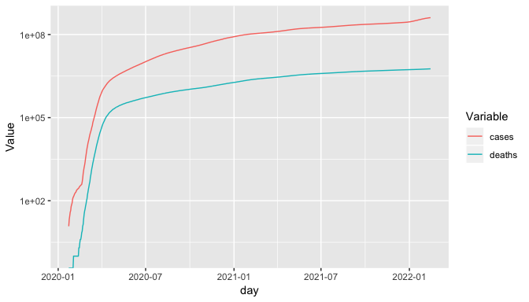

covid\_exploration
================
Juan Camilo Azuero
2/9/2022

In this project we are going to analyze ths distribution of shooting
incidents over time in New York City.

## Import libraries

``` r
library("tidyverse")
library("zoo")
library("tidyr")
library("dplyr")
```

## Import data

Data is imported from a public repository of the Jhon Hopkins university

``` r
base_url <- "https://github.com/CSSEGISandData/COVID-19/raw/master/csse_covid_19_data/"
access_type <- "?accessType=DOWNLOAD"
confirmed_filename <- "csse_covid_19_time_series/time_series_covid19_confirmed_global.csv"
deaths_filename <- "csse_covid_19_time_series/time_series_covid19_deaths_global.csv"
recovered_filename <- "csse_covid_19_time_series/time_series_covid19_recovered_global.csv"
regions_filename <- "UID_ISO_FIPS_LookUp_Table.csv"

cases <- read_csv(paste(base_url,confirmed_filename,access_type,sep=""))
deaths <- read_csv(paste(base_url,deaths_filename,access_type,sep=""))
regions <- read_csv(paste(base_url,regions_filename,access_type,sep=""))
```

## Initial transformations

``` r
colnames(cases)[colnames(cases) == "Country/Region"] <- "Country"
colnames(deaths)[colnames(deaths) == "Country/Region"] <- "Country"
colnames(regions)[colnames(regions) == "Country_Region"] <- "Country"
# Delete info from places that are not countries, delete unnecesary columns
# and transform data into long format
cases <- cases %>% 
    filter(is.na(cases["Province/State"])) %>% 
    select(-c("Province/State","Lat","Long")) %>%
    gather("day","cases",-c("Country"))
deaths <- deaths %>% 
    filter(is.na(deaths["Province/State"])) %>% 
    select(-c("Province/State","Lat","Long")) %>%
    gather("day","deaths",-c("Country"))
regions <- regions %>% filter(is.na(regions["Province_State"])) %>% select("Country","Population")
# Merge datasets into summary
summary <- merge(cases,deaths,by=c("Country","day"))
summary <- merge(summary,regions,by="Country", all.y = FALSE)
summary <- summary %>% filter(!is.na(summary['Population']))

summary$day <- as.Date(summary$day, format = "%m/%d/%y")
summary <- summary[order(summary["Country"], summary["day"]),]
# Obtains daily info from cumulative columns
summary_aux <- summary %>% select("Country","day","cases","deaths") %>% mutate(day = day+1)
colnames(summary_aux)[colnames(summary_aux) == "cases"] <- "cases_lag"
colnames(summary_aux)[colnames(summary_aux) == "deaths"] <- "deaths_lag"
summary <- merge(summary,summary_aux,by=c("Country","day"), all.y=FALSE)
summary['cases_day'] = summary['cases']-summary['cases_lag']
summary['deaths_day'] = summary['deaths']-summary['deaths_lag']
summary <- summary %>% select(-c("cases_lag","deaths_lag"))
# Normalize per million
summary['cases_per_million'] = 1000000*summary['cases']/summary['Population']
summary['deaths_per_million'] = 1000000*summary['deaths']/summary['Population']
summary['cases_day_per_million'] = 1000000*summary['cases_day']/summary['Population']
summary['deaths_day_per_million'] = 1000000*summary['deaths_day']/summary['Population']
# Global summary
global_summary <- summary %>% group_by(day) %>% summarize(cases=sum(cases), deaths=sum(deaths),
                                                         cases_day=sum(cases_day), deaths_day=sum(deaths_day))
global_summary["cases_day_wa"] = rollmean(global_summary["cases_day"],7,c(NA,NULL,NA))
global_summary["deaths_day_wa"] = rollmean(global_summary["deaths_day"],7,c(NA,NULL,NA))
global_summary["mortality_rate"] <- global_summary["deaths"]/global_summary["cases"]
```

## Global plots

``` r
global_summary %>% select("day","cases","deaths") %>% gather("Variable","Value",-c("day")) %>% 
    ggplot(aes(x=day, y=Value,color=Variable)) + geom_line() + xlab("day") + scale_y_continuous(trans='log2')
```

<!-- -->

``` r
global_summary %>% select("day","cases_day_wa") %>% 
    ggplot(aes(x=day, y=cases_day_wa)) + geom_line() + xlab("day")
```

<!-- -->

``` r
global_summary %>% select("day","deaths_day_wa") %>% 
    ggplot(aes(x=day, y=deaths_day_wa)) + geom_line() + xlab("day")
```

<!-- -->

``` r
global_summary %>% select("day","mortality_rate") %>% 
    ggplot(aes(x=day, y=mortality_rate)) + geom_line() + xlab("day")
```

<!-- -->

## Analysis by country

``` r
summary_total <- summary %>% group_by(Country) %>% summarize(cases=sum(cases_day), deaths=sum(deaths_day),
                                                     population=mean(Population))
summary_total["mortality_rate"] <- summary_total["deaths"]/summary_total["cases"]
summary_total["deaths_per_million"] <- 1000000*summary_total["deaths"]/summary_total["population"]
summary_total["cases_per_million"] <- 1000000*summary_total["cases"]/summary_total["population"]
summary_total_big <- summary_total %>% filter(population > 1000000)
```

### Session info

``` r
sessionInfo()
```

    ## R version 3.6.1 (2019-07-05)
    ## Platform: x86_64-apple-darwin13.4.0 (64-bit)
    ## Running under: macOS  10.16
    ## 
    ## Matrix products: default
    ## BLAS/LAPACK: /opt/anaconda3/envs/R_maestria/lib/R/lib/libRblas.dylib
    ## 
    ## locale:
    ## [1] C
    ## 
    ## attached base packages:
    ## [1] stats     graphics  grDevices utils     datasets  methods   base     
    ## 
    ## other attached packages:
    ##  [1] zoo_1.8-6       forcats_0.4.0   stringr_1.4.0   dplyr_0.8.0.1  
    ##  [5] purrr_0.3.2     readr_1.3.1     tidyr_0.8.3     tibble_2.1.1   
    ##  [9] ggplot2_3.1.1   tidyverse_1.2.1
    ## 
    ## loaded via a namespace (and not attached):
    ##  [1] Rcpp_1.0.1       cellranger_1.1.0 pillar_1.3.1     compiler_3.6.1  
    ##  [5] plyr_1.8.4       tools_3.6.1      digest_0.6.18    lubridate_1.7.4 
    ##  [9] jsonlite_1.6     evaluate_0.13    nlme_3.1-139     gtable_0.3.0    
    ## [13] lattice_0.20-38  pkgconfig_2.0.2  rlang_0.3.4      cli_1.1.0       
    ## [17] rstudioapi_0.10  curl_3.3         yaml_2.2.0       haven_2.1.0     
    ## [21] xfun_0.6         withr_2.1.2      xml2_1.2.0       httr_1.4.0      
    ## [25] knitr_1.22       hms_0.4.2        generics_0.0.2   grid_3.6.1      
    ## [29] tidyselect_0.2.5 glue_1.3.1       R6_2.4.0         readxl_1.3.1    
    ## [33] rmarkdown_1.12   modelr_0.1.4     magrittr_1.5     backports_1.1.4 
    ## [37] scales_1.0.0     htmltools_0.3.6  rvest_0.3.3      assertthat_0.2.1
    ## [41] colorspace_1.4-1 labeling_0.3     stringi_1.4.3    lazyeval_0.2.2  
    ## [45] munsell_0.5.0    broom_0.5.2      crayon_1.3.4
